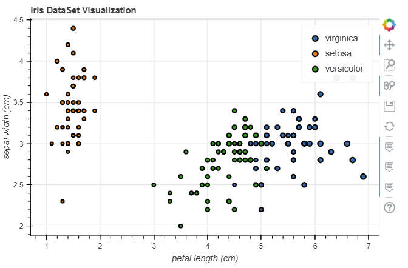
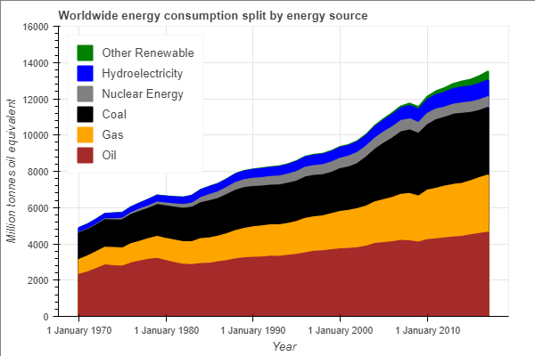
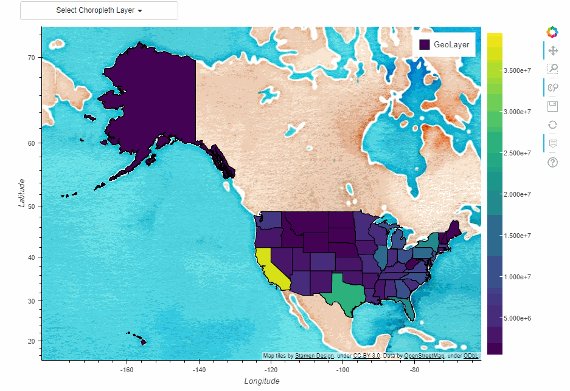
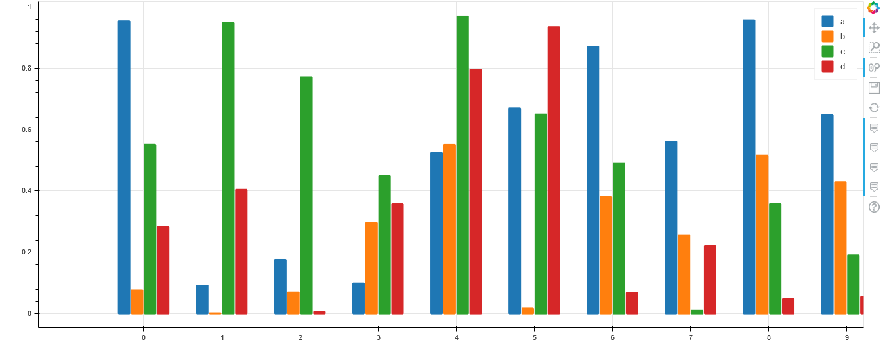

**Pandas Bokeh** provides a [Bokeh](https://bokeh.pydata.org/en/latest/) plotting backend for [Pandas](https://pandas.pydata.org/), [GeoPandas](http://geopandas.org/) and [Pyspark](https://spark.apache.org/docs/latest/api/python/index.html) **DataFrames**, similar to the already existing [Visualization feature of Pandas](https://pandas.pydata.org/pandas-docs/stable/visualization.html). Importing the library adds a complementary plotting method ***plot_bokeh()*** on **DataFrames** and **Series**.

With **Pandas Bokeh**, creating stunning, interactive, HTML-based visualization is as easy as calling:
```python
df.plot_bokeh()
```
---
```diff
- 26.07.2019: New in Pandas Bokeh 0.3
```

Native support as a Pandas Plotting backend for [Pandas >= 0.25](https://pandas.pydata.org/pandas-docs/stable/whatsnew/v0.25.0.html). When **Pandas Bokeh** is installed, switchting the default Pandas plotting backend to Bokeh can be done via:

    pd.set_option('plotting.backend', 'pandas_bokeh')

More details about the new Pandas backend can be found [below.](#pandas_backend)

---

For more information have a look at the [Examples](#Examples) below or at  notebooks on the [Github Repository](https://github.com/PatrikHlobil/Pandas-Bokeh/tree/master/Documentation) of this project. 

<div align="center">


    
      <meta charset="utf-8">
      <title>Bokeh Plot</title>
      
      
        
          
        
        
          
        <script type="text/javascript" src="https://cdn.pydata.org/bokeh/release/bokeh-1.3.4.min.js"></script>
        <script type="text/javascript" src="https://cdn.pydata.org/bokeh/release/bokeh-gl-1.3.4.min.js"></script>
        <script type="text/javascript">
            Bokeh.set_log_level("info");
        </script>
        
      
      
    
  
    
      
        
          
          
            
              <div class="bk-root" id="25699f95-ad16-45f4-9488-d4b2236b877c" data-root-id="1726"></div>
            
          
        
      
      
        <script type="application/json" id="2168">
          {"26997130-9f35-4817-9da3-e7818aaf136d":{"roots":{"references":[{"attributes":{"source":{"id":"1651","type":"ColumnDataSource"}},"id":"1656","type":"CDSView"},{"attributes":{},"id":"1564","type":"Selection"},{"attributes":{"fill_color":{"value":"#ff7f0e"},"line_color":{"value":"#ff7f0e"},"line_width":{"value":2},"top":{"field":"2016"},"width":{"value":0.2},"x":{"field":"__x__values","transform":{"id":"1372","type":"Dodge"}}},"id":"1374","type":"VBar"},{"attributes":{"children":[{"id":"1725","type":"ToolbarBox"},{"id":"1723","type":"GridBox"}]},"id":"1726","type":"Column"},{"attributes":{"source":{"id":"1320","type":"ColumnDataSource"}},"id":"1377","type":"CDSView"},{"attributes":{},"id":"1565","type":"UnionRenderers"},{"attributes":{"range":{"id":"1324","type":"DataRange1d"}},"id":"1372","type":"Dodge"},{"attributes":{},"id":"1665","type":"Selection"},{"attributes":{"label":{"value":"c"},"renderers":[{"id":"1655","type":"GlyphRenderer"}]},"id":"1667","type":"LegendItem"},{"attributes":{},"id":"1431","type":"ResetTool"},{"attributes":{"callback":null,"data":{"__x__values":{"__ndarray__":"ZmZmZmZm/j+amZmZmZn5P5qZmZmZmfk/ZmZmZmZm/j9mZmZmZmb2P2ZmZmZmZvY/AAAAAAAA+D8AAAAAAAD4PwAAAAAAAPg/MzMzMzMz8z9mZmZmZmb2P2ZmZmZmZvY/zczMzMzM9D8zMzMzMzP7PwAAAAAAAPg/ZmZmZmZm9j8AAAAAAAD4P5qZmZmZmfk/zczMzMzM9D9mZmZmZmb2P2ZmZmZmZvY/ZmZmZmZm9j9mZmZmZmb2P2ZmZmZmZvY/MzMzMzMz+z8AAAAAAADwP2ZmZmZmZvY/MzMzMzMz8z8AAAAAAAD4P83MzMzMzPQ/zczMzMzM9D+amZmZmZn5PwAAAAAAAPg/MzMzMzMz+z8AAAAAAAD4P2ZmZmZmZvY/mpmZmZmZ+T8AAAAAAAD4P5qZmZmZmfk/mpmZmZmZ+T8AAAAAAAD4PwAAAAAAAPg/ZmZmZmZm9j/NzMzMzMz0P83MzMzMzPQ/mpmZmZmZ8T8AAAAAAAD4P83MzMzMzPQ/AAAAAAAA+D8zMzMzMzP7Pw==","dtype":"float64","shape":[50]},"__x__values_original":{"__ndarray__":"ZmZmZmZm/j+amZmZmZn5P5qZmZmZmfk/ZmZmZmZm/j9mZmZmZmb2P2ZmZmZmZvY/AAAAAAAA+D8AAAAAAAD4PwAAAAAAAPg/MzMzMzMz8z9mZmZmZmb2P2ZmZmZmZvY/zczMzMzM9D8zMzMzMzP7PwAAAAAAAPg/ZmZmZmZm9j8AAAAAAAD4P5qZmZmZmfk/zczMzMzM9D9mZmZmZmb2P2ZmZmZmZvY/ZmZmZmZm9j9mZmZmZmb2P2ZmZmZmZvY/MzMzMzMz+z8AAAAAAADwP2ZmZmZmZvY/MzMzMzMz8z8AAAAAAAD4P83MzMzMzPQ/zczMzMzM9D+amZmZmZn5PwAAAAAAAPg/MzMzMzMz+z8AAAAAAAD4P2ZmZmZmZvY/mpmZmZmZ+T8AAAAAAAD4P5qZmZmZmfk/mpmZmZmZ+T8AAAAAAAD4PwAAAAAAAPg/ZmZmZmZm9j/NzMzMzMz0P83MzMzMzPQ/mpmZmZmZ8T8AAAAAAAD4P83MzMzMzPQ/AAAAAAAA+D8zMzMzMzP7Pw==","dtype":"float64","shape":[50]},"category":["setosa","setosa","setosa","setosa","setosa","setosa","setosa","setosa","setosa","setosa","setosa","setosa","setosa","setosa","setosa","setosa","setosa","setosa","setosa","setosa","setosa","setosa","setosa","setosa","setosa","setosa","setosa","setosa","setosa","setosa","setosa","setosa","setosa","setosa","setosa","setosa","setosa","setosa","setosa","setosa","setosa","setosa","setosa","setosa","setosa","setosa","setosa","setosa","setosa","setosa"],"y":{"__ndarray__":"ZmZmZmZmDkAzMzMzMzMLQAAAAAAAAAhAMzMzMzMzC0DNzMzMzMwMQAAAAAAAAAhAmpmZmZmZDUBmZmZmZmYOQM3MzMzMzAhAmpmZmZmZCUDNzMzMzMwMQAAAAAAAAAhAAAAAAAAACEAzMzMzMzMPQJqZmZmZmQ1AmpmZmZmZCUAzMzMzMzMLQGZmZmZmZg5AZmZmZmZmAkAzMzMzMzMLQAAAAAAAAAxAZmZmZmZmCkAAAAAAAAAIQDMzMzMzMwtAMzMzMzMzC0DNzMzMzMwMQM3MzMzMzBBAAAAAAAAAEEAzMzMzMzMLQAAAAAAAAAxAmpmZmZmZCUAAAAAAAAAMQJqZmZmZmQ1AZmZmZmZmCkCamZmZmZkRQDMzMzMzMwdAMzMzMzMzC0AAAAAAAAAMQM3MzMzMzAhAmpmZmZmZCUDNzMzMzMwIQDMzMzMzMwtAAAAAAAAADEAzMzMzMzMPQJqZmZmZmQlAAAAAAAAACEDNzMzMzMwIQAAAAAAAAAxAZmZmZmZmEEBmZmZmZmYOQA==","dtype":"float64","shape":[50]}},"selected":{"id":"1708","type":"Selection"},"selection_policy":{"id":"1709","type":"UnionRenderers"}},"id":"1569","type":"ColumnDataSource"},{"attributes":{},"id":"1666","type":"UnionRenderers"},{"attributes":{"fill_alpha":{"value":0.1},"fill_color":{"value":"#1f77b4"},"line_alpha":{"value":0.1},"line_color":{"value":"#1f77b4"},"line_width":{"value":2},"top":{"field":"2016"},"width":{"value":0.2},"x":{"field":"__x__values","transform":{"id":"1372","type":"Dodge"}}},"id":"1375","type":"VBar"},{"attributes":{"source":{"id":"1569","type":"ColumnDataSource"}},"id":"1574","type":"CDSView"},{"attributes":{"data_source":{"id":"1320","type":"ColumnDataSource"},"glyph":{"id":"1374","type":"VBar"},"hover_glyph":null,"muted_glyph":null,"nonselection_glyph":{"id":"1375","type":"VBar"},"selection_glyph":null,"view":{"id":"1377","type":"CDSView"}},"id":"1376","type":"GlyphRenderer"},{"attributes":{"fill_color":{"value":"#2ca02c"},"line_width":{"value":2},"size":{"units":"screen","value":10},"x":{"field":"__x__values"},"y":{"field":"y"}},"id":"1571","type":"Scatter"},{"attributes":{"dimension":1,"ticker":{"id":"1605","type":"BasicTicker"}},"id":"1608","type":"Grid"},{"attributes":{"formatter":{"id":"1632","type":"BasicTickFormatter"},"ticker":{"id":"1605","type":"BasicTicker"}},"id":"1604","type":"LinearAxis"},{"attributes":{"fill_alpha":{"value":0.1},"fill_color":{"value":"#1f77b4"},"line_alpha":{"value":0.1},"line_color":{"value":"#1f77b4"},"line_width":{"value":2},"size":{"units":"screen","value":10},"x":{"field":"__x__values"},"y":{"field":"y"}},"id":"1572","type":"Scatter"},{"attributes":{},"id":"1383","type":"Selection"},{"attributes":{"data_source":{"id":"1569","type":"ColumnDataSource"},"glyph":{"id":"1571","type":"Scatter"},"hover_glyph":null,"muted_glyph":null,"nonselection_glyph":{"id":"1572","type":"Scatter"},"selection_glyph":null,"view":{"id":"1574","type":"CDSView"}},"id":"1573","type":"GlyphRenderer"},{"attributes":{"label":{"value":" 2016"},"renderers":[{"id":"1376","type":"GlyphRenderer"}]},"id":"1385","type":"LegendItem"},{"attributes":{},"id":"1384","type":"UnionRenderers"},{"attributes":{"callback":null,"mode":"vline","renderers":[{"id":"1376","type":"GlyphRenderer"}],"tooltips":[["fruits","@__x__values_original"],["2016","@{2016}"]]},"id":"1386","type":"HoverTool"},{"attributes":{},"id":"1583","type":"Selection"},{"attributes":{"label":{"value":"setosa "},"renderers":[{"id":"1573","type":"GlyphRenderer"}]},"id":"1585","type":"LegendItem"},{"attributes":{},"id":"1584","type":"UnionRenderers"},{"attributes":{},"id":"1430","type":"SaveTool"},{"attributes":{"callback":null,"renderers":[{"id":"1573","type":"GlyphRenderer"}],"tooltips":[["petal length (cm)","@__x__values_original"],["sepal width (cm)","@y"],["species","@category"]]},"id":"1586","type":"HoverTool"},{"attributes":{"range":{"id":"1324","type":"DataRange1d"},"value":0.25},"id":"1388","type":"Dodge"},{"attributes":{"callback":null},"id":"1506","type":"DataRange1d"},{"attributes":{"fill_color":{"value":"#2ca02c"},"line_color":{"value":"#2ca02c"},"line_width":{"value":2},"top":{"field":"2017"},"width":{"value":0.2},"x":{"field":"__x__values","transform":{"id":"1388","type":"Dodge"}}},"id":"1390","type":"VBar"},{"attributes":{},"id":"1595","type":"LinearScale"},{"attributes":{"source":{"id":"1320","type":"ColumnDataSource"}},"id":"1393","type":"CDSView"},{"attributes":{"callback":null},"id":"1591","type":"DataRange1d"},{"attributes":{"fill_alpha":{"value":0.1},"fill_color":{"value":"#1f77b4"},"line_alpha":{"value":0.1},"line_color":{"value":"#1f77b4"},"line_width":{"value":2},"top":{"field":"2017"},"width":{"value":0.2},"x":{"field":"__x__values","transform":{"id":"1388","type":"Dodge"}}},"id":"1391","type":"VBar"},{"attributes":{"data_source":{"id":"1320","type":"ColumnDataSource"},"glyph":{"id":"1390","type":"VBar"},"hover_glyph":null,"muted_glyph":null,"nonselection_glyph":{"id":"1391","type":"VBar"},"selection_glyph":null,"view":{"id":"1393","type":"CDSView"}},"id":"1392","type":"GlyphRenderer"},{"attributes":{"callback":null},"id":"1504","type":"DataRange1d"},{"attributes":{"text":"Normal distributions"},"id":"1589","type":"Title"},{"attributes":{"callback":null,"mode":"vline","renderers":[{"id":"1392","type":"GlyphRenderer"}],"tooltips":[["fruits","@__x__values_original"],["2017","@{2017}"]]},"id":"1402","type":"HoverTool"},{"attributes":{"label":{"value":" 2017"},"renderers":[{"id":"1392","type":"GlyphRenderer"}]},"id":"1401","type":"LegendItem"},{"attributes":{},"id":"1689","type":"UnionRenderers"},{"attributes":{"axis_label":"petal length (cm)","formatter":{"id":"1544","type":"BasicTickFormatter"},"ticker":{"id":"1513","type":"BasicTicker"}},"id":"1512","type":"LinearAxis"},{"attributes":{"callback":null},"id":"1593","type":"DataRange1d"},{"attributes":{"fill_alpha":{"value":0.1},"fill_color":{"value":"#1f77b4"},"line_alpha":{"value":0.1},"line_color":{"value":"#1f77b4"},"line_width":{"value":2},"size":{"units":"screen","value":10},"x":{"field":"__x__values"},"y":{"field":"y"}},"id":"1539","type":"Scatter"},{"attributes":{},"id":"1413","type":"LinearScale"},{"attributes":{},"id":"1510","type":"LinearScale"},{"attributes":{"ticker":{"id":"1513","type":"BasicTicker"}},"id":"1516","type":"Grid"},{"attributes":{},"id":"1597","type":"LinearScale"},{"attributes":{"formatter":{"id":"1630","type":"BasicTickFormatter"},"major_label_orientation":1.5707963267948966,"ticker":{"id":"1668","type":"FixedTicker"}},"id":"1599","type":"LinearAxis"},{"attributes":{},"id":"1513","type":"BasicTicker"},{"attributes":{},"id":"1709","type":"UnionRenderers"},{"attributes":{},"id":"1415","type":"LinearScale"},{"attributes":{},"id":"1600","type":"BasicTicker"},{"attributes":{},"id":"1605","type":"BasicTicker"},{"attributes":{"callback":null,"end":400},"id":"1411","type":"Range1d"},{"attributes":{"axis_label":"Stock price [$]","formatter":{"id":"1450","type":"BasicTickFormatter"},"ticker":{"id":"1497","type":"FixedTicker"}},"id":"1422","type":"LinearAxis"},{"attributes":{"axis_label":"Date","formatter":{"id":"1499","type":"DatetimeTickFormatter"},"ticker":{"id":"1418","type":"DatetimeTicker"}},"id":"1417","type":"DatetimeAxis"},{"attributes":{},"id":"1721","type":"UnionRenderers"},{"attributes":{},"id":"1423","type":"BasicTicker"},{"attributes":{"tools":[{"id":"1427","type":"PanTool"},{"id":"1428","type":"WheelZoomTool"},{"id":"1429","type":"BoxZoomTool"},{"id":"1430","type":"SaveTool"},{"id":"1431","type":"ResetTool"},{"id":"1432","type":"HelpTool"},{"id":"1466","type":"HoverTool"},{"id":"1495","type":"HoverTool"},{"id":"1342","type":"PanTool"},{"id":"1343","type":"WheelZoomTool"},{"id":"1344","type":"BoxZoomTool"},{"id":"1345","type":"SaveTool"},{"id":"1346","type":"ResetTool"},{"id":"1347","type":"HelpTool"},{"id":"1370","type":"HoverTool"},{"id":"1386","type":"HoverTool"},{"id":"1402","type":"HoverTool"},{"id":"1522","type":"PanTool"},{"id":"1523","type":"WheelZoomTool"},{"id":"1524","type":"BoxZoomTool"},{"id":"1525","type":"SaveTool"},{"id":"1526","type":"ResetTool"},{"id":"1527","type":"HelpTool"},{"id":"1550","type":"HoverTool"},{"id":"1567","type":"HoverTool"},{"id":"1586","type":"HoverTool"},{"id":"1609","type":"PanTool"},{"id":"1610","type":"WheelZoomTool"},{"id":"1611","type":"BoxZoomTool"},{"id":"1612","type":"SaveTool"},{"id":"1613","type":"ResetTool"},{"id":"1614","type":"HelpTool"}]},"id":"1724","type":"ProxyToolbar"},{"attributes":{},"id":"1508","type":"LinearScale"},{"attributes":{"num_minor_ticks":5,"tickers":[{"id":"1451","type":"AdaptiveTicker"},{"id":"1452","type":"AdaptiveTicker"},{"id":"1453","type":"AdaptiveTicker"},{"id":"1454","type":"DaysTicker"},{"id":"1455","type":"DaysTicker"},{"id":"1456","type":"DaysTicker"},{"id":"1457","type":"DaysTicker"},{"id":"1458","type":"MonthsTicker"},{"id":"1459","type":"MonthsTicker"},{"id":"1460","type":"MonthsTicker"},{"id":"1461","type":"MonthsTicker"},{"id":"1462","type":"YearsTicker"}]},"id":"1418","type":"DatetimeTicker"},{"attributes":{},"id":"1720","type":"Selection"},{"attributes":{"ticker":{"id":"1418","type":"DatetimeTicker"}},"id":"1421","type":"Grid"},{"attributes":{},"id":"1609","type":"PanTool"},{"attributes":{},"id":"1688","type":"Selection"},{"attributes":{},"id":"1610","type":"WheelZoomTool"},{"attributes":{"callback":null},"id":"1326","type":"DataRange1d"},{"attributes":{"dimension":1,"ticker":{"id":"1423","type":"BasicTicker"}},"id":"1426","type":"Grid"},{"attributes":{"dimension":1,"ticker":{"id":"1518","type":"BasicTicker"}},"id":"1521","type":"Grid"},{"attributes":{"callback":null,"data":{"Apple":{"__ndarray__":"5feRo+DISUDTknCY/VRKQLEPmR9ickpAC8/t21U1SkA4m/bMd6RKQL+v+RaY7EpAEqhXV/B0S0BpmfU1ANxLQByfn4MaeExAEx+bfFpJTEAONF1qvQdNQKJKWevKNk1Anr+qoC9WTkANKZXhuhNOQDsjyoCxB09A6YshNMk2T0CD7jYZKvlOQBD2/q/80E5A1BddG769TkCMMJO8ywlPQP5/5JF6Yk9AJljPIM4uT0DE3gqjckFPQEPfVY61NFBAbnQ+5yauUEAIdwnp9NRQQPuC29ZE4lBAfUdpttT0UEChdPre+SZRQH0Btrdl8FBAi1bzI87qUEB2b8ZW5YpQQFRdmH1Tr1BA9DnLbaDjUEDn8Y8ulc9QQBwxOKkyP1FArnsT/6D7UEC3qlb1yahQQLzOLagIwlBA3D11mO0PUUBSO8pYlIZRQNjkXkQXdFFAh5NipwHEUUAKYNYCbMxRQGSLJPdAzFFAebI7IbAPUkDrFF8RUURSQKIuH71O6lFAIJblp69TUkArjkNa5LZSQHp9zWm8mVJARYLTifK9UkBO60oCcuhSQKzI/SoCBFNAoDeQP6vrUkCdKqqmkMtSQBFzzUDP1FJADbp/hr4qU0DiU3smalhTQBZ5/EiTS1NA+LOnE9iHU0DgkKDVatxSQLIc4X3RMFNABCEZTVvMUkDKsUlZCsBSQDrXDPVCg1JAYK4JLUg7UkD+ySdxdJBSQKri0OdmfVJAQfUcTnWeUkDTFp/WVaZSQDsdjfS+z1JA1Z+Y4orfUkDuudueT5hSQMy1cbzz4lJAE5PpTjvOUkAMleiMfXVSQDnYdJf4ZFJA+uftUebPUkDlKhCiMRFTQMmBs5jCBVNAJhtlo0n6UkAroeQ/lfBSQAaR8vdfgFNAoMYF4bKjU0C8gRr2GcpTQIbBy2frFlRAIQDNARUxVEAi7/gjYitUQF3qsWyyKVRAjRztlv4vVEBuETsFfjhUQHaHasjwcVRAAcnuJCWAVEDLtdH/6blUQFnWn9Ggv1RAD5kydYrPVEBJ88A3iVpUQNjYQ5wPoFRAYgjywR3BVEAJ2Gtv3gtVQFVflXdjXVRAuyikreztVEDTSvzr3u9UQGxXSausQVVA+nBgIQAKVUD0ChkZGTxVQAbkqjePA1VAz1uzqoTmVEBiiL5v5WtVQPrPd5OSalVA67y3Rl6DVUCk+PW+7sVVQBSRKkeJ8FVAPDh2BQsFVkDQxojSRydWQC4u0an6y1ZAcAm/6ivTVkBcV/YA7OpWQOz7kzQLOVdANcwZbK2KV0A4UL0Bh+FXQPYJJT5JFVhAYEi/hwPXV0AcPNbzbkpYQLgUc4LyC1hAIJ1FKzIqWEDgsbxkzQRYQAaEsdSTC1hAl7LdjX8rWEBkc2bz8UpYQE3E/PrTcFhAkktMTvziWECFh7ZK5ApZQNGwPU8lBllA+FeWMbpOWUC2yxjCu6VZQD1LaOkLYllAPwiX/iiTWUBUYehJ6spZQEqby0nAwllAeLMQJq0lWkAyD//q8yZaQGJXf6TeOVpAvCFVUKw5WkCWLUbXjEVaQHbZ+L9EClpAkJl5PPy4WUDvpB7j6SlaQDS5bY2W/llA1jI23ATKWUAH6h//FEtZQFaQ/YYRLVlA/o3bTUXjWEAUt0pcPVdZQFg21Hu/ollAlHnDG5aBWUDToPNLnxxaQGlzitJVZlpAUU+mEG1cWkB6L/EUWMdZQJrWNyrYZFpAGOCKsMoWWkDIMK3BXbhZQOUanNSwBFpAgBORA7erWkCgN0Q4MA9bQLtuOZYoPltABiprUhpvW0B69WP2mbBbQIFSSocN7FtASt5I2e0IXEBQXhJcehpcQLIgJR1aIVxAnFMicPr7W0Caazcj5fRbQHnfWwNtk1tA9bS/GAOYW0BYNMtMn2NbQMveYl/fJ1tAz+/SCUQ+W0D090LiO6JbQEWW9Nzi51tAhvCrD0GOW0CokxlGzFlbQI4DIybjoFtAXBkDW+NsW0Bs+Pg+ZGlbQOwmX5R5l1tAqAEIgWFkW0C0Qp5BAXZbQCIq1NyBK1tAdlXLVeYPW0CLqR7sPi9bQO6tz5cs1FpArFJynD77WkAzXTol3gRbQHTXu2sbM1tAzqZcT1FMW0AuNLSqgK5bQJ8qBKBlwVtAcEhRhsuwW0DoVueGgMNbQLYXrjMn8VtAdDRZASn/W0Bg1utWowxcQHKeDjCX6ltARFvEfwvLW0DUiot+KHxbQG4U9dYC91tA9vsXqkiyW0CwH7ti0ZBbQCR/8Ue4bVtARmuEAOCxW0AJ8ZTT4KlbQAoE1BydBFxA9cUW7GPkW0AcfBk+IAFcQLbsSjKL1ltASjaKmbZqXEDuqWtElilcQIVBWKZLSFxAHHruurx7XEBgOdKxGaFcQP9+uzgfoFxAv6buhLGiXED7kD6bYLBcQD5J12fZsVxAV1mO4Wr6XEDSJrRexZJdQN8hXLT4eV1AAGbsIS8tXUD12tr/aTJdQMCJujxl4l1Alhr0HNe5XUBEnM6uny1eQFPsuGngo15ATZsGtFOLXkDI9LUzn7peQINZ3CG4LV9A8kqKyFUgX0CVL02aLx5fQJa8ZZ/WA19A4OLcIMbNXkDfcSOlGa9eQEMGQ+Ola15AO3tel7V4XkBnAz+hT1JeQOtxHEInbF5Aqmp1vnQTXkBmj2sqgzNeQCU89fu8c15A7+JB5gT/XUDEjee41iFeQFrhjCFKe15AYyoRp8A4XkAlqcxbra5eQOkllthf1F5A0Eg4NiKyXkCLMm/FcbleQIC36q0O6F5A4mdQO833XkCPgWh9KSVfQMVxJ3Qe9V5AmaOditYKX0ByMu2FPbteQMVJsXkAv15AuLHvIQiQXkB8nG991mteQJNGquvTxV5A0Mq/OY0WX0AP4uKfakhfQCClxHNjDV9AGtI4sgQEX0Bx929eiVxfQNJj74l8cF9A7hdk2+YHYEBmRoaO7RlgQECijXaDJWBAiZ8u0g8hYEDCAJltxipgQM7uAwlWK2BAkgVigG9HYEBLZGZyfWtgQEzy3kLHV2BAHiDccJ4yYEDCxtvFmfpfQFXly/3+EmBAKp5NtEHqX0BwjFsGWmtfQJw51cYZj19ANjEuLsQcYEDJamUWAyJgQJY916RIQmBA5KFIoVdKYEBUYH0qnkxgQCIJauF3b2BAhs5pl55rYEBDXZS1nXlgQFIBnrJZiWBAOuY5V2l5YECs4KnKmJ5gQPrGTClwnmBA/syqvLGLYED52jJ3TaJgQMAbHdv9imBAcM4fW1WRYEAuzQpLe5ZgQDOb8JarvmBAeNsg9UzTYEAwu6GT8NdgQDCgs1uM92BAPWAVlHkpYUBgT+zMw0BhQJTOxz+JRmFA9mOkU/8hYUBlwDuOWgVhQFRmecsGAWFAYpeUT/byYEACri1Ia/JgQGCQhf+r+WBAGreU4Q8QYUDZe8T+PhNhQPi7gA5BKGFAbqf93sEvYUASlyt9+/VgQKcT6Rdd3WBALas+XjHeYEDB4FUw7LxgQHZT6XGP1WBAacXr/vsLYUCGpJ27bDhhQA/oT9kIN2FAUJRzhC1sYUDB84sKYHZhQHBB3kUHcWFArOUV69ZiYUD8fwS6mV5hQNTzEGyeV2FAAbigHINiYUCSaIMsF21hQPQQUsSgcmFAGsnqzQyGYUBQPfk3l7FhQJ73Kptq1WFAaHVD9larYUCyoEnhDV9hQLeD/3dkgmFAkiRxoxdcYUD44REAV1phQKh6CRNWOmFA4Zb/4xwGYUCuVXsx4RxhQMiiFdWcOmFAbA/8spotYUCSr0yFIeBgQBqegFMX1GBAAl3lnxHmYEBMtWEFL7xgQLEa2L59x2BAyHSa93DMYEBsM8Upa+RgQEyw0Wev7WBAq/8uqvzTYEAYaVeet/9gQCYAkpUVAGFAHAOki6YEYUBhubbaOexgQCVLSyB742BAWFBadpvMYECabwRUg8xgQMFJuEi6CGFAeIxVT0TiYEC2V6mnErRgQLzPSx+X6GBAT2WR+1TnYEB8CS2UXNdgQBL+NR4U/mBAfuQ1jiPwYEBVKvndAjBhQAkFaRMlS2FArmTdvvhAYUCuWvANcothQPhEhK2AfWFAlXgmkLCaYUDTGwYCtalhQFRgNoPN2GFAhLNhDTYQYkAecMnerBZiQOBO1YIBBGJA8DgsPioYYkCQoN4J6wdiQLt0zVjJTWJA8Db8e5hXYkAS1ABpWFFiQEYbhPOxXGJA74HD7gY3YkCRlEccYB1iQOwnjIo6SWJAl44856U5YkCuip0/lh1iQCRC2SUzNGJAqiyHE5VfYkDyy71hB3xiQItP+qRXoWJADPR7npCOYkD2pT3JgWZiQEKh81n9m2JAhk4fmRqXYkD1CgBqhJRiQJJU1551xGJAkMyO5bLbYkBhzlkruu9iQEA8MIJyOmNA5Ap8cksrY0Dx1Rr0bE5jQDQ8IqWwVWNAEvzOl7ljY0ByE0RyE5pjQMq94EbEr2NAsqpqo27GY0DWAypCMe5jQPNOqDT052NAiOJDCorSY0CYEGqai7ZjQDqmmdkPfWNAIc1V8EzEY0AGaYsYcKZjQMDF5znMpGNAIAwuNmGhY0CIS5cgqLBjQFaVW0kz0GNAJBLl7CzxY0BW5rf+9ONjQFIL7JIM5GNA2NDeG4jyY0ClIp54A/BjQOx4cnzjKGRASpFjMQo+ZEAK0KXz/lpkQB4cROqldWRA5Dknp6OgZEA9lLc436tkQF8C2DbQh2RA3DgSGQuaZECUp3/So4pkQEuqzggqf2RA3jcfK16XZEAKIsjSbsRkQJb5WbiNymRACCX2UeDZZEBW7kaByRVlQIoCIWXuImVAgkvqBaB7ZUCrh3BRKZNlQBA/I8pBYGVAznTdzc19ZUBqNMbkcI9lQGqVLjAnvmVAEZ+jhyLZZUCkRDzwJNplQKihlCBouGVAMufgcii3ZUBhBAygYaFlQIAf+Z0+lGVAiO0w5ISsZUACLJpjZedlQFBeoS13+WVAiz/qJKPYZUDSQCH4TexlQEjbFWoJGGZAv+58tvYJZkAuevV7HQtmQGQELXMGEWZArOLyM1n9ZUDIrGWOiBdmQP7dlWMaGWZAXq661vcrZkDm1JIkAhVmQA033R9zDGZA0qQ2gwEpZkDnS0PngyJmQKMjzNQ3X2ZAd73Ppt5XZkAwaKzof2RmQKbgPVXIh2ZAB1SMuNVfZkBan6rQ7SxmQCKpUEeMAWZAysjuAWQvZkCSvlvTKyNmQN9b8jt5emZAjYPOjtttZkAWA8gKNHlmQAOxl6X9r2ZAdyclM6D1ZkBleVWtCD1nQEPD1EAkaWdA7PpxA1qPZ0BUn1yiwKdnQEB9sJsZxmdAlVJN7+a5Z0BNn7fjKKVnQHKizuJ9qmdA1SugX3yqZ0BgBlsrbKFnQBoWhp0lvWdAoLCXHSjhZ0CJZhz8bOlnQGmQHY0lHmhAxK1YeQ3/Z0CmMt2nS/5nQN47VxbM7GdAa2IuD4K2Z0AXNg5hTblnQE9k3anYumdAN1rce7fwZ0CTx6+7VwpoQDJiFDwC72dAn3HamccvaEDqLvPySlxoQFYoJyJcdGhAm35pao1yaECZgVZUSlloQHI5/tnRUmhA6qkthRl7aEB4g/Ww2LxoQOADDZWr82hAayZZkXfpaEBpsD9NFMtoQLmY9hQH1WhAUaGmquChaEANHU+yqLFoQKQIFy1gsmhAXEqMC+eoaEDdPKngT3toQCfl/e0vkWhAm1Izr5SFaECNz5tdlWVoQDHnAG8cD2hAZMbnq6sTaEAA0LmY0lFoQGpvpkVsjGhAeFQpYTyDaEBeTsayZ3VoQCy6e4nYiWhAsYBNZ1ZvaEByCKFSb35oQGrLQbFjnGhAV7SPXhfJaEA4XRSMU8toQGtlG7E/ymhAMl0C5pezaECknQ+8kp5oQHBpPQ/EnGhANCJjKPataEANpg3iotBoQAzwjOFfvGhAs1M1oJTxaEAXaaU4WO5oQI2lBdIZ82hAqAtlTaHgaEBLpeyQfphoQCPhVU45umhA/vPTKz7XaEAS1QQtrtNoQAlTk5pD22hAsLVg0TbxaEBuhQwVp8RoQKMtArkpuWhA4CKc+gTYaEC8peB6UrVoQFx0UvInxGhAANjqdy+eaEDe71MajbJoQPPej8TZtmhAzud7P5uIaEBLaspuUbNoQBCsb0xAoWhA6ebBWcOMaEBKx7ANn5hoQN0ppVTRwmhAsNG5W8CnaEBYGZZHKq9oQIvAzshTwmhAm0Z1WPLdaEAfAw9lCOloQKlau1e64mhAR98VXa/NaEBt972x4dVoQNzZG18DuWhArovwTvhgaEBKyQs/YXRoQEtZpeu+lmhAnrkAa5JQaED6cxNYszVoQIBEgxj0TmhATJEXvTuWaEA/aX+4VpxoQGp0g497imhAdFu36RGKaEDAbmOKgbtoQLeBKHFGrGhAwhLiGSSYaEDpGC4bIo5oQCjJBRQRdWhAzT8pom5+aECZ/q2j3LdoQGYK3fGjx2hAaD8NTgHFaECPNk5tG8FoQHsoamiGlGhAuKawezm2aEBTvhh7LLloQPT5H6HWuGhAUBTjNHUkaUAMf/w6dTNpQJfWuDLXIGlAgV3gHaMYaUAor+7S00JpQA1VCmDkS2lAh3FXpE4jaUD37PqaKUZpQDhqHc84NmlAOQUigZt3aUC+Gu/lm59pQIgQxBO8lmlAJ4ShzSrFaUCWYMpQx8xpQBgcpuCB7WlA0tjicnUCakANpSy80OxpQH9KMmqp3WlAQspsfg8EakCJ94Gnyf5pQDdrKptP92lANDbH4S/eaUBT6z6lLvFpQENgWH2fOGpAeyZm5uYbakB8+x7yHSJqQKuNH3+/VGpACz7ctqNXakAYGR4vjmtqQGfHPrL/TmpAfrYrByViakA4hgqVmGFqQKhUg1KUhmpANcViBwSyakCg+8tfUgprQP5ZgV5PImtAUQC+7iwya0C7TgL41T1rQHyjc3j5N2tASGpc+D5Ia0Dc/IquO0RrQHf+p1oQT2tA85/NwKp+a0AirePL5WNrQB5mVVLQjWtAwNmrxGa9a0BbIN0wEL9rQGtndZiagGtAIeYz9Zdya0CeAsCTiaFrQJGWyeE+pmtA9s/zPLWLa0CviQ7D/oBrQFDa3cJVoWtAKkYaPkW4a0CnUwONELZrQBraTSrEr2tAoiHChauoa0B8LjzHl5BrQITZbpO5yWtAv6BBxNnEa0DFyoVePfFrQGMRXaFcJ2xAxnTmbr9MbEDKkVY9YERsQAxpizy8VmxATS6FqmZbbEAYEzIu7ENsQBWCwPi9U2xAeZXv6nMzbEAjEvsG5l5sQLL6uYV4VWxA4+zwD1lhbEC964Fl2m9sQGWbQxYCbWxA6Ogu7DiFbEDstN4md3tsQKt0lHXJnGxAOAdx1Sd3bECNMnjGo4BsQOBDIx8gxGxAEcMjDI6pbEB2X8KZTplsQN5XeSwxr2xAhm6b8mC6bEC0pA/zCctsQGliqwIi4GxA/h3oSeL5bEC9Wv2W1SJtQIl+2HZjNW1A5Xi2uBszbUA63dUVEk5tQNP7345OkG1ALKSWqYCRbUCvHFn1wXdtQM66oM2foG1AhX3eRzaibUAb42xpIGJtQGOWVCGvgm1ADjeYXP52bUAHa2FaiXltQPZLb5OZiW1AyScPyiKVbUBsSDJCR7FtQDlk7GTIqG1AM0CdZaS+bUAsyp7UxrttQLx/Vs7b2G1AbeVTif3xbUBz2QUQf9ltQBgEbhGwAW5AnHp1GPr1bUCAoVNYRhVuQCqVfc13Jm5AcJvn17pmbkDm45zZBGVuQHYFCeNHX25Ap4kCcRlkbkBIEcNu1l9uQNaMXDLgfm5A3CktBZhQbkDH4NLkUDRuQNSSoReWF25AajLwpm87bkCGpwijnXduQAF7/KC2eW5AqwYDSMB5bkCiw+LJboFuQCvCIYkNrG5AR+Z9TNGTbkDFF1Ko4qBuQK4D0h2IxW5AXxFNuAHbbkB5gptpg+ZuQGA4Q5/8C29AFsUXYuy6bkAn1IMtDtZuQOBZOqGQxm5Av4SguWyRbkDeYQUjOaduQC1XoMme2G5AtPoJc6nZbkCfMqQJmP1uQHsADnagNm9AhfBe4SRmb0DEghocEKBvQLqAGEJAvW9AMA6+2RrFb0Bcq8YvSJdvQE5MLRXZlG9Adqu72E1/b0BDWm/ZNspvQDvd/aEGym9ApuIJkWjTb0ABt4n5fupvQH7nVc5U8W9AFHTtpoEWcEDOoKuZQw9wQMAiTAgZFXBA1GphMfALcEA/asBmE/NvQPKv0W3w5G9A5rfdqTHpb0BJ9a915eBvQJsLfMkt0G9AZM3X352ob0DaRaq2ZatvQEbNKa+vgG9AKj3js3Keb0A2n2uwhqZvQHLbNxFTfW9A6bOfqt54b0CFTiekPWZvQLbXdPXkdW9Ac1ShkTqmb0ATb8bLqW9vQFN9ybrIeG9AV4jQjxl5b0C/rdbRBZRvQLz0afdIoG9AwBFEeamNb0DZsIFs5IhvQF0DIQXcdG9A/959T7ucb0B5KxmJ2qJvQFKOyboh5W9AHimub6Hob0CzLtrOZtdvQLrAhhlnrG9AglZjayR4b0Cy7F3R40pvQG+2ZcLgWG9Aau7v35hub0CzuYhmcEFvQOe3wzGFY29AsGMnmYBZb0A5pkDEo2NvQNy5zrernG9ANDEDRM++b0AcZEQaqLtvQOSajBiUpG9AgK1qECllb0AmWW9mllNvQJ6EEnZFUm9AN4JkIB84b0Bh62uCXDlvQNNzV7hCQW9AcXgCV4E/b0A1JKMoJTBvQLi79Wr7Om9AhFuEb5BOb0AtP8CGHDFvQIDFQIazY29A1VHLh/xlb0D0niiWB2xvQFr3SushiG9APBfPEAmVb0BWCgzN+bhvQHCC54+ax29A9a56HXK5b0D2/SgxdMpvQI0HTG1Lq29A8lBXYzW0b0Ag+dbOlbhvQPIL/41dt29AIBgjN7G4b0Dj1Hy/6YFvQDA3yjvLdW9AeQGAdTR+b0ClAX6kwohvQNXlWpFQbW9A0sns4kGbb0CxHXPS+oRvQDmMZUFxqW9APz+/eI28b0CHF7E3UK1vQHYhUjSQ629AdbVKks7Kb0AUNCXsqO1vQF7umCqPCXBAJ9NCoIwBcEC7IeB7jBpwQPN7BZ1EGXBAMgYnbJsgcEChCk4FfidwQNJMTTYQKHBAtFpRmsE3cEAXaHcNLEdwQB5cuWLqLXBAiMGESIFFcEAMXz0JoC1wQEQYVKrdQHBA8cs2+JxVcEAiJOuw4EZwQFfx1VAGQ3BAjpNgqw00cECsU0OsVTNwQMxO00ggMXBALlURGFJAcEA+nkpwAVhwQMFRwnoOcXBAtEbHKMhqcEBgtqmBJ2pwQKx0snbwUXBA+DKb8MNHcEBs0spK7FlwQHJJFgp+dnBAToVnd3ZlcECoeIUNtF5wQL6U/zYAYXBAsoUvEzRocEAt/khC+F1wQP5acIh5Z3BAeKzKAZ1icEAwRWghGmVwQD0C4QeQcHBAOXQJqGJzcEBidS+KH29wQJZH5eUWcHBARY2JSGVxcEBYisUJMm5wQKT3WVTGbHBAVa9TtRKJcEAF/uqNxJRwQGSaRJbCknBAVoLZoaGgcEAlE6qgAp5wQFSh7BCAs3BA2pHGcCK8cEBZIj5AI71wQADLYmsFx3BA6hxGbpuwcEBnT96CTKFwQMFOroPqkHBAEKdMVOyVcEARFt4HXbRwQIHSkcHI2nBAdrWPiLbncEDiPvpPcvJwQLOd+39Z2HBAwj4uB2PScECgF/eVgMhwQCB4/ulJwXBAtF9XhFHBcEB7ZWknfLxwQOrBDUOJn3BA6uy3BTmucEABKQxjx59wQJK+fKlTpnBAHoC3bDvKcEBG8ATyPb5wQKR6KzV6mHBA30ftDZ+WcECNdbLn9KpwQP3bwZ0CzXBAYFF7sw68cEB9UkmAucZwQOUx1Oj/wXBAMurYQwbDcECmnLzQDfBwQLisCvi52nBA6u5Hm4HhcEDBSAmZtetwQNAOcEzN/3BAZQ8k9RYEcUB6n3YNvQtxQPhaGC4xCHFABBIR2DcPcUAen81ycgxxQPPUFrocGXFA70B7H+sVcUD099ILrB5xQNHAdYHsIHFAcdGlIKk1cUAMtlfwjjdxQA0g+OroHXFAJSB9EdI0cUAYc0GCDClxQKi8ewBPIXFAOCtEfn8acUAQ+fuCNTNxQP/+LRzCE3FAYvbnpa5IcUADlqaTTFxxQDTRiUiXYnFABkDtwW5kcUAyEf+0uGtxQPBHY4vHdnFAdNXiqtKDcUCEilC+bo9xQCcVY/yVk3FA2ML5ASaTcUAoZ1y2cpNxQO7OIrAMk3FArUcr7uincUASNWx1ILRxQJXDY/LMh3FAkFIf1gOVcUBREr7L2ZpxQBgGHHxFnXFAqmznbsaZcUCCh3Eee65xQDn73oFcwHFAkE7RHre2cUATI/+58r9xQIIL/CMfs3FA2mRoi8SfcUC28q/UdZhxQIR6tIP6qHFA2y2s1fK6cUDuaKbA4MVxQLodnBAz1HFA3oOxpi3fcUB+gWh2otdxQBdD8e9D4XFAXqwUvMrwcUDHRMmhlP9xQBLOu71SFXJA8YgRRmAjckAg6CQguCtyQEKj68ePP3JAZtZIeNtBckBoOJyhdzZyQGLqbAeUNnJAJE1POmEtckA=","dtype":"float64","shape":[1000]},"Google":{"__ndarray__":"++vq7S1ZSUCPp37iFGFJQKLSWPGVzUlAjXliLyKqSkCAuxwMw6VKQD/kj3JkoUpAeYFrsSGFS0By3iCY9gBMQM+EI3V43ktAHsdCqoQ9TECB3n7+zBtMQDtKwo/J+UtAzoIByFsyTEC5qqMDD1dLQDLNtYHek0pA2uGkEX9lSkDoYAE4dP1JQI4nSxNHP0pAGJXeiqbkSUATjlfGeUlJQBcg7sCtHkpAGFOmHWEbSkBMReN6nz1KQKt1dO7aoElAXOPGMsZ0SUB4FYCCkpxJQGk3K1rYIklAv8wr04hsSUBpcUCyQDlJQF0jVBOELUlAABUH9Bj6SEBNdjkBygBKQN6k5VOpGEpAFQAj29+qSUBoFpGbwi1KQDGcW5oXq0lANCXIPm3fSUBHPedfMP5IQAlUY/nHbUhA3eG5UpSgSEDtnfz+sxhJQLXb6/08SElANhxqBwlTSUBwFCUQGEZJQEkoWXRxokhASh8QM+dfSECGc5WWij5IQDPLJfhz30hAT2XhQAklSUA/lrqN91xIQIkKtbwMoEhABFAC9luISEC4SE0uUEtIQAYKgzA1s0hAhkv0lMZQSUCQZ2lelOFJQNTELn3Cj0lAGnhf0ceBSUBNMAtCyMVJQIYrTYVAXEpAU3QOioQ4SkB/kEd3WjpKQKdGd65XxklAkQic+9NGSUCBzdJtbshJQIuFYE2hj0pAkolLRgOgSkAvl/2jEDpLQBKCcVT0gUtAgBdPpfpIS0Dt+vl01pBLQIgXbHBOb0xA24dsF1KETEAu8E/vMWZNQNKTLLp3MExAzpKybUWzTEA/0gdjA9hMQP2pLR1Xy0xA3Gb2h6/wTECOnxB54AtMQLsqT91bCUxAaJVIVKtQTEAcvrCPcCdNQMVal3uz/kxAlTpJXdCwTEBUdrxjMIpMQAgs3eL1GE1ALAenAKRcTUBarZFrbjJNQGTwdsS6jU1AE1qSZ8GzTUCe1kmQV0lOQBZPsEkUCU5AigX8Db34TUDahf4NJuBNQNNnZDJrPk1AzdfqEOx9TUBprNzs77hNQETMPhUx001Aj3FXu8POTUD5oZx2MjNNQIb8fVv0Fk1At2lb468ETUCLMnB3mLdMQLBWbQ6NvExAguhGmN4JTUAtcgS85hROQO5ndObYRE5Af55S6Wl/TkBuc1ERfI9OQHDxWV97s01AIZJxKrDJTUCBIqpj/+pNQKZcwYHkP09AuZSg0t5AT0Cz8KyGEYFPQIC02LA5lk9AjL2CDDwaT0CgEreqHcZPQBxh4k37H1BA8NYkX2hfUEChNIHEATJQQH4gGPOVmFBAu8lf0qpLUECW6TqwBn5QQL7C0ukDF1FAnhMnxGvkUEASxB5Y+sxQQEYUCtUn4FBAWrDjr7vMUEAXm9tqSnZQQG0Ino16h1BAW52zkUpQUECttyC1ZntQQLI4L6lbTVBANiUPllq9UECiLXGQBphQQJogVrU2kFBA48KnLBTRUEBDVlR+Go9QQKo0Pv91qlBAojcgBusKUUCssJDR1rBQQNSF5ah0yVBAZNgjYePmUEBJCL2QuSVRQAdWOSpc41BA3OORmqabUECBYPfk2slQQBfqxH2p6VBAZ767XX4GUUA67qRfdylRQFvRCKa+ClFAxwlysWgmUUDS4Uox90VRQA4dFQ8MJVFAyq5gtUGpUUD8QH7JYdRRQKcHRUXwlFFAQB5/C8LLUUBIghGpLZpRQKhf+A1a2VFAlXTXSE0wUkDq0oIGlAhSQDXWqccIU1JAtwkolUB6UkDadywEqrtSQKI2Xt/bQVNAor/PO/Q+U0DZnQDSgxtTQLNG39Bi71JA0KhUYfnHUkAOXB/y1s9SQETcAy558lJAkTckSPsQU0CGnvOmuFJTQAqFo3laYFNAnpI7+i3KU0CLhNGjCsZTQBrXCLHugFRAwNjkbMa1VECckFOOt4tUQFcwcNr6U1RAZyk4e6h/VED1PyoRKH5UQMbpFw2nuFRAgOhaYL3jVEAsMY7y4OtUQACaE+F7wlRAOUkabFVuVECkAnSFjl5UQHFMJI8qolRAjm0wEqu8VEAIv9ivvXlUQG7AGOKfkVRAPK4fuRW3VEAuxyRnUYtUQAg7xdX0oVRAKYyhU3uyVEAe+omzIXZUQHmuS33UmVRA9LHgLoXKVEDg09axohxVQFIdzfzgbFVANuV1DYIhVUB4vvGGSfJUQO7HOaoMIFVAtqh+VbtNVUCrmd2sfntVQOCOxKDeflZANJ3r5TSwVkBeLDrOrgVXQBGbcPiJT1dAcLgrKgeGV0CvuuqXpn5XQJizWlgGvFdAwgJELV2XV0B4DdbwAZVXQBe0XYu+gldAPkQyxciUV0BCYq7vuDVYQA5mnXYEy1dA/r9G87wDWEDPbHIDU6lXQDzZiK7rl1dA2OEt2WnqV0DsoevPU/tXQLDFfNcmw1dA1BMUGyyiV0CmZ29vd9pXQE7gjOiFuFdAcnl6Ki3TV0CYxm2d5OJXQIbRSJj9xVdACKVaxgBcWECYvD60X5FYQMqtZJGQHFhAF4NFPEw1WEB8iHRTvhdYQF4TzWQZW1hAEqKyiC01WEBAfvt9ojpYQIpS8gDBZ1hAuHI4VvarWECgy/968WtYQEh+7c9VY1hAS5a1G71RWEDmhxjDuTRYQJR6rcODslhA7UrjyDvZWEDWHBNDVpVYQJgf6U/h3FhAeLfvhH9xWUD1mOg6YMBZQL7SLqzva1lAGfsSyL5ZWUBW9F+noLdZQKrzTf8il1lAYg61VVfAWUBiUTe9t/5ZQDDY1LUx0FlAn0AxPy/ZWUBKQWwfixZZQNKQClvI4VhA9M07FGveWEBU2AozXJtYQJWlGm2iEFlAjrIzyufBWEDYtabmirJYQLJvLcG1x1hASIVMYMAwWUDEGbwCqOFYQA7A6RXmOFlAjCdIi1pGWUDctGtOVhRZQLLWqzW2PllApD9ZZ0BYWUCRkhlAoz5ZQMBtELDnT1lAIOyAggtEWUBuEY8tHFhZQP4NslNJj1lA0OorbZcBWkA+O3nbK79ZQEJjsEZ8VFpAZLjSEVrkWUCEuMoFcOdZQPDmzc/jGVpACEvrYaw4WkCC4KHfnh1aQKD2ccwZHVpA+PJzRVkKWkBjoEvrbfFZQI/BkZmaNFpABqfZvUBYWkAqxSnptDhaQCOwUcEUf1pAZIy6WYyfWkC2fV0VX+BaQAx277h3FVtAkiWlRDbtWkBQE94PKdZaQAiBOYXJEltACm14oKZGW0AumaH5HFJbQB31JBFsZltAD2ztIP7EW0C2JXyf7qtbQBPpBBG/21tAZEleJJvbW0AK4gZ0edpbQJnn+JyYLVxAltPdCDlvXEAEB2NgFrBcQCZqKyRwEF1Av3B3EZUeXUBZhVf8BlddQG8rC2D4T11A7ZESUYRxXUDWylba/HVdQNn2s9X+iF1Aw9L+r+K7XUAOxoLCUZRdQIh7oTsIJ15AaRi0cXLzXUDhHln6ibJdQHegN0R1CV5Acm8Fq+xIXkDQ/RAMq31eQNcC86iusl5AqZgPz7K+XkAV90L+EpJeQP1YbMa5o15AueIl9S+FXkAv3YseZdBeQAOe+4fI015AWaCWYsCrXkAjmneZ+6NeQJBNUd41y15Aqor4mu6zXkB/E3olHIxeQDbUhYSBqF5AoIKX2fvEXkDdhZrkVrFeQNrfjTP+n15AAaxV6KS7XkCkUzBLxGteQFDQDDV9Hl5AOwthBE/9XUBS1u+ycvxdQME3lWglHV5Ad3TdcV6IXkBqcdojD8xeQCta1oGfzl5AqmThvjTaXkDtl8Ea2KZeQCv81ZV1sl5ATFGNAMmsXkDQuxk5Pc5eQKRV2KsYpl5At5/OcSLUXkBJlo+jB0NfQFg0PIPeSF9AkjYe9WBvX0Dmfp8TWahfQKP8ykd4m19AX/OVnJy2X0B5Ir65N8RfQNUmy9lE119ANaqQqJiyX0AjrnwI98BfQC0Sgwmj7V9AbBjgr6crYEAxwAFvwFBgQEDRTbQNnGBABk86/uWJYEBYgJhxNqxgQOK6DMh6uGBAovwMDPQEYUCcwhXefPFgQBrsJEQE3WBA3R0PcTzQYEB4A0vjq5JgQGpvf00/iGBAdn9R41p2YEDYM1lQkYFgQNz/+WDnkmBAxurNXlfVYEBOHHWkJ/pgQEvCMwwY7mBArzJ6or7XYEDA1SbW4u1gQEBU1+IJymBAzKSnmAsLYUAETkP4LzdhQJp4AeKSLmFAAtzmSCf+YEBagnWb4C9hQGO6ZLKcMmFA/my/SZ9gYUDih/4iADRhQEK63XQ4J2FAP/oZ0MktYUAqmfITsTVhQJTdpIqwLWFA7HsGVAVIYUCmShvIQSxhQNi3Fc8ZLmFA+p+1q1k4YUDFCIpaNk9hQNAGgU1ibGFAdOh9ostOYUBiWkqSGiRhQPJdMbNjU2FA6HKWamxkYUAXWfM231JhQFR/0aboimFAMk6CqAKVYUDOblvcJcFhQDuGRl+1yWFAAsJOaw0SYkB2HESSn1BiQNkPAXUOT2JANvld94t0YkCYAjtJmY9iQP7kCYTLwWJArgBGQ1GpYkA0ad3Lq8ViQFpZS8/w7WJA4LOpnQ+8YkCoRhvDmJxiQEifqsW9YWJAah38MIVfYkBayI+y4XxiQBzkDmhbs2JAJKF5yiC8YkAXRznPpPZiQEEnF2vh0GJAGtqZtcWgYkBffAgQZaViQL65DroVuGJAEOaZSnC9YkAGi6o0roFiQGgNzIg6hWJARgpguOJhYkDOeOYTt31iQGyXi6bYj2JAgu8rjit4YkBEx4lbIG5iQNytLq6hUmJAd/b8nAZXYkBgDwSK/XtiQFP7EN/YYmJAtNufa2B5YkBxFjPzzm5iQFPuwCLWW2JA1l44vs9eYkD//RxwFURiQPvmw1fEOGJAuqQlutUYYkBK+8knG15iQGSwN2+iZWJAoHberqRVYkBesKoB5GJiQLabEjeyZWJAJJWibgZlYkDcWvUVFH9iQCLlKv23nWJAP1wGhiSTYkBawgzSHYdiQIipO/+2hGJAoP8OD3RBYkBU+30DXhdiQBzv/tiBSWJAXOS50ouEYkBRnbIe+oJiQBiXr6zTm2JA9VH41S+sYkB4S2ptHBVjQPJylGJWP2NAktlY4qRBY0CsczN/dyljQO7QfON1/GJAh/YOEF8JY0BJ8/pvkfdiQOkuK7x00GJApYvzaCrCYkCN38rE9KViQF2RpTtY4mJANFagBvUEY0CkhS8dGgtjQBt6ZTfcQGNAfsPlarxJY0BfgWktkzRjQLhbhAK3a2NAsGUxKVyDY0Ca9L5wkWhjQPOpAZbgaGNAK87V60FTY0B4hwNtaC1jQOGLghJyUWNAhBrWafKUY0BWp3O/l25jQGyV6f0Bh2NAYoPyU5Z4Y0CE318yZm9jQFvnq7TXYmNAftMZS5hNY0Bk37oujFVjQNJybnBbQWNAwo/na2lQY0AOU1pFNFVjQPbhYDX1U2NAJljU2FA9Y0CVfBRWQjFjQGg2s+bUT2NACviU0EJmY0BCkAsVYU1jQNBeYzb1VmNAxfXL+WZ1Y0A4lpKbYUZjQKoD4zYrXmNA3KKLZl1PY0A5oRUlBmhjQICQBO3/VWNAOIdPu6QiY0Cx+9RN9vRiQP2MrJ3m/GJAHlGjqZwLY0DWdZ7mEvViQLaZeKboD2NAIt2/4CPhYkDOf8TzbOViQDdJH7USxWJABgQgRJ22YkAeUL70h75iQJGYiNllqWJAKkCB+H2jYkBm3+HrF8piQAgoWGwIvmJAeOkg0CzfYkCU9YmnbMFiQMCJ1DXH2GJAcgW/8E4NY0CGf/CgncRiQENT3NyDsWJAOO85o2HKYkCMwJawSMpiQI6sTISP3GJAJAz1EaLPYkAunk3QzdhiQOGs4Oc42mJALonDxv0FY0BcHFhkiBRjQLyX1268JWNAC4+jvPQeY0B8vquqwBVjQDZbzYxPDmNA4CxNTVUhY0Bia0H/QhpjQCCEkzvvKWNAT3PpUL9yY0D42Dn4BZVjQPoyuZX9kGNAln9NVNS9Y0A0OJ7GK7djQCimEtxZfGNAnu4/BH5iY0Bah6HjBi1jQNIr07AtKGNArppd+SovY0CcwaC/NmtjQIJ3bFYTfGNAQSW23XZ7Y0BZVa/BZ5xjQLjUP4kMXGNAVOwwF/1pY0CK/hJrDoljQN4mXz0kYGNA/9TZRSSLY0B2O6uiX5xjQMSNMP97lWNA4IFYJSKwY0BBWdAPMv9jQMT2ZE9qC2RAfugXIsIZZEAgPN1ydRFkQDbxceyp/GNAxm9Db6IdZED0eMHLowhkQLbqbndUEWRAnD+Q5XEIZEDLhnYZLB5kQBixA9w/L2RAszNiydlWZEDyad8h7kxkQE0tg7exSmRAN9qgFcYxZEAYhYfV9ClkQAy4aRRuPGRAZhwBuw1bZECp54zA8UNkQHC2vvYrZmRABLbKv/OXZEBHqAYClatkQEqVhB4K7mRA9fZZo63bZEA8rKbTP7pkQMbZUvO6h2RA/CYL8gC+ZEC1QrDoV9lkQBaylfX23WRA4Na/3FLtZEBk+IpBtc9kQGYxmUFfJGVA5Gh1POguZUAS9V7MzjhlQAShsq1uVmVArvORgTlsZUAapsz2yXllQMA9HczkZmVAFoRSd2F8ZUCuvihpAb9lQN5Y5n118GVALPrRRtcpZkBk8T3M4R9mQJv46VqdBmZAC9wFT/0IZkC4vQg1LBFmQLWQXTmWOmZAuq4u9NMKZkCOChhuLEJmQPPT6W2EQ2ZAxOPS0UE8ZkD6TYIPRSJmQP4M7t+282VADZgqsHQUZkCF53y1Mx1mQLadzr9S+mVA4osr3UfXZUDwMwSE79JlQFoIP4q+DmZA9eAfXtYMZkD+K0YFI+NlQGujHUus4WVAjWy8iljfZUByROsLco9lQLwpu6kblGVAtLdRPx6TZUCcIkr4y69lQPh5qQRd8WVAkbcqPdAbZkColxznmxlmQPI2faSZ/GVA6xaMAVlVZkCFKgGGpF1mQAo4Pwh9ZGZAnxmszB1qZkC1quzo2nZmQH4PmbWieGZAoKWSq61sZkAkh6YzlGFmQEXgdknuZmZAScuE8/BbZkCbu/W3h0tmQMSJuf5VVWZApK4kn5NTZkASgXK7GopmQBEwNmOsO2ZANaJjaQBlZkBwwte9RpNmQJgnxe1TV2ZAwWMyCMNSZkD1TqSWRk1mQL2DE6eiJmZAl3qnLSUUZkDi4LK9AfdlQFhPkL16NWZATPrGN9JZZkCv4nwy6YhmQCp55ohnpmZAw8MevqyIZkDRcctFSn5mQDPXCKFZlGZAduanW6RzZkDvwiOk25BmQL15pkuRj2ZA/hbYKfmJZkDEA12/H6dmQNCedI29u2ZAPWDw6pa2ZkDsnSeMFuJmQAlmb+DkxWZA/9RsBQHgZkB/gVAbYvlmQJm5x7Pg9WZAnTWzyLYGZ0AC18IPFOVmQA7BRRcMCWdA/ofJxYcJZ0CILo8GNP9mQG1awegrJ2dABkBgUwgXZ0Bm9FmcXPBmQLBRxBrzxGZApvol8L3eZkAhJ5IPK7xmQDdoGby4+mZAf+AT+H++ZkCX41e9L/tmQKFacstWCGdAiy7A66QLZ0ABe/9XmwBnQNWaf3fHE2dAu/00kPkYZ0ArAFs2rkJnQD9Qf128TGdA93aJCfJXZ0AO4du5tVJnQGxWoaBJV2dALR4giolnZ0D14HU9NjdnQPEqG054EmdAI5VJhqcwZ0BglHunhTxnQC1m3NwIPWdAdUEFRgZEZ0DHzhYQjFVnQBRhZcCsSmdA3wl8Rys4Z0BaJycL1kRnQNkoIJ3tK2dAtNiba2Q/Z0AS4mVBTw9nQFHimX+kNmdAEa3BaipMZ0BICW02wlpnQIYzMNGagGdAOIOmyEy8Z0AJ00LnKONnQKTFldymrmdAAhGX9xqMZ0AN03Xagn5nQGolwv2+hWdAbvjODbacZ0A9hh4p44tnQLgZ0I1DmGdA3rJi232GZ0CPgAC0UnlnQF32RLy1UmdAuYg4ApE7Z0AA+4tothZnQOEOZ3Ti/WZAa7nNSQAmZ0BH02w2BQ5nQGQbIxaoaGdA3dsov9d+Z0C1jgFTKItnQHSwqw4XdmdA7bpVZeaSZ0BPYLcr4YZnQOE8PhMvkWdAyn4NsIHpZ0Bo7D0q1exnQMskf2kCGGhAteMMZOgHaECkfEQqMA1oQFYcw/ZATGhA92bxP5c+aEBMFnY6/X5oQHuLP4gJnGhANABTNHCQaED9BeFJE6toQJ/DydqY0GhAnqsxH+XqaEBpqK49DL9oQNtS5u4trmhAPR4ZqaisaEDMjUhNrbBoQNUEaj/wymhAbdrSXwbXaED4jiGisbJoQO/3Np1CxWhAEEu77jLfaEC6AMoig/doQBA0pkp/IGlAyECQLpVBaUCHj2IvrVZpQG91n8nUWmlAha96mBQsaUACNJZtOkBpQCCfojRGTWlAzQYjYV1caUCXIbWn6DlpQDjCOAq3HWlAvgA83tBFaUCp4HY780ppQGQ0anwoZ2lAMAbB3nZuaUBALE0I0XVpQLczdto9mmlALbug0CCQaUBDT+iimplpQBPewhM2kWlApWKHFbWJaUDM5P2+NoZpQFPbrN24k2lAIiByW82KaUBp6VDpYrlpQFoWObAoo2lAn3VhPJSjaUCvkelb6JtpQMpi4Gac0GlA3eiE+kzdaUChQcI/uARqQFtaQPCU22lAP4qmA4fqaUCYhw1FZQ1qQIJLfL1tFmpA2F8vjuw+akBMzRNUxTRqQD+9RxpFaGpAn1x6Ezy4akDo6EMaBrNqQNlYKfIqq2pAwXa5eBPgakDoTwK6BRlrQAUWdduwDmtACcg7FqUHa0AhPHobBwVrQBWjzMRn4GpArrdukmjJakAb5QMNra9qQD9JN6eBnWpA6o8i6suiakDcBW4AsbBqQHIOChq16GpAKhtE/CjPakA8R1r0DvVqQJm4nluc9GpAhjUajW35akDPzYwSbBVrQLiQNyLl92pAJij7O4gKa0B0YvY1QhZrQBkChMVqLGtAG/yDChI8a0CEu4NCCpFrQCorO0sIg2tATBFOxHB4a0DjvU1m5mprQEOVwFSGX2tAIaZ2QYdRa0DcfEIU+n1rQIQB/D/VsWtA9yinGPila0BV6+XWu5FrQOYBYBM4p2tAM/8cqvKba0AMob0KmrZrQKBMj8l+w2tAdlIoNmSZa0AkfC/GT9FrQIUUCgEuEWxARVtpcPgDbECbsLXJ9v1rQBoeSf+CDWxA7GFpRJ0ebEB1C0B2FjpsQJJ6HnXQgGxAa3pJTo2BbEDfJwYOaG5sQCasWBKrSGxAr+tZsa03bECdLnS3BD1sQNlndyLYfGxAb6FLQ65ybEC6uAvvPYBsQOjtIswdhmxALdzdg4uybEAcTaiLzgltQGBujBE4/2xAJ/UK+/T1bEBVtIMlxR1tQG8GBJr9OW1AEpdgOnx7bUB6Y/AqkpRtQFZVNj95j21ARV2SSsaobUClNecwp9JtQDyCJvtO821Ai59M+PAJbkAmbqiReTJuQNPepNZKXm5AVlGJ4uuQbkD/sCyEFKxuQGbmjuIhrW5AN/DbKTq4bkAchvNIPOVuQBQyE1l+0W5ABylx67DjbkA8qZAWgd1uQIldOvfS5G5AAzGCcSIUb0CLhbNTpiBvQGDhmSKJKG9ABq/5l2sDb0D0qIhNsyFvQB0SYILBPG9A+qi+SmGIb0D6XWdf7oRvQI4LWg1Ykm9AJyg+Z7mgb0A4gPFMmtlvQM2EIAr03G9APe0TL0jsb0Au8208EQNwQNk3eslACXBAxoUaZU8FcECkeGmWnQtwQFwFGWL+H3BAiLv9+cQScEDcCwDSGBhwQHYIUVMYEHBAfgK7b2omcEDU2bKpPhFwQDQc3YSAC3BAcgBix7wUcEBE3oFd/DBwQEbBj0AiM3BACtbcWnMtcEBtxzfGv05wQJFTy+jHOnBA1ufWzMwacED6pqFMCiVwQJIz0hU1IHBA6nPMUBETcEAZmJHxmSFwQISRWMCzKHBAiE47fOAicEBEbveOlxFwQF5j+1fAInBABEmIxFowcEB0RE2+9zFwQGSRvMS2UnBAfo+75spEcEAl3dmMlS9wQLDQ2rG2J3BAdu2mLC8qcEBYK8IXRzFwQMwsnjCeMHBAjEaoaHM5cEDocKdNoChwQPp9xCntQnBAy6g2389EcEAL5gGE41lwQHy8x4SSYnBAaplxlBRtcEB3e/CLZXlwQEgll4/Cg3BA5nhzWj6RcEAhMRjDtalwQMIxrekNsHBATV4zMZm+cECKjbTVXMBwQO8sQcGa2nBAXFa4c/vScEDm39VN//JwQAhIXwSO9XBAyIIjw9zhcEA4vo2tHOdwQJC1VEpq33BAwlAuxBDwcEDvCIrR0uhwQFjhf3Pi5HBAm1ajF9rJcECgekml0MVwQKxYzKI7onBAQ92CKxeMcEAWCUUHdZtwQNYlqN06q3BARvRxvTy1cEBwO6s096hwQDLK4vpmq3BALMSMbIuucECaaFb2NZ9wQAhL6hR3unBAfQoo9bPLcEC2eqAWXstwQDkhrGn/znBAXGcVJojVcEDMKhpnELhwQDT6BypPt3BAzpTq9JivcEC4r2mFxaJwQHWVl1V5oXBAHV2922/BcECWQGLz485wQFDfAJrzyHBAWhXEGVDVcEA=","dtype":"float64","shape":[1000]},"__x__values":{"__ndarray__":"AACA9VmNa0IAAADB/o1rQgAAgIyjjmtCAAAAWEiPa0IAAIAj7Y9rQgAAAO+RkGtCAACAujaRa0IAAACG25FrQgAAgFGAkmtCAAAAHSWTa0IAAIDoyZNrQgAAALRulGtCAACAfxOVa0IAAABLuJVrQgAAgBZdlmtCAAAA4gGXa0IAAICtppdrQgAAAHlLmGtCAACARPCYa0IAAAAQlZlrQgAAgNs5mmtCAAAAp96aa0IAAIByg5trQgAAAD4onGtCAACACc2ca0IAAADVcZ1rQgAAgKAWnmtCAAAAbLuea0IAAIA3YJ9rQgAAAAMFoGtCAACAzqmga0IAAACaTqFrQgAAgGXzoWtCAAAAMZiia0IAAID8PKNrQgAAAMjho2tCAACAk4aka0IAAABfK6VrQgAAgCrQpWtCAAAA9nSma0IAAIDBGadrQgAAAI2+p2tCAACAWGOoa0IAAAAkCKlrQgAAgO+sqWtCAAAAu1Gqa0IAAICG9qprQgAAAFKbq2tCAACAHUCsa0IAAADp5KxrQgAAgLSJrWtCAAAAgC6ua0IAAIBL065rQgAAABd4r2tCAACA4hywa0IAAACuwbBrQgAAgHlmsWtCAAAARQuya0IAAIAQsLJrQgAAANxUs2tCAACAp/mza0IAAABznrRrQgAAgD5DtWtCAAAACui1a0IAAIDVjLZrQgAAAKExt2tCAACAbNa3a0IAAAA4e7hrQgAAgAMguWtCAAAAz8S5a0IAAICaabprQgAAAGYOu2tCAACAMbO7a0IAAAD9V7xrQgAAgMj8vGtCAAAAlKG9a0IAAIBfRr5rQgAAACvrvmtCAACA9o+/a0IAAADCNMBrQgAAgI3ZwGtCAAAAWX7Ba0IAAIAkI8JrQgAAAPDHwmtCAACAu2zDa0IAAACHEcRrQgAAgFK2xGtCAAAAHlvFa0IAAIDp/8VrQgAAALWkxmtCAACAgEnHa0IAAABM7sdrQgAAgBeTyGtCAAAA4zfJa0IAAICu3MlrQgAAAHqBymtCAACARSbLa0IAAAARy8trQgAAgNxvzGtCAAAAqBTNa0IAAIBzuc1rQgAAAD9ezmtCAACACgPPa0IAAADWp89rQgAAgKFM0GtCAAAAbfHQa0IAAIA4ltFrQgAAAAQ70mtCAACAz9/Sa0IAAACbhNNrQgAAgGYp1GtCAAAAMs7Ua0IAAID9ctVrQgAAAMkX1mtCAACAlLzWa0IAAABgYddrQgAAgCsG2GtCAAAA96rYa0IAAIDCT9lrQgAAAI702WtCAACAWZnaa0IAAAAlPttrQgAAgPDi22tCAAAAvIfca0IAAICHLN1rQgAAAFPR3WtCAACAHnbea0IAAADqGt9rQgAAgLW/32tCAAAAgWTga0IAAIBMCeFrQgAAABiu4WtCAACA41Lia0IAAACv9+JrQgAAgHqc42tCAAAARkHka0IAAIAR5uRrQgAAAN2K5WtCAACAqC/ma0IAAAB01OZrQgAAgD9552tCAAAACx7oa0IAAIDWwuhrQgAAAKJn6WtCAACAbQzqa0IAAAA5seprQgAAgARW62tCAAAA0Prra0IAAICbn+xrQgAAAGdE7WtCAACAMunta0IAAAD+je5rQgAAgMky72tCAAAAldfva0IAAIBgfPBrQgAAACwh8WtCAACA98Xxa0IAAADDavJrQgAAgI4P82tCAAAAWrTza0IAAIAlWfRrQgAAAPH99GtCAACAvKL1a0IAAACIR/ZrQgAAgFPs9mtCAAAAH5H3a0IAAIDqNfhrQgAAALba+GtCAACAgX/5a0IAAABNJPprQgAAgBjJ+mtCAAAA5G37a0IAAICvEvxrQgAAAHu3/GtCAACARlz9a0IAAAASAf5rQgAAgN2l/mtCAAAAqUr/a0IAAIB07/9rQgAAAECUAGxCAACACzkBbEIAAADX3QFsQgAAgKKCAmxCAAAAbicDbEIAAIA5zANsQgAAAAVxBGxCAACA0BUFbEIAAACcugVsQgAAgGdfBmxCAAAAMwQHbEIAAID+qAdsQgAAAMpNCGxCAACAlfIIbEIAAABhlwlsQgAAgCw8CmxCAAAA+OAKbEIAAIDDhQtsQgAAAI8qDGxCAACAWs8MbEIAAAAmdA1sQgAAgPEYDmxCAAAAvb0ObEIAAICIYg9sQgAAAFQHEGxCAACAH6wQbEIAAADrUBFsQgAAgLb1EWxCAAAAgpoSbEIAAIBNPxNsQgAAABnkE2xCAACA5IgUbEIAAACwLRVsQgAAgHvSFWxCAAAAR3cWbEIAAIASHBdsQgAAAN7AF2xCAACAqWUYbEIAAAB1ChlsQgAAgECvGWxCAAAADFQabEIAAIDX+BpsQgAAAKOdG2xCAACAbkIcbEIAAAA65xxsQgAAgAWMHWxCAAAA0TAebEIAAICc1R5sQgAAAGh6H2xCAACAMx8gbEIAAAD/wyBsQgAAgMpoIWxCAAAAlg0ibEIAAIBhsiJsQgAAAC1XI2xCAACA+PsjbEIAAADEoCRsQgAAgI9FJWxCAAAAW+olbEIAAIAmjyZsQgAAAPIzJ2xCAACAvdgnbEIAAACJfShsQgAAgFQiKWxCAAAAIMcpbEIAAIDraypsQgAAALcQK2xCAACAgrUrbEIAAABOWixsQgAAgBn/LGxCAAAA5aMtbEIAAICwSC5sQgAAAHztLmxCAACAR5IvbEIAAAATNzBsQgAAgN7bMGxCAAAAqoAxbEIAAIB1JTJsQgAAAEHKMmxCAACADG8zbEIAAADYEzRsQgAAgKO4NGxCAAAAb101bEIAAIA6AjZsQgAAAAanNmxCAACA0Us3bEIAAACd8DdsQgAAgGiVOGxCAAAANDo5bEIAAID/3jlsQgAAAMuDOmxCAACAlig7bEIAAABizTtsQgAAgC1yPGxCAAAA+RY9bEIAAIDEuz1sQgAAAJBgPmxCAACAWwU/bEIAAAAnqj9sQgAAgPJOQGxCAAAAvvNAbEIAAICJmEFsQgAAAFU9QmxCAACAIOJCbEIAAADshkNsQgAAgLcrRGxCAAAAg9BEbEIAAIBOdUVsQgAAABoaRmxCAACA5b5GbEIAAACxY0dsQgAAgHwISGxCAAAASK1IbEIAAIATUklsQgAAAN/2SWxCAACAqptKbEIAAAB2QEtsQgAAgEHlS2xCAAAADYpMbEIAAIDYLk1sQgAAAKTTTWxCAACAb3hObEIAAAA7HU9sQgAAgAbCT2xCAAAA0mZQbEIAAICdC1FsQgAAAGmwUWxCAACANFVSbEIAAAAA+lJsQgAAgMueU2xCAAAAl0NUbEIAAIBi6FRsQgAAAC6NVWxCAACA+TFWbEIAAADF1lZsQgAAgJB7V2xCAAAAXCBYbEIAAIAnxVhsQgAAAPNpWWxCAACAvg5abEIAAACKs1psQgAAgFVYW2xCAAAAIf1bbEIAAIDsoVxsQgAAALhGXWxCAACAg+tdbEIAAABPkF5sQgAAgBo1X2xCAAAA5tlfbEIAAICxfmBsQgAAAH0jYWxCAACASMhhbEIAAAAUbWJsQgAAgN8RY2xCAAAAq7ZjbEIAAIB2W2RsQgAAAEIAZWxCAACADaVlbEIAAADZSWZsQgAAgKTuZmxCAAAAcJNnbEIAAIA7OGhsQgAAAAfdaGxCAACA0oFpbEIAAACeJmpsQgAAgGnLamxCAAAANXBrbEIAAIAAFWxsQgAAAMy5bGxCAACAl15tbEIAAABjA25sQgAAgC6obmxCAAAA+kxvbEIAAIDF8W9sQgAAAJGWcGxCAACAXDtxbEIAAAAo4HFsQgAAgPOEcmxCAAAAvylzbEIAAICKznNsQgAAAFZzdGxCAACAIRh1bEIAAADtvHVsQgAAgLhhdmxCAAAAhAZ3bEIAAIBPq3dsQgAAABtQeGxCAACA5vR4bEIAAACymXlsQgAAgH0+emxCAAAASeN6bEIAAIAUiHtsQgAAAOAsfGxCAACAq9F8bEIAAAB3dn1sQgAAgEIbfmxCAAAADsB+bEIAAIDZZH9sQgAAAKUJgGxCAACAcK6AbEIAAAA8U4FsQgAAgAf4gWxCAAAA05yCbEIAAICeQYNsQgAAAGrmg2xCAACANYuEbEIAAAABMIVsQgAAgMzUhWxCAAAAmHmGbEIAAIBjHodsQgAAAC/Dh2xCAACA+meIbEIAAADGDIlsQgAAgJGxiWxCAAAAXVaKbEIAAIAo+4psQgAAAPSfi2xCAACAv0SMbEIAAACL6YxsQgAAgFaOjWxCAAAAIjOObEIAAIDt145sQgAAALl8j2xCAACAhCGQbEIAAABQxpBsQgAAgBtrkWxCAAAA5w+SbEIAAICytJJsQgAAAH5Zk2xCAACASf6TbEIAAAAVo5RsQgAAgOBHlWxCAAAArOyVbEIAAIB3kZZsQgAAAEM2l2xCAACADtuXbEIAAADaf5hsQgAAgKUkmWxCAAAAccmZbEIAAIA8bppsQgAAAAgTm2xCAACA07ebbEIAAACfXJxsQgAAgGoBnWxCAAAANqadbEIAAIABS55sQgAAAM3vnmxCAACAmJSfbEIAAABkOaBsQgAAgC/eoGxCAAAA+4KhbEIAAIDGJ6JsQgAAAJLMomxCAACAXXGjbEIAAAApFqRsQgAAgPS6pGxCAAAAwF+lbEIAAICLBKZsQgAAAFeppmxCAACAIk6nbEIAAADu8qdsQgAAgLmXqGxCAAAAhTypbEIAAIBQ4alsQgAAAByGqmxCAACA5yqrbEIAAACzz6tsQgAAgH50rGxCAAAAShmtbEIAAIAVvq1sQgAAAOFirmxCAACArAevbEIAAAB4rK9sQgAAgENRsGxCAAAAD/awbEIAAIDamrFsQgAAAKY/smxCAACAceSybEIAAAA9ibNsQgAAgAgutGxCAAAA1NK0bEIAAICfd7VsQgAAAGsctmxCAACANsG2bEIAAAACZrdsQgAAgM0KuGxCAAAAma+4bEIAAIBkVLlsQgAAADD5uWxCAACA+526bEIAAADHQrtsQgAAgJLnu2xCAAAAXoy8bEIAAIApMb1sQgAAAPXVvWxCAACAwHq+bEIAAACMH79sQgAAgFfEv2xCAAAAI2nAbEIAAIDuDcFsQgAAALqywWxCAACAhVfCbEIAAABR/MJsQgAAgByhw2xCAAAA6EXEbEIAAICz6sRsQgAAAH+PxWxCAACASjTGbEIAAAAW2cZsQgAAgOF9x2xCAAAArSLIbEIAAIB4x8hsQgAAAERsyWxCAACADxHKbEIAAADbtcpsQgAAgKZay2xCAAAAcv/LbEIAAIA9pMxsQgAAAAlJzWxCAACA1O3NbEIAAACgks5sQgAAgGs3z2xCAAAAN9zPbEIAAIACgdBsQgAAAM4l0WxCAACAmcrRbEIAAABlb9JsQgAAgDAU02xCAAAA/LjTbEIAAIDHXdRsQgAAAJMC1WxCAACAXqfVbEIAAAAqTNZsQgAAgPXw1mxCAAAAwZXXbEIAAICMOthsQgAAAFjf2GxCAACAI4TZbEIAAADvKNpsQgAAgLrN2mxCAAAAhnLbbEIAAIBRF9xsQgAAAB283GxCAACA6GDdbEIAAAC0Bd5sQgAAgH+q3mxCAAAAS0/fbEIAAIAW9N9sQgAAAOKY4GxCAACArT3hbEIAAAB54uFsQgAAgESH4mxCAAAAECzjbEIAAIDb0ONsQgAAAKd15GxCAACAchrlbEIAAAA+v+VsQgAAgAlk5mxCAAAA1QjnbEIAAICgredsQgAAAGxS6GxCAACAN/fobEIAAAADnOlsQgAAgM5A6mxCAAAAmuXqbEIAAIBliutsQgAAADEv7GxCAACA/NPsbEIAAADIeO1sQgAAgJMd7mxCAAAAX8LubEIAAIAqZ+9sQgAAAPYL8GxCAACAwbDwbEIAAACNVfFsQgAAgFj68WxCAAAAJJ/ybEIAAIDvQ/NsQgAAALvo82xCAACAho30bEIAAABSMvVsQgAAgB3X9WxCAAAA6Xv2bEIAAIC0IPdsQgAAAIDF92xCAACAS2r4bEIAAAAXD/lsQgAAgOKz+WxCAAAArlj6bEIAAIB5/fpsQgAAAEWi+2xCAACAEEf8bEIAAADc6/xsQgAAgKeQ/WxCAAAAczX+bEIAAIA+2v5sQgAAAAp//2xCAACA1SMAbUIAAAChyABtQgAAgGxtAW1CAAAAOBICbUIAAIADtwJtQgAAAM9bA21CAACAmgAEbUIAAABmpQRtQgAAgDFKBW1CAAAA/e4FbUIAAIDIkwZtQgAAAJQ4B21CAACAX90HbUIAAAArgghtQgAAgPYmCW1CAAAAwssJbUIAAICNcAptQgAAAFkVC21CAACAJLoLbUIAAADwXgxtQgAAgLsDDW1CAAAAh6gNbUIAAIBSTQ5tQgAAAB7yDm1CAACA6ZYPbUIAAAC1OxBtQgAAgIDgEG1CAAAATIURbUIAAIAXKhJtQgAAAOPOEm1CAACArnMTbUIAAAB6GBRtQgAAgEW9FG1CAAAAEWIVbUIAAIDcBhZtQgAAAKirFm1CAACAc1AXbUIAAAA/9RdtQgAAgAqaGG1CAAAA1j4ZbUIAAICh4xltQgAAAG2IGm1CAACAOC0bbUIAAAAE0httQgAAgM92HG1CAAAAmxsdbUIAAIBmwB1tQgAAADJlHm1CAACA/QkfbUIAAADJrh9tQgAAgJRTIG1CAAAAYPggbUIAAIArnSFtQgAAAPdBIm1CAACAwuYibUIAAACOiyNtQgAAgFkwJG1CAAAAJdUkbUIAAIDweSVtQgAAALweJm1CAACAh8MmbUIAAABTaCdtQgAAgB4NKG1CAAAA6rEobUIAAIC1ViltQgAAAIH7KW1CAACATKAqbUIAAAAYRSttQgAAgOPpK21CAAAAr44sbUIAAIB6My1tQgAAAEbYLW1CAACAEX0ubUIAAADdIS9tQgAAgKjGL21CAAAAdGswbUIAAIA/EDFtQgAAAAu1MW1CAACA1lkybUIAAACi/jJtQgAAgG2jM21CAAAAOUg0bUIAAIAE7TRtQgAAANCRNW1CAACAmzY2bUIAAABn2zZtQgAAgDKAN21CAAAA/iQ4bUIAAIDJyThtQgAAAJVuOW1CAACAYBM6bUIAAAAsuDptQgAAgPdcO21CAAAAwwE8bUIAAICOpjxtQgAAAFpLPW1CAACAJfA9bUIAAADxlD5tQgAAgLw5P21CAAAAiN4/bUIAAIBTg0BtQgAAAB8oQW1CAACA6sxBbUIAAAC2cUJtQgAAgIEWQ21CAAAATbtDbUIAAIAYYERtQgAAAOQERW1CAACAr6lFbUIAAAB7TkZtQgAAgEbzRm1CAAAAEphHbUIAAIDdPEhtQgAAAKnhSG1CAACAdIZJbUIAAABAK0ptQgAAgAvQSm1CAAAA13RLbUIAAICiGUxtQgAAAG6+TG1CAACAOWNNbUIAAAAFCE5tQgAAgNCsTm1CAAAAnFFPbUIAAIBn9k9tQgAAADObUG1CAACA/j9RbUIAAADK5FFtQgAAgJWJUm1CAAAAYS5TbUIAAIAs01NtQgAAAPh3VG1CAACAwxxVbUIAAACPwVVtQgAAgFpmVm1CAAAAJgtXbUIAAIDxr1dtQgAAAL1UWG1CAACAiPlYbUIAAABUnlltQgAAgB9DWm1CAAAA6+dabUIAAIC2jFttQgAAAIIxXG1CAACATdZcbUIAAAAZe11tQgAAgOQfXm1CAAAAsMRebUIAAIB7aV9tQgAAAEcOYG1CAACAErNgbUIAAADeV2FtQgAAgKn8YW1CAAAAdaFibUIAAIBARmNtQgAAAAzrY21CAACA149kbUIAAACjNGVtQgAAgG7ZZW1CAAAAOn5mbUIAAIAFI2dtQgAAANHHZ21CAACAnGxobUIAAABoEWltQgAAgDO2aW1CAAAA/1pqbUIAAIDK/2ptQgAAAJaka21CAACAYUlsbUIAAAAt7mxtQgAAgPiSbW1CAAAAxDdubUIAAICP3G5tQgAAAFuBb21CAACAJiZwbUIAAADyynBtQgAAgL1vcW1CAAAAiRRybUIAAIBUuXJtQgAAACBec21CAACA6wJ0bUIAAAC3p3RtQgAAgIJMdW1CAAAATvF1bUIAAIAZlnZtQgAAAOU6d21CAACAsN93bUIAAAB8hHhtQgAAgEcpeW1CAAAAE855bUIAAIDecnptQgAAAKoXe21CAACAdbx7bUIAAABBYXxtQgAAgAwGfW1CAAAA2Kp9bUIAAICjT35tQgAAAG/0fm1CAACAOpl/bUIAAAAGPoBtQgAAgNHigG1CAAAAnYeBbUIAAIBoLIJtQgAAADTRgm1CAACA/3WDbUIAAADLGoRtQgAAgJa/hG1CAAAAYmSFbUIAAIAtCYZtQgAAAPmthm1CAACAxFKHbUIAAACQ94dtQgAAgFuciG1CAAAAJ0GJbUIAAIDy5YltQgAAAL6Kim1CAACAiS+LbUIAAABV1IttQgAAgCB5jG1CAAAA7B2NbUIAAIC3wo1tQgAAAINnjm1CAACATgyPbUIAAAAasY9tQgAAgOVVkG1CAAAAsfqQbUIAAIB8n5FtQgAAAEhEkm1CAACAE+mSbUIAAADfjZNtQgAAgKoylG1CAAAAdteUbUIAAIBBfJVtQgAAAA0hlm1CAACA2MWWbUIAAACkapdtQgAAgG8PmG1CAAAAO7SYbUIAAIAGWZltQgAAANL9mW1CAACAnaKabUIAAABpR5ttQgAAgDTsm21CAAAAAJGcbUIAAIDLNZ1tQgAAAJfanW1CAACAYn+ebUIAAAAuJJ9tQgAAgPnIn21CAAAAxW2gbUIAAICQEqFtQgAAAFy3oW1CAACAJ1yibUIAAADzAKNtQgAAgL6lo21CAAAAikqkbUIAAIBV76RtQgAAACGUpW1CAACA7DimbUIAAAC43aZtQgAAgIOCp21CAAAATyeobUIAAIAazKhtQgAAAOZwqW1CAACAsRWqbUIAAAB9uqptQgAAgEhfq21CAAAAFASsbUIAAIDfqKxtQgAAAKtNrW1CAACAdvKtbUIAAABCl65tQgAAgA08r21CAAAA2eCvbUIAAICkhbBtQgAAAHAqsW1CAACAO8+xbUIAAAAHdLJtQgAAgNIYs21CAAAAnr2zbUIAAIBpYrRtQgAAADUHtW1CAACAAKy1bUIAAADMULZtQgAAgJf1tm1CAAAAY5q3bUIAAIAuP7htQgAAAPrjuG1CAACAxYi5bUIAAACRLbptQgAAgFzSum1CAAAAKHe7bUIAAIDzG7xtQgAAAL/AvG1CAACAimW9bUIAAABWCr5tQgAAgCGvvm1CAAAA7VO/bUIAAIC4+L9tQgAAAISdwG1CAACAT0LBbUIAAAAb58FtQgAAgOaLwm1CAAAAsjDDbUIAAIB91cNtQgAAAEl6xG1CAACAFB/FbUIAAADgw8VtQgAAgKtoxm1CAAAAdw3HbUIAAIBCssdtQgAAAA5XyG1CAACA2fvIbUIAAACloMltQgAAgHBFym1CAAAAPOrKbUIAAIAHj8ttQgAAANMzzG1CAACAntjMbUIAAABqfc1tQgAAgDUizm1CAAAAAcfObUIAAIDMa89tQgAAAJgQ0G1CAACAY7XQbUIAAAAvWtFtQgAAgPr+0W1CAAAAxqPSbUIAAICRSNNtQgAAAF3t021CAACAKJLUbUIAAAD0NtVtQgAAgL/b1W1CAAAAi4DWbUIAAIBWJddtQgAAACLK121CAACA7W7YbUIAAAC5E9ltQgAAgIS42W1CAAAAUF3abUIAAIAbAtttQgAAAOem221CAACAskvcbUIAAAB+8NxtQgAAgEmV3W1CAAAAFTrebUIAAIDg3t5tQgAAAKyD321CAACAdyjgbUIAAABDzeBtQgAAgA5y4W1CAAAA2hbibUIAAIClu+JtQgAAAHFg421CAACAPAXkbUIAAAAIquRtQgAAgNNO5W1CAAAAn/PlbUIAAIBqmOZtQgAAADY9521CAACAAeLnbUIAAADNhuhtQgAAgJgr6W1CAAAAZNDpbUIAAIAvdeptQgAAAPsZ621CAACAxr7rbUIAAACSY+xtQgAAgF0I7W1CAAAAKa3tbUIAAID0Ue5tQgAAAMD27m1CAACAi5vvbUIAAABXQPBtQgAAgCLl8G1CAAAA7onxbUIAAIC5LvJtQgAAAIXT8m1CAACAUHjzbUIAAAAcHfRtQgAAgOfB9G1CAAAAs2b1bUIAAIB+C/ZtQgAAAEqw9m1CAACAFVX3bUIAAADh+fdtQgAAgKye+G1CAAAAeEP5bUIAAIBD6PltQgAAAA+N+m1CAACA2jH7bUIAAACm1vttQgAAgHF7/G1CAAAAPSD9bUIAAIAIxf1tQgAAANRp/m1CAACAnw7/bUIAAABrs/9tQgAAgDZYAG5CAAAAAv0AbkIAAIDNoQFuQgAAAJlGAm5CAACAZOsCbkIAAAAwkANuQgAAgPs0BG5CAAAAx9kEbkIAAICSfgVuQgAAAF4jBm5CAACAKcgGbkIAAAD1bAduQgAAgMARCG5CAAAAjLYIbkIAAIBXWwluQgAAACMACm5CAACA7qQKbkIAAAC6SQtuQgAAgIXuC25CAAAAUZMMbkIAAIAcOA1uQgAAAOjcDW5CAACAs4EObkIAAAB/Jg9uQgAAgErLD25CAAAAFnAQbkI=","dtype":"float64","shape":[1000]},"__x__values_original":{"__ndarray__":"AACA9VmNa0IAAADB/o1rQgAAgIyjjmtCAAAAWEiPa0IAAIAj7Y9rQgAAAO+RkGtCAACAujaRa0IAAACG25FrQgAAgFGAkmtCAAAAHSWTa0IAAIDoyZNrQgAAALRulGtCAACAfxOVa0IAAABLuJVrQgAAgBZdlmtCAAAA4gGXa0IAAICtppdrQgAAAHlLmGtCAACARPCYa0IAAAAQlZlrQgAAgNs5mmtCAAAAp96aa0IAAIByg5trQgAAAD4onGtCAACACc2ca0IAAADVcZ1rQgAAgKAWnmtCAAAAbLuea0IAAIA3YJ9rQgAAAAMFoGtCAACAzqmga0IAAACaTqFrQgAAgGXzoWtCAAAAMZiia0IAAID8PKNrQgAAAMjho2tCAACAk4aka0IAAABfK6VrQgAAgCrQpWtCAAAA9nSma0IAAIDBGadrQgAAAI2+p2tCAACAWGOoa0IAAAAkCKlrQgAAgO+sqWtCAAAAu1Gqa0IAAICG9qprQgAAAFKbq2tCAACAHUCsa0IAAADp5KxrQgAAgLSJrWtCAAAAgC6ua0IAAIBL065rQgAAABd4r2tCAACA4hywa0IAAACuwbBrQgAAgHlmsWtCAAAARQuya0IAAIAQsLJrQgAAANxUs2tCAACAp/mza0IAAABznrRrQgAAgD5DtWtCAAAACui1a0IAAIDVjLZrQgAAAKExt2tCAACAbNa3a0IAAAA4e7hrQgAAgAMguWtCAAAAz8S5a0IAAICaabprQgAAAGYOu2tCAACAMbO7a0IAAAD9V7xrQgAAgMj8vGtCAAAAlKG9a0IAAIBfRr5rQgAAACvrvmtCAACA9o+/a0IAAADCNMBrQgAAgI3ZwGtCAAAAWX7Ba0IAAIAkI8JrQgAAAPDHwmtCAACAu2zDa0IAAACHEcRrQgAAgFK2xGtCAAAAHlvFa0IAAIDp/8VrQgAAALWkxmtCAACAgEnHa0IAAABM7sdrQgAAgBeTyGtCAAAA4zfJa0IAAICu3MlrQgAAAHqBymtCAACARSbLa0IAAAARy8trQgAAgNxvzGtCAAAAqBTNa0IAAIBzuc1rQgAAAD9ezmtCAACACgPPa0IAAADWp89rQgAAgKFM0GtCAAAAbfHQa0IAAIA4ltFrQgAAAAQ70mtCAACAz9/Sa0IAAACbhNNrQgAAgGYp1GtCAAAAMs7Ua0IAAID9ctVrQgAAAMkX1mtCAACAlLzWa0IAAABgYddrQgAAgCsG2GtCAAAA96rYa0IAAIDCT9lrQgAAAI702WtCAACAWZnaa0IAAAAlPttrQgAAgPDi22tCAAAAvIfca0IAAICHLN1rQgAAAFPR3WtCAACAHnbea0IAAADqGt9rQgAAgLW/32tCAAAAgWTga0IAAIBMCeFrQgAAABiu4WtCAACA41Lia0IAAACv9+JrQgAAgHqc42tCAAAARkHka0IAAIAR5uRrQgAAAN2K5WtCAACAqC/ma0IAAAB01OZrQgAAgD9552tCAAAACx7oa0IAAIDWwuhrQgAAAKJn6WtCAACAbQzqa0IAAAA5seprQgAAgARW62tCAAAA0Prra0IAAICbn+xrQgAAAGdE7WtCAACAMunta0IAAAD+je5rQgAAgMky72tCAAAAldfva0IAAIBgfPBrQgAAACwh8WtCAACA98Xxa0IAAADDavJrQgAAgI4P82tCAAAAWrTza0IAAIAlWfRrQgAAAPH99GtCAACAvKL1a0IAAACIR/ZrQgAAgFPs9mtCAAAAH5H3a0IAAIDqNfhrQgAAALba+GtCAACAgX/5a0IAAABNJPprQgAAgBjJ+mtCAAAA5G37a0IAAICvEvxrQgAAAHu3/GtCAACARlz9a0IAAAASAf5rQgAAgN2l/mtCAAAAqUr/a0IAAIB07/9rQgAAAECUAGxCAACACzkBbEIAAADX3QFsQgAAgKKCAmxCAAAAbicDbEIAAIA5zANsQgAAAAVxBGxCAACA0BUFbEIAAACcugVsQgAAgGdfBmxCAAAAMwQHbEIAAID+qAdsQgAAAMpNCGxCAACAlfIIbEIAAABhlwlsQgAAgCw8CmxCAAAA+OAKbEIAAIDDhQtsQgAAAI8qDGxCAACAWs8MbEIAAAAmdA1sQgAAgPEYDmxCAAAAvb0ObEIAAICIYg9sQgAAAFQHEGxCAACAH6wQbEIAAADrUBFsQgAAgLb1EWxCAAAAgpoSbEIAAIBNPxNsQgAAABnkE2xCAACA5IgUbEIAAACwLRVsQgAAgHvSFWxCAAAAR3cWbEIAAIASHBdsQgAAAN7AF2xCAACAqWUYbEIAAAB1ChlsQgAAgECvGWxCAAAADFQabEIAAIDX+BpsQgAAAKOdG2xCAACAbkIcbEIAAAA65xxsQgAAgAWMHWxCAAAA0TAebEIAAICc1R5sQgAAAGh6H2xCAACAMx8gbEIAAAD/wyBsQgAAgMpoIWxCAAAAlg0ibEIAAIBhsiJsQgAAAC1XI2xCAACA+PsjbEIAAADEoCRsQgAAgI9FJWxCAAAAW+olbEIAAIAmjyZsQgAAAPIzJ2xCAACAvdgnbEIAAACJfShsQgAAgFQiKWxCAAAAIMcpbEIAAIDraypsQgAAALcQK2xCAACAgrUrbEIAAABOWixsQgAAgBn/LGxCAAAA5aMtbEIAAICwSC5sQgAAAHztLmxCAACAR5IvbEIAAAATNzBsQgAAgN7bMGxCAAAAqoAxbEIAAIB1JTJsQgAAAEHKMmxCAACADG8zbEIAAADYEzRsQgAAgKO4NGxCAAAAb101bEIAAIA6AjZsQgAAAAanNmxCAACA0Us3bEIAAACd8DdsQgAAgGiVOGxCAAAANDo5bEIAAID/3jlsQgAAAMuDOmxCAACAlig7bEIAAABizTtsQgAAgC1yPGxCAAAA+RY9bEIAAIDEuz1sQgAAAJBgPmxCAACAWwU/bEIAAAAnqj9sQgAAgPJOQGxCAAAAvvNAbEIAAICJmEFsQgAAAFU9QmxCAACAIOJCbEIAAADshkNsQgAAgLcrRGxCAAAAg9BEbEIAAIBOdUVsQgAAABoaRmxCAACA5b5GbEIAAACxY0dsQgAAgHwISGxCAAAASK1IbEIAAIATUklsQgAAAN/2SWxCAACAqptKbEIAAAB2QEtsQgAAgEHlS2xCAAAADYpMbEIAAIDYLk1sQgAAAKTTTWxCAACAb3hObEIAAAA7HU9sQgAAgAbCT2xCAAAA0mZQbEIAAICdC1FsQgAAAGmwUWxCAACANFVSbEIAAAAA+lJsQgAAgMueU2xCAAAAl0NUbEIAAIBi6FRsQgAAAC6NVWxCAACA+TFWbEIAAADF1lZsQgAAgJB7V2xCAAAAXCBYbEIAAIAnxVhsQgAAAPNpWWxCAACAvg5abEIAAACKs1psQgAAgFVYW2xCAAAAIf1bbEIAAIDsoVxsQgAAALhGXWxCAACAg+tdbEIAAABPkF5sQgAAgBo1X2xCAAAA5tlfbEIAAICxfmBsQgAAAH0jYWxCAACASMhhbEIAAAAUbWJsQgAAgN8RY2xCAAAAq7ZjbEIAAIB2W2RsQgAAAEIAZWxCAACADaVlbEIAAADZSWZsQgAAgKTuZmxCAAAAcJNnbEIAAIA7OGhsQgAAAAfdaGxCAACA0oFpbEIAAACeJmpsQgAAgGnLamxCAAAANXBrbEIAAIAAFWxsQgAAAMy5bGxCAACAl15tbEIAAABjA25sQgAAgC6obmxCAAAA+kxvbEIAAIDF8W9sQgAAAJGWcGxCAACAXDtxbEIAAAAo4HFsQgAAgPOEcmxCAAAAvylzbEIAAICKznNsQgAAAFZzdGxCAACAIRh1bEIAAADtvHVsQgAAgLhhdmxCAAAAhAZ3bEIAAIBPq3dsQgAAABtQeGxCAACA5vR4bEIAAACymXlsQgAAgH0+emxCAAAASeN6bEIAAIAUiHtsQgAAAOAsfGxCAACAq9F8bEIAAAB3dn1sQgAAgEIbfmxCAAAADsB+bEIAAIDZZH9sQgAAAKUJgGxCAACAcK6AbEIAAAA8U4FsQgAAgAf4gWxCAAAA05yCbEIAAICeQYNsQgAAAGrmg2xCAACANYuEbEIAAAABMIVsQgAAgMzUhWxCAAAAmHmGbEIAAIBjHodsQgAAAC/Dh2xCAACA+meIbEIAAADGDIlsQgAAgJGxiWxCAAAAXVaKbEIAAIAo+4psQgAAAPSfi2xCAACAv0SMbEIAAACL6YxsQgAAgFaOjWxCAAAAIjOObEIAAIDt145sQgAAALl8j2xCAACAhCGQbEIAAABQxpBsQgAAgBtrkWxCAAAA5w+SbEIAAICytJJsQgAAAH5Zk2xCAACASf6TbEIAAAAVo5RsQgAAgOBHlWxCAAAArOyVbEIAAIB3kZZsQgAAAEM2l2xCAACADtuXbEIAAADaf5hsQgAAgKUkmWxCAAAAccmZbEIAAIA8bppsQgAAAAgTm2xCAACA07ebbEIAAACfXJxsQgAAgGoBnWxCAAAANqadbEIAAIABS55sQgAAAM3vnmxCAACAmJSfbEIAAABkOaBsQgAAgC/eoGxCAAAA+4KhbEIAAIDGJ6JsQgAAAJLMomxCAACAXXGjbEIAAAApFqRsQgAAgPS6pGxCAAAAwF+lbEIAAICLBKZsQgAAAFeppmxCAACAIk6nbEIAAADu8qdsQgAAgLmXqGxCAAAAhTypbEIAAIBQ4alsQgAAAByGqmxCAACA5yqrbEIAAACzz6tsQgAAgH50rGxCAAAAShmtbEIAAIAVvq1sQgAAAOFirmxCAACArAevbEIAAAB4rK9sQgAAgENRsGxCAAAAD/awbEIAAIDamrFsQgAAAKY/smxCAACAceSybEIAAAA9ibNsQgAAgAgutGxCAAAA1NK0bEIAAICfd7VsQgAAAGsctmxCAACANsG2bEIAAAACZrdsQgAAgM0KuGxCAAAAma+4bEIAAIBkVLlsQgAAADD5uWxCAACA+526bEIAAADHQrtsQgAAgJLnu2xCAAAAXoy8bEIAAIApMb1sQgAAAPXVvWxCAACAwHq+bEIAAACMH79sQgAAgFfEv2xCAAAAI2nAbEIAAIDuDcFsQgAAALqywWxCAACAhVfCbEIAAABR/MJsQgAAgByhw2xCAAAA6EXEbEIAAICz6sRsQgAAAH+PxWxCAACASjTGbEIAAAAW2cZsQgAAgOF9x2xCAAAArSLIbEIAAIB4x8hsQgAAAERsyWxCAACADxHKbEIAAADbtcpsQgAAgKZay2xCAAAAcv/LbEIAAIA9pMxsQgAAAAlJzWxCAACA1O3NbEIAAACgks5sQgAAgGs3z2xCAAAAN9zPbEIAAIACgdBsQgAAAM4l0WxCAACAmcrRbEIAAABlb9JsQgAAgDAU02xCAAAA/LjTbEIAAIDHXdRsQgAAAJMC1WxCAACAXqfVbEIAAAAqTNZsQgAAgPXw1mxCAAAAwZXXbEIAAICMOthsQgAAAFjf2GxCAACAI4TZbEIAAADvKNpsQgAAgLrN2mxCAAAAhnLbbEIAAIBRF9xsQgAAAB283GxCAACA6GDdbEIAAAC0Bd5sQgAAgH+q3mxCAAAAS0/fbEIAAIAW9N9sQgAAAOKY4GxCAACArT3hbEIAAAB54uFsQgAAgESH4mxCAAAAECzjbEIAAIDb0ONsQgAAAKd15GxCAACAchrlbEIAAAA+v+VsQgAAgAlk5mxCAAAA1QjnbEIAAICgredsQgAAAGxS6GxCAACAN/fobEIAAAADnOlsQgAAgM5A6mxCAAAAmuXqbEIAAIBliutsQgAAADEv7GxCAACA/NPsbEIAAADIeO1sQgAAgJMd7mxCAAAAX8LubEIAAIAqZ+9sQgAAAPYL8GxCAACAwbDwbEIAAACNVfFsQgAAgFj68WxCAAAAJJ/ybEIAAIDvQ/NsQgAAALvo82xCAACAho30bEIAAABSMvVsQgAAgB3X9WxCAAAA6Xv2bEIAAIC0IPdsQgAAAIDF92xCAACAS2r4bEIAAAAXD/lsQgAAgOKz+WxCAAAArlj6bEIAAIB5/fpsQgAAAEWi+2xCAACAEEf8bEIAAADc6/xsQgAAgKeQ/WxCAAAAczX+bEIAAIA+2v5sQgAAAAp//2xCAACA1SMAbUIAAAChyABtQgAAgGxtAW1CAAAAOBICbUIAAIADtwJtQgAAAM9bA21CAACAmgAEbUIAAABmpQRtQgAAgDFKBW1CAAAA/e4FbUIAAIDIkwZtQgAAAJQ4B21CAACAX90HbUIAAAArgghtQgAAgPYmCW1CAAAAwssJbUIAAICNcAptQgAAAFkVC21CAACAJLoLbUIAAADwXgxtQgAAgLsDDW1CAAAAh6gNbUIAAIBSTQ5tQgAAAB7yDm1CAACA6ZYPbUIAAAC1OxBtQgAAgIDgEG1CAAAATIURbUIAAIAXKhJtQgAAAOPOEm1CAACArnMTbUIAAAB6GBRtQgAAgEW9FG1CAAAAEWIVbUIAAIDcBhZtQgAAAKirFm1CAACAc1AXbUIAAAA/9RdtQgAAgAqaGG1CAAAA1j4ZbUIAAICh4xltQgAAAG2IGm1CAACAOC0bbUIAAAAE0httQgAAgM92HG1CAAAAmxsdbUIAAIBmwB1tQgAAADJlHm1CAACA/QkfbUIAAADJrh9tQgAAgJRTIG1CAAAAYPggbUIAAIArnSFtQgAAAPdBIm1CAACAwuYibUIAAACOiyNtQgAAgFkwJG1CAAAAJdUkbUIAAIDweSVtQgAAALweJm1CAACAh8MmbUIAAABTaCdtQgAAgB4NKG1CAAAA6rEobUIAAIC1ViltQgAAAIH7KW1CAACATKAqbUIAAAAYRSttQgAAgOPpK21CAAAAr44sbUIAAIB6My1tQgAAAEbYLW1CAACAEX0ubUIAAADdIS9tQgAAgKjGL21CAAAAdGswbUIAAIA/EDFtQgAAAAu1MW1CAACA1lkybUIAAACi/jJtQgAAgG2jM21CAAAAOUg0bUIAAIAE7TRtQgAAANCRNW1CAACAmzY2bUIAAABn2zZtQgAAgDKAN21CAAAA/iQ4bUIAAIDJyThtQgAAAJVuOW1CAACAYBM6bUIAAAAsuDptQgAAgPdcO21CAAAAwwE8bUIAAICOpjxtQgAAAFpLPW1CAACAJfA9bUIAAADxlD5tQgAAgLw5P21CAAAAiN4/bUIAAIBTg0BtQgAAAB8oQW1CAACA6sxBbUIAAAC2cUJtQgAAgIEWQ21CAAAATbtDbUIAAIAYYERtQgAAAOQERW1CAACAr6lFbUIAAAB7TkZtQgAAgEbzRm1CAAAAEphHbUIAAIDdPEhtQgAAAKnhSG1CAACAdIZJbUIAAABAK0ptQgAAgAvQSm1CAAAA13RLbUIAAICiGUxtQgAAAG6+TG1CAACAOWNNbUIAAAAFCE5tQgAAgNCsTm1CAAAAnFFPbUIAAIBn9k9tQgAAADObUG1CAACA/j9RbUIAAADK5FFtQgAAgJWJUm1CAAAAYS5TbUIAAIAs01NtQgAAAPh3VG1CAACAwxxVbUIAAACPwVVtQgAAgFpmVm1CAAAAJgtXbUIAAIDxr1dtQgAAAL1UWG1CAACAiPlYbUIAAABUnlltQgAAgB9DWm1CAAAA6+dabUIAAIC2jFttQgAAAIIxXG1CAACATdZcbUIAAAAZe11tQgAAgOQfXm1CAAAAsMRebUIAAIB7aV9tQgAAAEcOYG1CAACAErNgbUIAAADeV2FtQgAAgKn8YW1CAAAAdaFibUIAAIBARmNtQgAAAAzrY21CAACA149kbUIAAACjNGVtQgAAgG7ZZW1CAAAAOn5mbUIAAIAFI2dtQgAAANHHZ21CAACAnGxobUIAAABoEWltQgAAgDO2aW1CAAAA/1pqbUIAAIDK/2ptQgAAAJaka21CAACAYUlsbUIAAAAt7mxtQgAAgPiSbW1CAAAAxDdubUIAAICP3G5tQgAAAFuBb21CAACAJiZwbUIAAADyynBtQgAAgL1vcW1CAAAAiRRybUIAAIBUuXJtQgAAACBec21CAACA6wJ0bUIAAAC3p3RtQgAAgIJMdW1CAAAATvF1bUIAAIAZlnZtQgAAAOU6d21CAACAsN93bUIAAAB8hHhtQgAAgEcpeW1CAAAAE855bUIAAIDecnptQgAAAKoXe21CAACAdbx7bUIAAABBYXxtQgAAgAwGfW1CAAAA2Kp9bUIAAICjT35tQgAAAG/0fm1CAACAOpl/bUIAAAAGPoBtQgAAgNHigG1CAAAAnYeBbUIAAIBoLIJtQgAAADTRgm1CAACA/3WDbUIAAADLGoRtQgAAgJa/hG1CAAAAYmSFbUIAAIAtCYZtQgAAAPmthm1CAACAxFKHbUIAAACQ94dtQgAAgFuciG1CAAAAJ0GJbUIAAIDy5YltQgAAAL6Kim1CAACAiS+LbUIAAABV1IttQgAAgCB5jG1CAAAA7B2NbUIAAIC3wo1tQgAAAINnjm1CAACATgyPbUIAAAAasY9tQgAAgOVVkG1CAAAAsfqQbUIAAIB8n5FtQgAAAEhEkm1CAACAE+mSbUIAAADfjZNtQgAAgKoylG1CAAAAdteUbUIAAIBBfJVtQgAAAA0hlm1CAACA2MWWbUIAAACkapdtQgAAgG8PmG1CAAAAO7SYbUIAAIAGWZltQgAAANL9mW1CAACAnaKabUIAAABpR5ttQgAAgDTsm21CAAAAAJGcbUIAAIDLNZ1tQgAAAJfanW1CAACAYn+ebUIAAAAuJJ9tQgAAgPnIn21CAAAAxW2gbUIAAICQEqFtQgAAAFy3oW1CAACAJ1yibUIAAADzAKNtQgAAgL6lo21CAAAAikqkbUIAAIBV76RtQgAAACGUpW1CAACA7DimbUIAAAC43aZtQgAAgIOCp21CAAAATyeobUIAAIAazKhtQgAAAOZwqW1CAACAsRWqbUIAAAB9uqptQgAAgEhfq21CAAAAFASsbUIAAIDfqKxtQgAAAKtNrW1CAACAdvKtbUIAAABCl65tQgAAgA08r21CAAAA2eCvbUIAAICkhbBtQgAAAHAqsW1CAACAO8+xbUIAAAAHdLJtQgAAgNIYs21CAAAAnr2zbUIAAIBpYrRtQgAAADUHtW1CAACAAKy1bUIAAADMULZtQgAAgJf1tm1CAAAAY5q3bUIAAIAuP7htQgAAAPrjuG1CAACAxYi5bUIAAACRLbptQgAAgFzSum1CAAAAKHe7bUIAAIDzG7xtQgAAAL/AvG1CAACAimW9bUIAAABWCr5tQgAAgCGvvm1CAAAA7VO/bUIAAIC4+L9tQgAAAISdwG1CAACAT0LBbUIAAAAb58FtQgAAgOaLwm1CAAAAsjDDbUIAAIB91cNtQgAAAEl6xG1CAACAFB/FbUIAAADgw8VtQgAAgKtoxm1CAAAAdw3HbUIAAIBCssdtQgAAAA5XyG1CAACA2fvIbUIAAACloMltQgAAgHBFym1CAAAAPOrKbUIAAIAHj8ttQgAAANMzzG1CAACAntjMbUIAAABqfc1tQgAAgDUizm1CAAAAAcfObUIAAIDMa89tQgAAAJgQ0G1CAACAY7XQbUIAAAAvWtFtQgAAgPr+0W1CAAAAxqPSbUIAAICRSNNtQgAAAF3t021CAACAKJLUbUIAAAD0NtVtQgAAgL/b1W1CAAAAi4DWbUIAAIBWJddtQgAAACLK121CAACA7W7YbUIAAAC5E9ltQgAAgIS42W1CAAAAUF3abUIAAIAbAtttQgAAAOem221CAACAskvcbUIAAAB+8NxtQgAAgEmV3W1CAAAAFTrebUIAAIDg3t5tQgAAAKyD321CAACAdyjgbUIAAABDzeBtQgAAgA5y4W1CAAAA2hbibUIAAIClu+JtQgAAAHFg421CAACAPAXkbUIAAAAIquRtQgAAgNNO5W1CAAAAn/PlbUIAAIBqmOZtQgAAADY9521CAACAAeLnbUIAAADNhuhtQgAAgJgr6W1CAAAAZNDpbUIAAIAvdeptQgAAAPsZ621CAACAxr7rbUIAAACSY+xtQgAAgF0I7W1CAAAAKa3tbUIAAID0Ue5tQgAAAMD27m1CAACAi5vvbUIAAABXQPBtQgAAgCLl8G1CAAAA7onxbUIAAIC5LvJtQgAAAIXT8m1CAACAUHjzbUIAAAAcHfRtQgAAgOfB9G1CAAAAs2b1bUIAAIB+C/ZtQgAAAEqw9m1CAACAFVX3bUIAAADh+fdtQgAAgKye+G1CAAAAeEP5bUIAAIBD6PltQgAAAA+N+m1CAACA2jH7bUIAAACm1vttQgAAgHF7/G1CAAAAPSD9bUIAAIAIxf1tQgAAANRp/m1CAACAnw7/bUIAAABrs/9tQgAAgDZYAG5CAAAAAv0AbkIAAIDNoQFuQgAAAJlGAm5CAACAZOsCbkIAAAAwkANuQgAAgPs0BG5CAAAAx9kEbkIAAICSfgVuQgAAAF4jBm5CAACAKcgGbkIAAAD1bAduQgAAgMARCG5CAAAAjLYIbkIAAIBXWwluQgAAACMACm5CAACA7qQKbkIAAAC6SQtuQgAAgIXuC25CAAAAUZMMbkIAAIAcOA1uQgAAAOjcDW5CAACAs4EObkIAAAB/Jg9uQgAAgErLD25CAAAAFnAQbkI=","dtype":"float64","shape":[1000]}},"selected":{"id":"1688","type":"Selection"},"selection_policy":{"id":"1689","type":"UnionRenderers"}},"id":"1468","type":"ColumnDataSource"},{"attributes":{"callback":null,"formatters":{"__x__values_original":"datetime"},"mode":"vline","renderers":[{"id":"1444","type":"GlyphRenderer"}],"tooltips":[["Date","@__x__values_original{%F}"],["Google","@{Google}"]]},"id":"1466","type":"HoverTool"},{"attributes":{"overlay":{"id":"1633","type":"BoxAnnotation"}},"id":"1611","type":"BoxZoomTool"},{"attributes":{"axis_label":"sepal width (cm)","formatter":{"id":"1546","type":"BasicTickFormatter"},"ticker":{"id":"1518","type":"BasicTicker"}},"id":"1517","type":"LinearAxis"},{"attributes":{},"id":"1518","type":"BasicTicker"},{"attributes":{},"id":"1612","type":"SaveTool"},{"attributes":{},"id":"1613","type":"ResetTool"},{"attributes":{},"id":"1328","type":"LinearScale"},{"attributes":{"click_policy":"hide","items":[{"id":"1549","type":"LegendItem"},{"id":"1566","type":"LegendItem"},{"id":"1585","type":"LegendItem"}]},"id":"1548","type":"Legend"},{"attributes":{"callback":null,"data":{"Apple":{"__ndarray__":"5feRo+DISUDTknCY/VRKQLEPmR9ickpAC8/t21U1SkA4m/bMd6RKQL+v+RaY7EpAEqhXV/B0S0BpmfU1ANxLQByfn4MaeExAEx+bfFpJTEAONF1qvQdNQKJKWevKNk1Anr+qoC9WTkANKZXhuhNOQDsjyoCxB09A6YshNMk2T0CD7jYZKvlOQBD2/q/80E5A1BddG769TkCMMJO8ywlPQP5/5JF6Yk9AJljPIM4uT0DE3gqjckFPQEPfVY61NFBAbnQ+5yauUEAIdwnp9NRQQPuC29ZE4lBAfUdpttT0UEChdPre+SZRQH0Btrdl8FBAi1bzI87qUEB2b8ZW5YpQQFRdmH1Tr1BA9DnLbaDjUEDn8Y8ulc9QQBwxOKkyP1FArnsT/6D7UEC3qlb1yahQQLzOLagIwlBA3D11mO0PUUBSO8pYlIZRQNjkXkQXdFFAh5NipwHEUUAKYNYCbMxRQGSLJPdAzFFAebI7IbAPUkDrFF8RUURSQKIuH71O6lFAIJblp69TUkArjkNa5LZSQHp9zWm8mVJARYLTifK9UkBO60oCcuhSQKzI/SoCBFNAoDeQP6vrUkCdKqqmkMtSQBFzzUDP1FJADbp/hr4qU0DiU3smalhTQBZ5/EiTS1NA+LOnE9iHU0DgkKDVatxSQLIc4X3RMFNABCEZTVvMUkDKsUlZCsBSQDrXDPVCg1JAYK4JLUg7UkD+ySdxdJBSQKri0OdmfVJAQfUcTnWeUkDTFp/WVaZSQDsdjfS+z1JA1Z+Y4orfUkDuudueT5hSQMy1cbzz4lJAE5PpTjvOUkAMleiMfXVSQDnYdJf4ZFJA+uftUebPUkDlKhCiMRFTQMmBs5jCBVNAJhtlo0n6UkAroeQ/lfBSQAaR8vdfgFNAoMYF4bKjU0C8gRr2GcpTQIbBy2frFlRAIQDNARUxVEAi7/gjYitUQF3qsWyyKVRAjRztlv4vVEBuETsFfjhUQHaHasjwcVRAAcnuJCWAVEDLtdH/6blUQFnWn9Ggv1RAD5kydYrPVEBJ88A3iVpUQNjYQ5wPoFRAYgjywR3BVEAJ2Gtv3gtVQFVflXdjXVRAuyikreztVEDTSvzr3u9UQGxXSausQVVA+nBgIQAKVUD0ChkZGTxVQAbkqjePA1VAz1uzqoTmVEBiiL5v5WtVQPrPd5OSalVA67y3Rl6DVUCk+PW+7sVVQBSRKkeJ8FVAPDh2BQsFVkDQxojSRydWQC4u0an6y1ZAcAm/6ivTVkBcV/YA7OpWQOz7kzQLOVdANcwZbK2KV0A4UL0Bh+FXQPYJJT5JFVhAYEi/hwPXV0AcPNbzbkpYQLgUc4LyC1hAIJ1FKzIqWEDgsbxkzQRYQAaEsdSTC1hAl7LdjX8rWEBkc2bz8UpYQE3E/PrTcFhAkktMTvziWECFh7ZK5ApZQNGwPU8lBllA+FeWMbpOWUC2yxjCu6VZQD1LaOkLYllAPwiX/iiTWUBUYehJ6spZQEqby0nAwllAeLMQJq0lWkAyD//q8yZaQGJXf6TeOVpAvCFVUKw5WkCWLUbXjEVaQHbZ+L9EClpAkJl5PPy4WUDvpB7j6SlaQDS5bY2W/llA1jI23ATKWUAH6h//FEtZQFaQ/YYRLVlA/o3bTUXjWEAUt0pcPVdZQFg21Hu/ollAlHnDG5aBWUDToPNLnxxaQGlzitJVZlpAUU+mEG1cWkB6L/EUWMdZQJrWNyrYZFpAGOCKsMoWWkDIMK3BXbhZQOUanNSwBFpAgBORA7erWkCgN0Q4MA9bQLtuOZYoPltABiprUhpvW0B69WP2mbBbQIFSSocN7FtASt5I2e0IXEBQXhJcehpcQLIgJR1aIVxAnFMicPr7W0Caazcj5fRbQHnfWwNtk1tA9bS/GAOYW0BYNMtMn2NbQMveYl/fJ1tAz+/SCUQ+W0D090LiO6JbQEWW9Nzi51tAhvCrD0GOW0CokxlGzFlbQI4DIybjoFtAXBkDW+NsW0Bs+Pg+ZGlbQOwmX5R5l1tAqAEIgWFkW0C0Qp5BAXZbQCIq1NyBK1tAdlXLVeYPW0CLqR7sPi9bQO6tz5cs1FpArFJynD77WkAzXTol3gRbQHTXu2sbM1tAzqZcT1FMW0AuNLSqgK5bQJ8qBKBlwVtAcEhRhsuwW0DoVueGgMNbQLYXrjMn8VtAdDRZASn/W0Bg1utWowxcQHKeDjCX6ltARFvEfwvLW0DUiot+KHxbQG4U9dYC91tA9vsXqkiyW0CwH7ti0ZBbQCR/8Ue4bVtARmuEAOCxW0AJ8ZTT4KlbQAoE1BydBFxA9cUW7GPkW0AcfBk+IAFcQLbsSjKL1ltASjaKmbZqXEDuqWtElilcQIVBWKZLSFxAHHruurx7XEBgOdKxGaFcQP9+uzgfoFxAv6buhLGiXED7kD6bYLBcQD5J12fZsVxAV1mO4Wr6XEDSJrRexZJdQN8hXLT4eV1AAGbsIS8tXUD12tr/aTJdQMCJujxl4l1Alhr0HNe5XUBEnM6uny1eQFPsuGngo15ATZsGtFOLXkDI9LUzn7peQINZ3CG4LV9A8kqKyFUgX0CVL02aLx5fQJa8ZZ/WA19A4OLcIMbNXkDfcSOlGa9eQEMGQ+Ola15AO3tel7V4XkBnAz+hT1JeQOtxHEInbF5Aqmp1vnQTXkBmj2sqgzNeQCU89fu8c15A7+JB5gT/XUDEjee41iFeQFrhjCFKe15AYyoRp8A4XkAlqcxbra5eQOkllthf1F5A0Eg4NiKyXkCLMm/FcbleQIC36q0O6F5A4mdQO833XkCPgWh9KSVfQMVxJ3Qe9V5AmaOditYKX0ByMu2FPbteQMVJsXkAv15AuLHvIQiQXkB8nG991mteQJNGquvTxV5A0Mq/OY0WX0AP4uKfakhfQCClxHNjDV9AGtI4sgQEX0Bx929eiVxfQNJj74l8cF9A7hdk2+YHYEBmRoaO7RlgQECijXaDJWBAiZ8u0g8hYEDCAJltxipgQM7uAwlWK2BAkgVigG9HYEBLZGZyfWtgQEzy3kLHV2BAHiDccJ4yYEDCxtvFmfpfQFXly/3+EmBAKp5NtEHqX0BwjFsGWmtfQJw51cYZj19ANjEuLsQcYEDJamUWAyJgQJY916RIQmBA5KFIoVdKYEBUYH0qnkxgQCIJauF3b2BAhs5pl55rYEBDXZS1nXlgQFIBnrJZiWBAOuY5V2l5YECs4KnKmJ5gQPrGTClwnmBA/syqvLGLYED52jJ3TaJgQMAbHdv9imBAcM4fW1WRYEAuzQpLe5ZgQDOb8JarvmBAeNsg9UzTYEAwu6GT8NdgQDCgs1uM92BAPWAVlHkpYUBgT+zMw0BhQJTOxz+JRmFA9mOkU/8hYUBlwDuOWgVhQFRmecsGAWFAYpeUT/byYEACri1Ia/JgQGCQhf+r+WBAGreU4Q8QYUDZe8T+PhNhQPi7gA5BKGFAbqf93sEvYUASlyt9+/VgQKcT6Rdd3WBALas+XjHeYEDB4FUw7LxgQHZT6XGP1WBAacXr/vsLYUCGpJ27bDhhQA/oT9kIN2FAUJRzhC1sYUDB84sKYHZhQHBB3kUHcWFArOUV69ZiYUD8fwS6mV5hQNTzEGyeV2FAAbigHINiYUCSaIMsF21hQPQQUsSgcmFAGsnqzQyGYUBQPfk3l7FhQJ73Kptq1WFAaHVD9larYUCyoEnhDV9hQLeD/3dkgmFAkiRxoxdcYUD44REAV1phQKh6CRNWOmFA4Zb/4xwGYUCuVXsx4RxhQMiiFdWcOmFAbA/8spotYUCSr0yFIeBgQBqegFMX1GBAAl3lnxHmYEBMtWEFL7xgQLEa2L59x2BAyHSa93DMYEBsM8Upa+RgQEyw0Wev7WBAq/8uqvzTYEAYaVeet/9gQCYAkpUVAGFAHAOki6YEYUBhubbaOexgQCVLSyB742BAWFBadpvMYECabwRUg8xgQMFJuEi6CGFAeIxVT0TiYEC2V6mnErRgQLzPSx+X6GBAT2WR+1TnYEB8CS2UXNdgQBL+NR4U/mBAfuQ1jiPwYEBVKvndAjBhQAkFaRMlS2FArmTdvvhAYUCuWvANcothQPhEhK2AfWFAlXgmkLCaYUDTGwYCtalhQFRgNoPN2GFAhLNhDTYQYkAecMnerBZiQOBO1YIBBGJA8DgsPioYYkCQoN4J6wdiQLt0zVjJTWJA8Db8e5hXYkAS1ABpWFFiQEYbhPOxXGJA74HD7gY3YkCRlEccYB1iQOwnjIo6SWJAl44856U5YkCuip0/lh1iQCRC2SUzNGJAqiyHE5VfYkDyy71hB3xiQItP+qRXoWJADPR7npCOYkD2pT3JgWZiQEKh81n9m2JAhk4fmRqXYkD1CgBqhJRiQJJU1551xGJAkMyO5bLbYkBhzlkruu9iQEA8MIJyOmNA5Ap8cksrY0Dx1Rr0bE5jQDQ8IqWwVWNAEvzOl7ljY0ByE0RyE5pjQMq94EbEr2NAsqpqo27GY0DWAypCMe5jQPNOqDT052NAiOJDCorSY0CYEGqai7ZjQDqmmdkPfWNAIc1V8EzEY0AGaYsYcKZjQMDF5znMpGNAIAwuNmGhY0CIS5cgqLBjQFaVW0kz0GNAJBLl7CzxY0BW5rf+9ONjQFIL7JIM5GNA2NDeG4jyY0ClIp54A/BjQOx4cnzjKGRASpFjMQo+ZEAK0KXz/lpkQB4cROqldWRA5Dknp6OgZEA9lLc436tkQF8C2DbQh2RA3DgSGQuaZECUp3/So4pkQEuqzggqf2RA3jcfK16XZEAKIsjSbsRkQJb5WbiNymRACCX2UeDZZEBW7kaByRVlQIoCIWXuImVAgkvqBaB7ZUCrh3BRKZNlQBA/I8pBYGVAznTdzc19ZUBqNMbkcI9lQGqVLjAnvmVAEZ+jhyLZZUCkRDzwJNplQKihlCBouGVAMufgcii3ZUBhBAygYaFlQIAf+Z0+lGVAiO0w5ISsZUACLJpjZedlQFBeoS13+WVAiz/qJKPYZUDSQCH4TexlQEjbFWoJGGZAv+58tvYJZkAuevV7HQtmQGQELXMGEWZArOLyM1n9ZUDIrGWOiBdmQP7dlWMaGWZAXq661vcrZkDm1JIkAhVmQA033R9zDGZA0qQ2gwEpZkDnS0PngyJmQKMjzNQ3X2ZAd73Ppt5XZkAwaKzof2RmQKbgPVXIh2ZAB1SMuNVfZkBan6rQ7SxmQCKpUEeMAWZAysjuAWQvZkCSvlvTKyNmQN9b8jt5emZAjYPOjtttZkAWA8gKNHlmQAOxl6X9r2ZAdyclM6D1ZkBleVWtCD1nQEPD1EAkaWdA7PpxA1qPZ0BUn1yiwKdnQEB9sJsZxmdAlVJN7+a5Z0BNn7fjKKVnQHKizuJ9qmdA1SugX3yqZ0BgBlsrbKFnQBoWhp0lvWdAoLCXHSjhZ0CJZhz8bOlnQGmQHY0lHmhAxK1YeQ3/Z0CmMt2nS/5nQN47VxbM7GdAa2IuD4K2Z0AXNg5hTblnQE9k3anYumdAN1rce7fwZ0CTx6+7VwpoQDJiFDwC72dAn3HamccvaEDqLvPySlxoQFYoJyJcdGhAm35pao1yaECZgVZUSlloQHI5/tnRUmhA6qkthRl7aEB4g/Ww2LxoQOADDZWr82hAayZZkXfpaEBpsD9NFMtoQLmY9hQH1WhAUaGmquChaEANHU+yqLFoQKQIFy1gsmhAXEqMC+eoaEDdPKngT3toQCfl/e0vkWhAm1Izr5SFaECNz5tdlWVoQDHnAG8cD2hAZMbnq6sTaEAA0LmY0lFoQGpvpkVsjGhAeFQpYTyDaEBeTsayZ3VoQCy6e4nYiWhAsYBNZ1ZvaEByCKFSb35oQGrLQbFjnGhAV7SPXhfJaEA4XRSMU8toQGtlG7E/ymhAMl0C5pezaECknQ+8kp5oQHBpPQ/EnGhANCJjKPataEANpg3iotBoQAzwjOFfvGhAs1M1oJTxaEAXaaU4WO5oQI2lBdIZ82hAqAtlTaHgaEBLpeyQfphoQCPhVU45umhA/vPTKz7XaEAS1QQtrtNoQAlTk5pD22hAsLVg0TbxaEBuhQwVp8RoQKMtArkpuWhA4CKc+gTYaEC8peB6UrVoQFx0UvInxGhAANjqdy+eaEDe71MajbJoQPPej8TZtmhAzud7P5uIaEBLaspuUbNoQBCsb0xAoWhA6ebBWcOMaEBKx7ANn5hoQN0ppVTRwmhAsNG5W8CnaEBYGZZHKq9oQIvAzshTwmhAm0Z1WPLdaEAfAw9lCOloQKlau1e64mhAR98VXa/NaEBt972x4dVoQNzZG18DuWhArovwTvhgaEBKyQs/YXRoQEtZpeu+lmhAnrkAa5JQaED6cxNYszVoQIBEgxj0TmhATJEXvTuWaEA/aX+4VpxoQGp0g497imhAdFu36RGKaEDAbmOKgbtoQLeBKHFGrGhAwhLiGSSYaEDpGC4bIo5oQCjJBRQRdWhAzT8pom5+aECZ/q2j3LdoQGYK3fGjx2hAaD8NTgHFaECPNk5tG8FoQHsoamiGlGhAuKawezm2aEBTvhh7LLloQPT5H6HWuGhAUBTjNHUkaUAMf/w6dTNpQJfWuDLXIGlAgV3gHaMYaUAor+7S00JpQA1VCmDkS2lAh3FXpE4jaUD37PqaKUZpQDhqHc84NmlAOQUigZt3aUC+Gu/lm59pQIgQxBO8lmlAJ4ShzSrFaUCWYMpQx8xpQBgcpuCB7WlA0tjicnUCakANpSy80OxpQH9KMmqp3WlAQspsfg8EakCJ94Gnyf5pQDdrKptP92lANDbH4S/eaUBT6z6lLvFpQENgWH2fOGpAeyZm5uYbakB8+x7yHSJqQKuNH3+/VGpACz7ctqNXakAYGR4vjmtqQGfHPrL/TmpAfrYrByViakA4hgqVmGFqQKhUg1KUhmpANcViBwSyakCg+8tfUgprQP5ZgV5PImtAUQC+7iwya0C7TgL41T1rQHyjc3j5N2tASGpc+D5Ia0Dc/IquO0RrQHf+p1oQT2tA85/NwKp+a0AirePL5WNrQB5mVVLQjWtAwNmrxGa9a0BbIN0wEL9rQGtndZiagGtAIeYz9Zdya0CeAsCTiaFrQJGWyeE+pmtA9s/zPLWLa0CviQ7D/oBrQFDa3cJVoWtAKkYaPkW4a0CnUwONELZrQBraTSrEr2tAoiHChauoa0B8LjzHl5BrQITZbpO5yWtAv6BBxNnEa0DFyoVePfFrQGMRXaFcJ2xAxnTmbr9MbEDKkVY9YERsQAxpizy8VmxATS6FqmZbbEAYEzIu7ENsQBWCwPi9U2xAeZXv6nMzbEAjEvsG5l5sQLL6uYV4VWxA4+zwD1lhbEC964Fl2m9sQGWbQxYCbWxA6Ogu7DiFbEDstN4md3tsQKt0lHXJnGxAOAdx1Sd3bECNMnjGo4BsQOBDIx8gxGxAEcMjDI6pbEB2X8KZTplsQN5XeSwxr2xAhm6b8mC6bEC0pA/zCctsQGliqwIi4GxA/h3oSeL5bEC9Wv2W1SJtQIl+2HZjNW1A5Xi2uBszbUA63dUVEk5tQNP7345OkG1ALKSWqYCRbUCvHFn1wXdtQM66oM2foG1AhX3eRzaibUAb42xpIGJtQGOWVCGvgm1ADjeYXP52bUAHa2FaiXltQPZLb5OZiW1AyScPyiKVbUBsSDJCR7FtQDlk7GTIqG1AM0CdZaS+bUAsyp7UxrttQLx/Vs7b2G1AbeVTif3xbUBz2QUQf9ltQBgEbhGwAW5AnHp1GPr1bUCAoVNYRhVuQCqVfc13Jm5AcJvn17pmbkDm45zZBGVuQHYFCeNHX25Ap4kCcRlkbkBIEcNu1l9uQNaMXDLgfm5A3CktBZhQbkDH4NLkUDRuQNSSoReWF25AajLwpm87bkCGpwijnXduQAF7/KC2eW5AqwYDSMB5bkCiw+LJboFuQCvCIYkNrG5AR+Z9TNGTbkDFF1Ko4qBuQK4D0h2IxW5AXxFNuAHbbkB5gptpg+ZuQGA4Q5/8C29AFsUXYuy6bkAn1IMtDtZuQOBZOqGQxm5Av4SguWyRbkDeYQUjOaduQC1XoMme2G5AtPoJc6nZbkCfMqQJmP1uQHsADnagNm9AhfBe4SRmb0DEghocEKBvQLqAGEJAvW9AMA6+2RrFb0Bcq8YvSJdvQE5MLRXZlG9Adqu72E1/b0BDWm/ZNspvQDvd/aEGym9ApuIJkWjTb0ABt4n5fupvQH7nVc5U8W9AFHTtpoEWcEDOoKuZQw9wQMAiTAgZFXBA1GphMfALcEA/asBmE/NvQPKv0W3w5G9A5rfdqTHpb0BJ9a915eBvQJsLfMkt0G9AZM3X352ob0DaRaq2ZatvQEbNKa+vgG9AKj3js3Keb0A2n2uwhqZvQHLbNxFTfW9A6bOfqt54b0CFTiekPWZvQLbXdPXkdW9Ac1ShkTqmb0ATb8bLqW9vQFN9ybrIeG9AV4jQjxl5b0C/rdbRBZRvQLz0afdIoG9AwBFEeamNb0DZsIFs5IhvQF0DIQXcdG9A/959T7ucb0B5KxmJ2qJvQFKOyboh5W9AHimub6Hob0CzLtrOZtdvQLrAhhlnrG9AglZjayR4b0Cy7F3R40pvQG+2ZcLgWG9Aau7v35hub0CzuYhmcEFvQOe3wzGFY29AsGMnmYBZb0A5pkDEo2NvQNy5zrernG9ANDEDRM++b0AcZEQaqLtvQOSajBiUpG9AgK1qECllb0AmWW9mllNvQJ6EEnZFUm9AN4JkIB84b0Bh62uCXDlvQNNzV7hCQW9AcXgCV4E/b0A1JKMoJTBvQLi79Wr7Om9AhFuEb5BOb0AtP8CGHDFvQIDFQIazY29A1VHLh/xlb0D0niiWB2xvQFr3SushiG9APBfPEAmVb0BWCgzN+bhvQHCC54+ax29A9a56HXK5b0D2/SgxdMpvQI0HTG1Lq29A8lBXYzW0b0Ag+dbOlbhvQPIL/41dt29AIBgjN7G4b0Dj1Hy/6YFvQDA3yjvLdW9AeQGAdTR+b0ClAX6kwohvQNXlWpFQbW9A0sns4kGbb0CxHXPS+oRvQDmMZUFxqW9APz+/eI28b0CHF7E3UK1vQHYhUjSQ629AdbVKks7Kb0AUNCXsqO1vQF7umCqPCXBAJ9NCoIwBcEC7IeB7jBpwQPN7BZ1EGXBAMgYnbJsgcEChCk4FfidwQNJMTTYQKHBAtFpRmsE3cEAXaHcNLEdwQB5cuWLqLXBAiMGESIFFcEAMXz0JoC1wQEQYVKrdQHBA8cs2+JxVcEAiJOuw4EZwQFfx1VAGQ3BAjpNgqw00cECsU0OsVTNwQMxO00ggMXBALlURGFJAcEA+nkpwAVhwQMFRwnoOcXBAtEbHKMhqcEBgtqmBJ2pwQKx0snbwUXBA+DKb8MNHcEBs0spK7FlwQHJJFgp+dnBAToVnd3ZlcECoeIUNtF5wQL6U/zYAYXBAsoUvEzRocEAt/khC+F1wQP5acIh5Z3BAeKzKAZ1icEAwRWghGmVwQD0C4QeQcHBAOXQJqGJzcEBidS+KH29wQJZH5eUWcHBARY2JSGVxcEBYisUJMm5wQKT3WVTGbHBAVa9TtRKJcEAF/uqNxJRwQGSaRJbCknBAVoLZoaGgcEAlE6qgAp5wQFSh7BCAs3BA2pHGcCK8cEBZIj5AI71wQADLYmsFx3BA6hxGbpuwcEBnT96CTKFwQMFOroPqkHBAEKdMVOyVcEARFt4HXbRwQIHSkcHI2nBAdrWPiLbncEDiPvpPcvJwQLOd+39Z2HBAwj4uB2PScECgF/eVgMhwQCB4/ulJwXBAtF9XhFHBcEB7ZWknfLxwQOrBDUOJn3BA6uy3BTmucEABKQxjx59wQJK+fKlTpnBAHoC3bDvKcEBG8ATyPb5wQKR6KzV6mHBA30ftDZ+WcECNdbLn9KpwQP3bwZ0CzXBAYFF7sw68cEB9UkmAucZwQOUx1Oj/wXBAMurYQwbDcECmnLzQDfBwQLisCvi52nBA6u5Hm4HhcEDBSAmZtetwQNAOcEzN/3BAZQ8k9RYEcUB6n3YNvQtxQPhaGC4xCHFABBIR2DcPcUAen81ycgxxQPPUFrocGXFA70B7H+sVcUD099ILrB5xQNHAdYHsIHFAcdGlIKk1cUAMtlfwjjdxQA0g+OroHXFAJSB9EdI0cUAYc0GCDClxQKi8ewBPIXFAOCtEfn8acUAQ+fuCNTNxQP/+LRzCE3FAYvbnpa5IcUADlqaTTFxxQDTRiUiXYnFABkDtwW5kcUAyEf+0uGtxQPBHY4vHdnFAdNXiqtKDcUCEilC+bo9xQCcVY/yVk3FA2ML5ASaTcUAoZ1y2cpNxQO7OIrAMk3FArUcr7uincUASNWx1ILRxQJXDY/LMh3FAkFIf1gOVcUBREr7L2ZpxQBgGHHxFnXFAqmznbsaZcUCCh3Eee65xQDn73oFcwHFAkE7RHre2cUATI/+58r9xQIIL/CMfs3FA2mRoi8SfcUC28q/UdZhxQIR6tIP6qHFA2y2s1fK6cUDuaKbA4MVxQLodnBAz1HFA3oOxpi3fcUB+gWh2otdxQBdD8e9D4XFAXqwUvMrwcUDHRMmhlP9xQBLOu71SFXJA8YgRRmAjckAg6CQguCtyQEKj68ePP3JAZtZIeNtBckBoOJyhdzZyQGLqbAeUNnJAJE1POmEtckA=","dtype":"float64","shape":[1000]},"Google":{"__ndarray__":"++vq7S1ZSUCPp37iFGFJQKLSWPGVzUlAjXliLyKqSkCAuxwMw6VKQD/kj3JkoUpAeYFrsSGFS0By3iCY9gBMQM+EI3V43ktAHsdCqoQ9TECB3n7+zBtMQDtKwo/J+UtAzoIByFsyTEC5qqMDD1dLQDLNtYHek0pA2uGkEX9lSkDoYAE4dP1JQI4nSxNHP0pAGJXeiqbkSUATjlfGeUlJQBcg7sCtHkpAGFOmHWEbSkBMReN6nz1KQKt1dO7aoElAXOPGMsZ0SUB4FYCCkpxJQGk3K1rYIklAv8wr04hsSUBpcUCyQDlJQF0jVBOELUlAABUH9Bj6SEBNdjkBygBKQN6k5VOpGEpAFQAj29+qSUBoFpGbwi1KQDGcW5oXq0lANCXIPm3fSUBHPedfMP5IQAlUY/nHbUhA3eG5UpSgSEDtnfz+sxhJQLXb6/08SElANhxqBwlTSUBwFCUQGEZJQEkoWXRxokhASh8QM+dfSECGc5WWij5IQDPLJfhz30hAT2XhQAklSUA/lrqN91xIQIkKtbwMoEhABFAC9luISEC4SE0uUEtIQAYKgzA1s0hAhkv0lMZQSUCQZ2lelOFJQNTELn3Cj0lAGnhf0ceBSUBNMAtCyMVJQIYrTYVAXEpAU3QOioQ4SkB/kEd3WjpKQKdGd65XxklAkQic+9NGSUCBzdJtbshJQIuFYE2hj0pAkolLRgOgSkAvl/2jEDpLQBKCcVT0gUtAgBdPpfpIS0Dt+vl01pBLQIgXbHBOb0xA24dsF1KETEAu8E/vMWZNQNKTLLp3MExAzpKybUWzTEA/0gdjA9hMQP2pLR1Xy0xA3Gb2h6/wTECOnxB54AtMQLsqT91bCUxAaJVIVKtQTEAcvrCPcCdNQMVal3uz/kxAlTpJXdCwTEBUdrxjMIpMQAgs3eL1GE1ALAenAKRcTUBarZFrbjJNQGTwdsS6jU1AE1qSZ8GzTUCe1kmQV0lOQBZPsEkUCU5AigX8Db34TUDahf4NJuBNQNNnZDJrPk1AzdfqEOx9TUBprNzs77hNQETMPhUx001Aj3FXu8POTUD5oZx2MjNNQIb8fVv0Fk1At2lb468ETUCLMnB3mLdMQLBWbQ6NvExAguhGmN4JTUAtcgS85hROQO5ndObYRE5Af55S6Wl/TkBuc1ERfI9OQHDxWV97s01AIZJxKrDJTUCBIqpj/+pNQKZcwYHkP09AuZSg0t5AT0Cz8KyGEYFPQIC02LA5lk9AjL2CDDwaT0CgEreqHcZPQBxh4k37H1BA8NYkX2hfUEChNIHEATJQQH4gGPOVmFBAu8lf0qpLUECW6TqwBn5QQL7C0ukDF1FAnhMnxGvkUEASxB5Y+sxQQEYUCtUn4FBAWrDjr7vMUEAXm9tqSnZQQG0Ino16h1BAW52zkUpQUECttyC1ZntQQLI4L6lbTVBANiUPllq9UECiLXGQBphQQJogVrU2kFBA48KnLBTRUEBDVlR+Go9QQKo0Pv91qlBAojcgBusKUUCssJDR1rBQQNSF5ah0yVBAZNgjYePmUEBJCL2QuSVRQAdWOSpc41BA3OORmqabUECBYPfk2slQQBfqxH2p6VBAZ767XX4GUUA67qRfdylRQFvRCKa+ClFAxwlysWgmUUDS4Uox90VRQA4dFQ8MJVFAyq5gtUGpUUD8QH7JYdRRQKcHRUXwlFFAQB5/C8LLUUBIghGpLZpRQKhf+A1a2VFAlXTXSE0wUkDq0oIGlAhSQDXWqccIU1JAtwkolUB6UkDadywEqrtSQKI2Xt/bQVNAor/PO/Q+U0DZnQDSgxtTQLNG39Bi71JA0KhUYfnHUkAOXB/y1s9SQETcAy558lJAkTckSPsQU0CGnvOmuFJTQAqFo3laYFNAnpI7+i3KU0CLhNGjCsZTQBrXCLHugFRAwNjkbMa1VECckFOOt4tUQFcwcNr6U1RAZyk4e6h/VED1PyoRKH5UQMbpFw2nuFRAgOhaYL3jVEAsMY7y4OtUQACaE+F7wlRAOUkabFVuVECkAnSFjl5UQHFMJI8qolRAjm0wEqu8VEAIv9ivvXlUQG7AGOKfkVRAPK4fuRW3VEAuxyRnUYtUQAg7xdX0oVRAKYyhU3uyVEAe+omzIXZUQHmuS33UmVRA9LHgLoXKVEDg09axohxVQFIdzfzgbFVANuV1DYIhVUB4vvGGSfJUQO7HOaoMIFVAtqh+VbtNVUCrmd2sfntVQOCOxKDeflZANJ3r5TSwVkBeLDrOrgVXQBGbcPiJT1dAcLgrKgeGV0CvuuqXpn5XQJizWlgGvFdAwgJELV2XV0B4DdbwAZVXQBe0XYu+gldAPkQyxciUV0BCYq7vuDVYQA5mnXYEy1dA/r9G87wDWEDPbHIDU6lXQDzZiK7rl1dA2OEt2WnqV0DsoevPU/tXQLDFfNcmw1dA1BMUGyyiV0CmZ29vd9pXQE7gjOiFuFdAcnl6Ki3TV0CYxm2d5OJXQIbRSJj9xVdACKVaxgBcWECYvD60X5FYQMqtZJGQHFhAF4NFPEw1WEB8iHRTvhdYQF4TzWQZW1hAEqKyiC01WEBAfvt9ojpYQIpS8gDBZ1hAuHI4VvarWECgy/968WtYQEh+7c9VY1hAS5a1G71RWEDmhxjDuTRYQJR6rcODslhA7UrjyDvZWEDWHBNDVpVYQJgf6U/h3FhAeLfvhH9xWUD1mOg6YMBZQL7SLqzva1lAGfsSyL5ZWUBW9F+noLdZQKrzTf8il1lAYg61VVfAWUBiUTe9t/5ZQDDY1LUx0FlAn0AxPy/ZWUBKQWwfixZZQNKQClvI4VhA9M07FGveWEBU2AozXJtYQJWlGm2iEFlAjrIzyufBWEDYtabmirJYQLJvLcG1x1hASIVMYMAwWUDEGbwCqOFYQA7A6RXmOFlAjCdIi1pGWUDctGtOVhRZQLLWqzW2PllApD9ZZ0BYWUCRkhlAoz5ZQMBtELDnT1lAIOyAggtEWUBuEY8tHFhZQP4NslNJj1lA0OorbZcBWkA+O3nbK79ZQEJjsEZ8VFpAZLjSEVrkWUCEuMoFcOdZQPDmzc/jGVpACEvrYaw4WkCC4KHfnh1aQKD2ccwZHVpA+PJzRVkKWkBjoEvrbfFZQI/BkZmaNFpABqfZvUBYWkAqxSnptDhaQCOwUcEUf1pAZIy6WYyfWkC2fV0VX+BaQAx277h3FVtAkiWlRDbtWkBQE94PKdZaQAiBOYXJEltACm14oKZGW0AumaH5HFJbQB31JBFsZltAD2ztIP7EW0C2JXyf7qtbQBPpBBG/21tAZEleJJvbW0AK4gZ0edpbQJnn+JyYLVxAltPdCDlvXEAEB2NgFrBcQCZqKyRwEF1Av3B3EZUeXUBZhVf8BlddQG8rC2D4T11A7ZESUYRxXUDWylba/HVdQNn2s9X+iF1Aw9L+r+K7XUAOxoLCUZRdQIh7oTsIJ15AaRi0cXLzXUDhHln6ibJdQHegN0R1CV5Acm8Fq+xIXkDQ/RAMq31eQNcC86iusl5AqZgPz7K+XkAV90L+EpJeQP1YbMa5o15AueIl9S+FXkAv3YseZdBeQAOe+4fI015AWaCWYsCrXkAjmneZ+6NeQJBNUd41y15Aqor4mu6zXkB/E3olHIxeQDbUhYSBqF5AoIKX2fvEXkDdhZrkVrFeQNrfjTP+n15AAaxV6KS7XkCkUzBLxGteQFDQDDV9Hl5AOwthBE/9XUBS1u+ycvxdQME3lWglHV5Ad3TdcV6IXkBqcdojD8xeQCta1oGfzl5AqmThvjTaXkDtl8Ea2KZeQCv81ZV1sl5ATFGNAMmsXkDQuxk5Pc5eQKRV2KsYpl5At5/OcSLUXkBJlo+jB0NfQFg0PIPeSF9AkjYe9WBvX0Dmfp8TWahfQKP8ykd4m19AX/OVnJy2X0B5Ir65N8RfQNUmy9lE119ANaqQqJiyX0AjrnwI98BfQC0Sgwmj7V9AbBjgr6crYEAxwAFvwFBgQEDRTbQNnGBABk86/uWJYEBYgJhxNqxgQOK6DMh6uGBAovwMDPQEYUCcwhXefPFgQBrsJEQE3WBA3R0PcTzQYEB4A0vjq5JgQGpvf00/iGBAdn9R41p2YEDYM1lQkYFgQNz/+WDnkmBAxurNXlfVYEBOHHWkJ/pgQEvCMwwY7mBArzJ6or7XYEDA1SbW4u1gQEBU1+IJymBAzKSnmAsLYUAETkP4LzdhQJp4AeKSLmFAAtzmSCf+YEBagnWb4C9hQGO6ZLKcMmFA/my/SZ9gYUDih/4iADRhQEK63XQ4J2FAP/oZ0MktYUAqmfITsTVhQJTdpIqwLWFA7HsGVAVIYUCmShvIQSxhQNi3Fc8ZLmFA+p+1q1k4YUDFCIpaNk9hQNAGgU1ibGFAdOh9ostOYUBiWkqSGiRhQPJdMbNjU2FA6HKWamxkYUAXWfM231JhQFR/0aboimFAMk6CqAKVYUDOblvcJcFhQDuGRl+1yWFAAsJOaw0SYkB2HESSn1BiQNkPAXUOT2JANvld94t0YkCYAjtJmY9iQP7kCYTLwWJArgBGQ1GpYkA0ad3Lq8ViQFpZS8/w7WJA4LOpnQ+8YkCoRhvDmJxiQEifqsW9YWJAah38MIVfYkBayI+y4XxiQBzkDmhbs2JAJKF5yiC8YkAXRznPpPZiQEEnF2vh0GJAGtqZtcWgYkBffAgQZaViQL65DroVuGJAEOaZSnC9YkAGi6o0roFiQGgNzIg6hWJARgpguOJhYkDOeOYTt31iQGyXi6bYj2JAgu8rjit4YkBEx4lbIG5iQNytLq6hUmJAd/b8nAZXYkBgDwSK/XtiQFP7EN/YYmJAtNufa2B5YkBxFjPzzm5iQFPuwCLWW2JA1l44vs9eYkD//RxwFURiQPvmw1fEOGJAuqQlutUYYkBK+8knG15iQGSwN2+iZWJAoHberqRVYkBesKoB5GJiQLabEjeyZWJAJJWibgZlYkDcWvUVFH9iQCLlKv23nWJAP1wGhiSTYkBawgzSHYdiQIipO/+2hGJAoP8OD3RBYkBU+30DXhdiQBzv/tiBSWJAXOS50ouEYkBRnbIe+oJiQBiXr6zTm2JA9VH41S+sYkB4S2ptHBVjQPJylGJWP2NAktlY4qRBY0CsczN/dyljQO7QfON1/GJAh/YOEF8JY0BJ8/pvkfdiQOkuK7x00GJApYvzaCrCYkCN38rE9KViQF2RpTtY4mJANFagBvUEY0CkhS8dGgtjQBt6ZTfcQGNAfsPlarxJY0BfgWktkzRjQLhbhAK3a2NAsGUxKVyDY0Ca9L5wkWhjQPOpAZbgaGNAK87V60FTY0B4hwNtaC1jQOGLghJyUWNAhBrWafKUY0BWp3O/l25jQGyV6f0Bh2NAYoPyU5Z4Y0CE318yZm9jQFvnq7TXYmNAftMZS5hNY0Bk37oujFVjQNJybnBbQWNAwo/na2lQY0AOU1pFNFVjQPbhYDX1U2NAJljU2FA9Y0CVfBRWQjFjQGg2s+bUT2NACviU0EJmY0BCkAsVYU1jQNBeYzb1VmNAxfXL+WZ1Y0A4lpKbYUZjQKoD4zYrXmNA3KKLZl1PY0A5oRUlBmhjQICQBO3/VWNAOIdPu6QiY0Cx+9RN9vRiQP2MrJ3m/GJAHlGjqZwLY0DWdZ7mEvViQLaZeKboD2NAIt2/4CPhYkDOf8TzbOViQDdJH7USxWJABgQgRJ22YkAeUL70h75iQJGYiNllqWJAKkCB+H2jYkBm3+HrF8piQAgoWGwIvmJAeOkg0CzfYkCU9YmnbMFiQMCJ1DXH2GJAcgW/8E4NY0CGf/CgncRiQENT3NyDsWJAOO85o2HKYkCMwJawSMpiQI6sTISP3GJAJAz1EaLPYkAunk3QzdhiQOGs4Oc42mJALonDxv0FY0BcHFhkiBRjQLyX1268JWNAC4+jvPQeY0B8vquqwBVjQDZbzYxPDmNA4CxNTVUhY0Bia0H/QhpjQCCEkzvvKWNAT3PpUL9yY0D42Dn4BZVjQPoyuZX9kGNAln9NVNS9Y0A0OJ7GK7djQCimEtxZfGNAnu4/BH5iY0Bah6HjBi1jQNIr07AtKGNArppd+SovY0CcwaC/NmtjQIJ3bFYTfGNAQSW23XZ7Y0BZVa/BZ5xjQLjUP4kMXGNAVOwwF/1pY0CK/hJrDoljQN4mXz0kYGNA/9TZRSSLY0B2O6uiX5xjQMSNMP97lWNA4IFYJSKwY0BBWdAPMv9jQMT2ZE9qC2RAfugXIsIZZEAgPN1ydRFkQDbxceyp/GNAxm9Db6IdZED0eMHLowhkQLbqbndUEWRAnD+Q5XEIZEDLhnYZLB5kQBixA9w/L2RAszNiydlWZEDyad8h7kxkQE0tg7exSmRAN9qgFcYxZEAYhYfV9ClkQAy4aRRuPGRAZhwBuw1bZECp54zA8UNkQHC2vvYrZmRABLbKv/OXZEBHqAYClatkQEqVhB4K7mRA9fZZo63bZEA8rKbTP7pkQMbZUvO6h2RA/CYL8gC+ZEC1QrDoV9lkQBaylfX23WRA4Na/3FLtZEBk+IpBtc9kQGYxmUFfJGVA5Gh1POguZUAS9V7MzjhlQAShsq1uVmVArvORgTlsZUAapsz2yXllQMA9HczkZmVAFoRSd2F8ZUCuvihpAb9lQN5Y5n118GVALPrRRtcpZkBk8T3M4R9mQJv46VqdBmZAC9wFT/0IZkC4vQg1LBFmQLWQXTmWOmZAuq4u9NMKZkCOChhuLEJmQPPT6W2EQ2ZAxOPS0UE8ZkD6TYIPRSJmQP4M7t+282VADZgqsHQUZkCF53y1Mx1mQLadzr9S+mVA4osr3UfXZUDwMwSE79JlQFoIP4q+DmZA9eAfXtYMZkD+K0YFI+NlQGujHUus4WVAjWy8iljfZUByROsLco9lQLwpu6kblGVAtLdRPx6TZUCcIkr4y69lQPh5qQRd8WVAkbcqPdAbZkColxznmxlmQPI2faSZ/GVA6xaMAVlVZkCFKgGGpF1mQAo4Pwh9ZGZAnxmszB1qZkC1quzo2nZmQH4PmbWieGZAoKWSq61sZkAkh6YzlGFmQEXgdknuZmZAScuE8/BbZkCbu/W3h0tmQMSJuf5VVWZApK4kn5NTZkASgXK7GopmQBEwNmOsO2ZANaJjaQBlZkBwwte9RpNmQJgnxe1TV2ZAwWMyCMNSZkD1TqSWRk1mQL2DE6eiJmZAl3qnLSUUZkDi4LK9AfdlQFhPkL16NWZATPrGN9JZZkCv4nwy6YhmQCp55ohnpmZAw8MevqyIZkDRcctFSn5mQDPXCKFZlGZAduanW6RzZkDvwiOk25BmQL15pkuRj2ZA/hbYKfmJZkDEA12/H6dmQNCedI29u2ZAPWDw6pa2ZkDsnSeMFuJmQAlmb+DkxWZA/9RsBQHgZkB/gVAbYvlmQJm5x7Pg9WZAnTWzyLYGZ0AC18IPFOVmQA7BRRcMCWdA/ofJxYcJZ0CILo8GNP9mQG1awegrJ2dABkBgUwgXZ0Bm9FmcXPBmQLBRxBrzxGZApvol8L3eZkAhJ5IPK7xmQDdoGby4+mZAf+AT+H++ZkCX41e9L/tmQKFacstWCGdAiy7A66QLZ0ABe/9XmwBnQNWaf3fHE2dAu/00kPkYZ0ArAFs2rkJnQD9Qf128TGdA93aJCfJXZ0AO4du5tVJnQGxWoaBJV2dALR4giolnZ0D14HU9NjdnQPEqG054EmdAI5VJhqcwZ0BglHunhTxnQC1m3NwIPWdAdUEFRgZEZ0DHzhYQjFVnQBRhZcCsSmdA3wl8Rys4Z0BaJycL1kRnQNkoIJ3tK2dAtNiba2Q/Z0AS4mVBTw9nQFHimX+kNmdAEa3BaipMZ0BICW02wlpnQIYzMNGagGdAOIOmyEy8Z0AJ00LnKONnQKTFldymrmdAAhGX9xqMZ0AN03Xagn5nQGolwv2+hWdAbvjODbacZ0A9hh4p44tnQLgZ0I1DmGdA3rJi232GZ0CPgAC0UnlnQF32RLy1UmdAuYg4ApE7Z0AA+4tothZnQOEOZ3Ti/WZAa7nNSQAmZ0BH02w2BQ5nQGQbIxaoaGdA3dsov9d+Z0C1jgFTKItnQHSwqw4XdmdA7bpVZeaSZ0BPYLcr4YZnQOE8PhMvkWdAyn4NsIHpZ0Bo7D0q1exnQMskf2kCGGhAteMMZOgHaECkfEQqMA1oQFYcw/ZATGhA92bxP5c+aEBMFnY6/X5oQHuLP4gJnGhANABTNHCQaED9BeFJE6toQJ/DydqY0GhAnqsxH+XqaEBpqK49DL9oQNtS5u4trmhAPR4ZqaisaEDMjUhNrbBoQNUEaj/wymhAbdrSXwbXaED4jiGisbJoQO/3Np1CxWhAEEu77jLfaEC6AMoig/doQBA0pkp/IGlAyECQLpVBaUCHj2IvrVZpQG91n8nUWmlAha96mBQsaUACNJZtOkBpQCCfojRGTWlAzQYjYV1caUCXIbWn6DlpQDjCOAq3HWlAvgA83tBFaUCp4HY780ppQGQ0anwoZ2lAMAbB3nZuaUBALE0I0XVpQLczdto9mmlALbug0CCQaUBDT+iimplpQBPewhM2kWlApWKHFbWJaUDM5P2+NoZpQFPbrN24k2lAIiByW82KaUBp6VDpYrlpQFoWObAoo2lAn3VhPJSjaUCvkelb6JtpQMpi4Gac0GlA3eiE+kzdaUChQcI/uARqQFtaQPCU22lAP4qmA4fqaUCYhw1FZQ1qQIJLfL1tFmpA2F8vjuw+akBMzRNUxTRqQD+9RxpFaGpAn1x6Ezy4akDo6EMaBrNqQNlYKfIqq2pAwXa5eBPgakDoTwK6BRlrQAUWdduwDmtACcg7FqUHa0AhPHobBwVrQBWjzMRn4GpArrdukmjJakAb5QMNra9qQD9JN6eBnWpA6o8i6suiakDcBW4AsbBqQHIOChq16GpAKhtE/CjPakA8R1r0DvVqQJm4nluc9GpAhjUajW35akDPzYwSbBVrQLiQNyLl92pAJij7O4gKa0B0YvY1QhZrQBkChMVqLGtAG/yDChI8a0CEu4NCCpFrQCorO0sIg2tATBFOxHB4a0DjvU1m5mprQEOVwFSGX2tAIaZ2QYdRa0DcfEIU+n1rQIQB/D/VsWtA9yinGPila0BV6+XWu5FrQOYBYBM4p2tAM/8cqvKba0AMob0KmrZrQKBMj8l+w2tAdlIoNmSZa0AkfC/GT9FrQIUUCgEuEWxARVtpcPgDbECbsLXJ9v1rQBoeSf+CDWxA7GFpRJ0ebEB1C0B2FjpsQJJ6HnXQgGxAa3pJTo2BbEDfJwYOaG5sQCasWBKrSGxAr+tZsa03bECdLnS3BD1sQNlndyLYfGxAb6FLQ65ybEC6uAvvPYBsQOjtIswdhmxALdzdg4uybEAcTaiLzgltQGBujBE4/2xAJ/UK+/T1bEBVtIMlxR1tQG8GBJr9OW1AEpdgOnx7bUB6Y/AqkpRtQFZVNj95j21ARV2SSsaobUClNecwp9JtQDyCJvtO821Ai59M+PAJbkAmbqiReTJuQNPepNZKXm5AVlGJ4uuQbkD/sCyEFKxuQGbmjuIhrW5AN/DbKTq4bkAchvNIPOVuQBQyE1l+0W5ABylx67DjbkA8qZAWgd1uQIldOvfS5G5AAzGCcSIUb0CLhbNTpiBvQGDhmSKJKG9ABq/5l2sDb0D0qIhNsyFvQB0SYILBPG9A+qi+SmGIb0D6XWdf7oRvQI4LWg1Ykm9AJyg+Z7mgb0A4gPFMmtlvQM2EIAr03G9APe0TL0jsb0Au8208EQNwQNk3eslACXBAxoUaZU8FcECkeGmWnQtwQFwFGWL+H3BAiLv9+cQScEDcCwDSGBhwQHYIUVMYEHBAfgK7b2omcEDU2bKpPhFwQDQc3YSAC3BAcgBix7wUcEBE3oFd/DBwQEbBj0AiM3BACtbcWnMtcEBtxzfGv05wQJFTy+jHOnBA1ufWzMwacED6pqFMCiVwQJIz0hU1IHBA6nPMUBETcEAZmJHxmSFwQISRWMCzKHBAiE47fOAicEBEbveOlxFwQF5j+1fAInBABEmIxFowcEB0RE2+9zFwQGSRvMS2UnBAfo+75spEcEAl3dmMlS9wQLDQ2rG2J3BAdu2mLC8qcEBYK8IXRzFwQMwsnjCeMHBAjEaoaHM5cEDocKdNoChwQPp9xCntQnBAy6g2389EcEAL5gGE41lwQHy8x4SSYnBAaplxlBRtcEB3e/CLZXlwQEgll4/Cg3BA5nhzWj6RcEAhMRjDtalwQMIxrekNsHBATV4zMZm+cECKjbTVXMBwQO8sQcGa2nBAXFa4c/vScEDm39VN//JwQAhIXwSO9XBAyIIjw9zhcEA4vo2tHOdwQJC1VEpq33BAwlAuxBDwcEDvCIrR0uhwQFjhf3Pi5HBAm1ajF9rJcECgekml0MVwQKxYzKI7onBAQ92CKxeMcEAWCUUHdZtwQNYlqN06q3BARvRxvTy1cEBwO6s096hwQDLK4vpmq3BALMSMbIuucECaaFb2NZ9wQAhL6hR3unBAfQoo9bPLcEC2eqAWXstwQDkhrGn/znBAXGcVJojVcEDMKhpnELhwQDT6BypPt3BAzpTq9JivcEC4r2mFxaJwQHWVl1V5oXBAHV2922/BcECWQGLz485wQFDfAJrzyHBAWhXEGVDVcEA=","dtype":"float64","shape":[1000]},"__x__values":{"__ndarray__":"AACA9VmNa0IAAADB/o1rQgAAgIyjjmtCAAAAWEiPa0IAAIAj7Y9rQgAAAO+RkGtCAACAujaRa0IAAACG25FrQgAAgFGAkmtCAAAAHSWTa0IAAIDoyZNrQgAAALRulGtCAACAfxOVa0IAAABLuJVrQgAAgBZdlmtCAAAA4gGXa0IAAICtppdrQgAAAHlLmGtCAACARPCYa0IAAAAQlZlrQgAAgNs5mmtCAAAAp96aa0IAAIByg5trQgAAAD4onGtCAACACc2ca0IAAADVcZ1rQgAAgKAWnmtCAAAAbLuea0IAAIA3YJ9rQgAAAAMFoGtCAACAzqmga0IAAACaTqFrQgAAgGXzoWtCAAAAMZiia0IAAID8PKNrQgAAAMjho2tCAACAk4aka0IAAABfK6VrQgAAgCrQpWtCAAAA9nSma0IAAIDBGadrQgAAAI2+p2tCAACAWGOoa0IAAAAkCKlrQgAAgO+sqWtCAAAAu1Gqa0IAAICG9qprQgAAAFKbq2tCAACAHUCsa0IAAADp5KxrQgAAgLSJrWtCAAAAgC6ua0IAAIBL065rQgAAABd4r2tCAACA4hywa0IAAACuwbBrQgAAgHlmsWtCAAAARQuya0IAAIAQsLJrQgAAANxUs2tCAACAp/mza0IAAABznrRrQgAAgD5DtWtCAAAACui1a0IAAIDVjLZrQgAAAKExt2tCAACAbNa3a0IAAAA4e7hrQgAAgAMguWtCAAAAz8S5a0IAAICaabprQgAAAGYOu2tCAACAMbO7a0IAAAD9V7xrQgAAgMj8vGtCAAAAlKG9a0IAAIBfRr5rQgAAACvrvmtCAACA9o+/a0IAAADCNMBrQgAAgI3ZwGtCAAAAWX7Ba0IAAIAkI8JrQgAAAPDHwmtCAACAu2zDa0IAAACHEcRrQgAAgFK2xGtCAAAAHlvFa0IAAIDp/8VrQgAAALWkxmtCAACAgEnHa0IAAABM7sdrQgAAgBeTyGtCAAAA4zfJa0IAAICu3MlrQgAAAHqBymtCAACARSbLa0IAAAARy8trQgAAgNxvzGtCAAAAqBTNa0IAAIBzuc1rQgAAAD9ezmtCAACACgPPa0IAAADWp89rQgAAgKFM0GtCAAAAbfHQa0IAAIA4ltFrQgAAAAQ70mtCAACAz9/Sa0IAAACbhNNrQgAAgGYp1GtCAAAAMs7Ua0IAAID9ctVrQgAAAMkX1mtCAACAlLzWa0IAAABgYddrQgAAgCsG2GtCAAAA96rYa0IAAIDCT9lrQgAAAI702WtCAACAWZnaa0IAAAAlPttrQgAAgPDi22tCAAAAvIfca0IAAICHLN1rQgAAAFPR3WtCAACAHnbea0IAAADqGt9rQgAAgLW/32tCAAAAgWTga0IAAIBMCeFrQgAAABiu4WtCAACA41Lia0IAAACv9+JrQgAAgHqc42tCAAAARkHka0IAAIAR5uRrQgAAAN2K5WtCAACAqC/ma0IAAAB01OZrQgAAgD9552tCAAAACx7oa0IAAIDWwuhrQgAAAKJn6WtCAACAbQzqa0IAAAA5seprQgAAgARW62tCAAAA0Prra0IAAICbn+xrQgAAAGdE7WtCAACAMunta0IAAAD+je5rQgAAgMky72tCAAAAldfva0IAAIBgfPBrQgAAACwh8WtCAACA98Xxa0IAAADDavJrQgAAgI4P82tCAAAAWrTza0IAAIAlWfRrQgAAAPH99GtCAACAvKL1a0IAAACIR/ZrQgAAgFPs9mtCAAAAH5H3a0IAAIDqNfhrQgAAALba+GtCAACAgX/5a0IAAABNJPprQgAAgBjJ+mtCAAAA5G37a0IAAICvEvxrQgAAAHu3/GtCAACARlz9a0IAAAASAf5rQgAAgN2l/mtCAAAAqUr/a0IAAIB07/9rQgAAAECUAGxCAACACzkBbEIAAADX3QFsQgAAgKKCAmxCAAAAbicDbEIAAIA5zANsQgAAAAVxBGxCAACA0BUFbEIAAACcugVsQgAAgGdfBmxCAAAAMwQHbEIAAID+qAdsQgAAAMpNCGxCAACAlfIIbEIAAABhlwlsQgAAgCw8CmxCAAAA+OAKbEIAAIDDhQtsQgAAAI8qDGxCAACAWs8MbEIAAAAmdA1sQgAAgPEYDmxCAAAAvb0ObEIAAICIYg9sQgAAAFQHEGxCAACAH6wQbEIAAADrUBFsQgAAgLb1EWxCAAAAgpoSbEIAAIBNPxNsQgAAABnkE2xCAACA5IgUbEIAAACwLRVsQgAAgHvSFWxCAAAAR3cWbEIAAIASHBdsQgAAAN7AF2xCAACAqWUYbEIAAAB1ChlsQgAAgECvGWxCAAAADFQabEIAAIDX+BpsQgAAAKOdG2xCAACAbkIcbEIAAAA65xxsQgAAgAWMHWxCAAAA0TAebEIAAICc1R5sQgAAAGh6H2xCAACAMx8gbEIAAAD/wyBsQgAAgMpoIWxCAAAAlg0ibEIAAIBhsiJsQgAAAC1XI2xCAACA+PsjbEIAAADEoCRsQgAAgI9FJWxCAAAAW+olbEIAAIAmjyZsQgAAAPIzJ2xCAACAvdgnbEIAAACJfShsQgAAgFQiKWxCAAAAIMcpbEIAAIDraypsQgAAALcQK2xCAACAgrUrbEIAAABOWixsQgAAgBn/LGxCAAAA5aMtbEIAAICwSC5sQgAAAHztLmxCAACAR5IvbEIAAAATNzBsQgAAgN7bMGxCAAAAqoAxbEIAAIB1JTJsQgAAAEHKMmxCAACADG8zbEIAAADYEzRsQgAAgKO4NGxCAAAAb101bEIAAIA6AjZsQgAAAAanNmxCAACA0Us3bEIAAACd8DdsQgAAgGiVOGxCAAAANDo5bEIAAID/3jlsQgAAAMuDOmxCAACAlig7bEIAAABizTtsQgAAgC1yPGxCAAAA+RY9bEIAAIDEuz1sQgAAAJBgPmxCAACAWwU/bEIAAAAnqj9sQgAAgPJOQGxCAAAAvvNAbEIAAICJmEFsQgAAAFU9QmxCAACAIOJCbEIAAADshkNsQgAAgLcrRGxCAAAAg9BEbEIAAIBOdUVsQgAAABoaRmxCAACA5b5GbEIAAACxY0dsQgAAgHwISGxCAAAASK1IbEIAAIATUklsQgAAAN/2SWxCAACAqptKbEIAAAB2QEtsQgAAgEHlS2xCAAAADYpMbEIAAIDYLk1sQgAAAKTTTWxCAACAb3hObEIAAAA7HU9sQgAAgAbCT2xCAAAA0mZQbEIAAICdC1FsQgAAAGmwUWxCAACANFVSbEIAAAAA+lJsQgAAgMueU2xCAAAAl0NUbEIAAIBi6FRsQgAAAC6NVWxCAACA+TFWbEIAAADF1lZsQgAAgJB7V2xCAAAAXCBYbEIAAIAnxVhsQgAAAPNpWWxCAACAvg5abEIAAACKs1psQgAAgFVYW2xCAAAAIf1bbEIAAIDsoVxsQgAAALhGXWxCAACAg+tdbEIAAABPkF5sQgAAgBo1X2xCAAAA5tlfbEIAAICxfmBsQgAAAH0jYWxCAACASMhhbEIAAAAUbWJsQgAAgN8RY2xCAAAAq7ZjbEIAAIB2W2RsQgAAAEIAZWxCAACADaVlbEIAAADZSWZsQgAAgKTuZmxCAAAAcJNnbEIAAIA7OGhsQgAAAAfdaGxCAACA0oFpbEIAAACeJmpsQgAAgGnLamxCAAAANXBrbEIAAIAAFWxsQgAAAMy5bGxCAACAl15tbEIAAABjA25sQgAAgC6obmxCAAAA+kxvbEIAAIDF8W9sQgAAAJGWcGxCAACAXDtxbEIAAAAo4HFsQgAAgPOEcmxCAAAAvylzbEIAAICKznNsQgAAAFZzdGxCAACAIRh1bEIAAADtvHVsQgAAgLhhdmxCAAAAhAZ3bEIAAIBPq3dsQgAAABtQeGxCAACA5vR4bEIAAACymXlsQgAAgH0+emxCAAAASeN6bEIAAIAUiHtsQgAAAOAsfGxCAACAq9F8bEIAAAB3dn1sQgAAgEIbfmxCAAAADsB+bEIAAIDZZH9sQgAAAKUJgGxCAACAcK6AbEIAAAA8U4FsQgAAgAf4gWxCAAAA05yCbEIAAICeQYNsQgAAAGrmg2xCAACANYuEbEIAAAABMIVsQgAAgMzUhWxCAAAAmHmGbEIAAIBjHodsQgAAAC/Dh2xCAACA+meIbEIAAADGDIlsQgAAgJGxiWxCAAAAXVaKbEIAAIAo+4psQgAAAPSfi2xCAACAv0SMbEIAAACL6YxsQgAAgFaOjWxCAAAAIjOObEIAAIDt145sQgAAALl8j2xCAACAhCGQbEIAAABQxpBsQgAAgBtrkWxCAAAA5w+SbEIAAICytJJsQgAAAH5Zk2xCAACASf6TbEIAAAAVo5RsQgAAgOBHlWxCAAAArOyVbEIAAIB3kZZsQgAAAEM2l2xCAACADtuXbEIAAADaf5hsQgAAgKUkmWxCAAAAccmZbEIAAIA8bppsQgAAAAgTm2xCAACA07ebbEIAAACfXJxsQgAAgGoBnWxCAAAANqadbEIAAIABS55sQgAAAM3vnmxCAACAmJSfbEIAAABkOaBsQgAAgC/eoGxCAAAA+4KhbEIAAIDGJ6JsQgAAAJLMomxCAACAXXGjbEIAAAApFqRsQgAAgPS6pGxCAAAAwF+lbEIAAICLBKZsQgAAAFeppmxCAACAIk6nbEIAAADu8qdsQgAAgLmXqGxCAAAAhTypbEIAAIBQ4alsQgAAAByGqmxCAACA5yqrbEIAAACzz6tsQgAAgH50rGxCAAAAShmtbEIAAIAVvq1sQgAAAOFirmxCAACArAevbEIAAAB4rK9sQgAAgENRsGxCAAAAD/awbEIAAIDamrFsQgAAAKY/smxCAACAceSybEIAAAA9ibNsQgAAgAgutGxCAAAA1NK0bEIAAICfd7VsQgAAAGsctmxCAACANsG2bEIAAAACZrdsQgAAgM0KuGxCAAAAma+4bEIAAIBkVLlsQgAAADD5uWxCAACA+526bEIAAADHQrtsQgAAgJLnu2xCAAAAXoy8bEIAAIApMb1sQgAAAPXVvWxCAACAwHq+bEIAAACMH79sQgAAgFfEv2xCAAAAI2nAbEIAAIDuDcFsQgAAALqywWxCAACAhVfCbEIAAABR/MJsQgAAgByhw2xCAAAA6EXEbEIAAICz6sRsQgAAAH+PxWxCAACASjTGbEIAAAAW2cZsQgAAgOF9x2xCAAAArSLIbEIAAIB4x8hsQgAAAERsyWxCAACADxHKbEIAAADbtcpsQgAAgKZay2xCAAAAcv/LbEIAAIA9pMxsQgAAAAlJzWxCAACA1O3NbEIAAACgks5sQgAAgGs3z2xCAAAAN9zPbEIAAIACgdBsQgAAAM4l0WxCAACAmcrRbEIAAABlb9JsQgAAgDAU02xCAAAA/LjTbEIAAIDHXdRsQgAAAJMC1WxCAACAXqfVbEIAAAAqTNZsQgAAgPXw1mxCAAAAwZXXbEIAAICMOthsQgAAAFjf2GxCAACAI4TZbEIAAADvKNpsQgAAgLrN2mxCAAAAhnLbbEIAAIBRF9xsQgAAAB283GxCAACA6GDdbEIAAAC0Bd5sQgAAgH+q3mxCAAAAS0/fbEIAAIAW9N9sQgAAAOKY4GxCAACArT3hbEIAAAB54uFsQgAAgESH4mxCAAAAECzjbEIAAIDb0ONsQgAAAKd15GxCAACAchrlbEIAAAA+v+VsQgAAgAlk5mxCAAAA1QjnbEIAAICgredsQgAAAGxS6GxCAACAN/fobEIAAAADnOlsQgAAgM5A6mxCAAAAmuXqbEIAAIBliutsQgAAADEv7GxCAACA/NPsbEIAAADIeO1sQgAAgJMd7mxCAAAAX8LubEIAAIAqZ+9sQgAAAPYL8GxCAACAwbDwbEIAAACNVfFsQgAAgFj68WxCAAAAJJ/ybEIAAIDvQ/NsQgAAALvo82xCAACAho30bEIAAABSMvVsQgAAgB3X9WxCAAAA6Xv2bEIAAIC0IPdsQgAAAIDF92xCAACAS2r4bEIAAAAXD/lsQgAAgOKz+WxCAAAArlj6bEIAAIB5/fpsQgAAAEWi+2xCAACAEEf8bEIAAADc6/xsQgAAgKeQ/WxCAAAAczX+bEIAAIA+2v5sQgAAAAp//2xCAACA1SMAbUIAAAChyABtQgAAgGxtAW1CAAAAOBICbUIAAIADtwJtQgAAAM9bA21CAACAmgAEbUIAAABmpQRtQgAAgDFKBW1CAAAA/e4FbUIAAIDIkwZtQgAAAJQ4B21CAACAX90HbUIAAAArgghtQgAAgPYmCW1CAAAAwssJbUIAAICNcAptQgAAAFkVC21CAACAJLoLbUIAAADwXgxtQgAAgLsDDW1CAAAAh6gNbUIAAIBSTQ5tQgAAAB7yDm1CAACA6ZYPbUIAAAC1OxBtQgAAgIDgEG1CAAAATIURbUIAAIAXKhJtQgAAAOPOEm1CAACArnMTbUIAAAB6GBRtQgAAgEW9FG1CAAAAEWIVbUIAAIDcBhZtQgAAAKirFm1CAACAc1AXbUIAAAA/9RdtQgAAgAqaGG1CAAAA1j4ZbUIAAICh4xltQgAAAG2IGm1CAACAOC0bbUIAAAAE0httQgAAgM92HG1CAAAAmxsdbUIAAIBmwB1tQgAAADJlHm1CAACA/QkfbUIAAADJrh9tQgAAgJRTIG1CAAAAYPggbUIAAIArnSFtQgAAAPdBIm1CAACAwuYibUIAAACOiyNtQgAAgFkwJG1CAAAAJdUkbUIAAIDweSVtQgAAALweJm1CAACAh8MmbUIAAABTaCdtQgAAgB4NKG1CAAAA6rEobUIAAIC1ViltQgAAAIH7KW1CAACATKAqbUIAAAAYRSttQgAAgOPpK21CAAAAr44sbUIAAIB6My1tQgAAAEbYLW1CAACAEX0ubUIAAADdIS9tQgAAgKjGL21CAAAAdGswbUIAAIA/EDFtQgAAAAu1MW1CAACA1lkybUIAAACi/jJtQgAAgG2jM21CAAAAOUg0bUIAAIAE7TRtQgAAANCRNW1CAACAmzY2bUIAAABn2zZtQgAAgDKAN21CAAAA/iQ4bUIAAIDJyThtQgAAAJVuOW1CAACAYBM6bUIAAAAsuDptQgAAgPdcO21CAAAAwwE8bUIAAICOpjxtQgAAAFpLPW1CAACAJfA9bUIAAADxlD5tQgAAgLw5P21CAAAAiN4/bUIAAIBTg0BtQgAAAB8oQW1CAACA6sxBbUIAAAC2cUJtQgAAgIEWQ21CAAAATbtDbUIAAIAYYERtQgAAAOQERW1CAACAr6lFbUIAAAB7TkZtQgAAgEbzRm1CAAAAEphHbUIAAIDdPEhtQgAAAKnhSG1CAACAdIZJbUIAAABAK0ptQgAAgAvQSm1CAAAA13RLbUIAAICiGUxtQgAAAG6+TG1CAACAOWNNbUIAAAAFCE5tQgAAgNCsTm1CAAAAnFFPbUIAAIBn9k9tQgAAADObUG1CAACA/j9RbUIAAADK5FFtQgAAgJWJUm1CAAAAYS5TbUIAAIAs01NtQgAAAPh3VG1CAACAwxxVbUIAAACPwVVtQgAAgFpmVm1CAAAAJgtXbUIAAIDxr1dtQgAAAL1UWG1CAACAiPlYbUIAAABUnlltQgAAgB9DWm1CAAAA6+dabUIAAIC2jFttQgAAAIIxXG1CAACATdZcbUIAAAAZe11tQgAAgOQfXm1CAAAAsMRebUIAAIB7aV9tQgAAAEcOYG1CAACAErNgbUIAAADeV2FtQgAAgKn8YW1CAAAAdaFibUIAAIBARmNtQgAAAAzrY21CAACA149kbUIAAACjNGVtQgAAgG7ZZW1CAAAAOn5mbUIAAIAFI2dtQgAAANHHZ21CAACAnGxobUIAAABoEWltQgAAgDO2aW1CAAAA/1pqbUIAAIDK/2ptQgAAAJaka21CAACAYUlsbUIAAAAt7mxtQgAAgPiSbW1CAAAAxDdubUIAAICP3G5tQgAAAFuBb21CAACAJiZwbUIAAADyynBtQgAAgL1vcW1CAAAAiRRybUIAAIBUuXJtQgAAACBec21CAACA6wJ0bUIAAAC3p3RtQgAAgIJMdW1CAAAATvF1bUIAAIAZlnZtQgAAAOU6d21CAACAsN93bUIAAAB8hHhtQgAAgEcpeW1CAAAAE855bUIAAIDecnptQgAAAKoXe21CAACAdbx7bUIAAABBYXxtQgAAgAwGfW1CAAAA2Kp9bUIAAICjT35tQgAAAG/0fm1CAACAOpl/bUIAAAAGPoBtQgAAgNHigG1CAAAAnYeBbUIAAIBoLIJtQgAAADTRgm1CAACA/3WDbUIAAADLGoRtQgAAgJa/hG1CAAAAYmSFbUIAAIAtCYZtQgAAAPmthm1CAACAxFKHbUIAAACQ94dtQgAAgFuciG1CAAAAJ0GJbUIAAIDy5YltQgAAAL6Kim1CAACAiS+LbUIAAABV1IttQgAAgCB5jG1CAAAA7B2NbUIAAIC3wo1tQgAAAINnjm1CAACATgyPbUIAAAAasY9tQgAAgOVVkG1CAAAAsfqQbUIAAIB8n5FtQgAAAEhEkm1CAACAE+mSbUIAAADfjZNtQgAAgKoylG1CAAAAdteUbUIAAIBBfJVtQgAAAA0hlm1CAACA2MWWbUIAAACkapdtQgAAgG8PmG1CAAAAO7SYbUIAAIAGWZltQgAAANL9mW1CAACAnaKabUIAAABpR5ttQgAAgDTsm21CAAAAAJGcbUIAAIDLNZ1tQgAAAJfanW1CAACAYn+ebUIAAAAuJJ9tQgAAgPnIn21CAAAAxW2gbUIAAICQEqFtQgAAAFy3oW1CAACAJ1yibUIAAADzAKNtQgAAgL6lo21CAAAAikqkbUIAAIBV76RtQgAAACGUpW1CAACA7DimbUIAAAC43aZtQgAAgIOCp21CAAAATyeobUIAAIAazKhtQgAAAOZwqW1CAACAsRWqbUIAAAB9uqptQgAAgEhfq21CAAAAFASsbUIAAIDfqKxtQgAAAKtNrW1CAACAdvKtbUIAAABCl65tQgAAgA08r21CAAAA2eCvbUIAAICkhbBtQgAAAHAqsW1CAACAO8+xbUIAAAAHdLJtQgAAgNIYs21CAAAAnr2zbUIAAIBpYrRtQgAAADUHtW1CAACAAKy1bUIAAADMULZtQgAAgJf1tm1CAAAAY5q3bUIAAIAuP7htQgAAAPrjuG1CAACAxYi5bUIAAACRLbptQgAAgFzSum1CAAAAKHe7bUIAAIDzG7xtQgAAAL/AvG1CAACAimW9bUIAAABWCr5tQgAAgCGvvm1CAAAA7VO/bUIAAIC4+L9tQgAAAISdwG1CAACAT0LBbUIAAAAb58FtQgAAgOaLwm1CAAAAsjDDbUIAAIB91cNtQgAAAEl6xG1CAACAFB/FbUIAAADgw8VtQgAAgKtoxm1CAAAAdw3HbUIAAIBCssdtQgAAAA5XyG1CAACA2fvIbUIAAACloMltQgAAgHBFym1CAAAAPOrKbUIAAIAHj8ttQgAAANMzzG1CAACAntjMbUIAAABqfc1tQgAAgDUizm1CAAAAAcfObUIAAIDMa89tQgAAAJgQ0G1CAACAY7XQbUIAAAAvWtFtQgAAgPr+0W1CAAAAxqPSbUIAAICRSNNtQgAAAF3t021CAACAKJLUbUIAAAD0NtVtQgAAgL/b1W1CAAAAi4DWbUIAAIBWJddtQgAAACLK121CAACA7W7YbUIAAAC5E9ltQgAAgIS42W1CAAAAUF3abUIAAIAbAtttQgAAAOem221CAACAskvcbUIAAAB+8NxtQgAAgEmV3W1CAAAAFTrebUIAAIDg3t5tQgAAAKyD321CAACAdyjgbUIAAABDzeBtQgAAgA5y4W1CAAAA2hbibUIAAIClu+JtQgAAAHFg421CAACAPAXkbUIAAAAIquRtQgAAgNNO5W1CAAAAn/PlbUIAAIBqmOZtQgAAADY9521CAACAAeLnbUIAAADNhuhtQgAAgJgr6W1CAAAAZNDpbUIAAIAvdeptQgAAAPsZ621CAACAxr7rbUIAAACSY+xtQgAAgF0I7W1CAAAAKa3tbUIAAID0Ue5tQgAAAMD27m1CAACAi5vvbUIAAABXQPBtQgAAgCLl8G1CAAAA7onxbUIAAIC5LvJtQgAAAIXT8m1CAACAUHjzbUIAAAAcHfRtQgAAgOfB9G1CAAAAs2b1bUIAAIB+C/ZtQgAAAEqw9m1CAACAFVX3bUIAAADh+fdtQgAAgKye+G1CAAAAeEP5bUIAAIBD6PltQgAAAA+N+m1CAACA2jH7bUIAAACm1vttQgAAgHF7/G1CAAAAPSD9bUIAAIAIxf1tQgAAANRp/m1CAACAnw7/bUIAAABrs/9tQgAAgDZYAG5CAAAAAv0AbkIAAIDNoQFuQgAAAJlGAm5CAACAZOsCbkIAAAAwkANuQgAAgPs0BG5CAAAAx9kEbkIAAICSfgVuQgAAAF4jBm5CAACAKcgGbkIAAAD1bAduQgAAgMARCG5CAAAAjLYIbkIAAIBXWwluQgAAACMACm5CAACA7qQKbkIAAAC6SQtuQgAAgIXuC25CAAAAUZMMbkIAAIAcOA1uQgAAAOjcDW5CAACAs4EObkIAAAB/Jg9uQgAAgErLD25CAAAAFnAQbkI=","dtype":"float64","shape":[1000]},"__x__values_original":{"__ndarray__":"AACA9VmNa0IAAADB/o1rQgAAgIyjjmtCAAAAWEiPa0IAAIAj7Y9rQgAAAO+RkGtCAACAujaRa0IAAACG25FrQgAAgFGAkmtCAAAAHSWTa0IAAIDoyZNrQgAAALRulGtCAACAfxOVa0IAAABLuJVrQgAAgBZdlmtCAAAA4gGXa0IAAICtppdrQgAAAHlLmGtCAACARPCYa0IAAAAQlZlrQgAAgNs5mmtCAAAAp96aa0IAAIByg5trQgAAAD4onGtCAACACc2ca0IAAADVcZ1rQgAAgKAWnmtCAAAAbLuea0IAAIA3YJ9rQgAAAAMFoGtCAACAzqmga0IAAACaTqFrQgAAgGXzoWtCAAAAMZiia0IAAID8PKNrQgAAAMjho2tCAACAk4aka0IAAABfK6VrQgAAgCrQpWtCAAAA9nSma0IAAIDBGadrQgAAAI2+p2tCAACAWGOoa0IAAAAkCKlrQgAAgO+sqWtCAAAAu1Gqa0IAAICG9qprQgAAAFKbq2tCAACAHUCsa0IAAADp5KxrQgAAgLSJrWtCAAAAgC6ua0IAAIBL065rQgAAABd4r2tCAACA4hywa0IAAACuwbBrQgAAgHlmsWtCAAAARQuya0IAAIAQsLJrQgAAANxUs2tCAACAp/mza0IAAABznrRrQgAAgD5DtWtCAAAACui1a0IAAIDVjLZrQgAAAKExt2tCAACAbNa3a0IAAAA4e7hrQgAAgAMguWtCAAAAz8S5a0IAAICaabprQgAAAGYOu2tCAACAMbO7a0IAAAD9V7xrQgAAgMj8vGtCAAAAlKG9a0IAAIBfRr5rQgAAACvrvmtCAACA9o+/a0IAAADCNMBrQgAAgI3ZwGtCAAAAWX7Ba0IAAIAkI8JrQgAAAPDHwmtCAACAu2zDa0IAAACHEcRrQgAAgFK2xGtCAAAAHlvFa0IAAIDp/8VrQgAAALWkxmtCAACAgEnHa0IAAABM7sdrQgAAgBeTyGtCAAAA4zfJa0IAAICu3MlrQgAAAHqBymtCAACARSbLa0IAAAARy8trQgAAgNxvzGtCAAAAqBTNa0IAAIBzuc1rQgAAAD9ezmtCAACACgPPa0IAAADWp89rQgAAgKFM0GtCAAAAbfHQa0IAAIA4ltFrQgAAAAQ70mtCAACAz9/Sa0IAAACbhNNrQgAAgGYp1GtCAAAAMs7Ua0IAAID9ctVrQgAAAMkX1mtCAACAlLzWa0IAAABgYddrQgAAgCsG2GtCAAAA96rYa0IAAIDCT9lrQgAAAI702WtCAACAWZnaa0IAAAAlPttrQgAAgPDi22tCAAAAvIfca0IAAICHLN1rQgAAAFPR3WtCAACAHnbea0IAAADqGt9rQgAAgLW/32tCAAAAgWTga0IAAIBMCeFrQgAAABiu4WtCAACA41Lia0IAAACv9+JrQgAAgHqc42tCAAAARkHka0IAAIAR5uRrQgAAAN2K5WtCAACAqC/ma0IAAAB01OZrQgAAgD9552tCAAAACx7oa0IAAIDWwuhrQgAAAKJn6WtCAACAbQzqa0IAAAA5seprQgAAgARW62tCAAAA0Prra0IAAICbn+xrQgAAAGdE7WtCAACAMunta0IAAAD+je5rQgAAgMky72tCAAAAldfva0IAAIBgfPBrQgAAACwh8WtCAACA98Xxa0IAAADDavJrQgAAgI4P82tCAAAAWrTza0IAAIAlWfRrQgAAAPH99GtCAACAvKL1a0IAAACIR/ZrQgAAgFPs9mtCAAAAH5H3a0IAAIDqNfhrQgAAALba+GtCAACAgX/5a0IAAABNJPprQgAAgBjJ+mtCAAAA5G37a0IAAICvEvxrQgAAAHu3/GtCAACARlz9a0IAAAASAf5rQgAAgN2l/mtCAAAAqUr/a0IAAIB07/9rQgAAAECUAGxCAACACzkBbEIAAADX3QFsQgAAgKKCAmxCAAAAbicDbEIAAIA5zANsQgAAAAVxBGxCAACA0BUFbEIAAACcugVsQgAAgGdfBmxCAAAAMwQHbEIAAID+qAdsQgAAAMpNCGxCAACAlfIIbEIAAABhlwlsQgAAgCw8CmxCAAAA+OAKbEIAAIDDhQtsQgAAAI8qDGxCAACAWs8MbEIAAAAmdA1sQgAAgPEYDmxCAAAAvb0ObEIAAICIYg9sQgAAAFQHEGxCAACAH6wQbEIAAADrUBFsQgAAgLb1EWxCAAAAgpoSbEIAAIBNPxNsQgAAABnkE2xCAACA5IgUbEIAAACwLRVsQgAAgHvSFWxCAAAAR3cWbEIAAIASHBdsQgAAAN7AF2xCAACAqWUYbEIAAAB1ChlsQgAAgECvGWxCAAAADFQabEIAAIDX+BpsQgAAAKOdG2xCAACAbkIcbEIAAAA65xxsQgAAgAWMHWxCAAAA0TAebEIAAICc1R5sQgAAAGh6H2xCAACAMx8gbEIAAAD/wyBsQgAAgMpoIWxCAAAAlg0ibEIAAIBhsiJsQgAAAC1XI2xCAACA+PsjbEIAAADEoCRsQgAAgI9FJWxCAAAAW+olbEIAAIAmjyZsQgAAAPIzJ2xCAACAvdgnbEIAAACJfShsQgAAgFQiKWxCAAAAIMcpbEIAAIDraypsQgAAALcQK2xCAACAgrUrbEIAAABOWixsQgAAgBn/LGxCAAAA5aMtbEIAAICwSC5sQgAAAHztLmxCAACAR5IvbEIAAAATNzBsQgAAgN7bMGxCAAAAqoAxbEIAAIB1JTJsQgAAAEHKMmxCAACADG8zbEIAAADYEzRsQgAAgKO4NGxCAAAAb101bEIAAIA6AjZsQgAAAAanNmxCAACA0Us3bEIAAACd8DdsQgAAgGiVOGxCAAAANDo5bEIAAID/3jlsQgAAAMuDOmxCAACAlig7bEIAAABizTtsQgAAgC1yPGxCAAAA+RY9bEIAAIDEuz1sQgAAAJBgPmxCAACAWwU/bEIAAAAnqj9sQgAAgPJOQGxCAAAAvvNAbEIAAICJmEFsQgAAAFU9QmxCAACAIOJCbEIAAADshkNsQgAAgLcrRGxCAAAAg9BEbEIAAIBOdUVsQgAAABoaRmxCAACA5b5GbEIAAACxY0dsQgAAgHwISGxCAAAASK1IbEIAAIATUklsQgAAAN/2SWxCAACAqptKbEIAAAB2QEtsQgAAgEHlS2xCAAAADYpMbEIAAIDYLk1sQgAAAKTTTWxCAACAb3hObEIAAAA7HU9sQgAAgAbCT2xCAAAA0mZQbEIAAICdC1FsQgAAAGmwUWxCAACANFVSbEIAAAAA+lJsQgAAgMueU2xCAAAAl0NUbEIAAIBi6FRsQgAAAC6NVWxCAACA+TFWbEIAAADF1lZsQgAAgJB7V2xCAAAAXCBYbEIAAIAnxVhsQgAAAPNpWWxCAACAvg5abEIAAACKs1psQgAAgFVYW2xCAAAAIf1bbEIAAIDsoVxsQgAAALhGXWxCAACAg+tdbEIAAABPkF5sQgAAgBo1X2xCAAAA5tlfbEIAAICxfmBsQgAAAH0jYWxCAACASMhhbEIAAAAUbWJsQgAAgN8RY2xCAAAAq7ZjbEIAAIB2W2RsQgAAAEIAZWxCAACADaVlbEIAAADZSWZsQgAAgKTuZmxCAAAAcJNnbEIAAIA7OGhsQgAAAAfdaGxCAACA0oFpbEIAAACeJmpsQgAAgGnLamxCAAAANXBrbEIAAIAAFWxsQgAAAMy5bGxCAACAl15tbEIAAABjA25sQgAAgC6obmxCAAAA+kxvbEIAAIDF8W9sQgAAAJGWcGxCAACAXDtxbEIAAAAo4HFsQgAAgPOEcmxCAAAAvylzbEIAAICKznNsQgAAAFZzdGxCAACAIRh1bEIAAADtvHVsQgAAgLhhdmxCAAAAhAZ3bEIAAIBPq3dsQgAAABtQeGxCAACA5vR4bEIAAACymXlsQgAAgH0+emxCAAAASeN6bEIAAIAUiHtsQgAAAOAsfGxCAACAq9F8bEIAAAB3dn1sQgAAgEIbfmxCAAAADsB+bEIAAIDZZH9sQgAAAKUJgGxCAACAcK6AbEIAAAA8U4FsQgAAgAf4gWxCAAAA05yCbEIAAICeQYNsQgAAAGrmg2xCAACANYuEbEIAAAABMIVsQgAAgMzUhWxCAAAAmHmGbEIAAIBjHodsQgAAAC/Dh2xCAACA+meIbEIAAADGDIlsQgAAgJGxiWxCAAAAXVaKbEIAAIAo+4psQgAAAPSfi2xCAACAv0SMbEIAAACL6YxsQgAAgFaOjWxCAAAAIjOObEIAAIDt145sQgAAALl8j2xCAACAhCGQbEIAAABQxpBsQgAAgBtrkWxCAAAA5w+SbEIAAICytJJsQgAAAH5Zk2xCAACASf6TbEIAAAAVo5RsQgAAgOBHlWxCAAAArOyVbEIAAIB3kZZsQgAAAEM2l2xCAACADtuXbEIAAADaf5hsQgAAgKUkmWxCAAAAccmZbEIAAIA8bppsQgAAAAgTm2xCAACA07ebbEIAAACfXJxsQgAAgGoBnWxCAAAANqadbEIAAIABS55sQgAAAM3vnmxCAACAmJSfbEIAAABkOaBsQgAAgC/eoGxCAAAA+4KhbEIAAIDGJ6JsQgAAAJLMomxCAACAXXGjbEIAAAApFqRsQgAAgPS6pGxCAAAAwF+lbEIAAICLBKZsQgAAAFeppmxCAACAIk6nbEIAAADu8qdsQgAAgLmXqGxCAAAAhTypbEIAAIBQ4alsQgAAAByGqmxCAACA5yqrbEIAAACzz6tsQgAAgH50rGxCAAAAShmtbEIAAIAVvq1sQgAAAOFirmxCAACArAevbEIAAAB4rK9sQgAAgENRsGxCAAAAD/awbEIAAIDamrFsQgAAAKY/smxCAACAceSybEIAAAA9ibNsQgAAgAgutGxCAAAA1NK0bEIAAICfd7VsQgAAAGsctmxCAACANsG2bEIAAAACZrdsQgAAgM0KuGxCAAAAma+4bEIAAIBkVLlsQgAAADD5uWxCAACA+526bEIAAADHQrtsQgAAgJLnu2xCAAAAXoy8bEIAAIApMb1sQgAAAPXVvWxCAACAwHq+bEIAAACMH79sQgAAgFfEv2xCAAAAI2nAbEIAAIDuDcFsQgAAALqywWxCAACAhVfCbEIAAABR/MJsQgAAgByhw2xCAAAA6EXEbEIAAICz6sRsQgAAAH+PxWxCAACASjTGbEIAAAAW2cZsQgAAgOF9x2xCAAAArSLIbEIAAIB4x8hsQgAAAERsyWxCAACADxHKbEIAAADbtcpsQgAAgKZay2xCAAAAcv/LbEIAAIA9pMxsQgAAAAlJzWxCAACA1O3NbEIAAACgks5sQgAAgGs3z2xCAAAAN9zPbEIAAIACgdBsQgAAAM4l0WxCAACAmcrRbEIAAABlb9JsQgAAgDAU02xCAAAA/LjTbEIAAIDHXdRsQgAAAJMC1WxCAACAXqfVbEIAAAAqTNZsQgAAgPXw1mxCAAAAwZXXbEIAAICMOthsQgAAAFjf2GxCAACAI4TZbEIAAADvKNpsQgAAgLrN2mxCAAAAhnLbbEIAAIBRF9xsQgAAAB283GxCAACA6GDdbEIAAAC0Bd5sQgAAgH+q3mxCAAAAS0/fbEIAAIAW9N9sQgAAAOKY4GxCAACArT3hbEIAAAB54uFsQgAAgESH4mxCAAAAECzjbEIAAIDb0ONsQgAAAKd15GxCAACAchrlbEIAAAA+v+VsQgAAgAlk5mxCAAAA1QjnbEIAAICgredsQgAAAGxS6GxCAACAN/fobEIAAAADnOlsQgAAgM5A6mxCAAAAmuXqbEIAAIBliutsQgAAADEv7GxCAACA/NPsbEIAAADIeO1sQgAAgJMd7mxCAAAAX8LubEIAAIAqZ+9sQgAAAPYL8GxCAACAwbDwbEIAAACNVfFsQgAAgFj68WxCAAAAJJ/ybEIAAIDvQ/NsQgAAALvo82xCAACAho30bEIAAABSMvVsQgAAgB3X9WxCAAAA6Xv2bEIAAIC0IPdsQgAAAIDF92xCAACAS2r4bEIAAAAXD/lsQgAAgOKz+WxCAAAArlj6bEIAAIB5/fpsQgAAAEWi+2xCAACAEEf8bEIAAADc6/xsQgAAgKeQ/WxCAAAAczX+bEIAAIA+2v5sQgAAAAp//2xCAACA1SMAbUIAAAChyABtQgAAgGxtAW1CAAAAOBICbUIAAIADtwJtQgAAAM9bA21CAACAmgAEbUIAAABmpQRtQgAAgDFKBW1CAAAA/e4FbUIAAIDIkwZtQgAAAJQ4B21CAACAX90HbUIAAAArgghtQgAAgPYmCW1CAAAAwssJbUIAAICNcAptQgAAAFkVC21CAACAJLoLbUIAAADwXgxtQgAAgLsDDW1CAAAAh6gNbUIAAIBSTQ5tQgAAAB7yDm1CAACA6ZYPbUIAAAC1OxBtQgAAgIDgEG1CAAAATIURbUIAAIAXKhJtQgAAAOPOEm1CAACArnMTbUIAAAB6GBRtQgAAgEW9FG1CAAAAEWIVbUIAAIDcBhZtQgAAAKirFm1CAACAc1AXbUIAAAA/9RdtQgAAgAqaGG1CAAAA1j4ZbUIAAICh4xltQgAAAG2IGm1CAACAOC0bbUIAAAAE0httQgAAgM92HG1CAAAAmxsdbUIAAIBmwB1tQgAAADJlHm1CAACA/QkfbUIAAADJrh9tQgAAgJRTIG1CAAAAYPggbUIAAIArnSFtQgAAAPdBIm1CAACAwuYibUIAAACOiyNtQgAAgFkwJG1CAAAAJdUkbUIAAIDweSVtQgAAALweJm1CAACAh8MmbUIAAABTaCdtQgAAgB4NKG1CAAAA6rEobUIAAIC1ViltQgAAAIH7KW1CAACATKAqbUIAAAAYRSttQgAAgOPpK21CAAAAr44sbUIAAIB6My1tQgAAAEbYLW1CAACAEX0ubUIAAADdIS9tQgAAgKjGL21CAAAAdGswbUIAAIA/EDFtQgAAAAu1MW1CAACA1lkybUIAAACi/jJtQgAAgG2jM21CAAAAOUg0bUIAAIAE7TRtQgAAANCRNW1CAACAmzY2bUIAAABn2zZtQgAAgDKAN21CAAAA/iQ4bUIAAIDJyThtQgAAAJVuOW1CAACAYBM6bUIAAAAsuDptQgAAgPdcO21CAAAAwwE8bUIAAICOpjxtQgAAAFpLPW1CAACAJfA9bUIAAADxlD5tQgAAgLw5P21CAAAAiN4/bUIAAIBTg0BtQgAAAB8oQW1CAACA6sxBbUIAAAC2cUJtQgAAgIEWQ21CAAAATbtDbUIAAIAYYERtQgAAAOQERW1CAACAr6lFbUIAAAB7TkZtQgAAgEbzRm1CAAAAEphHbUIAAIDdPEhtQgAAAKnhSG1CAACAdIZJbUIAAABAK0ptQgAAgAvQSm1CAAAA13RLbUIAAICiGUxtQgAAAG6+TG1CAACAOWNNbUIAAAAFCE5tQgAAgNCsTm1CAAAAnFFPbUIAAIBn9k9tQgAAADObUG1CAACA/j9RbUIAAADK5FFtQgAAgJWJUm1CAAAAYS5TbUIAAIAs01NtQgAAAPh3VG1CAACAwxxVbUIAAACPwVVtQgAAgFpmVm1CAAAAJgtXbUIAAIDxr1dtQgAAAL1UWG1CAACAiPlYbUIAAABUnlltQgAAgB9DWm1CAAAA6+dabUIAAIC2jFttQgAAAIIxXG1CAACATdZcbUIAAAAZe11tQgAAgOQfXm1CAAAAsMRebUIAAIB7aV9tQgAAAEcOYG1CAACAErNgbUIAAADeV2FtQgAAgKn8YW1CAAAAdaFibUIAAIBARmNtQgAAAAzrY21CAACA149kbUIAAACjNGVtQgAAgG7ZZW1CAAAAOn5mbUIAAIAFI2dtQgAAANHHZ21CAACAnGxobUIAAABoEWltQgAAgDO2aW1CAAAA/1pqbUIAAIDK/2ptQgAAAJaka21CAACAYUlsbUIAAAAt7mxtQgAAgPiSbW1CAAAAxDdubUIAAICP3G5tQgAAAFuBb21CAACAJiZwbUIAAADyynBtQgAAgL1vcW1CAAAAiRRybUIAAIBUuXJtQgAAACBec21CAACA6wJ0bUIAAAC3p3RtQgAAgIJMdW1CAAAATvF1bUIAAIAZlnZtQgAAAOU6d21CAACAsN93bUIAAAB8hHhtQgAAgEcpeW1CAAAAE855bUIAAIDecnptQgAAAKoXe21CAACAdbx7bUIAAABBYXxtQgAAgAwGfW1CAAAA2Kp9bUIAAICjT35tQgAAAG/0fm1CAACAOpl/bUIAAAAGPoBtQgAAgNHigG1CAAAAnYeBbUIAAIBoLIJtQgAAADTRgm1CAACA/3WDbUIAAADLGoRtQgAAgJa/hG1CAAAAYmSFbUIAAIAtCYZtQgAAAPmthm1CAACAxFKHbUIAAACQ94dtQgAAgFuciG1CAAAAJ0GJbUIAAIDy5YltQgAAAL6Kim1CAACAiS+LbUIAAABV1IttQgAAgCB5jG1CAAAA7B2NbUIAAIC3wo1tQgAAAINnjm1CAACATgyPbUIAAAAasY9tQgAAgOVVkG1CAAAAsfqQbUIAAIB8n5FtQgAAAEhEkm1CAACAE+mSbUIAAADfjZNtQgAAgKoylG1CAAAAdteUbUIAAIBBfJVtQgAAAA0hlm1CAACA2MWWbUIAAACkapdtQgAAgG8PmG1CAAAAO7SYbUIAAIAGWZltQgAAANL9mW1CAACAnaKabUIAAABpR5ttQgAAgDTsm21CAAAAAJGcbUIAAIDLNZ1tQgAAAJfanW1CAACAYn+ebUIAAAAuJJ9tQgAAgPnIn21CAAAAxW2gbUIAAICQEqFtQgAAAFy3oW1CAACAJ1yibUIAAADzAKNtQgAAgL6lo21CAAAAikqkbUIAAIBV76RtQgAAACGUpW1CAACA7DimbUIAAAC43aZtQgAAgIOCp21CAAAATyeobUIAAIAazKhtQgAAAOZwqW1CAACAsRWqbUIAAAB9uqptQgAAgEhfq21CAAAAFASsbUIAAIDfqKxtQgAAAKtNrW1CAACAdvKtbUIAAABCl65tQgAAgA08r21CAAAA2eCvbUIAAICkhbBtQgAAAHAqsW1CAACAO8+xbUIAAAAHdLJtQgAAgNIYs21CAAAAnr2zbUIAAIBpYrRtQgAAADUHtW1CAACAAKy1bUIAAADMULZtQgAAgJf1tm1CAAAAY5q3bUIAAIAuP7htQgAAAPrjuG1CAACAxYi5bUIAAACRLbptQgAAgFzSum1CAAAAKHe7bUIAAIDzG7xtQgAAAL/AvG1CAACAimW9bUIAAABWCr5tQgAAgCGvvm1CAAAA7VO/bUIAAIC4+L9tQgAAAISdwG1CAACAT0LBbUIAAAAb58FtQgAAgOaLwm1CAAAAsjDDbUIAAIB91cNtQgAAAEl6xG1CAACAFB/FbUIAAADgw8VtQgAAgKtoxm1CAAAAdw3HbUIAAIBCssdtQgAAAA5XyG1CAACA2fvIbUIAAACloMltQgAAgHBFym1CAAAAPOrKbUIAAIAHj8ttQgAAANMzzG1CAACAntjMbUIAAABqfc1tQgAAgDUizm1CAAAAAcfObUIAAIDMa89tQgAAAJgQ0G1CAACAY7XQbUIAAAAvWtFtQgAAgPr+0W1CAAAAxqPSbUIAAICRSNNtQgAAAF3t021CAACAKJLUbUIAAAD0NtVtQgAAgL/b1W1CAAAAi4DWbUIAAIBWJddtQgAAACLK121CAACA7W7YbUIAAAC5E9ltQgAAgIS42W1CAAAAUF3abUIAAIAbAtttQgAAAOem221CAACAskvcbUIAAAB+8NxtQgAAgEmV3W1CAAAAFTrebUIAAIDg3t5tQgAAAKyD321CAACAdyjgbUIAAABDzeBtQgAAgA5y4W1CAAAA2hbibUIAAIClu+JtQgAAAHFg421CAACAPAXkbUIAAAAIquRtQgAAgNNO5W1CAAAAn/PlbUIAAIBqmOZtQgAAADY9521CAACAAeLnbUIAAADNhuhtQgAAgJgr6W1CAAAAZNDpbUIAAIAvdeptQgAAAPsZ621CAACAxr7rbUIAAACSY+xtQgAAgF0I7W1CAAAAKa3tbUIAAID0Ue5tQgAAAMD27m1CAACAi5vvbUIAAABXQPBtQgAAgCLl8G1CAAAA7onxbUIAAIC5LvJtQgAAAIXT8m1CAACAUHjzbUIAAAAcHfRtQgAAgOfB9G1CAAAAs2b1bUIAAIB+C/ZtQgAAAEqw9m1CAACAFVX3bUIAAADh+fdtQgAAgKye+G1CAAAAeEP5bUIAAIBD6PltQgAAAA+N+m1CAACA2jH7bUIAAACm1vttQgAAgHF7/G1CAAAAPSD9bUIAAIAIxf1tQgAAANRp/m1CAACAnw7/bUIAAABrs/9tQgAAgDZYAG5CAAAAAv0AbkIAAIDNoQFuQgAAAJlGAm5CAACAZOsCbkIAAAAwkANuQgAAgPs0BG5CAAAAx9kEbkIAAICSfgVuQgAAAF4jBm5CAACAKcgGbkIAAAD1bAduQgAAgMARCG5CAAAAjLYIbkIAAIBXWwluQgAAACMACm5CAACA7qQKbkIAAAC6SQtuQgAAgIXuC25CAAAAUZMMbkIAAIAcOA1uQgAAAOjcDW5CAACAs4EObkIAAAB/Jg9uQgAAgErLD25CAAAAFnAQbkI=","dtype":"float64","shape":[1000]}},"selected":{"id":"1492","type":"Selection"},"selection_policy":{"id":"1493","type":"UnionRenderers"}},"id":"1440","type":"ColumnDataSource"},{"attributes":{},"id":"1330","type":"LinearScale"},{"attributes":{"line_color":"blue","line_width":2,"x":{"field":"__x__values"},"y":{"field":"Apple"}},"id":"1470","type":"Line"},{"attributes":{"children":[[{"id":"1406","subtype":"Figure","type":"Plot"},0,0],[{"id":"1321","subtype":"Figure","type":"Plot"},0,1],[{"id":"1501","subtype":"Figure","type":"Plot"},1,0],[{"id":"1588","subtype":"Figure","type":"Plot"},1,1]]},"id":"1723","type":"GridBox"},{"attributes":{"active_drag":"auto","active_inspect":"auto","active_multi":null,"active_scroll":{"id":"1428","type":"WheelZoomTool"},"active_tap":"auto","tools":[{"id":"1427","type":"PanTool"},{"id":"1428","type":"WheelZoomTool"},{"id":"1429","type":"BoxZoomTool"},{"id":"1430","type":"SaveTool"},{"id":"1431","type":"ResetTool"},{"id":"1432","type":"HelpTool"},{"id":"1466","type":"HoverTool"},{"id":"1495","type":"HoverTool"}]},"id":"1433","type":"Toolbar"},{"attributes":{"ticks":[-6.0,-5.5,-5.0,-4.5,-4.0,-3.5,-3.0,-2.5,-2.0,-1.5,-1.0,-0.5,0.0,0.5,1.0,1.5,2.0,2.5,3.0,3.5,4.0,4.5,5.0,5.5,6.0]},"id":"1668","type":"FixedTicker"},{"attributes":{},"id":"1614","type":"HelpTool"},{"attributes":{"axis_label":"fruits","formatter":{"id":"1355","type":"FuncTickFormatter"},"ticker":{"id":"1404","type":"FixedTicker"}},"id":"1332","type":"LinearAxis"},{"attributes":{"line_alpha":0.1,"line_color":"#1f77b4","line_width":2,"x":{"field":"__x__values"},"y":{"field":"Apple"}},"id":"1471","type":"Line"},{"attributes":{"callback":null,"data":{"2015":[2,1,4,3,2,4],"2016":[5,3,3,2,4,6],"2017":[3,2,4,4,5,3],"__x__values":[0,1,2,3,4,5],"__x__values_original":["Apples","Pears","Nectarines","Plums","Grapes","Strawberries"]},"selected":{"id":"1383","type":"Selection"},"selection_policy":{"id":"1384","type":"UnionRenderers"}},"id":"1320","type":"ColumnDataSource"},{"attributes":{"dimension":1,"ticker":{"id":"1338","type":"BasicTicker"}},"id":"1341","type":"Grid"},{"attributes":{"callback":null,"data":{"__x__values":{"__ndarray__":"ZmZmZmZmFkAAAAAAAAAUQM3MzMzMzBRAMzMzMzMzE0BmZmZmZmYUQDMzMzMzMxVAMzMzMzMzF0AAAAAAAAAWQAAAAAAAABhAZmZmZmZmFkBmZmZmZmYYQGZmZmZmZhZAAAAAAAAAEkAAAAAAAAAWQGZmZmZmZhhAzczMzMzMFkAAAAAAAAAWQGZmZmZmZhhAZmZmZmZmFEAAAAAAAAAYQM3MzMzMzBZAMzMzMzMzFUAAAAAAAAAUQM3MzMzMzBpAmpmZmZmZE0DNzMzMzMwaQDMzMzMzMxdAZmZmZmZmFECamZmZmZkVQGZmZmZmZhRAmpmZmZmZFUAzMzMzMzMZQGZmZmZmZhRAMzMzMzMzF0CamZmZmZkTQGZmZmZmZhZAZmZmZmZmFkAAAAAAAAAUQGZmZmZmZhZAZmZmZmZmGkCamZmZmZkTQM3MzMzMzBZAMzMzMzMzE0CamZmZmZkXQGZmZmZmZhRAmpmZmZmZF0DNzMzMzMwUQGZmZmZmZhRAmpmZmZmZG0CamZmZmZkZQA==","dtype":"float64","shape":[50]},"__x__values_original":{"__ndarray__":"ZmZmZmZmFkAAAAAAAAAUQM3MzMzMzBRAMzMzMzMzE0BmZmZmZmYUQDMzMzMzMxVAMzMzMzMzF0AAAAAAAAAWQAAAAAAAABhAZmZmZmZmFkBmZmZmZmYYQGZmZmZmZhZAAAAAAAAAEkAAAAAAAAAWQGZmZmZmZhhAzczMzMzMFkAAAAAAAAAWQGZmZmZmZhhAZmZmZmZmFEAAAAAAAAAYQM3MzMzMzBZAMzMzMzMzFUAAAAAAAAAUQM3MzMzMzBpAmpmZmZmZE0DNzMzMzMwaQDMzMzMzMxdAZmZmZmZmFECamZmZmZkVQGZmZmZmZhRAmpmZmZmZFUAzMzMzMzMZQGZmZmZmZhRAMzMzMzMzF0CamZmZmZkTQGZmZmZmZhZAZmZmZmZmFkAAAAAAAAAUQGZmZmZmZhZAZmZmZmZmGkCamZmZmZkTQM3MzMzMzBZAMzMzMzMzE0CamZmZmZkXQGZmZmZmZhRAmpmZmZmZF0DNzMzMzMwUQGZmZmZmZhRAmpmZmZmZG0CamZmZmZkZQA==","dtype":"float64","shape":[50]},"category":["virginica","virginica","virginica","virginica","virginica","virginica","virginica","virginica","virginica","virginica","virginica","virginica","virginica","virginica","virginica","virginica","virginica","virginica","virginica","virginica","virginica","virginica","virginica","virginica","virginica","virginica","virginica","virginica","virginica","virginica","virginica","virginica","virginica","virginica","virginica","virginica","virginica","virginica","virginica","virginica","virginica","virginica","virginica","virginica","virginica","virginica","virginica","virginica","virginica","virginica"],"y":{"__ndarray__":"ZmZmZmZmBkAAAAAAAAAEQAAAAAAAAAhAZmZmZmZmBkDNzMzMzMwIQJqZmZmZmQVAAAAAAAAABEAAAAAAAAAIQGZmZmZmZgpAZmZmZmZmBkDNzMzMzMwMQM3MzMzMzAhAAAAAAAAABEAAAAAAAAAIQAAAAAAAAAhAmpmZmZmZCUDNzMzMzMwIQGZmZmZmZgZAmpmZmZmZCUCamZmZmZkJQGZmZmZmZgpAmpmZmZmZCUAAAAAAAAAEQGZmZmZmZg5AZmZmZmZmBkBmZmZmZmYGQAAAAAAAAAhAZmZmZmZmBkDNzMzMzMwIQJqZmZmZmQVAMzMzMzMzC0AzMzMzMzMHQJqZmZmZmQVAAAAAAAAACECamZmZmZkFQDMzMzMzMwdAMzMzMzMzC0CamZmZmZkBQM3MzMzMzARAAAAAAAAACEAAAAAAAAAIQGZmZmZmZgpAAAAAAAAACECamZmZmZkJQAAAAAAAAAhAAAAAAAAACEAAAAAAAAAIQGZmZmZmZgZAzczMzMzMBEBmZmZmZmYOQA==","dtype":"float64","shape":[50]}},"selected":{"id":"1564","type":"Selection"},"selection_policy":{"id":"1565","type":"UnionRenderers"}},"id":"1536","type":"ColumnDataSource"},{"attributes":{},"id":"1427","type":"PanTool"},{"attributes":{"active_drag":"auto","active_inspect":"auto","active_multi":null,"active_scroll":{"id":"1523","type":"WheelZoomTool"},"active_tap":"auto","tools":[{"id":"1522","type":"PanTool"},{"id":"1523","type":"WheelZoomTool"},{"id":"1524","type":"BoxZoomTool"},{"id":"1525","type":"SaveTool"},{"id":"1526","type":"ResetTool"},{"id":"1527","type":"HelpTool"},{"id":"1550","type":"HoverTool"},{"id":"1567","type":"HoverTool"},{"id":"1586","type":"HoverTool"}]},"id":"1528","type":"Toolbar"},{"attributes":{"active_drag":"auto","active_inspect":"auto","active_multi":null,"active_scroll":{"id":"1610","type":"WheelZoomTool"},"active_tap":"auto","tools":[{"id":"1609","type":"PanTool"},{"id":"1610","type":"WheelZoomTool"},{"id":"1611","type":"BoxZoomTool"},{"id":"1612","type":"SaveTool"},{"id":"1613","type":"ResetTool"},{"id":"1614","type":"HelpTool"}]},"id":"1615","type":"Toolbar"},{"attributes":{},"id":"1333","type":"BasicTicker"},{"attributes":{},"id":"1428","type":"WheelZoomTool"},{"attributes":{"data_source":{"id":"1468","type":"ColumnDataSource"},"glyph":{"id":"1470","type":"Line"},"hover_glyph":null,"muted_glyph":null,"nonselection_glyph":{"id":"1471","type":"Line"},"selection_glyph":null,"view":{"id":"1473","type":"CDSView"}},"id":"1472","type":"GlyphRenderer"},{"attributes":{"ticker":{"id":"1333","type":"BasicTicker"}},"id":"1336","type":"Grid"},{"attributes":{"callback":null,"data":{"bins":["-6.0\uff0d-5.5","-5.5\uff0d-5.0","-5.0\uff0d-4.5","-4.5\uff0d-4.0","-4.0\uff0d-3.5","-3.5\uff0d-3.0","-3.0\uff0d-2.5","-2.5\uff0d-2.0","-2.0\uff0d-1.5","-1.5\uff0d-1.0","-1.0\uff0d-0.5","-0.5\uff0d0.0","0.0\uff0d0.5","0.5\uff0d1.0","1.0\uff0d1.5","1.5\uff0d2.0","2.0\uff0d2.5","2.5\uff0d3.0","3.0\uff0d3.5","3.5\uff0d4.0","4.0\uff0d4.5","4.5\uff0d5.0","5.0\uff0d5.5","5.5\uff0d6.0"],"bottom":[0,0,0,0,0,0,0,0,0,0,0,0,0,0,0,0,0,0,0,0,0,0,0,0],"left":{"__ndarray__":"AAAAAAAAGMAAAAAAAAAWwAAAAAAAABTAAAAAAAAAEsAAAAAAAAAQwAAAAAAAAAzAAAAAAAAACMAAAAAAAAAEwAAAAAAAAADAAAAAAAAA+L8AAAAAAADwvwAAAAAAAOC/AAAAAAAAAAAAAAAAAADgPwAAAAAAAPA/AAAAAAAA+D8AAAAAAAAAQAAAAAAAAARAAAAAAAAACEAAAAAAAAAMQAAAAAAAABBAAAAAAAAAEkAAAAAAAAAUQAAAAAAAABZA","dtype":"float64","shape":[24]},"right":{"__ndarray__":"AAAAAAAAFsAAAAAAAAAUwAAAAAAAABLAAAAAAAAAEMAAAAAAAAAMwAAAAAAAAAjAAAAAAAAABMAAAAAAAAAAwAAAAAAAAPi/AAAAAAAA8L8AAAAAAADgvwAAAAAAAAAAAAAAAAAA4D8AAAAAAADwPwAAAAAAAPg/AAAAAAAAAEAAAAAAAAAEQAAAAAAAAAhAAAAAAAAADEAAAAAAAAAQQAAAAAAAABJAAAAAAAAAFEAAAAAAAAAWQAAAAAAAABhA","dtype":"float64","shape":[24]},"top":{"__ndarray__":"AAAAAAAAAAAAAAAAAAAAAAAAAAAAAAAAAAAAAAAAAAAAAAAAAAAAAAAAAAAAAAAAAAAAAAAAAACamZmZmZm5PzMzMzMzM+M/Z2ZmZmZm9j8AAAAAAAAQQDMzMzMzMyJAMzMzMzMzL0AzMzMzMzMzQGdmZmZmZjNAAAAAAAAAMEAAAAAAAAAgQM3MzMzMzBJAMzMzMzMz8z8AAAAAAADgP5qZmZmZmbk/mpmZmZmZuT8AAAAAAAAAAAAAAAAAAAAA","dtype":"float64","shape":[24]}},"selected":{"id":"1648","type":"Selection"},"selection_policy":{"id":"1649","type":"UnionRenderers"}},"id":"1622","type":"ColumnDataSource"},{"attributes":{},"id":"1522","type":"PanTool"},{"attributes":{"line_color":"red","line_width":2,"x":{"field":"__x__values"},"y":{"field":"Google"}},"id":"1442","type":"Line"},{"attributes":{"code":"\n                                    var labels = {0: 'Apples', 1: 'Pears', 2: 'Nectarines', 3: 'Plums', 4: 'Grapes', 5: 'Strawberries'};\n                                    return labels[tick];\n                                    "},"id":"1355","type":"FuncTickFormatter"},{"attributes":{"overlay":{"id":"1463","type":"BoxAnnotation"}},"id":"1429","type":"BoxZoomTool"},{"attributes":{},"id":"1338","type":"BasicTicker"},{"attributes":{},"id":"1523","type":"WheelZoomTool"},{"attributes":{"axis_label":"Price per Unit [\u20ac]","formatter":{"id":"1366","type":"BasicTickFormatter"},"ticker":{"id":"1338","type":"BasicTicker"}},"id":"1337","type":"LinearAxis"},{"attributes":{"callback":null},"id":"1324","type":"DataRange1d"},{"attributes":{"source":{"id":"1468","type":"ColumnDataSource"}},"id":"1473","type":"CDSView"},{"attributes":{"overlay":{"id":"1547","type":"BoxAnnotation"}},"id":"1524","type":"BoxZoomTool"},{"attributes":{"bottom":{"field":"bottom"},"fill_alpha":{"value":0.5},"fill_color":{"value":"#1f77b4"},"left":{"field":"left"},"line_alpha":{"value":0.5},"line_color":{"value":null},"line_width":{"value":2},"right":{"field":"right"},"top":{"field":"top"}},"id":"1624","type":"Quad"},{"attributes":{},"id":"1492","type":"Selection"},{"attributes":{},"id":"1432","type":"HelpTool"},{"attributes":{},"id":"1525","type":"SaveTool"},{"attributes":{"label":{"value":" Apple"},"renderers":[{"id":"1472","type":"GlyphRenderer"}]},"id":"1494","type":"LegendItem"},{"attributes":{"range":{"id":"1324","type":"DataRange1d"},"value":-0.25},"id":"1357","type":"Dodge"},{"attributes":{"callback":null},"id":"1409","type":"DataRange1d"},{"attributes":{"data_source":{"id":"1440","type":"ColumnDataSource"},"glyph":{"id":"1442","type":"Line"},"hover_glyph":null,"muted_glyph":null,"nonselection_glyph":{"id":"1443","type":"Line"},"selection_glyph":null,"view":{"id":"1445","type":"CDSView"}},"id":"1444","type":"GlyphRenderer"},{"attributes":{"bottom":{"field":"bottom"},"fill_alpha":{"value":0.1},"fill_color":{"value":"#1f77b4"},"left":{"field":"left"},"line_alpha":{"value":0.1},"line_color":{"value":"#1f77b4"},"line_width":{"value":2},"right":{"field":"right"},"top":{"field":"top"}},"id":"1625","type":"Quad"},{"attributes":{},"id":"1526","type":"ResetTool"},{"attributes":{"text":"Apple vs Google"},"id":"1407","type":"Title"},{"attributes":{"callback":null,"formatters":{"__x__values_original":"datetime"},"mode":"vline","renderers":[{"id":"1472","type":"GlyphRenderer"}],"tooltips":[["Date","@__x__values_original{%F}"],["Apple","@{Apple}"]]},"id":"1495","type":"HoverTool"},{"attributes":{"active_drag":"auto","active_inspect":"auto","active_multi":null,"active_scroll":{"id":"1343","type":"WheelZoomTool"},"active_tap":"auto","tools":[{"id":"1342","type":"PanTool"},{"id":"1343","type":"WheelZoomTool"},{"id":"1344","type":"BoxZoomTool"},{"id":"1345","type":"SaveTool"},{"id":"1346","type":"ResetTool"},{"id":"1347","type":"HelpTool"},{"id":"1370","type":"HoverTool"},{"id":"1386","type":"HoverTool"},{"id":"1402","type":"HoverTool"}]},"id":"1348","type":"Toolbar"},{"attributes":{"line_alpha":0.1,"line_color":"#1f77b4","line_width":2,"x":{"field":"__x__values"},"y":{"field":"Google"}},"id":"1443","type":"Line"},{"attributes":{},"id":"1708","type":"Selection"},{"attributes":{},"id":"1527","type":"HelpTool"},{"attributes":{},"id":"1493","type":"UnionRenderers"},{"attributes":{},"id":"1342","type":"PanTool"},{"attributes":{},"id":"1343","type":"WheelZoomTool"},{"attributes":{"data_source":{"id":"1622","type":"ColumnDataSource"},"glyph":{"id":"1624","type":"Quad"},"hover_glyph":null,"muted_glyph":null,"nonselection_glyph":{"id":"1625","type":"Quad"},"selection_glyph":null,"view":{"id":"1627","type":"CDSView"}},"id":"1626","type":"GlyphRenderer"},{"attributes":{"source":{"id":"1440","type":"ColumnDataSource"}},"id":"1445","type":"CDSView"},{"attributes":{"fill_color":{"value":"#1f77b4"},"line_width":{"value":2},"size":{"units":"screen","value":10},"x":{"field":"__x__values"},"y":{"field":"y"}},"id":"1538","type":"Scatter"},{"attributes":{"callback":null,"data":{"bins":["-6.0\uff0d-5.5","-5.5\uff0d-5.0","-5.0\uff0d-4.5","-4.5\uff0d-4.0","-4.0\uff0d-3.5","-3.5\uff0d-3.0","-3.0\uff0d-2.5","-2.5\uff0d-2.0","-2.0\uff0d-1.5","-1.5\uff0d-1.0","-1.0\uff0d-0.5","-0.5\uff0d0.0","0.0\uff0d0.5","0.5\uff0d1.0","1.0\uff0d1.5","1.5\uff0d2.0","2.0\uff0d2.5","2.5\uff0d3.0","3.0\uff0d3.5","3.5\uff0d4.0","4.0\uff0d4.5","4.5\uff0d5.0","5.0\uff0d5.5","5.5\uff0d6.0"],"bottom":[0,0,0,0,0,0,0,0,0,0,0,0,0,0,0,0,0,0,0,0,0,0,0,0],"left":{"__ndarray__":"AAAAAAAAGMAAAAAAAAAWwAAAAAAAABTAAAAAAAAAEsAAAAAAAAAQwAAAAAAAAAzAAAAAAAAACMAAAAAAAAAEwAAAAAAAAADAAAAAAAAA+L8AAAAAAADwvwAAAAAAAOC/AAAAAAAAAAAAAAAAAADgPwAAAAAAAPA/AAAAAAAA+D8AAAAAAAAAQAAAAAAAAARAAAAAAAAACEAAAAAAAAAMQAAAAAAAABBAAAAAAAAAEkAAAAAAAAAUQAAAAAAAABZA","dtype":"float64","shape":[24]},"right":{"__ndarray__":"AAAAAAAAFsAAAAAAAAAUwAAAAAAAABLAAAAAAAAAEMAAAAAAAAAMwAAAAAAAAAjAAAAAAAAABMAAAAAAAAAAwAAAAAAAAPi/AAAAAAAA8L8AAAAAAADgvwAAAAAAAAAAAAAAAAAA4D8AAAAAAADwPwAAAAAAAPg/AAAAAAAAAEAAAAAAAAAEQAAAAAAAAAhAAAAAAAAADEAAAAAAAAAQQAAAAAAAABJAAAAAAAAAFEAAAAAAAAAWQAAAAAAAABhA","dtype":"float64","shape":[24]},"top":{"__ndarray__":"AAAAAAAAAAAAAAAAAAAAAAAAAAAAAAAAAAAAAAAAAAAAAAAAAAAAAAAAAAAAAAAAAAAAAAAA4D+ZmZmZmZkBQJqZmZmZmRNAmpmZmZmZI0AAAAAAAAAuQJmZmZmZmTFAZ2ZmZmbmM0CamZmZmZkpQJmZmZmZmSRAzczMzMzMEkBmZmZmZmb+P5qZmZmZmck/mpmZmZmZyT8AAAAAAAAAAAAAAAAAAAAAAAAAAAAAAAAAAAAAAAAAAAAAAAAAAAAA","dtype":"float64","shape":[24]}},"selected":{"id":"1665","type":"Selection"},"selection_policy":{"id":"1666","type":"UnionRenderers"}},"id":"1636","type":"ColumnDataSource"},{"attributes":{"toolbar":{"id":"1724","type":"ProxyToolbar"},"toolbar_location":"above"},"id":"1725","type":"ToolbarBox"},{"attributes":{"overlay":{"id":"1367","type":"BoxAnnotation"}},"id":"1344","type":"BoxZoomTool"},{"attributes":{"source":{"id":"1622","type":"ColumnDataSource"}},"id":"1627","type":"CDSView"},{"attributes":{"mantissas":[1,2,5],"max_interval":500.0,"num_minor_ticks":0},"id":"1451","type":"AdaptiveTicker"},{"attributes":{"below":[{"id":"1599","type":"LinearAxis"}],"center":[{"id":"1603","type":"Grid"},{"id":"1608","type":"Grid"},{"id":"1634","type":"Legend"}],"left":[{"id":"1604","type":"LinearAxis"}],"output_backend":"webgl","plot_height":400,"plot_width":450,"renderers":[{"id":"1626","type":"GlyphRenderer"},{"id":"1640","type":"GlyphRenderer"},{"id":"1655","type":"GlyphRenderer"}],"sizing_mode":"fixed","title":{"id":"1589","type":"Title"},"toolbar":{"id":"1615","type":"Toolbar"},"toolbar_location":null,"x_range":{"id":"1591","type":"DataRange1d"},"x_scale":{"id":"1595","type":"LinearScale"},"y_range":{"id":"1593","type":"DataRange1d"},"y_scale":{"id":"1597","type":"LinearScale"}},"id":"1588","subtype":"Figure","type":"Plot"},{"attributes":{"bottom_units":"screen","fill_alpha":{"value":0.5},"fill_color":{"value":"lightgrey"},"left_units":"screen","level":"overlay","line_alpha":{"value":1.0},"line_color":{"value":"black"},"line_dash":[4,4],"line_width":{"value":2},"render_mode":"css","right_units":"screen","top_units":"screen"},"id":"1633","type":"BoxAnnotation"},{"attributes":{},"id":"1345","type":"SaveTool"},{"attributes":{"click_policy":"hide","items":[{"id":"1465","type":"LegendItem"},{"id":"1494","type":"LegendItem"}]},"id":"1464","type":"Legend"},{"attributes":{},"id":"1630","type":"BasicTickFormatter"},{"attributes":{"click_policy":"hide","items":[{"id":"1635","type":"LegendItem"},{"id":"1650","type":"LegendItem"},{"id":"1667","type":"LegendItem"}]},"id":"1634","type":"Legend"},{"attributes":{"bottom_units":"screen","fill_alpha":{"value":0.5},"fill_color":{"value":"lightgrey"},"left_units":"screen","level":"overlay","line_alpha":{"value":1.0},"line_color":{"value":"black"},"line_dash":[4,4],"line_width":{"value":2},"render_mode":"css","right_units":"screen","top_units":"screen"},"id":"1547","type":"BoxAnnotation"},{"attributes":{"ticks":[0,100,200,300,400]},"id":"1497","type":"FixedTicker"},{"attributes":{},"id":"1346","type":"ResetTool"},{"attributes":{},"id":"1450","type":"BasicTickFormatter"},{"attributes":{},"id":"1544","type":"BasicTickFormatter"},{"attributes":{},"id":"1632","type":"BasicTickFormatter"},{"attributes":{"bottom":{"field":"bottom"},"fill_alpha":{"value":0.1},"fill_color":{"value":"#1f77b4"},"left":{"field":"left"},"line_alpha":{"value":0.1},"line_color":{"value":"#1f77b4"},"line_width":{"value":2},"right":{"field":"right"},"top":{"field":"top"}},"id":"1654","type":"Quad"},{"attributes":{"source":{"id":"1536","type":"ColumnDataSource"}},"id":"1541","type":"CDSView"},{"attributes":{},"id":"1347","type":"HelpTool"},{"attributes":{"callback":null,"renderers":[{"id":"1540","type":"GlyphRenderer"}],"tooltips":[["petal length (cm)","@__x__values_original"],["sepal width (cm)","@y"],["species","@category"]]},"id":"1550","type":"HoverTool"},{"attributes":{"data_source":{"id":"1536","type":"ColumnDataSource"},"glyph":{"id":"1538","type":"Scatter"},"hover_glyph":null,"muted_glyph":null,"nonselection_glyph":{"id":"1539","type":"Scatter"},"selection_glyph":null,"view":{"id":"1541","type":"CDSView"}},"id":"1540","type":"GlyphRenderer"},{"attributes":{"bottom":{"field":"bottom"},"fill_alpha":{"value":0.5},"fill_color":{"value":"#ff7f0e"},"left":{"field":"left"},"line_alpha":{"value":0.5},"line_color":{"value":null},"line_width":{"value":2},"right":{"field":"right"},"top":{"field":"top"}},"id":"1638","type":"Quad"},{"attributes":{"label":{"value":"a"},"renderers":[{"id":"1626","type":"GlyphRenderer"}]},"id":"1635","type":"LegendItem"},{"attributes":{"base":24,"mantissas":[1,2,4,6,8,12],"max_interval":43200000.0,"min_interval":3600000.0,"num_minor_ticks":0},"id":"1453","type":"AdaptiveTicker"},{"attributes":{"fill_color":{"value":"#1f77b4"},"line_color":{"value":"#1f77b4"},"line_width":{"value":2},"top":{"field":"2015"},"width":{"value":0.2},"x":{"field":"__x__values","transform":{"id":"1357","type":"Dodge"}}},"id":"1359","type":"VBar"},{"attributes":{},"id":"1546","type":"BasicTickFormatter"},{"attributes":{"base":60,"mantissas":[1,2,5,10,15,20,30],"max_interval":1800000.0,"min_interval":1000.0,"num_minor_ticks":0},"id":"1452","type":"AdaptiveTicker"},{"attributes":{"ticks":[0,1,2,3,4,5]},"id":"1404","type":"FixedTicker"},{"attributes":{"bottom":{"field":"bottom"},"fill_alpha":{"value":0.1},"fill_color":{"value":"#1f77b4"},"left":{"field":"left"},"line_alpha":{"value":0.1},"line_color":{"value":"#1f77b4"},"line_width":{"value":2},"right":{"field":"right"},"top":{"field":"top"}},"id":"1639","type":"Quad"},{"attributes":{"text":"Fruit prices per Year"},"id":"1322","type":"Title"},{"attributes":{"text":"Iris DataSet Visualization"},"id":"1502","type":"Title"},{"attributes":{"data_source":{"id":"1651","type":"ColumnDataSource"},"glyph":{"id":"1653","type":"Quad"},"hover_glyph":null,"muted_glyph":null,"nonselection_glyph":{"id":"1654","type":"Quad"},"selection_glyph":null,"view":{"id":"1656","type":"CDSView"}},"id":"1655","type":"GlyphRenderer"},{"attributes":{"days":["%d %B %Y"],"hours":["%H:%M:%S"],"milliseconds":["%H:%M:%S.%f"],"minutes":["%H:%M:%S"],"months":["%d %B %Y"],"seconds":["%H:%M:%S"],"years":["%d %B %Y"]},"id":"1499","type":"DatetimeTickFormatter"},{"attributes":{"below":[{"id":"1332","type":"LinearAxis"}],"center":[{"id":"1336","type":"Grid"},{"id":"1341","type":"Grid"},{"id":"1368","type":"Legend"}],"left":[{"id":"1337","type":"LinearAxis"}],"output_backend":"webgl","plot_height":400,"plot_width":450,"renderers":[{"id":"1361","type":"GlyphRenderer"},{"id":"1376","type":"GlyphRenderer"},{"id":"1392","type":"GlyphRenderer"}],"sizing_mode":"fixed","title":{"id":"1322","type":"Title"},"toolbar":{"id":"1348","type":"Toolbar"},"toolbar_location":null,"x_range":{"id":"1324","type":"DataRange1d"},"x_scale":{"id":"1328","type":"LinearScale"},"y_range":{"id":"1326","type":"DataRange1d"},"y_scale":{"id":"1330","type":"LinearScale"}},"id":"1321","subtype":"Figure","type":"Plot"},{"attributes":{"source":{"id":"1320","type":"ColumnDataSource"}},"id":"1362","type":"CDSView"},{"attributes":{"label":{"value":"virginica "},"renderers":[{"id":"1540","type":"GlyphRenderer"}]},"id":"1549","type":"LegendItem"},{"attributes":{"callback":null,"data":{"__x__values":{"__ndarray__":"zczMzMzMDEAAAAAAAAAQQJqZmZmZmRNAAAAAAAAADEAAAAAAAAASQM3MzMzMzBJAmpmZmZmZDUDNzMzMzMwSQGZmZmZmZhBAZmZmZmZmEECamZmZmZkRQAAAAAAAABBAAAAAAAAAEkDNzMzMzMwQQM3MzMzMzBBAAAAAAAAADEAzMzMzMzMRQJqZmZmZmRFAzczMzMzMEkAAAAAAAAASQGZmZmZmZhRAAAAAAAAAEEAAAAAAAAASQGZmZmZmZhJAMzMzMzMzD0CamZmZmZkTQGZmZmZmZgpAZmZmZmZmEkAAAAAAAAAQQM3MzMzMzBJAZmZmZmZmCkAAAAAAAAAIQAAAAAAAABJAAAAAAAAAEEBmZmZmZmYSQM3MzMzMzBBAmpmZmZmZEUAzMzMzMzMTQM3MzMzMzBJAMzMzMzMzD0CamZmZmZkRQGZmZmZmZg5AAAAAAAAAFEDNzMzMzMwQQDMzMzMzMxNAAAAAAAAAEkBmZmZmZmYQQDMzMzMzMxFAAAAAAAAAEkAzMzMzMzMPQA==","dtype":"float64","shape":[50]},"__x__values_original":{"__ndarray__":"zczMzMzMDEAAAAAAAAAQQJqZmZmZmRNAAAAAAAAADEAAAAAAAAASQM3MzMzMzBJAmpmZmZmZDUDNzMzMzMwSQGZmZmZmZhBAZmZmZmZmEECamZmZmZkRQAAAAAAAABBAAAAAAAAAEkDNzMzMzMwQQM3MzMzMzBBAAAAAAAAADEAzMzMzMzMRQJqZmZmZmRFAzczMzMzMEkAAAAAAAAASQGZmZmZmZhRAAAAAAAAAEEAAAAAAAAASQGZmZmZmZhJAMzMzMzMzD0CamZmZmZkTQGZmZmZmZgpAZmZmZmZmEkAAAAAAAAAQQM3MzMzMzBJAZmZmZmZmCkAAAAAAAAAIQAAAAAAAABJAAAAAAAAAEEBmZmZmZmYSQM3MzMzMzBBAmpmZmZmZEUAzMzMzMzMTQM3MzMzMzBJAMzMzMzMzD0CamZmZmZkRQGZmZmZmZg5AAAAAAAAAFEDNzMzMzMwQQDMzMzMzMxNAAAAAAAAAEkBmZmZmZmYQQDMzMzMzMxFAAAAAAAAAEkAzMzMzMzMPQA==","dtype":"float64","shape":[50]},"category":["versicolor","versicolor","versicolor","versicolor","versicolor","versicolor","versicolor","versicolor","versicolor","versicolor","versicolor","versicolor","versicolor","versicolor","versicolor","versicolor","versicolor","versicolor","versicolor","versicolor","versicolor","versicolor","versicolor","versicolor","versicolor","versicolor","versicolor","versicolor","versicolor","versicolor","versicolor","versicolor","versicolor","versicolor","versicolor","versicolor","versicolor","versicolor","versicolor","versicolor","versicolor","versicolor","versicolor","versicolor","versicolor","versicolor","versicolor","versicolor","versicolor","versicolor"],"y":{"__ndarray__":"MzMzMzMzB0CamZmZmZkBQAAAAAAAAARAzczMzMzMBEBmZmZmZmYGQGZmZmZmZgZAMzMzMzMzA0AzMzMzMzMHQAAAAAAAAAhAmpmZmZmZBUDNzMzMzMwEQAAAAAAAAARAAAAAAAAACEAAAAAAAAAIQDMzMzMzMwdAAAAAAAAAAEAzMzMzMzMHQGZmZmZmZgJAmpmZmZmZCUCamZmZmZkBQJqZmZmZmQVAZmZmZmZmBkAzMzMzMzMHQGZmZmZmZgZAmpmZmZmZBUDNzMzMzMwIQDMzMzMzMwNAAAAAAAAACEDNzMzMzMwEQGZmZmZmZgpAZmZmZmZmAkAAAAAAAAAEQDMzMzMzMwtAZmZmZmZmAkAzMzMzMzMHQJqZmZmZmQVAAAAAAAAACECamZmZmZkJQM3MzMzMzAhAAAAAAAAABEDNzMzMzMwIQDMzMzMzMwNAAAAAAAAACEAAAAAAAAAIQGZmZmZmZgZAAAAAAAAACEBmZmZmZmYGQDMzMzMzMwdAmpmZmZmZCUCamZmZmZkFQA==","dtype":"float64","shape":[50]}},"selected":{"id":"1583","type":"Selection"},"selection_policy":{"id":"1584","type":"UnionRenderers"}},"id":"1552","type":"ColumnDataSource"},{"attributes":{"fill_alpha":{"value":0.1},"fill_color":{"value":"#1f77b4"},"line_alpha":{"value":0.1},"line_color":{"value":"#1f77b4"},"line_width":{"value":2},"top":{"field":"2015"},"width":{"value":0.2},"x":{"field":"__x__values","transform":{"id":"1357","type":"Dodge"}}},"id":"1360","type":"VBar"},{"attributes":{"days":[1,2,3,4,5,6,7,8,9,10,11,12,13,14,15,16,17,18,19,20,21,22,23,24,25,26,27,28,29,30,31]},"id":"1454","type":"DaysTicker"},{"attributes":{"days":[1,4,7,10,13,16,19,22,25,28]},"id":"1455","type":"DaysTicker"},{"attributes":{"data_source":{"id":"1320","type":"ColumnDataSource"},"glyph":{"id":"1359","type":"VBar"},"hover_glyph":null,"muted_glyph":null,"nonselection_glyph":{"id":"1360","type":"VBar"},"selection_glyph":null,"view":{"id":"1362","type":"CDSView"}},"id":"1361","type":"GlyphRenderer"},{"attributes":{"days":[1,8,15,22]},"id":"1456","type":"DaysTicker"},{"attributes":{"data_source":{"id":"1636","type":"ColumnDataSource"},"glyph":{"id":"1638","type":"Quad"},"hover_glyph":null,"muted_glyph":null,"nonselection_glyph":{"id":"1639","type":"Quad"},"selection_glyph":null,"view":{"id":"1641","type":"CDSView"}},"id":"1640","type":"GlyphRenderer"},{"attributes":{"below":[{"id":"1417","type":"DatetimeAxis"}],"center":[{"id":"1421","type":"Grid"},{"id":"1426","type":"Grid"},{"id":"1464","type":"Legend"}],"left":[{"id":"1422","type":"LinearAxis"}],"output_backend":"webgl","plot_height":400,"plot_width":450,"renderers":[{"id":"1444","type":"GlyphRenderer"},{"id":"1472","type":"GlyphRenderer"}],"sizing_mode":"fixed","title":{"id":"1407","type":"Title"},"toolbar":{"id":"1433","type":"Toolbar"},"toolbar_location":null,"x_range":{"id":"1409","type":"DataRange1d"},"x_scale":{"id":"1413","type":"LinearScale"},"y_range":{"id":"1411","type":"Range1d"},"y_scale":{"id":"1415","type":"LinearScale"}},"id":"1406","subtype":"Figure","type":"Plot"},{"attributes":{"source":{"id":"1552","type":"ColumnDataSource"}},"id":"1557","type":"CDSView"},{"attributes":{"days":[1,15]},"id":"1457","type":"DaysTicker"},{"attributes":{"callback":null,"mode":"vline","renderers":[{"id":"1361","type":"GlyphRenderer"}],"tooltips":[["fruits","@__x__values_original"],["2015","@{2015}"]]},"id":"1370","type":"HoverTool"},{"attributes":{"fill_color":{"value":"#ff7f0e"},"line_width":{"value":2},"size":{"units":"screen","value":10},"x":{"field":"__x__values"},"y":{"field":"y"}},"id":"1554","type":"Scatter"},{"attributes":{"source":{"id":"1636","type":"ColumnDataSource"}},"id":"1641","type":"CDSView"},{"attributes":{"ticker":{"id":"1600","type":"BasicTicker"}},"id":"1603","type":"Grid"},{"attributes":{"months":[0,1,2,3,4,5,6,7,8,9,10,11]},"id":"1458","type":"MonthsTicker"},{"attributes":{},"id":"1648","type":"Selection"},{"attributes":{"bottom_units":"screen","fill_alpha":{"value":0.5},"fill_color":{"value":"lightgrey"},"left_units":"screen","level":"overlay","line_alpha":{"value":1.0},"line_color":{"value":"black"},"line_dash":[4,4],"line_width":{"value":2},"render_mode":"css","right_units":"screen","top_units":"screen"},"id":"1367","type":"BoxAnnotation"},{"attributes":{},"id":"1462","type":"YearsTicker"},{"attributes":{},"id":"1366","type":"BasicTickFormatter"},{"attributes":{"label":{"value":"b"},"renderers":[{"id":"1640","type":"GlyphRenderer"}]},"id":"1650","type":"LegendItem"},{"attributes":{"months":[0,2,4,6,8,10]},"id":"1459","type":"MonthsTicker"},{"attributes":{"click_policy":"hide","items":[{"id":"1369","type":"LegendItem"},{"id":"1385","type":"LegendItem"},{"id":"1401","type":"LegendItem"}]},"id":"1368","type":"Legend"},{"attributes":{"fill_alpha":{"value":0.1},"fill_color":{"value":"#1f77b4"},"line_alpha":{"value":0.1},"line_color":{"value":"#1f77b4"},"line_width":{"value":2},"size":{"units":"screen","value":10},"x":{"field":"__x__values"},"y":{"field":"y"}},"id":"1555","type":"Scatter"},{"attributes":{},"id":"1649","type":"UnionRenderers"},{"attributes":{"callback":null,"renderers":[{"id":"1556","type":"GlyphRenderer"}],"tooltips":[["petal length (cm)","@__x__values_original"],["sepal width (cm)","@y"],["species","@category"]]},"id":"1567","type":"HoverTool"},{"attributes":{"months":[0,4,8]},"id":"1460","type":"MonthsTicker"},{"attributes":{"label":{"value":" Google"},"renderers":[{"id":"1444","type":"GlyphRenderer"}]},"id":"1465","type":"LegendItem"},{"attributes":{"callback":null,"data":{"bins":["-6.0\uff0d-5.5","-5.5\uff0d-5.0","-5.0\uff0d-4.5","-4.5\uff0d-4.0","-4.0\uff0d-3.5","-3.5\uff0d-3.0","-3.0\uff0d-2.5","-2.5\uff0d-2.0","-2.0\uff0d-1.5","-1.5\uff0d-1.0","-1.0\uff0d-0.5","-0.5\uff0d0.0","0.0\uff0d0.5","0.5\uff0d1.0","1.0\uff0d1.5","1.5\uff0d2.0","2.0\uff0d2.5","2.5\uff0d3.0","3.0\uff0d3.5","3.5\uff0d4.0","4.0\uff0d4.5","4.5\uff0d5.0","5.0\uff0d5.5","5.5\uff0d6.0"],"bottom":[0,0,0,0,0,0,0,0,0,0,0,0,0,0,0,0,0,0,0,0,0,0,0,0],"left":{"__ndarray__":"AAAAAAAAGMAAAAAAAAAWwAAAAAAAABTAAAAAAAAAEsAAAAAAAAAQwAAAAAAAAAzAAAAAAAAACMAAAAAAAAAEwAAAAAAAAADAAAAAAAAA+L8AAAAAAADwvwAAAAAAAOC/AAAAAAAAAAAAAAAAAADgPwAAAAAAAPA/AAAAAAAA+D8AAAAAAAAAQAAAAAAAAARAAAAAAAAACEAAAAAAAAAMQAAAAAAAABBAAAAAAAAAEkAAAAAAAAAUQAAAAAAAABZA","dtype":"float64","shape":[24]},"right":{"__ndarray__":"AAAAAAAAFsAAAAAAAAAUwAAAAAAAABLAAAAAAAAAEMAAAAAAAAAMwAAAAAAAAAjAAAAAAAAABMAAAAAAAAAAwAAAAAAAAPi/AAAAAAAA8L8AAAAAAADgvwAAAAAAAAAAAAAAAAAA4D8AAAAAAADwPwAAAAAAAPg/AAAAAAAAAEAAAAAAAAAEQAAAAAAAAAhAAAAAAAAADEAAAAAAAAAQQAAAAAAAABJAAAAAAAAAFEAAAAAAAAAWQAAAAAAAABhA","dtype":"float64","shape":[24]},"top":{"__ndarray__":"AAAAAAAAAAAAAAAAAAAAAAAAAAAAAAAAMzMzMzMz0z+amZmZmZnpP2ZmZmZmZgJAMzMzMzMzEUBmZmZmZmYhQJmZmZmZmS5AAAAAAAAAM0BmZmZmZuYyQDMzMzMzszBAMzMzMzMzIkAAAAAAAAAIQJmZmZmZmfE/MzMzMzMz0z+amZmZmZnJPwAAAAAAAAAAAAAAAAAAAAAAAAAAAAAAAAAAAAAAAAAAAAAAAAAAAAAAAAAAAAAAAAAAAAAAAAAA","dtype":"float64","shape":[24]}},"selected":{"id":"1720","type":"Selection"},"selection_policy":{"id":"1721","type":"UnionRenderers"}},"id":"1651","type":"ColumnDataSource"},{"attributes":{"below":[{"id":"1512","type":"LinearAxis"}],"center":[{"id":"1516","type":"Grid"},{"id":"1521","type":"Grid"},{"id":"1548","type":"Legend"}],"left":[{"id":"1517","type":"LinearAxis"}],"output_backend":"webgl","plot_height":400,"plot_width":450,"renderers":[{"id":"1540","type":"GlyphRenderer"},{"id":"1556","type":"GlyphRenderer"},{"id":"1573","type":"GlyphRenderer"}],"sizing_mode":"fixed","title":{"id":"1502","type":"Title"},"toolbar":{"id":"1528","type":"Toolbar"},"toolbar_location":null,"x_range":{"id":"1504","type":"DataRange1d"},"x_scale":{"id":"1508","type":"LinearScale"},"y_range":{"id":"1506","type":"DataRange1d"},"y_scale":{"id":"1510","type":"LinearScale"}},"id":"1501","subtype":"Figure","type":"Plot"},{"attributes":{"data_source":{"id":"1552","type":"ColumnDataSource"},"glyph":{"id":"1554","type":"Scatter"},"hover_glyph":null,"muted_glyph":null,"nonselection_glyph":{"id":"1555","type":"Scatter"},"selection_glyph":null,"view":{"id":"1557","type":"CDSView"}},"id":"1556","type":"GlyphRenderer"},{"attributes":{"bottom":{"field":"bottom"},"fill_alpha":{"value":0.5},"fill_color":{"value":"#2ca02c"},"left":{"field":"left"},"line_alpha":{"value":0.5},"line_color":{"value":null},"line_width":{"value":2},"right":{"field":"right"},"top":{"field":"top"}},"id":"1653","type":"Quad"},{"attributes":{"months":[0,6]},"id":"1461","type":"MonthsTicker"},{"attributes":{"label":{"value":" 2015"},"renderers":[{"id":"1361","type":"GlyphRenderer"}]},"id":"1369","type":"LegendItem"},{"attributes":{"label":{"value":"versicolor "},"renderers":[{"id":"1556","type":"GlyphRenderer"}]},"id":"1566","type":"LegendItem"},{"attributes":{"bottom_units":"screen","fill_alpha":{"value":0.5},"fill_color":{"value":"lightgrey"},"left_units":"screen","level":"overlay","line_alpha":{"value":1.0},"line_color":{"value":"black"},"line_dash":[4,4],"line_width":{"value":2},"render_mode":"css","right_units":"screen","top_units":"screen"},"id":"1463","type":"BoxAnnotation"}],"root_ids":["1726"]},"title":"Bokeh Application","version":"1.3.4"}}
        </script>
        <script type="text/javascript">
          (function() {
            var fn = function() {
              Bokeh.safely(function() {
                (function(root) {
                  function embed_document(root) {
                    
                  var docs_json = document.getElementById('2168').textContent;
                  var render_items = [{"docid":"26997130-9f35-4817-9da3-e7818aaf136d","roots":{"1726":"25699f95-ad16-45f4-9488-d4b2236b877c"}}];
                  root.Bokeh.embed.embed_items(docs_json, render_items);
                
                  }
                  if (root.Bokeh !== undefined) {
                    embed_document(root);
                  } else {
                    var attempts = 0;
                    var timer = setInterval(function(root) {
                      if (root.Bokeh !== undefined) {
                        embed_document(root);
                        clearInterval(timer);
                      }
                      attempts++;
                      if (attempts > 100) {
                        console.log("Bokeh: ERROR: Unable to run BokehJS code because BokehJS library is missing");
                        clearInterval(timer);
                      }
                    }, 10, root)
                  }
                })(window);
              });
            };
            if (document.readyState != "loading") fn();
            else document.addEventListener("DOMContentLoaded", fn);
          })();
        </script>
    
  

</div>

<br>

## Installation

You can install **Pandas Bokeh** from [PyPI](https://pypi.org/project/pandas-bokeh/) via *pip*

    pip install pandas-bokeh

or *conda*:

    conda install -c patrikhlobil pandas-bokeh 

With the current release 0.3, **Pandas Bokeh** drops official support for older Python versions (2.7 & 3.4) and now supports only **Python 3.5** and above. It will probably still work for older Python versions, but is not tested against these.

<br>

The current release is **0.3**. For more details, see [Release Notes](#releasenotes).

<br>

## How To Use

### Classical Use
<p id="Basics"> </p>

The **Pandas-Bokeh** library should be imported after **Pandas**, **GeoPandas** and/or **Pyspark**. After the import, one should define the plotting output, which can be:

* **pandas_bokeh.output_notebook()**: Embeds the Plots in the cell outputs of the notebook. Ideal when working in Jupyter Notebooks.

* **pandas_bokeh.output_file(filename)**: Exports the plot to the provided filename as an HTML.

For more details about the plotting outputs, see the reference [here](#Layouts) or the [Bokeh documentation](https://bokeh.pydata.org/en/latest/docs/user_guide/quickstart.html#getting-started).

#### Notebook output (see also [bokeh.io.output_notebook](https://bokeh.pydata.org/en/latest/docs/reference/io.html#bokeh.io.output_notebook))

```python
import pandas as pd
import pandas_bokeh
pandas_bokeh.output_notebook()
```

#### File output to "Interactive Plot.html" (see also [bokeh.io.output_file](https://bokeh.pydata.org/en/latest/docs/reference/io.html#bokeh.io.output_file))

```python
import pandas as pd
import pandas_bokeh
pandas_bokeh.output_file("Interactive Plot.html")
```

### **Pandas Bokeh** as native Pandas plotting backend
<p id="pandas_backend"> </p>

For pandas >= 0.25, a plotting backend switch is natively supported. It can be achievied by calling:

    import pandas as pd
    pd.set_option('plotting.backend', 'pandas_bokeh')

Now, the plotting API is accessible for a Pandas DataFrame via:

    df.plot(...)

All additional functionalities of **Pandas Bokeh** are then accessible at *pd.plotting*. So, setting the output to notebook is:

    pd.plotting.output_notebook()

or calling the [grid layout functionality](#dashboard_layouts):

    pd.plotting.plot_grid(...)

**Note:** Backwards compatibility is kept since there will still be the *df.plot_bokeh(...)* methods for a DataFrame.

<p id="output_file"> </p>


<br>

---

### Plot types

Supported plottypes are at the moment:
* Pandas &  Pyspark DataFrames
  * [lineplot](#lineplot)
  * [pointplot](#pointplot)
  * [stepplot](#stepplot)
  * [scatterplot](#scatterplot)
  * [barplot](#barplot)
  * [histogram](#histogram)
  *  [areaplot](#areaplot)
  * [pieplot](#pieplot)
  * [mapplot](#mapplot)


* [Geoplots (Point, Line, Polygon) with **GeoPandas**](#geoplots)

Also, check out the complementary chapter [Outputs, Formatting & Layouts](#Layouts) about:

* [Output options (how to get HTML representation of Bokeh plots)](#output_options)
* [Number formats in Pandas Bokeh (modify Hovertool number format, suppress scientific notation on axes)](#number_formats)
* [Dashboard layouts (How to layout multiple plots in rows, columns and grids)](#dashboard_layouts)

---

<br>
<br>


<p id="Examples"></p>


## Lineplot

### Basic Lineplot

This simple **lineplot** in **Pandas Bokeh** already contains various interactive elements:

* a pannable and zoomable (zoom in plotarea and zoom on axis) plot
* by clicking on the legend elements, one can hide and show the individual lines
* a Hovertool for the plotted lines

Consider the following simple example:

```python
import numpy as np

np.random.seed(42)
df = pd.DataFrame({"Google": np.random.randn(1000)+0.2, 
                   "Apple": np.random.randn(1000)+0.17}, 
                   index=pd.date_range('1/1/2000', periods=1000))
df = df.cumsum()
df = df + 50
df.plot_bokeh(kind="line")       #equivalent to df.plot_bokeh.line()
```

<div align="center">


    
      <meta charset="utf-8">
      <title>Bokeh Plot</title>
      
      
        
          
        
        
          
        <script type="text/javascript" src="https://cdn.pydata.org/bokeh/release/bokeh-1.3.4.min.js"></script>
        <script type="text/javascript" src="https://cdn.pydata.org/bokeh/release/bokeh-gl-1.3.4.min.js"></script>
        <script type="text/javascript">
            Bokeh.set_log_level("info");
        </script>
        
      
      
    
  
    
      
        
          
          
            
              <div class="bk-root" id="51f24e57-ba5c-489a-880c-da5521533522" data-root-id="1001"></div>
            
          
        
      
      
        <script type="application/json" id="1283">
          {"e32dc3c1-688c-493c-8fbd-ad0b0d5c87f0":{"roots":{"references":[{"attributes":{"callback":null,"formatters":{"__x__values_original":"datetime"},"mode":"vline","renderers":[{"id":"1067","type":"GlyphRenderer"}],"tooltips":[["x","@__x__values_original{%F}"],["Apple","@{Apple}"]]},"id":"1090","type":"HoverTool"},{"attributes":{"months":[0,4,8]},"id":"1055","type":"MonthsTicker"},{"attributes":{"ticker":{"id":"1013","type":"DatetimeTicker"}},"id":"1016","type":"Grid"},{"attributes":{},"id":"1113","type":"Selection"},{"attributes":{"active_drag":"auto","active_inspect":"auto","active_multi":null,"active_scroll":{"id":"1023","type":"WheelZoomTool"},"active_tap":"auto","tools":[{"id":"1022","type":"PanTool"},{"id":"1023","type":"WheelZoomTool"},{"id":"1024","type":"BoxZoomTool"},{"id":"1025","type":"SaveTool"},{"id":"1026","type":"ResetTool"},{"id":"1027","type":"HelpTool"},{"id":"1061","type":"HoverTool"},{"id":"1090","type":"HoverTool"}]},"id":"1028","type":"Toolbar"},{"attributes":{"months":[0,6]},"id":"1056","type":"MonthsTicker"},{"attributes":{},"id":"1088","type":"UnionRenderers"},{"attributes":{"callback":null},"id":"1006","type":"DataRange1d"},{"attributes":{"dimension":1,"ticker":{"id":"1018","type":"BasicTicker"}},"id":"1021","type":"Grid"},{"attributes":{"data_source":{"id":"1035","type":"ColumnDataSource"},"glyph":{"id":"1037","type":"Line"},"hover_glyph":null,"muted_glyph":null,"nonselection_glyph":{"id":"1038","type":"Line"},"selection_glyph":null,"view":{"id":"1040","type":"CDSView"}},"id":"1039","type":"GlyphRenderer"},{"attributes":{"text":""},"id":"1002","type":"Title"},{"attributes":{},"id":"1018","type":"BasicTicker"},{"attributes":{"callback":null,"formatters":{"__x__values_original":"datetime"},"mode":"vline","renderers":[{"id":"1039","type":"GlyphRenderer"}],"tooltips":[["x","@__x__values_original{%F}"],["Google","@{Google}"]]},"id":"1061","type":"HoverTool"},{"attributes":{"formatter":{"id":"1045","type":"BasicTickFormatter"},"ticker":{"id":"1018","type":"BasicTicker"}},"id":"1017","type":"LinearAxis"},{"attributes":{"source":{"id":"1035","type":"ColumnDataSource"}},"id":"1040","type":"CDSView"},{"attributes":{},"id":"1057","type":"YearsTicker"},{"attributes":{"mantissas":[1,2,5],"max_interval":500.0,"num_minor_ticks":0},"id":"1046","type":"AdaptiveTicker"},{"attributes":{"bottom_units":"screen","fill_alpha":{"value":0.5},"fill_color":{"value":"lightgrey"},"left_units":"screen","level":"overlay","line_alpha":{"value":1.0},"line_color":{"value":"black"},"line_dash":[4,4],"line_width":{"value":2},"render_mode":"css","right_units":"screen","top_units":"screen"},"id":"1058","type":"BoxAnnotation"},{"attributes":{"click_policy":"hide","items":[{"id":"1060","type":"LegendItem"},{"id":"1089","type":"LegendItem"}]},"id":"1059","type":"Legend"},{"attributes":{},"id":"1045","type":"BasicTickFormatter"},{"attributes":{"callback":null,"data":{"Apple":{"__ndarray__":"5feRo+DISUDTknCY/VRKQLEPmR9ickpAC8/t21U1SkA4m/bMd6RKQL+v+RaY7EpAEqhXV/B0S0BpmfU1ANxLQByfn4MaeExAEx+bfFpJTEAONF1qvQdNQKJKWevKNk1Anr+qoC9WTkANKZXhuhNOQDsjyoCxB09A6YshNMk2T0CD7jYZKvlOQBD2/q/80E5A1BddG769TkCMMJO8ywlPQP5/5JF6Yk9AJljPIM4uT0DE3gqjckFPQEPfVY61NFBAbnQ+5yauUEAIdwnp9NRQQPuC29ZE4lBAfUdpttT0UEChdPre+SZRQH0Btrdl8FBAi1bzI87qUEB2b8ZW5YpQQFRdmH1Tr1BA9DnLbaDjUEDn8Y8ulc9QQBwxOKkyP1FArnsT/6D7UEC3qlb1yahQQLzOLagIwlBA3D11mO0PUUBSO8pYlIZRQNjkXkQXdFFAh5NipwHEUUAKYNYCbMxRQGSLJPdAzFFAebI7IbAPUkDrFF8RUURSQKIuH71O6lFAIJblp69TUkArjkNa5LZSQHp9zWm8mVJARYLTifK9UkBO60oCcuhSQKzI/SoCBFNAoDeQP6vrUkCdKqqmkMtSQBFzzUDP1FJADbp/hr4qU0DiU3smalhTQBZ5/EiTS1NA+LOnE9iHU0DgkKDVatxSQLIc4X3RMFNABCEZTVvMUkDKsUlZCsBSQDrXDPVCg1JAYK4JLUg7UkD+ySdxdJBSQKri0OdmfVJAQfUcTnWeUkDTFp/WVaZSQDsdjfS+z1JA1Z+Y4orfUkDuudueT5hSQMy1cbzz4lJAE5PpTjvOUkAMleiMfXVSQDnYdJf4ZFJA+uftUebPUkDlKhCiMRFTQMmBs5jCBVNAJhtlo0n6UkAroeQ/lfBSQAaR8vdfgFNAoMYF4bKjU0C8gRr2GcpTQIbBy2frFlRAIQDNARUxVEAi7/gjYitUQF3qsWyyKVRAjRztlv4vVEBuETsFfjhUQHaHasjwcVRAAcnuJCWAVEDLtdH/6blUQFnWn9Ggv1RAD5kydYrPVEBJ88A3iVpUQNjYQ5wPoFRAYgjywR3BVEAJ2Gtv3gtVQFVflXdjXVRAuyikreztVEDTSvzr3u9UQGxXSausQVVA+nBgIQAKVUD0ChkZGTxVQAbkqjePA1VAz1uzqoTmVEBiiL5v5WtVQPrPd5OSalVA67y3Rl6DVUCk+PW+7sVVQBSRKkeJ8FVAPDh2BQsFVkDQxojSRydWQC4u0an6y1ZAcAm/6ivTVkBcV/YA7OpWQOz7kzQLOVdANcwZbK2KV0A4UL0Bh+FXQPYJJT5JFVhAYEi/hwPXV0AcPNbzbkpYQLgUc4LyC1hAIJ1FKzIqWEDgsbxkzQRYQAaEsdSTC1hAl7LdjX8rWEBkc2bz8UpYQE3E/PrTcFhAkktMTvziWECFh7ZK5ApZQNGwPU8lBllA+FeWMbpOWUC2yxjCu6VZQD1LaOkLYllAPwiX/iiTWUBUYehJ6spZQEqby0nAwllAeLMQJq0lWkAyD//q8yZaQGJXf6TeOVpAvCFVUKw5WkCWLUbXjEVaQHbZ+L9EClpAkJl5PPy4WUDvpB7j6SlaQDS5bY2W/llA1jI23ATKWUAH6h//FEtZQFaQ/YYRLVlA/o3bTUXjWEAUt0pcPVdZQFg21Hu/ollAlHnDG5aBWUDToPNLnxxaQGlzitJVZlpAUU+mEG1cWkB6L/EUWMdZQJrWNyrYZFpAGOCKsMoWWkDIMK3BXbhZQOUanNSwBFpAgBORA7erWkCgN0Q4MA9bQLtuOZYoPltABiprUhpvW0B69WP2mbBbQIFSSocN7FtASt5I2e0IXEBQXhJcehpcQLIgJR1aIVxAnFMicPr7W0Caazcj5fRbQHnfWwNtk1tA9bS/GAOYW0BYNMtMn2NbQMveYl/fJ1tAz+/SCUQ+W0D090LiO6JbQEWW9Nzi51tAhvCrD0GOW0CokxlGzFlbQI4DIybjoFtAXBkDW+NsW0Bs+Pg+ZGlbQOwmX5R5l1tAqAEIgWFkW0C0Qp5BAXZbQCIq1NyBK1tAdlXLVeYPW0CLqR7sPi9bQO6tz5cs1FpArFJynD77WkAzXTol3gRbQHTXu2sbM1tAzqZcT1FMW0AuNLSqgK5bQJ8qBKBlwVtAcEhRhsuwW0DoVueGgMNbQLYXrjMn8VtAdDRZASn/W0Bg1utWowxcQHKeDjCX6ltARFvEfwvLW0DUiot+KHxbQG4U9dYC91tA9vsXqkiyW0CwH7ti0ZBbQCR/8Ue4bVtARmuEAOCxW0AJ8ZTT4KlbQAoE1BydBFxA9cUW7GPkW0AcfBk+IAFcQLbsSjKL1ltASjaKmbZqXEDuqWtElilcQIVBWKZLSFxAHHruurx7XEBgOdKxGaFcQP9+uzgfoFxAv6buhLGiXED7kD6bYLBcQD5J12fZsVxAV1mO4Wr6XEDSJrRexZJdQN8hXLT4eV1AAGbsIS8tXUD12tr/aTJdQMCJujxl4l1Alhr0HNe5XUBEnM6uny1eQFPsuGngo15ATZsGtFOLXkDI9LUzn7peQINZ3CG4LV9A8kqKyFUgX0CVL02aLx5fQJa8ZZ/WA19A4OLcIMbNXkDfcSOlGa9eQEMGQ+Ola15AO3tel7V4XkBnAz+hT1JeQOtxHEInbF5Aqmp1vnQTXkBmj2sqgzNeQCU89fu8c15A7+JB5gT/XUDEjee41iFeQFrhjCFKe15AYyoRp8A4XkAlqcxbra5eQOkllthf1F5A0Eg4NiKyXkCLMm/FcbleQIC36q0O6F5A4mdQO833XkCPgWh9KSVfQMVxJ3Qe9V5AmaOditYKX0ByMu2FPbteQMVJsXkAv15AuLHvIQiQXkB8nG991mteQJNGquvTxV5A0Mq/OY0WX0AP4uKfakhfQCClxHNjDV9AGtI4sgQEX0Bx929eiVxfQNJj74l8cF9A7hdk2+YHYEBmRoaO7RlgQECijXaDJWBAiZ8u0g8hYEDCAJltxipgQM7uAwlWK2BAkgVigG9HYEBLZGZyfWtgQEzy3kLHV2BAHiDccJ4yYEDCxtvFmfpfQFXly/3+EmBAKp5NtEHqX0BwjFsGWmtfQJw51cYZj19ANjEuLsQcYEDJamUWAyJgQJY916RIQmBA5KFIoVdKYEBUYH0qnkxgQCIJauF3b2BAhs5pl55rYEBDXZS1nXlgQFIBnrJZiWBAOuY5V2l5YECs4KnKmJ5gQPrGTClwnmBA/syqvLGLYED52jJ3TaJgQMAbHdv9imBAcM4fW1WRYEAuzQpLe5ZgQDOb8JarvmBAeNsg9UzTYEAwu6GT8NdgQDCgs1uM92BAPWAVlHkpYUBgT+zMw0BhQJTOxz+JRmFA9mOkU/8hYUBlwDuOWgVhQFRmecsGAWFAYpeUT/byYEACri1Ia/JgQGCQhf+r+WBAGreU4Q8QYUDZe8T+PhNhQPi7gA5BKGFAbqf93sEvYUASlyt9+/VgQKcT6Rdd3WBALas+XjHeYEDB4FUw7LxgQHZT6XGP1WBAacXr/vsLYUCGpJ27bDhhQA/oT9kIN2FAUJRzhC1sYUDB84sKYHZhQHBB3kUHcWFArOUV69ZiYUD8fwS6mV5hQNTzEGyeV2FAAbigHINiYUCSaIMsF21hQPQQUsSgcmFAGsnqzQyGYUBQPfk3l7FhQJ73Kptq1WFAaHVD9larYUCyoEnhDV9hQLeD/3dkgmFAkiRxoxdcYUD44REAV1phQKh6CRNWOmFA4Zb/4xwGYUCuVXsx4RxhQMiiFdWcOmFAbA/8spotYUCSr0yFIeBgQBqegFMX1GBAAl3lnxHmYEBMtWEFL7xgQLEa2L59x2BAyHSa93DMYEBsM8Upa+RgQEyw0Wev7WBAq/8uqvzTYEAYaVeet/9gQCYAkpUVAGFAHAOki6YEYUBhubbaOexgQCVLSyB742BAWFBadpvMYECabwRUg8xgQMFJuEi6CGFAeIxVT0TiYEC2V6mnErRgQLzPSx+X6GBAT2WR+1TnYEB8CS2UXNdgQBL+NR4U/mBAfuQ1jiPwYEBVKvndAjBhQAkFaRMlS2FArmTdvvhAYUCuWvANcothQPhEhK2AfWFAlXgmkLCaYUDTGwYCtalhQFRgNoPN2GFAhLNhDTYQYkAecMnerBZiQOBO1YIBBGJA8DgsPioYYkCQoN4J6wdiQLt0zVjJTWJA8Db8e5hXYkAS1ABpWFFiQEYbhPOxXGJA74HD7gY3YkCRlEccYB1iQOwnjIo6SWJAl44856U5YkCuip0/lh1iQCRC2SUzNGJAqiyHE5VfYkDyy71hB3xiQItP+qRXoWJADPR7npCOYkD2pT3JgWZiQEKh81n9m2JAhk4fmRqXYkD1CgBqhJRiQJJU1551xGJAkMyO5bLbYkBhzlkruu9iQEA8MIJyOmNA5Ap8cksrY0Dx1Rr0bE5jQDQ8IqWwVWNAEvzOl7ljY0ByE0RyE5pjQMq94EbEr2NAsqpqo27GY0DWAypCMe5jQPNOqDT052NAiOJDCorSY0CYEGqai7ZjQDqmmdkPfWNAIc1V8EzEY0AGaYsYcKZjQMDF5znMpGNAIAwuNmGhY0CIS5cgqLBjQFaVW0kz0GNAJBLl7CzxY0BW5rf+9ONjQFIL7JIM5GNA2NDeG4jyY0ClIp54A/BjQOx4cnzjKGRASpFjMQo+ZEAK0KXz/lpkQB4cROqldWRA5Dknp6OgZEA9lLc436tkQF8C2DbQh2RA3DgSGQuaZECUp3/So4pkQEuqzggqf2RA3jcfK16XZEAKIsjSbsRkQJb5WbiNymRACCX2UeDZZEBW7kaByRVlQIoCIWXuImVAgkvqBaB7ZUCrh3BRKZNlQBA/I8pBYGVAznTdzc19ZUBqNMbkcI9lQGqVLjAnvmVAEZ+jhyLZZUCkRDzwJNplQKihlCBouGVAMufgcii3ZUBhBAygYaFlQIAf+Z0+lGVAiO0w5ISsZUACLJpjZedlQFBeoS13+WVAiz/qJKPYZUDSQCH4TexlQEjbFWoJGGZAv+58tvYJZkAuevV7HQtmQGQELXMGEWZArOLyM1n9ZUDIrGWOiBdmQP7dlWMaGWZAXq661vcrZkDm1JIkAhVmQA033R9zDGZA0qQ2gwEpZkDnS0PngyJmQKMjzNQ3X2ZAd73Ppt5XZkAwaKzof2RmQKbgPVXIh2ZAB1SMuNVfZkBan6rQ7SxmQCKpUEeMAWZAysjuAWQvZkCSvlvTKyNmQN9b8jt5emZAjYPOjtttZkAWA8gKNHlmQAOxl6X9r2ZAdyclM6D1ZkBleVWtCD1nQEPD1EAkaWdA7PpxA1qPZ0BUn1yiwKdnQEB9sJsZxmdAlVJN7+a5Z0BNn7fjKKVnQHKizuJ9qmdA1SugX3yqZ0BgBlsrbKFnQBoWhp0lvWdAoLCXHSjhZ0CJZhz8bOlnQGmQHY0lHmhAxK1YeQ3/Z0CmMt2nS/5nQN47VxbM7GdAa2IuD4K2Z0AXNg5hTblnQE9k3anYumdAN1rce7fwZ0CTx6+7VwpoQDJiFDwC72dAn3HamccvaEDqLvPySlxoQFYoJyJcdGhAm35pao1yaECZgVZUSlloQHI5/tnRUmhA6qkthRl7aEB4g/Ww2LxoQOADDZWr82hAayZZkXfpaEBpsD9NFMtoQLmY9hQH1WhAUaGmquChaEANHU+yqLFoQKQIFy1gsmhAXEqMC+eoaEDdPKngT3toQCfl/e0vkWhAm1Izr5SFaECNz5tdlWVoQDHnAG8cD2hAZMbnq6sTaEAA0LmY0lFoQGpvpkVsjGhAeFQpYTyDaEBeTsayZ3VoQCy6e4nYiWhAsYBNZ1ZvaEByCKFSb35oQGrLQbFjnGhAV7SPXhfJaEA4XRSMU8toQGtlG7E/ymhAMl0C5pezaECknQ+8kp5oQHBpPQ/EnGhANCJjKPataEANpg3iotBoQAzwjOFfvGhAs1M1oJTxaEAXaaU4WO5oQI2lBdIZ82hAqAtlTaHgaEBLpeyQfphoQCPhVU45umhA/vPTKz7XaEAS1QQtrtNoQAlTk5pD22hAsLVg0TbxaEBuhQwVp8RoQKMtArkpuWhA4CKc+gTYaEC8peB6UrVoQFx0UvInxGhAANjqdy+eaEDe71MajbJoQPPej8TZtmhAzud7P5uIaEBLaspuUbNoQBCsb0xAoWhA6ebBWcOMaEBKx7ANn5hoQN0ppVTRwmhAsNG5W8CnaEBYGZZHKq9oQIvAzshTwmhAm0Z1WPLdaEAfAw9lCOloQKlau1e64mhAR98VXa/NaEBt972x4dVoQNzZG18DuWhArovwTvhgaEBKyQs/YXRoQEtZpeu+lmhAnrkAa5JQaED6cxNYszVoQIBEgxj0TmhATJEXvTuWaEA/aX+4VpxoQGp0g497imhAdFu36RGKaEDAbmOKgbtoQLeBKHFGrGhAwhLiGSSYaEDpGC4bIo5oQCjJBRQRdWhAzT8pom5+aECZ/q2j3LdoQGYK3fGjx2hAaD8NTgHFaECPNk5tG8FoQHsoamiGlGhAuKawezm2aEBTvhh7LLloQPT5H6HWuGhAUBTjNHUkaUAMf/w6dTNpQJfWuDLXIGlAgV3gHaMYaUAor+7S00JpQA1VCmDkS2lAh3FXpE4jaUD37PqaKUZpQDhqHc84NmlAOQUigZt3aUC+Gu/lm59pQIgQxBO8lmlAJ4ShzSrFaUCWYMpQx8xpQBgcpuCB7WlA0tjicnUCakANpSy80OxpQH9KMmqp3WlAQspsfg8EakCJ94Gnyf5pQDdrKptP92lANDbH4S/eaUBT6z6lLvFpQENgWH2fOGpAeyZm5uYbakB8+x7yHSJqQKuNH3+/VGpACz7ctqNXakAYGR4vjmtqQGfHPrL/TmpAfrYrByViakA4hgqVmGFqQKhUg1KUhmpANcViBwSyakCg+8tfUgprQP5ZgV5PImtAUQC+7iwya0C7TgL41T1rQHyjc3j5N2tASGpc+D5Ia0Dc/IquO0RrQHf+p1oQT2tA85/NwKp+a0AirePL5WNrQB5mVVLQjWtAwNmrxGa9a0BbIN0wEL9rQGtndZiagGtAIeYz9Zdya0CeAsCTiaFrQJGWyeE+pmtA9s/zPLWLa0CviQ7D/oBrQFDa3cJVoWtAKkYaPkW4a0CnUwONELZrQBraTSrEr2tAoiHChauoa0B8LjzHl5BrQITZbpO5yWtAv6BBxNnEa0DFyoVePfFrQGMRXaFcJ2xAxnTmbr9MbEDKkVY9YERsQAxpizy8VmxATS6FqmZbbEAYEzIu7ENsQBWCwPi9U2xAeZXv6nMzbEAjEvsG5l5sQLL6uYV4VWxA4+zwD1lhbEC964Fl2m9sQGWbQxYCbWxA6Ogu7DiFbEDstN4md3tsQKt0lHXJnGxAOAdx1Sd3bECNMnjGo4BsQOBDIx8gxGxAEcMjDI6pbEB2X8KZTplsQN5XeSwxr2xAhm6b8mC6bEC0pA/zCctsQGliqwIi4GxA/h3oSeL5bEC9Wv2W1SJtQIl+2HZjNW1A5Xi2uBszbUA63dUVEk5tQNP7345OkG1ALKSWqYCRbUCvHFn1wXdtQM66oM2foG1AhX3eRzaibUAb42xpIGJtQGOWVCGvgm1ADjeYXP52bUAHa2FaiXltQPZLb5OZiW1AyScPyiKVbUBsSDJCR7FtQDlk7GTIqG1AM0CdZaS+bUAsyp7UxrttQLx/Vs7b2G1AbeVTif3xbUBz2QUQf9ltQBgEbhGwAW5AnHp1GPr1bUCAoVNYRhVuQCqVfc13Jm5AcJvn17pmbkDm45zZBGVuQHYFCeNHX25Ap4kCcRlkbkBIEcNu1l9uQNaMXDLgfm5A3CktBZhQbkDH4NLkUDRuQNSSoReWF25AajLwpm87bkCGpwijnXduQAF7/KC2eW5AqwYDSMB5bkCiw+LJboFuQCvCIYkNrG5AR+Z9TNGTbkDFF1Ko4qBuQK4D0h2IxW5AXxFNuAHbbkB5gptpg+ZuQGA4Q5/8C29AFsUXYuy6bkAn1IMtDtZuQOBZOqGQxm5Av4SguWyRbkDeYQUjOaduQC1XoMme2G5AtPoJc6nZbkCfMqQJmP1uQHsADnagNm9AhfBe4SRmb0DEghocEKBvQLqAGEJAvW9AMA6+2RrFb0Bcq8YvSJdvQE5MLRXZlG9Adqu72E1/b0BDWm/ZNspvQDvd/aEGym9ApuIJkWjTb0ABt4n5fupvQH7nVc5U8W9AFHTtpoEWcEDOoKuZQw9wQMAiTAgZFXBA1GphMfALcEA/asBmE/NvQPKv0W3w5G9A5rfdqTHpb0BJ9a915eBvQJsLfMkt0G9AZM3X352ob0DaRaq2ZatvQEbNKa+vgG9AKj3js3Keb0A2n2uwhqZvQHLbNxFTfW9A6bOfqt54b0CFTiekPWZvQLbXdPXkdW9Ac1ShkTqmb0ATb8bLqW9vQFN9ybrIeG9AV4jQjxl5b0C/rdbRBZRvQLz0afdIoG9AwBFEeamNb0DZsIFs5IhvQF0DIQXcdG9A/959T7ucb0B5KxmJ2qJvQFKOyboh5W9AHimub6Hob0CzLtrOZtdvQLrAhhlnrG9AglZjayR4b0Cy7F3R40pvQG+2ZcLgWG9Aau7v35hub0CzuYhmcEFvQOe3wzGFY29AsGMnmYBZb0A5pkDEo2NvQNy5zrernG9ANDEDRM++b0AcZEQaqLtvQOSajBiUpG9AgK1qECllb0AmWW9mllNvQJ6EEnZFUm9AN4JkIB84b0Bh62uCXDlvQNNzV7hCQW9AcXgCV4E/b0A1JKMoJTBvQLi79Wr7Om9AhFuEb5BOb0AtP8CGHDFvQIDFQIazY29A1VHLh/xlb0D0niiWB2xvQFr3SushiG9APBfPEAmVb0BWCgzN+bhvQHCC54+ax29A9a56HXK5b0D2/SgxdMpvQI0HTG1Lq29A8lBXYzW0b0Ag+dbOlbhvQPIL/41dt29AIBgjN7G4b0Dj1Hy/6YFvQDA3yjvLdW9AeQGAdTR+b0ClAX6kwohvQNXlWpFQbW9A0sns4kGbb0CxHXPS+oRvQDmMZUFxqW9APz+/eI28b0CHF7E3UK1vQHYhUjSQ629AdbVKks7Kb0AUNCXsqO1vQF7umCqPCXBAJ9NCoIwBcEC7IeB7jBpwQPN7BZ1EGXBAMgYnbJsgcEChCk4FfidwQNJMTTYQKHBAtFpRmsE3cEAXaHcNLEdwQB5cuWLqLXBAiMGESIFFcEAMXz0JoC1wQEQYVKrdQHBA8cs2+JxVcEAiJOuw4EZwQFfx1VAGQ3BAjpNgqw00cECsU0OsVTNwQMxO00ggMXBALlURGFJAcEA+nkpwAVhwQMFRwnoOcXBAtEbHKMhqcEBgtqmBJ2pwQKx0snbwUXBA+DKb8MNHcEBs0spK7FlwQHJJFgp+dnBAToVnd3ZlcECoeIUNtF5wQL6U/zYAYXBAsoUvEzRocEAt/khC+F1wQP5acIh5Z3BAeKzKAZ1icEAwRWghGmVwQD0C4QeQcHBAOXQJqGJzcEBidS+KH29wQJZH5eUWcHBARY2JSGVxcEBYisUJMm5wQKT3WVTGbHBAVa9TtRKJcEAF/uqNxJRwQGSaRJbCknBAVoLZoaGgcEAlE6qgAp5wQFSh7BCAs3BA2pHGcCK8cEBZIj5AI71wQADLYmsFx3BA6hxGbpuwcEBnT96CTKFwQMFOroPqkHBAEKdMVOyVcEARFt4HXbRwQIHSkcHI2nBAdrWPiLbncEDiPvpPcvJwQLOd+39Z2HBAwj4uB2PScECgF/eVgMhwQCB4/ulJwXBAtF9XhFHBcEB7ZWknfLxwQOrBDUOJn3BA6uy3BTmucEABKQxjx59wQJK+fKlTpnBAHoC3bDvKcEBG8ATyPb5wQKR6KzV6mHBA30ftDZ+WcECNdbLn9KpwQP3bwZ0CzXBAYFF7sw68cEB9UkmAucZwQOUx1Oj/wXBAMurYQwbDcECmnLzQDfBwQLisCvi52nBA6u5Hm4HhcEDBSAmZtetwQNAOcEzN/3BAZQ8k9RYEcUB6n3YNvQtxQPhaGC4xCHFABBIR2DcPcUAen81ycgxxQPPUFrocGXFA70B7H+sVcUD099ILrB5xQNHAdYHsIHFAcdGlIKk1cUAMtlfwjjdxQA0g+OroHXFAJSB9EdI0cUAYc0GCDClxQKi8ewBPIXFAOCtEfn8acUAQ+fuCNTNxQP/+LRzCE3FAYvbnpa5IcUADlqaTTFxxQDTRiUiXYnFABkDtwW5kcUAyEf+0uGtxQPBHY4vHdnFAdNXiqtKDcUCEilC+bo9xQCcVY/yVk3FA2ML5ASaTcUAoZ1y2cpNxQO7OIrAMk3FArUcr7uincUASNWx1ILRxQJXDY/LMh3FAkFIf1gOVcUBREr7L2ZpxQBgGHHxFnXFAqmznbsaZcUCCh3Eee65xQDn73oFcwHFAkE7RHre2cUATI/+58r9xQIIL/CMfs3FA2mRoi8SfcUC28q/UdZhxQIR6tIP6qHFA2y2s1fK6cUDuaKbA4MVxQLodnBAz1HFA3oOxpi3fcUB+gWh2otdxQBdD8e9D4XFAXqwUvMrwcUDHRMmhlP9xQBLOu71SFXJA8YgRRmAjckAg6CQguCtyQEKj68ePP3JAZtZIeNtBckBoOJyhdzZyQGLqbAeUNnJAJE1POmEtckA=","dtype":"float64","shape":[1000]},"Google":{"__ndarray__":"++vq7S1ZSUCPp37iFGFJQKLSWPGVzUlAjXliLyKqSkCAuxwMw6VKQD/kj3JkoUpAeYFrsSGFS0By3iCY9gBMQM+EI3V43ktAHsdCqoQ9TECB3n7+zBtMQDtKwo/J+UtAzoIByFsyTEC5qqMDD1dLQDLNtYHek0pA2uGkEX9lSkDoYAE4dP1JQI4nSxNHP0pAGJXeiqbkSUATjlfGeUlJQBcg7sCtHkpAGFOmHWEbSkBMReN6nz1KQKt1dO7aoElAXOPGMsZ0SUB4FYCCkpxJQGk3K1rYIklAv8wr04hsSUBpcUCyQDlJQF0jVBOELUlAABUH9Bj6SEBNdjkBygBKQN6k5VOpGEpAFQAj29+qSUBoFpGbwi1KQDGcW5oXq0lANCXIPm3fSUBHPedfMP5IQAlUY/nHbUhA3eG5UpSgSEDtnfz+sxhJQLXb6/08SElANhxqBwlTSUBwFCUQGEZJQEkoWXRxokhASh8QM+dfSECGc5WWij5IQDPLJfhz30hAT2XhQAklSUA/lrqN91xIQIkKtbwMoEhABFAC9luISEC4SE0uUEtIQAYKgzA1s0hAhkv0lMZQSUCQZ2lelOFJQNTELn3Cj0lAGnhf0ceBSUBNMAtCyMVJQIYrTYVAXEpAU3QOioQ4SkB/kEd3WjpKQKdGd65XxklAkQic+9NGSUCBzdJtbshJQIuFYE2hj0pAkolLRgOgSkAvl/2jEDpLQBKCcVT0gUtAgBdPpfpIS0Dt+vl01pBLQIgXbHBOb0xA24dsF1KETEAu8E/vMWZNQNKTLLp3MExAzpKybUWzTEA/0gdjA9hMQP2pLR1Xy0xA3Gb2h6/wTECOnxB54AtMQLsqT91bCUxAaJVIVKtQTEAcvrCPcCdNQMVal3uz/kxAlTpJXdCwTEBUdrxjMIpMQAgs3eL1GE1ALAenAKRcTUBarZFrbjJNQGTwdsS6jU1AE1qSZ8GzTUCe1kmQV0lOQBZPsEkUCU5AigX8Db34TUDahf4NJuBNQNNnZDJrPk1AzdfqEOx9TUBprNzs77hNQETMPhUx001Aj3FXu8POTUD5oZx2MjNNQIb8fVv0Fk1At2lb468ETUCLMnB3mLdMQLBWbQ6NvExAguhGmN4JTUAtcgS85hROQO5ndObYRE5Af55S6Wl/TkBuc1ERfI9OQHDxWV97s01AIZJxKrDJTUCBIqpj/+pNQKZcwYHkP09AuZSg0t5AT0Cz8KyGEYFPQIC02LA5lk9AjL2CDDwaT0CgEreqHcZPQBxh4k37H1BA8NYkX2hfUEChNIHEATJQQH4gGPOVmFBAu8lf0qpLUECW6TqwBn5QQL7C0ukDF1FAnhMnxGvkUEASxB5Y+sxQQEYUCtUn4FBAWrDjr7vMUEAXm9tqSnZQQG0Ino16h1BAW52zkUpQUECttyC1ZntQQLI4L6lbTVBANiUPllq9UECiLXGQBphQQJogVrU2kFBA48KnLBTRUEBDVlR+Go9QQKo0Pv91qlBAojcgBusKUUCssJDR1rBQQNSF5ah0yVBAZNgjYePmUEBJCL2QuSVRQAdWOSpc41BA3OORmqabUECBYPfk2slQQBfqxH2p6VBAZ767XX4GUUA67qRfdylRQFvRCKa+ClFAxwlysWgmUUDS4Uox90VRQA4dFQ8MJVFAyq5gtUGpUUD8QH7JYdRRQKcHRUXwlFFAQB5/C8LLUUBIghGpLZpRQKhf+A1a2VFAlXTXSE0wUkDq0oIGlAhSQDXWqccIU1JAtwkolUB6UkDadywEqrtSQKI2Xt/bQVNAor/PO/Q+U0DZnQDSgxtTQLNG39Bi71JA0KhUYfnHUkAOXB/y1s9SQETcAy558lJAkTckSPsQU0CGnvOmuFJTQAqFo3laYFNAnpI7+i3KU0CLhNGjCsZTQBrXCLHugFRAwNjkbMa1VECckFOOt4tUQFcwcNr6U1RAZyk4e6h/VED1PyoRKH5UQMbpFw2nuFRAgOhaYL3jVEAsMY7y4OtUQACaE+F7wlRAOUkabFVuVECkAnSFjl5UQHFMJI8qolRAjm0wEqu8VEAIv9ivvXlUQG7AGOKfkVRAPK4fuRW3VEAuxyRnUYtUQAg7xdX0oVRAKYyhU3uyVEAe+omzIXZUQHmuS33UmVRA9LHgLoXKVEDg09axohxVQFIdzfzgbFVANuV1DYIhVUB4vvGGSfJUQO7HOaoMIFVAtqh+VbtNVUCrmd2sfntVQOCOxKDeflZANJ3r5TSwVkBeLDrOrgVXQBGbcPiJT1dAcLgrKgeGV0CvuuqXpn5XQJizWlgGvFdAwgJELV2XV0B4DdbwAZVXQBe0XYu+gldAPkQyxciUV0BCYq7vuDVYQA5mnXYEy1dA/r9G87wDWEDPbHIDU6lXQDzZiK7rl1dA2OEt2WnqV0DsoevPU/tXQLDFfNcmw1dA1BMUGyyiV0CmZ29vd9pXQE7gjOiFuFdAcnl6Ki3TV0CYxm2d5OJXQIbRSJj9xVdACKVaxgBcWECYvD60X5FYQMqtZJGQHFhAF4NFPEw1WEB8iHRTvhdYQF4TzWQZW1hAEqKyiC01WEBAfvt9ojpYQIpS8gDBZ1hAuHI4VvarWECgy/968WtYQEh+7c9VY1hAS5a1G71RWEDmhxjDuTRYQJR6rcODslhA7UrjyDvZWEDWHBNDVpVYQJgf6U/h3FhAeLfvhH9xWUD1mOg6YMBZQL7SLqzva1lAGfsSyL5ZWUBW9F+noLdZQKrzTf8il1lAYg61VVfAWUBiUTe9t/5ZQDDY1LUx0FlAn0AxPy/ZWUBKQWwfixZZQNKQClvI4VhA9M07FGveWEBU2AozXJtYQJWlGm2iEFlAjrIzyufBWEDYtabmirJYQLJvLcG1x1hASIVMYMAwWUDEGbwCqOFYQA7A6RXmOFlAjCdIi1pGWUDctGtOVhRZQLLWqzW2PllApD9ZZ0BYWUCRkhlAoz5ZQMBtELDnT1lAIOyAggtEWUBuEY8tHFhZQP4NslNJj1lA0OorbZcBWkA+O3nbK79ZQEJjsEZ8VFpAZLjSEVrkWUCEuMoFcOdZQPDmzc/jGVpACEvrYaw4WkCC4KHfnh1aQKD2ccwZHVpA+PJzRVkKWkBjoEvrbfFZQI/BkZmaNFpABqfZvUBYWkAqxSnptDhaQCOwUcEUf1pAZIy6WYyfWkC2fV0VX+BaQAx277h3FVtAkiWlRDbtWkBQE94PKdZaQAiBOYXJEltACm14oKZGW0AumaH5HFJbQB31JBFsZltAD2ztIP7EW0C2JXyf7qtbQBPpBBG/21tAZEleJJvbW0AK4gZ0edpbQJnn+JyYLVxAltPdCDlvXEAEB2NgFrBcQCZqKyRwEF1Av3B3EZUeXUBZhVf8BlddQG8rC2D4T11A7ZESUYRxXUDWylba/HVdQNn2s9X+iF1Aw9L+r+K7XUAOxoLCUZRdQIh7oTsIJ15AaRi0cXLzXUDhHln6ibJdQHegN0R1CV5Acm8Fq+xIXkDQ/RAMq31eQNcC86iusl5AqZgPz7K+XkAV90L+EpJeQP1YbMa5o15AueIl9S+FXkAv3YseZdBeQAOe+4fI015AWaCWYsCrXkAjmneZ+6NeQJBNUd41y15Aqor4mu6zXkB/E3olHIxeQDbUhYSBqF5AoIKX2fvEXkDdhZrkVrFeQNrfjTP+n15AAaxV6KS7XkCkUzBLxGteQFDQDDV9Hl5AOwthBE/9XUBS1u+ycvxdQME3lWglHV5Ad3TdcV6IXkBqcdojD8xeQCta1oGfzl5AqmThvjTaXkDtl8Ea2KZeQCv81ZV1sl5ATFGNAMmsXkDQuxk5Pc5eQKRV2KsYpl5At5/OcSLUXkBJlo+jB0NfQFg0PIPeSF9AkjYe9WBvX0Dmfp8TWahfQKP8ykd4m19AX/OVnJy2X0B5Ir65N8RfQNUmy9lE119ANaqQqJiyX0AjrnwI98BfQC0Sgwmj7V9AbBjgr6crYEAxwAFvwFBgQEDRTbQNnGBABk86/uWJYEBYgJhxNqxgQOK6DMh6uGBAovwMDPQEYUCcwhXefPFgQBrsJEQE3WBA3R0PcTzQYEB4A0vjq5JgQGpvf00/iGBAdn9R41p2YEDYM1lQkYFgQNz/+WDnkmBAxurNXlfVYEBOHHWkJ/pgQEvCMwwY7mBArzJ6or7XYEDA1SbW4u1gQEBU1+IJymBAzKSnmAsLYUAETkP4LzdhQJp4AeKSLmFAAtzmSCf+YEBagnWb4C9hQGO6ZLKcMmFA/my/SZ9gYUDih/4iADRhQEK63XQ4J2FAP/oZ0MktYUAqmfITsTVhQJTdpIqwLWFA7HsGVAVIYUCmShvIQSxhQNi3Fc8ZLmFA+p+1q1k4YUDFCIpaNk9hQNAGgU1ibGFAdOh9ostOYUBiWkqSGiRhQPJdMbNjU2FA6HKWamxkYUAXWfM231JhQFR/0aboimFAMk6CqAKVYUDOblvcJcFhQDuGRl+1yWFAAsJOaw0SYkB2HESSn1BiQNkPAXUOT2JANvld94t0YkCYAjtJmY9iQP7kCYTLwWJArgBGQ1GpYkA0ad3Lq8ViQFpZS8/w7WJA4LOpnQ+8YkCoRhvDmJxiQEifqsW9YWJAah38MIVfYkBayI+y4XxiQBzkDmhbs2JAJKF5yiC8YkAXRznPpPZiQEEnF2vh0GJAGtqZtcWgYkBffAgQZaViQL65DroVuGJAEOaZSnC9YkAGi6o0roFiQGgNzIg6hWJARgpguOJhYkDOeOYTt31iQGyXi6bYj2JAgu8rjit4YkBEx4lbIG5iQNytLq6hUmJAd/b8nAZXYkBgDwSK/XtiQFP7EN/YYmJAtNufa2B5YkBxFjPzzm5iQFPuwCLWW2JA1l44vs9eYkD//RxwFURiQPvmw1fEOGJAuqQlutUYYkBK+8knG15iQGSwN2+iZWJAoHberqRVYkBesKoB5GJiQLabEjeyZWJAJJWibgZlYkDcWvUVFH9iQCLlKv23nWJAP1wGhiSTYkBawgzSHYdiQIipO/+2hGJAoP8OD3RBYkBU+30DXhdiQBzv/tiBSWJAXOS50ouEYkBRnbIe+oJiQBiXr6zTm2JA9VH41S+sYkB4S2ptHBVjQPJylGJWP2NAktlY4qRBY0CsczN/dyljQO7QfON1/GJAh/YOEF8JY0BJ8/pvkfdiQOkuK7x00GJApYvzaCrCYkCN38rE9KViQF2RpTtY4mJANFagBvUEY0CkhS8dGgtjQBt6ZTfcQGNAfsPlarxJY0BfgWktkzRjQLhbhAK3a2NAsGUxKVyDY0Ca9L5wkWhjQPOpAZbgaGNAK87V60FTY0B4hwNtaC1jQOGLghJyUWNAhBrWafKUY0BWp3O/l25jQGyV6f0Bh2NAYoPyU5Z4Y0CE318yZm9jQFvnq7TXYmNAftMZS5hNY0Bk37oujFVjQNJybnBbQWNAwo/na2lQY0AOU1pFNFVjQPbhYDX1U2NAJljU2FA9Y0CVfBRWQjFjQGg2s+bUT2NACviU0EJmY0BCkAsVYU1jQNBeYzb1VmNAxfXL+WZ1Y0A4lpKbYUZjQKoD4zYrXmNA3KKLZl1PY0A5oRUlBmhjQICQBO3/VWNAOIdPu6QiY0Cx+9RN9vRiQP2MrJ3m/GJAHlGjqZwLY0DWdZ7mEvViQLaZeKboD2NAIt2/4CPhYkDOf8TzbOViQDdJH7USxWJABgQgRJ22YkAeUL70h75iQJGYiNllqWJAKkCB+H2jYkBm3+HrF8piQAgoWGwIvmJAeOkg0CzfYkCU9YmnbMFiQMCJ1DXH2GJAcgW/8E4NY0CGf/CgncRiQENT3NyDsWJAOO85o2HKYkCMwJawSMpiQI6sTISP3GJAJAz1EaLPYkAunk3QzdhiQOGs4Oc42mJALonDxv0FY0BcHFhkiBRjQLyX1268JWNAC4+jvPQeY0B8vquqwBVjQDZbzYxPDmNA4CxNTVUhY0Bia0H/QhpjQCCEkzvvKWNAT3PpUL9yY0D42Dn4BZVjQPoyuZX9kGNAln9NVNS9Y0A0OJ7GK7djQCimEtxZfGNAnu4/BH5iY0Bah6HjBi1jQNIr07AtKGNArppd+SovY0CcwaC/NmtjQIJ3bFYTfGNAQSW23XZ7Y0BZVa/BZ5xjQLjUP4kMXGNAVOwwF/1pY0CK/hJrDoljQN4mXz0kYGNA/9TZRSSLY0B2O6uiX5xjQMSNMP97lWNA4IFYJSKwY0BBWdAPMv9jQMT2ZE9qC2RAfugXIsIZZEAgPN1ydRFkQDbxceyp/GNAxm9Db6IdZED0eMHLowhkQLbqbndUEWRAnD+Q5XEIZEDLhnYZLB5kQBixA9w/L2RAszNiydlWZEDyad8h7kxkQE0tg7exSmRAN9qgFcYxZEAYhYfV9ClkQAy4aRRuPGRAZhwBuw1bZECp54zA8UNkQHC2vvYrZmRABLbKv/OXZEBHqAYClatkQEqVhB4K7mRA9fZZo63bZEA8rKbTP7pkQMbZUvO6h2RA/CYL8gC+ZEC1QrDoV9lkQBaylfX23WRA4Na/3FLtZEBk+IpBtc9kQGYxmUFfJGVA5Gh1POguZUAS9V7MzjhlQAShsq1uVmVArvORgTlsZUAapsz2yXllQMA9HczkZmVAFoRSd2F8ZUCuvihpAb9lQN5Y5n118GVALPrRRtcpZkBk8T3M4R9mQJv46VqdBmZAC9wFT/0IZkC4vQg1LBFmQLWQXTmWOmZAuq4u9NMKZkCOChhuLEJmQPPT6W2EQ2ZAxOPS0UE8ZkD6TYIPRSJmQP4M7t+282VADZgqsHQUZkCF53y1Mx1mQLadzr9S+mVA4osr3UfXZUDwMwSE79JlQFoIP4q+DmZA9eAfXtYMZkD+K0YFI+NlQGujHUus4WVAjWy8iljfZUByROsLco9lQLwpu6kblGVAtLdRPx6TZUCcIkr4y69lQPh5qQRd8WVAkbcqPdAbZkColxznmxlmQPI2faSZ/GVA6xaMAVlVZkCFKgGGpF1mQAo4Pwh9ZGZAnxmszB1qZkC1quzo2nZmQH4PmbWieGZAoKWSq61sZkAkh6YzlGFmQEXgdknuZmZAScuE8/BbZkCbu/W3h0tmQMSJuf5VVWZApK4kn5NTZkASgXK7GopmQBEwNmOsO2ZANaJjaQBlZkBwwte9RpNmQJgnxe1TV2ZAwWMyCMNSZkD1TqSWRk1mQL2DE6eiJmZAl3qnLSUUZkDi4LK9AfdlQFhPkL16NWZATPrGN9JZZkCv4nwy6YhmQCp55ohnpmZAw8MevqyIZkDRcctFSn5mQDPXCKFZlGZAduanW6RzZkDvwiOk25BmQL15pkuRj2ZA/hbYKfmJZkDEA12/H6dmQNCedI29u2ZAPWDw6pa2ZkDsnSeMFuJmQAlmb+DkxWZA/9RsBQHgZkB/gVAbYvlmQJm5x7Pg9WZAnTWzyLYGZ0AC18IPFOVmQA7BRRcMCWdA/ofJxYcJZ0CILo8GNP9mQG1awegrJ2dABkBgUwgXZ0Bm9FmcXPBmQLBRxBrzxGZApvol8L3eZkAhJ5IPK7xmQDdoGby4+mZAf+AT+H++ZkCX41e9L/tmQKFacstWCGdAiy7A66QLZ0ABe/9XmwBnQNWaf3fHE2dAu/00kPkYZ0ArAFs2rkJnQD9Qf128TGdA93aJCfJXZ0AO4du5tVJnQGxWoaBJV2dALR4giolnZ0D14HU9NjdnQPEqG054EmdAI5VJhqcwZ0BglHunhTxnQC1m3NwIPWdAdUEFRgZEZ0DHzhYQjFVnQBRhZcCsSmdA3wl8Rys4Z0BaJycL1kRnQNkoIJ3tK2dAtNiba2Q/Z0AS4mVBTw9nQFHimX+kNmdAEa3BaipMZ0BICW02wlpnQIYzMNGagGdAOIOmyEy8Z0AJ00LnKONnQKTFldymrmdAAhGX9xqMZ0AN03Xagn5nQGolwv2+hWdAbvjODbacZ0A9hh4p44tnQLgZ0I1DmGdA3rJi232GZ0CPgAC0UnlnQF32RLy1UmdAuYg4ApE7Z0AA+4tothZnQOEOZ3Ti/WZAa7nNSQAmZ0BH02w2BQ5nQGQbIxaoaGdA3dsov9d+Z0C1jgFTKItnQHSwqw4XdmdA7bpVZeaSZ0BPYLcr4YZnQOE8PhMvkWdAyn4NsIHpZ0Bo7D0q1exnQMskf2kCGGhAteMMZOgHaECkfEQqMA1oQFYcw/ZATGhA92bxP5c+aEBMFnY6/X5oQHuLP4gJnGhANABTNHCQaED9BeFJE6toQJ/DydqY0GhAnqsxH+XqaEBpqK49DL9oQNtS5u4trmhAPR4ZqaisaEDMjUhNrbBoQNUEaj/wymhAbdrSXwbXaED4jiGisbJoQO/3Np1CxWhAEEu77jLfaEC6AMoig/doQBA0pkp/IGlAyECQLpVBaUCHj2IvrVZpQG91n8nUWmlAha96mBQsaUACNJZtOkBpQCCfojRGTWlAzQYjYV1caUCXIbWn6DlpQDjCOAq3HWlAvgA83tBFaUCp4HY780ppQGQ0anwoZ2lAMAbB3nZuaUBALE0I0XVpQLczdto9mmlALbug0CCQaUBDT+iimplpQBPewhM2kWlApWKHFbWJaUDM5P2+NoZpQFPbrN24k2lAIiByW82KaUBp6VDpYrlpQFoWObAoo2lAn3VhPJSjaUCvkelb6JtpQMpi4Gac0GlA3eiE+kzdaUChQcI/uARqQFtaQPCU22lAP4qmA4fqaUCYhw1FZQ1qQIJLfL1tFmpA2F8vjuw+akBMzRNUxTRqQD+9RxpFaGpAn1x6Ezy4akDo6EMaBrNqQNlYKfIqq2pAwXa5eBPgakDoTwK6BRlrQAUWdduwDmtACcg7FqUHa0AhPHobBwVrQBWjzMRn4GpArrdukmjJakAb5QMNra9qQD9JN6eBnWpA6o8i6suiakDcBW4AsbBqQHIOChq16GpAKhtE/CjPakA8R1r0DvVqQJm4nluc9GpAhjUajW35akDPzYwSbBVrQLiQNyLl92pAJij7O4gKa0B0YvY1QhZrQBkChMVqLGtAG/yDChI8a0CEu4NCCpFrQCorO0sIg2tATBFOxHB4a0DjvU1m5mprQEOVwFSGX2tAIaZ2QYdRa0DcfEIU+n1rQIQB/D/VsWtA9yinGPila0BV6+XWu5FrQOYBYBM4p2tAM/8cqvKba0AMob0KmrZrQKBMj8l+w2tAdlIoNmSZa0AkfC/GT9FrQIUUCgEuEWxARVtpcPgDbECbsLXJ9v1rQBoeSf+CDWxA7GFpRJ0ebEB1C0B2FjpsQJJ6HnXQgGxAa3pJTo2BbEDfJwYOaG5sQCasWBKrSGxAr+tZsa03bECdLnS3BD1sQNlndyLYfGxAb6FLQ65ybEC6uAvvPYBsQOjtIswdhmxALdzdg4uybEAcTaiLzgltQGBujBE4/2xAJ/UK+/T1bEBVtIMlxR1tQG8GBJr9OW1AEpdgOnx7bUB6Y/AqkpRtQFZVNj95j21ARV2SSsaobUClNecwp9JtQDyCJvtO821Ai59M+PAJbkAmbqiReTJuQNPepNZKXm5AVlGJ4uuQbkD/sCyEFKxuQGbmjuIhrW5AN/DbKTq4bkAchvNIPOVuQBQyE1l+0W5ABylx67DjbkA8qZAWgd1uQIldOvfS5G5AAzGCcSIUb0CLhbNTpiBvQGDhmSKJKG9ABq/5l2sDb0D0qIhNsyFvQB0SYILBPG9A+qi+SmGIb0D6XWdf7oRvQI4LWg1Ykm9AJyg+Z7mgb0A4gPFMmtlvQM2EIAr03G9APe0TL0jsb0Au8208EQNwQNk3eslACXBAxoUaZU8FcECkeGmWnQtwQFwFGWL+H3BAiLv9+cQScEDcCwDSGBhwQHYIUVMYEHBAfgK7b2omcEDU2bKpPhFwQDQc3YSAC3BAcgBix7wUcEBE3oFd/DBwQEbBj0AiM3BACtbcWnMtcEBtxzfGv05wQJFTy+jHOnBA1ufWzMwacED6pqFMCiVwQJIz0hU1IHBA6nPMUBETcEAZmJHxmSFwQISRWMCzKHBAiE47fOAicEBEbveOlxFwQF5j+1fAInBABEmIxFowcEB0RE2+9zFwQGSRvMS2UnBAfo+75spEcEAl3dmMlS9wQLDQ2rG2J3BAdu2mLC8qcEBYK8IXRzFwQMwsnjCeMHBAjEaoaHM5cEDocKdNoChwQPp9xCntQnBAy6g2389EcEAL5gGE41lwQHy8x4SSYnBAaplxlBRtcEB3e/CLZXlwQEgll4/Cg3BA5nhzWj6RcEAhMRjDtalwQMIxrekNsHBATV4zMZm+cECKjbTVXMBwQO8sQcGa2nBAXFa4c/vScEDm39VN//JwQAhIXwSO9XBAyIIjw9zhcEA4vo2tHOdwQJC1VEpq33BAwlAuxBDwcEDvCIrR0uhwQFjhf3Pi5HBAm1ajF9rJcECgekml0MVwQKxYzKI7onBAQ92CKxeMcEAWCUUHdZtwQNYlqN06q3BARvRxvTy1cEBwO6s096hwQDLK4vpmq3BALMSMbIuucECaaFb2NZ9wQAhL6hR3unBAfQoo9bPLcEC2eqAWXstwQDkhrGn/znBAXGcVJojVcEDMKhpnELhwQDT6BypPt3BAzpTq9JivcEC4r2mFxaJwQHWVl1V5oXBAHV2922/BcECWQGLz485wQFDfAJrzyHBAWhXEGVDVcEA=","dtype":"float64","shape":[1000]},"__x__values":{"__ndarray__":"AACA9VmNa0IAAADB/o1rQgAAgIyjjmtCAAAAWEiPa0IAAIAj7Y9rQgAAAO+RkGtCAACAujaRa0IAAACG25FrQgAAgFGAkmtCAAAAHSWTa0IAAIDoyZNrQgAAALRulGtCAACAfxOVa0IAAABLuJVrQgAAgBZdlmtCAAAA4gGXa0IAAICtppdrQgAAAHlLmGtCAACARPCYa0IAAAAQlZlrQgAAgNs5mmtCAAAAp96aa0IAAIByg5trQgAAAD4onGtCAACACc2ca0IAAADVcZ1rQgAAgKAWnmtCAAAAbLuea0IAAIA3YJ9rQgAAAAMFoGtCAACAzqmga0IAAACaTqFrQgAAgGXzoWtCAAAAMZiia0IAAID8PKNrQgAAAMjho2tCAACAk4aka0IAAABfK6VrQgAAgCrQpWtCAAAA9nSma0IAAIDBGadrQgAAAI2+p2tCAACAWGOoa0IAAAAkCKlrQgAAgO+sqWtCAAAAu1Gqa0IAAICG9qprQgAAAFKbq2tCAACAHUCsa0IAAADp5KxrQgAAgLSJrWtCAAAAgC6ua0IAAIBL065rQgAAABd4r2tCAACA4hywa0IAAACuwbBrQgAAgHlmsWtCAAAARQuya0IAAIAQsLJrQgAAANxUs2tCAACAp/mza0IAAABznrRrQgAAgD5DtWtCAAAACui1a0IAAIDVjLZrQgAAAKExt2tCAACAbNa3a0IAAAA4e7hrQgAAgAMguWtCAAAAz8S5a0IAAICaabprQgAAAGYOu2tCAACAMbO7a0IAAAD9V7xrQgAAgMj8vGtCAAAAlKG9a0IAAIBfRr5rQgAAACvrvmtCAACA9o+/a0IAAADCNMBrQgAAgI3ZwGtCAAAAWX7Ba0IAAIAkI8JrQgAAAPDHwmtCAACAu2zDa0IAAACHEcRrQgAAgFK2xGtCAAAAHlvFa0IAAIDp/8VrQgAAALWkxmtCAACAgEnHa0IAAABM7sdrQgAAgBeTyGtCAAAA4zfJa0IAAICu3MlrQgAAAHqBymtCAACARSbLa0IAAAARy8trQgAAgNxvzGtCAAAAqBTNa0IAAIBzuc1rQgAAAD9ezmtCAACACgPPa0IAAADWp89rQgAAgKFM0GtCAAAAbfHQa0IAAIA4ltFrQgAAAAQ70mtCAACAz9/Sa0IAAACbhNNrQgAAgGYp1GtCAAAAMs7Ua0IAAID9ctVrQgAAAMkX1mtCAACAlLzWa0IAAABgYddrQgAAgCsG2GtCAAAA96rYa0IAAIDCT9lrQgAAAI702WtCAACAWZnaa0IAAAAlPttrQgAAgPDi22tCAAAAvIfca0IAAICHLN1rQgAAAFPR3WtCAACAHnbea0IAAADqGt9rQgAAgLW/32tCAAAAgWTga0IAAIBMCeFrQgAAABiu4WtCAACA41Lia0IAAACv9+JrQgAAgHqc42tCAAAARkHka0IAAIAR5uRrQgAAAN2K5WtCAACAqC/ma0IAAAB01OZrQgAAgD9552tCAAAACx7oa0IAAIDWwuhrQgAAAKJn6WtCAACAbQzqa0IAAAA5seprQgAAgARW62tCAAAA0Prra0IAAICbn+xrQgAAAGdE7WtCAACAMunta0IAAAD+je5rQgAAgMky72tCAAAAldfva0IAAIBgfPBrQgAAACwh8WtCAACA98Xxa0IAAADDavJrQgAAgI4P82tCAAAAWrTza0IAAIAlWfRrQgAAAPH99GtCAACAvKL1a0IAAACIR/ZrQgAAgFPs9mtCAAAAH5H3a0IAAIDqNfhrQgAAALba+GtCAACAgX/5a0IAAABNJPprQgAAgBjJ+mtCAAAA5G37a0IAAICvEvxrQgAAAHu3/GtCAACARlz9a0IAAAASAf5rQgAAgN2l/mtCAAAAqUr/a0IAAIB07/9rQgAAAECUAGxCAACACzkBbEIAAADX3QFsQgAAgKKCAmxCAAAAbicDbEIAAIA5zANsQgAAAAVxBGxCAACA0BUFbEIAAACcugVsQgAAgGdfBmxCAAAAMwQHbEIAAID+qAdsQgAAAMpNCGxCAACAlfIIbEIAAABhlwlsQgAAgCw8CmxCAAAA+OAKbEIAAIDDhQtsQgAAAI8qDGxCAACAWs8MbEIAAAAmdA1sQgAAgPEYDmxCAAAAvb0ObEIAAICIYg9sQgAAAFQHEGxCAACAH6wQbEIAAADrUBFsQgAAgLb1EWxCAAAAgpoSbEIAAIBNPxNsQgAAABnkE2xCAACA5IgUbEIAAACwLRVsQgAAgHvSFWxCAAAAR3cWbEIAAIASHBdsQgAAAN7AF2xCAACAqWUYbEIAAAB1ChlsQgAAgECvGWxCAAAADFQabEIAAIDX+BpsQgAAAKOdG2xCAACAbkIcbEIAAAA65xxsQgAAgAWMHWxCAAAA0TAebEIAAICc1R5sQgAAAGh6H2xCAACAMx8gbEIAAAD/wyBsQgAAgMpoIWxCAAAAlg0ibEIAAIBhsiJsQgAAAC1XI2xCAACA+PsjbEIAAADEoCRsQgAAgI9FJWxCAAAAW+olbEIAAIAmjyZsQgAAAPIzJ2xCAACAvdgnbEIAAACJfShsQgAAgFQiKWxCAAAAIMcpbEIAAIDraypsQgAAALcQK2xCAACAgrUrbEIAAABOWixsQgAAgBn/LGxCAAAA5aMtbEIAAICwSC5sQgAAAHztLmxCAACAR5IvbEIAAAATNzBsQgAAgN7bMGxCAAAAqoAxbEIAAIB1JTJsQgAAAEHKMmxCAACADG8zbEIAAADYEzRsQgAAgKO4NGxCAAAAb101bEIAAIA6AjZsQgAAAAanNmxCAACA0Us3bEIAAACd8DdsQgAAgGiVOGxCAAAANDo5bEIAAID/3jlsQgAAAMuDOmxCAACAlig7bEIAAABizTtsQgAAgC1yPGxCAAAA+RY9bEIAAIDEuz1sQgAAAJBgPmxCAACAWwU/bEIAAAAnqj9sQgAAgPJOQGxCAAAAvvNAbEIAAICJmEFsQgAAAFU9QmxCAACAIOJCbEIAAADshkNsQgAAgLcrRGxCAAAAg9BEbEIAAIBOdUVsQgAAABoaRmxCAACA5b5GbEIAAACxY0dsQgAAgHwISGxCAAAASK1IbEIAAIATUklsQgAAAN/2SWxCAACAqptKbEIAAAB2QEtsQgAAgEHlS2xCAAAADYpMbEIAAIDYLk1sQgAAAKTTTWxCAACAb3hObEIAAAA7HU9sQgAAgAbCT2xCAAAA0mZQbEIAAICdC1FsQgAAAGmwUWxCAACANFVSbEIAAAAA+lJsQgAAgMueU2xCAAAAl0NUbEIAAIBi6FRsQgAAAC6NVWxCAACA+TFWbEIAAADF1lZsQgAAgJB7V2xCAAAAXCBYbEIAAIAnxVhsQgAAAPNpWWxCAACAvg5abEIAAACKs1psQgAAgFVYW2xCAAAAIf1bbEIAAIDsoVxsQgAAALhGXWxCAACAg+tdbEIAAABPkF5sQgAAgBo1X2xCAAAA5tlfbEIAAICxfmBsQgAAAH0jYWxCAACASMhhbEIAAAAUbWJsQgAAgN8RY2xCAAAAq7ZjbEIAAIB2W2RsQgAAAEIAZWxCAACADaVlbEIAAADZSWZsQgAAgKTuZmxCAAAAcJNnbEIAAIA7OGhsQgAAAAfdaGxCAACA0oFpbEIAAACeJmpsQgAAgGnLamxCAAAANXBrbEIAAIAAFWxsQgAAAMy5bGxCAACAl15tbEIAAABjA25sQgAAgC6obmxCAAAA+kxvbEIAAIDF8W9sQgAAAJGWcGxCAACAXDtxbEIAAAAo4HFsQgAAgPOEcmxCAAAAvylzbEIAAICKznNsQgAAAFZzdGxCAACAIRh1bEIAAADtvHVsQgAAgLhhdmxCAAAAhAZ3bEIAAIBPq3dsQgAAABtQeGxCAACA5vR4bEIAAACymXlsQgAAgH0+emxCAAAASeN6bEIAAIAUiHtsQgAAAOAsfGxCAACAq9F8bEIAAAB3dn1sQgAAgEIbfmxCAAAADsB+bEIAAIDZZH9sQgAAAKUJgGxCAACAcK6AbEIAAAA8U4FsQgAAgAf4gWxCAAAA05yCbEIAAICeQYNsQgAAAGrmg2xCAACANYuEbEIAAAABMIVsQgAAgMzUhWxCAAAAmHmGbEIAAIBjHodsQgAAAC/Dh2xCAACA+meIbEIAAADGDIlsQgAAgJGxiWxCAAAAXVaKbEIAAIAo+4psQgAAAPSfi2xCAACAv0SMbEIAAACL6YxsQgAAgFaOjWxCAAAAIjOObEIAAIDt145sQgAAALl8j2xCAACAhCGQbEIAAABQxpBsQgAAgBtrkWxCAAAA5w+SbEIAAICytJJsQgAAAH5Zk2xCAACASf6TbEIAAAAVo5RsQgAAgOBHlWxCAAAArOyVbEIAAIB3kZZsQgAAAEM2l2xCAACADtuXbEIAAADaf5hsQgAAgKUkmWxCAAAAccmZbEIAAIA8bppsQgAAAAgTm2xCAACA07ebbEIAAACfXJxsQgAAgGoBnWxCAAAANqadbEIAAIABS55sQgAAAM3vnmxCAACAmJSfbEIAAABkOaBsQgAAgC/eoGxCAAAA+4KhbEIAAIDGJ6JsQgAAAJLMomxCAACAXXGjbEIAAAApFqRsQgAAgPS6pGxCAAAAwF+lbEIAAICLBKZsQgAAAFeppmxCAACAIk6nbEIAAADu8qdsQgAAgLmXqGxCAAAAhTypbEIAAIBQ4alsQgAAAByGqmxCAACA5yqrbEIAAACzz6tsQgAAgH50rGxCAAAAShmtbEIAAIAVvq1sQgAAAOFirmxCAACArAevbEIAAAB4rK9sQgAAgENRsGxCAAAAD/awbEIAAIDamrFsQgAAAKY/smxCAACAceSybEIAAAA9ibNsQgAAgAgutGxCAAAA1NK0bEIAAICfd7VsQgAAAGsctmxCAACANsG2bEIAAAACZrdsQgAAgM0KuGxCAAAAma+4bEIAAIBkVLlsQgAAADD5uWxCAACA+526bEIAAADHQrtsQgAAgJLnu2xCAAAAXoy8bEIAAIApMb1sQgAAAPXVvWxCAACAwHq+bEIAAACMH79sQgAAgFfEv2xCAAAAI2nAbEIAAIDuDcFsQgAAALqywWxCAACAhVfCbEIAAABR/MJsQgAAgByhw2xCAAAA6EXEbEIAAICz6sRsQgAAAH+PxWxCAACASjTGbEIAAAAW2cZsQgAAgOF9x2xCAAAArSLIbEIAAIB4x8hsQgAAAERsyWxCAACADxHKbEIAAADbtcpsQgAAgKZay2xCAAAAcv/LbEIAAIA9pMxsQgAAAAlJzWxCAACA1O3NbEIAAACgks5sQgAAgGs3z2xCAAAAN9zPbEIAAIACgdBsQgAAAM4l0WxCAACAmcrRbEIAAABlb9JsQgAAgDAU02xCAAAA/LjTbEIAAIDHXdRsQgAAAJMC1WxCAACAXqfVbEIAAAAqTNZsQgAAgPXw1mxCAAAAwZXXbEIAAICMOthsQgAAAFjf2GxCAACAI4TZbEIAAADvKNpsQgAAgLrN2mxCAAAAhnLbbEIAAIBRF9xsQgAAAB283GxCAACA6GDdbEIAAAC0Bd5sQgAAgH+q3mxCAAAAS0/fbEIAAIAW9N9sQgAAAOKY4GxCAACArT3hbEIAAAB54uFsQgAAgESH4mxCAAAAECzjbEIAAIDb0ONsQgAAAKd15GxCAACAchrlbEIAAAA+v+VsQgAAgAlk5mxCAAAA1QjnbEIAAICgredsQgAAAGxS6GxCAACAN/fobEIAAAADnOlsQgAAgM5A6mxCAAAAmuXqbEIAAIBliutsQgAAADEv7GxCAACA/NPsbEIAAADIeO1sQgAAgJMd7mxCAAAAX8LubEIAAIAqZ+9sQgAAAPYL8GxCAACAwbDwbEIAAACNVfFsQgAAgFj68WxCAAAAJJ/ybEIAAIDvQ/NsQgAAALvo82xCAACAho30bEIAAABSMvVsQgAAgB3X9WxCAAAA6Xv2bEIAAIC0IPdsQgAAAIDF92xCAACAS2r4bEIAAAAXD/lsQgAAgOKz+WxCAAAArlj6bEIAAIB5/fpsQgAAAEWi+2xCAACAEEf8bEIAAADc6/xsQgAAgKeQ/WxCAAAAczX+bEIAAIA+2v5sQgAAAAp//2xCAACA1SMAbUIAAAChyABtQgAAgGxtAW1CAAAAOBICbUIAAIADtwJtQgAAAM9bA21CAACAmgAEbUIAAABmpQRtQgAAgDFKBW1CAAAA/e4FbUIAAIDIkwZtQgAAAJQ4B21CAACAX90HbUIAAAArgghtQgAAgPYmCW1CAAAAwssJbUIAAICNcAptQgAAAFkVC21CAACAJLoLbUIAAADwXgxtQgAAgLsDDW1CAAAAh6gNbUIAAIBSTQ5tQgAAAB7yDm1CAACA6ZYPbUIAAAC1OxBtQgAAgIDgEG1CAAAATIURbUIAAIAXKhJtQgAAAOPOEm1CAACArnMTbUIAAAB6GBRtQgAAgEW9FG1CAAAAEWIVbUIAAIDcBhZtQgAAAKirFm1CAACAc1AXbUIAAAA/9RdtQgAAgAqaGG1CAAAA1j4ZbUIAAICh4xltQgAAAG2IGm1CAACAOC0bbUIAAAAE0httQgAAgM92HG1CAAAAmxsdbUIAAIBmwB1tQgAAADJlHm1CAACA/QkfbUIAAADJrh9tQgAAgJRTIG1CAAAAYPggbUIAAIArnSFtQgAAAPdBIm1CAACAwuYibUIAAACOiyNtQgAAgFkwJG1CAAAAJdUkbUIAAIDweSVtQgAAALweJm1CAACAh8MmbUIAAABTaCdtQgAAgB4NKG1CAAAA6rEobUIAAIC1ViltQgAAAIH7KW1CAACATKAqbUIAAAAYRSttQgAAgOPpK21CAAAAr44sbUIAAIB6My1tQgAAAEbYLW1CAACAEX0ubUIAAADdIS9tQgAAgKjGL21CAAAAdGswbUIAAIA/EDFtQgAAAAu1MW1CAACA1lkybUIAAACi/jJtQgAAgG2jM21CAAAAOUg0bUIAAIAE7TRtQgAAANCRNW1CAACAmzY2bUIAAABn2zZtQgAAgDKAN21CAAAA/iQ4bUIAAIDJyThtQgAAAJVuOW1CAACAYBM6bUIAAAAsuDptQgAAgPdcO21CAAAAwwE8bUIAAICOpjxtQgAAAFpLPW1CAACAJfA9bUIAAADxlD5tQgAAgLw5P21CAAAAiN4/bUIAAIBTg0BtQgAAAB8oQW1CAACA6sxBbUIAAAC2cUJtQgAAgIEWQ21CAAAATbtDbUIAAIAYYERtQgAAAOQERW1CAACAr6lFbUIAAAB7TkZtQgAAgEbzRm1CAAAAEphHbUIAAIDdPEhtQgAAAKnhSG1CAACAdIZJbUIAAABAK0ptQgAAgAvQSm1CAAAA13RLbUIAAICiGUxtQgAAAG6+TG1CAACAOWNNbUIAAAAFCE5tQgAAgNCsTm1CAAAAnFFPbUIAAIBn9k9tQgAAADObUG1CAACA/j9RbUIAAADK5FFtQgAAgJWJUm1CAAAAYS5TbUIAAIAs01NtQgAAAPh3VG1CAACAwxxVbUIAAACPwVVtQgAAgFpmVm1CAAAAJgtXbUIAAIDxr1dtQgAAAL1UWG1CAACAiPlYbUIAAABUnlltQgAAgB9DWm1CAAAA6+dabUIAAIC2jFttQgAAAIIxXG1CAACATdZcbUIAAAAZe11tQgAAgOQfXm1CAAAAsMRebUIAAIB7aV9tQgAAAEcOYG1CAACAErNgbUIAAADeV2FtQgAAgKn8YW1CAAAAdaFibUIAAIBARmNtQgAAAAzrY21CAACA149kbUIAAACjNGVtQgAAgG7ZZW1CAAAAOn5mbUIAAIAFI2dtQgAAANHHZ21CAACAnGxobUIAAABoEWltQgAAgDO2aW1CAAAA/1pqbUIAAIDK/2ptQgAAAJaka21CAACAYUlsbUIAAAAt7mxtQgAAgPiSbW1CAAAAxDdubUIAAICP3G5tQgAAAFuBb21CAACAJiZwbUIAAADyynBtQgAAgL1vcW1CAAAAiRRybUIAAIBUuXJtQgAAACBec21CAACA6wJ0bUIAAAC3p3RtQgAAgIJMdW1CAAAATvF1bUIAAIAZlnZtQgAAAOU6d21CAACAsN93bUIAAAB8hHhtQgAAgEcpeW1CAAAAE855bUIAAIDecnptQgAAAKoXe21CAACAdbx7bUIAAABBYXxtQgAAgAwGfW1CAAAA2Kp9bUIAAICjT35tQgAAAG/0fm1CAACAOpl/bUIAAAAGPoBtQgAAgNHigG1CAAAAnYeBbUIAAIBoLIJtQgAAADTRgm1CAACA/3WDbUIAAADLGoRtQgAAgJa/hG1CAAAAYmSFbUIAAIAtCYZtQgAAAPmthm1CAACAxFKHbUIAAACQ94dtQgAAgFuciG1CAAAAJ0GJbUIAAIDy5YltQgAAAL6Kim1CAACAiS+LbUIAAABV1IttQgAAgCB5jG1CAAAA7B2NbUIAAIC3wo1tQgAAAINnjm1CAACATgyPbUIAAAAasY9tQgAAgOVVkG1CAAAAsfqQbUIAAIB8n5FtQgAAAEhEkm1CAACAE+mSbUIAAADfjZNtQgAAgKoylG1CAAAAdteUbUIAAIBBfJVtQgAAAA0hlm1CAACA2MWWbUIAAACkapdtQgAAgG8PmG1CAAAAO7SYbUIAAIAGWZltQgAAANL9mW1CAACAnaKabUIAAABpR5ttQgAAgDTsm21CAAAAAJGcbUIAAIDLNZ1tQgAAAJfanW1CAACAYn+ebUIAAAAuJJ9tQgAAgPnIn21CAAAAxW2gbUIAAICQEqFtQgAAAFy3oW1CAACAJ1yibUIAAADzAKNtQgAAgL6lo21CAAAAikqkbUIAAIBV76RtQgAAACGUpW1CAACA7DimbUIAAAC43aZtQgAAgIOCp21CAAAATyeobUIAAIAazKhtQgAAAOZwqW1CAACAsRWqbUIAAAB9uqptQgAAgEhfq21CAAAAFASsbUIAAIDfqKxtQgAAAKtNrW1CAACAdvKtbUIAAABCl65tQgAAgA08r21CAAAA2eCvbUIAAICkhbBtQgAAAHAqsW1CAACAO8+xbUIAAAAHdLJtQgAAgNIYs21CAAAAnr2zbUIAAIBpYrRtQgAAADUHtW1CAACAAKy1bUIAAADMULZtQgAAgJf1tm1CAAAAY5q3bUIAAIAuP7htQgAAAPrjuG1CAACAxYi5bUIAAACRLbptQgAAgFzSum1CAAAAKHe7bUIAAIDzG7xtQgAAAL/AvG1CAACAimW9bUIAAABWCr5tQgAAgCGvvm1CAAAA7VO/bUIAAIC4+L9tQgAAAISdwG1CAACAT0LBbUIAAAAb58FtQgAAgOaLwm1CAAAAsjDDbUIAAIB91cNtQgAAAEl6xG1CAACAFB/FbUIAAADgw8VtQgAAgKtoxm1CAAAAdw3HbUIAAIBCssdtQgAAAA5XyG1CAACA2fvIbUIAAACloMltQgAAgHBFym1CAAAAPOrKbUIAAIAHj8ttQgAAANMzzG1CAACAntjMbUIAAABqfc1tQgAAgDUizm1CAAAAAcfObUIAAIDMa89tQgAAAJgQ0G1CAACAY7XQbUIAAAAvWtFtQgAAgPr+0W1CAAAAxqPSbUIAAICRSNNtQgAAAF3t021CAACAKJLUbUIAAAD0NtVtQgAAgL/b1W1CAAAAi4DWbUIAAIBWJddtQgAAACLK121CAACA7W7YbUIAAAC5E9ltQgAAgIS42W1CAAAAUF3abUIAAIAbAtttQgAAAOem221CAACAskvcbUIAAAB+8NxtQgAAgEmV3W1CAAAAFTrebUIAAIDg3t5tQgAAAKyD321CAACAdyjgbUIAAABDzeBtQgAAgA5y4W1CAAAA2hbibUIAAIClu+JtQgAAAHFg421CAACAPAXkbUIAAAAIquRtQgAAgNNO5W1CAAAAn/PlbUIAAIBqmOZtQgAAADY9521CAACAAeLnbUIAAADNhuhtQgAAgJgr6W1CAAAAZNDpbUIAAIAvdeptQgAAAPsZ621CAACAxr7rbUIAAACSY+xtQgAAgF0I7W1CAAAAKa3tbUIAAID0Ue5tQgAAAMD27m1CAACAi5vvbUIAAABXQPBtQgAAgCLl8G1CAAAA7onxbUIAAIC5LvJtQgAAAIXT8m1CAACAUHjzbUIAAAAcHfRtQgAAgOfB9G1CAAAAs2b1bUIAAIB+C/ZtQgAAAEqw9m1CAACAFVX3bUIAAADh+fdtQgAAgKye+G1CAAAAeEP5bUIAAIBD6PltQgAAAA+N+m1CAACA2jH7bUIAAACm1vttQgAAgHF7/G1CAAAAPSD9bUIAAIAIxf1tQgAAANRp/m1CAACAnw7/bUIAAABrs/9tQgAAgDZYAG5CAAAAAv0AbkIAAIDNoQFuQgAAAJlGAm5CAACAZOsCbkIAAAAwkANuQgAAgPs0BG5CAAAAx9kEbkIAAICSfgVuQgAAAF4jBm5CAACAKcgGbkIAAAD1bAduQgAAgMARCG5CAAAAjLYIbkIAAIBXWwluQgAAACMACm5CAACA7qQKbkIAAAC6SQtuQgAAgIXuC25CAAAAUZMMbkIAAIAcOA1uQgAAAOjcDW5CAACAs4EObkIAAAB/Jg9uQgAAgErLD25CAAAAFnAQbkI=","dtype":"float64","shape":[1000]},"__x__values_original":{"__ndarray__":"AACA9VmNa0IAAADB/o1rQgAAgIyjjmtCAAAAWEiPa0IAAIAj7Y9rQgAAAO+RkGtCAACAujaRa0IAAACG25FrQgAAgFGAkmtCAAAAHSWTa0IAAIDoyZNrQgAAALRulGtCAACAfxOVa0IAAABLuJVrQgAAgBZdlmtCAAAA4gGXa0IAAICtppdrQgAAAHlLmGtCAACARPCYa0IAAAAQlZlrQgAAgNs5mmtCAAAAp96aa0IAAIByg5trQgAAAD4onGtCAACACc2ca0IAAADVcZ1rQgAAgKAWnmtCAAAAbLuea0IAAIA3YJ9rQgAAAAMFoGtCAACAzqmga0IAAACaTqFrQgAAgGXzoWtCAAAAMZiia0IAAID8PKNrQgAAAMjho2tCAACAk4aka0IAAABfK6VrQgAAgCrQpWtCAAAA9nSma0IAAIDBGadrQgAAAI2+p2tCAACAWGOoa0IAAAAkCKlrQgAAgO+sqWtCAAAAu1Gqa0IAAICG9qprQgAAAFKbq2tCAACAHUCsa0IAAADp5KxrQgAAgLSJrWtCAAAAgC6ua0IAAIBL065rQgAAABd4r2tCAACA4hywa0IAAACuwbBrQgAAgHlmsWtCAAAARQuya0IAAIAQsLJrQgAAANxUs2tCAACAp/mza0IAAABznrRrQgAAgD5DtWtCAAAACui1a0IAAIDVjLZrQgAAAKExt2tCAACAbNa3a0IAAAA4e7hrQgAAgAMguWtCAAAAz8S5a0IAAICaabprQgAAAGYOu2tCAACAMbO7a0IAAAD9V7xrQgAAgMj8vGtCAAAAlKG9a0IAAIBfRr5rQgAAACvrvmtCAACA9o+/a0IAAADCNMBrQgAAgI3ZwGtCAAAAWX7Ba0IAAIAkI8JrQgAAAPDHwmtCAACAu2zDa0IAAACHEcRrQgAAgFK2xGtCAAAAHlvFa0IAAIDp/8VrQgAAALWkxmtCAACAgEnHa0IAAABM7sdrQgAAgBeTyGtCAAAA4zfJa0IAAICu3MlrQgAAAHqBymtCAACARSbLa0IAAAARy8trQgAAgNxvzGtCAAAAqBTNa0IAAIBzuc1rQgAAAD9ezmtCAACACgPPa0IAAADWp89rQgAAgKFM0GtCAAAAbfHQa0IAAIA4ltFrQgAAAAQ70mtCAACAz9/Sa0IAAACbhNNrQgAAgGYp1GtCAAAAMs7Ua0IAAID9ctVrQgAAAMkX1mtCAACAlLzWa0IAAABgYddrQgAAgCsG2GtCAAAA96rYa0IAAIDCT9lrQgAAAI702WtCAACAWZnaa0IAAAAlPttrQgAAgPDi22tCAAAAvIfca0IAAICHLN1rQgAAAFPR3WtCAACAHnbea0IAAADqGt9rQgAAgLW/32tCAAAAgWTga0IAAIBMCeFrQgAAABiu4WtCAACA41Lia0IAAACv9+JrQgAAgHqc42tCAAAARkHka0IAAIAR5uRrQgAAAN2K5WtCAACAqC/ma0IAAAB01OZrQgAAgD9552tCAAAACx7oa0IAAIDWwuhrQgAAAKJn6WtCAACAbQzqa0IAAAA5seprQgAAgARW62tCAAAA0Prra0IAAICbn+xrQgAAAGdE7WtCAACAMunta0IAAAD+je5rQgAAgMky72tCAAAAldfva0IAAIBgfPBrQgAAACwh8WtCAACA98Xxa0IAAADDavJrQgAAgI4P82tCAAAAWrTza0IAAIAlWfRrQgAAAPH99GtCAACAvKL1a0IAAACIR/ZrQgAAgFPs9mtCAAAAH5H3a0IAAIDqNfhrQgAAALba+GtCAACAgX/5a0IAAABNJPprQgAAgBjJ+mtCAAAA5G37a0IAAICvEvxrQgAAAHu3/GtCAACARlz9a0IAAAASAf5rQgAAgN2l/mtCAAAAqUr/a0IAAIB07/9rQgAAAECUAGxCAACACzkBbEIAAADX3QFsQgAAgKKCAmxCAAAAbicDbEIAAIA5zANsQgAAAAVxBGxCAACA0BUFbEIAAACcugVsQgAAgGdfBmxCAAAAMwQHbEIAAID+qAdsQgAAAMpNCGxCAACAlfIIbEIAAABhlwlsQgAAgCw8CmxCAAAA+OAKbEIAAIDDhQtsQgAAAI8qDGxCAACAWs8MbEIAAAAmdA1sQgAAgPEYDmxCAAAAvb0ObEIAAICIYg9sQgAAAFQHEGxCAACAH6wQbEIAAADrUBFsQgAAgLb1EWxCAAAAgpoSbEIAAIBNPxNsQgAAABnkE2xCAACA5IgUbEIAAACwLRVsQgAAgHvSFWxCAAAAR3cWbEIAAIASHBdsQgAAAN7AF2xCAACAqWUYbEIAAAB1ChlsQgAAgECvGWxCAAAADFQabEIAAIDX+BpsQgAAAKOdG2xCAACAbkIcbEIAAAA65xxsQgAAgAWMHWxCAAAA0TAebEIAAICc1R5sQgAAAGh6H2xCAACAMx8gbEIAAAD/wyBsQgAAgMpoIWxCAAAAlg0ibEIAAIBhsiJsQgAAAC1XI2xCAACA+PsjbEIAAADEoCRsQgAAgI9FJWxCAAAAW+olbEIAAIAmjyZsQgAAAPIzJ2xCAACAvdgnbEIAAACJfShsQgAAgFQiKWxCAAAAIMcpbEIAAIDraypsQgAAALcQK2xCAACAgrUrbEIAAABOWixsQgAAgBn/LGxCAAAA5aMtbEIAAICwSC5sQgAAAHztLmxCAACAR5IvbEIAAAATNzBsQgAAgN7bMGxCAAAAqoAxbEIAAIB1JTJsQgAAAEHKMmxCAACADG8zbEIAAADYEzRsQgAAgKO4NGxCAAAAb101bEIAAIA6AjZsQgAAAAanNmxCAACA0Us3bEIAAACd8DdsQgAAgGiVOGxCAAAANDo5bEIAAID/3jlsQgAAAMuDOmxCAACAlig7bEIAAABizTtsQgAAgC1yPGxCAAAA+RY9bEIAAIDEuz1sQgAAAJBgPmxCAACAWwU/bEIAAAAnqj9sQgAAgPJOQGxCAAAAvvNAbEIAAICJmEFsQgAAAFU9QmxCAACAIOJCbEIAAADshkNsQgAAgLcrRGxCAAAAg9BEbEIAAIBOdUVsQgAAABoaRmxCAACA5b5GbEIAAACxY0dsQgAAgHwISGxCAAAASK1IbEIAAIATUklsQgAAAN/2SWxCAACAqptKbEIAAAB2QEtsQgAAgEHlS2xCAAAADYpMbEIAAIDYLk1sQgAAAKTTTWxCAACAb3hObEIAAAA7HU9sQgAAgAbCT2xCAAAA0mZQbEIAAICdC1FsQgAAAGmwUWxCAACANFVSbEIAAAAA+lJsQgAAgMueU2xCAAAAl0NUbEIAAIBi6FRsQgAAAC6NVWxCAACA+TFWbEIAAADF1lZsQgAAgJB7V2xCAAAAXCBYbEIAAIAnxVhsQgAAAPNpWWxCAACAvg5abEIAAACKs1psQgAAgFVYW2xCAAAAIf1bbEIAAIDsoVxsQgAAALhGXWxCAACAg+tdbEIAAABPkF5sQgAAgBo1X2xCAAAA5tlfbEIAAICxfmBsQgAAAH0jYWxCAACASMhhbEIAAAAUbWJsQgAAgN8RY2xCAAAAq7ZjbEIAAIB2W2RsQgAAAEIAZWxCAACADaVlbEIAAADZSWZsQgAAgKTuZmxCAAAAcJNnbEIAAIA7OGhsQgAAAAfdaGxCAACA0oFpbEIAAACeJmpsQgAAgGnLamxCAAAANXBrbEIAAIAAFWxsQgAAAMy5bGxCAACAl15tbEIAAABjA25sQgAAgC6obmxCAAAA+kxvbEIAAIDF8W9sQgAAAJGWcGxCAACAXDtxbEIAAAAo4HFsQgAAgPOEcmxCAAAAvylzbEIAAICKznNsQgAAAFZzdGxCAACAIRh1bEIAAADtvHVsQgAAgLhhdmxCAAAAhAZ3bEIAAIBPq3dsQgAAABtQeGxCAACA5vR4bEIAAACymXlsQgAAgH0+emxCAAAASeN6bEIAAIAUiHtsQgAAAOAsfGxCAACAq9F8bEIAAAB3dn1sQgAAgEIbfmxCAAAADsB+bEIAAIDZZH9sQgAAAKUJgGxCAACAcK6AbEIAAAA8U4FsQgAAgAf4gWxCAAAA05yCbEIAAICeQYNsQgAAAGrmg2xCAACANYuEbEIAAAABMIVsQgAAgMzUhWxCAAAAmHmGbEIAAIBjHodsQgAAAC/Dh2xCAACA+meIbEIAAADGDIlsQgAAgJGxiWxCAAAAXVaKbEIAAIAo+4psQgAAAPSfi2xCAACAv0SMbEIAAACL6YxsQgAAgFaOjWxCAAAAIjOObEIAAIDt145sQgAAALl8j2xCAACAhCGQbEIAAABQxpBsQgAAgBtrkWxCAAAA5w+SbEIAAICytJJsQgAAAH5Zk2xCAACASf6TbEIAAAAVo5RsQgAAgOBHlWxCAAAArOyVbEIAAIB3kZZsQgAAAEM2l2xCAACADtuXbEIAAADaf5hsQgAAgKUkmWxCAAAAccmZbEIAAIA8bppsQgAAAAgTm2xCAACA07ebbEIAAACfXJxsQgAAgGoBnWxCAAAANqadbEIAAIABS55sQgAAAM3vnmxCAACAmJSfbEIAAABkOaBsQgAAgC/eoGxCAAAA+4KhbEIAAIDGJ6JsQgAAAJLMomxCAACAXXGjbEIAAAApFqRsQgAAgPS6pGxCAAAAwF+lbEIAAICLBKZsQgAAAFeppmxCAACAIk6nbEIAAADu8qdsQgAAgLmXqGxCAAAAhTypbEIAAIBQ4alsQgAAAByGqmxCAACA5yqrbEIAAACzz6tsQgAAgH50rGxCAAAAShmtbEIAAIAVvq1sQgAAAOFirmxCAACArAevbEIAAAB4rK9sQgAAgENRsGxCAAAAD/awbEIAAIDamrFsQgAAAKY/smxCAACAceSybEIAAAA9ibNsQgAAgAgutGxCAAAA1NK0bEIAAICfd7VsQgAAAGsctmxCAACANsG2bEIAAAACZrdsQgAAgM0KuGxCAAAAma+4bEIAAIBkVLlsQgAAADD5uWxCAACA+526bEIAAADHQrtsQgAAgJLnu2xCAAAAXoy8bEIAAIApMb1sQgAAAPXVvWxCAACAwHq+bEIAAACMH79sQgAAgFfEv2xCAAAAI2nAbEIAAIDuDcFsQgAAALqywWxCAACAhVfCbEIAAABR/MJsQgAAgByhw2xCAAAA6EXEbEIAAICz6sRsQgAAAH+PxWxCAACASjTGbEIAAAAW2cZsQgAAgOF9x2xCAAAArSLIbEIAAIB4x8hsQgAAAERsyWxCAACADxHKbEIAAADbtcpsQgAAgKZay2xCAAAAcv/LbEIAAIA9pMxsQgAAAAlJzWxCAACA1O3NbEIAAACgks5sQgAAgGs3z2xCAAAAN9zPbEIAAIACgdBsQgAAAM4l0WxCAACAmcrRbEIAAABlb9JsQgAAgDAU02xCAAAA/LjTbEIAAIDHXdRsQgAAAJMC1WxCAACAXqfVbEIAAAAqTNZsQgAAgPXw1mxCAAAAwZXXbEIAAICMOthsQgAAAFjf2GxCAACAI4TZbEIAAADvKNpsQgAAgLrN2mxCAAAAhnLbbEIAAIBRF9xsQgAAAB283GxCAACA6GDdbEIAAAC0Bd5sQgAAgH+q3mxCAAAAS0/fbEIAAIAW9N9sQgAAAOKY4GxCAACArT3hbEIAAAB54uFsQgAAgESH4mxCAAAAECzjbEIAAIDb0ONsQgAAAKd15GxCAACAchrlbEIAAAA+v+VsQgAAgAlk5mxCAAAA1QjnbEIAAICgredsQgAAAGxS6GxCAACAN/fobEIAAAADnOlsQgAAgM5A6mxCAAAAmuXqbEIAAIBliutsQgAAADEv7GxCAACA/NPsbEIAAADIeO1sQgAAgJMd7mxCAAAAX8LubEIAAIAqZ+9sQgAAAPYL8GxCAACAwbDwbEIAAACNVfFsQgAAgFj68WxCAAAAJJ/ybEIAAIDvQ/NsQgAAALvo82xCAACAho30bEIAAABSMvVsQgAAgB3X9WxCAAAA6Xv2bEIAAIC0IPdsQgAAAIDF92xCAACAS2r4bEIAAAAXD/lsQgAAgOKz+WxCAAAArlj6bEIAAIB5/fpsQgAAAEWi+2xCAACAEEf8bEIAAADc6/xsQgAAgKeQ/WxCAAAAczX+bEIAAIA+2v5sQgAAAAp//2xCAACA1SMAbUIAAAChyABtQgAAgGxtAW1CAAAAOBICbUIAAIADtwJtQgAAAM9bA21CAACAmgAEbUIAAABmpQRtQgAAgDFKBW1CAAAA/e4FbUIAAIDIkwZtQgAAAJQ4B21CAACAX90HbUIAAAArgghtQgAAgPYmCW1CAAAAwssJbUIAAICNcAptQgAAAFkVC21CAACAJLoLbUIAAADwXgxtQgAAgLsDDW1CAAAAh6gNbUIAAIBSTQ5tQgAAAB7yDm1CAACA6ZYPbUIAAAC1OxBtQgAAgIDgEG1CAAAATIURbUIAAIAXKhJtQgAAAOPOEm1CAACArnMTbUIAAAB6GBRtQgAAgEW9FG1CAAAAEWIVbUIAAIDcBhZtQgAAAKirFm1CAACAc1AXbUIAAAA/9RdtQgAAgAqaGG1CAAAA1j4ZbUIAAICh4xltQgAAAG2IGm1CAACAOC0bbUIAAAAE0httQgAAgM92HG1CAAAAmxsdbUIAAIBmwB1tQgAAADJlHm1CAACA/QkfbUIAAADJrh9tQgAAgJRTIG1CAAAAYPggbUIAAIArnSFtQgAAAPdBIm1CAACAwuYibUIAAACOiyNtQgAAgFkwJG1CAAAAJdUkbUIAAIDweSVtQgAAALweJm1CAACAh8MmbUIAAABTaCdtQgAAgB4NKG1CAAAA6rEobUIAAIC1ViltQgAAAIH7KW1CAACATKAqbUIAAAAYRSttQgAAgOPpK21CAAAAr44sbUIAAIB6My1tQgAAAEbYLW1CAACAEX0ubUIAAADdIS9tQgAAgKjGL21CAAAAdGswbUIAAIA/EDFtQgAAAAu1MW1CAACA1lkybUIAAACi/jJtQgAAgG2jM21CAAAAOUg0bUIAAIAE7TRtQgAAANCRNW1CAACAmzY2bUIAAABn2zZtQgAAgDKAN21CAAAA/iQ4bUIAAIDJyThtQgAAAJVuOW1CAACAYBM6bUIAAAAsuDptQgAAgPdcO21CAAAAwwE8bUIAAICOpjxtQgAAAFpLPW1CAACAJfA9bUIAAADxlD5tQgAAgLw5P21CAAAAiN4/bUIAAIBTg0BtQgAAAB8oQW1CAACA6sxBbUIAAAC2cUJtQgAAgIEWQ21CAAAATbtDbUIAAIAYYERtQgAAAOQERW1CAACAr6lFbUIAAAB7TkZtQgAAgEbzRm1CAAAAEphHbUIAAIDdPEhtQgAAAKnhSG1CAACAdIZJbUIAAABAK0ptQgAAgAvQSm1CAAAA13RLbUIAAICiGUxtQgAAAG6+TG1CAACAOWNNbUIAAAAFCE5tQgAAgNCsTm1CAAAAnFFPbUIAAIBn9k9tQgAAADObUG1CAACA/j9RbUIAAADK5FFtQgAAgJWJUm1CAAAAYS5TbUIAAIAs01NtQgAAAPh3VG1CAACAwxxVbUIAAACPwVVtQgAAgFpmVm1CAAAAJgtXbUIAAIDxr1dtQgAAAL1UWG1CAACAiPlYbUIAAABUnlltQgAAgB9DWm1CAAAA6+dabUIAAIC2jFttQgAAAIIxXG1CAACATdZcbUIAAAAZe11tQgAAgOQfXm1CAAAAsMRebUIAAIB7aV9tQgAAAEcOYG1CAACAErNgbUIAAADeV2FtQgAAgKn8YW1CAAAAdaFibUIAAIBARmNtQgAAAAzrY21CAACA149kbUIAAACjNGVtQgAAgG7ZZW1CAAAAOn5mbUIAAIAFI2dtQgAAANHHZ21CAACAnGxobUIAAABoEWltQgAAgDO2aW1CAAAA/1pqbUIAAIDK/2ptQgAAAJaka21CAACAYUlsbUIAAAAt7mxtQgAAgPiSbW1CAAAAxDdubUIAAICP3G5tQgAAAFuBb21CAACAJiZwbUIAAADyynBtQgAAgL1vcW1CAAAAiRRybUIAAIBUuXJtQgAAACBec21CAACA6wJ0bUIAAAC3p3RtQgAAgIJMdW1CAAAATvF1bUIAAIAZlnZtQgAAAOU6d21CAACAsN93bUIAAAB8hHhtQgAAgEcpeW1CAAAAE855bUIAAIDecnptQgAAAKoXe21CAACAdbx7bUIAAABBYXxtQgAAgAwGfW1CAAAA2Kp9bUIAAICjT35tQgAAAG/0fm1CAACAOpl/bUIAAAAGPoBtQgAAgNHigG1CAAAAnYeBbUIAAIBoLIJtQgAAADTRgm1CAACA/3WDbUIAAADLGoRtQgAAgJa/hG1CAAAAYmSFbUIAAIAtCYZtQgAAAPmthm1CAACAxFKHbUIAAACQ94dtQgAAgFuciG1CAAAAJ0GJbUIAAIDy5YltQgAAAL6Kim1CAACAiS+LbUIAAABV1IttQgAAgCB5jG1CAAAA7B2NbUIAAIC3wo1tQgAAAINnjm1CAACATgyPbUIAAAAasY9tQgAAgOVVkG1CAAAAsfqQbUIAAIB8n5FtQgAAAEhEkm1CAACAE+mSbUIAAADfjZNtQgAAgKoylG1CAAAAdteUbUIAAIBBfJVtQgAAAA0hlm1CAACA2MWWbUIAAACkapdtQgAAgG8PmG1CAAAAO7SYbUIAAIAGWZltQgAAANL9mW1CAACAnaKabUIAAABpR5ttQgAAgDTsm21CAAAAAJGcbUIAAIDLNZ1tQgAAAJfanW1CAACAYn+ebUIAAAAuJJ9tQgAAgPnIn21CAAAAxW2gbUIAAICQEqFtQgAAAFy3oW1CAACAJ1yibUIAAADzAKNtQgAAgL6lo21CAAAAikqkbUIAAIBV76RtQgAAACGUpW1CAACA7DimbUIAAAC43aZtQgAAgIOCp21CAAAATyeobUIAAIAazKhtQgAAAOZwqW1CAACAsRWqbUIAAAB9uqptQgAAgEhfq21CAAAAFASsbUIAAIDfqKxtQgAAAKtNrW1CAACAdvKtbUIAAABCl65tQgAAgA08r21CAAAA2eCvbUIAAICkhbBtQgAAAHAqsW1CAACAO8+xbUIAAAAHdLJtQgAAgNIYs21CAAAAnr2zbUIAAIBpYrRtQgAAADUHtW1CAACAAKy1bUIAAADMULZtQgAAgJf1tm1CAAAAY5q3bUIAAIAuP7htQgAAAPrjuG1CAACAxYi5bUIAAACRLbptQgAAgFzSum1CAAAAKHe7bUIAAIDzG7xtQgAAAL/AvG1CAACAimW9bUIAAABWCr5tQgAAgCGvvm1CAAAA7VO/bUIAAIC4+L9tQgAAAISdwG1CAACAT0LBbUIAAAAb58FtQgAAgOaLwm1CAAAAsjDDbUIAAIB91cNtQgAAAEl6xG1CAACAFB/FbUIAAADgw8VtQgAAgKtoxm1CAAAAdw3HbUIAAIBCssdtQgAAAA5XyG1CAACA2fvIbUIAAACloMltQgAAgHBFym1CAAAAPOrKbUIAAIAHj8ttQgAAANMzzG1CAACAntjMbUIAAABqfc1tQgAAgDUizm1CAAAAAcfObUIAAIDMa89tQgAAAJgQ0G1CAACAY7XQbUIAAAAvWtFtQgAAgPr+0W1CAAAAxqPSbUIAAICRSNNtQgAAAF3t021CAACAKJLUbUIAAAD0NtVtQgAAgL/b1W1CAAAAi4DWbUIAAIBWJddtQgAAACLK121CAACA7W7YbUIAAAC5E9ltQgAAgIS42W1CAAAAUF3abUIAAIAbAtttQgAAAOem221CAACAskvcbUIAAAB+8NxtQgAAgEmV3W1CAAAAFTrebUIAAIDg3t5tQgAAAKyD321CAACAdyjgbUIAAABDzeBtQgAAgA5y4W1CAAAA2hbibUIAAIClu+JtQgAAAHFg421CAACAPAXkbUIAAAAIquRtQgAAgNNO5W1CAAAAn/PlbUIAAIBqmOZtQgAAADY9521CAACAAeLnbUIAAADNhuhtQgAAgJgr6W1CAAAAZNDpbUIAAIAvdeptQgAAAPsZ621CAACAxr7rbUIAAACSY+xtQgAAgF0I7W1CAAAAKa3tbUIAAID0Ue5tQgAAAMD27m1CAACAi5vvbUIAAABXQPBtQgAAgCLl8G1CAAAA7onxbUIAAIC5LvJtQgAAAIXT8m1CAACAUHjzbUIAAAAcHfRtQgAAgOfB9G1CAAAAs2b1bUIAAIB+C/ZtQgAAAEqw9m1CAACAFVX3bUIAAADh+fdtQgAAgKye+G1CAAAAeEP5bUIAAIBD6PltQgAAAA+N+m1CAACA2jH7bUIAAACm1vttQgAAgHF7/G1CAAAAPSD9bUIAAIAIxf1tQgAAANRp/m1CAACAnw7/bUIAAABrs/9tQgAAgDZYAG5CAAAAAv0AbkIAAIDNoQFuQgAAAJlGAm5CAACAZOsCbkIAAAAwkANuQgAAgPs0BG5CAAAAx9kEbkIAAICSfgVuQgAAAF4jBm5CAACAKcgGbkIAAAD1bAduQgAAgMARCG5CAAAAjLYIbkIAAIBXWwluQgAAACMACm5CAACA7qQKbkIAAAC6SQtuQgAAgIXuC25CAAAAUZMMbkIAAIAcOA1uQgAAAOjcDW5CAACAs4EObkIAAAB/Jg9uQgAAgErLD25CAAAAFnAQbkI=","dtype":"float64","shape":[1000]}},"selected":{"id":"1113","type":"Selection"},"selection_policy":{"id":"1114","type":"UnionRenderers"}},"id":"1063","type":"ColumnDataSource"},{"attributes":{"months":[0,2,4,6,8,10]},"id":"1054","type":"MonthsTicker"},{"attributes":{"callback":null,"data":{"Apple":{"__ndarray__":"5feRo+DISUDTknCY/VRKQLEPmR9ickpAC8/t21U1SkA4m/bMd6RKQL+v+RaY7EpAEqhXV/B0S0BpmfU1ANxLQByfn4MaeExAEx+bfFpJTEAONF1qvQdNQKJKWevKNk1Anr+qoC9WTkANKZXhuhNOQDsjyoCxB09A6YshNMk2T0CD7jYZKvlOQBD2/q/80E5A1BddG769TkCMMJO8ywlPQP5/5JF6Yk9AJljPIM4uT0DE3gqjckFPQEPfVY61NFBAbnQ+5yauUEAIdwnp9NRQQPuC29ZE4lBAfUdpttT0UEChdPre+SZRQH0Btrdl8FBAi1bzI87qUEB2b8ZW5YpQQFRdmH1Tr1BA9DnLbaDjUEDn8Y8ulc9QQBwxOKkyP1FArnsT/6D7UEC3qlb1yahQQLzOLagIwlBA3D11mO0PUUBSO8pYlIZRQNjkXkQXdFFAh5NipwHEUUAKYNYCbMxRQGSLJPdAzFFAebI7IbAPUkDrFF8RUURSQKIuH71O6lFAIJblp69TUkArjkNa5LZSQHp9zWm8mVJARYLTifK9UkBO60oCcuhSQKzI/SoCBFNAoDeQP6vrUkCdKqqmkMtSQBFzzUDP1FJADbp/hr4qU0DiU3smalhTQBZ5/EiTS1NA+LOnE9iHU0DgkKDVatxSQLIc4X3RMFNABCEZTVvMUkDKsUlZCsBSQDrXDPVCg1JAYK4JLUg7UkD+ySdxdJBSQKri0OdmfVJAQfUcTnWeUkDTFp/WVaZSQDsdjfS+z1JA1Z+Y4orfUkDuudueT5hSQMy1cbzz4lJAE5PpTjvOUkAMleiMfXVSQDnYdJf4ZFJA+uftUebPUkDlKhCiMRFTQMmBs5jCBVNAJhtlo0n6UkAroeQ/lfBSQAaR8vdfgFNAoMYF4bKjU0C8gRr2GcpTQIbBy2frFlRAIQDNARUxVEAi7/gjYitUQF3qsWyyKVRAjRztlv4vVEBuETsFfjhUQHaHasjwcVRAAcnuJCWAVEDLtdH/6blUQFnWn9Ggv1RAD5kydYrPVEBJ88A3iVpUQNjYQ5wPoFRAYgjywR3BVEAJ2Gtv3gtVQFVflXdjXVRAuyikreztVEDTSvzr3u9UQGxXSausQVVA+nBgIQAKVUD0ChkZGTxVQAbkqjePA1VAz1uzqoTmVEBiiL5v5WtVQPrPd5OSalVA67y3Rl6DVUCk+PW+7sVVQBSRKkeJ8FVAPDh2BQsFVkDQxojSRydWQC4u0an6y1ZAcAm/6ivTVkBcV/YA7OpWQOz7kzQLOVdANcwZbK2KV0A4UL0Bh+FXQPYJJT5JFVhAYEi/hwPXV0AcPNbzbkpYQLgUc4LyC1hAIJ1FKzIqWEDgsbxkzQRYQAaEsdSTC1hAl7LdjX8rWEBkc2bz8UpYQE3E/PrTcFhAkktMTvziWECFh7ZK5ApZQNGwPU8lBllA+FeWMbpOWUC2yxjCu6VZQD1LaOkLYllAPwiX/iiTWUBUYehJ6spZQEqby0nAwllAeLMQJq0lWkAyD//q8yZaQGJXf6TeOVpAvCFVUKw5WkCWLUbXjEVaQHbZ+L9EClpAkJl5PPy4WUDvpB7j6SlaQDS5bY2W/llA1jI23ATKWUAH6h//FEtZQFaQ/YYRLVlA/o3bTUXjWEAUt0pcPVdZQFg21Hu/ollAlHnDG5aBWUDToPNLnxxaQGlzitJVZlpAUU+mEG1cWkB6L/EUWMdZQJrWNyrYZFpAGOCKsMoWWkDIMK3BXbhZQOUanNSwBFpAgBORA7erWkCgN0Q4MA9bQLtuOZYoPltABiprUhpvW0B69WP2mbBbQIFSSocN7FtASt5I2e0IXEBQXhJcehpcQLIgJR1aIVxAnFMicPr7W0Caazcj5fRbQHnfWwNtk1tA9bS/GAOYW0BYNMtMn2NbQMveYl/fJ1tAz+/SCUQ+W0D090LiO6JbQEWW9Nzi51tAhvCrD0GOW0CokxlGzFlbQI4DIybjoFtAXBkDW+NsW0Bs+Pg+ZGlbQOwmX5R5l1tAqAEIgWFkW0C0Qp5BAXZbQCIq1NyBK1tAdlXLVeYPW0CLqR7sPi9bQO6tz5cs1FpArFJynD77WkAzXTol3gRbQHTXu2sbM1tAzqZcT1FMW0AuNLSqgK5bQJ8qBKBlwVtAcEhRhsuwW0DoVueGgMNbQLYXrjMn8VtAdDRZASn/W0Bg1utWowxcQHKeDjCX6ltARFvEfwvLW0DUiot+KHxbQG4U9dYC91tA9vsXqkiyW0CwH7ti0ZBbQCR/8Ue4bVtARmuEAOCxW0AJ8ZTT4KlbQAoE1BydBFxA9cUW7GPkW0AcfBk+IAFcQLbsSjKL1ltASjaKmbZqXEDuqWtElilcQIVBWKZLSFxAHHruurx7XEBgOdKxGaFcQP9+uzgfoFxAv6buhLGiXED7kD6bYLBcQD5J12fZsVxAV1mO4Wr6XEDSJrRexZJdQN8hXLT4eV1AAGbsIS8tXUD12tr/aTJdQMCJujxl4l1Alhr0HNe5XUBEnM6uny1eQFPsuGngo15ATZsGtFOLXkDI9LUzn7peQINZ3CG4LV9A8kqKyFUgX0CVL02aLx5fQJa8ZZ/WA19A4OLcIMbNXkDfcSOlGa9eQEMGQ+Ola15AO3tel7V4XkBnAz+hT1JeQOtxHEInbF5Aqmp1vnQTXkBmj2sqgzNeQCU89fu8c15A7+JB5gT/XUDEjee41iFeQFrhjCFKe15AYyoRp8A4XkAlqcxbra5eQOkllthf1F5A0Eg4NiKyXkCLMm/FcbleQIC36q0O6F5A4mdQO833XkCPgWh9KSVfQMVxJ3Qe9V5AmaOditYKX0ByMu2FPbteQMVJsXkAv15AuLHvIQiQXkB8nG991mteQJNGquvTxV5A0Mq/OY0WX0AP4uKfakhfQCClxHNjDV9AGtI4sgQEX0Bx929eiVxfQNJj74l8cF9A7hdk2+YHYEBmRoaO7RlgQECijXaDJWBAiZ8u0g8hYEDCAJltxipgQM7uAwlWK2BAkgVigG9HYEBLZGZyfWtgQEzy3kLHV2BAHiDccJ4yYEDCxtvFmfpfQFXly/3+EmBAKp5NtEHqX0BwjFsGWmtfQJw51cYZj19ANjEuLsQcYEDJamUWAyJgQJY916RIQmBA5KFIoVdKYEBUYH0qnkxgQCIJauF3b2BAhs5pl55rYEBDXZS1nXlgQFIBnrJZiWBAOuY5V2l5YECs4KnKmJ5gQPrGTClwnmBA/syqvLGLYED52jJ3TaJgQMAbHdv9imBAcM4fW1WRYEAuzQpLe5ZgQDOb8JarvmBAeNsg9UzTYEAwu6GT8NdgQDCgs1uM92BAPWAVlHkpYUBgT+zMw0BhQJTOxz+JRmFA9mOkU/8hYUBlwDuOWgVhQFRmecsGAWFAYpeUT/byYEACri1Ia/JgQGCQhf+r+WBAGreU4Q8QYUDZe8T+PhNhQPi7gA5BKGFAbqf93sEvYUASlyt9+/VgQKcT6Rdd3WBALas+XjHeYEDB4FUw7LxgQHZT6XGP1WBAacXr/vsLYUCGpJ27bDhhQA/oT9kIN2FAUJRzhC1sYUDB84sKYHZhQHBB3kUHcWFArOUV69ZiYUD8fwS6mV5hQNTzEGyeV2FAAbigHINiYUCSaIMsF21hQPQQUsSgcmFAGsnqzQyGYUBQPfk3l7FhQJ73Kptq1WFAaHVD9larYUCyoEnhDV9hQLeD/3dkgmFAkiRxoxdcYUD44REAV1phQKh6CRNWOmFA4Zb/4xwGYUCuVXsx4RxhQMiiFdWcOmFAbA/8spotYUCSr0yFIeBgQBqegFMX1GBAAl3lnxHmYEBMtWEFL7xgQLEa2L59x2BAyHSa93DMYEBsM8Upa+RgQEyw0Wev7WBAq/8uqvzTYEAYaVeet/9gQCYAkpUVAGFAHAOki6YEYUBhubbaOexgQCVLSyB742BAWFBadpvMYECabwRUg8xgQMFJuEi6CGFAeIxVT0TiYEC2V6mnErRgQLzPSx+X6GBAT2WR+1TnYEB8CS2UXNdgQBL+NR4U/mBAfuQ1jiPwYEBVKvndAjBhQAkFaRMlS2FArmTdvvhAYUCuWvANcothQPhEhK2AfWFAlXgmkLCaYUDTGwYCtalhQFRgNoPN2GFAhLNhDTYQYkAecMnerBZiQOBO1YIBBGJA8DgsPioYYkCQoN4J6wdiQLt0zVjJTWJA8Db8e5hXYkAS1ABpWFFiQEYbhPOxXGJA74HD7gY3YkCRlEccYB1iQOwnjIo6SWJAl44856U5YkCuip0/lh1iQCRC2SUzNGJAqiyHE5VfYkDyy71hB3xiQItP+qRXoWJADPR7npCOYkD2pT3JgWZiQEKh81n9m2JAhk4fmRqXYkD1CgBqhJRiQJJU1551xGJAkMyO5bLbYkBhzlkruu9iQEA8MIJyOmNA5Ap8cksrY0Dx1Rr0bE5jQDQ8IqWwVWNAEvzOl7ljY0ByE0RyE5pjQMq94EbEr2NAsqpqo27GY0DWAypCMe5jQPNOqDT052NAiOJDCorSY0CYEGqai7ZjQDqmmdkPfWNAIc1V8EzEY0AGaYsYcKZjQMDF5znMpGNAIAwuNmGhY0CIS5cgqLBjQFaVW0kz0GNAJBLl7CzxY0BW5rf+9ONjQFIL7JIM5GNA2NDeG4jyY0ClIp54A/BjQOx4cnzjKGRASpFjMQo+ZEAK0KXz/lpkQB4cROqldWRA5Dknp6OgZEA9lLc436tkQF8C2DbQh2RA3DgSGQuaZECUp3/So4pkQEuqzggqf2RA3jcfK16XZEAKIsjSbsRkQJb5WbiNymRACCX2UeDZZEBW7kaByRVlQIoCIWXuImVAgkvqBaB7ZUCrh3BRKZNlQBA/I8pBYGVAznTdzc19ZUBqNMbkcI9lQGqVLjAnvmVAEZ+jhyLZZUCkRDzwJNplQKihlCBouGVAMufgcii3ZUBhBAygYaFlQIAf+Z0+lGVAiO0w5ISsZUACLJpjZedlQFBeoS13+WVAiz/qJKPYZUDSQCH4TexlQEjbFWoJGGZAv+58tvYJZkAuevV7HQtmQGQELXMGEWZArOLyM1n9ZUDIrGWOiBdmQP7dlWMaGWZAXq661vcrZkDm1JIkAhVmQA033R9zDGZA0qQ2gwEpZkDnS0PngyJmQKMjzNQ3X2ZAd73Ppt5XZkAwaKzof2RmQKbgPVXIh2ZAB1SMuNVfZkBan6rQ7SxmQCKpUEeMAWZAysjuAWQvZkCSvlvTKyNmQN9b8jt5emZAjYPOjtttZkAWA8gKNHlmQAOxl6X9r2ZAdyclM6D1ZkBleVWtCD1nQEPD1EAkaWdA7PpxA1qPZ0BUn1yiwKdnQEB9sJsZxmdAlVJN7+a5Z0BNn7fjKKVnQHKizuJ9qmdA1SugX3yqZ0BgBlsrbKFnQBoWhp0lvWdAoLCXHSjhZ0CJZhz8bOlnQGmQHY0lHmhAxK1YeQ3/Z0CmMt2nS/5nQN47VxbM7GdAa2IuD4K2Z0AXNg5hTblnQE9k3anYumdAN1rce7fwZ0CTx6+7VwpoQDJiFDwC72dAn3HamccvaEDqLvPySlxoQFYoJyJcdGhAm35pao1yaECZgVZUSlloQHI5/tnRUmhA6qkthRl7aEB4g/Ww2LxoQOADDZWr82hAayZZkXfpaEBpsD9NFMtoQLmY9hQH1WhAUaGmquChaEANHU+yqLFoQKQIFy1gsmhAXEqMC+eoaEDdPKngT3toQCfl/e0vkWhAm1Izr5SFaECNz5tdlWVoQDHnAG8cD2hAZMbnq6sTaEAA0LmY0lFoQGpvpkVsjGhAeFQpYTyDaEBeTsayZ3VoQCy6e4nYiWhAsYBNZ1ZvaEByCKFSb35oQGrLQbFjnGhAV7SPXhfJaEA4XRSMU8toQGtlG7E/ymhAMl0C5pezaECknQ+8kp5oQHBpPQ/EnGhANCJjKPataEANpg3iotBoQAzwjOFfvGhAs1M1oJTxaEAXaaU4WO5oQI2lBdIZ82hAqAtlTaHgaEBLpeyQfphoQCPhVU45umhA/vPTKz7XaEAS1QQtrtNoQAlTk5pD22hAsLVg0TbxaEBuhQwVp8RoQKMtArkpuWhA4CKc+gTYaEC8peB6UrVoQFx0UvInxGhAANjqdy+eaEDe71MajbJoQPPej8TZtmhAzud7P5uIaEBLaspuUbNoQBCsb0xAoWhA6ebBWcOMaEBKx7ANn5hoQN0ppVTRwmhAsNG5W8CnaEBYGZZHKq9oQIvAzshTwmhAm0Z1WPLdaEAfAw9lCOloQKlau1e64mhAR98VXa/NaEBt972x4dVoQNzZG18DuWhArovwTvhgaEBKyQs/YXRoQEtZpeu+lmhAnrkAa5JQaED6cxNYszVoQIBEgxj0TmhATJEXvTuWaEA/aX+4VpxoQGp0g497imhAdFu36RGKaEDAbmOKgbtoQLeBKHFGrGhAwhLiGSSYaEDpGC4bIo5oQCjJBRQRdWhAzT8pom5+aECZ/q2j3LdoQGYK3fGjx2hAaD8NTgHFaECPNk5tG8FoQHsoamiGlGhAuKawezm2aEBTvhh7LLloQPT5H6HWuGhAUBTjNHUkaUAMf/w6dTNpQJfWuDLXIGlAgV3gHaMYaUAor+7S00JpQA1VCmDkS2lAh3FXpE4jaUD37PqaKUZpQDhqHc84NmlAOQUigZt3aUC+Gu/lm59pQIgQxBO8lmlAJ4ShzSrFaUCWYMpQx8xpQBgcpuCB7WlA0tjicnUCakANpSy80OxpQH9KMmqp3WlAQspsfg8EakCJ94Gnyf5pQDdrKptP92lANDbH4S/eaUBT6z6lLvFpQENgWH2fOGpAeyZm5uYbakB8+x7yHSJqQKuNH3+/VGpACz7ctqNXakAYGR4vjmtqQGfHPrL/TmpAfrYrByViakA4hgqVmGFqQKhUg1KUhmpANcViBwSyakCg+8tfUgprQP5ZgV5PImtAUQC+7iwya0C7TgL41T1rQHyjc3j5N2tASGpc+D5Ia0Dc/IquO0RrQHf+p1oQT2tA85/NwKp+a0AirePL5WNrQB5mVVLQjWtAwNmrxGa9a0BbIN0wEL9rQGtndZiagGtAIeYz9Zdya0CeAsCTiaFrQJGWyeE+pmtA9s/zPLWLa0CviQ7D/oBrQFDa3cJVoWtAKkYaPkW4a0CnUwONELZrQBraTSrEr2tAoiHChauoa0B8LjzHl5BrQITZbpO5yWtAv6BBxNnEa0DFyoVePfFrQGMRXaFcJ2xAxnTmbr9MbEDKkVY9YERsQAxpizy8VmxATS6FqmZbbEAYEzIu7ENsQBWCwPi9U2xAeZXv6nMzbEAjEvsG5l5sQLL6uYV4VWxA4+zwD1lhbEC964Fl2m9sQGWbQxYCbWxA6Ogu7DiFbEDstN4md3tsQKt0lHXJnGxAOAdx1Sd3bECNMnjGo4BsQOBDIx8gxGxAEcMjDI6pbEB2X8KZTplsQN5XeSwxr2xAhm6b8mC6bEC0pA/zCctsQGliqwIi4GxA/h3oSeL5bEC9Wv2W1SJtQIl+2HZjNW1A5Xi2uBszbUA63dUVEk5tQNP7345OkG1ALKSWqYCRbUCvHFn1wXdtQM66oM2foG1AhX3eRzaibUAb42xpIGJtQGOWVCGvgm1ADjeYXP52bUAHa2FaiXltQPZLb5OZiW1AyScPyiKVbUBsSDJCR7FtQDlk7GTIqG1AM0CdZaS+bUAsyp7UxrttQLx/Vs7b2G1AbeVTif3xbUBz2QUQf9ltQBgEbhGwAW5AnHp1GPr1bUCAoVNYRhVuQCqVfc13Jm5AcJvn17pmbkDm45zZBGVuQHYFCeNHX25Ap4kCcRlkbkBIEcNu1l9uQNaMXDLgfm5A3CktBZhQbkDH4NLkUDRuQNSSoReWF25AajLwpm87bkCGpwijnXduQAF7/KC2eW5AqwYDSMB5bkCiw+LJboFuQCvCIYkNrG5AR+Z9TNGTbkDFF1Ko4qBuQK4D0h2IxW5AXxFNuAHbbkB5gptpg+ZuQGA4Q5/8C29AFsUXYuy6bkAn1IMtDtZuQOBZOqGQxm5Av4SguWyRbkDeYQUjOaduQC1XoMme2G5AtPoJc6nZbkCfMqQJmP1uQHsADnagNm9AhfBe4SRmb0DEghocEKBvQLqAGEJAvW9AMA6+2RrFb0Bcq8YvSJdvQE5MLRXZlG9Adqu72E1/b0BDWm/ZNspvQDvd/aEGym9ApuIJkWjTb0ABt4n5fupvQH7nVc5U8W9AFHTtpoEWcEDOoKuZQw9wQMAiTAgZFXBA1GphMfALcEA/asBmE/NvQPKv0W3w5G9A5rfdqTHpb0BJ9a915eBvQJsLfMkt0G9AZM3X352ob0DaRaq2ZatvQEbNKa+vgG9AKj3js3Keb0A2n2uwhqZvQHLbNxFTfW9A6bOfqt54b0CFTiekPWZvQLbXdPXkdW9Ac1ShkTqmb0ATb8bLqW9vQFN9ybrIeG9AV4jQjxl5b0C/rdbRBZRvQLz0afdIoG9AwBFEeamNb0DZsIFs5IhvQF0DIQXcdG9A/959T7ucb0B5KxmJ2qJvQFKOyboh5W9AHimub6Hob0CzLtrOZtdvQLrAhhlnrG9AglZjayR4b0Cy7F3R40pvQG+2ZcLgWG9Aau7v35hub0CzuYhmcEFvQOe3wzGFY29AsGMnmYBZb0A5pkDEo2NvQNy5zrernG9ANDEDRM++b0AcZEQaqLtvQOSajBiUpG9AgK1qECllb0AmWW9mllNvQJ6EEnZFUm9AN4JkIB84b0Bh62uCXDlvQNNzV7hCQW9AcXgCV4E/b0A1JKMoJTBvQLi79Wr7Om9AhFuEb5BOb0AtP8CGHDFvQIDFQIazY29A1VHLh/xlb0D0niiWB2xvQFr3SushiG9APBfPEAmVb0BWCgzN+bhvQHCC54+ax29A9a56HXK5b0D2/SgxdMpvQI0HTG1Lq29A8lBXYzW0b0Ag+dbOlbhvQPIL/41dt29AIBgjN7G4b0Dj1Hy/6YFvQDA3yjvLdW9AeQGAdTR+b0ClAX6kwohvQNXlWpFQbW9A0sns4kGbb0CxHXPS+oRvQDmMZUFxqW9APz+/eI28b0CHF7E3UK1vQHYhUjSQ629AdbVKks7Kb0AUNCXsqO1vQF7umCqPCXBAJ9NCoIwBcEC7IeB7jBpwQPN7BZ1EGXBAMgYnbJsgcEChCk4FfidwQNJMTTYQKHBAtFpRmsE3cEAXaHcNLEdwQB5cuWLqLXBAiMGESIFFcEAMXz0JoC1wQEQYVKrdQHBA8cs2+JxVcEAiJOuw4EZwQFfx1VAGQ3BAjpNgqw00cECsU0OsVTNwQMxO00ggMXBALlURGFJAcEA+nkpwAVhwQMFRwnoOcXBAtEbHKMhqcEBgtqmBJ2pwQKx0snbwUXBA+DKb8MNHcEBs0spK7FlwQHJJFgp+dnBAToVnd3ZlcECoeIUNtF5wQL6U/zYAYXBAsoUvEzRocEAt/khC+F1wQP5acIh5Z3BAeKzKAZ1icEAwRWghGmVwQD0C4QeQcHBAOXQJqGJzcEBidS+KH29wQJZH5eUWcHBARY2JSGVxcEBYisUJMm5wQKT3WVTGbHBAVa9TtRKJcEAF/uqNxJRwQGSaRJbCknBAVoLZoaGgcEAlE6qgAp5wQFSh7BCAs3BA2pHGcCK8cEBZIj5AI71wQADLYmsFx3BA6hxGbpuwcEBnT96CTKFwQMFOroPqkHBAEKdMVOyVcEARFt4HXbRwQIHSkcHI2nBAdrWPiLbncEDiPvpPcvJwQLOd+39Z2HBAwj4uB2PScECgF/eVgMhwQCB4/ulJwXBAtF9XhFHBcEB7ZWknfLxwQOrBDUOJn3BA6uy3BTmucEABKQxjx59wQJK+fKlTpnBAHoC3bDvKcEBG8ATyPb5wQKR6KzV6mHBA30ftDZ+WcECNdbLn9KpwQP3bwZ0CzXBAYFF7sw68cEB9UkmAucZwQOUx1Oj/wXBAMurYQwbDcECmnLzQDfBwQLisCvi52nBA6u5Hm4HhcEDBSAmZtetwQNAOcEzN/3BAZQ8k9RYEcUB6n3YNvQtxQPhaGC4xCHFABBIR2DcPcUAen81ycgxxQPPUFrocGXFA70B7H+sVcUD099ILrB5xQNHAdYHsIHFAcdGlIKk1cUAMtlfwjjdxQA0g+OroHXFAJSB9EdI0cUAYc0GCDClxQKi8ewBPIXFAOCtEfn8acUAQ+fuCNTNxQP/+LRzCE3FAYvbnpa5IcUADlqaTTFxxQDTRiUiXYnFABkDtwW5kcUAyEf+0uGtxQPBHY4vHdnFAdNXiqtKDcUCEilC+bo9xQCcVY/yVk3FA2ML5ASaTcUAoZ1y2cpNxQO7OIrAMk3FArUcr7uincUASNWx1ILRxQJXDY/LMh3FAkFIf1gOVcUBREr7L2ZpxQBgGHHxFnXFAqmznbsaZcUCCh3Eee65xQDn73oFcwHFAkE7RHre2cUATI/+58r9xQIIL/CMfs3FA2mRoi8SfcUC28q/UdZhxQIR6tIP6qHFA2y2s1fK6cUDuaKbA4MVxQLodnBAz1HFA3oOxpi3fcUB+gWh2otdxQBdD8e9D4XFAXqwUvMrwcUDHRMmhlP9xQBLOu71SFXJA8YgRRmAjckAg6CQguCtyQEKj68ePP3JAZtZIeNtBckBoOJyhdzZyQGLqbAeUNnJAJE1POmEtckA=","dtype":"float64","shape":[1000]},"Google":{"__ndarray__":"++vq7S1ZSUCPp37iFGFJQKLSWPGVzUlAjXliLyKqSkCAuxwMw6VKQD/kj3JkoUpAeYFrsSGFS0By3iCY9gBMQM+EI3V43ktAHsdCqoQ9TECB3n7+zBtMQDtKwo/J+UtAzoIByFsyTEC5qqMDD1dLQDLNtYHek0pA2uGkEX9lSkDoYAE4dP1JQI4nSxNHP0pAGJXeiqbkSUATjlfGeUlJQBcg7sCtHkpAGFOmHWEbSkBMReN6nz1KQKt1dO7aoElAXOPGMsZ0SUB4FYCCkpxJQGk3K1rYIklAv8wr04hsSUBpcUCyQDlJQF0jVBOELUlAABUH9Bj6SEBNdjkBygBKQN6k5VOpGEpAFQAj29+qSUBoFpGbwi1KQDGcW5oXq0lANCXIPm3fSUBHPedfMP5IQAlUY/nHbUhA3eG5UpSgSEDtnfz+sxhJQLXb6/08SElANhxqBwlTSUBwFCUQGEZJQEkoWXRxokhASh8QM+dfSECGc5WWij5IQDPLJfhz30hAT2XhQAklSUA/lrqN91xIQIkKtbwMoEhABFAC9luISEC4SE0uUEtIQAYKgzA1s0hAhkv0lMZQSUCQZ2lelOFJQNTELn3Cj0lAGnhf0ceBSUBNMAtCyMVJQIYrTYVAXEpAU3QOioQ4SkB/kEd3WjpKQKdGd65XxklAkQic+9NGSUCBzdJtbshJQIuFYE2hj0pAkolLRgOgSkAvl/2jEDpLQBKCcVT0gUtAgBdPpfpIS0Dt+vl01pBLQIgXbHBOb0xA24dsF1KETEAu8E/vMWZNQNKTLLp3MExAzpKybUWzTEA/0gdjA9hMQP2pLR1Xy0xA3Gb2h6/wTECOnxB54AtMQLsqT91bCUxAaJVIVKtQTEAcvrCPcCdNQMVal3uz/kxAlTpJXdCwTEBUdrxjMIpMQAgs3eL1GE1ALAenAKRcTUBarZFrbjJNQGTwdsS6jU1AE1qSZ8GzTUCe1kmQV0lOQBZPsEkUCU5AigX8Db34TUDahf4NJuBNQNNnZDJrPk1AzdfqEOx9TUBprNzs77hNQETMPhUx001Aj3FXu8POTUD5oZx2MjNNQIb8fVv0Fk1At2lb468ETUCLMnB3mLdMQLBWbQ6NvExAguhGmN4JTUAtcgS85hROQO5ndObYRE5Af55S6Wl/TkBuc1ERfI9OQHDxWV97s01AIZJxKrDJTUCBIqpj/+pNQKZcwYHkP09AuZSg0t5AT0Cz8KyGEYFPQIC02LA5lk9AjL2CDDwaT0CgEreqHcZPQBxh4k37H1BA8NYkX2hfUEChNIHEATJQQH4gGPOVmFBAu8lf0qpLUECW6TqwBn5QQL7C0ukDF1FAnhMnxGvkUEASxB5Y+sxQQEYUCtUn4FBAWrDjr7vMUEAXm9tqSnZQQG0Ino16h1BAW52zkUpQUECttyC1ZntQQLI4L6lbTVBANiUPllq9UECiLXGQBphQQJogVrU2kFBA48KnLBTRUEBDVlR+Go9QQKo0Pv91qlBAojcgBusKUUCssJDR1rBQQNSF5ah0yVBAZNgjYePmUEBJCL2QuSVRQAdWOSpc41BA3OORmqabUECBYPfk2slQQBfqxH2p6VBAZ767XX4GUUA67qRfdylRQFvRCKa+ClFAxwlysWgmUUDS4Uox90VRQA4dFQ8MJVFAyq5gtUGpUUD8QH7JYdRRQKcHRUXwlFFAQB5/C8LLUUBIghGpLZpRQKhf+A1a2VFAlXTXSE0wUkDq0oIGlAhSQDXWqccIU1JAtwkolUB6UkDadywEqrtSQKI2Xt/bQVNAor/PO/Q+U0DZnQDSgxtTQLNG39Bi71JA0KhUYfnHUkAOXB/y1s9SQETcAy558lJAkTckSPsQU0CGnvOmuFJTQAqFo3laYFNAnpI7+i3KU0CLhNGjCsZTQBrXCLHugFRAwNjkbMa1VECckFOOt4tUQFcwcNr6U1RAZyk4e6h/VED1PyoRKH5UQMbpFw2nuFRAgOhaYL3jVEAsMY7y4OtUQACaE+F7wlRAOUkabFVuVECkAnSFjl5UQHFMJI8qolRAjm0wEqu8VEAIv9ivvXlUQG7AGOKfkVRAPK4fuRW3VEAuxyRnUYtUQAg7xdX0oVRAKYyhU3uyVEAe+omzIXZUQHmuS33UmVRA9LHgLoXKVEDg09axohxVQFIdzfzgbFVANuV1DYIhVUB4vvGGSfJUQO7HOaoMIFVAtqh+VbtNVUCrmd2sfntVQOCOxKDeflZANJ3r5TSwVkBeLDrOrgVXQBGbcPiJT1dAcLgrKgeGV0CvuuqXpn5XQJizWlgGvFdAwgJELV2XV0B4DdbwAZVXQBe0XYu+gldAPkQyxciUV0BCYq7vuDVYQA5mnXYEy1dA/r9G87wDWEDPbHIDU6lXQDzZiK7rl1dA2OEt2WnqV0DsoevPU/tXQLDFfNcmw1dA1BMUGyyiV0CmZ29vd9pXQE7gjOiFuFdAcnl6Ki3TV0CYxm2d5OJXQIbRSJj9xVdACKVaxgBcWECYvD60X5FYQMqtZJGQHFhAF4NFPEw1WEB8iHRTvhdYQF4TzWQZW1hAEqKyiC01WEBAfvt9ojpYQIpS8gDBZ1hAuHI4VvarWECgy/968WtYQEh+7c9VY1hAS5a1G71RWEDmhxjDuTRYQJR6rcODslhA7UrjyDvZWEDWHBNDVpVYQJgf6U/h3FhAeLfvhH9xWUD1mOg6YMBZQL7SLqzva1lAGfsSyL5ZWUBW9F+noLdZQKrzTf8il1lAYg61VVfAWUBiUTe9t/5ZQDDY1LUx0FlAn0AxPy/ZWUBKQWwfixZZQNKQClvI4VhA9M07FGveWEBU2AozXJtYQJWlGm2iEFlAjrIzyufBWEDYtabmirJYQLJvLcG1x1hASIVMYMAwWUDEGbwCqOFYQA7A6RXmOFlAjCdIi1pGWUDctGtOVhRZQLLWqzW2PllApD9ZZ0BYWUCRkhlAoz5ZQMBtELDnT1lAIOyAggtEWUBuEY8tHFhZQP4NslNJj1lA0OorbZcBWkA+O3nbK79ZQEJjsEZ8VFpAZLjSEVrkWUCEuMoFcOdZQPDmzc/jGVpACEvrYaw4WkCC4KHfnh1aQKD2ccwZHVpA+PJzRVkKWkBjoEvrbfFZQI/BkZmaNFpABqfZvUBYWkAqxSnptDhaQCOwUcEUf1pAZIy6WYyfWkC2fV0VX+BaQAx277h3FVtAkiWlRDbtWkBQE94PKdZaQAiBOYXJEltACm14oKZGW0AumaH5HFJbQB31JBFsZltAD2ztIP7EW0C2JXyf7qtbQBPpBBG/21tAZEleJJvbW0AK4gZ0edpbQJnn+JyYLVxAltPdCDlvXEAEB2NgFrBcQCZqKyRwEF1Av3B3EZUeXUBZhVf8BlddQG8rC2D4T11A7ZESUYRxXUDWylba/HVdQNn2s9X+iF1Aw9L+r+K7XUAOxoLCUZRdQIh7oTsIJ15AaRi0cXLzXUDhHln6ibJdQHegN0R1CV5Acm8Fq+xIXkDQ/RAMq31eQNcC86iusl5AqZgPz7K+XkAV90L+EpJeQP1YbMa5o15AueIl9S+FXkAv3YseZdBeQAOe+4fI015AWaCWYsCrXkAjmneZ+6NeQJBNUd41y15Aqor4mu6zXkB/E3olHIxeQDbUhYSBqF5AoIKX2fvEXkDdhZrkVrFeQNrfjTP+n15AAaxV6KS7XkCkUzBLxGteQFDQDDV9Hl5AOwthBE/9XUBS1u+ycvxdQME3lWglHV5Ad3TdcV6IXkBqcdojD8xeQCta1oGfzl5AqmThvjTaXkDtl8Ea2KZeQCv81ZV1sl5ATFGNAMmsXkDQuxk5Pc5eQKRV2KsYpl5At5/OcSLUXkBJlo+jB0NfQFg0PIPeSF9AkjYe9WBvX0Dmfp8TWahfQKP8ykd4m19AX/OVnJy2X0B5Ir65N8RfQNUmy9lE119ANaqQqJiyX0AjrnwI98BfQC0Sgwmj7V9AbBjgr6crYEAxwAFvwFBgQEDRTbQNnGBABk86/uWJYEBYgJhxNqxgQOK6DMh6uGBAovwMDPQEYUCcwhXefPFgQBrsJEQE3WBA3R0PcTzQYEB4A0vjq5JgQGpvf00/iGBAdn9R41p2YEDYM1lQkYFgQNz/+WDnkmBAxurNXlfVYEBOHHWkJ/pgQEvCMwwY7mBArzJ6or7XYEDA1SbW4u1gQEBU1+IJymBAzKSnmAsLYUAETkP4LzdhQJp4AeKSLmFAAtzmSCf+YEBagnWb4C9hQGO6ZLKcMmFA/my/SZ9gYUDih/4iADRhQEK63XQ4J2FAP/oZ0MktYUAqmfITsTVhQJTdpIqwLWFA7HsGVAVIYUCmShvIQSxhQNi3Fc8ZLmFA+p+1q1k4YUDFCIpaNk9hQNAGgU1ibGFAdOh9ostOYUBiWkqSGiRhQPJdMbNjU2FA6HKWamxkYUAXWfM231JhQFR/0aboimFAMk6CqAKVYUDOblvcJcFhQDuGRl+1yWFAAsJOaw0SYkB2HESSn1BiQNkPAXUOT2JANvld94t0YkCYAjtJmY9iQP7kCYTLwWJArgBGQ1GpYkA0ad3Lq8ViQFpZS8/w7WJA4LOpnQ+8YkCoRhvDmJxiQEifqsW9YWJAah38MIVfYkBayI+y4XxiQBzkDmhbs2JAJKF5yiC8YkAXRznPpPZiQEEnF2vh0GJAGtqZtcWgYkBffAgQZaViQL65DroVuGJAEOaZSnC9YkAGi6o0roFiQGgNzIg6hWJARgpguOJhYkDOeOYTt31iQGyXi6bYj2JAgu8rjit4YkBEx4lbIG5iQNytLq6hUmJAd/b8nAZXYkBgDwSK/XtiQFP7EN/YYmJAtNufa2B5YkBxFjPzzm5iQFPuwCLWW2JA1l44vs9eYkD//RxwFURiQPvmw1fEOGJAuqQlutUYYkBK+8knG15iQGSwN2+iZWJAoHberqRVYkBesKoB5GJiQLabEjeyZWJAJJWibgZlYkDcWvUVFH9iQCLlKv23nWJAP1wGhiSTYkBawgzSHYdiQIipO/+2hGJAoP8OD3RBYkBU+30DXhdiQBzv/tiBSWJAXOS50ouEYkBRnbIe+oJiQBiXr6zTm2JA9VH41S+sYkB4S2ptHBVjQPJylGJWP2NAktlY4qRBY0CsczN/dyljQO7QfON1/GJAh/YOEF8JY0BJ8/pvkfdiQOkuK7x00GJApYvzaCrCYkCN38rE9KViQF2RpTtY4mJANFagBvUEY0CkhS8dGgtjQBt6ZTfcQGNAfsPlarxJY0BfgWktkzRjQLhbhAK3a2NAsGUxKVyDY0Ca9L5wkWhjQPOpAZbgaGNAK87V60FTY0B4hwNtaC1jQOGLghJyUWNAhBrWafKUY0BWp3O/l25jQGyV6f0Bh2NAYoPyU5Z4Y0CE318yZm9jQFvnq7TXYmNAftMZS5hNY0Bk37oujFVjQNJybnBbQWNAwo/na2lQY0AOU1pFNFVjQPbhYDX1U2NAJljU2FA9Y0CVfBRWQjFjQGg2s+bUT2NACviU0EJmY0BCkAsVYU1jQNBeYzb1VmNAxfXL+WZ1Y0A4lpKbYUZjQKoD4zYrXmNA3KKLZl1PY0A5oRUlBmhjQICQBO3/VWNAOIdPu6QiY0Cx+9RN9vRiQP2MrJ3m/GJAHlGjqZwLY0DWdZ7mEvViQLaZeKboD2NAIt2/4CPhYkDOf8TzbOViQDdJH7USxWJABgQgRJ22YkAeUL70h75iQJGYiNllqWJAKkCB+H2jYkBm3+HrF8piQAgoWGwIvmJAeOkg0CzfYkCU9YmnbMFiQMCJ1DXH2GJAcgW/8E4NY0CGf/CgncRiQENT3NyDsWJAOO85o2HKYkCMwJawSMpiQI6sTISP3GJAJAz1EaLPYkAunk3QzdhiQOGs4Oc42mJALonDxv0FY0BcHFhkiBRjQLyX1268JWNAC4+jvPQeY0B8vquqwBVjQDZbzYxPDmNA4CxNTVUhY0Bia0H/QhpjQCCEkzvvKWNAT3PpUL9yY0D42Dn4BZVjQPoyuZX9kGNAln9NVNS9Y0A0OJ7GK7djQCimEtxZfGNAnu4/BH5iY0Bah6HjBi1jQNIr07AtKGNArppd+SovY0CcwaC/NmtjQIJ3bFYTfGNAQSW23XZ7Y0BZVa/BZ5xjQLjUP4kMXGNAVOwwF/1pY0CK/hJrDoljQN4mXz0kYGNA/9TZRSSLY0B2O6uiX5xjQMSNMP97lWNA4IFYJSKwY0BBWdAPMv9jQMT2ZE9qC2RAfugXIsIZZEAgPN1ydRFkQDbxceyp/GNAxm9Db6IdZED0eMHLowhkQLbqbndUEWRAnD+Q5XEIZEDLhnYZLB5kQBixA9w/L2RAszNiydlWZEDyad8h7kxkQE0tg7exSmRAN9qgFcYxZEAYhYfV9ClkQAy4aRRuPGRAZhwBuw1bZECp54zA8UNkQHC2vvYrZmRABLbKv/OXZEBHqAYClatkQEqVhB4K7mRA9fZZo63bZEA8rKbTP7pkQMbZUvO6h2RA/CYL8gC+ZEC1QrDoV9lkQBaylfX23WRA4Na/3FLtZEBk+IpBtc9kQGYxmUFfJGVA5Gh1POguZUAS9V7MzjhlQAShsq1uVmVArvORgTlsZUAapsz2yXllQMA9HczkZmVAFoRSd2F8ZUCuvihpAb9lQN5Y5n118GVALPrRRtcpZkBk8T3M4R9mQJv46VqdBmZAC9wFT/0IZkC4vQg1LBFmQLWQXTmWOmZAuq4u9NMKZkCOChhuLEJmQPPT6W2EQ2ZAxOPS0UE8ZkD6TYIPRSJmQP4M7t+282VADZgqsHQUZkCF53y1Mx1mQLadzr9S+mVA4osr3UfXZUDwMwSE79JlQFoIP4q+DmZA9eAfXtYMZkD+K0YFI+NlQGujHUus4WVAjWy8iljfZUByROsLco9lQLwpu6kblGVAtLdRPx6TZUCcIkr4y69lQPh5qQRd8WVAkbcqPdAbZkColxznmxlmQPI2faSZ/GVA6xaMAVlVZkCFKgGGpF1mQAo4Pwh9ZGZAnxmszB1qZkC1quzo2nZmQH4PmbWieGZAoKWSq61sZkAkh6YzlGFmQEXgdknuZmZAScuE8/BbZkCbu/W3h0tmQMSJuf5VVWZApK4kn5NTZkASgXK7GopmQBEwNmOsO2ZANaJjaQBlZkBwwte9RpNmQJgnxe1TV2ZAwWMyCMNSZkD1TqSWRk1mQL2DE6eiJmZAl3qnLSUUZkDi4LK9AfdlQFhPkL16NWZATPrGN9JZZkCv4nwy6YhmQCp55ohnpmZAw8MevqyIZkDRcctFSn5mQDPXCKFZlGZAduanW6RzZkDvwiOk25BmQL15pkuRj2ZA/hbYKfmJZkDEA12/H6dmQNCedI29u2ZAPWDw6pa2ZkDsnSeMFuJmQAlmb+DkxWZA/9RsBQHgZkB/gVAbYvlmQJm5x7Pg9WZAnTWzyLYGZ0AC18IPFOVmQA7BRRcMCWdA/ofJxYcJZ0CILo8GNP9mQG1awegrJ2dABkBgUwgXZ0Bm9FmcXPBmQLBRxBrzxGZApvol8L3eZkAhJ5IPK7xmQDdoGby4+mZAf+AT+H++ZkCX41e9L/tmQKFacstWCGdAiy7A66QLZ0ABe/9XmwBnQNWaf3fHE2dAu/00kPkYZ0ArAFs2rkJnQD9Qf128TGdA93aJCfJXZ0AO4du5tVJnQGxWoaBJV2dALR4giolnZ0D14HU9NjdnQPEqG054EmdAI5VJhqcwZ0BglHunhTxnQC1m3NwIPWdAdUEFRgZEZ0DHzhYQjFVnQBRhZcCsSmdA3wl8Rys4Z0BaJycL1kRnQNkoIJ3tK2dAtNiba2Q/Z0AS4mVBTw9nQFHimX+kNmdAEa3BaipMZ0BICW02wlpnQIYzMNGagGdAOIOmyEy8Z0AJ00LnKONnQKTFldymrmdAAhGX9xqMZ0AN03Xagn5nQGolwv2+hWdAbvjODbacZ0A9hh4p44tnQLgZ0I1DmGdA3rJi232GZ0CPgAC0UnlnQF32RLy1UmdAuYg4ApE7Z0AA+4tothZnQOEOZ3Ti/WZAa7nNSQAmZ0BH02w2BQ5nQGQbIxaoaGdA3dsov9d+Z0C1jgFTKItnQHSwqw4XdmdA7bpVZeaSZ0BPYLcr4YZnQOE8PhMvkWdAyn4NsIHpZ0Bo7D0q1exnQMskf2kCGGhAteMMZOgHaECkfEQqMA1oQFYcw/ZATGhA92bxP5c+aEBMFnY6/X5oQHuLP4gJnGhANABTNHCQaED9BeFJE6toQJ/DydqY0GhAnqsxH+XqaEBpqK49DL9oQNtS5u4trmhAPR4ZqaisaEDMjUhNrbBoQNUEaj/wymhAbdrSXwbXaED4jiGisbJoQO/3Np1CxWhAEEu77jLfaEC6AMoig/doQBA0pkp/IGlAyECQLpVBaUCHj2IvrVZpQG91n8nUWmlAha96mBQsaUACNJZtOkBpQCCfojRGTWlAzQYjYV1caUCXIbWn6DlpQDjCOAq3HWlAvgA83tBFaUCp4HY780ppQGQ0anwoZ2lAMAbB3nZuaUBALE0I0XVpQLczdto9mmlALbug0CCQaUBDT+iimplpQBPewhM2kWlApWKHFbWJaUDM5P2+NoZpQFPbrN24k2lAIiByW82KaUBp6VDpYrlpQFoWObAoo2lAn3VhPJSjaUCvkelb6JtpQMpi4Gac0GlA3eiE+kzdaUChQcI/uARqQFtaQPCU22lAP4qmA4fqaUCYhw1FZQ1qQIJLfL1tFmpA2F8vjuw+akBMzRNUxTRqQD+9RxpFaGpAn1x6Ezy4akDo6EMaBrNqQNlYKfIqq2pAwXa5eBPgakDoTwK6BRlrQAUWdduwDmtACcg7FqUHa0AhPHobBwVrQBWjzMRn4GpArrdukmjJakAb5QMNra9qQD9JN6eBnWpA6o8i6suiakDcBW4AsbBqQHIOChq16GpAKhtE/CjPakA8R1r0DvVqQJm4nluc9GpAhjUajW35akDPzYwSbBVrQLiQNyLl92pAJij7O4gKa0B0YvY1QhZrQBkChMVqLGtAG/yDChI8a0CEu4NCCpFrQCorO0sIg2tATBFOxHB4a0DjvU1m5mprQEOVwFSGX2tAIaZ2QYdRa0DcfEIU+n1rQIQB/D/VsWtA9yinGPila0BV6+XWu5FrQOYBYBM4p2tAM/8cqvKba0AMob0KmrZrQKBMj8l+w2tAdlIoNmSZa0AkfC/GT9FrQIUUCgEuEWxARVtpcPgDbECbsLXJ9v1rQBoeSf+CDWxA7GFpRJ0ebEB1C0B2FjpsQJJ6HnXQgGxAa3pJTo2BbEDfJwYOaG5sQCasWBKrSGxAr+tZsa03bECdLnS3BD1sQNlndyLYfGxAb6FLQ65ybEC6uAvvPYBsQOjtIswdhmxALdzdg4uybEAcTaiLzgltQGBujBE4/2xAJ/UK+/T1bEBVtIMlxR1tQG8GBJr9OW1AEpdgOnx7bUB6Y/AqkpRtQFZVNj95j21ARV2SSsaobUClNecwp9JtQDyCJvtO821Ai59M+PAJbkAmbqiReTJuQNPepNZKXm5AVlGJ4uuQbkD/sCyEFKxuQGbmjuIhrW5AN/DbKTq4bkAchvNIPOVuQBQyE1l+0W5ABylx67DjbkA8qZAWgd1uQIldOvfS5G5AAzGCcSIUb0CLhbNTpiBvQGDhmSKJKG9ABq/5l2sDb0D0qIhNsyFvQB0SYILBPG9A+qi+SmGIb0D6XWdf7oRvQI4LWg1Ykm9AJyg+Z7mgb0A4gPFMmtlvQM2EIAr03G9APe0TL0jsb0Au8208EQNwQNk3eslACXBAxoUaZU8FcECkeGmWnQtwQFwFGWL+H3BAiLv9+cQScEDcCwDSGBhwQHYIUVMYEHBAfgK7b2omcEDU2bKpPhFwQDQc3YSAC3BAcgBix7wUcEBE3oFd/DBwQEbBj0AiM3BACtbcWnMtcEBtxzfGv05wQJFTy+jHOnBA1ufWzMwacED6pqFMCiVwQJIz0hU1IHBA6nPMUBETcEAZmJHxmSFwQISRWMCzKHBAiE47fOAicEBEbveOlxFwQF5j+1fAInBABEmIxFowcEB0RE2+9zFwQGSRvMS2UnBAfo+75spEcEAl3dmMlS9wQLDQ2rG2J3BAdu2mLC8qcEBYK8IXRzFwQMwsnjCeMHBAjEaoaHM5cEDocKdNoChwQPp9xCntQnBAy6g2389EcEAL5gGE41lwQHy8x4SSYnBAaplxlBRtcEB3e/CLZXlwQEgll4/Cg3BA5nhzWj6RcEAhMRjDtalwQMIxrekNsHBATV4zMZm+cECKjbTVXMBwQO8sQcGa2nBAXFa4c/vScEDm39VN//JwQAhIXwSO9XBAyIIjw9zhcEA4vo2tHOdwQJC1VEpq33BAwlAuxBDwcEDvCIrR0uhwQFjhf3Pi5HBAm1ajF9rJcECgekml0MVwQKxYzKI7onBAQ92CKxeMcEAWCUUHdZtwQNYlqN06q3BARvRxvTy1cEBwO6s096hwQDLK4vpmq3BALMSMbIuucECaaFb2NZ9wQAhL6hR3unBAfQoo9bPLcEC2eqAWXstwQDkhrGn/znBAXGcVJojVcEDMKhpnELhwQDT6BypPt3BAzpTq9JivcEC4r2mFxaJwQHWVl1V5oXBAHV2922/BcECWQGLz485wQFDfAJrzyHBAWhXEGVDVcEA=","dtype":"float64","shape":[1000]},"__x__values":{"__ndarray__":"AACA9VmNa0IAAADB/o1rQgAAgIyjjmtCAAAAWEiPa0IAAIAj7Y9rQgAAAO+RkGtCAACAujaRa0IAAACG25FrQgAAgFGAkmtCAAAAHSWTa0IAAIDoyZNrQgAAALRulGtCAACAfxOVa0IAAABLuJVrQgAAgBZdlmtCAAAA4gGXa0IAAICtppdrQgAAAHlLmGtCAACARPCYa0IAAAAQlZlrQgAAgNs5mmtCAAAAp96aa0IAAIByg5trQgAAAD4onGtCAACACc2ca0IAAADVcZ1rQgAAgKAWnmtCAAAAbLuea0IAAIA3YJ9rQgAAAAMFoGtCAACAzqmga0IAAACaTqFrQgAAgGXzoWtCAAAAMZiia0IAAID8PKNrQgAAAMjho2tCAACAk4aka0IAAABfK6VrQgAAgCrQpWtCAAAA9nSma0IAAIDBGadrQgAAAI2+p2tCAACAWGOoa0IAAAAkCKlrQgAAgO+sqWtCAAAAu1Gqa0IAAICG9qprQgAAAFKbq2tCAACAHUCsa0IAAADp5KxrQgAAgLSJrWtCAAAAgC6ua0IAAIBL065rQgAAABd4r2tCAACA4hywa0IAAACuwbBrQgAAgHlmsWtCAAAARQuya0IAAIAQsLJrQgAAANxUs2tCAACAp/mza0IAAABznrRrQgAAgD5DtWtCAAAACui1a0IAAIDVjLZrQgAAAKExt2tCAACAbNa3a0IAAAA4e7hrQgAAgAMguWtCAAAAz8S5a0IAAICaabprQgAAAGYOu2tCAACAMbO7a0IAAAD9V7xrQgAAgMj8vGtCAAAAlKG9a0IAAIBfRr5rQgAAACvrvmtCAACA9o+/a0IAAADCNMBrQgAAgI3ZwGtCAAAAWX7Ba0IAAIAkI8JrQgAAAPDHwmtCAACAu2zDa0IAAACHEcRrQgAAgFK2xGtCAAAAHlvFa0IAAIDp/8VrQgAAALWkxmtCAACAgEnHa0IAAABM7sdrQgAAgBeTyGtCAAAA4zfJa0IAAICu3MlrQgAAAHqBymtCAACARSbLa0IAAAARy8trQgAAgNxvzGtCAAAAqBTNa0IAAIBzuc1rQgAAAD9ezmtCAACACgPPa0IAAADWp89rQgAAgKFM0GtCAAAAbfHQa0IAAIA4ltFrQgAAAAQ70mtCAACAz9/Sa0IAAACbhNNrQgAAgGYp1GtCAAAAMs7Ua0IAAID9ctVrQgAAAMkX1mtCAACAlLzWa0IAAABgYddrQgAAgCsG2GtCAAAA96rYa0IAAIDCT9lrQgAAAI702WtCAACAWZnaa0IAAAAlPttrQgAAgPDi22tCAAAAvIfca0IAAICHLN1rQgAAAFPR3WtCAACAHnbea0IAAADqGt9rQgAAgLW/32tCAAAAgWTga0IAAIBMCeFrQgAAABiu4WtCAACA41Lia0IAAACv9+JrQgAAgHqc42tCAAAARkHka0IAAIAR5uRrQgAAAN2K5WtCAACAqC/ma0IAAAB01OZrQgAAgD9552tCAAAACx7oa0IAAIDWwuhrQgAAAKJn6WtCAACAbQzqa0IAAAA5seprQgAAgARW62tCAAAA0Prra0IAAICbn+xrQgAAAGdE7WtCAACAMunta0IAAAD+je5rQgAAgMky72tCAAAAldfva0IAAIBgfPBrQgAAACwh8WtCAACA98Xxa0IAAADDavJrQgAAgI4P82tCAAAAWrTza0IAAIAlWfRrQgAAAPH99GtCAACAvKL1a0IAAACIR/ZrQgAAgFPs9mtCAAAAH5H3a0IAAIDqNfhrQgAAALba+GtCAACAgX/5a0IAAABNJPprQgAAgBjJ+mtCAAAA5G37a0IAAICvEvxrQgAAAHu3/GtCAACARlz9a0IAAAASAf5rQgAAgN2l/mtCAAAAqUr/a0IAAIB07/9rQgAAAECUAGxCAACACzkBbEIAAADX3QFsQgAAgKKCAmxCAAAAbicDbEIAAIA5zANsQgAAAAVxBGxCAACA0BUFbEIAAACcugVsQgAAgGdfBmxCAAAAMwQHbEIAAID+qAdsQgAAAMpNCGxCAACAlfIIbEIAAABhlwlsQgAAgCw8CmxCAAAA+OAKbEIAAIDDhQtsQgAAAI8qDGxCAACAWs8MbEIAAAAmdA1sQgAAgPEYDmxCAAAAvb0ObEIAAICIYg9sQgAAAFQHEGxCAACAH6wQbEIAAADrUBFsQgAAgLb1EWxCAAAAgpoSbEIAAIBNPxNsQgAAABnkE2xCAACA5IgUbEIAAACwLRVsQgAAgHvSFWxCAAAAR3cWbEIAAIASHBdsQgAAAN7AF2xCAACAqWUYbEIAAAB1ChlsQgAAgECvGWxCAAAADFQabEIAAIDX+BpsQgAAAKOdG2xCAACAbkIcbEIAAAA65xxsQgAAgAWMHWxCAAAA0TAebEIAAICc1R5sQgAAAGh6H2xCAACAMx8gbEIAAAD/wyBsQgAAgMpoIWxCAAAAlg0ibEIAAIBhsiJsQgAAAC1XI2xCAACA+PsjbEIAAADEoCRsQgAAgI9FJWxCAAAAW+olbEIAAIAmjyZsQgAAAPIzJ2xCAACAvdgnbEIAAACJfShsQgAAgFQiKWxCAAAAIMcpbEIAAIDraypsQgAAALcQK2xCAACAgrUrbEIAAABOWixsQgAAgBn/LGxCAAAA5aMtbEIAAICwSC5sQgAAAHztLmxCAACAR5IvbEIAAAATNzBsQgAAgN7bMGxCAAAAqoAxbEIAAIB1JTJsQgAAAEHKMmxCAACADG8zbEIAAADYEzRsQgAAgKO4NGxCAAAAb101bEIAAIA6AjZsQgAAAAanNmxCAACA0Us3bEIAAACd8DdsQgAAgGiVOGxCAAAANDo5bEIAAID/3jlsQgAAAMuDOmxCAACAlig7bEIAAABizTtsQgAAgC1yPGxCAAAA+RY9bEIAAIDEuz1sQgAAAJBgPmxCAACAWwU/bEIAAAAnqj9sQgAAgPJOQGxCAAAAvvNAbEIAAICJmEFsQgAAAFU9QmxCAACAIOJCbEIAAADshkNsQgAAgLcrRGxCAAAAg9BEbEIAAIBOdUVsQgAAABoaRmxCAACA5b5GbEIAAACxY0dsQgAAgHwISGxCAAAASK1IbEIAAIATUklsQgAAAN/2SWxCAACAqptKbEIAAAB2QEtsQgAAgEHlS2xCAAAADYpMbEIAAIDYLk1sQgAAAKTTTWxCAACAb3hObEIAAAA7HU9sQgAAgAbCT2xCAAAA0mZQbEIAAICdC1FsQgAAAGmwUWxCAACANFVSbEIAAAAA+lJsQgAAgMueU2xCAAAAl0NUbEIAAIBi6FRsQgAAAC6NVWxCAACA+TFWbEIAAADF1lZsQgAAgJB7V2xCAAAAXCBYbEIAAIAnxVhsQgAAAPNpWWxCAACAvg5abEIAAACKs1psQgAAgFVYW2xCAAAAIf1bbEIAAIDsoVxsQgAAALhGXWxCAACAg+tdbEIAAABPkF5sQgAAgBo1X2xCAAAA5tlfbEIAAICxfmBsQgAAAH0jYWxCAACASMhhbEIAAAAUbWJsQgAAgN8RY2xCAAAAq7ZjbEIAAIB2W2RsQgAAAEIAZWxCAACADaVlbEIAAADZSWZsQgAAgKTuZmxCAAAAcJNnbEIAAIA7OGhsQgAAAAfdaGxCAACA0oFpbEIAAACeJmpsQgAAgGnLamxCAAAANXBrbEIAAIAAFWxsQgAAAMy5bGxCAACAl15tbEIAAABjA25sQgAAgC6obmxCAAAA+kxvbEIAAIDF8W9sQgAAAJGWcGxCAACAXDtxbEIAAAAo4HFsQgAAgPOEcmxCAAAAvylzbEIAAICKznNsQgAAAFZzdGxCAACAIRh1bEIAAADtvHVsQgAAgLhhdmxCAAAAhAZ3bEIAAIBPq3dsQgAAABtQeGxCAACA5vR4bEIAAACymXlsQgAAgH0+emxCAAAASeN6bEIAAIAUiHtsQgAAAOAsfGxCAACAq9F8bEIAAAB3dn1sQgAAgEIbfmxCAAAADsB+bEIAAIDZZH9sQgAAAKUJgGxCAACAcK6AbEIAAAA8U4FsQgAAgAf4gWxCAAAA05yCbEIAAICeQYNsQgAAAGrmg2xCAACANYuEbEIAAAABMIVsQgAAgMzUhWxCAAAAmHmGbEIAAIBjHodsQgAAAC/Dh2xCAACA+meIbEIAAADGDIlsQgAAgJGxiWxCAAAAXVaKbEIAAIAo+4psQgAAAPSfi2xCAACAv0SMbEIAAACL6YxsQgAAgFaOjWxCAAAAIjOObEIAAIDt145sQgAAALl8j2xCAACAhCGQbEIAAABQxpBsQgAAgBtrkWxCAAAA5w+SbEIAAICytJJsQgAAAH5Zk2xCAACASf6TbEIAAAAVo5RsQgAAgOBHlWxCAAAArOyVbEIAAIB3kZZsQgAAAEM2l2xCAACADtuXbEIAAADaf5hsQgAAgKUkmWxCAAAAccmZbEIAAIA8bppsQgAAAAgTm2xCAACA07ebbEIAAACfXJxsQgAAgGoBnWxCAAAANqadbEIAAIABS55sQgAAAM3vnmxCAACAmJSfbEIAAABkOaBsQgAAgC/eoGxCAAAA+4KhbEIAAIDGJ6JsQgAAAJLMomxCAACAXXGjbEIAAAApFqRsQgAAgPS6pGxCAAAAwF+lbEIAAICLBKZsQgAAAFeppmxCAACAIk6nbEIAAADu8qdsQgAAgLmXqGxCAAAAhTypbEIAAIBQ4alsQgAAAByGqmxCAACA5yqrbEIAAACzz6tsQgAAgH50rGxCAAAAShmtbEIAAIAVvq1sQgAAAOFirmxCAACArAevbEIAAAB4rK9sQgAAgENRsGxCAAAAD/awbEIAAIDamrFsQgAAAKY/smxCAACAceSybEIAAAA9ibNsQgAAgAgutGxCAAAA1NK0bEIAAICfd7VsQgAAAGsctmxCAACANsG2bEIAAAACZrdsQgAAgM0KuGxCAAAAma+4bEIAAIBkVLlsQgAAADD5uWxCAACA+526bEIAAADHQrtsQgAAgJLnu2xCAAAAXoy8bEIAAIApMb1sQgAAAPXVvWxCAACAwHq+bEIAAACMH79sQgAAgFfEv2xCAAAAI2nAbEIAAIDuDcFsQgAAALqywWxCAACAhVfCbEIAAABR/MJsQgAAgByhw2xCAAAA6EXEbEIAAICz6sRsQgAAAH+PxWxCAACASjTGbEIAAAAW2cZsQgAAgOF9x2xCAAAArSLIbEIAAIB4x8hsQgAAAERsyWxCAACADxHKbEIAAADbtcpsQgAAgKZay2xCAAAAcv/LbEIAAIA9pMxsQgAAAAlJzWxCAACA1O3NbEIAAACgks5sQgAAgGs3z2xCAAAAN9zPbEIAAIACgdBsQgAAAM4l0WxCAACAmcrRbEIAAABlb9JsQgAAgDAU02xCAAAA/LjTbEIAAIDHXdRsQgAAAJMC1WxCAACAXqfVbEIAAAAqTNZsQgAAgPXw1mxCAAAAwZXXbEIAAICMOthsQgAAAFjf2GxCAACAI4TZbEIAAADvKNpsQgAAgLrN2mxCAAAAhnLbbEIAAIBRF9xsQgAAAB283GxCAACA6GDdbEIAAAC0Bd5sQgAAgH+q3mxCAAAAS0/fbEIAAIAW9N9sQgAAAOKY4GxCAACArT3hbEIAAAB54uFsQgAAgESH4mxCAAAAECzjbEIAAIDb0ONsQgAAAKd15GxCAACAchrlbEIAAAA+v+VsQgAAgAlk5mxCAAAA1QjnbEIAAICgredsQgAAAGxS6GxCAACAN/fobEIAAAADnOlsQgAAgM5A6mxCAAAAmuXqbEIAAIBliutsQgAAADEv7GxCAACA/NPsbEIAAADIeO1sQgAAgJMd7mxCAAAAX8LubEIAAIAqZ+9sQgAAAPYL8GxCAACAwbDwbEIAAACNVfFsQgAAgFj68WxCAAAAJJ/ybEIAAIDvQ/NsQgAAALvo82xCAACAho30bEIAAABSMvVsQgAAgB3X9WxCAAAA6Xv2bEIAAIC0IPdsQgAAAIDF92xCAACAS2r4bEIAAAAXD/lsQgAAgOKz+WxCAAAArlj6bEIAAIB5/fpsQgAAAEWi+2xCAACAEEf8bEIAAADc6/xsQgAAgKeQ/WxCAAAAczX+bEIAAIA+2v5sQgAAAAp//2xCAACA1SMAbUIAAAChyABtQgAAgGxtAW1CAAAAOBICbUIAAIADtwJtQgAAAM9bA21CAACAmgAEbUIAAABmpQRtQgAAgDFKBW1CAAAA/e4FbUIAAIDIkwZtQgAAAJQ4B21CAACAX90HbUIAAAArgghtQgAAgPYmCW1CAAAAwssJbUIAAICNcAptQgAAAFkVC21CAACAJLoLbUIAAADwXgxtQgAAgLsDDW1CAAAAh6gNbUIAAIBSTQ5tQgAAAB7yDm1CAACA6ZYPbUIAAAC1OxBtQgAAgIDgEG1CAAAATIURbUIAAIAXKhJtQgAAAOPOEm1CAACArnMTbUIAAAB6GBRtQgAAgEW9FG1CAAAAEWIVbUIAAIDcBhZtQgAAAKirFm1CAACAc1AXbUIAAAA/9RdtQgAAgAqaGG1CAAAA1j4ZbUIAAICh4xltQgAAAG2IGm1CAACAOC0bbUIAAAAE0httQgAAgM92HG1CAAAAmxsdbUIAAIBmwB1tQgAAADJlHm1CAACA/QkfbUIAAADJrh9tQgAAgJRTIG1CAAAAYPggbUIAAIArnSFtQgAAAPdBIm1CAACAwuYibUIAAACOiyNtQgAAgFkwJG1CAAAAJdUkbUIAAIDweSVtQgAAALweJm1CAACAh8MmbUIAAABTaCdtQgAAgB4NKG1CAAAA6rEobUIAAIC1ViltQgAAAIH7KW1CAACATKAqbUIAAAAYRSttQgAAgOPpK21CAAAAr44sbUIAAIB6My1tQgAAAEbYLW1CAACAEX0ubUIAAADdIS9tQgAAgKjGL21CAAAAdGswbUIAAIA/EDFtQgAAAAu1MW1CAACA1lkybUIAAACi/jJtQgAAgG2jM21CAAAAOUg0bUIAAIAE7TRtQgAAANCRNW1CAACAmzY2bUIAAABn2zZtQgAAgDKAN21CAAAA/iQ4bUIAAIDJyThtQgAAAJVuOW1CAACAYBM6bUIAAAAsuDptQgAAgPdcO21CAAAAwwE8bUIAAICOpjxtQgAAAFpLPW1CAACAJfA9bUIAAADxlD5tQgAAgLw5P21CAAAAiN4/bUIAAIBTg0BtQgAAAB8oQW1CAACA6sxBbUIAAAC2cUJtQgAAgIEWQ21CAAAATbtDbUIAAIAYYERtQgAAAOQERW1CAACAr6lFbUIAAAB7TkZtQgAAgEbzRm1CAAAAEphHbUIAAIDdPEhtQgAAAKnhSG1CAACAdIZJbUIAAABAK0ptQgAAgAvQSm1CAAAA13RLbUIAAICiGUxtQgAAAG6+TG1CAACAOWNNbUIAAAAFCE5tQgAAgNCsTm1CAAAAnFFPbUIAAIBn9k9tQgAAADObUG1CAACA/j9RbUIAAADK5FFtQgAAgJWJUm1CAAAAYS5TbUIAAIAs01NtQgAAAPh3VG1CAACAwxxVbUIAAACPwVVtQgAAgFpmVm1CAAAAJgtXbUIAAIDxr1dtQgAAAL1UWG1CAACAiPlYbUIAAABUnlltQgAAgB9DWm1CAAAA6+dabUIAAIC2jFttQgAAAIIxXG1CAACATdZcbUIAAAAZe11tQgAAgOQfXm1CAAAAsMRebUIAAIB7aV9tQgAAAEcOYG1CAACAErNgbUIAAADeV2FtQgAAgKn8YW1CAAAAdaFibUIAAIBARmNtQgAAAAzrY21CAACA149kbUIAAACjNGVtQgAAgG7ZZW1CAAAAOn5mbUIAAIAFI2dtQgAAANHHZ21CAACAnGxobUIAAABoEWltQgAAgDO2aW1CAAAA/1pqbUIAAIDK/2ptQgAAAJaka21CAACAYUlsbUIAAAAt7mxtQgAAgPiSbW1CAAAAxDdubUIAAICP3G5tQgAAAFuBb21CAACAJiZwbUIAAADyynBtQgAAgL1vcW1CAAAAiRRybUIAAIBUuXJtQgAAACBec21CAACA6wJ0bUIAAAC3p3RtQgAAgIJMdW1CAAAATvF1bUIAAIAZlnZtQgAAAOU6d21CAACAsN93bUIAAAB8hHhtQgAAgEcpeW1CAAAAE855bUIAAIDecnptQgAAAKoXe21CAACAdbx7bUIAAABBYXxtQgAAgAwGfW1CAAAA2Kp9bUIAAICjT35tQgAAAG/0fm1CAACAOpl/bUIAAAAGPoBtQgAAgNHigG1CAAAAnYeBbUIAAIBoLIJtQgAAADTRgm1CAACA/3WDbUIAAADLGoRtQgAAgJa/hG1CAAAAYmSFbUIAAIAtCYZtQgAAAPmthm1CAACAxFKHbUIAAACQ94dtQgAAgFuciG1CAAAAJ0GJbUIAAIDy5YltQgAAAL6Kim1CAACAiS+LbUIAAABV1IttQgAAgCB5jG1CAAAA7B2NbUIAAIC3wo1tQgAAAINnjm1CAACATgyPbUIAAAAasY9tQgAAgOVVkG1CAAAAsfqQbUIAAIB8n5FtQgAAAEhEkm1CAACAE+mSbUIAAADfjZNtQgAAgKoylG1CAAAAdteUbUIAAIBBfJVtQgAAAA0hlm1CAACA2MWWbUIAAACkapdtQgAAgG8PmG1CAAAAO7SYbUIAAIAGWZltQgAAANL9mW1CAACAnaKabUIAAABpR5ttQgAAgDTsm21CAAAAAJGcbUIAAIDLNZ1tQgAAAJfanW1CAACAYn+ebUIAAAAuJJ9tQgAAgPnIn21CAAAAxW2gbUIAAICQEqFtQgAAAFy3oW1CAACAJ1yibUIAAADzAKNtQgAAgL6lo21CAAAAikqkbUIAAIBV76RtQgAAACGUpW1CAACA7DimbUIAAAC43aZtQgAAgIOCp21CAAAATyeobUIAAIAazKhtQgAAAOZwqW1CAACAsRWqbUIAAAB9uqptQgAAgEhfq21CAAAAFASsbUIAAIDfqKxtQgAAAKtNrW1CAACAdvKtbUIAAABCl65tQgAAgA08r21CAAAA2eCvbUIAAICkhbBtQgAAAHAqsW1CAACAO8+xbUIAAAAHdLJtQgAAgNIYs21CAAAAnr2zbUIAAIBpYrRtQgAAADUHtW1CAACAAKy1bUIAAADMULZtQgAAgJf1tm1CAAAAY5q3bUIAAIAuP7htQgAAAPrjuG1CAACAxYi5bUIAAACRLbptQgAAgFzSum1CAAAAKHe7bUIAAIDzG7xtQgAAAL/AvG1CAACAimW9bUIAAABWCr5tQgAAgCGvvm1CAAAA7VO/bUIAAIC4+L9tQgAAAISdwG1CAACAT0LBbUIAAAAb58FtQgAAgOaLwm1CAAAAsjDDbUIAAIB91cNtQgAAAEl6xG1CAACAFB/FbUIAAADgw8VtQgAAgKtoxm1CAAAAdw3HbUIAAIBCssdtQgAAAA5XyG1CAACA2fvIbUIAAACloMltQgAAgHBFym1CAAAAPOrKbUIAAIAHj8ttQgAAANMzzG1CAACAntjMbUIAAABqfc1tQgAAgDUizm1CAAAAAcfObUIAAIDMa89tQgAAAJgQ0G1CAACAY7XQbUIAAAAvWtFtQgAAgPr+0W1CAAAAxqPSbUIAAICRSNNtQgAAAF3t021CAACAKJLUbUIAAAD0NtVtQgAAgL/b1W1CAAAAi4DWbUIAAIBWJddtQgAAACLK121CAACA7W7YbUIAAAC5E9ltQgAAgIS42W1CAAAAUF3abUIAAIAbAtttQgAAAOem221CAACAskvcbUIAAAB+8NxtQgAAgEmV3W1CAAAAFTrebUIAAIDg3t5tQgAAAKyD321CAACAdyjgbUIAAABDzeBtQgAAgA5y4W1CAAAA2hbibUIAAIClu+JtQgAAAHFg421CAACAPAXkbUIAAAAIquRtQgAAgNNO5W1CAAAAn/PlbUIAAIBqmOZtQgAAADY9521CAACAAeLnbUIAAADNhuhtQgAAgJgr6W1CAAAAZNDpbUIAAIAvdeptQgAAAPsZ621CAACAxr7rbUIAAACSY+xtQgAAgF0I7W1CAAAAKa3tbUIAAID0Ue5tQgAAAMD27m1CAACAi5vvbUIAAABXQPBtQgAAgCLl8G1CAAAA7onxbUIAAIC5LvJtQgAAAIXT8m1CAACAUHjzbUIAAAAcHfRtQgAAgOfB9G1CAAAAs2b1bUIAAIB+C/ZtQgAAAEqw9m1CAACAFVX3bUIAAADh+fdtQgAAgKye+G1CAAAAeEP5bUIAAIBD6PltQgAAAA+N+m1CAACA2jH7bUIAAACm1vttQgAAgHF7/G1CAAAAPSD9bUIAAIAIxf1tQgAAANRp/m1CAACAnw7/bUIAAABrs/9tQgAAgDZYAG5CAAAAAv0AbkIAAIDNoQFuQgAAAJlGAm5CAACAZOsCbkIAAAAwkANuQgAAgPs0BG5CAAAAx9kEbkIAAICSfgVuQgAAAF4jBm5CAACAKcgGbkIAAAD1bAduQgAAgMARCG5CAAAAjLYIbkIAAIBXWwluQgAAACMACm5CAACA7qQKbkIAAAC6SQtuQgAAgIXuC25CAAAAUZMMbkIAAIAcOA1uQgAAAOjcDW5CAACAs4EObkIAAAB/Jg9uQgAAgErLD25CAAAAFnAQbkI=","dtype":"float64","shape":[1000]},"__x__values_original":{"__ndarray__":"AACA9VmNa0IAAADB/o1rQgAAgIyjjmtCAAAAWEiPa0IAAIAj7Y9rQgAAAO+RkGtCAACAujaRa0IAAACG25FrQgAAgFGAkmtCAAAAHSWTa0IAAIDoyZNrQgAAALRulGtCAACAfxOVa0IAAABLuJVrQgAAgBZdlmtCAAAA4gGXa0IAAICtppdrQgAAAHlLmGtCAACARPCYa0IAAAAQlZlrQgAAgNs5mmtCAAAAp96aa0IAAIByg5trQgAAAD4onGtCAACACc2ca0IAAADVcZ1rQgAAgKAWnmtCAAAAbLuea0IAAIA3YJ9rQgAAAAMFoGtCAACAzqmga0IAAACaTqFrQgAAgGXzoWtCAAAAMZiia0IAAID8PKNrQgAAAMjho2tCAACAk4aka0IAAABfK6VrQgAAgCrQpWtCAAAA9nSma0IAAIDBGadrQgAAAI2+p2tCAACAWGOoa0IAAAAkCKlrQgAAgO+sqWtCAAAAu1Gqa0IAAICG9qprQgAAAFKbq2tCAACAHUCsa0IAAADp5KxrQgAAgLSJrWtCAAAAgC6ua0IAAIBL065rQgAAABd4r2tCAACA4hywa0IAAACuwbBrQgAAgHlmsWtCAAAARQuya0IAAIAQsLJrQgAAANxUs2tCAACAp/mza0IAAABznrRrQgAAgD5DtWtCAAAACui1a0IAAIDVjLZrQgAAAKExt2tCAACAbNa3a0IAAAA4e7hrQgAAgAMguWtCAAAAz8S5a0IAAICaabprQgAAAGYOu2tCAACAMbO7a0IAAAD9V7xrQgAAgMj8vGtCAAAAlKG9a0IAAIBfRr5rQgAAACvrvmtCAACA9o+/a0IAAADCNMBrQgAAgI3ZwGtCAAAAWX7Ba0IAAIAkI8JrQgAAAPDHwmtCAACAu2zDa0IAAACHEcRrQgAAgFK2xGtCAAAAHlvFa0IAAIDp/8VrQgAAALWkxmtCAACAgEnHa0IAAABM7sdrQgAAgBeTyGtCAAAA4zfJa0IAAICu3MlrQgAAAHqBymtCAACARSbLa0IAAAARy8trQgAAgNxvzGtCAAAAqBTNa0IAAIBzuc1rQgAAAD9ezmtCAACACgPPa0IAAADWp89rQgAAgKFM0GtCAAAAbfHQa0IAAIA4ltFrQgAAAAQ70mtCAACAz9/Sa0IAAACbhNNrQgAAgGYp1GtCAAAAMs7Ua0IAAID9ctVrQgAAAMkX1mtCAACAlLzWa0IAAABgYddrQgAAgCsG2GtCAAAA96rYa0IAAIDCT9lrQgAAAI702WtCAACAWZnaa0IAAAAlPttrQgAAgPDi22tCAAAAvIfca0IAAICHLN1rQgAAAFPR3WtCAACAHnbea0IAAADqGt9rQgAAgLW/32tCAAAAgWTga0IAAIBMCeFrQgAAABiu4WtCAACA41Lia0IAAACv9+JrQgAAgHqc42tCAAAARkHka0IAAIAR5uRrQgAAAN2K5WtCAACAqC/ma0IAAAB01OZrQgAAgD9552tCAAAACx7oa0IAAIDWwuhrQgAAAKJn6WtCAACAbQzqa0IAAAA5seprQgAAgARW62tCAAAA0Prra0IAAICbn+xrQgAAAGdE7WtCAACAMunta0IAAAD+je5rQgAAgMky72tCAAAAldfva0IAAIBgfPBrQgAAACwh8WtCAACA98Xxa0IAAADDavJrQgAAgI4P82tCAAAAWrTza0IAAIAlWfRrQgAAAPH99GtCAACAvKL1a0IAAACIR/ZrQgAAgFPs9mtCAAAAH5H3a0IAAIDqNfhrQgAAALba+GtCAACAgX/5a0IAAABNJPprQgAAgBjJ+mtCAAAA5G37a0IAAICvEvxrQgAAAHu3/GtCAACARlz9a0IAAAASAf5rQgAAgN2l/mtCAAAAqUr/a0IAAIB07/9rQgAAAECUAGxCAACACzkBbEIAAADX3QFsQgAAgKKCAmxCAAAAbicDbEIAAIA5zANsQgAAAAVxBGxCAACA0BUFbEIAAACcugVsQgAAgGdfBmxCAAAAMwQHbEIAAID+qAdsQgAAAMpNCGxCAACAlfIIbEIAAABhlwlsQgAAgCw8CmxCAAAA+OAKbEIAAIDDhQtsQgAAAI8qDGxCAACAWs8MbEIAAAAmdA1sQgAAgPEYDmxCAAAAvb0ObEIAAICIYg9sQgAAAFQHEGxCAACAH6wQbEIAAADrUBFsQgAAgLb1EWxCAAAAgpoSbEIAAIBNPxNsQgAAABnkE2xCAACA5IgUbEIAAACwLRVsQgAAgHvSFWxCAAAAR3cWbEIAAIASHBdsQgAAAN7AF2xCAACAqWUYbEIAAAB1ChlsQgAAgECvGWxCAAAADFQabEIAAIDX+BpsQgAAAKOdG2xCAACAbkIcbEIAAAA65xxsQgAAgAWMHWxCAAAA0TAebEIAAICc1R5sQgAAAGh6H2xCAACAMx8gbEIAAAD/wyBsQgAAgMpoIWxCAAAAlg0ibEIAAIBhsiJsQgAAAC1XI2xCAACA+PsjbEIAAADEoCRsQgAAgI9FJWxCAAAAW+olbEIAAIAmjyZsQgAAAPIzJ2xCAACAvdgnbEIAAACJfShsQgAAgFQiKWxCAAAAIMcpbEIAAIDraypsQgAAALcQK2xCAACAgrUrbEIAAABOWixsQgAAgBn/LGxCAAAA5aMtbEIAAICwSC5sQgAAAHztLmxCAACAR5IvbEIAAAATNzBsQgAAgN7bMGxCAAAAqoAxbEIAAIB1JTJsQgAAAEHKMmxCAACADG8zbEIAAADYEzRsQgAAgKO4NGxCAAAAb101bEIAAIA6AjZsQgAAAAanNmxCAACA0Us3bEIAAACd8DdsQgAAgGiVOGxCAAAANDo5bEIAAID/3jlsQgAAAMuDOmxCAACAlig7bEIAAABizTtsQgAAgC1yPGxCAAAA+RY9bEIAAIDEuz1sQgAAAJBgPmxCAACAWwU/bEIAAAAnqj9sQgAAgPJOQGxCAAAAvvNAbEIAAICJmEFsQgAAAFU9QmxCAACAIOJCbEIAAADshkNsQgAAgLcrRGxCAAAAg9BEbEIAAIBOdUVsQgAAABoaRmxCAACA5b5GbEIAAACxY0dsQgAAgHwISGxCAAAASK1IbEIAAIATUklsQgAAAN/2SWxCAACAqptKbEIAAAB2QEtsQgAAgEHlS2xCAAAADYpMbEIAAIDYLk1sQgAAAKTTTWxCAACAb3hObEIAAAA7HU9sQgAAgAbCT2xCAAAA0mZQbEIAAICdC1FsQgAAAGmwUWxCAACANFVSbEIAAAAA+lJsQgAAgMueU2xCAAAAl0NUbEIAAIBi6FRsQgAAAC6NVWxCAACA+TFWbEIAAADF1lZsQgAAgJB7V2xCAAAAXCBYbEIAAIAnxVhsQgAAAPNpWWxCAACAvg5abEIAAACKs1psQgAAgFVYW2xCAAAAIf1bbEIAAIDsoVxsQgAAALhGXWxCAACAg+tdbEIAAABPkF5sQgAAgBo1X2xCAAAA5tlfbEIAAICxfmBsQgAAAH0jYWxCAACASMhhbEIAAAAUbWJsQgAAgN8RY2xCAAAAq7ZjbEIAAIB2W2RsQgAAAEIAZWxCAACADaVlbEIAAADZSWZsQgAAgKTuZmxCAAAAcJNnbEIAAIA7OGhsQgAAAAfdaGxCAACA0oFpbEIAAACeJmpsQgAAgGnLamxCAAAANXBrbEIAAIAAFWxsQgAAAMy5bGxCAACAl15tbEIAAABjA25sQgAAgC6obmxCAAAA+kxvbEIAAIDF8W9sQgAAAJGWcGxCAACAXDtxbEIAAAAo4HFsQgAAgPOEcmxCAAAAvylzbEIAAICKznNsQgAAAFZzdGxCAACAIRh1bEIAAADtvHVsQgAAgLhhdmxCAAAAhAZ3bEIAAIBPq3dsQgAAABtQeGxCAACA5vR4bEIAAACymXlsQgAAgH0+emxCAAAASeN6bEIAAIAUiHtsQgAAAOAsfGxCAACAq9F8bEIAAAB3dn1sQgAAgEIbfmxCAAAADsB+bEIAAIDZZH9sQgAAAKUJgGxCAACAcK6AbEIAAAA8U4FsQgAAgAf4gWxCAAAA05yCbEIAAICeQYNsQgAAAGrmg2xCAACANYuEbEIAAAABMIVsQgAAgMzUhWxCAAAAmHmGbEIAAIBjHodsQgAAAC/Dh2xCAACA+meIbEIAAADGDIlsQgAAgJGxiWxCAAAAXVaKbEIAAIAo+4psQgAAAPSfi2xCAACAv0SMbEIAAACL6YxsQgAAgFaOjWxCAAAAIjOObEIAAIDt145sQgAAALl8j2xCAACAhCGQbEIAAABQxpBsQgAAgBtrkWxCAAAA5w+SbEIAAICytJJsQgAAAH5Zk2xCAACASf6TbEIAAAAVo5RsQgAAgOBHlWxCAAAArOyVbEIAAIB3kZZsQgAAAEM2l2xCAACADtuXbEIAAADaf5hsQgAAgKUkmWxCAAAAccmZbEIAAIA8bppsQgAAAAgTm2xCAACA07ebbEIAAACfXJxsQgAAgGoBnWxCAAAANqadbEIAAIABS55sQgAAAM3vnmxCAACAmJSfbEIAAABkOaBsQgAAgC/eoGxCAAAA+4KhbEIAAIDGJ6JsQgAAAJLMomxCAACAXXGjbEIAAAApFqRsQgAAgPS6pGxCAAAAwF+lbEIAAICLBKZsQgAAAFeppmxCAACAIk6nbEIAAADu8qdsQgAAgLmXqGxCAAAAhTypbEIAAIBQ4alsQgAAAByGqmxCAACA5yqrbEIAAACzz6tsQgAAgH50rGxCAAAAShmtbEIAAIAVvq1sQgAAAOFirmxCAACArAevbEIAAAB4rK9sQgAAgENRsGxCAAAAD/awbEIAAIDamrFsQgAAAKY/smxCAACAceSybEIAAAA9ibNsQgAAgAgutGxCAAAA1NK0bEIAAICfd7VsQgAAAGsctmxCAACANsG2bEIAAAACZrdsQgAAgM0KuGxCAAAAma+4bEIAAIBkVLlsQgAAADD5uWxCAACA+526bEIAAADHQrtsQgAAgJLnu2xCAAAAXoy8bEIAAIApMb1sQgAAAPXVvWxCAACAwHq+bEIAAACMH79sQgAAgFfEv2xCAAAAI2nAbEIAAIDuDcFsQgAAALqywWxCAACAhVfCbEIAAABR/MJsQgAAgByhw2xCAAAA6EXEbEIAAICz6sRsQgAAAH+PxWxCAACASjTGbEIAAAAW2cZsQgAAgOF9x2xCAAAArSLIbEIAAIB4x8hsQgAAAERsyWxCAACADxHKbEIAAADbtcpsQgAAgKZay2xCAAAAcv/LbEIAAIA9pMxsQgAAAAlJzWxCAACA1O3NbEIAAACgks5sQgAAgGs3z2xCAAAAN9zPbEIAAIACgdBsQgAAAM4l0WxCAACAmcrRbEIAAABlb9JsQgAAgDAU02xCAAAA/LjTbEIAAIDHXdRsQgAAAJMC1WxCAACAXqfVbEIAAAAqTNZsQgAAgPXw1mxCAAAAwZXXbEIAAICMOthsQgAAAFjf2GxCAACAI4TZbEIAAADvKNpsQgAAgLrN2mxCAAAAhnLbbEIAAIBRF9xsQgAAAB283GxCAACA6GDdbEIAAAC0Bd5sQgAAgH+q3mxCAAAAS0/fbEIAAIAW9N9sQgAAAOKY4GxCAACArT3hbEIAAAB54uFsQgAAgESH4mxCAAAAECzjbEIAAIDb0ONsQgAAAKd15GxCAACAchrlbEIAAAA+v+VsQgAAgAlk5mxCAAAA1QjnbEIAAICgredsQgAAAGxS6GxCAACAN/fobEIAAAADnOlsQgAAgM5A6mxCAAAAmuXqbEIAAIBliutsQgAAADEv7GxCAACA/NPsbEIAAADIeO1sQgAAgJMd7mxCAAAAX8LubEIAAIAqZ+9sQgAAAPYL8GxCAACAwbDwbEIAAACNVfFsQgAAgFj68WxCAAAAJJ/ybEIAAIDvQ/NsQgAAALvo82xCAACAho30bEIAAABSMvVsQgAAgB3X9WxCAAAA6Xv2bEIAAIC0IPdsQgAAAIDF92xCAACAS2r4bEIAAAAXD/lsQgAAgOKz+WxCAAAArlj6bEIAAIB5/fpsQgAAAEWi+2xCAACAEEf8bEIAAADc6/xsQgAAgKeQ/WxCAAAAczX+bEIAAIA+2v5sQgAAAAp//2xCAACA1SMAbUIAAAChyABtQgAAgGxtAW1CAAAAOBICbUIAAIADtwJtQgAAAM9bA21CAACAmgAEbUIAAABmpQRtQgAAgDFKBW1CAAAA/e4FbUIAAIDIkwZtQgAAAJQ4B21CAACAX90HbUIAAAArgghtQgAAgPYmCW1CAAAAwssJbUIAAICNcAptQgAAAFkVC21CAACAJLoLbUIAAADwXgxtQgAAgLsDDW1CAAAAh6gNbUIAAIBSTQ5tQgAAAB7yDm1CAACA6ZYPbUIAAAC1OxBtQgAAgIDgEG1CAAAATIURbUIAAIAXKhJtQgAAAOPOEm1CAACArnMTbUIAAAB6GBRtQgAAgEW9FG1CAAAAEWIVbUIAAIDcBhZtQgAAAKirFm1CAACAc1AXbUIAAAA/9RdtQgAAgAqaGG1CAAAA1j4ZbUIAAICh4xltQgAAAG2IGm1CAACAOC0bbUIAAAAE0httQgAAgM92HG1CAAAAmxsdbUIAAIBmwB1tQgAAADJlHm1CAACA/QkfbUIAAADJrh9tQgAAgJRTIG1CAAAAYPggbUIAAIArnSFtQgAAAPdBIm1CAACAwuYibUIAAACOiyNtQgAAgFkwJG1CAAAAJdUkbUIAAIDweSVtQgAAALweJm1CAACAh8MmbUIAAABTaCdtQgAAgB4NKG1CAAAA6rEobUIAAIC1ViltQgAAAIH7KW1CAACATKAqbUIAAAAYRSttQgAAgOPpK21CAAAAr44sbUIAAIB6My1tQgAAAEbYLW1CAACAEX0ubUIAAADdIS9tQgAAgKjGL21CAAAAdGswbUIAAIA/EDFtQgAAAAu1MW1CAACA1lkybUIAAACi/jJtQgAAgG2jM21CAAAAOUg0bUIAAIAE7TRtQgAAANCRNW1CAACAmzY2bUIAAABn2zZtQgAAgDKAN21CAAAA/iQ4bUIAAIDJyThtQgAAAJVuOW1CAACAYBM6bUIAAAAsuDptQgAAgPdcO21CAAAAwwE8bUIAAICOpjxtQgAAAFpLPW1CAACAJfA9bUIAAADxlD5tQgAAgLw5P21CAAAAiN4/bUIAAIBTg0BtQgAAAB8oQW1CAACA6sxBbUIAAAC2cUJtQgAAgIEWQ21CAAAATbtDbUIAAIAYYERtQgAAAOQERW1CAACAr6lFbUIAAAB7TkZtQgAAgEbzRm1CAAAAEphHbUIAAIDdPEhtQgAAAKnhSG1CAACAdIZJbUIAAABAK0ptQgAAgAvQSm1CAAAA13RLbUIAAICiGUxtQgAAAG6+TG1CAACAOWNNbUIAAAAFCE5tQgAAgNCsTm1CAAAAnFFPbUIAAIBn9k9tQgAAADObUG1CAACA/j9RbUIAAADK5FFtQgAAgJWJUm1CAAAAYS5TbUIAAIAs01NtQgAAAPh3VG1CAACAwxxVbUIAAACPwVVtQgAAgFpmVm1CAAAAJgtXbUIAAIDxr1dtQgAAAL1UWG1CAACAiPlYbUIAAABUnlltQgAAgB9DWm1CAAAA6+dabUIAAIC2jFttQgAAAIIxXG1CAACATdZcbUIAAAAZe11tQgAAgOQfXm1CAAAAsMRebUIAAIB7aV9tQgAAAEcOYG1CAACAErNgbUIAAADeV2FtQgAAgKn8YW1CAAAAdaFibUIAAIBARmNtQgAAAAzrY21CAACA149kbUIAAACjNGVtQgAAgG7ZZW1CAAAAOn5mbUIAAIAFI2dtQgAAANHHZ21CAACAnGxobUIAAABoEWltQgAAgDO2aW1CAAAA/1pqbUIAAIDK/2ptQgAAAJaka21CAACAYUlsbUIAAAAt7mxtQgAAgPiSbW1CAAAAxDdubUIAAICP3G5tQgAAAFuBb21CAACAJiZwbUIAAADyynBtQgAAgL1vcW1CAAAAiRRybUIAAIBUuXJtQgAAACBec21CAACA6wJ0bUIAAAC3p3RtQgAAgIJMdW1CAAAATvF1bUIAAIAZlnZtQgAAAOU6d21CAACAsN93bUIAAAB8hHhtQgAAgEcpeW1CAAAAE855bUIAAIDecnptQgAAAKoXe21CAACAdbx7bUIAAABBYXxtQgAAgAwGfW1CAAAA2Kp9bUIAAICjT35tQgAAAG/0fm1CAACAOpl/bUIAAAAGPoBtQgAAgNHigG1CAAAAnYeBbUIAAIBoLIJtQgAAADTRgm1CAACA/3WDbUIAAADLGoRtQgAAgJa/hG1CAAAAYmSFbUIAAIAtCYZtQgAAAPmthm1CAACAxFKHbUIAAACQ94dtQgAAgFuciG1CAAAAJ0GJbUIAAIDy5YltQgAAAL6Kim1CAACAiS+LbUIAAABV1IttQgAAgCB5jG1CAAAA7B2NbUIAAIC3wo1tQgAAAINnjm1CAACATgyPbUIAAAAasY9tQgAAgOVVkG1CAAAAsfqQbUIAAIB8n5FtQgAAAEhEkm1CAACAE+mSbUIAAADfjZNtQgAAgKoylG1CAAAAdteUbUIAAIBBfJVtQgAAAA0hlm1CAACA2MWWbUIAAACkapdtQgAAgG8PmG1CAAAAO7SYbUIAAIAGWZltQgAAANL9mW1CAACAnaKabUIAAABpR5ttQgAAgDTsm21CAAAAAJGcbUIAAIDLNZ1tQgAAAJfanW1CAACAYn+ebUIAAAAuJJ9tQgAAgPnIn21CAAAAxW2gbUIAAICQEqFtQgAAAFy3oW1CAACAJ1yibUIAAADzAKNtQgAAgL6lo21CAAAAikqkbUIAAIBV76RtQgAAACGUpW1CAACA7DimbUIAAAC43aZtQgAAgIOCp21CAAAATyeobUIAAIAazKhtQgAAAOZwqW1CAACAsRWqbUIAAAB9uqptQgAAgEhfq21CAAAAFASsbUIAAIDfqKxtQgAAAKtNrW1CAACAdvKtbUIAAABCl65tQgAAgA08r21CAAAA2eCvbUIAAICkhbBtQgAAAHAqsW1CAACAO8+xbUIAAAAHdLJtQgAAgNIYs21CAAAAnr2zbUIAAIBpYrRtQgAAADUHtW1CAACAAKy1bUIAAADMULZtQgAAgJf1tm1CAAAAY5q3bUIAAIAuP7htQgAAAPrjuG1CAACAxYi5bUIAAACRLbptQgAAgFzSum1CAAAAKHe7bUIAAIDzG7xtQgAAAL/AvG1CAACAimW9bUIAAABWCr5tQgAAgCGvvm1CAAAA7VO/bUIAAIC4+L9tQgAAAISdwG1CAACAT0LBbUIAAAAb58FtQgAAgOaLwm1CAAAAsjDDbUIAAIB91cNtQgAAAEl6xG1CAACAFB/FbUIAAADgw8VtQgAAgKtoxm1CAAAAdw3HbUIAAIBCssdtQgAAAA5XyG1CAACA2fvIbUIAAACloMltQgAAgHBFym1CAAAAPOrKbUIAAIAHj8ttQgAAANMzzG1CAACAntjMbUIAAABqfc1tQgAAgDUizm1CAAAAAcfObUIAAIDMa89tQgAAAJgQ0G1CAACAY7XQbUIAAAAvWtFtQgAAgPr+0W1CAAAAxqPSbUIAAICRSNNtQgAAAF3t021CAACAKJLUbUIAAAD0NtVtQgAAgL/b1W1CAAAAi4DWbUIAAIBWJddtQgAAACLK121CAACA7W7YbUIAAAC5E9ltQgAAgIS42W1CAAAAUF3abUIAAIAbAtttQgAAAOem221CAACAskvcbUIAAAB+8NxtQgAAgEmV3W1CAAAAFTrebUIAAIDg3t5tQgAAAKyD321CAACAdyjgbUIAAABDzeBtQgAAgA5y4W1CAAAA2hbibUIAAIClu+JtQgAAAHFg421CAACAPAXkbUIAAAAIquRtQgAAgNNO5W1CAAAAn/PlbUIAAIBqmOZtQgAAADY9521CAACAAeLnbUIAAADNhuhtQgAAgJgr6W1CAAAAZNDpbUIAAIAvdeptQgAAAPsZ621CAACAxr7rbUIAAACSY+xtQgAAgF0I7W1CAAAAKa3tbUIAAID0Ue5tQgAAAMD27m1CAACAi5vvbUIAAABXQPBtQgAAgCLl8G1CAAAA7onxbUIAAIC5LvJtQgAAAIXT8m1CAACAUHjzbUIAAAAcHfRtQgAAgOfB9G1CAAAAs2b1bUIAAIB+C/ZtQgAAAEqw9m1CAACAFVX3bUIAAADh+fdtQgAAgKye+G1CAAAAeEP5bUIAAIBD6PltQgAAAA+N+m1CAACA2jH7bUIAAACm1vttQgAAgHF7/G1CAAAAPSD9bUIAAIAIxf1tQgAAANRp/m1CAACAnw7/bUIAAABrs/9tQgAAgDZYAG5CAAAAAv0AbkIAAIDNoQFuQgAAAJlGAm5CAACAZOsCbkIAAAAwkANuQgAAgPs0BG5CAAAAx9kEbkIAAICSfgVuQgAAAF4jBm5CAACAKcgGbkIAAAD1bAduQgAAgMARCG5CAAAAjLYIbkIAAIBXWwluQgAAACMACm5CAACA7qQKbkIAAAC6SQtuQgAAgIXuC25CAAAAUZMMbkIAAIAcOA1uQgAAAOjcDW5CAACAs4EObkIAAAB/Jg9uQgAAgErLD25CAAAAFnAQbkI=","dtype":"float64","shape":[1000]}},"selected":{"id":"1087","type":"Selection"},"selection_policy":{"id":"1088","type":"UnionRenderers"}},"id":"1035","type":"ColumnDataSource"},{"attributes":{"callback":null},"id":"1004","type":"DataRange1d"},{"attributes":{"label":{"value":" Google"},"renderers":[{"id":"1039","type":"GlyphRenderer"}]},"id":"1060","type":"LegendItem"},{"attributes":{"days":["%d %B %Y"],"hours":["%H:%M:%S"],"milliseconds":["%H:%M:%S.%f"],"minutes":["%H:%M:%S"],"months":["%d %B %Y"],"seconds":["%H:%M:%S"],"years":["%d %B %Y"]},"id":"1092","type":"DatetimeTickFormatter"},{"attributes":{"line_color":"#1f77b4","line_width":2,"x":{"field":"__x__values"},"y":{"field":"Google"}},"id":"1037","type":"Line"},{"attributes":{},"id":"1022","type":"PanTool"},{"attributes":{"line_color":"#ff7f0e","line_width":2,"x":{"field":"__x__values"},"y":{"field":"Apple"}},"id":"1065","type":"Line"},{"attributes":{"base":24,"mantissas":[1,2,4,6,8,12],"max_interval":43200000.0,"min_interval":3600000.0,"num_minor_ticks":0},"id":"1048","type":"AdaptiveTicker"},{"attributes":{"months":[0,1,2,3,4,5,6,7,8,9,10,11]},"id":"1053","type":"MonthsTicker"},{"attributes":{"formatter":{"id":"1092","type":"DatetimeTickFormatter"},"ticker":{"id":"1013","type":"DatetimeTicker"}},"id":"1012","type":"DatetimeAxis"},{"attributes":{"line_alpha":0.1,"line_color":"#1f77b4","line_width":2,"x":{"field":"__x__values"},"y":{"field":"Apple"}},"id":"1066","type":"Line"},{"attributes":{"base":60,"mantissas":[1,2,5,10,15,20,30],"max_interval":1800000.0,"min_interval":1000.0,"num_minor_ticks":0},"id":"1047","type":"AdaptiveTicker"},{"attributes":{"below":[{"id":"1012","type":"DatetimeAxis"}],"center":[{"id":"1016","type":"Grid"},{"id":"1021","type":"Grid"},{"id":"1059","type":"Legend"}],"left":[{"id":"1017","type":"LinearAxis"}],"output_backend":"webgl","plot_height":400,"renderers":[{"id":"1039","type":"GlyphRenderer"},{"id":"1067","type":"GlyphRenderer"}],"sizing_mode":"fixed","title":{"id":"1002","type":"Title"},"toolbar":{"id":"1028","type":"Toolbar"},"x_range":{"id":"1004","type":"DataRange1d"},"x_scale":{"id":"1008","type":"LinearScale"},"y_range":{"id":"1006","type":"DataRange1d"},"y_scale":{"id":"1010","type":"LinearScale"}},"id":"1001","subtype":"Figure","type":"Plot"},{"attributes":{},"id":"1023","type":"WheelZoomTool"},{"attributes":{},"id":"1114","type":"UnionRenderers"},{"attributes":{"overlay":{"id":"1058","type":"BoxAnnotation"}},"id":"1024","type":"BoxZoomTool"},{"attributes":{"data_source":{"id":"1063","type":"ColumnDataSource"},"glyph":{"id":"1065","type":"Line"},"hover_glyph":null,"muted_glyph":null,"nonselection_glyph":{"id":"1066","type":"Line"},"selection_glyph":null,"view":{"id":"1068","type":"CDSView"}},"id":"1067","type":"GlyphRenderer"},{"attributes":{"days":[1,2,3,4,5,6,7,8,9,10,11,12,13,14,15,16,17,18,19,20,21,22,23,24,25,26,27,28,29,30,31]},"id":"1049","type":"DaysTicker"},{"attributes":{},"id":"1010","type":"LinearScale"},{"attributes":{},"id":"1025","type":"SaveTool"},{"attributes":{"days":[1,4,7,10,13,16,19,22,25,28]},"id":"1050","type":"DaysTicker"},{"attributes":{},"id":"1026","type":"ResetTool"},{"attributes":{"source":{"id":"1063","type":"ColumnDataSource"}},"id":"1068","type":"CDSView"},{"attributes":{"days":[1,8,15,22]},"id":"1051","type":"DaysTicker"},{"attributes":{"num_minor_ticks":5,"tickers":[{"id":"1046","type":"AdaptiveTicker"},{"id":"1047","type":"AdaptiveTicker"},{"id":"1048","type":"AdaptiveTicker"},{"id":"1049","type":"DaysTicker"},{"id":"1050","type":"DaysTicker"},{"id":"1051","type":"DaysTicker"},{"id":"1052","type":"DaysTicker"},{"id":"1053","type":"MonthsTicker"},{"id":"1054","type":"MonthsTicker"},{"id":"1055","type":"MonthsTicker"},{"id":"1056","type":"MonthsTicker"},{"id":"1057","type":"YearsTicker"}]},"id":"1013","type":"DatetimeTicker"},{"attributes":{"line_alpha":0.1,"line_color":"#1f77b4","line_width":2,"x":{"field":"__x__values"},"y":{"field":"Google"}},"id":"1038","type":"Line"},{"attributes":{},"id":"1087","type":"Selection"},{"attributes":{},"id":"1027","type":"HelpTool"},{"attributes":{"days":[1,15]},"id":"1052","type":"DaysTicker"},{"attributes":{"label":{"value":" Apple"},"renderers":[{"id":"1067","type":"GlyphRenderer"}]},"id":"1089","type":"LegendItem"},{"attributes":{},"id":"1008","type":"LinearScale"}],"root_ids":["1001"]},"title":"Bokeh Application","version":"1.3.4"}}
        </script>
        <script type="text/javascript">
          (function() {
            var fn = function() {
              Bokeh.safely(function() {
                (function(root) {
                  function embed_document(root) {
                    
                  var docs_json = document.getElementById('1283').textContent;
                  var render_items = [{"docid":"e32dc3c1-688c-493c-8fbd-ad0b0d5c87f0","roots":{"1001":"51f24e57-ba5c-489a-880c-da5521533522"}}];
                  root.Bokeh.embed.embed_items(docs_json, render_items);
                
                  }
                  if (root.Bokeh !== undefined) {
                    embed_document(root);
                  } else {
                    var attempts = 0;
                    var timer = setInterval(function(root) {
                      if (root.Bokeh !== undefined) {
                        embed_document(root);
                        clearInterval(timer);
                      }
                      attempts++;
                      if (attempts > 100) {
                        console.log("Bokeh: ERROR: Unable to run BokehJS code because BokehJS library is missing");
                        clearInterval(timer);
                      }
                    }, 10, root)
                  }
                })(window);
              });
            };
            if (document.readyState != "loading") fn();
            else document.addEventListener("DOMContentLoaded", fn);
          })();
        </script>
    
  

</div>

Note, that similar to the regular **pandas.DataFrame.plot** method, there are also additional accessors to directly access the different plotting types like:

* ```df.plot_bokeh(kind="line", ...)``` → ```df.plot_bokeh.line(...)```
* ```df.plot_bokeh(kind="bar", ...)``` → ```df.plot_bokeh.bar(...)```
* ```df.plot_bokeh(kind="hist", ...)``` → ```df.plot_bokeh.hist(...)```
* ...


#### Advanced Lineplot

There are various optional parameters to tune the plots, for example:

* **kind**: Which kind of plot should be produced. Currently supported are: *"line", "point", "scatter", "bar"* and *"histogram"*. In the near future many more will be implemented as horizontal barplot, boxplots, pie-charts, etc.
* **x**: Name of the column to use for the horizontal x-axis. If the **x** parameter is not specified, the index is used for the x-values of the plot. Alternative, also an array of values can be passed that has the same number of elements as the DataFrame.
* **y**: Name of column *or* list of names of columns to use for the vertical y-axis. 
* **figsize**: Choose width & height of the plot
* **title**: Sets title of the plot
* **xlim**/**ylim**: Set visibler range of plot for x- and y-axis (also works for *datetime x-axis*)
* **xlabel**/**ylabel**: Set x- and y-labels
* **logx**/**logy**: Set log-scale on x-/y-axis
* **xticks**/**yticks**: Explicitly set the ticks on the axes
* **color**: Defines a single color for a plot.
* **colormap**: Can be used to specify multiple colors to plot. Can be either a list of colors or the name of a [Bokeh color palette](https://bokeh.pydata.org/en/latest/docs/reference/palettes.html)
* **hovertool**: If True a Hovertool is active, else if False no Hovertool is drawn.
* **hovertool_string**: If specified, this string will be used for the hovertool (@{column} will be replaced by the value of the column for the element the mouse hovers over, see also [Bokeh documentation](https://bokeh.pydata.org/en/latest/docs/user_guide/tools.html#custom-tooltip) and [here](#Dropdown))
* **toolbar_location**: Specify the position of the toolbar location (None, "above", "below", "left" or "right"). Default: *"right"*
* **zooming**: Enables/Disables zooming. Default: *True*
* **panning**: Enables/Disables panning. Default: *True*


* **kwargs****: Optional keyword arguments of [bokeh.plotting.figure.line](https://bokeh.pydata.org/en/latest/docs/reference/plotting.html#bokeh.plotting.figure.Figure.line)

<p id="hovertool_string_example"></p>

Try them out to get a feeling for the effects. Let us consider now:

```python
df.plot_bokeh.line(
    figsize=(800, 450),
    y="Apple",
    title="Apple vs Google",
    xlabel="Date",
    ylabel="Stock price [$]",
    yticks=[0, 100, 200, 300, 400],
    ylim=(0, 400),
    toolbar_location=None,
    colormap=["red", "blue"],
    hovertool_string=r"""</img> Apple 
                        
                        <h4> Stock Price: </h4> @{Apple}""",
    panning=False,
    zooming=False)
```

<div align="center">


    
      <meta charset="utf-8">
      <title>Bokeh Plot</title>
      
      
        
          
        
        
          
        <script type="text/javascript" src="https://cdn.pydata.org/bokeh/release/bokeh-1.3.4.min.js"></script>
        <script type="text/javascript" src="https://cdn.pydata.org/bokeh/release/bokeh-gl-1.3.4.min.js"></script>
        <script type="text/javascript">
            Bokeh.set_log_level("info");
        </script>
        
      
      
    
  
    
      
        
          
          
            
              <div class="bk-root" id="317f97b7-6996-4404-851d-44e979b63e4c" data-root-id="2169"></div>
            
          
        
      
      
        <script type="application/json" id="2399">
          {"199e7fad-56c9-45f7-b9f3-ca9be41c3b15":{"roots":{"references":[{"attributes":{"overlay":{"id":"2226","type":"BoxAnnotation"}},"id":"2192","type":"BoxZoomTool"},{"attributes":{"bottom_units":"screen","fill_alpha":{"value":0.5},"fill_color":{"value":"lightgrey"},"left_units":"screen","level":"overlay","line_alpha":{"value":1.0},"line_color":{"value":"black"},"line_dash":[4,4],"line_width":{"value":2},"render_mode":"css","right_units":"screen","top_units":"screen"},"id":"2226","type":"BoxAnnotation"},{"attributes":{"axis_label":"Date","formatter":{"id":"2233","type":"DatetimeTickFormatter"},"ticker":{"id":"2181","type":"DatetimeTicker"}},"id":"2180","type":"DatetimeAxis"},{"attributes":{"base":24,"mantissas":[1,2,4,6,8,12],"max_interval":43200000.0,"min_interval":3600000.0,"num_minor_ticks":0},"id":"2216","type":"AdaptiveTicker"},{"attributes":{"callback":null,"mode":"vline","renderers":[{"id":"2207","type":"GlyphRenderer"}],"tooltips":"&lt;img src='https://upload.wikimedia.org/wikipedia/commons/thumb/f/fa/Apple_logo_black.svg/170px-Apple_logo_black.svg.png' height='42' alt='@imgs' width='42' style='float: left; margin: 0px 15px 15px 0px;' border='2' &gt;&lt;/img&gt; Apple \\n\\n&lt;h4&gt; Stock Price: &lt;/h4&gt; @{Apple}"},"id":"2229","type":"HoverTool"},{"attributes":{},"id":"2190","type":"PanTool"},{"attributes":{"text":"Apple vs Google"},"id":"2170","type":"Title"},{"attributes":{"num_minor_ticks":5,"tickers":[{"id":"2214","type":"AdaptiveTicker"},{"id":"2215","type":"AdaptiveTicker"},{"id":"2216","type":"AdaptiveTicker"},{"id":"2217","type":"DaysTicker"},{"id":"2218","type":"DaysTicker"},{"id":"2219","type":"DaysTicker"},{"id":"2220","type":"DaysTicker"},{"id":"2221","type":"MonthsTicker"},{"id":"2222","type":"MonthsTicker"},{"id":"2223","type":"MonthsTicker"},{"id":"2224","type":"MonthsTicker"},{"id":"2225","type":"YearsTicker"}]},"id":"2181","type":"DatetimeTicker"},{"attributes":{},"id":"2178","type":"LinearScale"},{"attributes":{},"id":"2186","type":"BasicTicker"},{"attributes":{},"id":"2253","type":"Selection"},{"attributes":{"axis_label":"Stock price [$]","formatter":{"id":"2213","type":"BasicTickFormatter"},"ticker":{"id":"2231","type":"FixedTicker"}},"id":"2185","type":"LinearAxis"},{"attributes":{"dimension":1,"ticker":{"id":"2186","type":"BasicTicker"}},"id":"2189","type":"Grid"},{"attributes":{"months":[0,6]},"id":"2224","type":"MonthsTicker"},{"attributes":{"ticker":{"id":"2181","type":"DatetimeTicker"}},"id":"2184","type":"Grid"},{"attributes":{"line_alpha":0.1,"line_color":"#1f77b4","line_width":2,"x":{"field":"__x__values"},"y":{"field":"Apple"}},"id":"2206","type":"Line"},{"attributes":{"below":[{"id":"2180","type":"DatetimeAxis"}],"center":[{"id":"2184","type":"Grid"},{"id":"2189","type":"Grid"},{"id":"2227","type":"Legend"}],"left":[{"id":"2185","type":"LinearAxis"}],"output_backend":"webgl","plot_height":450,"plot_width":800,"renderers":[{"id":"2207","type":"GlyphRenderer"}],"sizing_mode":"fixed","title":{"id":"2170","type":"Title"},"toolbar":{"id":"2196","type":"Toolbar"},"toolbar_location":null,"x_range":{"id":"2172","type":"DataRange1d"},"x_scale":{"id":"2176","type":"LinearScale"},"y_range":{"id":"2174","type":"Range1d"},"y_scale":{"id":"2178","type":"LinearScale"}},"id":"2169","subtype":"Figure","type":"Plot"},{"attributes":{"label":{"value":" Apple"},"renderers":[{"id":"2207","type":"GlyphRenderer"}]},"id":"2228","type":"LegendItem"},{"attributes":{"days":[1,2,3,4,5,6,7,8,9,10,11,12,13,14,15,16,17,18,19,20,21,22,23,24,25,26,27,28,29,30,31]},"id":"2217","type":"DaysTicker"},{"attributes":{"callback":null},"id":"2172","type":"DataRange1d"},{"attributes":{"days":["%d %B %Y"],"hours":["%H:%M:%S"],"milliseconds":["%H:%M:%S.%f"],"minutes":["%H:%M:%S"],"months":["%d %B %Y"],"seconds":["%H:%M:%S"],"years":["%d %B %Y"]},"id":"2233","type":"DatetimeTickFormatter"},{"attributes":{"base":60,"mantissas":[1,2,5,10,15,20,30],"max_interval":1800000.0,"min_interval":1000.0,"num_minor_ticks":0},"id":"2215","type":"AdaptiveTicker"},{"attributes":{"active_drag":null,"active_inspect":"auto","active_multi":null,"active_scroll":null,"active_tap":"auto","tools":[{"id":"2190","type":"PanTool"},{"id":"2191","type":"WheelZoomTool"},{"id":"2192","type":"BoxZoomTool"},{"id":"2193","type":"SaveTool"},{"id":"2194","type":"ResetTool"},{"id":"2195","type":"HelpTool"},{"id":"2229","type":"HoverTool"}]},"id":"2196","type":"Toolbar"},{"attributes":{"months":[0,4,8]},"id":"2223","type":"MonthsTicker"},{"attributes":{"ticks":[0,100,200,300,400]},"id":"2231","type":"FixedTicker"},{"attributes":{"callback":null,"data":{"Apple":{"__ndarray__":"5feRo+DISUDTknCY/VRKQLEPmR9ickpAC8/t21U1SkA4m/bMd6RKQL+v+RaY7EpAEqhXV/B0S0BpmfU1ANxLQByfn4MaeExAEx+bfFpJTEAONF1qvQdNQKJKWevKNk1Anr+qoC9WTkANKZXhuhNOQDsjyoCxB09A6YshNMk2T0CD7jYZKvlOQBD2/q/80E5A1BddG769TkCMMJO8ywlPQP5/5JF6Yk9AJljPIM4uT0DE3gqjckFPQEPfVY61NFBAbnQ+5yauUEAIdwnp9NRQQPuC29ZE4lBAfUdpttT0UEChdPre+SZRQH0Btrdl8FBAi1bzI87qUEB2b8ZW5YpQQFRdmH1Tr1BA9DnLbaDjUEDn8Y8ulc9QQBwxOKkyP1FArnsT/6D7UEC3qlb1yahQQLzOLagIwlBA3D11mO0PUUBSO8pYlIZRQNjkXkQXdFFAh5NipwHEUUAKYNYCbMxRQGSLJPdAzFFAebI7IbAPUkDrFF8RUURSQKIuH71O6lFAIJblp69TUkArjkNa5LZSQHp9zWm8mVJARYLTifK9UkBO60oCcuhSQKzI/SoCBFNAoDeQP6vrUkCdKqqmkMtSQBFzzUDP1FJADbp/hr4qU0DiU3smalhTQBZ5/EiTS1NA+LOnE9iHU0DgkKDVatxSQLIc4X3RMFNABCEZTVvMUkDKsUlZCsBSQDrXDPVCg1JAYK4JLUg7UkD+ySdxdJBSQKri0OdmfVJAQfUcTnWeUkDTFp/WVaZSQDsdjfS+z1JA1Z+Y4orfUkDuudueT5hSQMy1cbzz4lJAE5PpTjvOUkAMleiMfXVSQDnYdJf4ZFJA+uftUebPUkDlKhCiMRFTQMmBs5jCBVNAJhtlo0n6UkAroeQ/lfBSQAaR8vdfgFNAoMYF4bKjU0C8gRr2GcpTQIbBy2frFlRAIQDNARUxVEAi7/gjYitUQF3qsWyyKVRAjRztlv4vVEBuETsFfjhUQHaHasjwcVRAAcnuJCWAVEDLtdH/6blUQFnWn9Ggv1RAD5kydYrPVEBJ88A3iVpUQNjYQ5wPoFRAYgjywR3BVEAJ2Gtv3gtVQFVflXdjXVRAuyikreztVEDTSvzr3u9UQGxXSausQVVA+nBgIQAKVUD0ChkZGTxVQAbkqjePA1VAz1uzqoTmVEBiiL5v5WtVQPrPd5OSalVA67y3Rl6DVUCk+PW+7sVVQBSRKkeJ8FVAPDh2BQsFVkDQxojSRydWQC4u0an6y1ZAcAm/6ivTVkBcV/YA7OpWQOz7kzQLOVdANcwZbK2KV0A4UL0Bh+FXQPYJJT5JFVhAYEi/hwPXV0AcPNbzbkpYQLgUc4LyC1hAIJ1FKzIqWEDgsbxkzQRYQAaEsdSTC1hAl7LdjX8rWEBkc2bz8UpYQE3E/PrTcFhAkktMTvziWECFh7ZK5ApZQNGwPU8lBllA+FeWMbpOWUC2yxjCu6VZQD1LaOkLYllAPwiX/iiTWUBUYehJ6spZQEqby0nAwllAeLMQJq0lWkAyD//q8yZaQGJXf6TeOVpAvCFVUKw5WkCWLUbXjEVaQHbZ+L9EClpAkJl5PPy4WUDvpB7j6SlaQDS5bY2W/llA1jI23ATKWUAH6h//FEtZQFaQ/YYRLVlA/o3bTUXjWEAUt0pcPVdZQFg21Hu/ollAlHnDG5aBWUDToPNLnxxaQGlzitJVZlpAUU+mEG1cWkB6L/EUWMdZQJrWNyrYZFpAGOCKsMoWWkDIMK3BXbhZQOUanNSwBFpAgBORA7erWkCgN0Q4MA9bQLtuOZYoPltABiprUhpvW0B69WP2mbBbQIFSSocN7FtASt5I2e0IXEBQXhJcehpcQLIgJR1aIVxAnFMicPr7W0Caazcj5fRbQHnfWwNtk1tA9bS/GAOYW0BYNMtMn2NbQMveYl/fJ1tAz+/SCUQ+W0D090LiO6JbQEWW9Nzi51tAhvCrD0GOW0CokxlGzFlbQI4DIybjoFtAXBkDW+NsW0Bs+Pg+ZGlbQOwmX5R5l1tAqAEIgWFkW0C0Qp5BAXZbQCIq1NyBK1tAdlXLVeYPW0CLqR7sPi9bQO6tz5cs1FpArFJynD77WkAzXTol3gRbQHTXu2sbM1tAzqZcT1FMW0AuNLSqgK5bQJ8qBKBlwVtAcEhRhsuwW0DoVueGgMNbQLYXrjMn8VtAdDRZASn/W0Bg1utWowxcQHKeDjCX6ltARFvEfwvLW0DUiot+KHxbQG4U9dYC91tA9vsXqkiyW0CwH7ti0ZBbQCR/8Ue4bVtARmuEAOCxW0AJ8ZTT4KlbQAoE1BydBFxA9cUW7GPkW0AcfBk+IAFcQLbsSjKL1ltASjaKmbZqXEDuqWtElilcQIVBWKZLSFxAHHruurx7XEBgOdKxGaFcQP9+uzgfoFxAv6buhLGiXED7kD6bYLBcQD5J12fZsVxAV1mO4Wr6XEDSJrRexZJdQN8hXLT4eV1AAGbsIS8tXUD12tr/aTJdQMCJujxl4l1Alhr0HNe5XUBEnM6uny1eQFPsuGngo15ATZsGtFOLXkDI9LUzn7peQINZ3CG4LV9A8kqKyFUgX0CVL02aLx5fQJa8ZZ/WA19A4OLcIMbNXkDfcSOlGa9eQEMGQ+Ola15AO3tel7V4XkBnAz+hT1JeQOtxHEInbF5Aqmp1vnQTXkBmj2sqgzNeQCU89fu8c15A7+JB5gT/XUDEjee41iFeQFrhjCFKe15AYyoRp8A4XkAlqcxbra5eQOkllthf1F5A0Eg4NiKyXkCLMm/FcbleQIC36q0O6F5A4mdQO833XkCPgWh9KSVfQMVxJ3Qe9V5AmaOditYKX0ByMu2FPbteQMVJsXkAv15AuLHvIQiQXkB8nG991mteQJNGquvTxV5A0Mq/OY0WX0AP4uKfakhfQCClxHNjDV9AGtI4sgQEX0Bx929eiVxfQNJj74l8cF9A7hdk2+YHYEBmRoaO7RlgQECijXaDJWBAiZ8u0g8hYEDCAJltxipgQM7uAwlWK2BAkgVigG9HYEBLZGZyfWtgQEzy3kLHV2BAHiDccJ4yYEDCxtvFmfpfQFXly/3+EmBAKp5NtEHqX0BwjFsGWmtfQJw51cYZj19ANjEuLsQcYEDJamUWAyJgQJY916RIQmBA5KFIoVdKYEBUYH0qnkxgQCIJauF3b2BAhs5pl55rYEBDXZS1nXlgQFIBnrJZiWBAOuY5V2l5YECs4KnKmJ5gQPrGTClwnmBA/syqvLGLYED52jJ3TaJgQMAbHdv9imBAcM4fW1WRYEAuzQpLe5ZgQDOb8JarvmBAeNsg9UzTYEAwu6GT8NdgQDCgs1uM92BAPWAVlHkpYUBgT+zMw0BhQJTOxz+JRmFA9mOkU/8hYUBlwDuOWgVhQFRmecsGAWFAYpeUT/byYEACri1Ia/JgQGCQhf+r+WBAGreU4Q8QYUDZe8T+PhNhQPi7gA5BKGFAbqf93sEvYUASlyt9+/VgQKcT6Rdd3WBALas+XjHeYEDB4FUw7LxgQHZT6XGP1WBAacXr/vsLYUCGpJ27bDhhQA/oT9kIN2FAUJRzhC1sYUDB84sKYHZhQHBB3kUHcWFArOUV69ZiYUD8fwS6mV5hQNTzEGyeV2FAAbigHINiYUCSaIMsF21hQPQQUsSgcmFAGsnqzQyGYUBQPfk3l7FhQJ73Kptq1WFAaHVD9larYUCyoEnhDV9hQLeD/3dkgmFAkiRxoxdcYUD44REAV1phQKh6CRNWOmFA4Zb/4xwGYUCuVXsx4RxhQMiiFdWcOmFAbA/8spotYUCSr0yFIeBgQBqegFMX1GBAAl3lnxHmYEBMtWEFL7xgQLEa2L59x2BAyHSa93DMYEBsM8Upa+RgQEyw0Wev7WBAq/8uqvzTYEAYaVeet/9gQCYAkpUVAGFAHAOki6YEYUBhubbaOexgQCVLSyB742BAWFBadpvMYECabwRUg8xgQMFJuEi6CGFAeIxVT0TiYEC2V6mnErRgQLzPSx+X6GBAT2WR+1TnYEB8CS2UXNdgQBL+NR4U/mBAfuQ1jiPwYEBVKvndAjBhQAkFaRMlS2FArmTdvvhAYUCuWvANcothQPhEhK2AfWFAlXgmkLCaYUDTGwYCtalhQFRgNoPN2GFAhLNhDTYQYkAecMnerBZiQOBO1YIBBGJA8DgsPioYYkCQoN4J6wdiQLt0zVjJTWJA8Db8e5hXYkAS1ABpWFFiQEYbhPOxXGJA74HD7gY3YkCRlEccYB1iQOwnjIo6SWJAl44856U5YkCuip0/lh1iQCRC2SUzNGJAqiyHE5VfYkDyy71hB3xiQItP+qRXoWJADPR7npCOYkD2pT3JgWZiQEKh81n9m2JAhk4fmRqXYkD1CgBqhJRiQJJU1551xGJAkMyO5bLbYkBhzlkruu9iQEA8MIJyOmNA5Ap8cksrY0Dx1Rr0bE5jQDQ8IqWwVWNAEvzOl7ljY0ByE0RyE5pjQMq94EbEr2NAsqpqo27GY0DWAypCMe5jQPNOqDT052NAiOJDCorSY0CYEGqai7ZjQDqmmdkPfWNAIc1V8EzEY0AGaYsYcKZjQMDF5znMpGNAIAwuNmGhY0CIS5cgqLBjQFaVW0kz0GNAJBLl7CzxY0BW5rf+9ONjQFIL7JIM5GNA2NDeG4jyY0ClIp54A/BjQOx4cnzjKGRASpFjMQo+ZEAK0KXz/lpkQB4cROqldWRA5Dknp6OgZEA9lLc436tkQF8C2DbQh2RA3DgSGQuaZECUp3/So4pkQEuqzggqf2RA3jcfK16XZEAKIsjSbsRkQJb5WbiNymRACCX2UeDZZEBW7kaByRVlQIoCIWXuImVAgkvqBaB7ZUCrh3BRKZNlQBA/I8pBYGVAznTdzc19ZUBqNMbkcI9lQGqVLjAnvmVAEZ+jhyLZZUCkRDzwJNplQKihlCBouGVAMufgcii3ZUBhBAygYaFlQIAf+Z0+lGVAiO0w5ISsZUACLJpjZedlQFBeoS13+WVAiz/qJKPYZUDSQCH4TexlQEjbFWoJGGZAv+58tvYJZkAuevV7HQtmQGQELXMGEWZArOLyM1n9ZUDIrGWOiBdmQP7dlWMaGWZAXq661vcrZkDm1JIkAhVmQA033R9zDGZA0qQ2gwEpZkDnS0PngyJmQKMjzNQ3X2ZAd73Ppt5XZkAwaKzof2RmQKbgPVXIh2ZAB1SMuNVfZkBan6rQ7SxmQCKpUEeMAWZAysjuAWQvZkCSvlvTKyNmQN9b8jt5emZAjYPOjtttZkAWA8gKNHlmQAOxl6X9r2ZAdyclM6D1ZkBleVWtCD1nQEPD1EAkaWdA7PpxA1qPZ0BUn1yiwKdnQEB9sJsZxmdAlVJN7+a5Z0BNn7fjKKVnQHKizuJ9qmdA1SugX3yqZ0BgBlsrbKFnQBoWhp0lvWdAoLCXHSjhZ0CJZhz8bOlnQGmQHY0lHmhAxK1YeQ3/Z0CmMt2nS/5nQN47VxbM7GdAa2IuD4K2Z0AXNg5hTblnQE9k3anYumdAN1rce7fwZ0CTx6+7VwpoQDJiFDwC72dAn3HamccvaEDqLvPySlxoQFYoJyJcdGhAm35pao1yaECZgVZUSlloQHI5/tnRUmhA6qkthRl7aEB4g/Ww2LxoQOADDZWr82hAayZZkXfpaEBpsD9NFMtoQLmY9hQH1WhAUaGmquChaEANHU+yqLFoQKQIFy1gsmhAXEqMC+eoaEDdPKngT3toQCfl/e0vkWhAm1Izr5SFaECNz5tdlWVoQDHnAG8cD2hAZMbnq6sTaEAA0LmY0lFoQGpvpkVsjGhAeFQpYTyDaEBeTsayZ3VoQCy6e4nYiWhAsYBNZ1ZvaEByCKFSb35oQGrLQbFjnGhAV7SPXhfJaEA4XRSMU8toQGtlG7E/ymhAMl0C5pezaECknQ+8kp5oQHBpPQ/EnGhANCJjKPataEANpg3iotBoQAzwjOFfvGhAs1M1oJTxaEAXaaU4WO5oQI2lBdIZ82hAqAtlTaHgaEBLpeyQfphoQCPhVU45umhA/vPTKz7XaEAS1QQtrtNoQAlTk5pD22hAsLVg0TbxaEBuhQwVp8RoQKMtArkpuWhA4CKc+gTYaEC8peB6UrVoQFx0UvInxGhAANjqdy+eaEDe71MajbJoQPPej8TZtmhAzud7P5uIaEBLaspuUbNoQBCsb0xAoWhA6ebBWcOMaEBKx7ANn5hoQN0ppVTRwmhAsNG5W8CnaEBYGZZHKq9oQIvAzshTwmhAm0Z1WPLdaEAfAw9lCOloQKlau1e64mhAR98VXa/NaEBt972x4dVoQNzZG18DuWhArovwTvhgaEBKyQs/YXRoQEtZpeu+lmhAnrkAa5JQaED6cxNYszVoQIBEgxj0TmhATJEXvTuWaEA/aX+4VpxoQGp0g497imhAdFu36RGKaEDAbmOKgbtoQLeBKHFGrGhAwhLiGSSYaEDpGC4bIo5oQCjJBRQRdWhAzT8pom5+aECZ/q2j3LdoQGYK3fGjx2hAaD8NTgHFaECPNk5tG8FoQHsoamiGlGhAuKawezm2aEBTvhh7LLloQPT5H6HWuGhAUBTjNHUkaUAMf/w6dTNpQJfWuDLXIGlAgV3gHaMYaUAor+7S00JpQA1VCmDkS2lAh3FXpE4jaUD37PqaKUZpQDhqHc84NmlAOQUigZt3aUC+Gu/lm59pQIgQxBO8lmlAJ4ShzSrFaUCWYMpQx8xpQBgcpuCB7WlA0tjicnUCakANpSy80OxpQH9KMmqp3WlAQspsfg8EakCJ94Gnyf5pQDdrKptP92lANDbH4S/eaUBT6z6lLvFpQENgWH2fOGpAeyZm5uYbakB8+x7yHSJqQKuNH3+/VGpACz7ctqNXakAYGR4vjmtqQGfHPrL/TmpAfrYrByViakA4hgqVmGFqQKhUg1KUhmpANcViBwSyakCg+8tfUgprQP5ZgV5PImtAUQC+7iwya0C7TgL41T1rQHyjc3j5N2tASGpc+D5Ia0Dc/IquO0RrQHf+p1oQT2tA85/NwKp+a0AirePL5WNrQB5mVVLQjWtAwNmrxGa9a0BbIN0wEL9rQGtndZiagGtAIeYz9Zdya0CeAsCTiaFrQJGWyeE+pmtA9s/zPLWLa0CviQ7D/oBrQFDa3cJVoWtAKkYaPkW4a0CnUwONELZrQBraTSrEr2tAoiHChauoa0B8LjzHl5BrQITZbpO5yWtAv6BBxNnEa0DFyoVePfFrQGMRXaFcJ2xAxnTmbr9MbEDKkVY9YERsQAxpizy8VmxATS6FqmZbbEAYEzIu7ENsQBWCwPi9U2xAeZXv6nMzbEAjEvsG5l5sQLL6uYV4VWxA4+zwD1lhbEC964Fl2m9sQGWbQxYCbWxA6Ogu7DiFbEDstN4md3tsQKt0lHXJnGxAOAdx1Sd3bECNMnjGo4BsQOBDIx8gxGxAEcMjDI6pbEB2X8KZTplsQN5XeSwxr2xAhm6b8mC6bEC0pA/zCctsQGliqwIi4GxA/h3oSeL5bEC9Wv2W1SJtQIl+2HZjNW1A5Xi2uBszbUA63dUVEk5tQNP7345OkG1ALKSWqYCRbUCvHFn1wXdtQM66oM2foG1AhX3eRzaibUAb42xpIGJtQGOWVCGvgm1ADjeYXP52bUAHa2FaiXltQPZLb5OZiW1AyScPyiKVbUBsSDJCR7FtQDlk7GTIqG1AM0CdZaS+bUAsyp7UxrttQLx/Vs7b2G1AbeVTif3xbUBz2QUQf9ltQBgEbhGwAW5AnHp1GPr1bUCAoVNYRhVuQCqVfc13Jm5AcJvn17pmbkDm45zZBGVuQHYFCeNHX25Ap4kCcRlkbkBIEcNu1l9uQNaMXDLgfm5A3CktBZhQbkDH4NLkUDRuQNSSoReWF25AajLwpm87bkCGpwijnXduQAF7/KC2eW5AqwYDSMB5bkCiw+LJboFuQCvCIYkNrG5AR+Z9TNGTbkDFF1Ko4qBuQK4D0h2IxW5AXxFNuAHbbkB5gptpg+ZuQGA4Q5/8C29AFsUXYuy6bkAn1IMtDtZuQOBZOqGQxm5Av4SguWyRbkDeYQUjOaduQC1XoMme2G5AtPoJc6nZbkCfMqQJmP1uQHsADnagNm9AhfBe4SRmb0DEghocEKBvQLqAGEJAvW9AMA6+2RrFb0Bcq8YvSJdvQE5MLRXZlG9Adqu72E1/b0BDWm/ZNspvQDvd/aEGym9ApuIJkWjTb0ABt4n5fupvQH7nVc5U8W9AFHTtpoEWcEDOoKuZQw9wQMAiTAgZFXBA1GphMfALcEA/asBmE/NvQPKv0W3w5G9A5rfdqTHpb0BJ9a915eBvQJsLfMkt0G9AZM3X352ob0DaRaq2ZatvQEbNKa+vgG9AKj3js3Keb0A2n2uwhqZvQHLbNxFTfW9A6bOfqt54b0CFTiekPWZvQLbXdPXkdW9Ac1ShkTqmb0ATb8bLqW9vQFN9ybrIeG9AV4jQjxl5b0C/rdbRBZRvQLz0afdIoG9AwBFEeamNb0DZsIFs5IhvQF0DIQXcdG9A/959T7ucb0B5KxmJ2qJvQFKOyboh5W9AHimub6Hob0CzLtrOZtdvQLrAhhlnrG9AglZjayR4b0Cy7F3R40pvQG+2ZcLgWG9Aau7v35hub0CzuYhmcEFvQOe3wzGFY29AsGMnmYBZb0A5pkDEo2NvQNy5zrernG9ANDEDRM++b0AcZEQaqLtvQOSajBiUpG9AgK1qECllb0AmWW9mllNvQJ6EEnZFUm9AN4JkIB84b0Bh62uCXDlvQNNzV7hCQW9AcXgCV4E/b0A1JKMoJTBvQLi79Wr7Om9AhFuEb5BOb0AtP8CGHDFvQIDFQIazY29A1VHLh/xlb0D0niiWB2xvQFr3SushiG9APBfPEAmVb0BWCgzN+bhvQHCC54+ax29A9a56HXK5b0D2/SgxdMpvQI0HTG1Lq29A8lBXYzW0b0Ag+dbOlbhvQPIL/41dt29AIBgjN7G4b0Dj1Hy/6YFvQDA3yjvLdW9AeQGAdTR+b0ClAX6kwohvQNXlWpFQbW9A0sns4kGbb0CxHXPS+oRvQDmMZUFxqW9APz+/eI28b0CHF7E3UK1vQHYhUjSQ629AdbVKks7Kb0AUNCXsqO1vQF7umCqPCXBAJ9NCoIwBcEC7IeB7jBpwQPN7BZ1EGXBAMgYnbJsgcEChCk4FfidwQNJMTTYQKHBAtFpRmsE3cEAXaHcNLEdwQB5cuWLqLXBAiMGESIFFcEAMXz0JoC1wQEQYVKrdQHBA8cs2+JxVcEAiJOuw4EZwQFfx1VAGQ3BAjpNgqw00cECsU0OsVTNwQMxO00ggMXBALlURGFJAcEA+nkpwAVhwQMFRwnoOcXBAtEbHKMhqcEBgtqmBJ2pwQKx0snbwUXBA+DKb8MNHcEBs0spK7FlwQHJJFgp+dnBAToVnd3ZlcECoeIUNtF5wQL6U/zYAYXBAsoUvEzRocEAt/khC+F1wQP5acIh5Z3BAeKzKAZ1icEAwRWghGmVwQD0C4QeQcHBAOXQJqGJzcEBidS+KH29wQJZH5eUWcHBARY2JSGVxcEBYisUJMm5wQKT3WVTGbHBAVa9TtRKJcEAF/uqNxJRwQGSaRJbCknBAVoLZoaGgcEAlE6qgAp5wQFSh7BCAs3BA2pHGcCK8cEBZIj5AI71wQADLYmsFx3BA6hxGbpuwcEBnT96CTKFwQMFOroPqkHBAEKdMVOyVcEARFt4HXbRwQIHSkcHI2nBAdrWPiLbncEDiPvpPcvJwQLOd+39Z2HBAwj4uB2PScECgF/eVgMhwQCB4/ulJwXBAtF9XhFHBcEB7ZWknfLxwQOrBDUOJn3BA6uy3BTmucEABKQxjx59wQJK+fKlTpnBAHoC3bDvKcEBG8ATyPb5wQKR6KzV6mHBA30ftDZ+WcECNdbLn9KpwQP3bwZ0CzXBAYFF7sw68cEB9UkmAucZwQOUx1Oj/wXBAMurYQwbDcECmnLzQDfBwQLisCvi52nBA6u5Hm4HhcEDBSAmZtetwQNAOcEzN/3BAZQ8k9RYEcUB6n3YNvQtxQPhaGC4xCHFABBIR2DcPcUAen81ycgxxQPPUFrocGXFA70B7H+sVcUD099ILrB5xQNHAdYHsIHFAcdGlIKk1cUAMtlfwjjdxQA0g+OroHXFAJSB9EdI0cUAYc0GCDClxQKi8ewBPIXFAOCtEfn8acUAQ+fuCNTNxQP/+LRzCE3FAYvbnpa5IcUADlqaTTFxxQDTRiUiXYnFABkDtwW5kcUAyEf+0uGtxQPBHY4vHdnFAdNXiqtKDcUCEilC+bo9xQCcVY/yVk3FA2ML5ASaTcUAoZ1y2cpNxQO7OIrAMk3FArUcr7uincUASNWx1ILRxQJXDY/LMh3FAkFIf1gOVcUBREr7L2ZpxQBgGHHxFnXFAqmznbsaZcUCCh3Eee65xQDn73oFcwHFAkE7RHre2cUATI/+58r9xQIIL/CMfs3FA2mRoi8SfcUC28q/UdZhxQIR6tIP6qHFA2y2s1fK6cUDuaKbA4MVxQLodnBAz1HFA3oOxpi3fcUB+gWh2otdxQBdD8e9D4XFAXqwUvMrwcUDHRMmhlP9xQBLOu71SFXJA8YgRRmAjckAg6CQguCtyQEKj68ePP3JAZtZIeNtBckBoOJyhdzZyQGLqbAeUNnJAJE1POmEtckA=","dtype":"float64","shape":[1000]},"__x__values":{"__ndarray__":"AACA9VmNa0IAAADB/o1rQgAAgIyjjmtCAAAAWEiPa0IAAIAj7Y9rQgAAAO+RkGtCAACAujaRa0IAAACG25FrQgAAgFGAkmtCAAAAHSWTa0IAAIDoyZNrQgAAALRulGtCAACAfxOVa0IAAABLuJVrQgAAgBZdlmtCAAAA4gGXa0IAAICtppdrQgAAAHlLmGtCAACARPCYa0IAAAAQlZlrQgAAgNs5mmtCAAAAp96aa0IAAIByg5trQgAAAD4onGtCAACACc2ca0IAAADVcZ1rQgAAgKAWnmtCAAAAbLuea0IAAIA3YJ9rQgAAAAMFoGtCAACAzqmga0IAAACaTqFrQgAAgGXzoWtCAAAAMZiia0IAAID8PKNrQgAAAMjho2tCAACAk4aka0IAAABfK6VrQgAAgCrQpWtCAAAA9nSma0IAAIDBGadrQgAAAI2+p2tCAACAWGOoa0IAAAAkCKlrQgAAgO+sqWtCAAAAu1Gqa0IAAICG9qprQgAAAFKbq2tCAACAHUCsa0IAAADp5KxrQgAAgLSJrWtCAAAAgC6ua0IAAIBL065rQgAAABd4r2tCAACA4hywa0IAAACuwbBrQgAAgHlmsWtCAAAARQuya0IAAIAQsLJrQgAAANxUs2tCAACAp/mza0IAAABznrRrQgAAgD5DtWtCAAAACui1a0IAAIDVjLZrQgAAAKExt2tCAACAbNa3a0IAAAA4e7hrQgAAgAMguWtCAAAAz8S5a0IAAICaabprQgAAAGYOu2tCAACAMbO7a0IAAAD9V7xrQgAAgMj8vGtCAAAAlKG9a0IAAIBfRr5rQgAAACvrvmtCAACA9o+/a0IAAADCNMBrQgAAgI3ZwGtCAAAAWX7Ba0IAAIAkI8JrQgAAAPDHwmtCAACAu2zDa0IAAACHEcRrQgAAgFK2xGtCAAAAHlvFa0IAAIDp/8VrQgAAALWkxmtCAACAgEnHa0IAAABM7sdrQgAAgBeTyGtCAAAA4zfJa0IAAICu3MlrQgAAAHqBymtCAACARSbLa0IAAAARy8trQgAAgNxvzGtCAAAAqBTNa0IAAIBzuc1rQgAAAD9ezmtCAACACgPPa0IAAADWp89rQgAAgKFM0GtCAAAAbfHQa0IAAIA4ltFrQgAAAAQ70mtCAACAz9/Sa0IAAACbhNNrQgAAgGYp1GtCAAAAMs7Ua0IAAID9ctVrQgAAAMkX1mtCAACAlLzWa0IAAABgYddrQgAAgCsG2GtCAAAA96rYa0IAAIDCT9lrQgAAAI702WtCAACAWZnaa0IAAAAlPttrQgAAgPDi22tCAAAAvIfca0IAAICHLN1rQgAAAFPR3WtCAACAHnbea0IAAADqGt9rQgAAgLW/32tCAAAAgWTga0IAAIBMCeFrQgAAABiu4WtCAACA41Lia0IAAACv9+JrQgAAgHqc42tCAAAARkHka0IAAIAR5uRrQgAAAN2K5WtCAACAqC/ma0IAAAB01OZrQgAAgD9552tCAAAACx7oa0IAAIDWwuhrQgAAAKJn6WtCAACAbQzqa0IAAAA5seprQgAAgARW62tCAAAA0Prra0IAAICbn+xrQgAAAGdE7WtCAACAMunta0IAAAD+je5rQgAAgMky72tCAAAAldfva0IAAIBgfPBrQgAAACwh8WtCAACA98Xxa0IAAADDavJrQgAAgI4P82tCAAAAWrTza0IAAIAlWfRrQgAAAPH99GtCAACAvKL1a0IAAACIR/ZrQgAAgFPs9mtCAAAAH5H3a0IAAIDqNfhrQgAAALba+GtCAACAgX/5a0IAAABNJPprQgAAgBjJ+mtCAAAA5G37a0IAAICvEvxrQgAAAHu3/GtCAACARlz9a0IAAAASAf5rQgAAgN2l/mtCAAAAqUr/a0IAAIB07/9rQgAAAECUAGxCAACACzkBbEIAAADX3QFsQgAAgKKCAmxCAAAAbicDbEIAAIA5zANsQgAAAAVxBGxCAACA0BUFbEIAAACcugVsQgAAgGdfBmxCAAAAMwQHbEIAAID+qAdsQgAAAMpNCGxCAACAlfIIbEIAAABhlwlsQgAAgCw8CmxCAAAA+OAKbEIAAIDDhQtsQgAAAI8qDGxCAACAWs8MbEIAAAAmdA1sQgAAgPEYDmxCAAAAvb0ObEIAAICIYg9sQgAAAFQHEGxCAACAH6wQbEIAAADrUBFsQgAAgLb1EWxCAAAAgpoSbEIAAIBNPxNsQgAAABnkE2xCAACA5IgUbEIAAACwLRVsQgAAgHvSFWxCAAAAR3cWbEIAAIASHBdsQgAAAN7AF2xCAACAqWUYbEIAAAB1ChlsQgAAgECvGWxCAAAADFQabEIAAIDX+BpsQgAAAKOdG2xCAACAbkIcbEIAAAA65xxsQgAAgAWMHWxCAAAA0TAebEIAAICc1R5sQgAAAGh6H2xCAACAMx8gbEIAAAD/wyBsQgAAgMpoIWxCAAAAlg0ibEIAAIBhsiJsQgAAAC1XI2xCAACA+PsjbEIAAADEoCRsQgAAgI9FJWxCAAAAW+olbEIAAIAmjyZsQgAAAPIzJ2xCAACAvdgnbEIAAACJfShsQgAAgFQiKWxCAAAAIMcpbEIAAIDraypsQgAAALcQK2xCAACAgrUrbEIAAABOWixsQgAAgBn/LGxCAAAA5aMtbEIAAICwSC5sQgAAAHztLmxCAACAR5IvbEIAAAATNzBsQgAAgN7bMGxCAAAAqoAxbEIAAIB1JTJsQgAAAEHKMmxCAACADG8zbEIAAADYEzRsQgAAgKO4NGxCAAAAb101bEIAAIA6AjZsQgAAAAanNmxCAACA0Us3bEIAAACd8DdsQgAAgGiVOGxCAAAANDo5bEIAAID/3jlsQgAAAMuDOmxCAACAlig7bEIAAABizTtsQgAAgC1yPGxCAAAA+RY9bEIAAIDEuz1sQgAAAJBgPmxCAACAWwU/bEIAAAAnqj9sQgAAgPJOQGxCAAAAvvNAbEIAAICJmEFsQgAAAFU9QmxCAACAIOJCbEIAAADshkNsQgAAgLcrRGxCAAAAg9BEbEIAAIBOdUVsQgAAABoaRmxCAACA5b5GbEIAAACxY0dsQgAAgHwISGxCAAAASK1IbEIAAIATUklsQgAAAN/2SWxCAACAqptKbEIAAAB2QEtsQgAAgEHlS2xCAAAADYpMbEIAAIDYLk1sQgAAAKTTTWxCAACAb3hObEIAAAA7HU9sQgAAgAbCT2xCAAAA0mZQbEIAAICdC1FsQgAAAGmwUWxCAACANFVSbEIAAAAA+lJsQgAAgMueU2xCAAAAl0NUbEIAAIBi6FRsQgAAAC6NVWxCAACA+TFWbEIAAADF1lZsQgAAgJB7V2xCAAAAXCBYbEIAAIAnxVhsQgAAAPNpWWxCAACAvg5abEIAAACKs1psQgAAgFVYW2xCAAAAIf1bbEIAAIDsoVxsQgAAALhGXWxCAACAg+tdbEIAAABPkF5sQgAAgBo1X2xCAAAA5tlfbEIAAICxfmBsQgAAAH0jYWxCAACASMhhbEIAAAAUbWJsQgAAgN8RY2xCAAAAq7ZjbEIAAIB2W2RsQgAAAEIAZWxCAACADaVlbEIAAADZSWZsQgAAgKTuZmxCAAAAcJNnbEIAAIA7OGhsQgAAAAfdaGxCAACA0oFpbEIAAACeJmpsQgAAgGnLamxCAAAANXBrbEIAAIAAFWxsQgAAAMy5bGxCAACAl15tbEIAAABjA25sQgAAgC6obmxCAAAA+kxvbEIAAIDF8W9sQgAAAJGWcGxCAACAXDtxbEIAAAAo4HFsQgAAgPOEcmxCAAAAvylzbEIAAICKznNsQgAAAFZzdGxCAACAIRh1bEIAAADtvHVsQgAAgLhhdmxCAAAAhAZ3bEIAAIBPq3dsQgAAABtQeGxCAACA5vR4bEIAAACymXlsQgAAgH0+emxCAAAASeN6bEIAAIAUiHtsQgAAAOAsfGxCAACAq9F8bEIAAAB3dn1sQgAAgEIbfmxCAAAADsB+bEIAAIDZZH9sQgAAAKUJgGxCAACAcK6AbEIAAAA8U4FsQgAAgAf4gWxCAAAA05yCbEIAAICeQYNsQgAAAGrmg2xCAACANYuEbEIAAAABMIVsQgAAgMzUhWxCAAAAmHmGbEIAAIBjHodsQgAAAC/Dh2xCAACA+meIbEIAAADGDIlsQgAAgJGxiWxCAAAAXVaKbEIAAIAo+4psQgAAAPSfi2xCAACAv0SMbEIAAACL6YxsQgAAgFaOjWxCAAAAIjOObEIAAIDt145sQgAAALl8j2xCAACAhCGQbEIAAABQxpBsQgAAgBtrkWxCAAAA5w+SbEIAAICytJJsQgAAAH5Zk2xCAACASf6TbEIAAAAVo5RsQgAAgOBHlWxCAAAArOyVbEIAAIB3kZZsQgAAAEM2l2xCAACADtuXbEIAAADaf5hsQgAAgKUkmWxCAAAAccmZbEIAAIA8bppsQgAAAAgTm2xCAACA07ebbEIAAACfXJxsQgAAgGoBnWxCAAAANqadbEIAAIABS55sQgAAAM3vnmxCAACAmJSfbEIAAABkOaBsQgAAgC/eoGxCAAAA+4KhbEIAAIDGJ6JsQgAAAJLMomxCAACAXXGjbEIAAAApFqRsQgAAgPS6pGxCAAAAwF+lbEIAAICLBKZsQgAAAFeppmxCAACAIk6nbEIAAADu8qdsQgAAgLmXqGxCAAAAhTypbEIAAIBQ4alsQgAAAByGqmxCAACA5yqrbEIAAACzz6tsQgAAgH50rGxCAAAAShmtbEIAAIAVvq1sQgAAAOFirmxCAACArAevbEIAAAB4rK9sQgAAgENRsGxCAAAAD/awbEIAAIDamrFsQgAAAKY/smxCAACAceSybEIAAAA9ibNsQgAAgAgutGxCAAAA1NK0bEIAAICfd7VsQgAAAGsctmxCAACANsG2bEIAAAACZrdsQgAAgM0KuGxCAAAAma+4bEIAAIBkVLlsQgAAADD5uWxCAACA+526bEIAAADHQrtsQgAAgJLnu2xCAAAAXoy8bEIAAIApMb1sQgAAAPXVvWxCAACAwHq+bEIAAACMH79sQgAAgFfEv2xCAAAAI2nAbEIAAIDuDcFsQgAAALqywWxCAACAhVfCbEIAAABR/MJsQgAAgByhw2xCAAAA6EXEbEIAAICz6sRsQgAAAH+PxWxCAACASjTGbEIAAAAW2cZsQgAAgOF9x2xCAAAArSLIbEIAAIB4x8hsQgAAAERsyWxCAACADxHKbEIAAADbtcpsQgAAgKZay2xCAAAAcv/LbEIAAIA9pMxsQgAAAAlJzWxCAACA1O3NbEIAAACgks5sQgAAgGs3z2xCAAAAN9zPbEIAAIACgdBsQgAAAM4l0WxCAACAmcrRbEIAAABlb9JsQgAAgDAU02xCAAAA/LjTbEIAAIDHXdRsQgAAAJMC1WxCAACAXqfVbEIAAAAqTNZsQgAAgPXw1mxCAAAAwZXXbEIAAICMOthsQgAAAFjf2GxCAACAI4TZbEIAAADvKNpsQgAAgLrN2mxCAAAAhnLbbEIAAIBRF9xsQgAAAB283GxCAACA6GDdbEIAAAC0Bd5sQgAAgH+q3mxCAAAAS0/fbEIAAIAW9N9sQgAAAOKY4GxCAACArT3hbEIAAAB54uFsQgAAgESH4mxCAAAAECzjbEIAAIDb0ONsQgAAAKd15GxCAACAchrlbEIAAAA+v+VsQgAAgAlk5mxCAAAA1QjnbEIAAICgredsQgAAAGxS6GxCAACAN/fobEIAAAADnOlsQgAAgM5A6mxCAAAAmuXqbEIAAIBliutsQgAAADEv7GxCAACA/NPsbEIAAADIeO1sQgAAgJMd7mxCAAAAX8LubEIAAIAqZ+9sQgAAAPYL8GxCAACAwbDwbEIAAACNVfFsQgAAgFj68WxCAAAAJJ/ybEIAAIDvQ/NsQgAAALvo82xCAACAho30bEIAAABSMvVsQgAAgB3X9WxCAAAA6Xv2bEIAAIC0IPdsQgAAAIDF92xCAACAS2r4bEIAAAAXD/lsQgAAgOKz+WxCAAAArlj6bEIAAIB5/fpsQgAAAEWi+2xCAACAEEf8bEIAAADc6/xsQgAAgKeQ/WxCAAAAczX+bEIAAIA+2v5sQgAAAAp//2xCAACA1SMAbUIAAAChyABtQgAAgGxtAW1CAAAAOBICbUIAAIADtwJtQgAAAM9bA21CAACAmgAEbUIAAABmpQRtQgAAgDFKBW1CAAAA/e4FbUIAAIDIkwZtQgAAAJQ4B21CAACAX90HbUIAAAArgghtQgAAgPYmCW1CAAAAwssJbUIAAICNcAptQgAAAFkVC21CAACAJLoLbUIAAADwXgxtQgAAgLsDDW1CAAAAh6gNbUIAAIBSTQ5tQgAAAB7yDm1CAACA6ZYPbUIAAAC1OxBtQgAAgIDgEG1CAAAATIURbUIAAIAXKhJtQgAAAOPOEm1CAACArnMTbUIAAAB6GBRtQgAAgEW9FG1CAAAAEWIVbUIAAIDcBhZtQgAAAKirFm1CAACAc1AXbUIAAAA/9RdtQgAAgAqaGG1CAAAA1j4ZbUIAAICh4xltQgAAAG2IGm1CAACAOC0bbUIAAAAE0httQgAAgM92HG1CAAAAmxsdbUIAAIBmwB1tQgAAADJlHm1CAACA/QkfbUIAAADJrh9tQgAAgJRTIG1CAAAAYPggbUIAAIArnSFtQgAAAPdBIm1CAACAwuYibUIAAACOiyNtQgAAgFkwJG1CAAAAJdUkbUIAAIDweSVtQgAAALweJm1CAACAh8MmbUIAAABTaCdtQgAAgB4NKG1CAAAA6rEobUIAAIC1ViltQgAAAIH7KW1CAACATKAqbUIAAAAYRSttQgAAgOPpK21CAAAAr44sbUIAAIB6My1tQgAAAEbYLW1CAACAEX0ubUIAAADdIS9tQgAAgKjGL21CAAAAdGswbUIAAIA/EDFtQgAAAAu1MW1CAACA1lkybUIAAACi/jJtQgAAgG2jM21CAAAAOUg0bUIAAIAE7TRtQgAAANCRNW1CAACAmzY2bUIAAABn2zZtQgAAgDKAN21CAAAA/iQ4bUIAAIDJyThtQgAAAJVuOW1CAACAYBM6bUIAAAAsuDptQgAAgPdcO21CAAAAwwE8bUIAAICOpjxtQgAAAFpLPW1CAACAJfA9bUIAAADxlD5tQgAAgLw5P21CAAAAiN4/bUIAAIBTg0BtQgAAAB8oQW1CAACA6sxBbUIAAAC2cUJtQgAAgIEWQ21CAAAATbtDbUIAAIAYYERtQgAAAOQERW1CAACAr6lFbUIAAAB7TkZtQgAAgEbzRm1CAAAAEphHbUIAAIDdPEhtQgAAAKnhSG1CAACAdIZJbUIAAABAK0ptQgAAgAvQSm1CAAAA13RLbUIAAICiGUxtQgAAAG6+TG1CAACAOWNNbUIAAAAFCE5tQgAAgNCsTm1CAAAAnFFPbUIAAIBn9k9tQgAAADObUG1CAACA/j9RbUIAAADK5FFtQgAAgJWJUm1CAAAAYS5TbUIAAIAs01NtQgAAAPh3VG1CAACAwxxVbUIAAACPwVVtQgAAgFpmVm1CAAAAJgtXbUIAAIDxr1dtQgAAAL1UWG1CAACAiPlYbUIAAABUnlltQgAAgB9DWm1CAAAA6+dabUIAAIC2jFttQgAAAIIxXG1CAACATdZcbUIAAAAZe11tQgAAgOQfXm1CAAAAsMRebUIAAIB7aV9tQgAAAEcOYG1CAACAErNgbUIAAADeV2FtQgAAgKn8YW1CAAAAdaFibUIAAIBARmNtQgAAAAzrY21CAACA149kbUIAAACjNGVtQgAAgG7ZZW1CAAAAOn5mbUIAAIAFI2dtQgAAANHHZ21CAACAnGxobUIAAABoEWltQgAAgDO2aW1CAAAA/1pqbUIAAIDK/2ptQgAAAJaka21CAACAYUlsbUIAAAAt7mxtQgAAgPiSbW1CAAAAxDdubUIAAICP3G5tQgAAAFuBb21CAACAJiZwbUIAAADyynBtQgAAgL1vcW1CAAAAiRRybUIAAIBUuXJtQgAAACBec21CAACA6wJ0bUIAAAC3p3RtQgAAgIJMdW1CAAAATvF1bUIAAIAZlnZtQgAAAOU6d21CAACAsN93bUIAAAB8hHhtQgAAgEcpeW1CAAAAE855bUIAAIDecnptQgAAAKoXe21CAACAdbx7bUIAAABBYXxtQgAAgAwGfW1CAAAA2Kp9bUIAAICjT35tQgAAAG/0fm1CAACAOpl/bUIAAAAGPoBtQgAAgNHigG1CAAAAnYeBbUIAAIBoLIJtQgAAADTRgm1CAACA/3WDbUIAAADLGoRtQgAAgJa/hG1CAAAAYmSFbUIAAIAtCYZtQgAAAPmthm1CAACAxFKHbUIAAACQ94dtQgAAgFuciG1CAAAAJ0GJbUIAAIDy5YltQgAAAL6Kim1CAACAiS+LbUIAAABV1IttQgAAgCB5jG1CAAAA7B2NbUIAAIC3wo1tQgAAAINnjm1CAACATgyPbUIAAAAasY9tQgAAgOVVkG1CAAAAsfqQbUIAAIB8n5FtQgAAAEhEkm1CAACAE+mSbUIAAADfjZNtQgAAgKoylG1CAAAAdteUbUIAAIBBfJVtQgAAAA0hlm1CAACA2MWWbUIAAACkapdtQgAAgG8PmG1CAAAAO7SYbUIAAIAGWZltQgAAANL9mW1CAACAnaKabUIAAABpR5ttQgAAgDTsm21CAAAAAJGcbUIAAIDLNZ1tQgAAAJfanW1CAACAYn+ebUIAAAAuJJ9tQgAAgPnIn21CAAAAxW2gbUIAAICQEqFtQgAAAFy3oW1CAACAJ1yibUIAAADzAKNtQgAAgL6lo21CAAAAikqkbUIAAIBV76RtQgAAACGUpW1CAACA7DimbUIAAAC43aZtQgAAgIOCp21CAAAATyeobUIAAIAazKhtQgAAAOZwqW1CAACAsRWqbUIAAAB9uqptQgAAgEhfq21CAAAAFASsbUIAAIDfqKxtQgAAAKtNrW1CAACAdvKtbUIAAABCl65tQgAAgA08r21CAAAA2eCvbUIAAICkhbBtQgAAAHAqsW1CAACAO8+xbUIAAAAHdLJtQgAAgNIYs21CAAAAnr2zbUIAAIBpYrRtQgAAADUHtW1CAACAAKy1bUIAAADMULZtQgAAgJf1tm1CAAAAY5q3bUIAAIAuP7htQgAAAPrjuG1CAACAxYi5bUIAAACRLbptQgAAgFzSum1CAAAAKHe7bUIAAIDzG7xtQgAAAL/AvG1CAACAimW9bUIAAABWCr5tQgAAgCGvvm1CAAAA7VO/bUIAAIC4+L9tQgAAAISdwG1CAACAT0LBbUIAAAAb58FtQgAAgOaLwm1CAAAAsjDDbUIAAIB91cNtQgAAAEl6xG1CAACAFB/FbUIAAADgw8VtQgAAgKtoxm1CAAAAdw3HbUIAAIBCssdtQgAAAA5XyG1CAACA2fvIbUIAAACloMltQgAAgHBFym1CAAAAPOrKbUIAAIAHj8ttQgAAANMzzG1CAACAntjMbUIAAABqfc1tQgAAgDUizm1CAAAAAcfObUIAAIDMa89tQgAAAJgQ0G1CAACAY7XQbUIAAAAvWtFtQgAAgPr+0W1CAAAAxqPSbUIAAICRSNNtQgAAAF3t021CAACAKJLUbUIAAAD0NtVtQgAAgL/b1W1CAAAAi4DWbUIAAIBWJddtQgAAACLK121CAACA7W7YbUIAAAC5E9ltQgAAgIS42W1CAAAAUF3abUIAAIAbAtttQgAAAOem221CAACAskvcbUIAAAB+8NxtQgAAgEmV3W1CAAAAFTrebUIAAIDg3t5tQgAAAKyD321CAACAdyjgbUIAAABDzeBtQgAAgA5y4W1CAAAA2hbibUIAAIClu+JtQgAAAHFg421CAACAPAXkbUIAAAAIquRtQgAAgNNO5W1CAAAAn/PlbUIAAIBqmOZtQgAAADY9521CAACAAeLnbUIAAADNhuhtQgAAgJgr6W1CAAAAZNDpbUIAAIAvdeptQgAAAPsZ621CAACAxr7rbUIAAACSY+xtQgAAgF0I7W1CAAAAKa3tbUIAAID0Ue5tQgAAAMD27m1CAACAi5vvbUIAAABXQPBtQgAAgCLl8G1CAAAA7onxbUIAAIC5LvJtQgAAAIXT8m1CAACAUHjzbUIAAAAcHfRtQgAAgOfB9G1CAAAAs2b1bUIAAIB+C/ZtQgAAAEqw9m1CAACAFVX3bUIAAADh+fdtQgAAgKye+G1CAAAAeEP5bUIAAIBD6PltQgAAAA+N+m1CAACA2jH7bUIAAACm1vttQgAAgHF7/G1CAAAAPSD9bUIAAIAIxf1tQgAAANRp/m1CAACAnw7/bUIAAABrs/9tQgAAgDZYAG5CAAAAAv0AbkIAAIDNoQFuQgAAAJlGAm5CAACAZOsCbkIAAAAwkANuQgAAgPs0BG5CAAAAx9kEbkIAAICSfgVuQgAAAF4jBm5CAACAKcgGbkIAAAD1bAduQgAAgMARCG5CAAAAjLYIbkIAAIBXWwluQgAAACMACm5CAACA7qQKbkIAAAC6SQtuQgAAgIXuC25CAAAAUZMMbkIAAIAcOA1uQgAAAOjcDW5CAACAs4EObkIAAAB/Jg9uQgAAgErLD25CAAAAFnAQbkI=","dtype":"float64","shape":[1000]},"__x__values_original":{"__ndarray__":"AACA9VmNa0IAAADB/o1rQgAAgIyjjmtCAAAAWEiPa0IAAIAj7Y9rQgAAAO+RkGtCAACAujaRa0IAAACG25FrQgAAgFGAkmtCAAAAHSWTa0IAAIDoyZNrQgAAALRulGtCAACAfxOVa0IAAABLuJVrQgAAgBZdlmtCAAAA4gGXa0IAAICtppdrQgAAAHlLmGtCAACARPCYa0IAAAAQlZlrQgAAgNs5mmtCAAAAp96aa0IAAIByg5trQgAAAD4onGtCAACACc2ca0IAAADVcZ1rQgAAgKAWnmtCAAAAbLuea0IAAIA3YJ9rQgAAAAMFoGtCAACAzqmga0IAAACaTqFrQgAAgGXzoWtCAAAAMZiia0IAAID8PKNrQgAAAMjho2tCAACAk4aka0IAAABfK6VrQgAAgCrQpWtCAAAA9nSma0IAAIDBGadrQgAAAI2+p2tCAACAWGOoa0IAAAAkCKlrQgAAgO+sqWtCAAAAu1Gqa0IAAICG9qprQgAAAFKbq2tCAACAHUCsa0IAAADp5KxrQgAAgLSJrWtCAAAAgC6ua0IAAIBL065rQgAAABd4r2tCAACA4hywa0IAAACuwbBrQgAAgHlmsWtCAAAARQuya0IAAIAQsLJrQgAAANxUs2tCAACAp/mza0IAAABznrRrQgAAgD5DtWtCAAAACui1a0IAAIDVjLZrQgAAAKExt2tCAACAbNa3a0IAAAA4e7hrQgAAgAMguWtCAAAAz8S5a0IAAICaabprQgAAAGYOu2tCAACAMbO7a0IAAAD9V7xrQgAAgMj8vGtCAAAAlKG9a0IAAIBfRr5rQgAAACvrvmtCAACA9o+/a0IAAADCNMBrQgAAgI3ZwGtCAAAAWX7Ba0IAAIAkI8JrQgAAAPDHwmtCAACAu2zDa0IAAACHEcRrQgAAgFK2xGtCAAAAHlvFa0IAAIDp/8VrQgAAALWkxmtCAACAgEnHa0IAAABM7sdrQgAAgBeTyGtCAAAA4zfJa0IAAICu3MlrQgAAAHqBymtCAACARSbLa0IAAAARy8trQgAAgNxvzGtCAAAAqBTNa0IAAIBzuc1rQgAAAD9ezmtCAACACgPPa0IAAADWp89rQgAAgKFM0GtCAAAAbfHQa0IAAIA4ltFrQgAAAAQ70mtCAACAz9/Sa0IAAACbhNNrQgAAgGYp1GtCAAAAMs7Ua0IAAID9ctVrQgAAAMkX1mtCAACAlLzWa0IAAABgYddrQgAAgCsG2GtCAAAA96rYa0IAAIDCT9lrQgAAAI702WtCAACAWZnaa0IAAAAlPttrQgAAgPDi22tCAAAAvIfca0IAAICHLN1rQgAAAFPR3WtCAACAHnbea0IAAADqGt9rQgAAgLW/32tCAAAAgWTga0IAAIBMCeFrQgAAABiu4WtCAACA41Lia0IAAACv9+JrQgAAgHqc42tCAAAARkHka0IAAIAR5uRrQgAAAN2K5WtCAACAqC/ma0IAAAB01OZrQgAAgD9552tCAAAACx7oa0IAAIDWwuhrQgAAAKJn6WtCAACAbQzqa0IAAAA5seprQgAAgARW62tCAAAA0Prra0IAAICbn+xrQgAAAGdE7WtCAACAMunta0IAAAD+je5rQgAAgMky72tCAAAAldfva0IAAIBgfPBrQgAAACwh8WtCAACA98Xxa0IAAADDavJrQgAAgI4P82tCAAAAWrTza0IAAIAlWfRrQgAAAPH99GtCAACAvKL1a0IAAACIR/ZrQgAAgFPs9mtCAAAAH5H3a0IAAIDqNfhrQgAAALba+GtCAACAgX/5a0IAAABNJPprQgAAgBjJ+mtCAAAA5G37a0IAAICvEvxrQgAAAHu3/GtCAACARlz9a0IAAAASAf5rQgAAgN2l/mtCAAAAqUr/a0IAAIB07/9rQgAAAECUAGxCAACACzkBbEIAAADX3QFsQgAAgKKCAmxCAAAAbicDbEIAAIA5zANsQgAAAAVxBGxCAACA0BUFbEIAAACcugVsQgAAgGdfBmxCAAAAMwQHbEIAAID+qAdsQgAAAMpNCGxCAACAlfIIbEIAAABhlwlsQgAAgCw8CmxCAAAA+OAKbEIAAIDDhQtsQgAAAI8qDGxCAACAWs8MbEIAAAAmdA1sQgAAgPEYDmxCAAAAvb0ObEIAAICIYg9sQgAAAFQHEGxCAACAH6wQbEIAAADrUBFsQgAAgLb1EWxCAAAAgpoSbEIAAIBNPxNsQgAAABnkE2xCAACA5IgUbEIAAACwLRVsQgAAgHvSFWxCAAAAR3cWbEIAAIASHBdsQgAAAN7AF2xCAACAqWUYbEIAAAB1ChlsQgAAgECvGWxCAAAADFQabEIAAIDX+BpsQgAAAKOdG2xCAACAbkIcbEIAAAA65xxsQgAAgAWMHWxCAAAA0TAebEIAAICc1R5sQgAAAGh6H2xCAACAMx8gbEIAAAD/wyBsQgAAgMpoIWxCAAAAlg0ibEIAAIBhsiJsQgAAAC1XI2xCAACA+PsjbEIAAADEoCRsQgAAgI9FJWxCAAAAW+olbEIAAIAmjyZsQgAAAPIzJ2xCAACAvdgnbEIAAACJfShsQgAAgFQiKWxCAAAAIMcpbEIAAIDraypsQgAAALcQK2xCAACAgrUrbEIAAABOWixsQgAAgBn/LGxCAAAA5aMtbEIAAICwSC5sQgAAAHztLmxCAACAR5IvbEIAAAATNzBsQgAAgN7bMGxCAAAAqoAxbEIAAIB1JTJsQgAAAEHKMmxCAACADG8zbEIAAADYEzRsQgAAgKO4NGxCAAAAb101bEIAAIA6AjZsQgAAAAanNmxCAACA0Us3bEIAAACd8DdsQgAAgGiVOGxCAAAANDo5bEIAAID/3jlsQgAAAMuDOmxCAACAlig7bEIAAABizTtsQgAAgC1yPGxCAAAA+RY9bEIAAIDEuz1sQgAAAJBgPmxCAACAWwU/bEIAAAAnqj9sQgAAgPJOQGxCAAAAvvNAbEIAAICJmEFsQgAAAFU9QmxCAACAIOJCbEIAAADshkNsQgAAgLcrRGxCAAAAg9BEbEIAAIBOdUVsQgAAABoaRmxCAACA5b5GbEIAAACxY0dsQgAAgHwISGxCAAAASK1IbEIAAIATUklsQgAAAN/2SWxCAACAqptKbEIAAAB2QEtsQgAAgEHlS2xCAAAADYpMbEIAAIDYLk1sQgAAAKTTTWxCAACAb3hObEIAAAA7HU9sQgAAgAbCT2xCAAAA0mZQbEIAAICdC1FsQgAAAGmwUWxCAACANFVSbEIAAAAA+lJsQgAAgMueU2xCAAAAl0NUbEIAAIBi6FRsQgAAAC6NVWxCAACA+TFWbEIAAADF1lZsQgAAgJB7V2xCAAAAXCBYbEIAAIAnxVhsQgAAAPNpWWxCAACAvg5abEIAAACKs1psQgAAgFVYW2xCAAAAIf1bbEIAAIDsoVxsQgAAALhGXWxCAACAg+tdbEIAAABPkF5sQgAAgBo1X2xCAAAA5tlfbEIAAICxfmBsQgAAAH0jYWxCAACASMhhbEIAAAAUbWJsQgAAgN8RY2xCAAAAq7ZjbEIAAIB2W2RsQgAAAEIAZWxCAACADaVlbEIAAADZSWZsQgAAgKTuZmxCAAAAcJNnbEIAAIA7OGhsQgAAAAfdaGxCAACA0oFpbEIAAACeJmpsQgAAgGnLamxCAAAANXBrbEIAAIAAFWxsQgAAAMy5bGxCAACAl15tbEIAAABjA25sQgAAgC6obmxCAAAA+kxvbEIAAIDF8W9sQgAAAJGWcGxCAACAXDtxbEIAAAAo4HFsQgAAgPOEcmxCAAAAvylzbEIAAICKznNsQgAAAFZzdGxCAACAIRh1bEIAAADtvHVsQgAAgLhhdmxCAAAAhAZ3bEIAAIBPq3dsQgAAABtQeGxCAACA5vR4bEIAAACymXlsQgAAgH0+emxCAAAASeN6bEIAAIAUiHtsQgAAAOAsfGxCAACAq9F8bEIAAAB3dn1sQgAAgEIbfmxCAAAADsB+bEIAAIDZZH9sQgAAAKUJgGxCAACAcK6AbEIAAAA8U4FsQgAAgAf4gWxCAAAA05yCbEIAAICeQYNsQgAAAGrmg2xCAACANYuEbEIAAAABMIVsQgAAgMzUhWxCAAAAmHmGbEIAAIBjHodsQgAAAC/Dh2xCAACA+meIbEIAAADGDIlsQgAAgJGxiWxCAAAAXVaKbEIAAIAo+4psQgAAAPSfi2xCAACAv0SMbEIAAACL6YxsQgAAgFaOjWxCAAAAIjOObEIAAIDt145sQgAAALl8j2xCAACAhCGQbEIAAABQxpBsQgAAgBtrkWxCAAAA5w+SbEIAAICytJJsQgAAAH5Zk2xCAACASf6TbEIAAAAVo5RsQgAAgOBHlWxCAAAArOyVbEIAAIB3kZZsQgAAAEM2l2xCAACADtuXbEIAAADaf5hsQgAAgKUkmWxCAAAAccmZbEIAAIA8bppsQgAAAAgTm2xCAACA07ebbEIAAACfXJxsQgAAgGoBnWxCAAAANqadbEIAAIABS55sQgAAAM3vnmxCAACAmJSfbEIAAABkOaBsQgAAgC/eoGxCAAAA+4KhbEIAAIDGJ6JsQgAAAJLMomxCAACAXXGjbEIAAAApFqRsQgAAgPS6pGxCAAAAwF+lbEIAAICLBKZsQgAAAFeppmxCAACAIk6nbEIAAADu8qdsQgAAgLmXqGxCAAAAhTypbEIAAIBQ4alsQgAAAByGqmxCAACA5yqrbEIAAACzz6tsQgAAgH50rGxCAAAAShmtbEIAAIAVvq1sQgAAAOFirmxCAACArAevbEIAAAB4rK9sQgAAgENRsGxCAAAAD/awbEIAAIDamrFsQgAAAKY/smxCAACAceSybEIAAAA9ibNsQgAAgAgutGxCAAAA1NK0bEIAAICfd7VsQgAAAGsctmxCAACANsG2bEIAAAACZrdsQgAAgM0KuGxCAAAAma+4bEIAAIBkVLlsQgAAADD5uWxCAACA+526bEIAAADHQrtsQgAAgJLnu2xCAAAAXoy8bEIAAIApMb1sQgAAAPXVvWxCAACAwHq+bEIAAACMH79sQgAAgFfEv2xCAAAAI2nAbEIAAIDuDcFsQgAAALqywWxCAACAhVfCbEIAAABR/MJsQgAAgByhw2xCAAAA6EXEbEIAAICz6sRsQgAAAH+PxWxCAACASjTGbEIAAAAW2cZsQgAAgOF9x2xCAAAArSLIbEIAAIB4x8hsQgAAAERsyWxCAACADxHKbEIAAADbtcpsQgAAgKZay2xCAAAAcv/LbEIAAIA9pMxsQgAAAAlJzWxCAACA1O3NbEIAAACgks5sQgAAgGs3z2xCAAAAN9zPbEIAAIACgdBsQgAAAM4l0WxCAACAmcrRbEIAAABlb9JsQgAAgDAU02xCAAAA/LjTbEIAAIDHXdRsQgAAAJMC1WxCAACAXqfVbEIAAAAqTNZsQgAAgPXw1mxCAAAAwZXXbEIAAICMOthsQgAAAFjf2GxCAACAI4TZbEIAAADvKNpsQgAAgLrN2mxCAAAAhnLbbEIAAIBRF9xsQgAAAB283GxCAACA6GDdbEIAAAC0Bd5sQgAAgH+q3mxCAAAAS0/fbEIAAIAW9N9sQgAAAOKY4GxCAACArT3hbEIAAAB54uFsQgAAgESH4mxCAAAAECzjbEIAAIDb0ONsQgAAAKd15GxCAACAchrlbEIAAAA+v+VsQgAAgAlk5mxCAAAA1QjnbEIAAICgredsQgAAAGxS6GxCAACAN/fobEIAAAADnOlsQgAAgM5A6mxCAAAAmuXqbEIAAIBliutsQgAAADEv7GxCAACA/NPsbEIAAADIeO1sQgAAgJMd7mxCAAAAX8LubEIAAIAqZ+9sQgAAAPYL8GxCAACAwbDwbEIAAACNVfFsQgAAgFj68WxCAAAAJJ/ybEIAAIDvQ/NsQgAAALvo82xCAACAho30bEIAAABSMvVsQgAAgB3X9WxCAAAA6Xv2bEIAAIC0IPdsQgAAAIDF92xCAACAS2r4bEIAAAAXD/lsQgAAgOKz+WxCAAAArlj6bEIAAIB5/fpsQgAAAEWi+2xCAACAEEf8bEIAAADc6/xsQgAAgKeQ/WxCAAAAczX+bEIAAIA+2v5sQgAAAAp//2xCAACA1SMAbUIAAAChyABtQgAAgGxtAW1CAAAAOBICbUIAAIADtwJtQgAAAM9bA21CAACAmgAEbUIAAABmpQRtQgAAgDFKBW1CAAAA/e4FbUIAAIDIkwZtQgAAAJQ4B21CAACAX90HbUIAAAArgghtQgAAgPYmCW1CAAAAwssJbUIAAICNcAptQgAAAFkVC21CAACAJLoLbUIAAADwXgxtQgAAgLsDDW1CAAAAh6gNbUIAAIBSTQ5tQgAAAB7yDm1CAACA6ZYPbUIAAAC1OxBtQgAAgIDgEG1CAAAATIURbUIAAIAXKhJtQgAAAOPOEm1CAACArnMTbUIAAAB6GBRtQgAAgEW9FG1CAAAAEWIVbUIAAIDcBhZtQgAAAKirFm1CAACAc1AXbUIAAAA/9RdtQgAAgAqaGG1CAAAA1j4ZbUIAAICh4xltQgAAAG2IGm1CAACAOC0bbUIAAAAE0httQgAAgM92HG1CAAAAmxsdbUIAAIBmwB1tQgAAADJlHm1CAACA/QkfbUIAAADJrh9tQgAAgJRTIG1CAAAAYPggbUIAAIArnSFtQgAAAPdBIm1CAACAwuYibUIAAACOiyNtQgAAgFkwJG1CAAAAJdUkbUIAAIDweSVtQgAAALweJm1CAACAh8MmbUIAAABTaCdtQgAAgB4NKG1CAAAA6rEobUIAAIC1ViltQgAAAIH7KW1CAACATKAqbUIAAAAYRSttQgAAgOPpK21CAAAAr44sbUIAAIB6My1tQgAAAEbYLW1CAACAEX0ubUIAAADdIS9tQgAAgKjGL21CAAAAdGswbUIAAIA/EDFtQgAAAAu1MW1CAACA1lkybUIAAACi/jJtQgAAgG2jM21CAAAAOUg0bUIAAIAE7TRtQgAAANCRNW1CAACAmzY2bUIAAABn2zZtQgAAgDKAN21CAAAA/iQ4bUIAAIDJyThtQgAAAJVuOW1CAACAYBM6bUIAAAAsuDptQgAAgPdcO21CAAAAwwE8bUIAAICOpjxtQgAAAFpLPW1CAACAJfA9bUIAAADxlD5tQgAAgLw5P21CAAAAiN4/bUIAAIBTg0BtQgAAAB8oQW1CAACA6sxBbUIAAAC2cUJtQgAAgIEWQ21CAAAATbtDbUIAAIAYYERtQgAAAOQERW1CAACAr6lFbUIAAAB7TkZtQgAAgEbzRm1CAAAAEphHbUIAAIDdPEhtQgAAAKnhSG1CAACAdIZJbUIAAABAK0ptQgAAgAvQSm1CAAAA13RLbUIAAICiGUxtQgAAAG6+TG1CAACAOWNNbUIAAAAFCE5tQgAAgNCsTm1CAAAAnFFPbUIAAIBn9k9tQgAAADObUG1CAACA/j9RbUIAAADK5FFtQgAAgJWJUm1CAAAAYS5TbUIAAIAs01NtQgAAAPh3VG1CAACAwxxVbUIAAACPwVVtQgAAgFpmVm1CAAAAJgtXbUIAAIDxr1dtQgAAAL1UWG1CAACAiPlYbUIAAABUnlltQgAAgB9DWm1CAAAA6+dabUIAAIC2jFttQgAAAIIxXG1CAACATdZcbUIAAAAZe11tQgAAgOQfXm1CAAAAsMRebUIAAIB7aV9tQgAAAEcOYG1CAACAErNgbUIAAADeV2FtQgAAgKn8YW1CAAAAdaFibUIAAIBARmNtQgAAAAzrY21CAACA149kbUIAAACjNGVtQgAAgG7ZZW1CAAAAOn5mbUIAAIAFI2dtQgAAANHHZ21CAACAnGxobUIAAABoEWltQgAAgDO2aW1CAAAA/1pqbUIAAIDK/2ptQgAAAJaka21CAACAYUlsbUIAAAAt7mxtQgAAgPiSbW1CAAAAxDdubUIAAICP3G5tQgAAAFuBb21CAACAJiZwbUIAAADyynBtQgAAgL1vcW1CAAAAiRRybUIAAIBUuXJtQgAAACBec21CAACA6wJ0bUIAAAC3p3RtQgAAgIJMdW1CAAAATvF1bUIAAIAZlnZtQgAAAOU6d21CAACAsN93bUIAAAB8hHhtQgAAgEcpeW1CAAAAE855bUIAAIDecnptQgAAAKoXe21CAACAdbx7bUIAAABBYXxtQgAAgAwGfW1CAAAA2Kp9bUIAAICjT35tQgAAAG/0fm1CAACAOpl/bUIAAAAGPoBtQgAAgNHigG1CAAAAnYeBbUIAAIBoLIJtQgAAADTRgm1CAACA/3WDbUIAAADLGoRtQgAAgJa/hG1CAAAAYmSFbUIAAIAtCYZtQgAAAPmthm1CAACAxFKHbUIAAACQ94dtQgAAgFuciG1CAAAAJ0GJbUIAAIDy5YltQgAAAL6Kim1CAACAiS+LbUIAAABV1IttQgAAgCB5jG1CAAAA7B2NbUIAAIC3wo1tQgAAAINnjm1CAACATgyPbUIAAAAasY9tQgAAgOVVkG1CAAAAsfqQbUIAAIB8n5FtQgAAAEhEkm1CAACAE+mSbUIAAADfjZNtQgAAgKoylG1CAAAAdteUbUIAAIBBfJVtQgAAAA0hlm1CAACA2MWWbUIAAACkapdtQgAAgG8PmG1CAAAAO7SYbUIAAIAGWZltQgAAANL9mW1CAACAnaKabUIAAABpR5ttQgAAgDTsm21CAAAAAJGcbUIAAIDLNZ1tQgAAAJfanW1CAACAYn+ebUIAAAAuJJ9tQgAAgPnIn21CAAAAxW2gbUIAAICQEqFtQgAAAFy3oW1CAACAJ1yibUIAAADzAKNtQgAAgL6lo21CAAAAikqkbUIAAIBV76RtQgAAACGUpW1CAACA7DimbUIAAAC43aZtQgAAgIOCp21CAAAATyeobUIAAIAazKhtQgAAAOZwqW1CAACAsRWqbUIAAAB9uqptQgAAgEhfq21CAAAAFASsbUIAAIDfqKxtQgAAAKtNrW1CAACAdvKtbUIAAABCl65tQgAAgA08r21CAAAA2eCvbUIAAICkhbBtQgAAAHAqsW1CAACAO8+xbUIAAAAHdLJtQgAAgNIYs21CAAAAnr2zbUIAAIBpYrRtQgAAADUHtW1CAACAAKy1bUIAAADMULZtQgAAgJf1tm1CAAAAY5q3bUIAAIAuP7htQgAAAPrjuG1CAACAxYi5bUIAAACRLbptQgAAgFzSum1CAAAAKHe7bUIAAIDzG7xtQgAAAL/AvG1CAACAimW9bUIAAABWCr5tQgAAgCGvvm1CAAAA7VO/bUIAAIC4+L9tQgAAAISdwG1CAACAT0LBbUIAAAAb58FtQgAAgOaLwm1CAAAAsjDDbUIAAIB91cNtQgAAAEl6xG1CAACAFB/FbUIAAADgw8VtQgAAgKtoxm1CAAAAdw3HbUIAAIBCssdtQgAAAA5XyG1CAACA2fvIbUIAAACloMltQgAAgHBFym1CAAAAPOrKbUIAAIAHj8ttQgAAANMzzG1CAACAntjMbUIAAABqfc1tQgAAgDUizm1CAAAAAcfObUIAAIDMa89tQgAAAJgQ0G1CAACAY7XQbUIAAAAvWtFtQgAAgPr+0W1CAAAAxqPSbUIAAICRSNNtQgAAAF3t021CAACAKJLUbUIAAAD0NtVtQgAAgL/b1W1CAAAAi4DWbUIAAIBWJddtQgAAACLK121CAACA7W7YbUIAAAC5E9ltQgAAgIS42W1CAAAAUF3abUIAAIAbAtttQgAAAOem221CAACAskvcbUIAAAB+8NxtQgAAgEmV3W1CAAAAFTrebUIAAIDg3t5tQgAAAKyD321CAACAdyjgbUIAAABDzeBtQgAAgA5y4W1CAAAA2hbibUIAAIClu+JtQgAAAHFg421CAACAPAXkbUIAAAAIquRtQgAAgNNO5W1CAAAAn/PlbUIAAIBqmOZtQgAAADY9521CAACAAeLnbUIAAADNhuhtQgAAgJgr6W1CAAAAZNDpbUIAAIAvdeptQgAAAPsZ621CAACAxr7rbUIAAACSY+xtQgAAgF0I7W1CAAAAKa3tbUIAAID0Ue5tQgAAAMD27m1CAACAi5vvbUIAAABXQPBtQgAAgCLl8G1CAAAA7onxbUIAAIC5LvJtQgAAAIXT8m1CAACAUHjzbUIAAAAcHfRtQgAAgOfB9G1CAAAAs2b1bUIAAIB+C/ZtQgAAAEqw9m1CAACAFVX3bUIAAADh+fdtQgAAgKye+G1CAAAAeEP5bUIAAIBD6PltQgAAAA+N+m1CAACA2jH7bUIAAACm1vttQgAAgHF7/G1CAAAAPSD9bUIAAIAIxf1tQgAAANRp/m1CAACAnw7/bUIAAABrs/9tQgAAgDZYAG5CAAAAAv0AbkIAAIDNoQFuQgAAAJlGAm5CAACAZOsCbkIAAAAwkANuQgAAgPs0BG5CAAAAx9kEbkIAAICSfgVuQgAAAF4jBm5CAACAKcgGbkIAAAD1bAduQgAAgMARCG5CAAAAjLYIbkIAAIBXWwluQgAAACMACm5CAACA7qQKbkIAAAC6SQtuQgAAgIXuC25CAAAAUZMMbkIAAIAcOA1uQgAAAOjcDW5CAACAs4EObkIAAAB/Jg9uQgAAgErLD25CAAAAFnAQbkI=","dtype":"float64","shape":[1000]}},"selected":{"id":"2253","type":"Selection"},"selection_policy":{"id":"2254","type":"UnionRenderers"}},"id":"2203","type":"ColumnDataSource"},{"attributes":{},"id":"2195","type":"HelpTool"},{"attributes":{"line_color":"red","line_width":2,"x":{"field":"__x__values"},"y":{"field":"Apple"}},"id":"2205","type":"Line"},{"attributes":{},"id":"2225","type":"YearsTicker"},{"attributes":{"days":[1,4,7,10,13,16,19,22,25,28]},"id":"2218","type":"DaysTicker"},{"attributes":{"months":[0,2,4,6,8,10]},"id":"2222","type":"MonthsTicker"},{"attributes":{},"id":"2194","type":"ResetTool"},{"attributes":{"mantissas":[1,2,5],"max_interval":500.0,"num_minor_ticks":0},"id":"2214","type":"AdaptiveTicker"},{"attributes":{"source":{"id":"2203","type":"ColumnDataSource"}},"id":"2208","type":"CDSView"},{"attributes":{},"id":"2176","type":"LinearScale"},{"attributes":{"data_source":{"id":"2203","type":"ColumnDataSource"},"glyph":{"id":"2205","type":"Line"},"hover_glyph":null,"muted_glyph":null,"nonselection_glyph":{"id":"2206","type":"Line"},"selection_glyph":null,"view":{"id":"2208","type":"CDSView"}},"id":"2207","type":"GlyphRenderer"},{"attributes":{},"id":"2191","type":"WheelZoomTool"},{"attributes":{"click_policy":"hide","items":[{"id":"2228","type":"LegendItem"}]},"id":"2227","type":"Legend"},{"attributes":{"days":[1,8,15,22]},"id":"2219","type":"DaysTicker"},{"attributes":{},"id":"2254","type":"UnionRenderers"},{"attributes":{},"id":"2213","type":"BasicTickFormatter"},{"attributes":{},"id":"2193","type":"SaveTool"},{"attributes":{"days":[1,15]},"id":"2220","type":"DaysTicker"},{"attributes":{"months":[0,1,2,3,4,5,6,7,8,9,10,11]},"id":"2221","type":"MonthsTicker"},{"attributes":{"callback":null,"end":400},"id":"2174","type":"Range1d"}],"root_ids":["2169"]},"title":"Bokeh Application","version":"1.3.4"}}
        </script>
        <script type="text/javascript">
          (function() {
            var fn = function() {
              Bokeh.safely(function() {
                (function(root) {
                  function embed_document(root) {
                    
                  var docs_json = document.getElementById('2399').textContent;
                  var render_items = [{"docid":"199e7fad-56c9-45f7-b9f3-ca9be41c3b15","roots":{"2169":"317f97b7-6996-4404-851d-44e979b63e4c"}}];
                  root.Bokeh.embed.embed_items(docs_json, render_items);
                
                  }
                  if (root.Bokeh !== undefined) {
                    embed_document(root);
                  } else {
                    var attempts = 0;
                    var timer = setInterval(function(root) {
                      if (root.Bokeh !== undefined) {
                        embed_document(root);
                        clearInterval(timer);
                      }
                      attempts++;
                      if (attempts > 100) {
                        console.log("Bokeh: ERROR: Unable to run BokehJS code because BokehJS library is missing");
                        clearInterval(timer);
                      }
                    }, 10, root)
                  }
                })(window);
              });
            };
            if (document.readyState != "loading") fn();
            else document.addEventListener("DOMContentLoaded", fn);
          })();
        </script>
    
  

</div>

#### Lineplot with data points

For **lineplots**, as for many other plot-kinds, there are some special keyword arguments that only work for this plotting type. For lineplots, these are:

* **plot_data_points**: Plot also the data points on the lines
* **plot_data_points_size**: Determines the size of the data points
* **marker**: Defines the point type *(Default: "circle")*. Possible values are: 'circle', 'square', 'triangle', 'asterisk', 'circle_x', 'square_x', 'inverted_triangle', 'x', 'circle_cross', 'square_cross', 'diamond', 'cross'


* **kwargs****: Optional keyword arguments of [bokeh.plotting.figure.line](https://bokeh.pydata.org/en/latest/docs/reference/plotting.html#bokeh.plotting.figure.Figure.line)

Let us use this information to have another version of the same plot:

```python
df.plot_bokeh.line(
    figsize=(800, 450),
    title="Apple vs Google",
    xlabel="Date",
    ylabel="Stock price [$]",
    yticks=[0, 100, 200, 300, 400],
    ylim=(100, 200),
    xlim=("2001-01-01", "2001-02-01"),
    colormap=["red", "blue"],
    plot_data_points=True,
    plot_data_points_size=10,
    marker="asterisk")
```

<div align="center">


    
      <meta charset="utf-8">
      <title>Bokeh Plot</title>
      
      
        
          
        
        
          
        <script type="text/javascript" src="https://cdn.pydata.org/bokeh/release/bokeh-1.3.4.min.js"></script>
        <script type="text/javascript" src="https://cdn.pydata.org/bokeh/release/bokeh-gl-1.3.4.min.js"></script>
        <script type="text/javascript">
            Bokeh.set_log_level("info");
        </script>
        
      
      
    
  
    
      
        
          
          
            
              <div class="bk-root" id="998b9f10-a087-4740-b6a9-452d0f234e0c" data-root-id="2400"></div>
            
          
        
      
      
        <script type="application/json" id="2769">
          {"b0344f78-c433-4785-8b0b-df60aa1020b3":{"roots":{"references":[{"attributes":{"active_drag":"auto","active_inspect":"auto","active_multi":null,"active_scroll":{"id":"2422","type":"WheelZoomTool"},"active_tap":"auto","tools":[{"id":"2421","type":"PanTool"},{"id":"2422","type":"WheelZoomTool"},{"id":"2423","type":"BoxZoomTool"},{"id":"2424","type":"SaveTool"},{"id":"2425","type":"ResetTool"},{"id":"2426","type":"HelpTool"},{"id":"2486","type":"HoverTool"},{"id":"2547","type":"HoverTool"}]},"id":"2427","type":"Toolbar"},{"attributes":{"text":"Apple vs Google"},"id":"2401","type":"Title"},{"attributes":{"label":{"value":" Apple"},"renderers":[{"id":"2492","type":"GlyphRenderer"},{"id":"2521","type":"GlyphRenderer"}]},"id":"2516","type":"LegendItem"},{"attributes":{},"id":"2426","type":"HelpTool"},{"attributes":{"months":[0,1,2,3,4,5,6,7,8,9,10,11]},"id":"2452","type":"MonthsTicker"},{"attributes":{"callback":null,"formatters":{"__x__values_original":"datetime"},"mode":"vline","renderers":[{"id":"2492","type":"GlyphRenderer"}],"tooltips":[["Date","@__x__values_original{%F}"],["Apple","@{Apple}"]]},"id":"2547","type":"HoverTool"},{"attributes":{"months":[0,2,4,6,8,10]},"id":"2453","type":"MonthsTicker"},{"attributes":{"line_color":"blue","line_width":2,"x":{"field":"__x__values"},"y":{"field":"Apple"}},"id":"2490","type":"Line"},{"attributes":{"months":[0,4,8]},"id":"2454","type":"MonthsTicker"},{"attributes":{"dimension":1,"ticker":{"id":"2417","type":"BasicTicker"}},"id":"2420","type":"Grid"},{"attributes":{},"id":"2425","type":"ResetTool"},{"attributes":{},"id":"2514","type":"Selection"},{"attributes":{"source":{"id":"2488","type":"ColumnDataSource"}},"id":"2493","type":"CDSView"},{"attributes":{"overlay":{"id":"2457","type":"BoxAnnotation"}},"id":"2423","type":"BoxZoomTool"},{"attributes":{},"id":"2515","type":"UnionRenderers"},{"attributes":{"days":["%d %B %Y"],"hours":["%H:%M:%S"],"milliseconds":["%H:%M:%S.%f"],"minutes":["%H:%M:%S"],"months":["%d %B %Y"],"seconds":["%H:%M:%S"],"years":["%d %B %Y"]},"id":"2551","type":"DatetimeTickFormatter"},{"attributes":{"ticks":[0,100,200,300,400]},"id":"2549","type":"FixedTicker"},{"attributes":{"callback":null,"data":{"Apple":{"__ndarray__":"5feRo+DISUDTknCY/VRKQLEPmR9ickpAC8/t21U1SkA4m/bMd6RKQL+v+RaY7EpAEqhXV/B0S0BpmfU1ANxLQByfn4MaeExAEx+bfFpJTEAONF1qvQdNQKJKWevKNk1Anr+qoC9WTkANKZXhuhNOQDsjyoCxB09A6YshNMk2T0CD7jYZKvlOQBD2/q/80E5A1BddG769TkCMMJO8ywlPQP5/5JF6Yk9AJljPIM4uT0DE3gqjckFPQEPfVY61NFBAbnQ+5yauUEAIdwnp9NRQQPuC29ZE4lBAfUdpttT0UEChdPre+SZRQH0Btrdl8FBAi1bzI87qUEB2b8ZW5YpQQFRdmH1Tr1BA9DnLbaDjUEDn8Y8ulc9QQBwxOKkyP1FArnsT/6D7UEC3qlb1yahQQLzOLagIwlBA3D11mO0PUUBSO8pYlIZRQNjkXkQXdFFAh5NipwHEUUAKYNYCbMxRQGSLJPdAzFFAebI7IbAPUkDrFF8RUURSQKIuH71O6lFAIJblp69TUkArjkNa5LZSQHp9zWm8mVJARYLTifK9UkBO60oCcuhSQKzI/SoCBFNAoDeQP6vrUkCdKqqmkMtSQBFzzUDP1FJADbp/hr4qU0DiU3smalhTQBZ5/EiTS1NA+LOnE9iHU0DgkKDVatxSQLIc4X3RMFNABCEZTVvMUkDKsUlZCsBSQDrXDPVCg1JAYK4JLUg7UkD+ySdxdJBSQKri0OdmfVJAQfUcTnWeUkDTFp/WVaZSQDsdjfS+z1JA1Z+Y4orfUkDuudueT5hSQMy1cbzz4lJAE5PpTjvOUkAMleiMfXVSQDnYdJf4ZFJA+uftUebPUkDlKhCiMRFTQMmBs5jCBVNAJhtlo0n6UkAroeQ/lfBSQAaR8vdfgFNAoMYF4bKjU0C8gRr2GcpTQIbBy2frFlRAIQDNARUxVEAi7/gjYitUQF3qsWyyKVRAjRztlv4vVEBuETsFfjhUQHaHasjwcVRAAcnuJCWAVEDLtdH/6blUQFnWn9Ggv1RAD5kydYrPVEBJ88A3iVpUQNjYQ5wPoFRAYgjywR3BVEAJ2Gtv3gtVQFVflXdjXVRAuyikreztVEDTSvzr3u9UQGxXSausQVVA+nBgIQAKVUD0ChkZGTxVQAbkqjePA1VAz1uzqoTmVEBiiL5v5WtVQPrPd5OSalVA67y3Rl6DVUCk+PW+7sVVQBSRKkeJ8FVAPDh2BQsFVkDQxojSRydWQC4u0an6y1ZAcAm/6ivTVkBcV/YA7OpWQOz7kzQLOVdANcwZbK2KV0A4UL0Bh+FXQPYJJT5JFVhAYEi/hwPXV0AcPNbzbkpYQLgUc4LyC1hAIJ1FKzIqWEDgsbxkzQRYQAaEsdSTC1hAl7LdjX8rWEBkc2bz8UpYQE3E/PrTcFhAkktMTvziWECFh7ZK5ApZQNGwPU8lBllA+FeWMbpOWUC2yxjCu6VZQD1LaOkLYllAPwiX/iiTWUBUYehJ6spZQEqby0nAwllAeLMQJq0lWkAyD//q8yZaQGJXf6TeOVpAvCFVUKw5WkCWLUbXjEVaQHbZ+L9EClpAkJl5PPy4WUDvpB7j6SlaQDS5bY2W/llA1jI23ATKWUAH6h//FEtZQFaQ/YYRLVlA/o3bTUXjWEAUt0pcPVdZQFg21Hu/ollAlHnDG5aBWUDToPNLnxxaQGlzitJVZlpAUU+mEG1cWkB6L/EUWMdZQJrWNyrYZFpAGOCKsMoWWkDIMK3BXbhZQOUanNSwBFpAgBORA7erWkCgN0Q4MA9bQLtuOZYoPltABiprUhpvW0B69WP2mbBbQIFSSocN7FtASt5I2e0IXEBQXhJcehpcQLIgJR1aIVxAnFMicPr7W0Caazcj5fRbQHnfWwNtk1tA9bS/GAOYW0BYNMtMn2NbQMveYl/fJ1tAz+/SCUQ+W0D090LiO6JbQEWW9Nzi51tAhvCrD0GOW0CokxlGzFlbQI4DIybjoFtAXBkDW+NsW0Bs+Pg+ZGlbQOwmX5R5l1tAqAEIgWFkW0C0Qp5BAXZbQCIq1NyBK1tAdlXLVeYPW0CLqR7sPi9bQO6tz5cs1FpArFJynD77WkAzXTol3gRbQHTXu2sbM1tAzqZcT1FMW0AuNLSqgK5bQJ8qBKBlwVtAcEhRhsuwW0DoVueGgMNbQLYXrjMn8VtAdDRZASn/W0Bg1utWowxcQHKeDjCX6ltARFvEfwvLW0DUiot+KHxbQG4U9dYC91tA9vsXqkiyW0CwH7ti0ZBbQCR/8Ue4bVtARmuEAOCxW0AJ8ZTT4KlbQAoE1BydBFxA9cUW7GPkW0AcfBk+IAFcQLbsSjKL1ltASjaKmbZqXEDuqWtElilcQIVBWKZLSFxAHHruurx7XEBgOdKxGaFcQP9+uzgfoFxAv6buhLGiXED7kD6bYLBcQD5J12fZsVxAV1mO4Wr6XEDSJrRexZJdQN8hXLT4eV1AAGbsIS8tXUD12tr/aTJdQMCJujxl4l1Alhr0HNe5XUBEnM6uny1eQFPsuGngo15ATZsGtFOLXkDI9LUzn7peQINZ3CG4LV9A8kqKyFUgX0CVL02aLx5fQJa8ZZ/WA19A4OLcIMbNXkDfcSOlGa9eQEMGQ+Ola15AO3tel7V4XkBnAz+hT1JeQOtxHEInbF5Aqmp1vnQTXkBmj2sqgzNeQCU89fu8c15A7+JB5gT/XUDEjee41iFeQFrhjCFKe15AYyoRp8A4XkAlqcxbra5eQOkllthf1F5A0Eg4NiKyXkCLMm/FcbleQIC36q0O6F5A4mdQO833XkCPgWh9KSVfQMVxJ3Qe9V5AmaOditYKX0ByMu2FPbteQMVJsXkAv15AuLHvIQiQXkB8nG991mteQJNGquvTxV5A0Mq/OY0WX0AP4uKfakhfQCClxHNjDV9AGtI4sgQEX0Bx929eiVxfQNJj74l8cF9A7hdk2+YHYEBmRoaO7RlgQECijXaDJWBAiZ8u0g8hYEDCAJltxipgQM7uAwlWK2BAkgVigG9HYEBLZGZyfWtgQEzy3kLHV2BAHiDccJ4yYEDCxtvFmfpfQFXly/3+EmBAKp5NtEHqX0BwjFsGWmtfQJw51cYZj19ANjEuLsQcYEDJamUWAyJgQJY916RIQmBA5KFIoVdKYEBUYH0qnkxgQCIJauF3b2BAhs5pl55rYEBDXZS1nXlgQFIBnrJZiWBAOuY5V2l5YECs4KnKmJ5gQPrGTClwnmBA/syqvLGLYED52jJ3TaJgQMAbHdv9imBAcM4fW1WRYEAuzQpLe5ZgQDOb8JarvmBAeNsg9UzTYEAwu6GT8NdgQDCgs1uM92BAPWAVlHkpYUBgT+zMw0BhQJTOxz+JRmFA9mOkU/8hYUBlwDuOWgVhQFRmecsGAWFAYpeUT/byYEACri1Ia/JgQGCQhf+r+WBAGreU4Q8QYUDZe8T+PhNhQPi7gA5BKGFAbqf93sEvYUASlyt9+/VgQKcT6Rdd3WBALas+XjHeYEDB4FUw7LxgQHZT6XGP1WBAacXr/vsLYUCGpJ27bDhhQA/oT9kIN2FAUJRzhC1sYUDB84sKYHZhQHBB3kUHcWFArOUV69ZiYUD8fwS6mV5hQNTzEGyeV2FAAbigHINiYUCSaIMsF21hQPQQUsSgcmFAGsnqzQyGYUBQPfk3l7FhQJ73Kptq1WFAaHVD9larYUCyoEnhDV9hQLeD/3dkgmFAkiRxoxdcYUD44REAV1phQKh6CRNWOmFA4Zb/4xwGYUCuVXsx4RxhQMiiFdWcOmFAbA/8spotYUCSr0yFIeBgQBqegFMX1GBAAl3lnxHmYEBMtWEFL7xgQLEa2L59x2BAyHSa93DMYEBsM8Upa+RgQEyw0Wev7WBAq/8uqvzTYEAYaVeet/9gQCYAkpUVAGFAHAOki6YEYUBhubbaOexgQCVLSyB742BAWFBadpvMYECabwRUg8xgQMFJuEi6CGFAeIxVT0TiYEC2V6mnErRgQLzPSx+X6GBAT2WR+1TnYEB8CS2UXNdgQBL+NR4U/mBAfuQ1jiPwYEBVKvndAjBhQAkFaRMlS2FArmTdvvhAYUCuWvANcothQPhEhK2AfWFAlXgmkLCaYUDTGwYCtalhQFRgNoPN2GFAhLNhDTYQYkAecMnerBZiQOBO1YIBBGJA8DgsPioYYkCQoN4J6wdiQLt0zVjJTWJA8Db8e5hXYkAS1ABpWFFiQEYbhPOxXGJA74HD7gY3YkCRlEccYB1iQOwnjIo6SWJAl44856U5YkCuip0/lh1iQCRC2SUzNGJAqiyHE5VfYkDyy71hB3xiQItP+qRXoWJADPR7npCOYkD2pT3JgWZiQEKh81n9m2JAhk4fmRqXYkD1CgBqhJRiQJJU1551xGJAkMyO5bLbYkBhzlkruu9iQEA8MIJyOmNA5Ap8cksrY0Dx1Rr0bE5jQDQ8IqWwVWNAEvzOl7ljY0ByE0RyE5pjQMq94EbEr2NAsqpqo27GY0DWAypCMe5jQPNOqDT052NAiOJDCorSY0CYEGqai7ZjQDqmmdkPfWNAIc1V8EzEY0AGaYsYcKZjQMDF5znMpGNAIAwuNmGhY0CIS5cgqLBjQFaVW0kz0GNAJBLl7CzxY0BW5rf+9ONjQFIL7JIM5GNA2NDeG4jyY0ClIp54A/BjQOx4cnzjKGRASpFjMQo+ZEAK0KXz/lpkQB4cROqldWRA5Dknp6OgZEA9lLc436tkQF8C2DbQh2RA3DgSGQuaZECUp3/So4pkQEuqzggqf2RA3jcfK16XZEAKIsjSbsRkQJb5WbiNymRACCX2UeDZZEBW7kaByRVlQIoCIWXuImVAgkvqBaB7ZUCrh3BRKZNlQBA/I8pBYGVAznTdzc19ZUBqNMbkcI9lQGqVLjAnvmVAEZ+jhyLZZUCkRDzwJNplQKihlCBouGVAMufgcii3ZUBhBAygYaFlQIAf+Z0+lGVAiO0w5ISsZUACLJpjZedlQFBeoS13+WVAiz/qJKPYZUDSQCH4TexlQEjbFWoJGGZAv+58tvYJZkAuevV7HQtmQGQELXMGEWZArOLyM1n9ZUDIrGWOiBdmQP7dlWMaGWZAXq661vcrZkDm1JIkAhVmQA033R9zDGZA0qQ2gwEpZkDnS0PngyJmQKMjzNQ3X2ZAd73Ppt5XZkAwaKzof2RmQKbgPVXIh2ZAB1SMuNVfZkBan6rQ7SxmQCKpUEeMAWZAysjuAWQvZkCSvlvTKyNmQN9b8jt5emZAjYPOjtttZkAWA8gKNHlmQAOxl6X9r2ZAdyclM6D1ZkBleVWtCD1nQEPD1EAkaWdA7PpxA1qPZ0BUn1yiwKdnQEB9sJsZxmdAlVJN7+a5Z0BNn7fjKKVnQHKizuJ9qmdA1SugX3yqZ0BgBlsrbKFnQBoWhp0lvWdAoLCXHSjhZ0CJZhz8bOlnQGmQHY0lHmhAxK1YeQ3/Z0CmMt2nS/5nQN47VxbM7GdAa2IuD4K2Z0AXNg5hTblnQE9k3anYumdAN1rce7fwZ0CTx6+7VwpoQDJiFDwC72dAn3HamccvaEDqLvPySlxoQFYoJyJcdGhAm35pao1yaECZgVZUSlloQHI5/tnRUmhA6qkthRl7aEB4g/Ww2LxoQOADDZWr82hAayZZkXfpaEBpsD9NFMtoQLmY9hQH1WhAUaGmquChaEANHU+yqLFoQKQIFy1gsmhAXEqMC+eoaEDdPKngT3toQCfl/e0vkWhAm1Izr5SFaECNz5tdlWVoQDHnAG8cD2hAZMbnq6sTaEAA0LmY0lFoQGpvpkVsjGhAeFQpYTyDaEBeTsayZ3VoQCy6e4nYiWhAsYBNZ1ZvaEByCKFSb35oQGrLQbFjnGhAV7SPXhfJaEA4XRSMU8toQGtlG7E/ymhAMl0C5pezaECknQ+8kp5oQHBpPQ/EnGhANCJjKPataEANpg3iotBoQAzwjOFfvGhAs1M1oJTxaEAXaaU4WO5oQI2lBdIZ82hAqAtlTaHgaEBLpeyQfphoQCPhVU45umhA/vPTKz7XaEAS1QQtrtNoQAlTk5pD22hAsLVg0TbxaEBuhQwVp8RoQKMtArkpuWhA4CKc+gTYaEC8peB6UrVoQFx0UvInxGhAANjqdy+eaEDe71MajbJoQPPej8TZtmhAzud7P5uIaEBLaspuUbNoQBCsb0xAoWhA6ebBWcOMaEBKx7ANn5hoQN0ppVTRwmhAsNG5W8CnaEBYGZZHKq9oQIvAzshTwmhAm0Z1WPLdaEAfAw9lCOloQKlau1e64mhAR98VXa/NaEBt972x4dVoQNzZG18DuWhArovwTvhgaEBKyQs/YXRoQEtZpeu+lmhAnrkAa5JQaED6cxNYszVoQIBEgxj0TmhATJEXvTuWaEA/aX+4VpxoQGp0g497imhAdFu36RGKaEDAbmOKgbtoQLeBKHFGrGhAwhLiGSSYaEDpGC4bIo5oQCjJBRQRdWhAzT8pom5+aECZ/q2j3LdoQGYK3fGjx2hAaD8NTgHFaECPNk5tG8FoQHsoamiGlGhAuKawezm2aEBTvhh7LLloQPT5H6HWuGhAUBTjNHUkaUAMf/w6dTNpQJfWuDLXIGlAgV3gHaMYaUAor+7S00JpQA1VCmDkS2lAh3FXpE4jaUD37PqaKUZpQDhqHc84NmlAOQUigZt3aUC+Gu/lm59pQIgQxBO8lmlAJ4ShzSrFaUCWYMpQx8xpQBgcpuCB7WlA0tjicnUCakANpSy80OxpQH9KMmqp3WlAQspsfg8EakCJ94Gnyf5pQDdrKptP92lANDbH4S/eaUBT6z6lLvFpQENgWH2fOGpAeyZm5uYbakB8+x7yHSJqQKuNH3+/VGpACz7ctqNXakAYGR4vjmtqQGfHPrL/TmpAfrYrByViakA4hgqVmGFqQKhUg1KUhmpANcViBwSyakCg+8tfUgprQP5ZgV5PImtAUQC+7iwya0C7TgL41T1rQHyjc3j5N2tASGpc+D5Ia0Dc/IquO0RrQHf+p1oQT2tA85/NwKp+a0AirePL5WNrQB5mVVLQjWtAwNmrxGa9a0BbIN0wEL9rQGtndZiagGtAIeYz9Zdya0CeAsCTiaFrQJGWyeE+pmtA9s/zPLWLa0CviQ7D/oBrQFDa3cJVoWtAKkYaPkW4a0CnUwONELZrQBraTSrEr2tAoiHChauoa0B8LjzHl5BrQITZbpO5yWtAv6BBxNnEa0DFyoVePfFrQGMRXaFcJ2xAxnTmbr9MbEDKkVY9YERsQAxpizy8VmxATS6FqmZbbEAYEzIu7ENsQBWCwPi9U2xAeZXv6nMzbEAjEvsG5l5sQLL6uYV4VWxA4+zwD1lhbEC964Fl2m9sQGWbQxYCbWxA6Ogu7DiFbEDstN4md3tsQKt0lHXJnGxAOAdx1Sd3bECNMnjGo4BsQOBDIx8gxGxAEcMjDI6pbEB2X8KZTplsQN5XeSwxr2xAhm6b8mC6bEC0pA/zCctsQGliqwIi4GxA/h3oSeL5bEC9Wv2W1SJtQIl+2HZjNW1A5Xi2uBszbUA63dUVEk5tQNP7345OkG1ALKSWqYCRbUCvHFn1wXdtQM66oM2foG1AhX3eRzaibUAb42xpIGJtQGOWVCGvgm1ADjeYXP52bUAHa2FaiXltQPZLb5OZiW1AyScPyiKVbUBsSDJCR7FtQDlk7GTIqG1AM0CdZaS+bUAsyp7UxrttQLx/Vs7b2G1AbeVTif3xbUBz2QUQf9ltQBgEbhGwAW5AnHp1GPr1bUCAoVNYRhVuQCqVfc13Jm5AcJvn17pmbkDm45zZBGVuQHYFCeNHX25Ap4kCcRlkbkBIEcNu1l9uQNaMXDLgfm5A3CktBZhQbkDH4NLkUDRuQNSSoReWF25AajLwpm87bkCGpwijnXduQAF7/KC2eW5AqwYDSMB5bkCiw+LJboFuQCvCIYkNrG5AR+Z9TNGTbkDFF1Ko4qBuQK4D0h2IxW5AXxFNuAHbbkB5gptpg+ZuQGA4Q5/8C29AFsUXYuy6bkAn1IMtDtZuQOBZOqGQxm5Av4SguWyRbkDeYQUjOaduQC1XoMme2G5AtPoJc6nZbkCfMqQJmP1uQHsADnagNm9AhfBe4SRmb0DEghocEKBvQLqAGEJAvW9AMA6+2RrFb0Bcq8YvSJdvQE5MLRXZlG9Adqu72E1/b0BDWm/ZNspvQDvd/aEGym9ApuIJkWjTb0ABt4n5fupvQH7nVc5U8W9AFHTtpoEWcEDOoKuZQw9wQMAiTAgZFXBA1GphMfALcEA/asBmE/NvQPKv0W3w5G9A5rfdqTHpb0BJ9a915eBvQJsLfMkt0G9AZM3X352ob0DaRaq2ZatvQEbNKa+vgG9AKj3js3Keb0A2n2uwhqZvQHLbNxFTfW9A6bOfqt54b0CFTiekPWZvQLbXdPXkdW9Ac1ShkTqmb0ATb8bLqW9vQFN9ybrIeG9AV4jQjxl5b0C/rdbRBZRvQLz0afdIoG9AwBFEeamNb0DZsIFs5IhvQF0DIQXcdG9A/959T7ucb0B5KxmJ2qJvQFKOyboh5W9AHimub6Hob0CzLtrOZtdvQLrAhhlnrG9AglZjayR4b0Cy7F3R40pvQG+2ZcLgWG9Aau7v35hub0CzuYhmcEFvQOe3wzGFY29AsGMnmYBZb0A5pkDEo2NvQNy5zrernG9ANDEDRM++b0AcZEQaqLtvQOSajBiUpG9AgK1qECllb0AmWW9mllNvQJ6EEnZFUm9AN4JkIB84b0Bh62uCXDlvQNNzV7hCQW9AcXgCV4E/b0A1JKMoJTBvQLi79Wr7Om9AhFuEb5BOb0AtP8CGHDFvQIDFQIazY29A1VHLh/xlb0D0niiWB2xvQFr3SushiG9APBfPEAmVb0BWCgzN+bhvQHCC54+ax29A9a56HXK5b0D2/SgxdMpvQI0HTG1Lq29A8lBXYzW0b0Ag+dbOlbhvQPIL/41dt29AIBgjN7G4b0Dj1Hy/6YFvQDA3yjvLdW9AeQGAdTR+b0ClAX6kwohvQNXlWpFQbW9A0sns4kGbb0CxHXPS+oRvQDmMZUFxqW9APz+/eI28b0CHF7E3UK1vQHYhUjSQ629AdbVKks7Kb0AUNCXsqO1vQF7umCqPCXBAJ9NCoIwBcEC7IeB7jBpwQPN7BZ1EGXBAMgYnbJsgcEChCk4FfidwQNJMTTYQKHBAtFpRmsE3cEAXaHcNLEdwQB5cuWLqLXBAiMGESIFFcEAMXz0JoC1wQEQYVKrdQHBA8cs2+JxVcEAiJOuw4EZwQFfx1VAGQ3BAjpNgqw00cECsU0OsVTNwQMxO00ggMXBALlURGFJAcEA+nkpwAVhwQMFRwnoOcXBAtEbHKMhqcEBgtqmBJ2pwQKx0snbwUXBA+DKb8MNHcEBs0spK7FlwQHJJFgp+dnBAToVnd3ZlcECoeIUNtF5wQL6U/zYAYXBAsoUvEzRocEAt/khC+F1wQP5acIh5Z3BAeKzKAZ1icEAwRWghGmVwQD0C4QeQcHBAOXQJqGJzcEBidS+KH29wQJZH5eUWcHBARY2JSGVxcEBYisUJMm5wQKT3WVTGbHBAVa9TtRKJcEAF/uqNxJRwQGSaRJbCknBAVoLZoaGgcEAlE6qgAp5wQFSh7BCAs3BA2pHGcCK8cEBZIj5AI71wQADLYmsFx3BA6hxGbpuwcEBnT96CTKFwQMFOroPqkHBAEKdMVOyVcEARFt4HXbRwQIHSkcHI2nBAdrWPiLbncEDiPvpPcvJwQLOd+39Z2HBAwj4uB2PScECgF/eVgMhwQCB4/ulJwXBAtF9XhFHBcEB7ZWknfLxwQOrBDUOJn3BA6uy3BTmucEABKQxjx59wQJK+fKlTpnBAHoC3bDvKcEBG8ATyPb5wQKR6KzV6mHBA30ftDZ+WcECNdbLn9KpwQP3bwZ0CzXBAYFF7sw68cEB9UkmAucZwQOUx1Oj/wXBAMurYQwbDcECmnLzQDfBwQLisCvi52nBA6u5Hm4HhcEDBSAmZtetwQNAOcEzN/3BAZQ8k9RYEcUB6n3YNvQtxQPhaGC4xCHFABBIR2DcPcUAen81ycgxxQPPUFrocGXFA70B7H+sVcUD099ILrB5xQNHAdYHsIHFAcdGlIKk1cUAMtlfwjjdxQA0g+OroHXFAJSB9EdI0cUAYc0GCDClxQKi8ewBPIXFAOCtEfn8acUAQ+fuCNTNxQP/+LRzCE3FAYvbnpa5IcUADlqaTTFxxQDTRiUiXYnFABkDtwW5kcUAyEf+0uGtxQPBHY4vHdnFAdNXiqtKDcUCEilC+bo9xQCcVY/yVk3FA2ML5ASaTcUAoZ1y2cpNxQO7OIrAMk3FArUcr7uincUASNWx1ILRxQJXDY/LMh3FAkFIf1gOVcUBREr7L2ZpxQBgGHHxFnXFAqmznbsaZcUCCh3Eee65xQDn73oFcwHFAkE7RHre2cUATI/+58r9xQIIL/CMfs3FA2mRoi8SfcUC28q/UdZhxQIR6tIP6qHFA2y2s1fK6cUDuaKbA4MVxQLodnBAz1HFA3oOxpi3fcUB+gWh2otdxQBdD8e9D4XFAXqwUvMrwcUDHRMmhlP9xQBLOu71SFXJA8YgRRmAjckAg6CQguCtyQEKj68ePP3JAZtZIeNtBckBoOJyhdzZyQGLqbAeUNnJAJE1POmEtckA=","dtype":"float64","shape":[1000]},"Google":{"__ndarray__":"++vq7S1ZSUCPp37iFGFJQKLSWPGVzUlAjXliLyKqSkCAuxwMw6VKQD/kj3JkoUpAeYFrsSGFS0By3iCY9gBMQM+EI3V43ktAHsdCqoQ9TECB3n7+zBtMQDtKwo/J+UtAzoIByFsyTEC5qqMDD1dLQDLNtYHek0pA2uGkEX9lSkDoYAE4dP1JQI4nSxNHP0pAGJXeiqbkSUATjlfGeUlJQBcg7sCtHkpAGFOmHWEbSkBMReN6nz1KQKt1dO7aoElAXOPGMsZ0SUB4FYCCkpxJQGk3K1rYIklAv8wr04hsSUBpcUCyQDlJQF0jVBOELUlAABUH9Bj6SEBNdjkBygBKQN6k5VOpGEpAFQAj29+qSUBoFpGbwi1KQDGcW5oXq0lANCXIPm3fSUBHPedfMP5IQAlUY/nHbUhA3eG5UpSgSEDtnfz+sxhJQLXb6/08SElANhxqBwlTSUBwFCUQGEZJQEkoWXRxokhASh8QM+dfSECGc5WWij5IQDPLJfhz30hAT2XhQAklSUA/lrqN91xIQIkKtbwMoEhABFAC9luISEC4SE0uUEtIQAYKgzA1s0hAhkv0lMZQSUCQZ2lelOFJQNTELn3Cj0lAGnhf0ceBSUBNMAtCyMVJQIYrTYVAXEpAU3QOioQ4SkB/kEd3WjpKQKdGd65XxklAkQic+9NGSUCBzdJtbshJQIuFYE2hj0pAkolLRgOgSkAvl/2jEDpLQBKCcVT0gUtAgBdPpfpIS0Dt+vl01pBLQIgXbHBOb0xA24dsF1KETEAu8E/vMWZNQNKTLLp3MExAzpKybUWzTEA/0gdjA9hMQP2pLR1Xy0xA3Gb2h6/wTECOnxB54AtMQLsqT91bCUxAaJVIVKtQTEAcvrCPcCdNQMVal3uz/kxAlTpJXdCwTEBUdrxjMIpMQAgs3eL1GE1ALAenAKRcTUBarZFrbjJNQGTwdsS6jU1AE1qSZ8GzTUCe1kmQV0lOQBZPsEkUCU5AigX8Db34TUDahf4NJuBNQNNnZDJrPk1AzdfqEOx9TUBprNzs77hNQETMPhUx001Aj3FXu8POTUD5oZx2MjNNQIb8fVv0Fk1At2lb468ETUCLMnB3mLdMQLBWbQ6NvExAguhGmN4JTUAtcgS85hROQO5ndObYRE5Af55S6Wl/TkBuc1ERfI9OQHDxWV97s01AIZJxKrDJTUCBIqpj/+pNQKZcwYHkP09AuZSg0t5AT0Cz8KyGEYFPQIC02LA5lk9AjL2CDDwaT0CgEreqHcZPQBxh4k37H1BA8NYkX2hfUEChNIHEATJQQH4gGPOVmFBAu8lf0qpLUECW6TqwBn5QQL7C0ukDF1FAnhMnxGvkUEASxB5Y+sxQQEYUCtUn4FBAWrDjr7vMUEAXm9tqSnZQQG0Ino16h1BAW52zkUpQUECttyC1ZntQQLI4L6lbTVBANiUPllq9UECiLXGQBphQQJogVrU2kFBA48KnLBTRUEBDVlR+Go9QQKo0Pv91qlBAojcgBusKUUCssJDR1rBQQNSF5ah0yVBAZNgjYePmUEBJCL2QuSVRQAdWOSpc41BA3OORmqabUECBYPfk2slQQBfqxH2p6VBAZ767XX4GUUA67qRfdylRQFvRCKa+ClFAxwlysWgmUUDS4Uox90VRQA4dFQ8MJVFAyq5gtUGpUUD8QH7JYdRRQKcHRUXwlFFAQB5/C8LLUUBIghGpLZpRQKhf+A1a2VFAlXTXSE0wUkDq0oIGlAhSQDXWqccIU1JAtwkolUB6UkDadywEqrtSQKI2Xt/bQVNAor/PO/Q+U0DZnQDSgxtTQLNG39Bi71JA0KhUYfnHUkAOXB/y1s9SQETcAy558lJAkTckSPsQU0CGnvOmuFJTQAqFo3laYFNAnpI7+i3KU0CLhNGjCsZTQBrXCLHugFRAwNjkbMa1VECckFOOt4tUQFcwcNr6U1RAZyk4e6h/VED1PyoRKH5UQMbpFw2nuFRAgOhaYL3jVEAsMY7y4OtUQACaE+F7wlRAOUkabFVuVECkAnSFjl5UQHFMJI8qolRAjm0wEqu8VEAIv9ivvXlUQG7AGOKfkVRAPK4fuRW3VEAuxyRnUYtUQAg7xdX0oVRAKYyhU3uyVEAe+omzIXZUQHmuS33UmVRA9LHgLoXKVEDg09axohxVQFIdzfzgbFVANuV1DYIhVUB4vvGGSfJUQO7HOaoMIFVAtqh+VbtNVUCrmd2sfntVQOCOxKDeflZANJ3r5TSwVkBeLDrOrgVXQBGbcPiJT1dAcLgrKgeGV0CvuuqXpn5XQJizWlgGvFdAwgJELV2XV0B4DdbwAZVXQBe0XYu+gldAPkQyxciUV0BCYq7vuDVYQA5mnXYEy1dA/r9G87wDWEDPbHIDU6lXQDzZiK7rl1dA2OEt2WnqV0DsoevPU/tXQLDFfNcmw1dA1BMUGyyiV0CmZ29vd9pXQE7gjOiFuFdAcnl6Ki3TV0CYxm2d5OJXQIbRSJj9xVdACKVaxgBcWECYvD60X5FYQMqtZJGQHFhAF4NFPEw1WEB8iHRTvhdYQF4TzWQZW1hAEqKyiC01WEBAfvt9ojpYQIpS8gDBZ1hAuHI4VvarWECgy/968WtYQEh+7c9VY1hAS5a1G71RWEDmhxjDuTRYQJR6rcODslhA7UrjyDvZWEDWHBNDVpVYQJgf6U/h3FhAeLfvhH9xWUD1mOg6YMBZQL7SLqzva1lAGfsSyL5ZWUBW9F+noLdZQKrzTf8il1lAYg61VVfAWUBiUTe9t/5ZQDDY1LUx0FlAn0AxPy/ZWUBKQWwfixZZQNKQClvI4VhA9M07FGveWEBU2AozXJtYQJWlGm2iEFlAjrIzyufBWEDYtabmirJYQLJvLcG1x1hASIVMYMAwWUDEGbwCqOFYQA7A6RXmOFlAjCdIi1pGWUDctGtOVhRZQLLWqzW2PllApD9ZZ0BYWUCRkhlAoz5ZQMBtELDnT1lAIOyAggtEWUBuEY8tHFhZQP4NslNJj1lA0OorbZcBWkA+O3nbK79ZQEJjsEZ8VFpAZLjSEVrkWUCEuMoFcOdZQPDmzc/jGVpACEvrYaw4WkCC4KHfnh1aQKD2ccwZHVpA+PJzRVkKWkBjoEvrbfFZQI/BkZmaNFpABqfZvUBYWkAqxSnptDhaQCOwUcEUf1pAZIy6WYyfWkC2fV0VX+BaQAx277h3FVtAkiWlRDbtWkBQE94PKdZaQAiBOYXJEltACm14oKZGW0AumaH5HFJbQB31JBFsZltAD2ztIP7EW0C2JXyf7qtbQBPpBBG/21tAZEleJJvbW0AK4gZ0edpbQJnn+JyYLVxAltPdCDlvXEAEB2NgFrBcQCZqKyRwEF1Av3B3EZUeXUBZhVf8BlddQG8rC2D4T11A7ZESUYRxXUDWylba/HVdQNn2s9X+iF1Aw9L+r+K7XUAOxoLCUZRdQIh7oTsIJ15AaRi0cXLzXUDhHln6ibJdQHegN0R1CV5Acm8Fq+xIXkDQ/RAMq31eQNcC86iusl5AqZgPz7K+XkAV90L+EpJeQP1YbMa5o15AueIl9S+FXkAv3YseZdBeQAOe+4fI015AWaCWYsCrXkAjmneZ+6NeQJBNUd41y15Aqor4mu6zXkB/E3olHIxeQDbUhYSBqF5AoIKX2fvEXkDdhZrkVrFeQNrfjTP+n15AAaxV6KS7XkCkUzBLxGteQFDQDDV9Hl5AOwthBE/9XUBS1u+ycvxdQME3lWglHV5Ad3TdcV6IXkBqcdojD8xeQCta1oGfzl5AqmThvjTaXkDtl8Ea2KZeQCv81ZV1sl5ATFGNAMmsXkDQuxk5Pc5eQKRV2KsYpl5At5/OcSLUXkBJlo+jB0NfQFg0PIPeSF9AkjYe9WBvX0Dmfp8TWahfQKP8ykd4m19AX/OVnJy2X0B5Ir65N8RfQNUmy9lE119ANaqQqJiyX0AjrnwI98BfQC0Sgwmj7V9AbBjgr6crYEAxwAFvwFBgQEDRTbQNnGBABk86/uWJYEBYgJhxNqxgQOK6DMh6uGBAovwMDPQEYUCcwhXefPFgQBrsJEQE3WBA3R0PcTzQYEB4A0vjq5JgQGpvf00/iGBAdn9R41p2YEDYM1lQkYFgQNz/+WDnkmBAxurNXlfVYEBOHHWkJ/pgQEvCMwwY7mBArzJ6or7XYEDA1SbW4u1gQEBU1+IJymBAzKSnmAsLYUAETkP4LzdhQJp4AeKSLmFAAtzmSCf+YEBagnWb4C9hQGO6ZLKcMmFA/my/SZ9gYUDih/4iADRhQEK63XQ4J2FAP/oZ0MktYUAqmfITsTVhQJTdpIqwLWFA7HsGVAVIYUCmShvIQSxhQNi3Fc8ZLmFA+p+1q1k4YUDFCIpaNk9hQNAGgU1ibGFAdOh9ostOYUBiWkqSGiRhQPJdMbNjU2FA6HKWamxkYUAXWfM231JhQFR/0aboimFAMk6CqAKVYUDOblvcJcFhQDuGRl+1yWFAAsJOaw0SYkB2HESSn1BiQNkPAXUOT2JANvld94t0YkCYAjtJmY9iQP7kCYTLwWJArgBGQ1GpYkA0ad3Lq8ViQFpZS8/w7WJA4LOpnQ+8YkCoRhvDmJxiQEifqsW9YWJAah38MIVfYkBayI+y4XxiQBzkDmhbs2JAJKF5yiC8YkAXRznPpPZiQEEnF2vh0GJAGtqZtcWgYkBffAgQZaViQL65DroVuGJAEOaZSnC9YkAGi6o0roFiQGgNzIg6hWJARgpguOJhYkDOeOYTt31iQGyXi6bYj2JAgu8rjit4YkBEx4lbIG5iQNytLq6hUmJAd/b8nAZXYkBgDwSK/XtiQFP7EN/YYmJAtNufa2B5YkBxFjPzzm5iQFPuwCLWW2JA1l44vs9eYkD//RxwFURiQPvmw1fEOGJAuqQlutUYYkBK+8knG15iQGSwN2+iZWJAoHberqRVYkBesKoB5GJiQLabEjeyZWJAJJWibgZlYkDcWvUVFH9iQCLlKv23nWJAP1wGhiSTYkBawgzSHYdiQIipO/+2hGJAoP8OD3RBYkBU+30DXhdiQBzv/tiBSWJAXOS50ouEYkBRnbIe+oJiQBiXr6zTm2JA9VH41S+sYkB4S2ptHBVjQPJylGJWP2NAktlY4qRBY0CsczN/dyljQO7QfON1/GJAh/YOEF8JY0BJ8/pvkfdiQOkuK7x00GJApYvzaCrCYkCN38rE9KViQF2RpTtY4mJANFagBvUEY0CkhS8dGgtjQBt6ZTfcQGNAfsPlarxJY0BfgWktkzRjQLhbhAK3a2NAsGUxKVyDY0Ca9L5wkWhjQPOpAZbgaGNAK87V60FTY0B4hwNtaC1jQOGLghJyUWNAhBrWafKUY0BWp3O/l25jQGyV6f0Bh2NAYoPyU5Z4Y0CE318yZm9jQFvnq7TXYmNAftMZS5hNY0Bk37oujFVjQNJybnBbQWNAwo/na2lQY0AOU1pFNFVjQPbhYDX1U2NAJljU2FA9Y0CVfBRWQjFjQGg2s+bUT2NACviU0EJmY0BCkAsVYU1jQNBeYzb1VmNAxfXL+WZ1Y0A4lpKbYUZjQKoD4zYrXmNA3KKLZl1PY0A5oRUlBmhjQICQBO3/VWNAOIdPu6QiY0Cx+9RN9vRiQP2MrJ3m/GJAHlGjqZwLY0DWdZ7mEvViQLaZeKboD2NAIt2/4CPhYkDOf8TzbOViQDdJH7USxWJABgQgRJ22YkAeUL70h75iQJGYiNllqWJAKkCB+H2jYkBm3+HrF8piQAgoWGwIvmJAeOkg0CzfYkCU9YmnbMFiQMCJ1DXH2GJAcgW/8E4NY0CGf/CgncRiQENT3NyDsWJAOO85o2HKYkCMwJawSMpiQI6sTISP3GJAJAz1EaLPYkAunk3QzdhiQOGs4Oc42mJALonDxv0FY0BcHFhkiBRjQLyX1268JWNAC4+jvPQeY0B8vquqwBVjQDZbzYxPDmNA4CxNTVUhY0Bia0H/QhpjQCCEkzvvKWNAT3PpUL9yY0D42Dn4BZVjQPoyuZX9kGNAln9NVNS9Y0A0OJ7GK7djQCimEtxZfGNAnu4/BH5iY0Bah6HjBi1jQNIr07AtKGNArppd+SovY0CcwaC/NmtjQIJ3bFYTfGNAQSW23XZ7Y0BZVa/BZ5xjQLjUP4kMXGNAVOwwF/1pY0CK/hJrDoljQN4mXz0kYGNA/9TZRSSLY0B2O6uiX5xjQMSNMP97lWNA4IFYJSKwY0BBWdAPMv9jQMT2ZE9qC2RAfugXIsIZZEAgPN1ydRFkQDbxceyp/GNAxm9Db6IdZED0eMHLowhkQLbqbndUEWRAnD+Q5XEIZEDLhnYZLB5kQBixA9w/L2RAszNiydlWZEDyad8h7kxkQE0tg7exSmRAN9qgFcYxZEAYhYfV9ClkQAy4aRRuPGRAZhwBuw1bZECp54zA8UNkQHC2vvYrZmRABLbKv/OXZEBHqAYClatkQEqVhB4K7mRA9fZZo63bZEA8rKbTP7pkQMbZUvO6h2RA/CYL8gC+ZEC1QrDoV9lkQBaylfX23WRA4Na/3FLtZEBk+IpBtc9kQGYxmUFfJGVA5Gh1POguZUAS9V7MzjhlQAShsq1uVmVArvORgTlsZUAapsz2yXllQMA9HczkZmVAFoRSd2F8ZUCuvihpAb9lQN5Y5n118GVALPrRRtcpZkBk8T3M4R9mQJv46VqdBmZAC9wFT/0IZkC4vQg1LBFmQLWQXTmWOmZAuq4u9NMKZkCOChhuLEJmQPPT6W2EQ2ZAxOPS0UE8ZkD6TYIPRSJmQP4M7t+282VADZgqsHQUZkCF53y1Mx1mQLadzr9S+mVA4osr3UfXZUDwMwSE79JlQFoIP4q+DmZA9eAfXtYMZkD+K0YFI+NlQGujHUus4WVAjWy8iljfZUByROsLco9lQLwpu6kblGVAtLdRPx6TZUCcIkr4y69lQPh5qQRd8WVAkbcqPdAbZkColxznmxlmQPI2faSZ/GVA6xaMAVlVZkCFKgGGpF1mQAo4Pwh9ZGZAnxmszB1qZkC1quzo2nZmQH4PmbWieGZAoKWSq61sZkAkh6YzlGFmQEXgdknuZmZAScuE8/BbZkCbu/W3h0tmQMSJuf5VVWZApK4kn5NTZkASgXK7GopmQBEwNmOsO2ZANaJjaQBlZkBwwte9RpNmQJgnxe1TV2ZAwWMyCMNSZkD1TqSWRk1mQL2DE6eiJmZAl3qnLSUUZkDi4LK9AfdlQFhPkL16NWZATPrGN9JZZkCv4nwy6YhmQCp55ohnpmZAw8MevqyIZkDRcctFSn5mQDPXCKFZlGZAduanW6RzZkDvwiOk25BmQL15pkuRj2ZA/hbYKfmJZkDEA12/H6dmQNCedI29u2ZAPWDw6pa2ZkDsnSeMFuJmQAlmb+DkxWZA/9RsBQHgZkB/gVAbYvlmQJm5x7Pg9WZAnTWzyLYGZ0AC18IPFOVmQA7BRRcMCWdA/ofJxYcJZ0CILo8GNP9mQG1awegrJ2dABkBgUwgXZ0Bm9FmcXPBmQLBRxBrzxGZApvol8L3eZkAhJ5IPK7xmQDdoGby4+mZAf+AT+H++ZkCX41e9L/tmQKFacstWCGdAiy7A66QLZ0ABe/9XmwBnQNWaf3fHE2dAu/00kPkYZ0ArAFs2rkJnQD9Qf128TGdA93aJCfJXZ0AO4du5tVJnQGxWoaBJV2dALR4giolnZ0D14HU9NjdnQPEqG054EmdAI5VJhqcwZ0BglHunhTxnQC1m3NwIPWdAdUEFRgZEZ0DHzhYQjFVnQBRhZcCsSmdA3wl8Rys4Z0BaJycL1kRnQNkoIJ3tK2dAtNiba2Q/Z0AS4mVBTw9nQFHimX+kNmdAEa3BaipMZ0BICW02wlpnQIYzMNGagGdAOIOmyEy8Z0AJ00LnKONnQKTFldymrmdAAhGX9xqMZ0AN03Xagn5nQGolwv2+hWdAbvjODbacZ0A9hh4p44tnQLgZ0I1DmGdA3rJi232GZ0CPgAC0UnlnQF32RLy1UmdAuYg4ApE7Z0AA+4tothZnQOEOZ3Ti/WZAa7nNSQAmZ0BH02w2BQ5nQGQbIxaoaGdA3dsov9d+Z0C1jgFTKItnQHSwqw4XdmdA7bpVZeaSZ0BPYLcr4YZnQOE8PhMvkWdAyn4NsIHpZ0Bo7D0q1exnQMskf2kCGGhAteMMZOgHaECkfEQqMA1oQFYcw/ZATGhA92bxP5c+aEBMFnY6/X5oQHuLP4gJnGhANABTNHCQaED9BeFJE6toQJ/DydqY0GhAnqsxH+XqaEBpqK49DL9oQNtS5u4trmhAPR4ZqaisaEDMjUhNrbBoQNUEaj/wymhAbdrSXwbXaED4jiGisbJoQO/3Np1CxWhAEEu77jLfaEC6AMoig/doQBA0pkp/IGlAyECQLpVBaUCHj2IvrVZpQG91n8nUWmlAha96mBQsaUACNJZtOkBpQCCfojRGTWlAzQYjYV1caUCXIbWn6DlpQDjCOAq3HWlAvgA83tBFaUCp4HY780ppQGQ0anwoZ2lAMAbB3nZuaUBALE0I0XVpQLczdto9mmlALbug0CCQaUBDT+iimplpQBPewhM2kWlApWKHFbWJaUDM5P2+NoZpQFPbrN24k2lAIiByW82KaUBp6VDpYrlpQFoWObAoo2lAn3VhPJSjaUCvkelb6JtpQMpi4Gac0GlA3eiE+kzdaUChQcI/uARqQFtaQPCU22lAP4qmA4fqaUCYhw1FZQ1qQIJLfL1tFmpA2F8vjuw+akBMzRNUxTRqQD+9RxpFaGpAn1x6Ezy4akDo6EMaBrNqQNlYKfIqq2pAwXa5eBPgakDoTwK6BRlrQAUWdduwDmtACcg7FqUHa0AhPHobBwVrQBWjzMRn4GpArrdukmjJakAb5QMNra9qQD9JN6eBnWpA6o8i6suiakDcBW4AsbBqQHIOChq16GpAKhtE/CjPakA8R1r0DvVqQJm4nluc9GpAhjUajW35akDPzYwSbBVrQLiQNyLl92pAJij7O4gKa0B0YvY1QhZrQBkChMVqLGtAG/yDChI8a0CEu4NCCpFrQCorO0sIg2tATBFOxHB4a0DjvU1m5mprQEOVwFSGX2tAIaZ2QYdRa0DcfEIU+n1rQIQB/D/VsWtA9yinGPila0BV6+XWu5FrQOYBYBM4p2tAM/8cqvKba0AMob0KmrZrQKBMj8l+w2tAdlIoNmSZa0AkfC/GT9FrQIUUCgEuEWxARVtpcPgDbECbsLXJ9v1rQBoeSf+CDWxA7GFpRJ0ebEB1C0B2FjpsQJJ6HnXQgGxAa3pJTo2BbEDfJwYOaG5sQCasWBKrSGxAr+tZsa03bECdLnS3BD1sQNlndyLYfGxAb6FLQ65ybEC6uAvvPYBsQOjtIswdhmxALdzdg4uybEAcTaiLzgltQGBujBE4/2xAJ/UK+/T1bEBVtIMlxR1tQG8GBJr9OW1AEpdgOnx7bUB6Y/AqkpRtQFZVNj95j21ARV2SSsaobUClNecwp9JtQDyCJvtO821Ai59M+PAJbkAmbqiReTJuQNPepNZKXm5AVlGJ4uuQbkD/sCyEFKxuQGbmjuIhrW5AN/DbKTq4bkAchvNIPOVuQBQyE1l+0W5ABylx67DjbkA8qZAWgd1uQIldOvfS5G5AAzGCcSIUb0CLhbNTpiBvQGDhmSKJKG9ABq/5l2sDb0D0qIhNsyFvQB0SYILBPG9A+qi+SmGIb0D6XWdf7oRvQI4LWg1Ykm9AJyg+Z7mgb0A4gPFMmtlvQM2EIAr03G9APe0TL0jsb0Au8208EQNwQNk3eslACXBAxoUaZU8FcECkeGmWnQtwQFwFGWL+H3BAiLv9+cQScEDcCwDSGBhwQHYIUVMYEHBAfgK7b2omcEDU2bKpPhFwQDQc3YSAC3BAcgBix7wUcEBE3oFd/DBwQEbBj0AiM3BACtbcWnMtcEBtxzfGv05wQJFTy+jHOnBA1ufWzMwacED6pqFMCiVwQJIz0hU1IHBA6nPMUBETcEAZmJHxmSFwQISRWMCzKHBAiE47fOAicEBEbveOlxFwQF5j+1fAInBABEmIxFowcEB0RE2+9zFwQGSRvMS2UnBAfo+75spEcEAl3dmMlS9wQLDQ2rG2J3BAdu2mLC8qcEBYK8IXRzFwQMwsnjCeMHBAjEaoaHM5cEDocKdNoChwQPp9xCntQnBAy6g2389EcEAL5gGE41lwQHy8x4SSYnBAaplxlBRtcEB3e/CLZXlwQEgll4/Cg3BA5nhzWj6RcEAhMRjDtalwQMIxrekNsHBATV4zMZm+cECKjbTVXMBwQO8sQcGa2nBAXFa4c/vScEDm39VN//JwQAhIXwSO9XBAyIIjw9zhcEA4vo2tHOdwQJC1VEpq33BAwlAuxBDwcEDvCIrR0uhwQFjhf3Pi5HBAm1ajF9rJcECgekml0MVwQKxYzKI7onBAQ92CKxeMcEAWCUUHdZtwQNYlqN06q3BARvRxvTy1cEBwO6s096hwQDLK4vpmq3BALMSMbIuucECaaFb2NZ9wQAhL6hR3unBAfQoo9bPLcEC2eqAWXstwQDkhrGn/znBAXGcVJojVcEDMKhpnELhwQDT6BypPt3BAzpTq9JivcEC4r2mFxaJwQHWVl1V5oXBAHV2922/BcECWQGLz485wQFDfAJrzyHBAWhXEGVDVcEA=","dtype":"float64","shape":[1000]},"__x__values":{"__ndarray__":"AACA9VmNa0IAAADB/o1rQgAAgIyjjmtCAAAAWEiPa0IAAIAj7Y9rQgAAAO+RkGtCAACAujaRa0IAAACG25FrQgAAgFGAkmtCAAAAHSWTa0IAAIDoyZNrQgAAALRulGtCAACAfxOVa0IAAABLuJVrQgAAgBZdlmtCAAAA4gGXa0IAAICtppdrQgAAAHlLmGtCAACARPCYa0IAAAAQlZlrQgAAgNs5mmtCAAAAp96aa0IAAIByg5trQgAAAD4onGtCAACACc2ca0IAAADVcZ1rQgAAgKAWnmtCAAAAbLuea0IAAIA3YJ9rQgAAAAMFoGtCAACAzqmga0IAAACaTqFrQgAAgGXzoWtCAAAAMZiia0IAAID8PKNrQgAAAMjho2tCAACAk4aka0IAAABfK6VrQgAAgCrQpWtCAAAA9nSma0IAAIDBGadrQgAAAI2+p2tCAACAWGOoa0IAAAAkCKlrQgAAgO+sqWtCAAAAu1Gqa0IAAICG9qprQgAAAFKbq2tCAACAHUCsa0IAAADp5KxrQgAAgLSJrWtCAAAAgC6ua0IAAIBL065rQgAAABd4r2tCAACA4hywa0IAAACuwbBrQgAAgHlmsWtCAAAARQuya0IAAIAQsLJrQgAAANxUs2tCAACAp/mza0IAAABznrRrQgAAgD5DtWtCAAAACui1a0IAAIDVjLZrQgAAAKExt2tCAACAbNa3a0IAAAA4e7hrQgAAgAMguWtCAAAAz8S5a0IAAICaabprQgAAAGYOu2tCAACAMbO7a0IAAAD9V7xrQgAAgMj8vGtCAAAAlKG9a0IAAIBfRr5rQgAAACvrvmtCAACA9o+/a0IAAADCNMBrQgAAgI3ZwGtCAAAAWX7Ba0IAAIAkI8JrQgAAAPDHwmtCAACAu2zDa0IAAACHEcRrQgAAgFK2xGtCAAAAHlvFa0IAAIDp/8VrQgAAALWkxmtCAACAgEnHa0IAAABM7sdrQgAAgBeTyGtCAAAA4zfJa0IAAICu3MlrQgAAAHqBymtCAACARSbLa0IAAAARy8trQgAAgNxvzGtCAAAAqBTNa0IAAIBzuc1rQgAAAD9ezmtCAACACgPPa0IAAADWp89rQgAAgKFM0GtCAAAAbfHQa0IAAIA4ltFrQgAAAAQ70mtCAACAz9/Sa0IAAACbhNNrQgAAgGYp1GtCAAAAMs7Ua0IAAID9ctVrQgAAAMkX1mtCAACAlLzWa0IAAABgYddrQgAAgCsG2GtCAAAA96rYa0IAAIDCT9lrQgAAAI702WtCAACAWZnaa0IAAAAlPttrQgAAgPDi22tCAAAAvIfca0IAAICHLN1rQgAAAFPR3WtCAACAHnbea0IAAADqGt9rQgAAgLW/32tCAAAAgWTga0IAAIBMCeFrQgAAABiu4WtCAACA41Lia0IAAACv9+JrQgAAgHqc42tCAAAARkHka0IAAIAR5uRrQgAAAN2K5WtCAACAqC/ma0IAAAB01OZrQgAAgD9552tCAAAACx7oa0IAAIDWwuhrQgAAAKJn6WtCAACAbQzqa0IAAAA5seprQgAAgARW62tCAAAA0Prra0IAAICbn+xrQgAAAGdE7WtCAACAMunta0IAAAD+je5rQgAAgMky72tCAAAAldfva0IAAIBgfPBrQgAAACwh8WtCAACA98Xxa0IAAADDavJrQgAAgI4P82tCAAAAWrTza0IAAIAlWfRrQgAAAPH99GtCAACAvKL1a0IAAACIR/ZrQgAAgFPs9mtCAAAAH5H3a0IAAIDqNfhrQgAAALba+GtCAACAgX/5a0IAAABNJPprQgAAgBjJ+mtCAAAA5G37a0IAAICvEvxrQgAAAHu3/GtCAACARlz9a0IAAAASAf5rQgAAgN2l/mtCAAAAqUr/a0IAAIB07/9rQgAAAECUAGxCAACACzkBbEIAAADX3QFsQgAAgKKCAmxCAAAAbicDbEIAAIA5zANsQgAAAAVxBGxCAACA0BUFbEIAAACcugVsQgAAgGdfBmxCAAAAMwQHbEIAAID+qAdsQgAAAMpNCGxCAACAlfIIbEIAAABhlwlsQgAAgCw8CmxCAAAA+OAKbEIAAIDDhQtsQgAAAI8qDGxCAACAWs8MbEIAAAAmdA1sQgAAgPEYDmxCAAAAvb0ObEIAAICIYg9sQgAAAFQHEGxCAACAH6wQbEIAAADrUBFsQgAAgLb1EWxCAAAAgpoSbEIAAIBNPxNsQgAAABnkE2xCAACA5IgUbEIAAACwLRVsQgAAgHvSFWxCAAAAR3cWbEIAAIASHBdsQgAAAN7AF2xCAACAqWUYbEIAAAB1ChlsQgAAgECvGWxCAAAADFQabEIAAIDX+BpsQgAAAKOdG2xCAACAbkIcbEIAAAA65xxsQgAAgAWMHWxCAAAA0TAebEIAAICc1R5sQgAAAGh6H2xCAACAMx8gbEIAAAD/wyBsQgAAgMpoIWxCAAAAlg0ibEIAAIBhsiJsQgAAAC1XI2xCAACA+PsjbEIAAADEoCRsQgAAgI9FJWxCAAAAW+olbEIAAIAmjyZsQgAAAPIzJ2xCAACAvdgnbEIAAACJfShsQgAAgFQiKWxCAAAAIMcpbEIAAIDraypsQgAAALcQK2xCAACAgrUrbEIAAABOWixsQgAAgBn/LGxCAAAA5aMtbEIAAICwSC5sQgAAAHztLmxCAACAR5IvbEIAAAATNzBsQgAAgN7bMGxCAAAAqoAxbEIAAIB1JTJsQgAAAEHKMmxCAACADG8zbEIAAADYEzRsQgAAgKO4NGxCAAAAb101bEIAAIA6AjZsQgAAAAanNmxCAACA0Us3bEIAAACd8DdsQgAAgGiVOGxCAAAANDo5bEIAAID/3jlsQgAAAMuDOmxCAACAlig7bEIAAABizTtsQgAAgC1yPGxCAAAA+RY9bEIAAIDEuz1sQgAAAJBgPmxCAACAWwU/bEIAAAAnqj9sQgAAgPJOQGxCAAAAvvNAbEIAAICJmEFsQgAAAFU9QmxCAACAIOJCbEIAAADshkNsQgAAgLcrRGxCAAAAg9BEbEIAAIBOdUVsQgAAABoaRmxCAACA5b5GbEIAAACxY0dsQgAAgHwISGxCAAAASK1IbEIAAIATUklsQgAAAN/2SWxCAACAqptKbEIAAAB2QEtsQgAAgEHlS2xCAAAADYpMbEIAAIDYLk1sQgAAAKTTTWxCAACAb3hObEIAAAA7HU9sQgAAgAbCT2xCAAAA0mZQbEIAAICdC1FsQgAAAGmwUWxCAACANFVSbEIAAAAA+lJsQgAAgMueU2xCAAAAl0NUbEIAAIBi6FRsQgAAAC6NVWxCAACA+TFWbEIAAADF1lZsQgAAgJB7V2xCAAAAXCBYbEIAAIAnxVhsQgAAAPNpWWxCAACAvg5abEIAAACKs1psQgAAgFVYW2xCAAAAIf1bbEIAAIDsoVxsQgAAALhGXWxCAACAg+tdbEIAAABPkF5sQgAAgBo1X2xCAAAA5tlfbEIAAICxfmBsQgAAAH0jYWxCAACASMhhbEIAAAAUbWJsQgAAgN8RY2xCAAAAq7ZjbEIAAIB2W2RsQgAAAEIAZWxCAACADaVlbEIAAADZSWZsQgAAgKTuZmxCAAAAcJNnbEIAAIA7OGhsQgAAAAfdaGxCAACA0oFpbEIAAACeJmpsQgAAgGnLamxCAAAANXBrbEIAAIAAFWxsQgAAAMy5bGxCAACAl15tbEIAAABjA25sQgAAgC6obmxCAAAA+kxvbEIAAIDF8W9sQgAAAJGWcGxCAACAXDtxbEIAAAAo4HFsQgAAgPOEcmxCAAAAvylzbEIAAICKznNsQgAAAFZzdGxCAACAIRh1bEIAAADtvHVsQgAAgLhhdmxCAAAAhAZ3bEIAAIBPq3dsQgAAABtQeGxCAACA5vR4bEIAAACymXlsQgAAgH0+emxCAAAASeN6bEIAAIAUiHtsQgAAAOAsfGxCAACAq9F8bEIAAAB3dn1sQgAAgEIbfmxCAAAADsB+bEIAAIDZZH9sQgAAAKUJgGxCAACAcK6AbEIAAAA8U4FsQgAAgAf4gWxCAAAA05yCbEIAAICeQYNsQgAAAGrmg2xCAACANYuEbEIAAAABMIVsQgAAgMzUhWxCAAAAmHmGbEIAAIBjHodsQgAAAC/Dh2xCAACA+meIbEIAAADGDIlsQgAAgJGxiWxCAAAAXVaKbEIAAIAo+4psQgAAAPSfi2xCAACAv0SMbEIAAACL6YxsQgAAgFaOjWxCAAAAIjOObEIAAIDt145sQgAAALl8j2xCAACAhCGQbEIAAABQxpBsQgAAgBtrkWxCAAAA5w+SbEIAAICytJJsQgAAAH5Zk2xCAACASf6TbEIAAAAVo5RsQgAAgOBHlWxCAAAArOyVbEIAAIB3kZZsQgAAAEM2l2xCAACADtuXbEIAAADaf5hsQgAAgKUkmWxCAAAAccmZbEIAAIA8bppsQgAAAAgTm2xCAACA07ebbEIAAACfXJxsQgAAgGoBnWxCAAAANqadbEIAAIABS55sQgAAAM3vnmxCAACAmJSfbEIAAABkOaBsQgAAgC/eoGxCAAAA+4KhbEIAAIDGJ6JsQgAAAJLMomxCAACAXXGjbEIAAAApFqRsQgAAgPS6pGxCAAAAwF+lbEIAAICLBKZsQgAAAFeppmxCAACAIk6nbEIAAADu8qdsQgAAgLmXqGxCAAAAhTypbEIAAIBQ4alsQgAAAByGqmxCAACA5yqrbEIAAACzz6tsQgAAgH50rGxCAAAAShmtbEIAAIAVvq1sQgAAAOFirmxCAACArAevbEIAAAB4rK9sQgAAgENRsGxCAAAAD/awbEIAAIDamrFsQgAAAKY/smxCAACAceSybEIAAAA9ibNsQgAAgAgutGxCAAAA1NK0bEIAAICfd7VsQgAAAGsctmxCAACANsG2bEIAAAACZrdsQgAAgM0KuGxCAAAAma+4bEIAAIBkVLlsQgAAADD5uWxCAACA+526bEIAAADHQrtsQgAAgJLnu2xCAAAAXoy8bEIAAIApMb1sQgAAAPXVvWxCAACAwHq+bEIAAACMH79sQgAAgFfEv2xCAAAAI2nAbEIAAIDuDcFsQgAAALqywWxCAACAhVfCbEIAAABR/MJsQgAAgByhw2xCAAAA6EXEbEIAAICz6sRsQgAAAH+PxWxCAACASjTGbEIAAAAW2cZsQgAAgOF9x2xCAAAArSLIbEIAAIB4x8hsQgAAAERsyWxCAACADxHKbEIAAADbtcpsQgAAgKZay2xCAAAAcv/LbEIAAIA9pMxsQgAAAAlJzWxCAACA1O3NbEIAAACgks5sQgAAgGs3z2xCAAAAN9zPbEIAAIACgdBsQgAAAM4l0WxCAACAmcrRbEIAAABlb9JsQgAAgDAU02xCAAAA/LjTbEIAAIDHXdRsQgAAAJMC1WxCAACAXqfVbEIAAAAqTNZsQgAAgPXw1mxCAAAAwZXXbEIAAICMOthsQgAAAFjf2GxCAACAI4TZbEIAAADvKNpsQgAAgLrN2mxCAAAAhnLbbEIAAIBRF9xsQgAAAB283GxCAACA6GDdbEIAAAC0Bd5sQgAAgH+q3mxCAAAAS0/fbEIAAIAW9N9sQgAAAOKY4GxCAACArT3hbEIAAAB54uFsQgAAgESH4mxCAAAAECzjbEIAAIDb0ONsQgAAAKd15GxCAACAchrlbEIAAAA+v+VsQgAAgAlk5mxCAAAA1QjnbEIAAICgredsQgAAAGxS6GxCAACAN/fobEIAAAADnOlsQgAAgM5A6mxCAAAAmuXqbEIAAIBliutsQgAAADEv7GxCAACA/NPsbEIAAADIeO1sQgAAgJMd7mxCAAAAX8LubEIAAIAqZ+9sQgAAAPYL8GxCAACAwbDwbEIAAACNVfFsQgAAgFj68WxCAAAAJJ/ybEIAAIDvQ/NsQgAAALvo82xCAACAho30bEIAAABSMvVsQgAAgB3X9WxCAAAA6Xv2bEIAAIC0IPdsQgAAAIDF92xCAACAS2r4bEIAAAAXD/lsQgAAgOKz+WxCAAAArlj6bEIAAIB5/fpsQgAAAEWi+2xCAACAEEf8bEIAAADc6/xsQgAAgKeQ/WxCAAAAczX+bEIAAIA+2v5sQgAAAAp//2xCAACA1SMAbUIAAAChyABtQgAAgGxtAW1CAAAAOBICbUIAAIADtwJtQgAAAM9bA21CAACAmgAEbUIAAABmpQRtQgAAgDFKBW1CAAAA/e4FbUIAAIDIkwZtQgAAAJQ4B21CAACAX90HbUIAAAArgghtQgAAgPYmCW1CAAAAwssJbUIAAICNcAptQgAAAFkVC21CAACAJLoLbUIAAADwXgxtQgAAgLsDDW1CAAAAh6gNbUIAAIBSTQ5tQgAAAB7yDm1CAACA6ZYPbUIAAAC1OxBtQgAAgIDgEG1CAAAATIURbUIAAIAXKhJtQgAAAOPOEm1CAACArnMTbUIAAAB6GBRtQgAAgEW9FG1CAAAAEWIVbUIAAIDcBhZtQgAAAKirFm1CAACAc1AXbUIAAAA/9RdtQgAAgAqaGG1CAAAA1j4ZbUIAAICh4xltQgAAAG2IGm1CAACAOC0bbUIAAAAE0httQgAAgM92HG1CAAAAmxsdbUIAAIBmwB1tQgAAADJlHm1CAACA/QkfbUIAAADJrh9tQgAAgJRTIG1CAAAAYPggbUIAAIArnSFtQgAAAPdBIm1CAACAwuYibUIAAACOiyNtQgAAgFkwJG1CAAAAJdUkbUIAAIDweSVtQgAAALweJm1CAACAh8MmbUIAAABTaCdtQgAAgB4NKG1CAAAA6rEobUIAAIC1ViltQgAAAIH7KW1CAACATKAqbUIAAAAYRSttQgAAgOPpK21CAAAAr44sbUIAAIB6My1tQgAAAEbYLW1CAACAEX0ubUIAAADdIS9tQgAAgKjGL21CAAAAdGswbUIAAIA/EDFtQgAAAAu1MW1CAACA1lkybUIAAACi/jJtQgAAgG2jM21CAAAAOUg0bUIAAIAE7TRtQgAAANCRNW1CAACAmzY2bUIAAABn2zZtQgAAgDKAN21CAAAA/iQ4bUIAAIDJyThtQgAAAJVuOW1CAACAYBM6bUIAAAAsuDptQgAAgPdcO21CAAAAwwE8bUIAAICOpjxtQgAAAFpLPW1CAACAJfA9bUIAAADxlD5tQgAAgLw5P21CAAAAiN4/bUIAAIBTg0BtQgAAAB8oQW1CAACA6sxBbUIAAAC2cUJtQgAAgIEWQ21CAAAATbtDbUIAAIAYYERtQgAAAOQERW1CAACAr6lFbUIAAAB7TkZtQgAAgEbzRm1CAAAAEphHbUIAAIDdPEhtQgAAAKnhSG1CAACAdIZJbUIAAABAK0ptQgAAgAvQSm1CAAAA13RLbUIAAICiGUxtQgAAAG6+TG1CAACAOWNNbUIAAAAFCE5tQgAAgNCsTm1CAAAAnFFPbUIAAIBn9k9tQgAAADObUG1CAACA/j9RbUIAAADK5FFtQgAAgJWJUm1CAAAAYS5TbUIAAIAs01NtQgAAAPh3VG1CAACAwxxVbUIAAACPwVVtQgAAgFpmVm1CAAAAJgtXbUIAAIDxr1dtQgAAAL1UWG1CAACAiPlYbUIAAABUnlltQgAAgB9DWm1CAAAA6+dabUIAAIC2jFttQgAAAIIxXG1CAACATdZcbUIAAAAZe11tQgAAgOQfXm1CAAAAsMRebUIAAIB7aV9tQgAAAEcOYG1CAACAErNgbUIAAADeV2FtQgAAgKn8YW1CAAAAdaFibUIAAIBARmNtQgAAAAzrY21CAACA149kbUIAAACjNGVtQgAAgG7ZZW1CAAAAOn5mbUIAAIAFI2dtQgAAANHHZ21CAACAnGxobUIAAABoEWltQgAAgDO2aW1CAAAA/1pqbUIAAIDK/2ptQgAAAJaka21CAACAYUlsbUIAAAAt7mxtQgAAgPiSbW1CAAAAxDdubUIAAICP3G5tQgAAAFuBb21CAACAJiZwbUIAAADyynBtQgAAgL1vcW1CAAAAiRRybUIAAIBUuXJtQgAAACBec21CAACA6wJ0bUIAAAC3p3RtQgAAgIJMdW1CAAAATvF1bUIAAIAZlnZtQgAAAOU6d21CAACAsN93bUIAAAB8hHhtQgAAgEcpeW1CAAAAE855bUIAAIDecnptQgAAAKoXe21CAACAdbx7bUIAAABBYXxtQgAAgAwGfW1CAAAA2Kp9bUIAAICjT35tQgAAAG/0fm1CAACAOpl/bUIAAAAGPoBtQgAAgNHigG1CAAAAnYeBbUIAAIBoLIJtQgAAADTRgm1CAACA/3WDbUIAAADLGoRtQgAAgJa/hG1CAAAAYmSFbUIAAIAtCYZtQgAAAPmthm1CAACAxFKHbUIAAACQ94dtQgAAgFuciG1CAAAAJ0GJbUIAAIDy5YltQgAAAL6Kim1CAACAiS+LbUIAAABV1IttQgAAgCB5jG1CAAAA7B2NbUIAAIC3wo1tQgAAAINnjm1CAACATgyPbUIAAAAasY9tQgAAgOVVkG1CAAAAsfqQbUIAAIB8n5FtQgAAAEhEkm1CAACAE+mSbUIAAADfjZNtQgAAgKoylG1CAAAAdteUbUIAAIBBfJVtQgAAAA0hlm1CAACA2MWWbUIAAACkapdtQgAAgG8PmG1CAAAAO7SYbUIAAIAGWZltQgAAANL9mW1CAACAnaKabUIAAABpR5ttQgAAgDTsm21CAAAAAJGcbUIAAIDLNZ1tQgAAAJfanW1CAACAYn+ebUIAAAAuJJ9tQgAAgPnIn21CAAAAxW2gbUIAAICQEqFtQgAAAFy3oW1CAACAJ1yibUIAAADzAKNtQgAAgL6lo21CAAAAikqkbUIAAIBV76RtQgAAACGUpW1CAACA7DimbUIAAAC43aZtQgAAgIOCp21CAAAATyeobUIAAIAazKhtQgAAAOZwqW1CAACAsRWqbUIAAAB9uqptQgAAgEhfq21CAAAAFASsbUIAAIDfqKxtQgAAAKtNrW1CAACAdvKtbUIAAABCl65tQgAAgA08r21CAAAA2eCvbUIAAICkhbBtQgAAAHAqsW1CAACAO8+xbUIAAAAHdLJtQgAAgNIYs21CAAAAnr2zbUIAAIBpYrRtQgAAADUHtW1CAACAAKy1bUIAAADMULZtQgAAgJf1tm1CAAAAY5q3bUIAAIAuP7htQgAAAPrjuG1CAACAxYi5bUIAAACRLbptQgAAgFzSum1CAAAAKHe7bUIAAIDzG7xtQgAAAL/AvG1CAACAimW9bUIAAABWCr5tQgAAgCGvvm1CAAAA7VO/bUIAAIC4+L9tQgAAAISdwG1CAACAT0LBbUIAAAAb58FtQgAAgOaLwm1CAAAAsjDDbUIAAIB91cNtQgAAAEl6xG1CAACAFB/FbUIAAADgw8VtQgAAgKtoxm1CAAAAdw3HbUIAAIBCssdtQgAAAA5XyG1CAACA2fvIbUIAAACloMltQgAAgHBFym1CAAAAPOrKbUIAAIAHj8ttQgAAANMzzG1CAACAntjMbUIAAABqfc1tQgAAgDUizm1CAAAAAcfObUIAAIDMa89tQgAAAJgQ0G1CAACAY7XQbUIAAAAvWtFtQgAAgPr+0W1CAAAAxqPSbUIAAICRSNNtQgAAAF3t021CAACAKJLUbUIAAAD0NtVtQgAAgL/b1W1CAAAAi4DWbUIAAIBWJddtQgAAACLK121CAACA7W7YbUIAAAC5E9ltQgAAgIS42W1CAAAAUF3abUIAAIAbAtttQgAAAOem221CAACAskvcbUIAAAB+8NxtQgAAgEmV3W1CAAAAFTrebUIAAIDg3t5tQgAAAKyD321CAACAdyjgbUIAAABDzeBtQgAAgA5y4W1CAAAA2hbibUIAAIClu+JtQgAAAHFg421CAACAPAXkbUIAAAAIquRtQgAAgNNO5W1CAAAAn/PlbUIAAIBqmOZtQgAAADY9521CAACAAeLnbUIAAADNhuhtQgAAgJgr6W1CAAAAZNDpbUIAAIAvdeptQgAAAPsZ621CAACAxr7rbUIAAACSY+xtQgAAgF0I7W1CAAAAKa3tbUIAAID0Ue5tQgAAAMD27m1CAACAi5vvbUIAAABXQPBtQgAAgCLl8G1CAAAA7onxbUIAAIC5LvJtQgAAAIXT8m1CAACAUHjzbUIAAAAcHfRtQgAAgOfB9G1CAAAAs2b1bUIAAIB+C/ZtQgAAAEqw9m1CAACAFVX3bUIAAADh+fdtQgAAgKye+G1CAAAAeEP5bUIAAIBD6PltQgAAAA+N+m1CAACA2jH7bUIAAACm1vttQgAAgHF7/G1CAAAAPSD9bUIAAIAIxf1tQgAAANRp/m1CAACAnw7/bUIAAABrs/9tQgAAgDZYAG5CAAAAAv0AbkIAAIDNoQFuQgAAAJlGAm5CAACAZOsCbkIAAAAwkANuQgAAgPs0BG5CAAAAx9kEbkIAAICSfgVuQgAAAF4jBm5CAACAKcgGbkIAAAD1bAduQgAAgMARCG5CAAAAjLYIbkIAAIBXWwluQgAAACMACm5CAACA7qQKbkIAAAC6SQtuQgAAgIXuC25CAAAAUZMMbkIAAIAcOA1uQgAAAOjcDW5CAACAs4EObkIAAAB/Jg9uQgAAgErLD25CAAAAFnAQbkI=","dtype":"float64","shape":[1000]},"__x__values_original":{"__ndarray__":"AACA9VmNa0IAAADB/o1rQgAAgIyjjmtCAAAAWEiPa0IAAIAj7Y9rQgAAAO+RkGtCAACAujaRa0IAAACG25FrQgAAgFGAkmtCAAAAHSWTa0IAAIDoyZNrQgAAALRulGtCAACAfxOVa0IAAABLuJVrQgAAgBZdlmtCAAAA4gGXa0IAAICtppdrQgAAAHlLmGtCAACARPCYa0IAAAAQlZlrQgAAgNs5mmtCAAAAp96aa0IAAIByg5trQgAAAD4onGtCAACACc2ca0IAAADVcZ1rQgAAgKAWnmtCAAAAbLuea0IAAIA3YJ9rQgAAAAMFoGtCAACAzqmga0IAAACaTqFrQgAAgGXzoWtCAAAAMZiia0IAAID8PKNrQgAAAMjho2tCAACAk4aka0IAAABfK6VrQgAAgCrQpWtCAAAA9nSma0IAAIDBGadrQgAAAI2+p2tCAACAWGOoa0IAAAAkCKlrQgAAgO+sqWtCAAAAu1Gqa0IAAICG9qprQgAAAFKbq2tCAACAHUCsa0IAAADp5KxrQgAAgLSJrWtCAAAAgC6ua0IAAIBL065rQgAAABd4r2tCAACA4hywa0IAAACuwbBrQgAAgHlmsWtCAAAARQuya0IAAIAQsLJrQgAAANxUs2tCAACAp/mza0IAAABznrRrQgAAgD5DtWtCAAAACui1a0IAAIDVjLZrQgAAAKExt2tCAACAbNa3a0IAAAA4e7hrQgAAgAMguWtCAAAAz8S5a0IAAICaabprQgAAAGYOu2tCAACAMbO7a0IAAAD9V7xrQgAAgMj8vGtCAAAAlKG9a0IAAIBfRr5rQgAAACvrvmtCAACA9o+/a0IAAADCNMBrQgAAgI3ZwGtCAAAAWX7Ba0IAAIAkI8JrQgAAAPDHwmtCAACAu2zDa0IAAACHEcRrQgAAgFK2xGtCAAAAHlvFa0IAAIDp/8VrQgAAALWkxmtCAACAgEnHa0IAAABM7sdrQgAAgBeTyGtCAAAA4zfJa0IAAICu3MlrQgAAAHqBymtCAACARSbLa0IAAAARy8trQgAAgNxvzGtCAAAAqBTNa0IAAIBzuc1rQgAAAD9ezmtCAACACgPPa0IAAADWp89rQgAAgKFM0GtCAAAAbfHQa0IAAIA4ltFrQgAAAAQ70mtCAACAz9/Sa0IAAACbhNNrQgAAgGYp1GtCAAAAMs7Ua0IAAID9ctVrQgAAAMkX1mtCAACAlLzWa0IAAABgYddrQgAAgCsG2GtCAAAA96rYa0IAAIDCT9lrQgAAAI702WtCAACAWZnaa0IAAAAlPttrQgAAgPDi22tCAAAAvIfca0IAAICHLN1rQgAAAFPR3WtCAACAHnbea0IAAADqGt9rQgAAgLW/32tCAAAAgWTga0IAAIBMCeFrQgAAABiu4WtCAACA41Lia0IAAACv9+JrQgAAgHqc42tCAAAARkHka0IAAIAR5uRrQgAAAN2K5WtCAACAqC/ma0IAAAB01OZrQgAAgD9552tCAAAACx7oa0IAAIDWwuhrQgAAAKJn6WtCAACAbQzqa0IAAAA5seprQgAAgARW62tCAAAA0Prra0IAAICbn+xrQgAAAGdE7WtCAACAMunta0IAAAD+je5rQgAAgMky72tCAAAAldfva0IAAIBgfPBrQgAAACwh8WtCAACA98Xxa0IAAADDavJrQgAAgI4P82tCAAAAWrTza0IAAIAlWfRrQgAAAPH99GtCAACAvKL1a0IAAACIR/ZrQgAAgFPs9mtCAAAAH5H3a0IAAIDqNfhrQgAAALba+GtCAACAgX/5a0IAAABNJPprQgAAgBjJ+mtCAAAA5G37a0IAAICvEvxrQgAAAHu3/GtCAACARlz9a0IAAAASAf5rQgAAgN2l/mtCAAAAqUr/a0IAAIB07/9rQgAAAECUAGxCAACACzkBbEIAAADX3QFsQgAAgKKCAmxCAAAAbicDbEIAAIA5zANsQgAAAAVxBGxCAACA0BUFbEIAAACcugVsQgAAgGdfBmxCAAAAMwQHbEIAAID+qAdsQgAAAMpNCGxCAACAlfIIbEIAAABhlwlsQgAAgCw8CmxCAAAA+OAKbEIAAIDDhQtsQgAAAI8qDGxCAACAWs8MbEIAAAAmdA1sQgAAgPEYDmxCAAAAvb0ObEIAAICIYg9sQgAAAFQHEGxCAACAH6wQbEIAAADrUBFsQgAAgLb1EWxCAAAAgpoSbEIAAIBNPxNsQgAAABnkE2xCAACA5IgUbEIAAACwLRVsQgAAgHvSFWxCAAAAR3cWbEIAAIASHBdsQgAAAN7AF2xCAACAqWUYbEIAAAB1ChlsQgAAgECvGWxCAAAADFQabEIAAIDX+BpsQgAAAKOdG2xCAACAbkIcbEIAAAA65xxsQgAAgAWMHWxCAAAA0TAebEIAAICc1R5sQgAAAGh6H2xCAACAMx8gbEIAAAD/wyBsQgAAgMpoIWxCAAAAlg0ibEIAAIBhsiJsQgAAAC1XI2xCAACA+PsjbEIAAADEoCRsQgAAgI9FJWxCAAAAW+olbEIAAIAmjyZsQgAAAPIzJ2xCAACAvdgnbEIAAACJfShsQgAAgFQiKWxCAAAAIMcpbEIAAIDraypsQgAAALcQK2xCAACAgrUrbEIAAABOWixsQgAAgBn/LGxCAAAA5aMtbEIAAICwSC5sQgAAAHztLmxCAACAR5IvbEIAAAATNzBsQgAAgN7bMGxCAAAAqoAxbEIAAIB1JTJsQgAAAEHKMmxCAACADG8zbEIAAADYEzRsQgAAgKO4NGxCAAAAb101bEIAAIA6AjZsQgAAAAanNmxCAACA0Us3bEIAAACd8DdsQgAAgGiVOGxCAAAANDo5bEIAAID/3jlsQgAAAMuDOmxCAACAlig7bEIAAABizTtsQgAAgC1yPGxCAAAA+RY9bEIAAIDEuz1sQgAAAJBgPmxCAACAWwU/bEIAAAAnqj9sQgAAgPJOQGxCAAAAvvNAbEIAAICJmEFsQgAAAFU9QmxCAACAIOJCbEIAAADshkNsQgAAgLcrRGxCAAAAg9BEbEIAAIBOdUVsQgAAABoaRmxCAACA5b5GbEIAAACxY0dsQgAAgHwISGxCAAAASK1IbEIAAIATUklsQgAAAN/2SWxCAACAqptKbEIAAAB2QEtsQgAAgEHlS2xCAAAADYpMbEIAAIDYLk1sQgAAAKTTTWxCAACAb3hObEIAAAA7HU9sQgAAgAbCT2xCAAAA0mZQbEIAAICdC1FsQgAAAGmwUWxCAACANFVSbEIAAAAA+lJsQgAAgMueU2xCAAAAl0NUbEIAAIBi6FRsQgAAAC6NVWxCAACA+TFWbEIAAADF1lZsQgAAgJB7V2xCAAAAXCBYbEIAAIAnxVhsQgAAAPNpWWxCAACAvg5abEIAAACKs1psQgAAgFVYW2xCAAAAIf1bbEIAAIDsoVxsQgAAALhGXWxCAACAg+tdbEIAAABPkF5sQgAAgBo1X2xCAAAA5tlfbEIAAICxfmBsQgAAAH0jYWxCAACASMhhbEIAAAAUbWJsQgAAgN8RY2xCAAAAq7ZjbEIAAIB2W2RsQgAAAEIAZWxCAACADaVlbEIAAADZSWZsQgAAgKTuZmxCAAAAcJNnbEIAAIA7OGhsQgAAAAfdaGxCAACA0oFpbEIAAACeJmpsQgAAgGnLamxCAAAANXBrbEIAAIAAFWxsQgAAAMy5bGxCAACAl15tbEIAAABjA25sQgAAgC6obmxCAAAA+kxvbEIAAIDF8W9sQgAAAJGWcGxCAACAXDtxbEIAAAAo4HFsQgAAgPOEcmxCAAAAvylzbEIAAICKznNsQgAAAFZzdGxCAACAIRh1bEIAAADtvHVsQgAAgLhhdmxCAAAAhAZ3bEIAAIBPq3dsQgAAABtQeGxCAACA5vR4bEIAAACymXlsQgAAgH0+emxCAAAASeN6bEIAAIAUiHtsQgAAAOAsfGxCAACAq9F8bEIAAAB3dn1sQgAAgEIbfmxCAAAADsB+bEIAAIDZZH9sQgAAAKUJgGxCAACAcK6AbEIAAAA8U4FsQgAAgAf4gWxCAAAA05yCbEIAAICeQYNsQgAAAGrmg2xCAACANYuEbEIAAAABMIVsQgAAgMzUhWxCAAAAmHmGbEIAAIBjHodsQgAAAC/Dh2xCAACA+meIbEIAAADGDIlsQgAAgJGxiWxCAAAAXVaKbEIAAIAo+4psQgAAAPSfi2xCAACAv0SMbEIAAACL6YxsQgAAgFaOjWxCAAAAIjOObEIAAIDt145sQgAAALl8j2xCAACAhCGQbEIAAABQxpBsQgAAgBtrkWxCAAAA5w+SbEIAAICytJJsQgAAAH5Zk2xCAACASf6TbEIAAAAVo5RsQgAAgOBHlWxCAAAArOyVbEIAAIB3kZZsQgAAAEM2l2xCAACADtuXbEIAAADaf5hsQgAAgKUkmWxCAAAAccmZbEIAAIA8bppsQgAAAAgTm2xCAACA07ebbEIAAACfXJxsQgAAgGoBnWxCAAAANqadbEIAAIABS55sQgAAAM3vnmxCAACAmJSfbEIAAABkOaBsQgAAgC/eoGxCAAAA+4KhbEIAAIDGJ6JsQgAAAJLMomxCAACAXXGjbEIAAAApFqRsQgAAgPS6pGxCAAAAwF+lbEIAAICLBKZsQgAAAFeppmxCAACAIk6nbEIAAADu8qdsQgAAgLmXqGxCAAAAhTypbEIAAIBQ4alsQgAAAByGqmxCAACA5yqrbEIAAACzz6tsQgAAgH50rGxCAAAAShmtbEIAAIAVvq1sQgAAAOFirmxCAACArAevbEIAAAB4rK9sQgAAgENRsGxCAAAAD/awbEIAAIDamrFsQgAAAKY/smxCAACAceSybEIAAAA9ibNsQgAAgAgutGxCAAAA1NK0bEIAAICfd7VsQgAAAGsctmxCAACANsG2bEIAAAACZrdsQgAAgM0KuGxCAAAAma+4bEIAAIBkVLlsQgAAADD5uWxCAACA+526bEIAAADHQrtsQgAAgJLnu2xCAAAAXoy8bEIAAIApMb1sQgAAAPXVvWxCAACAwHq+bEIAAACMH79sQgAAgFfEv2xCAAAAI2nAbEIAAIDuDcFsQgAAALqywWxCAACAhVfCbEIAAABR/MJsQgAAgByhw2xCAAAA6EXEbEIAAICz6sRsQgAAAH+PxWxCAACASjTGbEIAAAAW2cZsQgAAgOF9x2xCAAAArSLIbEIAAIB4x8hsQgAAAERsyWxCAACADxHKbEIAAADbtcpsQgAAgKZay2xCAAAAcv/LbEIAAIA9pMxsQgAAAAlJzWxCAACA1O3NbEIAAACgks5sQgAAgGs3z2xCAAAAN9zPbEIAAIACgdBsQgAAAM4l0WxCAACAmcrRbEIAAABlb9JsQgAAgDAU02xCAAAA/LjTbEIAAIDHXdRsQgAAAJMC1WxCAACAXqfVbEIAAAAqTNZsQgAAgPXw1mxCAAAAwZXXbEIAAICMOthsQgAAAFjf2GxCAACAI4TZbEIAAADvKNpsQgAAgLrN2mxCAAAAhnLbbEIAAIBRF9xsQgAAAB283GxCAACA6GDdbEIAAAC0Bd5sQgAAgH+q3mxCAAAAS0/fbEIAAIAW9N9sQgAAAOKY4GxCAACArT3hbEIAAAB54uFsQgAAgESH4mxCAAAAECzjbEIAAIDb0ONsQgAAAKd15GxCAACAchrlbEIAAAA+v+VsQgAAgAlk5mxCAAAA1QjnbEIAAICgredsQgAAAGxS6GxCAACAN/fobEIAAAADnOlsQgAAgM5A6mxCAAAAmuXqbEIAAIBliutsQgAAADEv7GxCAACA/NPsbEIAAADIeO1sQgAAgJMd7mxCAAAAX8LubEIAAIAqZ+9sQgAAAPYL8GxCAACAwbDwbEIAAACNVfFsQgAAgFj68WxCAAAAJJ/ybEIAAIDvQ/NsQgAAALvo82xCAACAho30bEIAAABSMvVsQgAAgB3X9WxCAAAA6Xv2bEIAAIC0IPdsQgAAAIDF92xCAACAS2r4bEIAAAAXD/lsQgAAgOKz+WxCAAAArlj6bEIAAIB5/fpsQgAAAEWi+2xCAACAEEf8bEIAAADc6/xsQgAAgKeQ/WxCAAAAczX+bEIAAIA+2v5sQgAAAAp//2xCAACA1SMAbUIAAAChyABtQgAAgGxtAW1CAAAAOBICbUIAAIADtwJtQgAAAM9bA21CAACAmgAEbUIAAABmpQRtQgAAgDFKBW1CAAAA/e4FbUIAAIDIkwZtQgAAAJQ4B21CAACAX90HbUIAAAArgghtQgAAgPYmCW1CAAAAwssJbUIAAICNcAptQgAAAFkVC21CAACAJLoLbUIAAADwXgxtQgAAgLsDDW1CAAAAh6gNbUIAAIBSTQ5tQgAAAB7yDm1CAACA6ZYPbUIAAAC1OxBtQgAAgIDgEG1CAAAATIURbUIAAIAXKhJtQgAAAOPOEm1CAACArnMTbUIAAAB6GBRtQgAAgEW9FG1CAAAAEWIVbUIAAIDcBhZtQgAAAKirFm1CAACAc1AXbUIAAAA/9RdtQgAAgAqaGG1CAAAA1j4ZbUIAAICh4xltQgAAAG2IGm1CAACAOC0bbUIAAAAE0httQgAAgM92HG1CAAAAmxsdbUIAAIBmwB1tQgAAADJlHm1CAACA/QkfbUIAAADJrh9tQgAAgJRTIG1CAAAAYPggbUIAAIArnSFtQgAAAPdBIm1CAACAwuYibUIAAACOiyNtQgAAgFkwJG1CAAAAJdUkbUIAAIDweSVtQgAAALweJm1CAACAh8MmbUIAAABTaCdtQgAAgB4NKG1CAAAA6rEobUIAAIC1ViltQgAAAIH7KW1CAACATKAqbUIAAAAYRSttQgAAgOPpK21CAAAAr44sbUIAAIB6My1tQgAAAEbYLW1CAACAEX0ubUIAAADdIS9tQgAAgKjGL21CAAAAdGswbUIAAIA/EDFtQgAAAAu1MW1CAACA1lkybUIAAACi/jJtQgAAgG2jM21CAAAAOUg0bUIAAIAE7TRtQgAAANCRNW1CAACAmzY2bUIAAABn2zZtQgAAgDKAN21CAAAA/iQ4bUIAAIDJyThtQgAAAJVuOW1CAACAYBM6bUIAAAAsuDptQgAAgPdcO21CAAAAwwE8bUIAAICOpjxtQgAAAFpLPW1CAACAJfA9bUIAAADxlD5tQgAAgLw5P21CAAAAiN4/bUIAAIBTg0BtQgAAAB8oQW1CAACA6sxBbUIAAAC2cUJtQgAAgIEWQ21CAAAATbtDbUIAAIAYYERtQgAAAOQERW1CAACAr6lFbUIAAAB7TkZtQgAAgEbzRm1CAAAAEphHbUIAAIDdPEhtQgAAAKnhSG1CAACAdIZJbUIAAABAK0ptQgAAgAvQSm1CAAAA13RLbUIAAICiGUxtQgAAAG6+TG1CAACAOWNNbUIAAAAFCE5tQgAAgNCsTm1CAAAAnFFPbUIAAIBn9k9tQgAAADObUG1CAACA/j9RbUIAAADK5FFtQgAAgJWJUm1CAAAAYS5TbUIAAIAs01NtQgAAAPh3VG1CAACAwxxVbUIAAACPwVVtQgAAgFpmVm1CAAAAJgtXbUIAAIDxr1dtQgAAAL1UWG1CAACAiPlYbUIAAABUnlltQgAAgB9DWm1CAAAA6+dabUIAAIC2jFttQgAAAIIxXG1CAACATdZcbUIAAAAZe11tQgAAgOQfXm1CAAAAsMRebUIAAIB7aV9tQgAAAEcOYG1CAACAErNgbUIAAADeV2FtQgAAgKn8YW1CAAAAdaFibUIAAIBARmNtQgAAAAzrY21CAACA149kbUIAAACjNGVtQgAAgG7ZZW1CAAAAOn5mbUIAAIAFI2dtQgAAANHHZ21CAACAnGxobUIAAABoEWltQgAAgDO2aW1CAAAA/1pqbUIAAIDK/2ptQgAAAJaka21CAACAYUlsbUIAAAAt7mxtQgAAgPiSbW1CAAAAxDdubUIAAICP3G5tQgAAAFuBb21CAACAJiZwbUIAAADyynBtQgAAgL1vcW1CAAAAiRRybUIAAIBUuXJtQgAAACBec21CAACA6wJ0bUIAAAC3p3RtQgAAgIJMdW1CAAAATvF1bUIAAIAZlnZtQgAAAOU6d21CAACAsN93bUIAAAB8hHhtQgAAgEcpeW1CAAAAE855bUIAAIDecnptQgAAAKoXe21CAACAdbx7bUIAAABBYXxtQgAAgAwGfW1CAAAA2Kp9bUIAAICjT35tQgAAAG/0fm1CAACAOpl/bUIAAAAGPoBtQgAAgNHigG1CAAAAnYeBbUIAAIBoLIJtQgAAADTRgm1CAACA/3WDbUIAAADLGoRtQgAAgJa/hG1CAAAAYmSFbUIAAIAtCYZtQgAAAPmthm1CAACAxFKHbUIAAACQ94dtQgAAgFuciG1CAAAAJ0GJbUIAAIDy5YltQgAAAL6Kim1CAACAiS+LbUIAAABV1IttQgAAgCB5jG1CAAAA7B2NbUIAAIC3wo1tQgAAAINnjm1CAACATgyPbUIAAAAasY9tQgAAgOVVkG1CAAAAsfqQbUIAAIB8n5FtQgAAAEhEkm1CAACAE+mSbUIAAADfjZNtQgAAgKoylG1CAAAAdteUbUIAAIBBfJVtQgAAAA0hlm1CAACA2MWWbUIAAACkapdtQgAAgG8PmG1CAAAAO7SYbUIAAIAGWZltQgAAANL9mW1CAACAnaKabUIAAABpR5ttQgAAgDTsm21CAAAAAJGcbUIAAIDLNZ1tQgAAAJfanW1CAACAYn+ebUIAAAAuJJ9tQgAAgPnIn21CAAAAxW2gbUIAAICQEqFtQgAAAFy3oW1CAACAJ1yibUIAAADzAKNtQgAAgL6lo21CAAAAikqkbUIAAIBV76RtQgAAACGUpW1CAACA7DimbUIAAAC43aZtQgAAgIOCp21CAAAATyeobUIAAIAazKhtQgAAAOZwqW1CAACAsRWqbUIAAAB9uqptQgAAgEhfq21CAAAAFASsbUIAAIDfqKxtQgAAAKtNrW1CAACAdvKtbUIAAABCl65tQgAAgA08r21CAAAA2eCvbUIAAICkhbBtQgAAAHAqsW1CAACAO8+xbUIAAAAHdLJtQgAAgNIYs21CAAAAnr2zbUIAAIBpYrRtQgAAADUHtW1CAACAAKy1bUIAAADMULZtQgAAgJf1tm1CAAAAY5q3bUIAAIAuP7htQgAAAPrjuG1CAACAxYi5bUIAAACRLbptQgAAgFzSum1CAAAAKHe7bUIAAIDzG7xtQgAAAL/AvG1CAACAimW9bUIAAABWCr5tQgAAgCGvvm1CAAAA7VO/bUIAAIC4+L9tQgAAAISdwG1CAACAT0LBbUIAAAAb58FtQgAAgOaLwm1CAAAAsjDDbUIAAIB91cNtQgAAAEl6xG1CAACAFB/FbUIAAADgw8VtQgAAgKtoxm1CAAAAdw3HbUIAAIBCssdtQgAAAA5XyG1CAACA2fvIbUIAAACloMltQgAAgHBFym1CAAAAPOrKbUIAAIAHj8ttQgAAANMzzG1CAACAntjMbUIAAABqfc1tQgAAgDUizm1CAAAAAcfObUIAAIDMa89tQgAAAJgQ0G1CAACAY7XQbUIAAAAvWtFtQgAAgPr+0W1CAAAAxqPSbUIAAICRSNNtQgAAAF3t021CAACAKJLUbUIAAAD0NtVtQgAAgL/b1W1CAAAAi4DWbUIAAIBWJddtQgAAACLK121CAACA7W7YbUIAAAC5E9ltQgAAgIS42W1CAAAAUF3abUIAAIAbAtttQgAAAOem221CAACAskvcbUIAAAB+8NxtQgAAgEmV3W1CAAAAFTrebUIAAIDg3t5tQgAAAKyD321CAACAdyjgbUIAAABDzeBtQgAAgA5y4W1CAAAA2hbibUIAAIClu+JtQgAAAHFg421CAACAPAXkbUIAAAAIquRtQgAAgNNO5W1CAAAAn/PlbUIAAIBqmOZtQgAAADY9521CAACAAeLnbUIAAADNhuhtQgAAgJgr6W1CAAAAZNDpbUIAAIAvdeptQgAAAPsZ621CAACAxr7rbUIAAACSY+xtQgAAgF0I7W1CAAAAKa3tbUIAAID0Ue5tQgAAAMD27m1CAACAi5vvbUIAAABXQPBtQgAAgCLl8G1CAAAA7onxbUIAAIC5LvJtQgAAAIXT8m1CAACAUHjzbUIAAAAcHfRtQgAAgOfB9G1CAAAAs2b1bUIAAIB+C/ZtQgAAAEqw9m1CAACAFVX3bUIAAADh+fdtQgAAgKye+G1CAAAAeEP5bUIAAIBD6PltQgAAAA+N+m1CAACA2jH7bUIAAACm1vttQgAAgHF7/G1CAAAAPSD9bUIAAIAIxf1tQgAAANRp/m1CAACAnw7/bUIAAABrs/9tQgAAgDZYAG5CAAAAAv0AbkIAAIDNoQFuQgAAAJlGAm5CAACAZOsCbkIAAAAwkANuQgAAgPs0BG5CAAAAx9kEbkIAAICSfgVuQgAAAF4jBm5CAACAKcgGbkIAAAD1bAduQgAAgMARCG5CAAAAjLYIbkIAAIBXWwluQgAAACMACm5CAACA7qQKbkIAAAC6SQtuQgAAgIXuC25CAAAAUZMMbkIAAIAcOA1uQgAAAOjcDW5CAACAs4EObkIAAAB/Jg9uQgAAgErLD25CAAAAFnAQbkI=","dtype":"float64","shape":[1000]}},"selected":{"id":"2575","type":"Selection"},"selection_policy":{"id":"2576","type":"UnionRenderers"}},"id":"2517","type":"ColumnDataSource"},{"attributes":{"data_source":{"id":"2488","type":"ColumnDataSource"},"glyph":{"id":"2490","type":"Line"},"hover_glyph":null,"muted_glyph":null,"nonselection_glyph":{"id":"2491","type":"Line"},"selection_glyph":null,"view":{"id":"2493","type":"CDSView"}},"id":"2492","type":"GlyphRenderer"},{"attributes":{},"id":"2422","type":"WheelZoomTool"},{"attributes":{"axis_label":"Stock price [$]","formatter":{"id":"2444","type":"BasicTickFormatter"},"ticker":{"id":"2549","type":"FixedTicker"}},"id":"2416","type":"LinearAxis"},{"attributes":{},"id":"2456","type":"YearsTicker"},{"attributes":{},"id":"2575","type":"Selection"},{"attributes":{},"id":"2407","type":"LinearScale"},{"attributes":{"fill_alpha":{"value":0.1},"fill_color":{"value":"#1f77b4"},"line_alpha":{"value":0.1},"line_color":{"value":"#1f77b4"},"marker":{"value":"asterisk"},"size":{"units":"screen","value":10},"x":{"field":"__x__values"},"y":{"field":"Google"}},"id":"2463","type":"Scatter"},{"attributes":{"num_minor_ticks":5,"tickers":[{"id":"2445","type":"AdaptiveTicker"},{"id":"2446","type":"AdaptiveTicker"},{"id":"2447","type":"AdaptiveTicker"},{"id":"2448","type":"DaysTicker"},{"id":"2449","type":"DaysTicker"},{"id":"2450","type":"DaysTicker"},{"id":"2451","type":"DaysTicker"},{"id":"2452","type":"MonthsTicker"},{"id":"2453","type":"MonthsTicker"},{"id":"2454","type":"MonthsTicker"},{"id":"2455","type":"MonthsTicker"},{"id":"2456","type":"YearsTicker"}]},"id":"2412","type":"DatetimeTicker"},{"attributes":{"data_source":{"id":"2434","type":"ColumnDataSource"},"glyph":{"id":"2436","type":"Line"},"hover_glyph":null,"muted_glyph":null,"nonselection_glyph":{"id":"2437","type":"Line"},"selection_glyph":null,"view":{"id":"2439","type":"CDSView"}},"id":"2438","type":"GlyphRenderer"},{"attributes":{"line_alpha":0.1,"line_color":"#1f77b4","line_width":2,"x":{"field":"__x__values"},"y":{"field":"Google"}},"id":"2437","type":"Line"},{"attributes":{},"id":"2576","type":"UnionRenderers"},{"attributes":{"mantissas":[1,2,5],"max_interval":500.0,"num_minor_ticks":0},"id":"2445","type":"AdaptiveTicker"},{"attributes":{"click_policy":"hide","items":[{"id":"2459","type":"LegendItem"},{"id":"2516","type":"LegendItem"}]},"id":"2458","type":"Legend"},{"attributes":{"axis_label":"Date","formatter":{"id":"2551","type":"DatetimeTickFormatter"},"ticker":{"id":"2412","type":"DatetimeTicker"}},"id":"2411","type":"DatetimeAxis"},{"attributes":{},"id":"2444","type":"BasicTickFormatter"},{"attributes":{"base":24,"mantissas":[1,2,4,6,8,12],"max_interval":43200000.0,"min_interval":3600000.0,"num_minor_ticks":0},"id":"2447","type":"AdaptiveTicker"},{"attributes":{"fill_color":{"value":"blue"},"line_color":{"value":"blue"},"marker":{"value":"asterisk"},"size":{"units":"screen","value":10},"x":{"field":"__x__values"},"y":{"field":"Apple"}},"id":"2519","type":"Scatter"},{"attributes":{"fill_alpha":{"value":0.1},"fill_color":{"value":"#1f77b4"},"line_alpha":{"value":0.1},"line_color":{"value":"#1f77b4"},"marker":{"value":"asterisk"},"size":{"units":"screen","value":10},"x":{"field":"__x__values"},"y":{"field":"Apple"}},"id":"2520","type":"Scatter"},{"attributes":{"source":{"id":"2434","type":"ColumnDataSource"}},"id":"2439","type":"CDSView"},{"attributes":{"callback":null,"end":200,"start":100},"id":"2405","type":"Range1d"},{"attributes":{"line_alpha":0.1,"line_color":"#1f77b4","line_width":2,"x":{"field":"__x__values"},"y":{"field":"Apple"}},"id":"2491","type":"Line"},{"attributes":{"source":{"id":"2517","type":"ColumnDataSource"}},"id":"2522","type":"CDSView"},{"attributes":{"base":60,"mantissas":[1,2,5,10,15,20,30],"max_interval":1800000.0,"min_interval":1000.0,"num_minor_ticks":0},"id":"2446","type":"AdaptiveTicker"},{"attributes":{"months":[0,6]},"id":"2455","type":"MonthsTicker"},{"attributes":{"data_source":{"id":"2517","type":"ColumnDataSource"},"glyph":{"id":"2519","type":"Scatter"},"hover_glyph":null,"muted_glyph":null,"nonselection_glyph":{"id":"2520","type":"Scatter"},"selection_glyph":null,"view":{"id":"2522","type":"CDSView"}},"id":"2521","type":"GlyphRenderer"},{"attributes":{"days":[1,8,15,22]},"id":"2450","type":"DaysTicker"},{"attributes":{},"id":"2409","type":"LinearScale"},{"attributes":{},"id":"2545","type":"Selection"},{"attributes":{},"id":"2424","type":"SaveTool"},{"attributes":{"callback":null,"data":{"Apple":{"__ndarray__":"5feRo+DISUDTknCY/VRKQLEPmR9ickpAC8/t21U1SkA4m/bMd6RKQL+v+RaY7EpAEqhXV/B0S0BpmfU1ANxLQByfn4MaeExAEx+bfFpJTEAONF1qvQdNQKJKWevKNk1Anr+qoC9WTkANKZXhuhNOQDsjyoCxB09A6YshNMk2T0CD7jYZKvlOQBD2/q/80E5A1BddG769TkCMMJO8ywlPQP5/5JF6Yk9AJljPIM4uT0DE3gqjckFPQEPfVY61NFBAbnQ+5yauUEAIdwnp9NRQQPuC29ZE4lBAfUdpttT0UEChdPre+SZRQH0Btrdl8FBAi1bzI87qUEB2b8ZW5YpQQFRdmH1Tr1BA9DnLbaDjUEDn8Y8ulc9QQBwxOKkyP1FArnsT/6D7UEC3qlb1yahQQLzOLagIwlBA3D11mO0PUUBSO8pYlIZRQNjkXkQXdFFAh5NipwHEUUAKYNYCbMxRQGSLJPdAzFFAebI7IbAPUkDrFF8RUURSQKIuH71O6lFAIJblp69TUkArjkNa5LZSQHp9zWm8mVJARYLTifK9UkBO60oCcuhSQKzI/SoCBFNAoDeQP6vrUkCdKqqmkMtSQBFzzUDP1FJADbp/hr4qU0DiU3smalhTQBZ5/EiTS1NA+LOnE9iHU0DgkKDVatxSQLIc4X3RMFNABCEZTVvMUkDKsUlZCsBSQDrXDPVCg1JAYK4JLUg7UkD+ySdxdJBSQKri0OdmfVJAQfUcTnWeUkDTFp/WVaZSQDsdjfS+z1JA1Z+Y4orfUkDuudueT5hSQMy1cbzz4lJAE5PpTjvOUkAMleiMfXVSQDnYdJf4ZFJA+uftUebPUkDlKhCiMRFTQMmBs5jCBVNAJhtlo0n6UkAroeQ/lfBSQAaR8vdfgFNAoMYF4bKjU0C8gRr2GcpTQIbBy2frFlRAIQDNARUxVEAi7/gjYitUQF3qsWyyKVRAjRztlv4vVEBuETsFfjhUQHaHasjwcVRAAcnuJCWAVEDLtdH/6blUQFnWn9Ggv1RAD5kydYrPVEBJ88A3iVpUQNjYQ5wPoFRAYgjywR3BVEAJ2Gtv3gtVQFVflXdjXVRAuyikreztVEDTSvzr3u9UQGxXSausQVVA+nBgIQAKVUD0ChkZGTxVQAbkqjePA1VAz1uzqoTmVEBiiL5v5WtVQPrPd5OSalVA67y3Rl6DVUCk+PW+7sVVQBSRKkeJ8FVAPDh2BQsFVkDQxojSRydWQC4u0an6y1ZAcAm/6ivTVkBcV/YA7OpWQOz7kzQLOVdANcwZbK2KV0A4UL0Bh+FXQPYJJT5JFVhAYEi/hwPXV0AcPNbzbkpYQLgUc4LyC1hAIJ1FKzIqWEDgsbxkzQRYQAaEsdSTC1hAl7LdjX8rWEBkc2bz8UpYQE3E/PrTcFhAkktMTvziWECFh7ZK5ApZQNGwPU8lBllA+FeWMbpOWUC2yxjCu6VZQD1LaOkLYllAPwiX/iiTWUBUYehJ6spZQEqby0nAwllAeLMQJq0lWkAyD//q8yZaQGJXf6TeOVpAvCFVUKw5WkCWLUbXjEVaQHbZ+L9EClpAkJl5PPy4WUDvpB7j6SlaQDS5bY2W/llA1jI23ATKWUAH6h//FEtZQFaQ/YYRLVlA/o3bTUXjWEAUt0pcPVdZQFg21Hu/ollAlHnDG5aBWUDToPNLnxxaQGlzitJVZlpAUU+mEG1cWkB6L/EUWMdZQJrWNyrYZFpAGOCKsMoWWkDIMK3BXbhZQOUanNSwBFpAgBORA7erWkCgN0Q4MA9bQLtuOZYoPltABiprUhpvW0B69WP2mbBbQIFSSocN7FtASt5I2e0IXEBQXhJcehpcQLIgJR1aIVxAnFMicPr7W0Caazcj5fRbQHnfWwNtk1tA9bS/GAOYW0BYNMtMn2NbQMveYl/fJ1tAz+/SCUQ+W0D090LiO6JbQEWW9Nzi51tAhvCrD0GOW0CokxlGzFlbQI4DIybjoFtAXBkDW+NsW0Bs+Pg+ZGlbQOwmX5R5l1tAqAEIgWFkW0C0Qp5BAXZbQCIq1NyBK1tAdlXLVeYPW0CLqR7sPi9bQO6tz5cs1FpArFJynD77WkAzXTol3gRbQHTXu2sbM1tAzqZcT1FMW0AuNLSqgK5bQJ8qBKBlwVtAcEhRhsuwW0DoVueGgMNbQLYXrjMn8VtAdDRZASn/W0Bg1utWowxcQHKeDjCX6ltARFvEfwvLW0DUiot+KHxbQG4U9dYC91tA9vsXqkiyW0CwH7ti0ZBbQCR/8Ue4bVtARmuEAOCxW0AJ8ZTT4KlbQAoE1BydBFxA9cUW7GPkW0AcfBk+IAFcQLbsSjKL1ltASjaKmbZqXEDuqWtElilcQIVBWKZLSFxAHHruurx7XEBgOdKxGaFcQP9+uzgfoFxAv6buhLGiXED7kD6bYLBcQD5J12fZsVxAV1mO4Wr6XEDSJrRexZJdQN8hXLT4eV1AAGbsIS8tXUD12tr/aTJdQMCJujxl4l1Alhr0HNe5XUBEnM6uny1eQFPsuGngo15ATZsGtFOLXkDI9LUzn7peQINZ3CG4LV9A8kqKyFUgX0CVL02aLx5fQJa8ZZ/WA19A4OLcIMbNXkDfcSOlGa9eQEMGQ+Ola15AO3tel7V4XkBnAz+hT1JeQOtxHEInbF5Aqmp1vnQTXkBmj2sqgzNeQCU89fu8c15A7+JB5gT/XUDEjee41iFeQFrhjCFKe15AYyoRp8A4XkAlqcxbra5eQOkllthf1F5A0Eg4NiKyXkCLMm/FcbleQIC36q0O6F5A4mdQO833XkCPgWh9KSVfQMVxJ3Qe9V5AmaOditYKX0ByMu2FPbteQMVJsXkAv15AuLHvIQiQXkB8nG991mteQJNGquvTxV5A0Mq/OY0WX0AP4uKfakhfQCClxHNjDV9AGtI4sgQEX0Bx929eiVxfQNJj74l8cF9A7hdk2+YHYEBmRoaO7RlgQECijXaDJWBAiZ8u0g8hYEDCAJltxipgQM7uAwlWK2BAkgVigG9HYEBLZGZyfWtgQEzy3kLHV2BAHiDccJ4yYEDCxtvFmfpfQFXly/3+EmBAKp5NtEHqX0BwjFsGWmtfQJw51cYZj19ANjEuLsQcYEDJamUWAyJgQJY916RIQmBA5KFIoVdKYEBUYH0qnkxgQCIJauF3b2BAhs5pl55rYEBDXZS1nXlgQFIBnrJZiWBAOuY5V2l5YECs4KnKmJ5gQPrGTClwnmBA/syqvLGLYED52jJ3TaJgQMAbHdv9imBAcM4fW1WRYEAuzQpLe5ZgQDOb8JarvmBAeNsg9UzTYEAwu6GT8NdgQDCgs1uM92BAPWAVlHkpYUBgT+zMw0BhQJTOxz+JRmFA9mOkU/8hYUBlwDuOWgVhQFRmecsGAWFAYpeUT/byYEACri1Ia/JgQGCQhf+r+WBAGreU4Q8QYUDZe8T+PhNhQPi7gA5BKGFAbqf93sEvYUASlyt9+/VgQKcT6Rdd3WBALas+XjHeYEDB4FUw7LxgQHZT6XGP1WBAacXr/vsLYUCGpJ27bDhhQA/oT9kIN2FAUJRzhC1sYUDB84sKYHZhQHBB3kUHcWFArOUV69ZiYUD8fwS6mV5hQNTzEGyeV2FAAbigHINiYUCSaIMsF21hQPQQUsSgcmFAGsnqzQyGYUBQPfk3l7FhQJ73Kptq1WFAaHVD9larYUCyoEnhDV9hQLeD/3dkgmFAkiRxoxdcYUD44REAV1phQKh6CRNWOmFA4Zb/4xwGYUCuVXsx4RxhQMiiFdWcOmFAbA/8spotYUCSr0yFIeBgQBqegFMX1GBAAl3lnxHmYEBMtWEFL7xgQLEa2L59x2BAyHSa93DMYEBsM8Upa+RgQEyw0Wev7WBAq/8uqvzTYEAYaVeet/9gQCYAkpUVAGFAHAOki6YEYUBhubbaOexgQCVLSyB742BAWFBadpvMYECabwRUg8xgQMFJuEi6CGFAeIxVT0TiYEC2V6mnErRgQLzPSx+X6GBAT2WR+1TnYEB8CS2UXNdgQBL+NR4U/mBAfuQ1jiPwYEBVKvndAjBhQAkFaRMlS2FArmTdvvhAYUCuWvANcothQPhEhK2AfWFAlXgmkLCaYUDTGwYCtalhQFRgNoPN2GFAhLNhDTYQYkAecMnerBZiQOBO1YIBBGJA8DgsPioYYkCQoN4J6wdiQLt0zVjJTWJA8Db8e5hXYkAS1ABpWFFiQEYbhPOxXGJA74HD7gY3YkCRlEccYB1iQOwnjIo6SWJAl44856U5YkCuip0/lh1iQCRC2SUzNGJAqiyHE5VfYkDyy71hB3xiQItP+qRXoWJADPR7npCOYkD2pT3JgWZiQEKh81n9m2JAhk4fmRqXYkD1CgBqhJRiQJJU1551xGJAkMyO5bLbYkBhzlkruu9iQEA8MIJyOmNA5Ap8cksrY0Dx1Rr0bE5jQDQ8IqWwVWNAEvzOl7ljY0ByE0RyE5pjQMq94EbEr2NAsqpqo27GY0DWAypCMe5jQPNOqDT052NAiOJDCorSY0CYEGqai7ZjQDqmmdkPfWNAIc1V8EzEY0AGaYsYcKZjQMDF5znMpGNAIAwuNmGhY0CIS5cgqLBjQFaVW0kz0GNAJBLl7CzxY0BW5rf+9ONjQFIL7JIM5GNA2NDeG4jyY0ClIp54A/BjQOx4cnzjKGRASpFjMQo+ZEAK0KXz/lpkQB4cROqldWRA5Dknp6OgZEA9lLc436tkQF8C2DbQh2RA3DgSGQuaZECUp3/So4pkQEuqzggqf2RA3jcfK16XZEAKIsjSbsRkQJb5WbiNymRACCX2UeDZZEBW7kaByRVlQIoCIWXuImVAgkvqBaB7ZUCrh3BRKZNlQBA/I8pBYGVAznTdzc19ZUBqNMbkcI9lQGqVLjAnvmVAEZ+jhyLZZUCkRDzwJNplQKihlCBouGVAMufgcii3ZUBhBAygYaFlQIAf+Z0+lGVAiO0w5ISsZUACLJpjZedlQFBeoS13+WVAiz/qJKPYZUDSQCH4TexlQEjbFWoJGGZAv+58tvYJZkAuevV7HQtmQGQELXMGEWZArOLyM1n9ZUDIrGWOiBdmQP7dlWMaGWZAXq661vcrZkDm1JIkAhVmQA033R9zDGZA0qQ2gwEpZkDnS0PngyJmQKMjzNQ3X2ZAd73Ppt5XZkAwaKzof2RmQKbgPVXIh2ZAB1SMuNVfZkBan6rQ7SxmQCKpUEeMAWZAysjuAWQvZkCSvlvTKyNmQN9b8jt5emZAjYPOjtttZkAWA8gKNHlmQAOxl6X9r2ZAdyclM6D1ZkBleVWtCD1nQEPD1EAkaWdA7PpxA1qPZ0BUn1yiwKdnQEB9sJsZxmdAlVJN7+a5Z0BNn7fjKKVnQHKizuJ9qmdA1SugX3yqZ0BgBlsrbKFnQBoWhp0lvWdAoLCXHSjhZ0CJZhz8bOlnQGmQHY0lHmhAxK1YeQ3/Z0CmMt2nS/5nQN47VxbM7GdAa2IuD4K2Z0AXNg5hTblnQE9k3anYumdAN1rce7fwZ0CTx6+7VwpoQDJiFDwC72dAn3HamccvaEDqLvPySlxoQFYoJyJcdGhAm35pao1yaECZgVZUSlloQHI5/tnRUmhA6qkthRl7aEB4g/Ww2LxoQOADDZWr82hAayZZkXfpaEBpsD9NFMtoQLmY9hQH1WhAUaGmquChaEANHU+yqLFoQKQIFy1gsmhAXEqMC+eoaEDdPKngT3toQCfl/e0vkWhAm1Izr5SFaECNz5tdlWVoQDHnAG8cD2hAZMbnq6sTaEAA0LmY0lFoQGpvpkVsjGhAeFQpYTyDaEBeTsayZ3VoQCy6e4nYiWhAsYBNZ1ZvaEByCKFSb35oQGrLQbFjnGhAV7SPXhfJaEA4XRSMU8toQGtlG7E/ymhAMl0C5pezaECknQ+8kp5oQHBpPQ/EnGhANCJjKPataEANpg3iotBoQAzwjOFfvGhAs1M1oJTxaEAXaaU4WO5oQI2lBdIZ82hAqAtlTaHgaEBLpeyQfphoQCPhVU45umhA/vPTKz7XaEAS1QQtrtNoQAlTk5pD22hAsLVg0TbxaEBuhQwVp8RoQKMtArkpuWhA4CKc+gTYaEC8peB6UrVoQFx0UvInxGhAANjqdy+eaEDe71MajbJoQPPej8TZtmhAzud7P5uIaEBLaspuUbNoQBCsb0xAoWhA6ebBWcOMaEBKx7ANn5hoQN0ppVTRwmhAsNG5W8CnaEBYGZZHKq9oQIvAzshTwmhAm0Z1WPLdaEAfAw9lCOloQKlau1e64mhAR98VXa/NaEBt972x4dVoQNzZG18DuWhArovwTvhgaEBKyQs/YXRoQEtZpeu+lmhAnrkAa5JQaED6cxNYszVoQIBEgxj0TmhATJEXvTuWaEA/aX+4VpxoQGp0g497imhAdFu36RGKaEDAbmOKgbtoQLeBKHFGrGhAwhLiGSSYaEDpGC4bIo5oQCjJBRQRdWhAzT8pom5+aECZ/q2j3LdoQGYK3fGjx2hAaD8NTgHFaECPNk5tG8FoQHsoamiGlGhAuKawezm2aEBTvhh7LLloQPT5H6HWuGhAUBTjNHUkaUAMf/w6dTNpQJfWuDLXIGlAgV3gHaMYaUAor+7S00JpQA1VCmDkS2lAh3FXpE4jaUD37PqaKUZpQDhqHc84NmlAOQUigZt3aUC+Gu/lm59pQIgQxBO8lmlAJ4ShzSrFaUCWYMpQx8xpQBgcpuCB7WlA0tjicnUCakANpSy80OxpQH9KMmqp3WlAQspsfg8EakCJ94Gnyf5pQDdrKptP92lANDbH4S/eaUBT6z6lLvFpQENgWH2fOGpAeyZm5uYbakB8+x7yHSJqQKuNH3+/VGpACz7ctqNXakAYGR4vjmtqQGfHPrL/TmpAfrYrByViakA4hgqVmGFqQKhUg1KUhmpANcViBwSyakCg+8tfUgprQP5ZgV5PImtAUQC+7iwya0C7TgL41T1rQHyjc3j5N2tASGpc+D5Ia0Dc/IquO0RrQHf+p1oQT2tA85/NwKp+a0AirePL5WNrQB5mVVLQjWtAwNmrxGa9a0BbIN0wEL9rQGtndZiagGtAIeYz9Zdya0CeAsCTiaFrQJGWyeE+pmtA9s/zPLWLa0CviQ7D/oBrQFDa3cJVoWtAKkYaPkW4a0CnUwONELZrQBraTSrEr2tAoiHChauoa0B8LjzHl5BrQITZbpO5yWtAv6BBxNnEa0DFyoVePfFrQGMRXaFcJ2xAxnTmbr9MbEDKkVY9YERsQAxpizy8VmxATS6FqmZbbEAYEzIu7ENsQBWCwPi9U2xAeZXv6nMzbEAjEvsG5l5sQLL6uYV4VWxA4+zwD1lhbEC964Fl2m9sQGWbQxYCbWxA6Ogu7DiFbEDstN4md3tsQKt0lHXJnGxAOAdx1Sd3bECNMnjGo4BsQOBDIx8gxGxAEcMjDI6pbEB2X8KZTplsQN5XeSwxr2xAhm6b8mC6bEC0pA/zCctsQGliqwIi4GxA/h3oSeL5bEC9Wv2W1SJtQIl+2HZjNW1A5Xi2uBszbUA63dUVEk5tQNP7345OkG1ALKSWqYCRbUCvHFn1wXdtQM66oM2foG1AhX3eRzaibUAb42xpIGJtQGOWVCGvgm1ADjeYXP52bUAHa2FaiXltQPZLb5OZiW1AyScPyiKVbUBsSDJCR7FtQDlk7GTIqG1AM0CdZaS+bUAsyp7UxrttQLx/Vs7b2G1AbeVTif3xbUBz2QUQf9ltQBgEbhGwAW5AnHp1GPr1bUCAoVNYRhVuQCqVfc13Jm5AcJvn17pmbkDm45zZBGVuQHYFCeNHX25Ap4kCcRlkbkBIEcNu1l9uQNaMXDLgfm5A3CktBZhQbkDH4NLkUDRuQNSSoReWF25AajLwpm87bkCGpwijnXduQAF7/KC2eW5AqwYDSMB5bkCiw+LJboFuQCvCIYkNrG5AR+Z9TNGTbkDFF1Ko4qBuQK4D0h2IxW5AXxFNuAHbbkB5gptpg+ZuQGA4Q5/8C29AFsUXYuy6bkAn1IMtDtZuQOBZOqGQxm5Av4SguWyRbkDeYQUjOaduQC1XoMme2G5AtPoJc6nZbkCfMqQJmP1uQHsADnagNm9AhfBe4SRmb0DEghocEKBvQLqAGEJAvW9AMA6+2RrFb0Bcq8YvSJdvQE5MLRXZlG9Adqu72E1/b0BDWm/ZNspvQDvd/aEGym9ApuIJkWjTb0ABt4n5fupvQH7nVc5U8W9AFHTtpoEWcEDOoKuZQw9wQMAiTAgZFXBA1GphMfALcEA/asBmE/NvQPKv0W3w5G9A5rfdqTHpb0BJ9a915eBvQJsLfMkt0G9AZM3X352ob0DaRaq2ZatvQEbNKa+vgG9AKj3js3Keb0A2n2uwhqZvQHLbNxFTfW9A6bOfqt54b0CFTiekPWZvQLbXdPXkdW9Ac1ShkTqmb0ATb8bLqW9vQFN9ybrIeG9AV4jQjxl5b0C/rdbRBZRvQLz0afdIoG9AwBFEeamNb0DZsIFs5IhvQF0DIQXcdG9A/959T7ucb0B5KxmJ2qJvQFKOyboh5W9AHimub6Hob0CzLtrOZtdvQLrAhhlnrG9AglZjayR4b0Cy7F3R40pvQG+2ZcLgWG9Aau7v35hub0CzuYhmcEFvQOe3wzGFY29AsGMnmYBZb0A5pkDEo2NvQNy5zrernG9ANDEDRM++b0AcZEQaqLtvQOSajBiUpG9AgK1qECllb0AmWW9mllNvQJ6EEnZFUm9AN4JkIB84b0Bh62uCXDlvQNNzV7hCQW9AcXgCV4E/b0A1JKMoJTBvQLi79Wr7Om9AhFuEb5BOb0AtP8CGHDFvQIDFQIazY29A1VHLh/xlb0D0niiWB2xvQFr3SushiG9APBfPEAmVb0BWCgzN+bhvQHCC54+ax29A9a56HXK5b0D2/SgxdMpvQI0HTG1Lq29A8lBXYzW0b0Ag+dbOlbhvQPIL/41dt29AIBgjN7G4b0Dj1Hy/6YFvQDA3yjvLdW9AeQGAdTR+b0ClAX6kwohvQNXlWpFQbW9A0sns4kGbb0CxHXPS+oRvQDmMZUFxqW9APz+/eI28b0CHF7E3UK1vQHYhUjSQ629AdbVKks7Kb0AUNCXsqO1vQF7umCqPCXBAJ9NCoIwBcEC7IeB7jBpwQPN7BZ1EGXBAMgYnbJsgcEChCk4FfidwQNJMTTYQKHBAtFpRmsE3cEAXaHcNLEdwQB5cuWLqLXBAiMGESIFFcEAMXz0JoC1wQEQYVKrdQHBA8cs2+JxVcEAiJOuw4EZwQFfx1VAGQ3BAjpNgqw00cECsU0OsVTNwQMxO00ggMXBALlURGFJAcEA+nkpwAVhwQMFRwnoOcXBAtEbHKMhqcEBgtqmBJ2pwQKx0snbwUXBA+DKb8MNHcEBs0spK7FlwQHJJFgp+dnBAToVnd3ZlcECoeIUNtF5wQL6U/zYAYXBAsoUvEzRocEAt/khC+F1wQP5acIh5Z3BAeKzKAZ1icEAwRWghGmVwQD0C4QeQcHBAOXQJqGJzcEBidS+KH29wQJZH5eUWcHBARY2JSGVxcEBYisUJMm5wQKT3WVTGbHBAVa9TtRKJcEAF/uqNxJRwQGSaRJbCknBAVoLZoaGgcEAlE6qgAp5wQFSh7BCAs3BA2pHGcCK8cEBZIj5AI71wQADLYmsFx3BA6hxGbpuwcEBnT96CTKFwQMFOroPqkHBAEKdMVOyVcEARFt4HXbRwQIHSkcHI2nBAdrWPiLbncEDiPvpPcvJwQLOd+39Z2HBAwj4uB2PScECgF/eVgMhwQCB4/ulJwXBAtF9XhFHBcEB7ZWknfLxwQOrBDUOJn3BA6uy3BTmucEABKQxjx59wQJK+fKlTpnBAHoC3bDvKcEBG8ATyPb5wQKR6KzV6mHBA30ftDZ+WcECNdbLn9KpwQP3bwZ0CzXBAYFF7sw68cEB9UkmAucZwQOUx1Oj/wXBAMurYQwbDcECmnLzQDfBwQLisCvi52nBA6u5Hm4HhcEDBSAmZtetwQNAOcEzN/3BAZQ8k9RYEcUB6n3YNvQtxQPhaGC4xCHFABBIR2DcPcUAen81ycgxxQPPUFrocGXFA70B7H+sVcUD099ILrB5xQNHAdYHsIHFAcdGlIKk1cUAMtlfwjjdxQA0g+OroHXFAJSB9EdI0cUAYc0GCDClxQKi8ewBPIXFAOCtEfn8acUAQ+fuCNTNxQP/+LRzCE3FAYvbnpa5IcUADlqaTTFxxQDTRiUiXYnFABkDtwW5kcUAyEf+0uGtxQPBHY4vHdnFAdNXiqtKDcUCEilC+bo9xQCcVY/yVk3FA2ML5ASaTcUAoZ1y2cpNxQO7OIrAMk3FArUcr7uincUASNWx1ILRxQJXDY/LMh3FAkFIf1gOVcUBREr7L2ZpxQBgGHHxFnXFAqmznbsaZcUCCh3Eee65xQDn73oFcwHFAkE7RHre2cUATI/+58r9xQIIL/CMfs3FA2mRoi8SfcUC28q/UdZhxQIR6tIP6qHFA2y2s1fK6cUDuaKbA4MVxQLodnBAz1HFA3oOxpi3fcUB+gWh2otdxQBdD8e9D4XFAXqwUvMrwcUDHRMmhlP9xQBLOu71SFXJA8YgRRmAjckAg6CQguCtyQEKj68ePP3JAZtZIeNtBckBoOJyhdzZyQGLqbAeUNnJAJE1POmEtckA=","dtype":"float64","shape":[1000]},"Google":{"__ndarray__":"++vq7S1ZSUCPp37iFGFJQKLSWPGVzUlAjXliLyKqSkCAuxwMw6VKQD/kj3JkoUpAeYFrsSGFS0By3iCY9gBMQM+EI3V43ktAHsdCqoQ9TECB3n7+zBtMQDtKwo/J+UtAzoIByFsyTEC5qqMDD1dLQDLNtYHek0pA2uGkEX9lSkDoYAE4dP1JQI4nSxNHP0pAGJXeiqbkSUATjlfGeUlJQBcg7sCtHkpAGFOmHWEbSkBMReN6nz1KQKt1dO7aoElAXOPGMsZ0SUB4FYCCkpxJQGk3K1rYIklAv8wr04hsSUBpcUCyQDlJQF0jVBOELUlAABUH9Bj6SEBNdjkBygBKQN6k5VOpGEpAFQAj29+qSUBoFpGbwi1KQDGcW5oXq0lANCXIPm3fSUBHPedfMP5IQAlUY/nHbUhA3eG5UpSgSEDtnfz+sxhJQLXb6/08SElANhxqBwlTSUBwFCUQGEZJQEkoWXRxokhASh8QM+dfSECGc5WWij5IQDPLJfhz30hAT2XhQAklSUA/lrqN91xIQIkKtbwMoEhABFAC9luISEC4SE0uUEtIQAYKgzA1s0hAhkv0lMZQSUCQZ2lelOFJQNTELn3Cj0lAGnhf0ceBSUBNMAtCyMVJQIYrTYVAXEpAU3QOioQ4SkB/kEd3WjpKQKdGd65XxklAkQic+9NGSUCBzdJtbshJQIuFYE2hj0pAkolLRgOgSkAvl/2jEDpLQBKCcVT0gUtAgBdPpfpIS0Dt+vl01pBLQIgXbHBOb0xA24dsF1KETEAu8E/vMWZNQNKTLLp3MExAzpKybUWzTEA/0gdjA9hMQP2pLR1Xy0xA3Gb2h6/wTECOnxB54AtMQLsqT91bCUxAaJVIVKtQTEAcvrCPcCdNQMVal3uz/kxAlTpJXdCwTEBUdrxjMIpMQAgs3eL1GE1ALAenAKRcTUBarZFrbjJNQGTwdsS6jU1AE1qSZ8GzTUCe1kmQV0lOQBZPsEkUCU5AigX8Db34TUDahf4NJuBNQNNnZDJrPk1AzdfqEOx9TUBprNzs77hNQETMPhUx001Aj3FXu8POTUD5oZx2MjNNQIb8fVv0Fk1At2lb468ETUCLMnB3mLdMQLBWbQ6NvExAguhGmN4JTUAtcgS85hROQO5ndObYRE5Af55S6Wl/TkBuc1ERfI9OQHDxWV97s01AIZJxKrDJTUCBIqpj/+pNQKZcwYHkP09AuZSg0t5AT0Cz8KyGEYFPQIC02LA5lk9AjL2CDDwaT0CgEreqHcZPQBxh4k37H1BA8NYkX2hfUEChNIHEATJQQH4gGPOVmFBAu8lf0qpLUECW6TqwBn5QQL7C0ukDF1FAnhMnxGvkUEASxB5Y+sxQQEYUCtUn4FBAWrDjr7vMUEAXm9tqSnZQQG0Ino16h1BAW52zkUpQUECttyC1ZntQQLI4L6lbTVBANiUPllq9UECiLXGQBphQQJogVrU2kFBA48KnLBTRUEBDVlR+Go9QQKo0Pv91qlBAojcgBusKUUCssJDR1rBQQNSF5ah0yVBAZNgjYePmUEBJCL2QuSVRQAdWOSpc41BA3OORmqabUECBYPfk2slQQBfqxH2p6VBAZ767XX4GUUA67qRfdylRQFvRCKa+ClFAxwlysWgmUUDS4Uox90VRQA4dFQ8MJVFAyq5gtUGpUUD8QH7JYdRRQKcHRUXwlFFAQB5/C8LLUUBIghGpLZpRQKhf+A1a2VFAlXTXSE0wUkDq0oIGlAhSQDXWqccIU1JAtwkolUB6UkDadywEqrtSQKI2Xt/bQVNAor/PO/Q+U0DZnQDSgxtTQLNG39Bi71JA0KhUYfnHUkAOXB/y1s9SQETcAy558lJAkTckSPsQU0CGnvOmuFJTQAqFo3laYFNAnpI7+i3KU0CLhNGjCsZTQBrXCLHugFRAwNjkbMa1VECckFOOt4tUQFcwcNr6U1RAZyk4e6h/VED1PyoRKH5UQMbpFw2nuFRAgOhaYL3jVEAsMY7y4OtUQACaE+F7wlRAOUkabFVuVECkAnSFjl5UQHFMJI8qolRAjm0wEqu8VEAIv9ivvXlUQG7AGOKfkVRAPK4fuRW3VEAuxyRnUYtUQAg7xdX0oVRAKYyhU3uyVEAe+omzIXZUQHmuS33UmVRA9LHgLoXKVEDg09axohxVQFIdzfzgbFVANuV1DYIhVUB4vvGGSfJUQO7HOaoMIFVAtqh+VbtNVUCrmd2sfntVQOCOxKDeflZANJ3r5TSwVkBeLDrOrgVXQBGbcPiJT1dAcLgrKgeGV0CvuuqXpn5XQJizWlgGvFdAwgJELV2XV0B4DdbwAZVXQBe0XYu+gldAPkQyxciUV0BCYq7vuDVYQA5mnXYEy1dA/r9G87wDWEDPbHIDU6lXQDzZiK7rl1dA2OEt2WnqV0DsoevPU/tXQLDFfNcmw1dA1BMUGyyiV0CmZ29vd9pXQE7gjOiFuFdAcnl6Ki3TV0CYxm2d5OJXQIbRSJj9xVdACKVaxgBcWECYvD60X5FYQMqtZJGQHFhAF4NFPEw1WEB8iHRTvhdYQF4TzWQZW1hAEqKyiC01WEBAfvt9ojpYQIpS8gDBZ1hAuHI4VvarWECgy/968WtYQEh+7c9VY1hAS5a1G71RWEDmhxjDuTRYQJR6rcODslhA7UrjyDvZWEDWHBNDVpVYQJgf6U/h3FhAeLfvhH9xWUD1mOg6YMBZQL7SLqzva1lAGfsSyL5ZWUBW9F+noLdZQKrzTf8il1lAYg61VVfAWUBiUTe9t/5ZQDDY1LUx0FlAn0AxPy/ZWUBKQWwfixZZQNKQClvI4VhA9M07FGveWEBU2AozXJtYQJWlGm2iEFlAjrIzyufBWEDYtabmirJYQLJvLcG1x1hASIVMYMAwWUDEGbwCqOFYQA7A6RXmOFlAjCdIi1pGWUDctGtOVhRZQLLWqzW2PllApD9ZZ0BYWUCRkhlAoz5ZQMBtELDnT1lAIOyAggtEWUBuEY8tHFhZQP4NslNJj1lA0OorbZcBWkA+O3nbK79ZQEJjsEZ8VFpAZLjSEVrkWUCEuMoFcOdZQPDmzc/jGVpACEvrYaw4WkCC4KHfnh1aQKD2ccwZHVpA+PJzRVkKWkBjoEvrbfFZQI/BkZmaNFpABqfZvUBYWkAqxSnptDhaQCOwUcEUf1pAZIy6WYyfWkC2fV0VX+BaQAx277h3FVtAkiWlRDbtWkBQE94PKdZaQAiBOYXJEltACm14oKZGW0AumaH5HFJbQB31JBFsZltAD2ztIP7EW0C2JXyf7qtbQBPpBBG/21tAZEleJJvbW0AK4gZ0edpbQJnn+JyYLVxAltPdCDlvXEAEB2NgFrBcQCZqKyRwEF1Av3B3EZUeXUBZhVf8BlddQG8rC2D4T11A7ZESUYRxXUDWylba/HVdQNn2s9X+iF1Aw9L+r+K7XUAOxoLCUZRdQIh7oTsIJ15AaRi0cXLzXUDhHln6ibJdQHegN0R1CV5Acm8Fq+xIXkDQ/RAMq31eQNcC86iusl5AqZgPz7K+XkAV90L+EpJeQP1YbMa5o15AueIl9S+FXkAv3YseZdBeQAOe+4fI015AWaCWYsCrXkAjmneZ+6NeQJBNUd41y15Aqor4mu6zXkB/E3olHIxeQDbUhYSBqF5AoIKX2fvEXkDdhZrkVrFeQNrfjTP+n15AAaxV6KS7XkCkUzBLxGteQFDQDDV9Hl5AOwthBE/9XUBS1u+ycvxdQME3lWglHV5Ad3TdcV6IXkBqcdojD8xeQCta1oGfzl5AqmThvjTaXkDtl8Ea2KZeQCv81ZV1sl5ATFGNAMmsXkDQuxk5Pc5eQKRV2KsYpl5At5/OcSLUXkBJlo+jB0NfQFg0PIPeSF9AkjYe9WBvX0Dmfp8TWahfQKP8ykd4m19AX/OVnJy2X0B5Ir65N8RfQNUmy9lE119ANaqQqJiyX0AjrnwI98BfQC0Sgwmj7V9AbBjgr6crYEAxwAFvwFBgQEDRTbQNnGBABk86/uWJYEBYgJhxNqxgQOK6DMh6uGBAovwMDPQEYUCcwhXefPFgQBrsJEQE3WBA3R0PcTzQYEB4A0vjq5JgQGpvf00/iGBAdn9R41p2YEDYM1lQkYFgQNz/+WDnkmBAxurNXlfVYEBOHHWkJ/pgQEvCMwwY7mBArzJ6or7XYEDA1SbW4u1gQEBU1+IJymBAzKSnmAsLYUAETkP4LzdhQJp4AeKSLmFAAtzmSCf+YEBagnWb4C9hQGO6ZLKcMmFA/my/SZ9gYUDih/4iADRhQEK63XQ4J2FAP/oZ0MktYUAqmfITsTVhQJTdpIqwLWFA7HsGVAVIYUCmShvIQSxhQNi3Fc8ZLmFA+p+1q1k4YUDFCIpaNk9hQNAGgU1ibGFAdOh9ostOYUBiWkqSGiRhQPJdMbNjU2FA6HKWamxkYUAXWfM231JhQFR/0aboimFAMk6CqAKVYUDOblvcJcFhQDuGRl+1yWFAAsJOaw0SYkB2HESSn1BiQNkPAXUOT2JANvld94t0YkCYAjtJmY9iQP7kCYTLwWJArgBGQ1GpYkA0ad3Lq8ViQFpZS8/w7WJA4LOpnQ+8YkCoRhvDmJxiQEifqsW9YWJAah38MIVfYkBayI+y4XxiQBzkDmhbs2JAJKF5yiC8YkAXRznPpPZiQEEnF2vh0GJAGtqZtcWgYkBffAgQZaViQL65DroVuGJAEOaZSnC9YkAGi6o0roFiQGgNzIg6hWJARgpguOJhYkDOeOYTt31iQGyXi6bYj2JAgu8rjit4YkBEx4lbIG5iQNytLq6hUmJAd/b8nAZXYkBgDwSK/XtiQFP7EN/YYmJAtNufa2B5YkBxFjPzzm5iQFPuwCLWW2JA1l44vs9eYkD//RxwFURiQPvmw1fEOGJAuqQlutUYYkBK+8knG15iQGSwN2+iZWJAoHberqRVYkBesKoB5GJiQLabEjeyZWJAJJWibgZlYkDcWvUVFH9iQCLlKv23nWJAP1wGhiSTYkBawgzSHYdiQIipO/+2hGJAoP8OD3RBYkBU+30DXhdiQBzv/tiBSWJAXOS50ouEYkBRnbIe+oJiQBiXr6zTm2JA9VH41S+sYkB4S2ptHBVjQPJylGJWP2NAktlY4qRBY0CsczN/dyljQO7QfON1/GJAh/YOEF8JY0BJ8/pvkfdiQOkuK7x00GJApYvzaCrCYkCN38rE9KViQF2RpTtY4mJANFagBvUEY0CkhS8dGgtjQBt6ZTfcQGNAfsPlarxJY0BfgWktkzRjQLhbhAK3a2NAsGUxKVyDY0Ca9L5wkWhjQPOpAZbgaGNAK87V60FTY0B4hwNtaC1jQOGLghJyUWNAhBrWafKUY0BWp3O/l25jQGyV6f0Bh2NAYoPyU5Z4Y0CE318yZm9jQFvnq7TXYmNAftMZS5hNY0Bk37oujFVjQNJybnBbQWNAwo/na2lQY0AOU1pFNFVjQPbhYDX1U2NAJljU2FA9Y0CVfBRWQjFjQGg2s+bUT2NACviU0EJmY0BCkAsVYU1jQNBeYzb1VmNAxfXL+WZ1Y0A4lpKbYUZjQKoD4zYrXmNA3KKLZl1PY0A5oRUlBmhjQICQBO3/VWNAOIdPu6QiY0Cx+9RN9vRiQP2MrJ3m/GJAHlGjqZwLY0DWdZ7mEvViQLaZeKboD2NAIt2/4CPhYkDOf8TzbOViQDdJH7USxWJABgQgRJ22YkAeUL70h75iQJGYiNllqWJAKkCB+H2jYkBm3+HrF8piQAgoWGwIvmJAeOkg0CzfYkCU9YmnbMFiQMCJ1DXH2GJAcgW/8E4NY0CGf/CgncRiQENT3NyDsWJAOO85o2HKYkCMwJawSMpiQI6sTISP3GJAJAz1EaLPYkAunk3QzdhiQOGs4Oc42mJALonDxv0FY0BcHFhkiBRjQLyX1268JWNAC4+jvPQeY0B8vquqwBVjQDZbzYxPDmNA4CxNTVUhY0Bia0H/QhpjQCCEkzvvKWNAT3PpUL9yY0D42Dn4BZVjQPoyuZX9kGNAln9NVNS9Y0A0OJ7GK7djQCimEtxZfGNAnu4/BH5iY0Bah6HjBi1jQNIr07AtKGNArppd+SovY0CcwaC/NmtjQIJ3bFYTfGNAQSW23XZ7Y0BZVa/BZ5xjQLjUP4kMXGNAVOwwF/1pY0CK/hJrDoljQN4mXz0kYGNA/9TZRSSLY0B2O6uiX5xjQMSNMP97lWNA4IFYJSKwY0BBWdAPMv9jQMT2ZE9qC2RAfugXIsIZZEAgPN1ydRFkQDbxceyp/GNAxm9Db6IdZED0eMHLowhkQLbqbndUEWRAnD+Q5XEIZEDLhnYZLB5kQBixA9w/L2RAszNiydlWZEDyad8h7kxkQE0tg7exSmRAN9qgFcYxZEAYhYfV9ClkQAy4aRRuPGRAZhwBuw1bZECp54zA8UNkQHC2vvYrZmRABLbKv/OXZEBHqAYClatkQEqVhB4K7mRA9fZZo63bZEA8rKbTP7pkQMbZUvO6h2RA/CYL8gC+ZEC1QrDoV9lkQBaylfX23WRA4Na/3FLtZEBk+IpBtc9kQGYxmUFfJGVA5Gh1POguZUAS9V7MzjhlQAShsq1uVmVArvORgTlsZUAapsz2yXllQMA9HczkZmVAFoRSd2F8ZUCuvihpAb9lQN5Y5n118GVALPrRRtcpZkBk8T3M4R9mQJv46VqdBmZAC9wFT/0IZkC4vQg1LBFmQLWQXTmWOmZAuq4u9NMKZkCOChhuLEJmQPPT6W2EQ2ZAxOPS0UE8ZkD6TYIPRSJmQP4M7t+282VADZgqsHQUZkCF53y1Mx1mQLadzr9S+mVA4osr3UfXZUDwMwSE79JlQFoIP4q+DmZA9eAfXtYMZkD+K0YFI+NlQGujHUus4WVAjWy8iljfZUByROsLco9lQLwpu6kblGVAtLdRPx6TZUCcIkr4y69lQPh5qQRd8WVAkbcqPdAbZkColxznmxlmQPI2faSZ/GVA6xaMAVlVZkCFKgGGpF1mQAo4Pwh9ZGZAnxmszB1qZkC1quzo2nZmQH4PmbWieGZAoKWSq61sZkAkh6YzlGFmQEXgdknuZmZAScuE8/BbZkCbu/W3h0tmQMSJuf5VVWZApK4kn5NTZkASgXK7GopmQBEwNmOsO2ZANaJjaQBlZkBwwte9RpNmQJgnxe1TV2ZAwWMyCMNSZkD1TqSWRk1mQL2DE6eiJmZAl3qnLSUUZkDi4LK9AfdlQFhPkL16NWZATPrGN9JZZkCv4nwy6YhmQCp55ohnpmZAw8MevqyIZkDRcctFSn5mQDPXCKFZlGZAduanW6RzZkDvwiOk25BmQL15pkuRj2ZA/hbYKfmJZkDEA12/H6dmQNCedI29u2ZAPWDw6pa2ZkDsnSeMFuJmQAlmb+DkxWZA/9RsBQHgZkB/gVAbYvlmQJm5x7Pg9WZAnTWzyLYGZ0AC18IPFOVmQA7BRRcMCWdA/ofJxYcJZ0CILo8GNP9mQG1awegrJ2dABkBgUwgXZ0Bm9FmcXPBmQLBRxBrzxGZApvol8L3eZkAhJ5IPK7xmQDdoGby4+mZAf+AT+H++ZkCX41e9L/tmQKFacstWCGdAiy7A66QLZ0ABe/9XmwBnQNWaf3fHE2dAu/00kPkYZ0ArAFs2rkJnQD9Qf128TGdA93aJCfJXZ0AO4du5tVJnQGxWoaBJV2dALR4giolnZ0D14HU9NjdnQPEqG054EmdAI5VJhqcwZ0BglHunhTxnQC1m3NwIPWdAdUEFRgZEZ0DHzhYQjFVnQBRhZcCsSmdA3wl8Rys4Z0BaJycL1kRnQNkoIJ3tK2dAtNiba2Q/Z0AS4mVBTw9nQFHimX+kNmdAEa3BaipMZ0BICW02wlpnQIYzMNGagGdAOIOmyEy8Z0AJ00LnKONnQKTFldymrmdAAhGX9xqMZ0AN03Xagn5nQGolwv2+hWdAbvjODbacZ0A9hh4p44tnQLgZ0I1DmGdA3rJi232GZ0CPgAC0UnlnQF32RLy1UmdAuYg4ApE7Z0AA+4tothZnQOEOZ3Ti/WZAa7nNSQAmZ0BH02w2BQ5nQGQbIxaoaGdA3dsov9d+Z0C1jgFTKItnQHSwqw4XdmdA7bpVZeaSZ0BPYLcr4YZnQOE8PhMvkWdAyn4NsIHpZ0Bo7D0q1exnQMskf2kCGGhAteMMZOgHaECkfEQqMA1oQFYcw/ZATGhA92bxP5c+aEBMFnY6/X5oQHuLP4gJnGhANABTNHCQaED9BeFJE6toQJ/DydqY0GhAnqsxH+XqaEBpqK49DL9oQNtS5u4trmhAPR4ZqaisaEDMjUhNrbBoQNUEaj/wymhAbdrSXwbXaED4jiGisbJoQO/3Np1CxWhAEEu77jLfaEC6AMoig/doQBA0pkp/IGlAyECQLpVBaUCHj2IvrVZpQG91n8nUWmlAha96mBQsaUACNJZtOkBpQCCfojRGTWlAzQYjYV1caUCXIbWn6DlpQDjCOAq3HWlAvgA83tBFaUCp4HY780ppQGQ0anwoZ2lAMAbB3nZuaUBALE0I0XVpQLczdto9mmlALbug0CCQaUBDT+iimplpQBPewhM2kWlApWKHFbWJaUDM5P2+NoZpQFPbrN24k2lAIiByW82KaUBp6VDpYrlpQFoWObAoo2lAn3VhPJSjaUCvkelb6JtpQMpi4Gac0GlA3eiE+kzdaUChQcI/uARqQFtaQPCU22lAP4qmA4fqaUCYhw1FZQ1qQIJLfL1tFmpA2F8vjuw+akBMzRNUxTRqQD+9RxpFaGpAn1x6Ezy4akDo6EMaBrNqQNlYKfIqq2pAwXa5eBPgakDoTwK6BRlrQAUWdduwDmtACcg7FqUHa0AhPHobBwVrQBWjzMRn4GpArrdukmjJakAb5QMNra9qQD9JN6eBnWpA6o8i6suiakDcBW4AsbBqQHIOChq16GpAKhtE/CjPakA8R1r0DvVqQJm4nluc9GpAhjUajW35akDPzYwSbBVrQLiQNyLl92pAJij7O4gKa0B0YvY1QhZrQBkChMVqLGtAG/yDChI8a0CEu4NCCpFrQCorO0sIg2tATBFOxHB4a0DjvU1m5mprQEOVwFSGX2tAIaZ2QYdRa0DcfEIU+n1rQIQB/D/VsWtA9yinGPila0BV6+XWu5FrQOYBYBM4p2tAM/8cqvKba0AMob0KmrZrQKBMj8l+w2tAdlIoNmSZa0AkfC/GT9FrQIUUCgEuEWxARVtpcPgDbECbsLXJ9v1rQBoeSf+CDWxA7GFpRJ0ebEB1C0B2FjpsQJJ6HnXQgGxAa3pJTo2BbEDfJwYOaG5sQCasWBKrSGxAr+tZsa03bECdLnS3BD1sQNlndyLYfGxAb6FLQ65ybEC6uAvvPYBsQOjtIswdhmxALdzdg4uybEAcTaiLzgltQGBujBE4/2xAJ/UK+/T1bEBVtIMlxR1tQG8GBJr9OW1AEpdgOnx7bUB6Y/AqkpRtQFZVNj95j21ARV2SSsaobUClNecwp9JtQDyCJvtO821Ai59M+PAJbkAmbqiReTJuQNPepNZKXm5AVlGJ4uuQbkD/sCyEFKxuQGbmjuIhrW5AN/DbKTq4bkAchvNIPOVuQBQyE1l+0W5ABylx67DjbkA8qZAWgd1uQIldOvfS5G5AAzGCcSIUb0CLhbNTpiBvQGDhmSKJKG9ABq/5l2sDb0D0qIhNsyFvQB0SYILBPG9A+qi+SmGIb0D6XWdf7oRvQI4LWg1Ykm9AJyg+Z7mgb0A4gPFMmtlvQM2EIAr03G9APe0TL0jsb0Au8208EQNwQNk3eslACXBAxoUaZU8FcECkeGmWnQtwQFwFGWL+H3BAiLv9+cQScEDcCwDSGBhwQHYIUVMYEHBAfgK7b2omcEDU2bKpPhFwQDQc3YSAC3BAcgBix7wUcEBE3oFd/DBwQEbBj0AiM3BACtbcWnMtcEBtxzfGv05wQJFTy+jHOnBA1ufWzMwacED6pqFMCiVwQJIz0hU1IHBA6nPMUBETcEAZmJHxmSFwQISRWMCzKHBAiE47fOAicEBEbveOlxFwQF5j+1fAInBABEmIxFowcEB0RE2+9zFwQGSRvMS2UnBAfo+75spEcEAl3dmMlS9wQLDQ2rG2J3BAdu2mLC8qcEBYK8IXRzFwQMwsnjCeMHBAjEaoaHM5cEDocKdNoChwQPp9xCntQnBAy6g2389EcEAL5gGE41lwQHy8x4SSYnBAaplxlBRtcEB3e/CLZXlwQEgll4/Cg3BA5nhzWj6RcEAhMRjDtalwQMIxrekNsHBATV4zMZm+cECKjbTVXMBwQO8sQcGa2nBAXFa4c/vScEDm39VN//JwQAhIXwSO9XBAyIIjw9zhcEA4vo2tHOdwQJC1VEpq33BAwlAuxBDwcEDvCIrR0uhwQFjhf3Pi5HBAm1ajF9rJcECgekml0MVwQKxYzKI7onBAQ92CKxeMcEAWCUUHdZtwQNYlqN06q3BARvRxvTy1cEBwO6s096hwQDLK4vpmq3BALMSMbIuucECaaFb2NZ9wQAhL6hR3unBAfQoo9bPLcEC2eqAWXstwQDkhrGn/znBAXGcVJojVcEDMKhpnELhwQDT6BypPt3BAzpTq9JivcEC4r2mFxaJwQHWVl1V5oXBAHV2922/BcECWQGLz485wQFDfAJrzyHBAWhXEGVDVcEA=","dtype":"float64","shape":[1000]},"__x__values":{"__ndarray__":"AACA9VmNa0IAAADB/o1rQgAAgIyjjmtCAAAAWEiPa0IAAIAj7Y9rQgAAAO+RkGtCAACAujaRa0IAAACG25FrQgAAgFGAkmtCAAAAHSWTa0IAAIDoyZNrQgAAALRulGtCAACAfxOVa0IAAABLuJVrQgAAgBZdlmtCAAAA4gGXa0IAAICtppdrQgAAAHlLmGtCAACARPCYa0IAAAAQlZlrQgAAgNs5mmtCAAAAp96aa0IAAIByg5trQgAAAD4onGtCAACACc2ca0IAAADVcZ1rQgAAgKAWnmtCAAAAbLuea0IAAIA3YJ9rQgAAAAMFoGtCAACAzqmga0IAAACaTqFrQgAAgGXzoWtCAAAAMZiia0IAAID8PKNrQgAAAMjho2tCAACAk4aka0IAAABfK6VrQgAAgCrQpWtCAAAA9nSma0IAAIDBGadrQgAAAI2+p2tCAACAWGOoa0IAAAAkCKlrQgAAgO+sqWtCAAAAu1Gqa0IAAICG9qprQgAAAFKbq2tCAACAHUCsa0IAAADp5KxrQgAAgLSJrWtCAAAAgC6ua0IAAIBL065rQgAAABd4r2tCAACA4hywa0IAAACuwbBrQgAAgHlmsWtCAAAARQuya0IAAIAQsLJrQgAAANxUs2tCAACAp/mza0IAAABznrRrQgAAgD5DtWtCAAAACui1a0IAAIDVjLZrQgAAAKExt2tCAACAbNa3a0IAAAA4e7hrQgAAgAMguWtCAAAAz8S5a0IAAICaabprQgAAAGYOu2tCAACAMbO7a0IAAAD9V7xrQgAAgMj8vGtCAAAAlKG9a0IAAIBfRr5rQgAAACvrvmtCAACA9o+/a0IAAADCNMBrQgAAgI3ZwGtCAAAAWX7Ba0IAAIAkI8JrQgAAAPDHwmtCAACAu2zDa0IAAACHEcRrQgAAgFK2xGtCAAAAHlvFa0IAAIDp/8VrQgAAALWkxmtCAACAgEnHa0IAAABM7sdrQgAAgBeTyGtCAAAA4zfJa0IAAICu3MlrQgAAAHqBymtCAACARSbLa0IAAAARy8trQgAAgNxvzGtCAAAAqBTNa0IAAIBzuc1rQgAAAD9ezmtCAACACgPPa0IAAADWp89rQgAAgKFM0GtCAAAAbfHQa0IAAIA4ltFrQgAAAAQ70mtCAACAz9/Sa0IAAACbhNNrQgAAgGYp1GtCAAAAMs7Ua0IAAID9ctVrQgAAAMkX1mtCAACAlLzWa0IAAABgYddrQgAAgCsG2GtCAAAA96rYa0IAAIDCT9lrQgAAAI702WtCAACAWZnaa0IAAAAlPttrQgAAgPDi22tCAAAAvIfca0IAAICHLN1rQgAAAFPR3WtCAACAHnbea0IAAADqGt9rQgAAgLW/32tCAAAAgWTga0IAAIBMCeFrQgAAABiu4WtCAACA41Lia0IAAACv9+JrQgAAgHqc42tCAAAARkHka0IAAIAR5uRrQgAAAN2K5WtCAACAqC/ma0IAAAB01OZrQgAAgD9552tCAAAACx7oa0IAAIDWwuhrQgAAAKJn6WtCAACAbQzqa0IAAAA5seprQgAAgARW62tCAAAA0Prra0IAAICbn+xrQgAAAGdE7WtCAACAMunta0IAAAD+je5rQgAAgMky72tCAAAAldfva0IAAIBgfPBrQgAAACwh8WtCAACA98Xxa0IAAADDavJrQgAAgI4P82tCAAAAWrTza0IAAIAlWfRrQgAAAPH99GtCAACAvKL1a0IAAACIR/ZrQgAAgFPs9mtCAAAAH5H3a0IAAIDqNfhrQgAAALba+GtCAACAgX/5a0IAAABNJPprQgAAgBjJ+mtCAAAA5G37a0IAAICvEvxrQgAAAHu3/GtCAACARlz9a0IAAAASAf5rQgAAgN2l/mtCAAAAqUr/a0IAAIB07/9rQgAAAECUAGxCAACACzkBbEIAAADX3QFsQgAAgKKCAmxCAAAAbicDbEIAAIA5zANsQgAAAAVxBGxCAACA0BUFbEIAAACcugVsQgAAgGdfBmxCAAAAMwQHbEIAAID+qAdsQgAAAMpNCGxCAACAlfIIbEIAAABhlwlsQgAAgCw8CmxCAAAA+OAKbEIAAIDDhQtsQgAAAI8qDGxCAACAWs8MbEIAAAAmdA1sQgAAgPEYDmxCAAAAvb0ObEIAAICIYg9sQgAAAFQHEGxCAACAH6wQbEIAAADrUBFsQgAAgLb1EWxCAAAAgpoSbEIAAIBNPxNsQgAAABnkE2xCAACA5IgUbEIAAACwLRVsQgAAgHvSFWxCAAAAR3cWbEIAAIASHBdsQgAAAN7AF2xCAACAqWUYbEIAAAB1ChlsQgAAgECvGWxCAAAADFQabEIAAIDX+BpsQgAAAKOdG2xCAACAbkIcbEIAAAA65xxsQgAAgAWMHWxCAAAA0TAebEIAAICc1R5sQgAAAGh6H2xCAACAMx8gbEIAAAD/wyBsQgAAgMpoIWxCAAAAlg0ibEIAAIBhsiJsQgAAAC1XI2xCAACA+PsjbEIAAADEoCRsQgAAgI9FJWxCAAAAW+olbEIAAIAmjyZsQgAAAPIzJ2xCAACAvdgnbEIAAACJfShsQgAAgFQiKWxCAAAAIMcpbEIAAIDraypsQgAAALcQK2xCAACAgrUrbEIAAABOWixsQgAAgBn/LGxCAAAA5aMtbEIAAICwSC5sQgAAAHztLmxCAACAR5IvbEIAAAATNzBsQgAAgN7bMGxCAAAAqoAxbEIAAIB1JTJsQgAAAEHKMmxCAACADG8zbEIAAADYEzRsQgAAgKO4NGxCAAAAb101bEIAAIA6AjZsQgAAAAanNmxCAACA0Us3bEIAAACd8DdsQgAAgGiVOGxCAAAANDo5bEIAAID/3jlsQgAAAMuDOmxCAACAlig7bEIAAABizTtsQgAAgC1yPGxCAAAA+RY9bEIAAIDEuz1sQgAAAJBgPmxCAACAWwU/bEIAAAAnqj9sQgAAgPJOQGxCAAAAvvNAbEIAAICJmEFsQgAAAFU9QmxCAACAIOJCbEIAAADshkNsQgAAgLcrRGxCAAAAg9BEbEIAAIBOdUVsQgAAABoaRmxCAACA5b5GbEIAAACxY0dsQgAAgHwISGxCAAAASK1IbEIAAIATUklsQgAAAN/2SWxCAACAqptKbEIAAAB2QEtsQgAAgEHlS2xCAAAADYpMbEIAAIDYLk1sQgAAAKTTTWxCAACAb3hObEIAAAA7HU9sQgAAgAbCT2xCAAAA0mZQbEIAAICdC1FsQgAAAGmwUWxCAACANFVSbEIAAAAA+lJsQgAAgMueU2xCAAAAl0NUbEIAAIBi6FRsQgAAAC6NVWxCAACA+TFWbEIAAADF1lZsQgAAgJB7V2xCAAAAXCBYbEIAAIAnxVhsQgAAAPNpWWxCAACAvg5abEIAAACKs1psQgAAgFVYW2xCAAAAIf1bbEIAAIDsoVxsQgAAALhGXWxCAACAg+tdbEIAAABPkF5sQgAAgBo1X2xCAAAA5tlfbEIAAICxfmBsQgAAAH0jYWxCAACASMhhbEIAAAAUbWJsQgAAgN8RY2xCAAAAq7ZjbEIAAIB2W2RsQgAAAEIAZWxCAACADaVlbEIAAADZSWZsQgAAgKTuZmxCAAAAcJNnbEIAAIA7OGhsQgAAAAfdaGxCAACA0oFpbEIAAACeJmpsQgAAgGnLamxCAAAANXBrbEIAAIAAFWxsQgAAAMy5bGxCAACAl15tbEIAAABjA25sQgAAgC6obmxCAAAA+kxvbEIAAIDF8W9sQgAAAJGWcGxCAACAXDtxbEIAAAAo4HFsQgAAgPOEcmxCAAAAvylzbEIAAICKznNsQgAAAFZzdGxCAACAIRh1bEIAAADtvHVsQgAAgLhhdmxCAAAAhAZ3bEIAAIBPq3dsQgAAABtQeGxCAACA5vR4bEIAAACymXlsQgAAgH0+emxCAAAASeN6bEIAAIAUiHtsQgAAAOAsfGxCAACAq9F8bEIAAAB3dn1sQgAAgEIbfmxCAAAADsB+bEIAAIDZZH9sQgAAAKUJgGxCAACAcK6AbEIAAAA8U4FsQgAAgAf4gWxCAAAA05yCbEIAAICeQYNsQgAAAGrmg2xCAACANYuEbEIAAAABMIVsQgAAgMzUhWxCAAAAmHmGbEIAAIBjHodsQgAAAC/Dh2xCAACA+meIbEIAAADGDIlsQgAAgJGxiWxCAAAAXVaKbEIAAIAo+4psQgAAAPSfi2xCAACAv0SMbEIAAACL6YxsQgAAgFaOjWxCAAAAIjOObEIAAIDt145sQgAAALl8j2xCAACAhCGQbEIAAABQxpBsQgAAgBtrkWxCAAAA5w+SbEIAAICytJJsQgAAAH5Zk2xCAACASf6TbEIAAAAVo5RsQgAAgOBHlWxCAAAArOyVbEIAAIB3kZZsQgAAAEM2l2xCAACADtuXbEIAAADaf5hsQgAAgKUkmWxCAAAAccmZbEIAAIA8bppsQgAAAAgTm2xCAACA07ebbEIAAACfXJxsQgAAgGoBnWxCAAAANqadbEIAAIABS55sQgAAAM3vnmxCAACAmJSfbEIAAABkOaBsQgAAgC/eoGxCAAAA+4KhbEIAAIDGJ6JsQgAAAJLMomxCAACAXXGjbEIAAAApFqRsQgAAgPS6pGxCAAAAwF+lbEIAAICLBKZsQgAAAFeppmxCAACAIk6nbEIAAADu8qdsQgAAgLmXqGxCAAAAhTypbEIAAIBQ4alsQgAAAByGqmxCAACA5yqrbEIAAACzz6tsQgAAgH50rGxCAAAAShmtbEIAAIAVvq1sQgAAAOFirmxCAACArAevbEIAAAB4rK9sQgAAgENRsGxCAAAAD/awbEIAAIDamrFsQgAAAKY/smxCAACAceSybEIAAAA9ibNsQgAAgAgutGxCAAAA1NK0bEIAAICfd7VsQgAAAGsctmxCAACANsG2bEIAAAACZrdsQgAAgM0KuGxCAAAAma+4bEIAAIBkVLlsQgAAADD5uWxCAACA+526bEIAAADHQrtsQgAAgJLnu2xCAAAAXoy8bEIAAIApMb1sQgAAAPXVvWxCAACAwHq+bEIAAACMH79sQgAAgFfEv2xCAAAAI2nAbEIAAIDuDcFsQgAAALqywWxCAACAhVfCbEIAAABR/MJsQgAAgByhw2xCAAAA6EXEbEIAAICz6sRsQgAAAH+PxWxCAACASjTGbEIAAAAW2cZsQgAAgOF9x2xCAAAArSLIbEIAAIB4x8hsQgAAAERsyWxCAACADxHKbEIAAADbtcpsQgAAgKZay2xCAAAAcv/LbEIAAIA9pMxsQgAAAAlJzWxCAACA1O3NbEIAAACgks5sQgAAgGs3z2xCAAAAN9zPbEIAAIACgdBsQgAAAM4l0WxCAACAmcrRbEIAAABlb9JsQgAAgDAU02xCAAAA/LjTbEIAAIDHXdRsQgAAAJMC1WxCAACAXqfVbEIAAAAqTNZsQgAAgPXw1mxCAAAAwZXXbEIAAICMOthsQgAAAFjf2GxCAACAI4TZbEIAAADvKNpsQgAAgLrN2mxCAAAAhnLbbEIAAIBRF9xsQgAAAB283GxCAACA6GDdbEIAAAC0Bd5sQgAAgH+q3mxCAAAAS0/fbEIAAIAW9N9sQgAAAOKY4GxCAACArT3hbEIAAAB54uFsQgAAgESH4mxCAAAAECzjbEIAAIDb0ONsQgAAAKd15GxCAACAchrlbEIAAAA+v+VsQgAAgAlk5mxCAAAA1QjnbEIAAICgredsQgAAAGxS6GxCAACAN/fobEIAAAADnOlsQgAAgM5A6mxCAAAAmuXqbEIAAIBliutsQgAAADEv7GxCAACA/NPsbEIAAADIeO1sQgAAgJMd7mxCAAAAX8LubEIAAIAqZ+9sQgAAAPYL8GxCAACAwbDwbEIAAACNVfFsQgAAgFj68WxCAAAAJJ/ybEIAAIDvQ/NsQgAAALvo82xCAACAho30bEIAAABSMvVsQgAAgB3X9WxCAAAA6Xv2bEIAAIC0IPdsQgAAAIDF92xCAACAS2r4bEIAAAAXD/lsQgAAgOKz+WxCAAAArlj6bEIAAIB5/fpsQgAAAEWi+2xCAACAEEf8bEIAAADc6/xsQgAAgKeQ/WxCAAAAczX+bEIAAIA+2v5sQgAAAAp//2xCAACA1SMAbUIAAAChyABtQgAAgGxtAW1CAAAAOBICbUIAAIADtwJtQgAAAM9bA21CAACAmgAEbUIAAABmpQRtQgAAgDFKBW1CAAAA/e4FbUIAAIDIkwZtQgAAAJQ4B21CAACAX90HbUIAAAArgghtQgAAgPYmCW1CAAAAwssJbUIAAICNcAptQgAAAFkVC21CAACAJLoLbUIAAADwXgxtQgAAgLsDDW1CAAAAh6gNbUIAAIBSTQ5tQgAAAB7yDm1CAACA6ZYPbUIAAAC1OxBtQgAAgIDgEG1CAAAATIURbUIAAIAXKhJtQgAAAOPOEm1CAACArnMTbUIAAAB6GBRtQgAAgEW9FG1CAAAAEWIVbUIAAIDcBhZtQgAAAKirFm1CAACAc1AXbUIAAAA/9RdtQgAAgAqaGG1CAAAA1j4ZbUIAAICh4xltQgAAAG2IGm1CAACAOC0bbUIAAAAE0httQgAAgM92HG1CAAAAmxsdbUIAAIBmwB1tQgAAADJlHm1CAACA/QkfbUIAAADJrh9tQgAAgJRTIG1CAAAAYPggbUIAAIArnSFtQgAAAPdBIm1CAACAwuYibUIAAACOiyNtQgAAgFkwJG1CAAAAJdUkbUIAAIDweSVtQgAAALweJm1CAACAh8MmbUIAAABTaCdtQgAAgB4NKG1CAAAA6rEobUIAAIC1ViltQgAAAIH7KW1CAACATKAqbUIAAAAYRSttQgAAgOPpK21CAAAAr44sbUIAAIB6My1tQgAAAEbYLW1CAACAEX0ubUIAAADdIS9tQgAAgKjGL21CAAAAdGswbUIAAIA/EDFtQgAAAAu1MW1CAACA1lkybUIAAACi/jJtQgAAgG2jM21CAAAAOUg0bUIAAIAE7TRtQgAAANCRNW1CAACAmzY2bUIAAABn2zZtQgAAgDKAN21CAAAA/iQ4bUIAAIDJyThtQgAAAJVuOW1CAACAYBM6bUIAAAAsuDptQgAAgPdcO21CAAAAwwE8bUIAAICOpjxtQgAAAFpLPW1CAACAJfA9bUIAAADxlD5tQgAAgLw5P21CAAAAiN4/bUIAAIBTg0BtQgAAAB8oQW1CAACA6sxBbUIAAAC2cUJtQgAAgIEWQ21CAAAATbtDbUIAAIAYYERtQgAAAOQERW1CAACAr6lFbUIAAAB7TkZtQgAAgEbzRm1CAAAAEphHbUIAAIDdPEhtQgAAAKnhSG1CAACAdIZJbUIAAABAK0ptQgAAgAvQSm1CAAAA13RLbUIAAICiGUxtQgAAAG6+TG1CAACAOWNNbUIAAAAFCE5tQgAAgNCsTm1CAAAAnFFPbUIAAIBn9k9tQgAAADObUG1CAACA/j9RbUIAAADK5FFtQgAAgJWJUm1CAAAAYS5TbUIAAIAs01NtQgAAAPh3VG1CAACAwxxVbUIAAACPwVVtQgAAgFpmVm1CAAAAJgtXbUIAAIDxr1dtQgAAAL1UWG1CAACAiPlYbUIAAABUnlltQgAAgB9DWm1CAAAA6+dabUIAAIC2jFttQgAAAIIxXG1CAACATdZcbUIAAAAZe11tQgAAgOQfXm1CAAAAsMRebUIAAIB7aV9tQgAAAEcOYG1CAACAErNgbUIAAADeV2FtQgAAgKn8YW1CAAAAdaFibUIAAIBARmNtQgAAAAzrY21CAACA149kbUIAAACjNGVtQgAAgG7ZZW1CAAAAOn5mbUIAAIAFI2dtQgAAANHHZ21CAACAnGxobUIAAABoEWltQgAAgDO2aW1CAAAA/1pqbUIAAIDK/2ptQgAAAJaka21CAACAYUlsbUIAAAAt7mxtQgAAgPiSbW1CAAAAxDdubUIAAICP3G5tQgAAAFuBb21CAACAJiZwbUIAAADyynBtQgAAgL1vcW1CAAAAiRRybUIAAIBUuXJtQgAAACBec21CAACA6wJ0bUIAAAC3p3RtQgAAgIJMdW1CAAAATvF1bUIAAIAZlnZtQgAAAOU6d21CAACAsN93bUIAAAB8hHhtQgAAgEcpeW1CAAAAE855bUIAAIDecnptQgAAAKoXe21CAACAdbx7bUIAAABBYXxtQgAAgAwGfW1CAAAA2Kp9bUIAAICjT35tQgAAAG/0fm1CAACAOpl/bUIAAAAGPoBtQgAAgNHigG1CAAAAnYeBbUIAAIBoLIJtQgAAADTRgm1CAACA/3WDbUIAAADLGoRtQgAAgJa/hG1CAAAAYmSFbUIAAIAtCYZtQgAAAPmthm1CAACAxFKHbUIAAACQ94dtQgAAgFuciG1CAAAAJ0GJbUIAAIDy5YltQgAAAL6Kim1CAACAiS+LbUIAAABV1IttQgAAgCB5jG1CAAAA7B2NbUIAAIC3wo1tQgAAAINnjm1CAACATgyPbUIAAAAasY9tQgAAgOVVkG1CAAAAsfqQbUIAAIB8n5FtQgAAAEhEkm1CAACAE+mSbUIAAADfjZNtQgAAgKoylG1CAAAAdteUbUIAAIBBfJVtQgAAAA0hlm1CAACA2MWWbUIAAACkapdtQgAAgG8PmG1CAAAAO7SYbUIAAIAGWZltQgAAANL9mW1CAACAnaKabUIAAABpR5ttQgAAgDTsm21CAAAAAJGcbUIAAIDLNZ1tQgAAAJfanW1CAACAYn+ebUIAAAAuJJ9tQgAAgPnIn21CAAAAxW2gbUIAAICQEqFtQgAAAFy3oW1CAACAJ1yibUIAAADzAKNtQgAAgL6lo21CAAAAikqkbUIAAIBV76RtQgAAACGUpW1CAACA7DimbUIAAAC43aZtQgAAgIOCp21CAAAATyeobUIAAIAazKhtQgAAAOZwqW1CAACAsRWqbUIAAAB9uqptQgAAgEhfq21CAAAAFASsbUIAAIDfqKxtQgAAAKtNrW1CAACAdvKtbUIAAABCl65tQgAAgA08r21CAAAA2eCvbUIAAICkhbBtQgAAAHAqsW1CAACAO8+xbUIAAAAHdLJtQgAAgNIYs21CAAAAnr2zbUIAAIBpYrRtQgAAADUHtW1CAACAAKy1bUIAAADMULZtQgAAgJf1tm1CAAAAY5q3bUIAAIAuP7htQgAAAPrjuG1CAACAxYi5bUIAAACRLbptQgAAgFzSum1CAAAAKHe7bUIAAIDzG7xtQgAAAL/AvG1CAACAimW9bUIAAABWCr5tQgAAgCGvvm1CAAAA7VO/bUIAAIC4+L9tQgAAAISdwG1CAACAT0LBbUIAAAAb58FtQgAAgOaLwm1CAAAAsjDDbUIAAIB91cNtQgAAAEl6xG1CAACAFB/FbUIAAADgw8VtQgAAgKtoxm1CAAAAdw3HbUIAAIBCssdtQgAAAA5XyG1CAACA2fvIbUIAAACloMltQgAAgHBFym1CAAAAPOrKbUIAAIAHj8ttQgAAANMzzG1CAACAntjMbUIAAABqfc1tQgAAgDUizm1CAAAAAcfObUIAAIDMa89tQgAAAJgQ0G1CAACAY7XQbUIAAAAvWtFtQgAAgPr+0W1CAAAAxqPSbUIAAICRSNNtQgAAAF3t021CAACAKJLUbUIAAAD0NtVtQgAAgL/b1W1CAAAAi4DWbUIAAIBWJddtQgAAACLK121CAACA7W7YbUIAAAC5E9ltQgAAgIS42W1CAAAAUF3abUIAAIAbAtttQgAAAOem221CAACAskvcbUIAAAB+8NxtQgAAgEmV3W1CAAAAFTrebUIAAIDg3t5tQgAAAKyD321CAACAdyjgbUIAAABDzeBtQgAAgA5y4W1CAAAA2hbibUIAAIClu+JtQgAAAHFg421CAACAPAXkbUIAAAAIquRtQgAAgNNO5W1CAAAAn/PlbUIAAIBqmOZtQgAAADY9521CAACAAeLnbUIAAADNhuhtQgAAgJgr6W1CAAAAZNDpbUIAAIAvdeptQgAAAPsZ621CAACAxr7rbUIAAACSY+xtQgAAgF0I7W1CAAAAKa3tbUIAAID0Ue5tQgAAAMD27m1CAACAi5vvbUIAAABXQPBtQgAAgCLl8G1CAAAA7onxbUIAAIC5LvJtQgAAAIXT8m1CAACAUHjzbUIAAAAcHfRtQgAAgOfB9G1CAAAAs2b1bUIAAIB+C/ZtQgAAAEqw9m1CAACAFVX3bUIAAADh+fdtQgAAgKye+G1CAAAAeEP5bUIAAIBD6PltQgAAAA+N+m1CAACA2jH7bUIAAACm1vttQgAAgHF7/G1CAAAAPSD9bUIAAIAIxf1tQgAAANRp/m1CAACAnw7/bUIAAABrs/9tQgAAgDZYAG5CAAAAAv0AbkIAAIDNoQFuQgAAAJlGAm5CAACAZOsCbkIAAAAwkANuQgAAgPs0BG5CAAAAx9kEbkIAAICSfgVuQgAAAF4jBm5CAACAKcgGbkIAAAD1bAduQgAAgMARCG5CAAAAjLYIbkIAAIBXWwluQgAAACMACm5CAACA7qQKbkIAAAC6SQtuQgAAgIXuC25CAAAAUZMMbkIAAIAcOA1uQgAAAOjcDW5CAACAs4EObkIAAAB/Jg9uQgAAgErLD25CAAAAFnAQbkI=","dtype":"float64","shape":[1000]},"__x__values_original":{"__ndarray__":"AACA9VmNa0IAAADB/o1rQgAAgIyjjmtCAAAAWEiPa0IAAIAj7Y9rQgAAAO+RkGtCAACAujaRa0IAAACG25FrQgAAgFGAkmtCAAAAHSWTa0IAAIDoyZNrQgAAALRulGtCAACAfxOVa0IAAABLuJVrQgAAgBZdlmtCAAAA4gGXa0IAAICtppdrQgAAAHlLmGtCAACARPCYa0IAAAAQlZlrQgAAgNs5mmtCAAAAp96aa0IAAIByg5trQgAAAD4onGtCAACACc2ca0IAAADVcZ1rQgAAgKAWnmtCAAAAbLuea0IAAIA3YJ9rQgAAAAMFoGtCAACAzqmga0IAAACaTqFrQgAAgGXzoWtCAAAAMZiia0IAAID8PKNrQgAAAMjho2tCAACAk4aka0IAAABfK6VrQgAAgCrQpWtCAAAA9nSma0IAAIDBGadrQgAAAI2+p2tCAACAWGOoa0IAAAAkCKlrQgAAgO+sqWtCAAAAu1Gqa0IAAICG9qprQgAAAFKbq2tCAACAHUCsa0IAAADp5KxrQgAAgLSJrWtCAAAAgC6ua0IAAIBL065rQgAAABd4r2tCAACA4hywa0IAAACuwbBrQgAAgHlmsWtCAAAARQuya0IAAIAQsLJrQgAAANxUs2tCAACAp/mza0IAAABznrRrQgAAgD5DtWtCAAAACui1a0IAAIDVjLZrQgAAAKExt2tCAACAbNa3a0IAAAA4e7hrQgAAgAMguWtCAAAAz8S5a0IAAICaabprQgAAAGYOu2tCAACAMbO7a0IAAAD9V7xrQgAAgMj8vGtCAAAAlKG9a0IAAIBfRr5rQgAAACvrvmtCAACA9o+/a0IAAADCNMBrQgAAgI3ZwGtCAAAAWX7Ba0IAAIAkI8JrQgAAAPDHwmtCAACAu2zDa0IAAACHEcRrQgAAgFK2xGtCAAAAHlvFa0IAAIDp/8VrQgAAALWkxmtCAACAgEnHa0IAAABM7sdrQgAAgBeTyGtCAAAA4zfJa0IAAICu3MlrQgAAAHqBymtCAACARSbLa0IAAAARy8trQgAAgNxvzGtCAAAAqBTNa0IAAIBzuc1rQgAAAD9ezmtCAACACgPPa0IAAADWp89rQgAAgKFM0GtCAAAAbfHQa0IAAIA4ltFrQgAAAAQ70mtCAACAz9/Sa0IAAACbhNNrQgAAgGYp1GtCAAAAMs7Ua0IAAID9ctVrQgAAAMkX1mtCAACAlLzWa0IAAABgYddrQgAAgCsG2GtCAAAA96rYa0IAAIDCT9lrQgAAAI702WtCAACAWZnaa0IAAAAlPttrQgAAgPDi22tCAAAAvIfca0IAAICHLN1rQgAAAFPR3WtCAACAHnbea0IAAADqGt9rQgAAgLW/32tCAAAAgWTga0IAAIBMCeFrQgAAABiu4WtCAACA41Lia0IAAACv9+JrQgAAgHqc42tCAAAARkHka0IAAIAR5uRrQgAAAN2K5WtCAACAqC/ma0IAAAB01OZrQgAAgD9552tCAAAACx7oa0IAAIDWwuhrQgAAAKJn6WtCAACAbQzqa0IAAAA5seprQgAAgARW62tCAAAA0Prra0IAAICbn+xrQgAAAGdE7WtCAACAMunta0IAAAD+je5rQgAAgMky72tCAAAAldfva0IAAIBgfPBrQgAAACwh8WtCAACA98Xxa0IAAADDavJrQgAAgI4P82tCAAAAWrTza0IAAIAlWfRrQgAAAPH99GtCAACAvKL1a0IAAACIR/ZrQgAAgFPs9mtCAAAAH5H3a0IAAIDqNfhrQgAAALba+GtCAACAgX/5a0IAAABNJPprQgAAgBjJ+mtCAAAA5G37a0IAAICvEvxrQgAAAHu3/GtCAACARlz9a0IAAAASAf5rQgAAgN2l/mtCAAAAqUr/a0IAAIB07/9rQgAAAECUAGxCAACACzkBbEIAAADX3QFsQgAAgKKCAmxCAAAAbicDbEIAAIA5zANsQgAAAAVxBGxCAACA0BUFbEIAAACcugVsQgAAgGdfBmxCAAAAMwQHbEIAAID+qAdsQgAAAMpNCGxCAACAlfIIbEIAAABhlwlsQgAAgCw8CmxCAAAA+OAKbEIAAIDDhQtsQgAAAI8qDGxCAACAWs8MbEIAAAAmdA1sQgAAgPEYDmxCAAAAvb0ObEIAAICIYg9sQgAAAFQHEGxCAACAH6wQbEIAAADrUBFsQgAAgLb1EWxCAAAAgpoSbEIAAIBNPxNsQgAAABnkE2xCAACA5IgUbEIAAACwLRVsQgAAgHvSFWxCAAAAR3cWbEIAAIASHBdsQgAAAN7AF2xCAACAqWUYbEIAAAB1ChlsQgAAgECvGWxCAAAADFQabEIAAIDX+BpsQgAAAKOdG2xCAACAbkIcbEIAAAA65xxsQgAAgAWMHWxCAAAA0TAebEIAAICc1R5sQgAAAGh6H2xCAACAMx8gbEIAAAD/wyBsQgAAgMpoIWxCAAAAlg0ibEIAAIBhsiJsQgAAAC1XI2xCAACA+PsjbEIAAADEoCRsQgAAgI9FJWxCAAAAW+olbEIAAIAmjyZsQgAAAPIzJ2xCAACAvdgnbEIAAACJfShsQgAAgFQiKWxCAAAAIMcpbEIAAIDraypsQgAAALcQK2xCAACAgrUrbEIAAABOWixsQgAAgBn/LGxCAAAA5aMtbEIAAICwSC5sQgAAAHztLmxCAACAR5IvbEIAAAATNzBsQgAAgN7bMGxCAAAAqoAxbEIAAIB1JTJsQgAAAEHKMmxCAACADG8zbEIAAADYEzRsQgAAgKO4NGxCAAAAb101bEIAAIA6AjZsQgAAAAanNmxCAACA0Us3bEIAAACd8DdsQgAAgGiVOGxCAAAANDo5bEIAAID/3jlsQgAAAMuDOmxCAACAlig7bEIAAABizTtsQgAAgC1yPGxCAAAA+RY9bEIAAIDEuz1sQgAAAJBgPmxCAACAWwU/bEIAAAAnqj9sQgAAgPJOQGxCAAAAvvNAbEIAAICJmEFsQgAAAFU9QmxCAACAIOJCbEIAAADshkNsQgAAgLcrRGxCAAAAg9BEbEIAAIBOdUVsQgAAABoaRmxCAACA5b5GbEIAAACxY0dsQgAAgHwISGxCAAAASK1IbEIAAIATUklsQgAAAN/2SWxCAACAqptKbEIAAAB2QEtsQgAAgEHlS2xCAAAADYpMbEIAAIDYLk1sQgAAAKTTTWxCAACAb3hObEIAAAA7HU9sQgAAgAbCT2xCAAAA0mZQbEIAAICdC1FsQgAAAGmwUWxCAACANFVSbEIAAAAA+lJsQgAAgMueU2xCAAAAl0NUbEIAAIBi6FRsQgAAAC6NVWxCAACA+TFWbEIAAADF1lZsQgAAgJB7V2xCAAAAXCBYbEIAAIAnxVhsQgAAAPNpWWxCAACAvg5abEIAAACKs1psQgAAgFVYW2xCAAAAIf1bbEIAAIDsoVxsQgAAALhGXWxCAACAg+tdbEIAAABPkF5sQgAAgBo1X2xCAAAA5tlfbEIAAICxfmBsQgAAAH0jYWxCAACASMhhbEIAAAAUbWJsQgAAgN8RY2xCAAAAq7ZjbEIAAIB2W2RsQgAAAEIAZWxCAACADaVlbEIAAADZSWZsQgAAgKTuZmxCAAAAcJNnbEIAAIA7OGhsQgAAAAfdaGxCAACA0oFpbEIAAACeJmpsQgAAgGnLamxCAAAANXBrbEIAAIAAFWxsQgAAAMy5bGxCAACAl15tbEIAAABjA25sQgAAgC6obmxCAAAA+kxvbEIAAIDF8W9sQgAAAJGWcGxCAACAXDtxbEIAAAAo4HFsQgAAgPOEcmxCAAAAvylzbEIAAICKznNsQgAAAFZzdGxCAACAIRh1bEIAAADtvHVsQgAAgLhhdmxCAAAAhAZ3bEIAAIBPq3dsQgAAABtQeGxCAACA5vR4bEIAAACymXlsQgAAgH0+emxCAAAASeN6bEIAAIAUiHtsQgAAAOAsfGxCAACAq9F8bEIAAAB3dn1sQgAAgEIbfmxCAAAADsB+bEIAAIDZZH9sQgAAAKUJgGxCAACAcK6AbEIAAAA8U4FsQgAAgAf4gWxCAAAA05yCbEIAAICeQYNsQgAAAGrmg2xCAACANYuEbEIAAAABMIVsQgAAgMzUhWxCAAAAmHmGbEIAAIBjHodsQgAAAC/Dh2xCAACA+meIbEIAAADGDIlsQgAAgJGxiWxCAAAAXVaKbEIAAIAo+4psQgAAAPSfi2xCAACAv0SMbEIAAACL6YxsQgAAgFaOjWxCAAAAIjOObEIAAIDt145sQgAAALl8j2xCAACAhCGQbEIAAABQxpBsQgAAgBtrkWxCAAAA5w+SbEIAAICytJJsQgAAAH5Zk2xCAACASf6TbEIAAAAVo5RsQgAAgOBHlWxCAAAArOyVbEIAAIB3kZZsQgAAAEM2l2xCAACADtuXbEIAAADaf5hsQgAAgKUkmWxCAAAAccmZbEIAAIA8bppsQgAAAAgTm2xCAACA07ebbEIAAACfXJxsQgAAgGoBnWxCAAAANqadbEIAAIABS55sQgAAAM3vnmxCAACAmJSfbEIAAABkOaBsQgAAgC/eoGxCAAAA+4KhbEIAAIDGJ6JsQgAAAJLMomxCAACAXXGjbEIAAAApFqRsQgAAgPS6pGxCAAAAwF+lbEIAAICLBKZsQgAAAFeppmxCAACAIk6nbEIAAADu8qdsQgAAgLmXqGxCAAAAhTypbEIAAIBQ4alsQgAAAByGqmxCAACA5yqrbEIAAACzz6tsQgAAgH50rGxCAAAAShmtbEIAAIAVvq1sQgAAAOFirmxCAACArAevbEIAAAB4rK9sQgAAgENRsGxCAAAAD/awbEIAAIDamrFsQgAAAKY/smxCAACAceSybEIAAAA9ibNsQgAAgAgutGxCAAAA1NK0bEIAAICfd7VsQgAAAGsctmxCAACANsG2bEIAAAACZrdsQgAAgM0KuGxCAAAAma+4bEIAAIBkVLlsQgAAADD5uWxCAACA+526bEIAAADHQrtsQgAAgJLnu2xCAAAAXoy8bEIAAIApMb1sQgAAAPXVvWxCAACAwHq+bEIAAACMH79sQgAAgFfEv2xCAAAAI2nAbEIAAIDuDcFsQgAAALqywWxCAACAhVfCbEIAAABR/MJsQgAAgByhw2xCAAAA6EXEbEIAAICz6sRsQgAAAH+PxWxCAACASjTGbEIAAAAW2cZsQgAAgOF9x2xCAAAArSLIbEIAAIB4x8hsQgAAAERsyWxCAACADxHKbEIAAADbtcpsQgAAgKZay2xCAAAAcv/LbEIAAIA9pMxsQgAAAAlJzWxCAACA1O3NbEIAAACgks5sQgAAgGs3z2xCAAAAN9zPbEIAAIACgdBsQgAAAM4l0WxCAACAmcrRbEIAAABlb9JsQgAAgDAU02xCAAAA/LjTbEIAAIDHXdRsQgAAAJMC1WxCAACAXqfVbEIAAAAqTNZsQgAAgPXw1mxCAAAAwZXXbEIAAICMOthsQgAAAFjf2GxCAACAI4TZbEIAAADvKNpsQgAAgLrN2mxCAAAAhnLbbEIAAIBRF9xsQgAAAB283GxCAACA6GDdbEIAAAC0Bd5sQgAAgH+q3mxCAAAAS0/fbEIAAIAW9N9sQgAAAOKY4GxCAACArT3hbEIAAAB54uFsQgAAgESH4mxCAAAAECzjbEIAAIDb0ONsQgAAAKd15GxCAACAchrlbEIAAAA+v+VsQgAAgAlk5mxCAAAA1QjnbEIAAICgredsQgAAAGxS6GxCAACAN/fobEIAAAADnOlsQgAAgM5A6mxCAAAAmuXqbEIAAIBliutsQgAAADEv7GxCAACA/NPsbEIAAADIeO1sQgAAgJMd7mxCAAAAX8LubEIAAIAqZ+9sQgAAAPYL8GxCAACAwbDwbEIAAACNVfFsQgAAgFj68WxCAAAAJJ/ybEIAAIDvQ/NsQgAAALvo82xCAACAho30bEIAAABSMvVsQgAAgB3X9WxCAAAA6Xv2bEIAAIC0IPdsQgAAAIDF92xCAACAS2r4bEIAAAAXD/lsQgAAgOKz+WxCAAAArlj6bEIAAIB5/fpsQgAAAEWi+2xCAACAEEf8bEIAAADc6/xsQgAAgKeQ/WxCAAAAczX+bEIAAIA+2v5sQgAAAAp//2xCAACA1SMAbUIAAAChyABtQgAAgGxtAW1CAAAAOBICbUIAAIADtwJtQgAAAM9bA21CAACAmgAEbUIAAABmpQRtQgAAgDFKBW1CAAAA/e4FbUIAAIDIkwZtQgAAAJQ4B21CAACAX90HbUIAAAArgghtQgAAgPYmCW1CAAAAwssJbUIAAICNcAptQgAAAFkVC21CAACAJLoLbUIAAADwXgxtQgAAgLsDDW1CAAAAh6gNbUIAAIBSTQ5tQgAAAB7yDm1CAACA6ZYPbUIAAAC1OxBtQgAAgIDgEG1CAAAATIURbUIAAIAXKhJtQgAAAOPOEm1CAACArnMTbUIAAAB6GBRtQgAAgEW9FG1CAAAAEWIVbUIAAIDcBhZtQgAAAKirFm1CAACAc1AXbUIAAAA/9RdtQgAAgAqaGG1CAAAA1j4ZbUIAAICh4xltQgAAAG2IGm1CAACAOC0bbUIAAAAE0httQgAAgM92HG1CAAAAmxsdbUIAAIBmwB1tQgAAADJlHm1CAACA/QkfbUIAAADJrh9tQgAAgJRTIG1CAAAAYPggbUIAAIArnSFtQgAAAPdBIm1CAACAwuYibUIAAACOiyNtQgAAgFkwJG1CAAAAJdUkbUIAAIDweSVtQgAAALweJm1CAACAh8MmbUIAAABTaCdtQgAAgB4NKG1CAAAA6rEobUIAAIC1ViltQgAAAIH7KW1CAACATKAqbUIAAAAYRSttQgAAgOPpK21CAAAAr44sbUIAAIB6My1tQgAAAEbYLW1CAACAEX0ubUIAAADdIS9tQgAAgKjGL21CAAAAdGswbUIAAIA/EDFtQgAAAAu1MW1CAACA1lkybUIAAACi/jJtQgAAgG2jM21CAAAAOUg0bUIAAIAE7TRtQgAAANCRNW1CAACAmzY2bUIAAABn2zZtQgAAgDKAN21CAAAA/iQ4bUIAAIDJyThtQgAAAJVuOW1CAACAYBM6bUIAAAAsuDptQgAAgPdcO21CAAAAwwE8bUIAAICOpjxtQgAAAFpLPW1CAACAJfA9bUIAAADxlD5tQgAAgLw5P21CAAAAiN4/bUIAAIBTg0BtQgAAAB8oQW1CAACA6sxBbUIAAAC2cUJtQgAAgIEWQ21CAAAATbtDbUIAAIAYYERtQgAAAOQERW1CAACAr6lFbUIAAAB7TkZtQgAAgEbzRm1CAAAAEphHbUIAAIDdPEhtQgAAAKnhSG1CAACAdIZJbUIAAABAK0ptQgAAgAvQSm1CAAAA13RLbUIAAICiGUxtQgAAAG6+TG1CAACAOWNNbUIAAAAFCE5tQgAAgNCsTm1CAAAAnFFPbUIAAIBn9k9tQgAAADObUG1CAACA/j9RbUIAAADK5FFtQgAAgJWJUm1CAAAAYS5TbUIAAIAs01NtQgAAAPh3VG1CAACAwxxVbUIAAACPwVVtQgAAgFpmVm1CAAAAJgtXbUIAAIDxr1dtQgAAAL1UWG1CAACAiPlYbUIAAABUnlltQgAAgB9DWm1CAAAA6+dabUIAAIC2jFttQgAAAIIxXG1CAACATdZcbUIAAAAZe11tQgAAgOQfXm1CAAAAsMRebUIAAIB7aV9tQgAAAEcOYG1CAACAErNgbUIAAADeV2FtQgAAgKn8YW1CAAAAdaFibUIAAIBARmNtQgAAAAzrY21CAACA149kbUIAAACjNGVtQgAAgG7ZZW1CAAAAOn5mbUIAAIAFI2dtQgAAANHHZ21CAACAnGxobUIAAABoEWltQgAAgDO2aW1CAAAA/1pqbUIAAIDK/2ptQgAAAJaka21CAACAYUlsbUIAAAAt7mxtQgAAgPiSbW1CAAAAxDdubUIAAICP3G5tQgAAAFuBb21CAACAJiZwbUIAAADyynBtQgAAgL1vcW1CAAAAiRRybUIAAIBUuXJtQgAAACBec21CAACA6wJ0bUIAAAC3p3RtQgAAgIJMdW1CAAAATvF1bUIAAIAZlnZtQgAAAOU6d21CAACAsN93bUIAAAB8hHhtQgAAgEcpeW1CAAAAE855bUIAAIDecnptQgAAAKoXe21CAACAdbx7bUIAAABBYXxtQgAAgAwGfW1CAAAA2Kp9bUIAAICjT35tQgAAAG/0fm1CAACAOpl/bUIAAAAGPoBtQgAAgNHigG1CAAAAnYeBbUIAAIBoLIJtQgAAADTRgm1CAACA/3WDbUIAAADLGoRtQgAAgJa/hG1CAAAAYmSFbUIAAIAtCYZtQgAAAPmthm1CAACAxFKHbUIAAACQ94dtQgAAgFuciG1CAAAAJ0GJbUIAAIDy5YltQgAAAL6Kim1CAACAiS+LbUIAAABV1IttQgAAgCB5jG1CAAAA7B2NbUIAAIC3wo1tQgAAAINnjm1CAACATgyPbUIAAAAasY9tQgAAgOVVkG1CAAAAsfqQbUIAAIB8n5FtQgAAAEhEkm1CAACAE+mSbUIAAADfjZNtQgAAgKoylG1CAAAAdteUbUIAAIBBfJVtQgAAAA0hlm1CAACA2MWWbUIAAACkapdtQgAAgG8PmG1CAAAAO7SYbUIAAIAGWZltQgAAANL9mW1CAACAnaKabUIAAABpR5ttQgAAgDTsm21CAAAAAJGcbUIAAIDLNZ1tQgAAAJfanW1CAACAYn+ebUIAAAAuJJ9tQgAAgPnIn21CAAAAxW2gbUIAAICQEqFtQgAAAFy3oW1CAACAJ1yibUIAAADzAKNtQgAAgL6lo21CAAAAikqkbUIAAIBV76RtQgAAACGUpW1CAACA7DimbUIAAAC43aZtQgAAgIOCp21CAAAATyeobUIAAIAazKhtQgAAAOZwqW1CAACAsRWqbUIAAAB9uqptQgAAgEhfq21CAAAAFASsbUIAAIDfqKxtQgAAAKtNrW1CAACAdvKtbUIAAABCl65tQgAAgA08r21CAAAA2eCvbUIAAICkhbBtQgAAAHAqsW1CAACAO8+xbUIAAAAHdLJtQgAAgNIYs21CAAAAnr2zbUIAAIBpYrRtQgAAADUHtW1CAACAAKy1bUIAAADMULZtQgAAgJf1tm1CAAAAY5q3bUIAAIAuP7htQgAAAPrjuG1CAACAxYi5bUIAAACRLbptQgAAgFzSum1CAAAAKHe7bUIAAIDzG7xtQgAAAL/AvG1CAACAimW9bUIAAABWCr5tQgAAgCGvvm1CAAAA7VO/bUIAAIC4+L9tQgAAAISdwG1CAACAT0LBbUIAAAAb58FtQgAAgOaLwm1CAAAAsjDDbUIAAIB91cNtQgAAAEl6xG1CAACAFB/FbUIAAADgw8VtQgAAgKtoxm1CAAAAdw3HbUIAAIBCssdtQgAAAA5XyG1CAACA2fvIbUIAAACloMltQgAAgHBFym1CAAAAPOrKbUIAAIAHj8ttQgAAANMzzG1CAACAntjMbUIAAABqfc1tQgAAgDUizm1CAAAAAcfObUIAAIDMa89tQgAAAJgQ0G1CAACAY7XQbUIAAAAvWtFtQgAAgPr+0W1CAAAAxqPSbUIAAICRSNNtQgAAAF3t021CAACAKJLUbUIAAAD0NtVtQgAAgL/b1W1CAAAAi4DWbUIAAIBWJddtQgAAACLK121CAACA7W7YbUIAAAC5E9ltQgAAgIS42W1CAAAAUF3abUIAAIAbAtttQgAAAOem221CAACAskvcbUIAAAB+8NxtQgAAgEmV3W1CAAAAFTrebUIAAIDg3t5tQgAAAKyD321CAACAdyjgbUIAAABDzeBtQgAAgA5y4W1CAAAA2hbibUIAAIClu+JtQgAAAHFg421CAACAPAXkbUIAAAAIquRtQgAAgNNO5W1CAAAAn/PlbUIAAIBqmOZtQgAAADY9521CAACAAeLnbUIAAADNhuhtQgAAgJgr6W1CAAAAZNDpbUIAAIAvdeptQgAAAPsZ621CAACAxr7rbUIAAACSY+xtQgAAgF0I7W1CAAAAKa3tbUIAAID0Ue5tQgAAAMD27m1CAACAi5vvbUIAAABXQPBtQgAAgCLl8G1CAAAA7onxbUIAAIC5LvJtQgAAAIXT8m1CAACAUHjzbUIAAAAcHfRtQgAAgOfB9G1CAAAAs2b1bUIAAIB+C/ZtQgAAAEqw9m1CAACAFVX3bUIAAADh+fdtQgAAgKye+G1CAAAAeEP5bUIAAIBD6PltQgAAAA+N+m1CAACA2jH7bUIAAACm1vttQgAAgHF7/G1CAAAAPSD9bUIAAIAIxf1tQgAAANRp/m1CAACAnw7/bUIAAABrs/9tQgAAgDZYAG5CAAAAAv0AbkIAAIDNoQFuQgAAAJlGAm5CAACAZOsCbkIAAAAwkANuQgAAgPs0BG5CAAAAx9kEbkIAAICSfgVuQgAAAF4jBm5CAACAKcgGbkIAAAD1bAduQgAAgMARCG5CAAAAjLYIbkIAAIBXWwluQgAAACMACm5CAACA7qQKbkIAAAC6SQtuQgAAgIXuC25CAAAAUZMMbkIAAIAcOA1uQgAAAOjcDW5CAACAs4EObkIAAAB/Jg9uQgAAgErLD25CAAAAFnAQbkI=","dtype":"float64","shape":[1000]}},"selected":{"id":"2514","type":"Selection"},"selection_policy":{"id":"2515","type":"UnionRenderers"}},"id":"2460","type":"ColumnDataSource"},{"attributes":{"callback":null,"data":{"Apple":{"__ndarray__":"5feRo+DISUDTknCY/VRKQLEPmR9ickpAC8/t21U1SkA4m/bMd6RKQL+v+RaY7EpAEqhXV/B0S0BpmfU1ANxLQByfn4MaeExAEx+bfFpJTEAONF1qvQdNQKJKWevKNk1Anr+qoC9WTkANKZXhuhNOQDsjyoCxB09A6YshNMk2T0CD7jYZKvlOQBD2/q/80E5A1BddG769TkCMMJO8ywlPQP5/5JF6Yk9AJljPIM4uT0DE3gqjckFPQEPfVY61NFBAbnQ+5yauUEAIdwnp9NRQQPuC29ZE4lBAfUdpttT0UEChdPre+SZRQH0Btrdl8FBAi1bzI87qUEB2b8ZW5YpQQFRdmH1Tr1BA9DnLbaDjUEDn8Y8ulc9QQBwxOKkyP1FArnsT/6D7UEC3qlb1yahQQLzOLagIwlBA3D11mO0PUUBSO8pYlIZRQNjkXkQXdFFAh5NipwHEUUAKYNYCbMxRQGSLJPdAzFFAebI7IbAPUkDrFF8RUURSQKIuH71O6lFAIJblp69TUkArjkNa5LZSQHp9zWm8mVJARYLTifK9UkBO60oCcuhSQKzI/SoCBFNAoDeQP6vrUkCdKqqmkMtSQBFzzUDP1FJADbp/hr4qU0DiU3smalhTQBZ5/EiTS1NA+LOnE9iHU0DgkKDVatxSQLIc4X3RMFNABCEZTVvMUkDKsUlZCsBSQDrXDPVCg1JAYK4JLUg7UkD+ySdxdJBSQKri0OdmfVJAQfUcTnWeUkDTFp/WVaZSQDsdjfS+z1JA1Z+Y4orfUkDuudueT5hSQMy1cbzz4lJAE5PpTjvOUkAMleiMfXVSQDnYdJf4ZFJA+uftUebPUkDlKhCiMRFTQMmBs5jCBVNAJhtlo0n6UkAroeQ/lfBSQAaR8vdfgFNAoMYF4bKjU0C8gRr2GcpTQIbBy2frFlRAIQDNARUxVEAi7/gjYitUQF3qsWyyKVRAjRztlv4vVEBuETsFfjhUQHaHasjwcVRAAcnuJCWAVEDLtdH/6blUQFnWn9Ggv1RAD5kydYrPVEBJ88A3iVpUQNjYQ5wPoFRAYgjywR3BVEAJ2Gtv3gtVQFVflXdjXVRAuyikreztVEDTSvzr3u9UQGxXSausQVVA+nBgIQAKVUD0ChkZGTxVQAbkqjePA1VAz1uzqoTmVEBiiL5v5WtVQPrPd5OSalVA67y3Rl6DVUCk+PW+7sVVQBSRKkeJ8FVAPDh2BQsFVkDQxojSRydWQC4u0an6y1ZAcAm/6ivTVkBcV/YA7OpWQOz7kzQLOVdANcwZbK2KV0A4UL0Bh+FXQPYJJT5JFVhAYEi/hwPXV0AcPNbzbkpYQLgUc4LyC1hAIJ1FKzIqWEDgsbxkzQRYQAaEsdSTC1hAl7LdjX8rWEBkc2bz8UpYQE3E/PrTcFhAkktMTvziWECFh7ZK5ApZQNGwPU8lBllA+FeWMbpOWUC2yxjCu6VZQD1LaOkLYllAPwiX/iiTWUBUYehJ6spZQEqby0nAwllAeLMQJq0lWkAyD//q8yZaQGJXf6TeOVpAvCFVUKw5WkCWLUbXjEVaQHbZ+L9EClpAkJl5PPy4WUDvpB7j6SlaQDS5bY2W/llA1jI23ATKWUAH6h//FEtZQFaQ/YYRLVlA/o3bTUXjWEAUt0pcPVdZQFg21Hu/ollAlHnDG5aBWUDToPNLnxxaQGlzitJVZlpAUU+mEG1cWkB6L/EUWMdZQJrWNyrYZFpAGOCKsMoWWkDIMK3BXbhZQOUanNSwBFpAgBORA7erWkCgN0Q4MA9bQLtuOZYoPltABiprUhpvW0B69WP2mbBbQIFSSocN7FtASt5I2e0IXEBQXhJcehpcQLIgJR1aIVxAnFMicPr7W0Caazcj5fRbQHnfWwNtk1tA9bS/GAOYW0BYNMtMn2NbQMveYl/fJ1tAz+/SCUQ+W0D090LiO6JbQEWW9Nzi51tAhvCrD0GOW0CokxlGzFlbQI4DIybjoFtAXBkDW+NsW0Bs+Pg+ZGlbQOwmX5R5l1tAqAEIgWFkW0C0Qp5BAXZbQCIq1NyBK1tAdlXLVeYPW0CLqR7sPi9bQO6tz5cs1FpArFJynD77WkAzXTol3gRbQHTXu2sbM1tAzqZcT1FMW0AuNLSqgK5bQJ8qBKBlwVtAcEhRhsuwW0DoVueGgMNbQLYXrjMn8VtAdDRZASn/W0Bg1utWowxcQHKeDjCX6ltARFvEfwvLW0DUiot+KHxbQG4U9dYC91tA9vsXqkiyW0CwH7ti0ZBbQCR/8Ue4bVtARmuEAOCxW0AJ8ZTT4KlbQAoE1BydBFxA9cUW7GPkW0AcfBk+IAFcQLbsSjKL1ltASjaKmbZqXEDuqWtElilcQIVBWKZLSFxAHHruurx7XEBgOdKxGaFcQP9+uzgfoFxAv6buhLGiXED7kD6bYLBcQD5J12fZsVxAV1mO4Wr6XEDSJrRexZJdQN8hXLT4eV1AAGbsIS8tXUD12tr/aTJdQMCJujxl4l1Alhr0HNe5XUBEnM6uny1eQFPsuGngo15ATZsGtFOLXkDI9LUzn7peQINZ3CG4LV9A8kqKyFUgX0CVL02aLx5fQJa8ZZ/WA19A4OLcIMbNXkDfcSOlGa9eQEMGQ+Ola15AO3tel7V4XkBnAz+hT1JeQOtxHEInbF5Aqmp1vnQTXkBmj2sqgzNeQCU89fu8c15A7+JB5gT/XUDEjee41iFeQFrhjCFKe15AYyoRp8A4XkAlqcxbra5eQOkllthf1F5A0Eg4NiKyXkCLMm/FcbleQIC36q0O6F5A4mdQO833XkCPgWh9KSVfQMVxJ3Qe9V5AmaOditYKX0ByMu2FPbteQMVJsXkAv15AuLHvIQiQXkB8nG991mteQJNGquvTxV5A0Mq/OY0WX0AP4uKfakhfQCClxHNjDV9AGtI4sgQEX0Bx929eiVxfQNJj74l8cF9A7hdk2+YHYEBmRoaO7RlgQECijXaDJWBAiZ8u0g8hYEDCAJltxipgQM7uAwlWK2BAkgVigG9HYEBLZGZyfWtgQEzy3kLHV2BAHiDccJ4yYEDCxtvFmfpfQFXly/3+EmBAKp5NtEHqX0BwjFsGWmtfQJw51cYZj19ANjEuLsQcYEDJamUWAyJgQJY916RIQmBA5KFIoVdKYEBUYH0qnkxgQCIJauF3b2BAhs5pl55rYEBDXZS1nXlgQFIBnrJZiWBAOuY5V2l5YECs4KnKmJ5gQPrGTClwnmBA/syqvLGLYED52jJ3TaJgQMAbHdv9imBAcM4fW1WRYEAuzQpLe5ZgQDOb8JarvmBAeNsg9UzTYEAwu6GT8NdgQDCgs1uM92BAPWAVlHkpYUBgT+zMw0BhQJTOxz+JRmFA9mOkU/8hYUBlwDuOWgVhQFRmecsGAWFAYpeUT/byYEACri1Ia/JgQGCQhf+r+WBAGreU4Q8QYUDZe8T+PhNhQPi7gA5BKGFAbqf93sEvYUASlyt9+/VgQKcT6Rdd3WBALas+XjHeYEDB4FUw7LxgQHZT6XGP1WBAacXr/vsLYUCGpJ27bDhhQA/oT9kIN2FAUJRzhC1sYUDB84sKYHZhQHBB3kUHcWFArOUV69ZiYUD8fwS6mV5hQNTzEGyeV2FAAbigHINiYUCSaIMsF21hQPQQUsSgcmFAGsnqzQyGYUBQPfk3l7FhQJ73Kptq1WFAaHVD9larYUCyoEnhDV9hQLeD/3dkgmFAkiRxoxdcYUD44REAV1phQKh6CRNWOmFA4Zb/4xwGYUCuVXsx4RxhQMiiFdWcOmFAbA/8spotYUCSr0yFIeBgQBqegFMX1GBAAl3lnxHmYEBMtWEFL7xgQLEa2L59x2BAyHSa93DMYEBsM8Upa+RgQEyw0Wev7WBAq/8uqvzTYEAYaVeet/9gQCYAkpUVAGFAHAOki6YEYUBhubbaOexgQCVLSyB742BAWFBadpvMYECabwRUg8xgQMFJuEi6CGFAeIxVT0TiYEC2V6mnErRgQLzPSx+X6GBAT2WR+1TnYEB8CS2UXNdgQBL+NR4U/mBAfuQ1jiPwYEBVKvndAjBhQAkFaRMlS2FArmTdvvhAYUCuWvANcothQPhEhK2AfWFAlXgmkLCaYUDTGwYCtalhQFRgNoPN2GFAhLNhDTYQYkAecMnerBZiQOBO1YIBBGJA8DgsPioYYkCQoN4J6wdiQLt0zVjJTWJA8Db8e5hXYkAS1ABpWFFiQEYbhPOxXGJA74HD7gY3YkCRlEccYB1iQOwnjIo6SWJAl44856U5YkCuip0/lh1iQCRC2SUzNGJAqiyHE5VfYkDyy71hB3xiQItP+qRXoWJADPR7npCOYkD2pT3JgWZiQEKh81n9m2JAhk4fmRqXYkD1CgBqhJRiQJJU1551xGJAkMyO5bLbYkBhzlkruu9iQEA8MIJyOmNA5Ap8cksrY0Dx1Rr0bE5jQDQ8IqWwVWNAEvzOl7ljY0ByE0RyE5pjQMq94EbEr2NAsqpqo27GY0DWAypCMe5jQPNOqDT052NAiOJDCorSY0CYEGqai7ZjQDqmmdkPfWNAIc1V8EzEY0AGaYsYcKZjQMDF5znMpGNAIAwuNmGhY0CIS5cgqLBjQFaVW0kz0GNAJBLl7CzxY0BW5rf+9ONjQFIL7JIM5GNA2NDeG4jyY0ClIp54A/BjQOx4cnzjKGRASpFjMQo+ZEAK0KXz/lpkQB4cROqldWRA5Dknp6OgZEA9lLc436tkQF8C2DbQh2RA3DgSGQuaZECUp3/So4pkQEuqzggqf2RA3jcfK16XZEAKIsjSbsRkQJb5WbiNymRACCX2UeDZZEBW7kaByRVlQIoCIWXuImVAgkvqBaB7ZUCrh3BRKZNlQBA/I8pBYGVAznTdzc19ZUBqNMbkcI9lQGqVLjAnvmVAEZ+jhyLZZUCkRDzwJNplQKihlCBouGVAMufgcii3ZUBhBAygYaFlQIAf+Z0+lGVAiO0w5ISsZUACLJpjZedlQFBeoS13+WVAiz/qJKPYZUDSQCH4TexlQEjbFWoJGGZAv+58tvYJZkAuevV7HQtmQGQELXMGEWZArOLyM1n9ZUDIrGWOiBdmQP7dlWMaGWZAXq661vcrZkDm1JIkAhVmQA033R9zDGZA0qQ2gwEpZkDnS0PngyJmQKMjzNQ3X2ZAd73Ppt5XZkAwaKzof2RmQKbgPVXIh2ZAB1SMuNVfZkBan6rQ7SxmQCKpUEeMAWZAysjuAWQvZkCSvlvTKyNmQN9b8jt5emZAjYPOjtttZkAWA8gKNHlmQAOxl6X9r2ZAdyclM6D1ZkBleVWtCD1nQEPD1EAkaWdA7PpxA1qPZ0BUn1yiwKdnQEB9sJsZxmdAlVJN7+a5Z0BNn7fjKKVnQHKizuJ9qmdA1SugX3yqZ0BgBlsrbKFnQBoWhp0lvWdAoLCXHSjhZ0CJZhz8bOlnQGmQHY0lHmhAxK1YeQ3/Z0CmMt2nS/5nQN47VxbM7GdAa2IuD4K2Z0AXNg5hTblnQE9k3anYumdAN1rce7fwZ0CTx6+7VwpoQDJiFDwC72dAn3HamccvaEDqLvPySlxoQFYoJyJcdGhAm35pao1yaECZgVZUSlloQHI5/tnRUmhA6qkthRl7aEB4g/Ww2LxoQOADDZWr82hAayZZkXfpaEBpsD9NFMtoQLmY9hQH1WhAUaGmquChaEANHU+yqLFoQKQIFy1gsmhAXEqMC+eoaEDdPKngT3toQCfl/e0vkWhAm1Izr5SFaECNz5tdlWVoQDHnAG8cD2hAZMbnq6sTaEAA0LmY0lFoQGpvpkVsjGhAeFQpYTyDaEBeTsayZ3VoQCy6e4nYiWhAsYBNZ1ZvaEByCKFSb35oQGrLQbFjnGhAV7SPXhfJaEA4XRSMU8toQGtlG7E/ymhAMl0C5pezaECknQ+8kp5oQHBpPQ/EnGhANCJjKPataEANpg3iotBoQAzwjOFfvGhAs1M1oJTxaEAXaaU4WO5oQI2lBdIZ82hAqAtlTaHgaEBLpeyQfphoQCPhVU45umhA/vPTKz7XaEAS1QQtrtNoQAlTk5pD22hAsLVg0TbxaEBuhQwVp8RoQKMtArkpuWhA4CKc+gTYaEC8peB6UrVoQFx0UvInxGhAANjqdy+eaEDe71MajbJoQPPej8TZtmhAzud7P5uIaEBLaspuUbNoQBCsb0xAoWhA6ebBWcOMaEBKx7ANn5hoQN0ppVTRwmhAsNG5W8CnaEBYGZZHKq9oQIvAzshTwmhAm0Z1WPLdaEAfAw9lCOloQKlau1e64mhAR98VXa/NaEBt972x4dVoQNzZG18DuWhArovwTvhgaEBKyQs/YXRoQEtZpeu+lmhAnrkAa5JQaED6cxNYszVoQIBEgxj0TmhATJEXvTuWaEA/aX+4VpxoQGp0g497imhAdFu36RGKaEDAbmOKgbtoQLeBKHFGrGhAwhLiGSSYaEDpGC4bIo5oQCjJBRQRdWhAzT8pom5+aECZ/q2j3LdoQGYK3fGjx2hAaD8NTgHFaECPNk5tG8FoQHsoamiGlGhAuKawezm2aEBTvhh7LLloQPT5H6HWuGhAUBTjNHUkaUAMf/w6dTNpQJfWuDLXIGlAgV3gHaMYaUAor+7S00JpQA1VCmDkS2lAh3FXpE4jaUD37PqaKUZpQDhqHc84NmlAOQUigZt3aUC+Gu/lm59pQIgQxBO8lmlAJ4ShzSrFaUCWYMpQx8xpQBgcpuCB7WlA0tjicnUCakANpSy80OxpQH9KMmqp3WlAQspsfg8EakCJ94Gnyf5pQDdrKptP92lANDbH4S/eaUBT6z6lLvFpQENgWH2fOGpAeyZm5uYbakB8+x7yHSJqQKuNH3+/VGpACz7ctqNXakAYGR4vjmtqQGfHPrL/TmpAfrYrByViakA4hgqVmGFqQKhUg1KUhmpANcViBwSyakCg+8tfUgprQP5ZgV5PImtAUQC+7iwya0C7TgL41T1rQHyjc3j5N2tASGpc+D5Ia0Dc/IquO0RrQHf+p1oQT2tA85/NwKp+a0AirePL5WNrQB5mVVLQjWtAwNmrxGa9a0BbIN0wEL9rQGtndZiagGtAIeYz9Zdya0CeAsCTiaFrQJGWyeE+pmtA9s/zPLWLa0CviQ7D/oBrQFDa3cJVoWtAKkYaPkW4a0CnUwONELZrQBraTSrEr2tAoiHChauoa0B8LjzHl5BrQITZbpO5yWtAv6BBxNnEa0DFyoVePfFrQGMRXaFcJ2xAxnTmbr9MbEDKkVY9YERsQAxpizy8VmxATS6FqmZbbEAYEzIu7ENsQBWCwPi9U2xAeZXv6nMzbEAjEvsG5l5sQLL6uYV4VWxA4+zwD1lhbEC964Fl2m9sQGWbQxYCbWxA6Ogu7DiFbEDstN4md3tsQKt0lHXJnGxAOAdx1Sd3bECNMnjGo4BsQOBDIx8gxGxAEcMjDI6pbEB2X8KZTplsQN5XeSwxr2xAhm6b8mC6bEC0pA/zCctsQGliqwIi4GxA/h3oSeL5bEC9Wv2W1SJtQIl+2HZjNW1A5Xi2uBszbUA63dUVEk5tQNP7345OkG1ALKSWqYCRbUCvHFn1wXdtQM66oM2foG1AhX3eRzaibUAb42xpIGJtQGOWVCGvgm1ADjeYXP52bUAHa2FaiXltQPZLb5OZiW1AyScPyiKVbUBsSDJCR7FtQDlk7GTIqG1AM0CdZaS+bUAsyp7UxrttQLx/Vs7b2G1AbeVTif3xbUBz2QUQf9ltQBgEbhGwAW5AnHp1GPr1bUCAoVNYRhVuQCqVfc13Jm5AcJvn17pmbkDm45zZBGVuQHYFCeNHX25Ap4kCcRlkbkBIEcNu1l9uQNaMXDLgfm5A3CktBZhQbkDH4NLkUDRuQNSSoReWF25AajLwpm87bkCGpwijnXduQAF7/KC2eW5AqwYDSMB5bkCiw+LJboFuQCvCIYkNrG5AR+Z9TNGTbkDFF1Ko4qBuQK4D0h2IxW5AXxFNuAHbbkB5gptpg+ZuQGA4Q5/8C29AFsUXYuy6bkAn1IMtDtZuQOBZOqGQxm5Av4SguWyRbkDeYQUjOaduQC1XoMme2G5AtPoJc6nZbkCfMqQJmP1uQHsADnagNm9AhfBe4SRmb0DEghocEKBvQLqAGEJAvW9AMA6+2RrFb0Bcq8YvSJdvQE5MLRXZlG9Adqu72E1/b0BDWm/ZNspvQDvd/aEGym9ApuIJkWjTb0ABt4n5fupvQH7nVc5U8W9AFHTtpoEWcEDOoKuZQw9wQMAiTAgZFXBA1GphMfALcEA/asBmE/NvQPKv0W3w5G9A5rfdqTHpb0BJ9a915eBvQJsLfMkt0G9AZM3X352ob0DaRaq2ZatvQEbNKa+vgG9AKj3js3Keb0A2n2uwhqZvQHLbNxFTfW9A6bOfqt54b0CFTiekPWZvQLbXdPXkdW9Ac1ShkTqmb0ATb8bLqW9vQFN9ybrIeG9AV4jQjxl5b0C/rdbRBZRvQLz0afdIoG9AwBFEeamNb0DZsIFs5IhvQF0DIQXcdG9A/959T7ucb0B5KxmJ2qJvQFKOyboh5W9AHimub6Hob0CzLtrOZtdvQLrAhhlnrG9AglZjayR4b0Cy7F3R40pvQG+2ZcLgWG9Aau7v35hub0CzuYhmcEFvQOe3wzGFY29AsGMnmYBZb0A5pkDEo2NvQNy5zrernG9ANDEDRM++b0AcZEQaqLtvQOSajBiUpG9AgK1qECllb0AmWW9mllNvQJ6EEnZFUm9AN4JkIB84b0Bh62uCXDlvQNNzV7hCQW9AcXgCV4E/b0A1JKMoJTBvQLi79Wr7Om9AhFuEb5BOb0AtP8CGHDFvQIDFQIazY29A1VHLh/xlb0D0niiWB2xvQFr3SushiG9APBfPEAmVb0BWCgzN+bhvQHCC54+ax29A9a56HXK5b0D2/SgxdMpvQI0HTG1Lq29A8lBXYzW0b0Ag+dbOlbhvQPIL/41dt29AIBgjN7G4b0Dj1Hy/6YFvQDA3yjvLdW9AeQGAdTR+b0ClAX6kwohvQNXlWpFQbW9A0sns4kGbb0CxHXPS+oRvQDmMZUFxqW9APz+/eI28b0CHF7E3UK1vQHYhUjSQ629AdbVKks7Kb0AUNCXsqO1vQF7umCqPCXBAJ9NCoIwBcEC7IeB7jBpwQPN7BZ1EGXBAMgYnbJsgcEChCk4FfidwQNJMTTYQKHBAtFpRmsE3cEAXaHcNLEdwQB5cuWLqLXBAiMGESIFFcEAMXz0JoC1wQEQYVKrdQHBA8cs2+JxVcEAiJOuw4EZwQFfx1VAGQ3BAjpNgqw00cECsU0OsVTNwQMxO00ggMXBALlURGFJAcEA+nkpwAVhwQMFRwnoOcXBAtEbHKMhqcEBgtqmBJ2pwQKx0snbwUXBA+DKb8MNHcEBs0spK7FlwQHJJFgp+dnBAToVnd3ZlcECoeIUNtF5wQL6U/zYAYXBAsoUvEzRocEAt/khC+F1wQP5acIh5Z3BAeKzKAZ1icEAwRWghGmVwQD0C4QeQcHBAOXQJqGJzcEBidS+KH29wQJZH5eUWcHBARY2JSGVxcEBYisUJMm5wQKT3WVTGbHBAVa9TtRKJcEAF/uqNxJRwQGSaRJbCknBAVoLZoaGgcEAlE6qgAp5wQFSh7BCAs3BA2pHGcCK8cEBZIj5AI71wQADLYmsFx3BA6hxGbpuwcEBnT96CTKFwQMFOroPqkHBAEKdMVOyVcEARFt4HXbRwQIHSkcHI2nBAdrWPiLbncEDiPvpPcvJwQLOd+39Z2HBAwj4uB2PScECgF/eVgMhwQCB4/ulJwXBAtF9XhFHBcEB7ZWknfLxwQOrBDUOJn3BA6uy3BTmucEABKQxjx59wQJK+fKlTpnBAHoC3bDvKcEBG8ATyPb5wQKR6KzV6mHBA30ftDZ+WcECNdbLn9KpwQP3bwZ0CzXBAYFF7sw68cEB9UkmAucZwQOUx1Oj/wXBAMurYQwbDcECmnLzQDfBwQLisCvi52nBA6u5Hm4HhcEDBSAmZtetwQNAOcEzN/3BAZQ8k9RYEcUB6n3YNvQtxQPhaGC4xCHFABBIR2DcPcUAen81ycgxxQPPUFrocGXFA70B7H+sVcUD099ILrB5xQNHAdYHsIHFAcdGlIKk1cUAMtlfwjjdxQA0g+OroHXFAJSB9EdI0cUAYc0GCDClxQKi8ewBPIXFAOCtEfn8acUAQ+fuCNTNxQP/+LRzCE3FAYvbnpa5IcUADlqaTTFxxQDTRiUiXYnFABkDtwW5kcUAyEf+0uGtxQPBHY4vHdnFAdNXiqtKDcUCEilC+bo9xQCcVY/yVk3FA2ML5ASaTcUAoZ1y2cpNxQO7OIrAMk3FArUcr7uincUASNWx1ILRxQJXDY/LMh3FAkFIf1gOVcUBREr7L2ZpxQBgGHHxFnXFAqmznbsaZcUCCh3Eee65xQDn73oFcwHFAkE7RHre2cUATI/+58r9xQIIL/CMfs3FA2mRoi8SfcUC28q/UdZhxQIR6tIP6qHFA2y2s1fK6cUDuaKbA4MVxQLodnBAz1HFA3oOxpi3fcUB+gWh2otdxQBdD8e9D4XFAXqwUvMrwcUDHRMmhlP9xQBLOu71SFXJA8YgRRmAjckAg6CQguCtyQEKj68ePP3JAZtZIeNtBckBoOJyhdzZyQGLqbAeUNnJAJE1POmEtckA=","dtype":"float64","shape":[1000]},"Google":{"__ndarray__":"++vq7S1ZSUCPp37iFGFJQKLSWPGVzUlAjXliLyKqSkCAuxwMw6VKQD/kj3JkoUpAeYFrsSGFS0By3iCY9gBMQM+EI3V43ktAHsdCqoQ9TECB3n7+zBtMQDtKwo/J+UtAzoIByFsyTEC5qqMDD1dLQDLNtYHek0pA2uGkEX9lSkDoYAE4dP1JQI4nSxNHP0pAGJXeiqbkSUATjlfGeUlJQBcg7sCtHkpAGFOmHWEbSkBMReN6nz1KQKt1dO7aoElAXOPGMsZ0SUB4FYCCkpxJQGk3K1rYIklAv8wr04hsSUBpcUCyQDlJQF0jVBOELUlAABUH9Bj6SEBNdjkBygBKQN6k5VOpGEpAFQAj29+qSUBoFpGbwi1KQDGcW5oXq0lANCXIPm3fSUBHPedfMP5IQAlUY/nHbUhA3eG5UpSgSEDtnfz+sxhJQLXb6/08SElANhxqBwlTSUBwFCUQGEZJQEkoWXRxokhASh8QM+dfSECGc5WWij5IQDPLJfhz30hAT2XhQAklSUA/lrqN91xIQIkKtbwMoEhABFAC9luISEC4SE0uUEtIQAYKgzA1s0hAhkv0lMZQSUCQZ2lelOFJQNTELn3Cj0lAGnhf0ceBSUBNMAtCyMVJQIYrTYVAXEpAU3QOioQ4SkB/kEd3WjpKQKdGd65XxklAkQic+9NGSUCBzdJtbshJQIuFYE2hj0pAkolLRgOgSkAvl/2jEDpLQBKCcVT0gUtAgBdPpfpIS0Dt+vl01pBLQIgXbHBOb0xA24dsF1KETEAu8E/vMWZNQNKTLLp3MExAzpKybUWzTEA/0gdjA9hMQP2pLR1Xy0xA3Gb2h6/wTECOnxB54AtMQLsqT91bCUxAaJVIVKtQTEAcvrCPcCdNQMVal3uz/kxAlTpJXdCwTEBUdrxjMIpMQAgs3eL1GE1ALAenAKRcTUBarZFrbjJNQGTwdsS6jU1AE1qSZ8GzTUCe1kmQV0lOQBZPsEkUCU5AigX8Db34TUDahf4NJuBNQNNnZDJrPk1AzdfqEOx9TUBprNzs77hNQETMPhUx001Aj3FXu8POTUD5oZx2MjNNQIb8fVv0Fk1At2lb468ETUCLMnB3mLdMQLBWbQ6NvExAguhGmN4JTUAtcgS85hROQO5ndObYRE5Af55S6Wl/TkBuc1ERfI9OQHDxWV97s01AIZJxKrDJTUCBIqpj/+pNQKZcwYHkP09AuZSg0t5AT0Cz8KyGEYFPQIC02LA5lk9AjL2CDDwaT0CgEreqHcZPQBxh4k37H1BA8NYkX2hfUEChNIHEATJQQH4gGPOVmFBAu8lf0qpLUECW6TqwBn5QQL7C0ukDF1FAnhMnxGvkUEASxB5Y+sxQQEYUCtUn4FBAWrDjr7vMUEAXm9tqSnZQQG0Ino16h1BAW52zkUpQUECttyC1ZntQQLI4L6lbTVBANiUPllq9UECiLXGQBphQQJogVrU2kFBA48KnLBTRUEBDVlR+Go9QQKo0Pv91qlBAojcgBusKUUCssJDR1rBQQNSF5ah0yVBAZNgjYePmUEBJCL2QuSVRQAdWOSpc41BA3OORmqabUECBYPfk2slQQBfqxH2p6VBAZ767XX4GUUA67qRfdylRQFvRCKa+ClFAxwlysWgmUUDS4Uox90VRQA4dFQ8MJVFAyq5gtUGpUUD8QH7JYdRRQKcHRUXwlFFAQB5/C8LLUUBIghGpLZpRQKhf+A1a2VFAlXTXSE0wUkDq0oIGlAhSQDXWqccIU1JAtwkolUB6UkDadywEqrtSQKI2Xt/bQVNAor/PO/Q+U0DZnQDSgxtTQLNG39Bi71JA0KhUYfnHUkAOXB/y1s9SQETcAy558lJAkTckSPsQU0CGnvOmuFJTQAqFo3laYFNAnpI7+i3KU0CLhNGjCsZTQBrXCLHugFRAwNjkbMa1VECckFOOt4tUQFcwcNr6U1RAZyk4e6h/VED1PyoRKH5UQMbpFw2nuFRAgOhaYL3jVEAsMY7y4OtUQACaE+F7wlRAOUkabFVuVECkAnSFjl5UQHFMJI8qolRAjm0wEqu8VEAIv9ivvXlUQG7AGOKfkVRAPK4fuRW3VEAuxyRnUYtUQAg7xdX0oVRAKYyhU3uyVEAe+omzIXZUQHmuS33UmVRA9LHgLoXKVEDg09axohxVQFIdzfzgbFVANuV1DYIhVUB4vvGGSfJUQO7HOaoMIFVAtqh+VbtNVUCrmd2sfntVQOCOxKDeflZANJ3r5TSwVkBeLDrOrgVXQBGbcPiJT1dAcLgrKgeGV0CvuuqXpn5XQJizWlgGvFdAwgJELV2XV0B4DdbwAZVXQBe0XYu+gldAPkQyxciUV0BCYq7vuDVYQA5mnXYEy1dA/r9G87wDWEDPbHIDU6lXQDzZiK7rl1dA2OEt2WnqV0DsoevPU/tXQLDFfNcmw1dA1BMUGyyiV0CmZ29vd9pXQE7gjOiFuFdAcnl6Ki3TV0CYxm2d5OJXQIbRSJj9xVdACKVaxgBcWECYvD60X5FYQMqtZJGQHFhAF4NFPEw1WEB8iHRTvhdYQF4TzWQZW1hAEqKyiC01WEBAfvt9ojpYQIpS8gDBZ1hAuHI4VvarWECgy/968WtYQEh+7c9VY1hAS5a1G71RWEDmhxjDuTRYQJR6rcODslhA7UrjyDvZWEDWHBNDVpVYQJgf6U/h3FhAeLfvhH9xWUD1mOg6YMBZQL7SLqzva1lAGfsSyL5ZWUBW9F+noLdZQKrzTf8il1lAYg61VVfAWUBiUTe9t/5ZQDDY1LUx0FlAn0AxPy/ZWUBKQWwfixZZQNKQClvI4VhA9M07FGveWEBU2AozXJtYQJWlGm2iEFlAjrIzyufBWEDYtabmirJYQLJvLcG1x1hASIVMYMAwWUDEGbwCqOFYQA7A6RXmOFlAjCdIi1pGWUDctGtOVhRZQLLWqzW2PllApD9ZZ0BYWUCRkhlAoz5ZQMBtELDnT1lAIOyAggtEWUBuEY8tHFhZQP4NslNJj1lA0OorbZcBWkA+O3nbK79ZQEJjsEZ8VFpAZLjSEVrkWUCEuMoFcOdZQPDmzc/jGVpACEvrYaw4WkCC4KHfnh1aQKD2ccwZHVpA+PJzRVkKWkBjoEvrbfFZQI/BkZmaNFpABqfZvUBYWkAqxSnptDhaQCOwUcEUf1pAZIy6WYyfWkC2fV0VX+BaQAx277h3FVtAkiWlRDbtWkBQE94PKdZaQAiBOYXJEltACm14oKZGW0AumaH5HFJbQB31JBFsZltAD2ztIP7EW0C2JXyf7qtbQBPpBBG/21tAZEleJJvbW0AK4gZ0edpbQJnn+JyYLVxAltPdCDlvXEAEB2NgFrBcQCZqKyRwEF1Av3B3EZUeXUBZhVf8BlddQG8rC2D4T11A7ZESUYRxXUDWylba/HVdQNn2s9X+iF1Aw9L+r+K7XUAOxoLCUZRdQIh7oTsIJ15AaRi0cXLzXUDhHln6ibJdQHegN0R1CV5Acm8Fq+xIXkDQ/RAMq31eQNcC86iusl5AqZgPz7K+XkAV90L+EpJeQP1YbMa5o15AueIl9S+FXkAv3YseZdBeQAOe+4fI015AWaCWYsCrXkAjmneZ+6NeQJBNUd41y15Aqor4mu6zXkB/E3olHIxeQDbUhYSBqF5AoIKX2fvEXkDdhZrkVrFeQNrfjTP+n15AAaxV6KS7XkCkUzBLxGteQFDQDDV9Hl5AOwthBE/9XUBS1u+ycvxdQME3lWglHV5Ad3TdcV6IXkBqcdojD8xeQCta1oGfzl5AqmThvjTaXkDtl8Ea2KZeQCv81ZV1sl5ATFGNAMmsXkDQuxk5Pc5eQKRV2KsYpl5At5/OcSLUXkBJlo+jB0NfQFg0PIPeSF9AkjYe9WBvX0Dmfp8TWahfQKP8ykd4m19AX/OVnJy2X0B5Ir65N8RfQNUmy9lE119ANaqQqJiyX0AjrnwI98BfQC0Sgwmj7V9AbBjgr6crYEAxwAFvwFBgQEDRTbQNnGBABk86/uWJYEBYgJhxNqxgQOK6DMh6uGBAovwMDPQEYUCcwhXefPFgQBrsJEQE3WBA3R0PcTzQYEB4A0vjq5JgQGpvf00/iGBAdn9R41p2YEDYM1lQkYFgQNz/+WDnkmBAxurNXlfVYEBOHHWkJ/pgQEvCMwwY7mBArzJ6or7XYEDA1SbW4u1gQEBU1+IJymBAzKSnmAsLYUAETkP4LzdhQJp4AeKSLmFAAtzmSCf+YEBagnWb4C9hQGO6ZLKcMmFA/my/SZ9gYUDih/4iADRhQEK63XQ4J2FAP/oZ0MktYUAqmfITsTVhQJTdpIqwLWFA7HsGVAVIYUCmShvIQSxhQNi3Fc8ZLmFA+p+1q1k4YUDFCIpaNk9hQNAGgU1ibGFAdOh9ostOYUBiWkqSGiRhQPJdMbNjU2FA6HKWamxkYUAXWfM231JhQFR/0aboimFAMk6CqAKVYUDOblvcJcFhQDuGRl+1yWFAAsJOaw0SYkB2HESSn1BiQNkPAXUOT2JANvld94t0YkCYAjtJmY9iQP7kCYTLwWJArgBGQ1GpYkA0ad3Lq8ViQFpZS8/w7WJA4LOpnQ+8YkCoRhvDmJxiQEifqsW9YWJAah38MIVfYkBayI+y4XxiQBzkDmhbs2JAJKF5yiC8YkAXRznPpPZiQEEnF2vh0GJAGtqZtcWgYkBffAgQZaViQL65DroVuGJAEOaZSnC9YkAGi6o0roFiQGgNzIg6hWJARgpguOJhYkDOeOYTt31iQGyXi6bYj2JAgu8rjit4YkBEx4lbIG5iQNytLq6hUmJAd/b8nAZXYkBgDwSK/XtiQFP7EN/YYmJAtNufa2B5YkBxFjPzzm5iQFPuwCLWW2JA1l44vs9eYkD//RxwFURiQPvmw1fEOGJAuqQlutUYYkBK+8knG15iQGSwN2+iZWJAoHberqRVYkBesKoB5GJiQLabEjeyZWJAJJWibgZlYkDcWvUVFH9iQCLlKv23nWJAP1wGhiSTYkBawgzSHYdiQIipO/+2hGJAoP8OD3RBYkBU+30DXhdiQBzv/tiBSWJAXOS50ouEYkBRnbIe+oJiQBiXr6zTm2JA9VH41S+sYkB4S2ptHBVjQPJylGJWP2NAktlY4qRBY0CsczN/dyljQO7QfON1/GJAh/YOEF8JY0BJ8/pvkfdiQOkuK7x00GJApYvzaCrCYkCN38rE9KViQF2RpTtY4mJANFagBvUEY0CkhS8dGgtjQBt6ZTfcQGNAfsPlarxJY0BfgWktkzRjQLhbhAK3a2NAsGUxKVyDY0Ca9L5wkWhjQPOpAZbgaGNAK87V60FTY0B4hwNtaC1jQOGLghJyUWNAhBrWafKUY0BWp3O/l25jQGyV6f0Bh2NAYoPyU5Z4Y0CE318yZm9jQFvnq7TXYmNAftMZS5hNY0Bk37oujFVjQNJybnBbQWNAwo/na2lQY0AOU1pFNFVjQPbhYDX1U2NAJljU2FA9Y0CVfBRWQjFjQGg2s+bUT2NACviU0EJmY0BCkAsVYU1jQNBeYzb1VmNAxfXL+WZ1Y0A4lpKbYUZjQKoD4zYrXmNA3KKLZl1PY0A5oRUlBmhjQICQBO3/VWNAOIdPu6QiY0Cx+9RN9vRiQP2MrJ3m/GJAHlGjqZwLY0DWdZ7mEvViQLaZeKboD2NAIt2/4CPhYkDOf8TzbOViQDdJH7USxWJABgQgRJ22YkAeUL70h75iQJGYiNllqWJAKkCB+H2jYkBm3+HrF8piQAgoWGwIvmJAeOkg0CzfYkCU9YmnbMFiQMCJ1DXH2GJAcgW/8E4NY0CGf/CgncRiQENT3NyDsWJAOO85o2HKYkCMwJawSMpiQI6sTISP3GJAJAz1EaLPYkAunk3QzdhiQOGs4Oc42mJALonDxv0FY0BcHFhkiBRjQLyX1268JWNAC4+jvPQeY0B8vquqwBVjQDZbzYxPDmNA4CxNTVUhY0Bia0H/QhpjQCCEkzvvKWNAT3PpUL9yY0D42Dn4BZVjQPoyuZX9kGNAln9NVNS9Y0A0OJ7GK7djQCimEtxZfGNAnu4/BH5iY0Bah6HjBi1jQNIr07AtKGNArppd+SovY0CcwaC/NmtjQIJ3bFYTfGNAQSW23XZ7Y0BZVa/BZ5xjQLjUP4kMXGNAVOwwF/1pY0CK/hJrDoljQN4mXz0kYGNA/9TZRSSLY0B2O6uiX5xjQMSNMP97lWNA4IFYJSKwY0BBWdAPMv9jQMT2ZE9qC2RAfugXIsIZZEAgPN1ydRFkQDbxceyp/GNAxm9Db6IdZED0eMHLowhkQLbqbndUEWRAnD+Q5XEIZEDLhnYZLB5kQBixA9w/L2RAszNiydlWZEDyad8h7kxkQE0tg7exSmRAN9qgFcYxZEAYhYfV9ClkQAy4aRRuPGRAZhwBuw1bZECp54zA8UNkQHC2vvYrZmRABLbKv/OXZEBHqAYClatkQEqVhB4K7mRA9fZZo63bZEA8rKbTP7pkQMbZUvO6h2RA/CYL8gC+ZEC1QrDoV9lkQBaylfX23WRA4Na/3FLtZEBk+IpBtc9kQGYxmUFfJGVA5Gh1POguZUAS9V7MzjhlQAShsq1uVmVArvORgTlsZUAapsz2yXllQMA9HczkZmVAFoRSd2F8ZUCuvihpAb9lQN5Y5n118GVALPrRRtcpZkBk8T3M4R9mQJv46VqdBmZAC9wFT/0IZkC4vQg1LBFmQLWQXTmWOmZAuq4u9NMKZkCOChhuLEJmQPPT6W2EQ2ZAxOPS0UE8ZkD6TYIPRSJmQP4M7t+282VADZgqsHQUZkCF53y1Mx1mQLadzr9S+mVA4osr3UfXZUDwMwSE79JlQFoIP4q+DmZA9eAfXtYMZkD+K0YFI+NlQGujHUus4WVAjWy8iljfZUByROsLco9lQLwpu6kblGVAtLdRPx6TZUCcIkr4y69lQPh5qQRd8WVAkbcqPdAbZkColxznmxlmQPI2faSZ/GVA6xaMAVlVZkCFKgGGpF1mQAo4Pwh9ZGZAnxmszB1qZkC1quzo2nZmQH4PmbWieGZAoKWSq61sZkAkh6YzlGFmQEXgdknuZmZAScuE8/BbZkCbu/W3h0tmQMSJuf5VVWZApK4kn5NTZkASgXK7GopmQBEwNmOsO2ZANaJjaQBlZkBwwte9RpNmQJgnxe1TV2ZAwWMyCMNSZkD1TqSWRk1mQL2DE6eiJmZAl3qnLSUUZkDi4LK9AfdlQFhPkL16NWZATPrGN9JZZkCv4nwy6YhmQCp55ohnpmZAw8MevqyIZkDRcctFSn5mQDPXCKFZlGZAduanW6RzZkDvwiOk25BmQL15pkuRj2ZA/hbYKfmJZkDEA12/H6dmQNCedI29u2ZAPWDw6pa2ZkDsnSeMFuJmQAlmb+DkxWZA/9RsBQHgZkB/gVAbYvlmQJm5x7Pg9WZAnTWzyLYGZ0AC18IPFOVmQA7BRRcMCWdA/ofJxYcJZ0CILo8GNP9mQG1awegrJ2dABkBgUwgXZ0Bm9FmcXPBmQLBRxBrzxGZApvol8L3eZkAhJ5IPK7xmQDdoGby4+mZAf+AT+H++ZkCX41e9L/tmQKFacstWCGdAiy7A66QLZ0ABe/9XmwBnQNWaf3fHE2dAu/00kPkYZ0ArAFs2rkJnQD9Qf128TGdA93aJCfJXZ0AO4du5tVJnQGxWoaBJV2dALR4giolnZ0D14HU9NjdnQPEqG054EmdAI5VJhqcwZ0BglHunhTxnQC1m3NwIPWdAdUEFRgZEZ0DHzhYQjFVnQBRhZcCsSmdA3wl8Rys4Z0BaJycL1kRnQNkoIJ3tK2dAtNiba2Q/Z0AS4mVBTw9nQFHimX+kNmdAEa3BaipMZ0BICW02wlpnQIYzMNGagGdAOIOmyEy8Z0AJ00LnKONnQKTFldymrmdAAhGX9xqMZ0AN03Xagn5nQGolwv2+hWdAbvjODbacZ0A9hh4p44tnQLgZ0I1DmGdA3rJi232GZ0CPgAC0UnlnQF32RLy1UmdAuYg4ApE7Z0AA+4tothZnQOEOZ3Ti/WZAa7nNSQAmZ0BH02w2BQ5nQGQbIxaoaGdA3dsov9d+Z0C1jgFTKItnQHSwqw4XdmdA7bpVZeaSZ0BPYLcr4YZnQOE8PhMvkWdAyn4NsIHpZ0Bo7D0q1exnQMskf2kCGGhAteMMZOgHaECkfEQqMA1oQFYcw/ZATGhA92bxP5c+aEBMFnY6/X5oQHuLP4gJnGhANABTNHCQaED9BeFJE6toQJ/DydqY0GhAnqsxH+XqaEBpqK49DL9oQNtS5u4trmhAPR4ZqaisaEDMjUhNrbBoQNUEaj/wymhAbdrSXwbXaED4jiGisbJoQO/3Np1CxWhAEEu77jLfaEC6AMoig/doQBA0pkp/IGlAyECQLpVBaUCHj2IvrVZpQG91n8nUWmlAha96mBQsaUACNJZtOkBpQCCfojRGTWlAzQYjYV1caUCXIbWn6DlpQDjCOAq3HWlAvgA83tBFaUCp4HY780ppQGQ0anwoZ2lAMAbB3nZuaUBALE0I0XVpQLczdto9mmlALbug0CCQaUBDT+iimplpQBPewhM2kWlApWKHFbWJaUDM5P2+NoZpQFPbrN24k2lAIiByW82KaUBp6VDpYrlpQFoWObAoo2lAn3VhPJSjaUCvkelb6JtpQMpi4Gac0GlA3eiE+kzdaUChQcI/uARqQFtaQPCU22lAP4qmA4fqaUCYhw1FZQ1qQIJLfL1tFmpA2F8vjuw+akBMzRNUxTRqQD+9RxpFaGpAn1x6Ezy4akDo6EMaBrNqQNlYKfIqq2pAwXa5eBPgakDoTwK6BRlrQAUWdduwDmtACcg7FqUHa0AhPHobBwVrQBWjzMRn4GpArrdukmjJakAb5QMNra9qQD9JN6eBnWpA6o8i6suiakDcBW4AsbBqQHIOChq16GpAKhtE/CjPakA8R1r0DvVqQJm4nluc9GpAhjUajW35akDPzYwSbBVrQLiQNyLl92pAJij7O4gKa0B0YvY1QhZrQBkChMVqLGtAG/yDChI8a0CEu4NCCpFrQCorO0sIg2tATBFOxHB4a0DjvU1m5mprQEOVwFSGX2tAIaZ2QYdRa0DcfEIU+n1rQIQB/D/VsWtA9yinGPila0BV6+XWu5FrQOYBYBM4p2tAM/8cqvKba0AMob0KmrZrQKBMj8l+w2tAdlIoNmSZa0AkfC/GT9FrQIUUCgEuEWxARVtpcPgDbECbsLXJ9v1rQBoeSf+CDWxA7GFpRJ0ebEB1C0B2FjpsQJJ6HnXQgGxAa3pJTo2BbEDfJwYOaG5sQCasWBKrSGxAr+tZsa03bECdLnS3BD1sQNlndyLYfGxAb6FLQ65ybEC6uAvvPYBsQOjtIswdhmxALdzdg4uybEAcTaiLzgltQGBujBE4/2xAJ/UK+/T1bEBVtIMlxR1tQG8GBJr9OW1AEpdgOnx7bUB6Y/AqkpRtQFZVNj95j21ARV2SSsaobUClNecwp9JtQDyCJvtO821Ai59M+PAJbkAmbqiReTJuQNPepNZKXm5AVlGJ4uuQbkD/sCyEFKxuQGbmjuIhrW5AN/DbKTq4bkAchvNIPOVuQBQyE1l+0W5ABylx67DjbkA8qZAWgd1uQIldOvfS5G5AAzGCcSIUb0CLhbNTpiBvQGDhmSKJKG9ABq/5l2sDb0D0qIhNsyFvQB0SYILBPG9A+qi+SmGIb0D6XWdf7oRvQI4LWg1Ykm9AJyg+Z7mgb0A4gPFMmtlvQM2EIAr03G9APe0TL0jsb0Au8208EQNwQNk3eslACXBAxoUaZU8FcECkeGmWnQtwQFwFGWL+H3BAiLv9+cQScEDcCwDSGBhwQHYIUVMYEHBAfgK7b2omcEDU2bKpPhFwQDQc3YSAC3BAcgBix7wUcEBE3oFd/DBwQEbBj0AiM3BACtbcWnMtcEBtxzfGv05wQJFTy+jHOnBA1ufWzMwacED6pqFMCiVwQJIz0hU1IHBA6nPMUBETcEAZmJHxmSFwQISRWMCzKHBAiE47fOAicEBEbveOlxFwQF5j+1fAInBABEmIxFowcEB0RE2+9zFwQGSRvMS2UnBAfo+75spEcEAl3dmMlS9wQLDQ2rG2J3BAdu2mLC8qcEBYK8IXRzFwQMwsnjCeMHBAjEaoaHM5cEDocKdNoChwQPp9xCntQnBAy6g2389EcEAL5gGE41lwQHy8x4SSYnBAaplxlBRtcEB3e/CLZXlwQEgll4/Cg3BA5nhzWj6RcEAhMRjDtalwQMIxrekNsHBATV4zMZm+cECKjbTVXMBwQO8sQcGa2nBAXFa4c/vScEDm39VN//JwQAhIXwSO9XBAyIIjw9zhcEA4vo2tHOdwQJC1VEpq33BAwlAuxBDwcEDvCIrR0uhwQFjhf3Pi5HBAm1ajF9rJcECgekml0MVwQKxYzKI7onBAQ92CKxeMcEAWCUUHdZtwQNYlqN06q3BARvRxvTy1cEBwO6s096hwQDLK4vpmq3BALMSMbIuucECaaFb2NZ9wQAhL6hR3unBAfQoo9bPLcEC2eqAWXstwQDkhrGn/znBAXGcVJojVcEDMKhpnELhwQDT6BypPt3BAzpTq9JivcEC4r2mFxaJwQHWVl1V5oXBAHV2922/BcECWQGLz485wQFDfAJrzyHBAWhXEGVDVcEA=","dtype":"float64","shape":[1000]},"__x__values":{"__ndarray__":"AACA9VmNa0IAAADB/o1rQgAAgIyjjmtCAAAAWEiPa0IAAIAj7Y9rQgAAAO+RkGtCAACAujaRa0IAAACG25FrQgAAgFGAkmtCAAAAHSWTa0IAAIDoyZNrQgAAALRulGtCAACAfxOVa0IAAABLuJVrQgAAgBZdlmtCAAAA4gGXa0IAAICtppdrQgAAAHlLmGtCAACARPCYa0IAAAAQlZlrQgAAgNs5mmtCAAAAp96aa0IAAIByg5trQgAAAD4onGtCAACACc2ca0IAAADVcZ1rQgAAgKAWnmtCAAAAbLuea0IAAIA3YJ9rQgAAAAMFoGtCAACAzqmga0IAAACaTqFrQgAAgGXzoWtCAAAAMZiia0IAAID8PKNrQgAAAMjho2tCAACAk4aka0IAAABfK6VrQgAAgCrQpWtCAAAA9nSma0IAAIDBGadrQgAAAI2+p2tCAACAWGOoa0IAAAAkCKlrQgAAgO+sqWtCAAAAu1Gqa0IAAICG9qprQgAAAFKbq2tCAACAHUCsa0IAAADp5KxrQgAAgLSJrWtCAAAAgC6ua0IAAIBL065rQgAAABd4r2tCAACA4hywa0IAAACuwbBrQgAAgHlmsWtCAAAARQuya0IAAIAQsLJrQgAAANxUs2tCAACAp/mza0IAAABznrRrQgAAgD5DtWtCAAAACui1a0IAAIDVjLZrQgAAAKExt2tCAACAbNa3a0IAAAA4e7hrQgAAgAMguWtCAAAAz8S5a0IAAICaabprQgAAAGYOu2tCAACAMbO7a0IAAAD9V7xrQgAAgMj8vGtCAAAAlKG9a0IAAIBfRr5rQgAAACvrvmtCAACA9o+/a0IAAADCNMBrQgAAgI3ZwGtCAAAAWX7Ba0IAAIAkI8JrQgAAAPDHwmtCAACAu2zDa0IAAACHEcRrQgAAgFK2xGtCAAAAHlvFa0IAAIDp/8VrQgAAALWkxmtCAACAgEnHa0IAAABM7sdrQgAAgBeTyGtCAAAA4zfJa0IAAICu3MlrQgAAAHqBymtCAACARSbLa0IAAAARy8trQgAAgNxvzGtCAAAAqBTNa0IAAIBzuc1rQgAAAD9ezmtCAACACgPPa0IAAADWp89rQgAAgKFM0GtCAAAAbfHQa0IAAIA4ltFrQgAAAAQ70mtCAACAz9/Sa0IAAACbhNNrQgAAgGYp1GtCAAAAMs7Ua0IAAID9ctVrQgAAAMkX1mtCAACAlLzWa0IAAABgYddrQgAAgCsG2GtCAAAA96rYa0IAAIDCT9lrQgAAAI702WtCAACAWZnaa0IAAAAlPttrQgAAgPDi22tCAAAAvIfca0IAAICHLN1rQgAAAFPR3WtCAACAHnbea0IAAADqGt9rQgAAgLW/32tCAAAAgWTga0IAAIBMCeFrQgAAABiu4WtCAACA41Lia0IAAACv9+JrQgAAgHqc42tCAAAARkHka0IAAIAR5uRrQgAAAN2K5WtCAACAqC/ma0IAAAB01OZrQgAAgD9552tCAAAACx7oa0IAAIDWwuhrQgAAAKJn6WtCAACAbQzqa0IAAAA5seprQgAAgARW62tCAAAA0Prra0IAAICbn+xrQgAAAGdE7WtCAACAMunta0IAAAD+je5rQgAAgMky72tCAAAAldfva0IAAIBgfPBrQgAAACwh8WtCAACA98Xxa0IAAADDavJrQgAAgI4P82tCAAAAWrTza0IAAIAlWfRrQgAAAPH99GtCAACAvKL1a0IAAACIR/ZrQgAAgFPs9mtCAAAAH5H3a0IAAIDqNfhrQgAAALba+GtCAACAgX/5a0IAAABNJPprQgAAgBjJ+mtCAAAA5G37a0IAAICvEvxrQgAAAHu3/GtCAACARlz9a0IAAAASAf5rQgAAgN2l/mtCAAAAqUr/a0IAAIB07/9rQgAAAECUAGxCAACACzkBbEIAAADX3QFsQgAAgKKCAmxCAAAAbicDbEIAAIA5zANsQgAAAAVxBGxCAACA0BUFbEIAAACcugVsQgAAgGdfBmxCAAAAMwQHbEIAAID+qAdsQgAAAMpNCGxCAACAlfIIbEIAAABhlwlsQgAAgCw8CmxCAAAA+OAKbEIAAIDDhQtsQgAAAI8qDGxCAACAWs8MbEIAAAAmdA1sQgAAgPEYDmxCAAAAvb0ObEIAAICIYg9sQgAAAFQHEGxCAACAH6wQbEIAAADrUBFsQgAAgLb1EWxCAAAAgpoSbEIAAIBNPxNsQgAAABnkE2xCAACA5IgUbEIAAACwLRVsQgAAgHvSFWxCAAAAR3cWbEIAAIASHBdsQgAAAN7AF2xCAACAqWUYbEIAAAB1ChlsQgAAgECvGWxCAAAADFQabEIAAIDX+BpsQgAAAKOdG2xCAACAbkIcbEIAAAA65xxsQgAAgAWMHWxCAAAA0TAebEIAAICc1R5sQgAAAGh6H2xCAACAMx8gbEIAAAD/wyBsQgAAgMpoIWxCAAAAlg0ibEIAAIBhsiJsQgAAAC1XI2xCAACA+PsjbEIAAADEoCRsQgAAgI9FJWxCAAAAW+olbEIAAIAmjyZsQgAAAPIzJ2xCAACAvdgnbEIAAACJfShsQgAAgFQiKWxCAAAAIMcpbEIAAIDraypsQgAAALcQK2xCAACAgrUrbEIAAABOWixsQgAAgBn/LGxCAAAA5aMtbEIAAICwSC5sQgAAAHztLmxCAACAR5IvbEIAAAATNzBsQgAAgN7bMGxCAAAAqoAxbEIAAIB1JTJsQgAAAEHKMmxCAACADG8zbEIAAADYEzRsQgAAgKO4NGxCAAAAb101bEIAAIA6AjZsQgAAAAanNmxCAACA0Us3bEIAAACd8DdsQgAAgGiVOGxCAAAANDo5bEIAAID/3jlsQgAAAMuDOmxCAACAlig7bEIAAABizTtsQgAAgC1yPGxCAAAA+RY9bEIAAIDEuz1sQgAAAJBgPmxCAACAWwU/bEIAAAAnqj9sQgAAgPJOQGxCAAAAvvNAbEIAAICJmEFsQgAAAFU9QmxCAACAIOJCbEIAAADshkNsQgAAgLcrRGxCAAAAg9BEbEIAAIBOdUVsQgAAABoaRmxCAACA5b5GbEIAAACxY0dsQgAAgHwISGxCAAAASK1IbEIAAIATUklsQgAAAN/2SWxCAACAqptKbEIAAAB2QEtsQgAAgEHlS2xCAAAADYpMbEIAAIDYLk1sQgAAAKTTTWxCAACAb3hObEIAAAA7HU9sQgAAgAbCT2xCAAAA0mZQbEIAAICdC1FsQgAAAGmwUWxCAACANFVSbEIAAAAA+lJsQgAAgMueU2xCAAAAl0NUbEIAAIBi6FRsQgAAAC6NVWxCAACA+TFWbEIAAADF1lZsQgAAgJB7V2xCAAAAXCBYbEIAAIAnxVhsQgAAAPNpWWxCAACAvg5abEIAAACKs1psQgAAgFVYW2xCAAAAIf1bbEIAAIDsoVxsQgAAALhGXWxCAACAg+tdbEIAAABPkF5sQgAAgBo1X2xCAAAA5tlfbEIAAICxfmBsQgAAAH0jYWxCAACASMhhbEIAAAAUbWJsQgAAgN8RY2xCAAAAq7ZjbEIAAIB2W2RsQgAAAEIAZWxCAACADaVlbEIAAADZSWZsQgAAgKTuZmxCAAAAcJNnbEIAAIA7OGhsQgAAAAfdaGxCAACA0oFpbEIAAACeJmpsQgAAgGnLamxCAAAANXBrbEIAAIAAFWxsQgAAAMy5bGxCAACAl15tbEIAAABjA25sQgAAgC6obmxCAAAA+kxvbEIAAIDF8W9sQgAAAJGWcGxCAACAXDtxbEIAAAAo4HFsQgAAgPOEcmxCAAAAvylzbEIAAICKznNsQgAAAFZzdGxCAACAIRh1bEIAAADtvHVsQgAAgLhhdmxCAAAAhAZ3bEIAAIBPq3dsQgAAABtQeGxCAACA5vR4bEIAAACymXlsQgAAgH0+emxCAAAASeN6bEIAAIAUiHtsQgAAAOAsfGxCAACAq9F8bEIAAAB3dn1sQgAAgEIbfmxCAAAADsB+bEIAAIDZZH9sQgAAAKUJgGxCAACAcK6AbEIAAAA8U4FsQgAAgAf4gWxCAAAA05yCbEIAAICeQYNsQgAAAGrmg2xCAACANYuEbEIAAAABMIVsQgAAgMzUhWxCAAAAmHmGbEIAAIBjHodsQgAAAC/Dh2xCAACA+meIbEIAAADGDIlsQgAAgJGxiWxCAAAAXVaKbEIAAIAo+4psQgAAAPSfi2xCAACAv0SMbEIAAACL6YxsQgAAgFaOjWxCAAAAIjOObEIAAIDt145sQgAAALl8j2xCAACAhCGQbEIAAABQxpBsQgAAgBtrkWxCAAAA5w+SbEIAAICytJJsQgAAAH5Zk2xCAACASf6TbEIAAAAVo5RsQgAAgOBHlWxCAAAArOyVbEIAAIB3kZZsQgAAAEM2l2xCAACADtuXbEIAAADaf5hsQgAAgKUkmWxCAAAAccmZbEIAAIA8bppsQgAAAAgTm2xCAACA07ebbEIAAACfXJxsQgAAgGoBnWxCAAAANqadbEIAAIABS55sQgAAAM3vnmxCAACAmJSfbEIAAABkOaBsQgAAgC/eoGxCAAAA+4KhbEIAAIDGJ6JsQgAAAJLMomxCAACAXXGjbEIAAAApFqRsQgAAgPS6pGxCAAAAwF+lbEIAAICLBKZsQgAAAFeppmxCAACAIk6nbEIAAADu8qdsQgAAgLmXqGxCAAAAhTypbEIAAIBQ4alsQgAAAByGqmxCAACA5yqrbEIAAACzz6tsQgAAgH50rGxCAAAAShmtbEIAAIAVvq1sQgAAAOFirmxCAACArAevbEIAAAB4rK9sQgAAgENRsGxCAAAAD/awbEIAAIDamrFsQgAAAKY/smxCAACAceSybEIAAAA9ibNsQgAAgAgutGxCAAAA1NK0bEIAAICfd7VsQgAAAGsctmxCAACANsG2bEIAAAACZrdsQgAAgM0KuGxCAAAAma+4bEIAAIBkVLlsQgAAADD5uWxCAACA+526bEIAAADHQrtsQgAAgJLnu2xCAAAAXoy8bEIAAIApMb1sQgAAAPXVvWxCAACAwHq+bEIAAACMH79sQgAAgFfEv2xCAAAAI2nAbEIAAIDuDcFsQgAAALqywWxCAACAhVfCbEIAAABR/MJsQgAAgByhw2xCAAAA6EXEbEIAAICz6sRsQgAAAH+PxWxCAACASjTGbEIAAAAW2cZsQgAAgOF9x2xCAAAArSLIbEIAAIB4x8hsQgAAAERsyWxCAACADxHKbEIAAADbtcpsQgAAgKZay2xCAAAAcv/LbEIAAIA9pMxsQgAAAAlJzWxCAACA1O3NbEIAAACgks5sQgAAgGs3z2xCAAAAN9zPbEIAAIACgdBsQgAAAM4l0WxCAACAmcrRbEIAAABlb9JsQgAAgDAU02xCAAAA/LjTbEIAAIDHXdRsQgAAAJMC1WxCAACAXqfVbEIAAAAqTNZsQgAAgPXw1mxCAAAAwZXXbEIAAICMOthsQgAAAFjf2GxCAACAI4TZbEIAAADvKNpsQgAAgLrN2mxCAAAAhnLbbEIAAIBRF9xsQgAAAB283GxCAACA6GDdbEIAAAC0Bd5sQgAAgH+q3mxCAAAAS0/fbEIAAIAW9N9sQgAAAOKY4GxCAACArT3hbEIAAAB54uFsQgAAgESH4mxCAAAAECzjbEIAAIDb0ONsQgAAAKd15GxCAACAchrlbEIAAAA+v+VsQgAAgAlk5mxCAAAA1QjnbEIAAICgredsQgAAAGxS6GxCAACAN/fobEIAAAADnOlsQgAAgM5A6mxCAAAAmuXqbEIAAIBliutsQgAAADEv7GxCAACA/NPsbEIAAADIeO1sQgAAgJMd7mxCAAAAX8LubEIAAIAqZ+9sQgAAAPYL8GxCAACAwbDwbEIAAACNVfFsQgAAgFj68WxCAAAAJJ/ybEIAAIDvQ/NsQgAAALvo82xCAACAho30bEIAAABSMvVsQgAAgB3X9WxCAAAA6Xv2bEIAAIC0IPdsQgAAAIDF92xCAACAS2r4bEIAAAAXD/lsQgAAgOKz+WxCAAAArlj6bEIAAIB5/fpsQgAAAEWi+2xCAACAEEf8bEIAAADc6/xsQgAAgKeQ/WxCAAAAczX+bEIAAIA+2v5sQgAAAAp//2xCAACA1SMAbUIAAAChyABtQgAAgGxtAW1CAAAAOBICbUIAAIADtwJtQgAAAM9bA21CAACAmgAEbUIAAABmpQRtQgAAgDFKBW1CAAAA/e4FbUIAAIDIkwZtQgAAAJQ4B21CAACAX90HbUIAAAArgghtQgAAgPYmCW1CAAAAwssJbUIAAICNcAptQgAAAFkVC21CAACAJLoLbUIAAADwXgxtQgAAgLsDDW1CAAAAh6gNbUIAAIBSTQ5tQgAAAB7yDm1CAACA6ZYPbUIAAAC1OxBtQgAAgIDgEG1CAAAATIURbUIAAIAXKhJtQgAAAOPOEm1CAACArnMTbUIAAAB6GBRtQgAAgEW9FG1CAAAAEWIVbUIAAIDcBhZtQgAAAKirFm1CAACAc1AXbUIAAAA/9RdtQgAAgAqaGG1CAAAA1j4ZbUIAAICh4xltQgAAAG2IGm1CAACAOC0bbUIAAAAE0httQgAAgM92HG1CAAAAmxsdbUIAAIBmwB1tQgAAADJlHm1CAACA/QkfbUIAAADJrh9tQgAAgJRTIG1CAAAAYPggbUIAAIArnSFtQgAAAPdBIm1CAACAwuYibUIAAACOiyNtQgAAgFkwJG1CAAAAJdUkbUIAAIDweSVtQgAAALweJm1CAACAh8MmbUIAAABTaCdtQgAAgB4NKG1CAAAA6rEobUIAAIC1ViltQgAAAIH7KW1CAACATKAqbUIAAAAYRSttQgAAgOPpK21CAAAAr44sbUIAAIB6My1tQgAAAEbYLW1CAACAEX0ubUIAAADdIS9tQgAAgKjGL21CAAAAdGswbUIAAIA/EDFtQgAAAAu1MW1CAACA1lkybUIAAACi/jJtQgAAgG2jM21CAAAAOUg0bUIAAIAE7TRtQgAAANCRNW1CAACAmzY2bUIAAABn2zZtQgAAgDKAN21CAAAA/iQ4bUIAAIDJyThtQgAAAJVuOW1CAACAYBM6bUIAAAAsuDptQgAAgPdcO21CAAAAwwE8bUIAAICOpjxtQgAAAFpLPW1CAACAJfA9bUIAAADxlD5tQgAAgLw5P21CAAAAiN4/bUIAAIBTg0BtQgAAAB8oQW1CAACA6sxBbUIAAAC2cUJtQgAAgIEWQ21CAAAATbtDbUIAAIAYYERtQgAAAOQERW1CAACAr6lFbUIAAAB7TkZtQgAAgEbzRm1CAAAAEphHbUIAAIDdPEhtQgAAAKnhSG1CAACAdIZJbUIAAABAK0ptQgAAgAvQSm1CAAAA13RLbUIAAICiGUxtQgAAAG6+TG1CAACAOWNNbUIAAAAFCE5tQgAAgNCsTm1CAAAAnFFPbUIAAIBn9k9tQgAAADObUG1CAACA/j9RbUIAAADK5FFtQgAAgJWJUm1CAAAAYS5TbUIAAIAs01NtQgAAAPh3VG1CAACAwxxVbUIAAACPwVVtQgAAgFpmVm1CAAAAJgtXbUIAAIDxr1dtQgAAAL1UWG1CAACAiPlYbUIAAABUnlltQgAAgB9DWm1CAAAA6+dabUIAAIC2jFttQgAAAIIxXG1CAACATdZcbUIAAAAZe11tQgAAgOQfXm1CAAAAsMRebUIAAIB7aV9tQgAAAEcOYG1CAACAErNgbUIAAADeV2FtQgAAgKn8YW1CAAAAdaFibUIAAIBARmNtQgAAAAzrY21CAACA149kbUIAAACjNGVtQgAAgG7ZZW1CAAAAOn5mbUIAAIAFI2dtQgAAANHHZ21CAACAnGxobUIAAABoEWltQgAAgDO2aW1CAAAA/1pqbUIAAIDK/2ptQgAAAJaka21CAACAYUlsbUIAAAAt7mxtQgAAgPiSbW1CAAAAxDdubUIAAICP3G5tQgAAAFuBb21CAACAJiZwbUIAAADyynBtQgAAgL1vcW1CAAAAiRRybUIAAIBUuXJtQgAAACBec21CAACA6wJ0bUIAAAC3p3RtQgAAgIJMdW1CAAAATvF1bUIAAIAZlnZtQgAAAOU6d21CAACAsN93bUIAAAB8hHhtQgAAgEcpeW1CAAAAE855bUIAAIDecnptQgAAAKoXe21CAACAdbx7bUIAAABBYXxtQgAAgAwGfW1CAAAA2Kp9bUIAAICjT35tQgAAAG/0fm1CAACAOpl/bUIAAAAGPoBtQgAAgNHigG1CAAAAnYeBbUIAAIBoLIJtQgAAADTRgm1CAACA/3WDbUIAAADLGoRtQgAAgJa/hG1CAAAAYmSFbUIAAIAtCYZtQgAAAPmthm1CAACAxFKHbUIAAACQ94dtQgAAgFuciG1CAAAAJ0GJbUIAAIDy5YltQgAAAL6Kim1CAACAiS+LbUIAAABV1IttQgAAgCB5jG1CAAAA7B2NbUIAAIC3wo1tQgAAAINnjm1CAACATgyPbUIAAAAasY9tQgAAgOVVkG1CAAAAsfqQbUIAAIB8n5FtQgAAAEhEkm1CAACAE+mSbUIAAADfjZNtQgAAgKoylG1CAAAAdteUbUIAAIBBfJVtQgAAAA0hlm1CAACA2MWWbUIAAACkapdtQgAAgG8PmG1CAAAAO7SYbUIAAIAGWZltQgAAANL9mW1CAACAnaKabUIAAABpR5ttQgAAgDTsm21CAAAAAJGcbUIAAIDLNZ1tQgAAAJfanW1CAACAYn+ebUIAAAAuJJ9tQgAAgPnIn21CAAAAxW2gbUIAAICQEqFtQgAAAFy3oW1CAACAJ1yibUIAAADzAKNtQgAAgL6lo21CAAAAikqkbUIAAIBV76RtQgAAACGUpW1CAACA7DimbUIAAAC43aZtQgAAgIOCp21CAAAATyeobUIAAIAazKhtQgAAAOZwqW1CAACAsRWqbUIAAAB9uqptQgAAgEhfq21CAAAAFASsbUIAAIDfqKxtQgAAAKtNrW1CAACAdvKtbUIAAABCl65tQgAAgA08r21CAAAA2eCvbUIAAICkhbBtQgAAAHAqsW1CAACAO8+xbUIAAAAHdLJtQgAAgNIYs21CAAAAnr2zbUIAAIBpYrRtQgAAADUHtW1CAACAAKy1bUIAAADMULZtQgAAgJf1tm1CAAAAY5q3bUIAAIAuP7htQgAAAPrjuG1CAACAxYi5bUIAAACRLbptQgAAgFzSum1CAAAAKHe7bUIAAIDzG7xtQgAAAL/AvG1CAACAimW9bUIAAABWCr5tQgAAgCGvvm1CAAAA7VO/bUIAAIC4+L9tQgAAAISdwG1CAACAT0LBbUIAAAAb58FtQgAAgOaLwm1CAAAAsjDDbUIAAIB91cNtQgAAAEl6xG1CAACAFB/FbUIAAADgw8VtQgAAgKtoxm1CAAAAdw3HbUIAAIBCssdtQgAAAA5XyG1CAACA2fvIbUIAAACloMltQgAAgHBFym1CAAAAPOrKbUIAAIAHj8ttQgAAANMzzG1CAACAntjMbUIAAABqfc1tQgAAgDUizm1CAAAAAcfObUIAAIDMa89tQgAAAJgQ0G1CAACAY7XQbUIAAAAvWtFtQgAAgPr+0W1CAAAAxqPSbUIAAICRSNNtQgAAAF3t021CAACAKJLUbUIAAAD0NtVtQgAAgL/b1W1CAAAAi4DWbUIAAIBWJddtQgAAACLK121CAACA7W7YbUIAAAC5E9ltQgAAgIS42W1CAAAAUF3abUIAAIAbAtttQgAAAOem221CAACAskvcbUIAAAB+8NxtQgAAgEmV3W1CAAAAFTrebUIAAIDg3t5tQgAAAKyD321CAACAdyjgbUIAAABDzeBtQgAAgA5y4W1CAAAA2hbibUIAAIClu+JtQgAAAHFg421CAACAPAXkbUIAAAAIquRtQgAAgNNO5W1CAAAAn/PlbUIAAIBqmOZtQgAAADY9521CAACAAeLnbUIAAADNhuhtQgAAgJgr6W1CAAAAZNDpbUIAAIAvdeptQgAAAPsZ621CAACAxr7rbUIAAACSY+xtQgAAgF0I7W1CAAAAKa3tbUIAAID0Ue5tQgAAAMD27m1CAACAi5vvbUIAAABXQPBtQgAAgCLl8G1CAAAA7onxbUIAAIC5LvJtQgAAAIXT8m1CAACAUHjzbUIAAAAcHfRtQgAAgOfB9G1CAAAAs2b1bUIAAIB+C/ZtQgAAAEqw9m1CAACAFVX3bUIAAADh+fdtQgAAgKye+G1CAAAAeEP5bUIAAIBD6PltQgAAAA+N+m1CAACA2jH7bUIAAACm1vttQgAAgHF7/G1CAAAAPSD9bUIAAIAIxf1tQgAAANRp/m1CAACAnw7/bUIAAABrs/9tQgAAgDZYAG5CAAAAAv0AbkIAAIDNoQFuQgAAAJlGAm5CAACAZOsCbkIAAAAwkANuQgAAgPs0BG5CAAAAx9kEbkIAAICSfgVuQgAAAF4jBm5CAACAKcgGbkIAAAD1bAduQgAAgMARCG5CAAAAjLYIbkIAAIBXWwluQgAAACMACm5CAACA7qQKbkIAAAC6SQtuQgAAgIXuC25CAAAAUZMMbkIAAIAcOA1uQgAAAOjcDW5CAACAs4EObkIAAAB/Jg9uQgAAgErLD25CAAAAFnAQbkI=","dtype":"float64","shape":[1000]},"__x__values_original":{"__ndarray__":"AACA9VmNa0IAAADB/o1rQgAAgIyjjmtCAAAAWEiPa0IAAIAj7Y9rQgAAAO+RkGtCAACAujaRa0IAAACG25FrQgAAgFGAkmtCAAAAHSWTa0IAAIDoyZNrQgAAALRulGtCAACAfxOVa0IAAABLuJVrQgAAgBZdlmtCAAAA4gGXa0IAAICtppdrQgAAAHlLmGtCAACARPCYa0IAAAAQlZlrQgAAgNs5mmtCAAAAp96aa0IAAIByg5trQgAAAD4onGtCAACACc2ca0IAAADVcZ1rQgAAgKAWnmtCAAAAbLuea0IAAIA3YJ9rQgAAAAMFoGtCAACAzqmga0IAAACaTqFrQgAAgGXzoWtCAAAAMZiia0IAAID8PKNrQgAAAMjho2tCAACAk4aka0IAAABfK6VrQgAAgCrQpWtCAAAA9nSma0IAAIDBGadrQgAAAI2+p2tCAACAWGOoa0IAAAAkCKlrQgAAgO+sqWtCAAAAu1Gqa0IAAICG9qprQgAAAFKbq2tCAACAHUCsa0IAAADp5KxrQgAAgLSJrWtCAAAAgC6ua0IAAIBL065rQgAAABd4r2tCAACA4hywa0IAAACuwbBrQgAAgHlmsWtCAAAARQuya0IAAIAQsLJrQgAAANxUs2tCAACAp/mza0IAAABznrRrQgAAgD5DtWtCAAAACui1a0IAAIDVjLZrQgAAAKExt2tCAACAbNa3a0IAAAA4e7hrQgAAgAMguWtCAAAAz8S5a0IAAICaabprQgAAAGYOu2tCAACAMbO7a0IAAAD9V7xrQgAAgMj8vGtCAAAAlKG9a0IAAIBfRr5rQgAAACvrvmtCAACA9o+/a0IAAADCNMBrQgAAgI3ZwGtCAAAAWX7Ba0IAAIAkI8JrQgAAAPDHwmtCAACAu2zDa0IAAACHEcRrQgAAgFK2xGtCAAAAHlvFa0IAAIDp/8VrQgAAALWkxmtCAACAgEnHa0IAAABM7sdrQgAAgBeTyGtCAAAA4zfJa0IAAICu3MlrQgAAAHqBymtCAACARSbLa0IAAAARy8trQgAAgNxvzGtCAAAAqBTNa0IAAIBzuc1rQgAAAD9ezmtCAACACgPPa0IAAADWp89rQgAAgKFM0GtCAAAAbfHQa0IAAIA4ltFrQgAAAAQ70mtCAACAz9/Sa0IAAACbhNNrQgAAgGYp1GtCAAAAMs7Ua0IAAID9ctVrQgAAAMkX1mtCAACAlLzWa0IAAABgYddrQgAAgCsG2GtCAAAA96rYa0IAAIDCT9lrQgAAAI702WtCAACAWZnaa0IAAAAlPttrQgAAgPDi22tCAAAAvIfca0IAAICHLN1rQgAAAFPR3WtCAACAHnbea0IAAADqGt9rQgAAgLW/32tCAAAAgWTga0IAAIBMCeFrQgAAABiu4WtCAACA41Lia0IAAACv9+JrQgAAgHqc42tCAAAARkHka0IAAIAR5uRrQgAAAN2K5WtCAACAqC/ma0IAAAB01OZrQgAAgD9552tCAAAACx7oa0IAAIDWwuhrQgAAAKJn6WtCAACAbQzqa0IAAAA5seprQgAAgARW62tCAAAA0Prra0IAAICbn+xrQgAAAGdE7WtCAACAMunta0IAAAD+je5rQgAAgMky72tCAAAAldfva0IAAIBgfPBrQgAAACwh8WtCAACA98Xxa0IAAADDavJrQgAAgI4P82tCAAAAWrTza0IAAIAlWfRrQgAAAPH99GtCAACAvKL1a0IAAACIR/ZrQgAAgFPs9mtCAAAAH5H3a0IAAIDqNfhrQgAAALba+GtCAACAgX/5a0IAAABNJPprQgAAgBjJ+mtCAAAA5G37a0IAAICvEvxrQgAAAHu3/GtCAACARlz9a0IAAAASAf5rQgAAgN2l/mtCAAAAqUr/a0IAAIB07/9rQgAAAECUAGxCAACACzkBbEIAAADX3QFsQgAAgKKCAmxCAAAAbicDbEIAAIA5zANsQgAAAAVxBGxCAACA0BUFbEIAAACcugVsQgAAgGdfBmxCAAAAMwQHbEIAAID+qAdsQgAAAMpNCGxCAACAlfIIbEIAAABhlwlsQgAAgCw8CmxCAAAA+OAKbEIAAIDDhQtsQgAAAI8qDGxCAACAWs8MbEIAAAAmdA1sQgAAgPEYDmxCAAAAvb0ObEIAAICIYg9sQgAAAFQHEGxCAACAH6wQbEIAAADrUBFsQgAAgLb1EWxCAAAAgpoSbEIAAIBNPxNsQgAAABnkE2xCAACA5IgUbEIAAACwLRVsQgAAgHvSFWxCAAAAR3cWbEIAAIASHBdsQgAAAN7AF2xCAACAqWUYbEIAAAB1ChlsQgAAgECvGWxCAAAADFQabEIAAIDX+BpsQgAAAKOdG2xCAACAbkIcbEIAAAA65xxsQgAAgAWMHWxCAAAA0TAebEIAAICc1R5sQgAAAGh6H2xCAACAMx8gbEIAAAD/wyBsQgAAgMpoIWxCAAAAlg0ibEIAAIBhsiJsQgAAAC1XI2xCAACA+PsjbEIAAADEoCRsQgAAgI9FJWxCAAAAW+olbEIAAIAmjyZsQgAAAPIzJ2xCAACAvdgnbEIAAACJfShsQgAAgFQiKWxCAAAAIMcpbEIAAIDraypsQgAAALcQK2xCAACAgrUrbEIAAABOWixsQgAAgBn/LGxCAAAA5aMtbEIAAICwSC5sQgAAAHztLmxCAACAR5IvbEIAAAATNzBsQgAAgN7bMGxCAAAAqoAxbEIAAIB1JTJsQgAAAEHKMmxCAACADG8zbEIAAADYEzRsQgAAgKO4NGxCAAAAb101bEIAAIA6AjZsQgAAAAanNmxCAACA0Us3bEIAAACd8DdsQgAAgGiVOGxCAAAANDo5bEIAAID/3jlsQgAAAMuDOmxCAACAlig7bEIAAABizTtsQgAAgC1yPGxCAAAA+RY9bEIAAIDEuz1sQgAAAJBgPmxCAACAWwU/bEIAAAAnqj9sQgAAgPJOQGxCAAAAvvNAbEIAAICJmEFsQgAAAFU9QmxCAACAIOJCbEIAAADshkNsQgAAgLcrRGxCAAAAg9BEbEIAAIBOdUVsQgAAABoaRmxCAACA5b5GbEIAAACxY0dsQgAAgHwISGxCAAAASK1IbEIAAIATUklsQgAAAN/2SWxCAACAqptKbEIAAAB2QEtsQgAAgEHlS2xCAAAADYpMbEIAAIDYLk1sQgAAAKTTTWxCAACAb3hObEIAAAA7HU9sQgAAgAbCT2xCAAAA0mZQbEIAAICdC1FsQgAAAGmwUWxCAACANFVSbEIAAAAA+lJsQgAAgMueU2xCAAAAl0NUbEIAAIBi6FRsQgAAAC6NVWxCAACA+TFWbEIAAADF1lZsQgAAgJB7V2xCAAAAXCBYbEIAAIAnxVhsQgAAAPNpWWxCAACAvg5abEIAAACKs1psQgAAgFVYW2xCAAAAIf1bbEIAAIDsoVxsQgAAALhGXWxCAACAg+tdbEIAAABPkF5sQgAAgBo1X2xCAAAA5tlfbEIAAICxfmBsQgAAAH0jYWxCAACASMhhbEIAAAAUbWJsQgAAgN8RY2xCAAAAq7ZjbEIAAIB2W2RsQgAAAEIAZWxCAACADaVlbEIAAADZSWZsQgAAgKTuZmxCAAAAcJNnbEIAAIA7OGhsQgAAAAfdaGxCAACA0oFpbEIAAACeJmpsQgAAgGnLamxCAAAANXBrbEIAAIAAFWxsQgAAAMy5bGxCAACAl15tbEIAAABjA25sQgAAgC6obmxCAAAA+kxvbEIAAIDF8W9sQgAAAJGWcGxCAACAXDtxbEIAAAAo4HFsQgAAgPOEcmxCAAAAvylzbEIAAICKznNsQgAAAFZzdGxCAACAIRh1bEIAAADtvHVsQgAAgLhhdmxCAAAAhAZ3bEIAAIBPq3dsQgAAABtQeGxCAACA5vR4bEIAAACymXlsQgAAgH0+emxCAAAASeN6bEIAAIAUiHtsQgAAAOAsfGxCAACAq9F8bEIAAAB3dn1sQgAAgEIbfmxCAAAADsB+bEIAAIDZZH9sQgAAAKUJgGxCAACAcK6AbEIAAAA8U4FsQgAAgAf4gWxCAAAA05yCbEIAAICeQYNsQgAAAGrmg2xCAACANYuEbEIAAAABMIVsQgAAgMzUhWxCAAAAmHmGbEIAAIBjHodsQgAAAC/Dh2xCAACA+meIbEIAAADGDIlsQgAAgJGxiWxCAAAAXVaKbEIAAIAo+4psQgAAAPSfi2xCAACAv0SMbEIAAACL6YxsQgAAgFaOjWxCAAAAIjOObEIAAIDt145sQgAAALl8j2xCAACAhCGQbEIAAABQxpBsQgAAgBtrkWxCAAAA5w+SbEIAAICytJJsQgAAAH5Zk2xCAACASf6TbEIAAAAVo5RsQgAAgOBHlWxCAAAArOyVbEIAAIB3kZZsQgAAAEM2l2xCAACADtuXbEIAAADaf5hsQgAAgKUkmWxCAAAAccmZbEIAAIA8bppsQgAAAAgTm2xCAACA07ebbEIAAACfXJxsQgAAgGoBnWxCAAAANqadbEIAAIABS55sQgAAAM3vnmxCAACAmJSfbEIAAABkOaBsQgAAgC/eoGxCAAAA+4KhbEIAAIDGJ6JsQgAAAJLMomxCAACAXXGjbEIAAAApFqRsQgAAgPS6pGxCAAAAwF+lbEIAAICLBKZsQgAAAFeppmxCAACAIk6nbEIAAADu8qdsQgAAgLmXqGxCAAAAhTypbEIAAIBQ4alsQgAAAByGqmxCAACA5yqrbEIAAACzz6tsQgAAgH50rGxCAAAAShmtbEIAAIAVvq1sQgAAAOFirmxCAACArAevbEIAAAB4rK9sQgAAgENRsGxCAAAAD/awbEIAAIDamrFsQgAAAKY/smxCAACAceSybEIAAAA9ibNsQgAAgAgutGxCAAAA1NK0bEIAAICfd7VsQgAAAGsctmxCAACANsG2bEIAAAACZrdsQgAAgM0KuGxCAAAAma+4bEIAAIBkVLlsQgAAADD5uWxCAACA+526bEIAAADHQrtsQgAAgJLnu2xCAAAAXoy8bEIAAIApMb1sQgAAAPXVvWxCAACAwHq+bEIAAACMH79sQgAAgFfEv2xCAAAAI2nAbEIAAIDuDcFsQgAAALqywWxCAACAhVfCbEIAAABR/MJsQgAAgByhw2xCAAAA6EXEbEIAAICz6sRsQgAAAH+PxWxCAACASjTGbEIAAAAW2cZsQgAAgOF9x2xCAAAArSLIbEIAAIB4x8hsQgAAAERsyWxCAACADxHKbEIAAADbtcpsQgAAgKZay2xCAAAAcv/LbEIAAIA9pMxsQgAAAAlJzWxCAACA1O3NbEIAAACgks5sQgAAgGs3z2xCAAAAN9zPbEIAAIACgdBsQgAAAM4l0WxCAACAmcrRbEIAAABlb9JsQgAAgDAU02xCAAAA/LjTbEIAAIDHXdRsQgAAAJMC1WxCAACAXqfVbEIAAAAqTNZsQgAAgPXw1mxCAAAAwZXXbEIAAICMOthsQgAAAFjf2GxCAACAI4TZbEIAAADvKNpsQgAAgLrN2mxCAAAAhnLbbEIAAIBRF9xsQgAAAB283GxCAACA6GDdbEIAAAC0Bd5sQgAAgH+q3mxCAAAAS0/fbEIAAIAW9N9sQgAAAOKY4GxCAACArT3hbEIAAAB54uFsQgAAgESH4mxCAAAAECzjbEIAAIDb0ONsQgAAAKd15GxCAACAchrlbEIAAAA+v+VsQgAAgAlk5mxCAAAA1QjnbEIAAICgredsQgAAAGxS6GxCAACAN/fobEIAAAADnOlsQgAAgM5A6mxCAAAAmuXqbEIAAIBliutsQgAAADEv7GxCAACA/NPsbEIAAADIeO1sQgAAgJMd7mxCAAAAX8LubEIAAIAqZ+9sQgAAAPYL8GxCAACAwbDwbEIAAACNVfFsQgAAgFj68WxCAAAAJJ/ybEIAAIDvQ/NsQgAAALvo82xCAACAho30bEIAAABSMvVsQgAAgB3X9WxCAAAA6Xv2bEIAAIC0IPdsQgAAAIDF92xCAACAS2r4bEIAAAAXD/lsQgAAgOKz+WxCAAAArlj6bEIAAIB5/fpsQgAAAEWi+2xCAACAEEf8bEIAAADc6/xsQgAAgKeQ/WxCAAAAczX+bEIAAIA+2v5sQgAAAAp//2xCAACA1SMAbUIAAAChyABtQgAAgGxtAW1CAAAAOBICbUIAAIADtwJtQgAAAM9bA21CAACAmgAEbUIAAABmpQRtQgAAgDFKBW1CAAAA/e4FbUIAAIDIkwZtQgAAAJQ4B21CAACAX90HbUIAAAArgghtQgAAgPYmCW1CAAAAwssJbUIAAICNcAptQgAAAFkVC21CAACAJLoLbUIAAADwXgxtQgAAgLsDDW1CAAAAh6gNbUIAAIBSTQ5tQgAAAB7yDm1CAACA6ZYPbUIAAAC1OxBtQgAAgIDgEG1CAAAATIURbUIAAIAXKhJtQgAAAOPOEm1CAACArnMTbUIAAAB6GBRtQgAAgEW9FG1CAAAAEWIVbUIAAIDcBhZtQgAAAKirFm1CAACAc1AXbUIAAAA/9RdtQgAAgAqaGG1CAAAA1j4ZbUIAAICh4xltQgAAAG2IGm1CAACAOC0bbUIAAAAE0httQgAAgM92HG1CAAAAmxsdbUIAAIBmwB1tQgAAADJlHm1CAACA/QkfbUIAAADJrh9tQgAAgJRTIG1CAAAAYPggbUIAAIArnSFtQgAAAPdBIm1CAACAwuYibUIAAACOiyNtQgAAgFkwJG1CAAAAJdUkbUIAAIDweSVtQgAAALweJm1CAACAh8MmbUIAAABTaCdtQgAAgB4NKG1CAAAA6rEobUIAAIC1ViltQgAAAIH7KW1CAACATKAqbUIAAAAYRSttQgAAgOPpK21CAAAAr44sbUIAAIB6My1tQgAAAEbYLW1CAACAEX0ubUIAAADdIS9tQgAAgKjGL21CAAAAdGswbUIAAIA/EDFtQgAAAAu1MW1CAACA1lkybUIAAACi/jJtQgAAgG2jM21CAAAAOUg0bUIAAIAE7TRtQgAAANCRNW1CAACAmzY2bUIAAABn2zZtQgAAgDKAN21CAAAA/iQ4bUIAAIDJyThtQgAAAJVuOW1CAACAYBM6bUIAAAAsuDptQgAAgPdcO21CAAAAwwE8bUIAAICOpjxtQgAAAFpLPW1CAACAJfA9bUIAAADxlD5tQgAAgLw5P21CAAAAiN4/bUIAAIBTg0BtQgAAAB8oQW1CAACA6sxBbUIAAAC2cUJtQgAAgIEWQ21CAAAATbtDbUIAAIAYYERtQgAAAOQERW1CAACAr6lFbUIAAAB7TkZtQgAAgEbzRm1CAAAAEphHbUIAAIDdPEhtQgAAAKnhSG1CAACAdIZJbUIAAABAK0ptQgAAgAvQSm1CAAAA13RLbUIAAICiGUxtQgAAAG6+TG1CAACAOWNNbUIAAAAFCE5tQgAAgNCsTm1CAAAAnFFPbUIAAIBn9k9tQgAAADObUG1CAACA/j9RbUIAAADK5FFtQgAAgJWJUm1CAAAAYS5TbUIAAIAs01NtQgAAAPh3VG1CAACAwxxVbUIAAACPwVVtQgAAgFpmVm1CAAAAJgtXbUIAAIDxr1dtQgAAAL1UWG1CAACAiPlYbUIAAABUnlltQgAAgB9DWm1CAAAA6+dabUIAAIC2jFttQgAAAIIxXG1CAACATdZcbUIAAAAZe11tQgAAgOQfXm1CAAAAsMRebUIAAIB7aV9tQgAAAEcOYG1CAACAErNgbUIAAADeV2FtQgAAgKn8YW1CAAAAdaFibUIAAIBARmNtQgAAAAzrY21CAACA149kbUIAAACjNGVtQgAAgG7ZZW1CAAAAOn5mbUIAAIAFI2dtQgAAANHHZ21CAACAnGxobUIAAABoEWltQgAAgDO2aW1CAAAA/1pqbUIAAIDK/2ptQgAAAJaka21CAACAYUlsbUIAAAAt7mxtQgAAgPiSbW1CAAAAxDdubUIAAICP3G5tQgAAAFuBb21CAACAJiZwbUIAAADyynBtQgAAgL1vcW1CAAAAiRRybUIAAIBUuXJtQgAAACBec21CAACA6wJ0bUIAAAC3p3RtQgAAgIJMdW1CAAAATvF1bUIAAIAZlnZtQgAAAOU6d21CAACAsN93bUIAAAB8hHhtQgAAgEcpeW1CAAAAE855bUIAAIDecnptQgAAAKoXe21CAACAdbx7bUIAAABBYXxtQgAAgAwGfW1CAAAA2Kp9bUIAAICjT35tQgAAAG/0fm1CAACAOpl/bUIAAAAGPoBtQgAAgNHigG1CAAAAnYeBbUIAAIBoLIJtQgAAADTRgm1CAACA/3WDbUIAAADLGoRtQgAAgJa/hG1CAAAAYmSFbUIAAIAtCYZtQgAAAPmthm1CAACAxFKHbUIAAACQ94dtQgAAgFuciG1CAAAAJ0GJbUIAAIDy5YltQgAAAL6Kim1CAACAiS+LbUIAAABV1IttQgAAgCB5jG1CAAAA7B2NbUIAAIC3wo1tQgAAAINnjm1CAACATgyPbUIAAAAasY9tQgAAgOVVkG1CAAAAsfqQbUIAAIB8n5FtQgAAAEhEkm1CAACAE+mSbUIAAADfjZNtQgAAgKoylG1CAAAAdteUbUIAAIBBfJVtQgAAAA0hlm1CAACA2MWWbUIAAACkapdtQgAAgG8PmG1CAAAAO7SYbUIAAIAGWZltQgAAANL9mW1CAACAnaKabUIAAABpR5ttQgAAgDTsm21CAAAAAJGcbUIAAIDLNZ1tQgAAAJfanW1CAACAYn+ebUIAAAAuJJ9tQgAAgPnIn21CAAAAxW2gbUIAAICQEqFtQgAAAFy3oW1CAACAJ1yibUIAAADzAKNtQgAAgL6lo21CAAAAikqkbUIAAIBV76RtQgAAACGUpW1CAACA7DimbUIAAAC43aZtQgAAgIOCp21CAAAATyeobUIAAIAazKhtQgAAAOZwqW1CAACAsRWqbUIAAAB9uqptQgAAgEhfq21CAAAAFASsbUIAAIDfqKxtQgAAAKtNrW1CAACAdvKtbUIAAABCl65tQgAAgA08r21CAAAA2eCvbUIAAICkhbBtQgAAAHAqsW1CAACAO8+xbUIAAAAHdLJtQgAAgNIYs21CAAAAnr2zbUIAAIBpYrRtQgAAADUHtW1CAACAAKy1bUIAAADMULZtQgAAgJf1tm1CAAAAY5q3bUIAAIAuP7htQgAAAPrjuG1CAACAxYi5bUIAAACRLbptQgAAgFzSum1CAAAAKHe7bUIAAIDzG7xtQgAAAL/AvG1CAACAimW9bUIAAABWCr5tQgAAgCGvvm1CAAAA7VO/bUIAAIC4+L9tQgAAAISdwG1CAACAT0LBbUIAAAAb58FtQgAAgOaLwm1CAAAAsjDDbUIAAIB91cNtQgAAAEl6xG1CAACAFB/FbUIAAADgw8VtQgAAgKtoxm1CAAAAdw3HbUIAAIBCssdtQgAAAA5XyG1CAACA2fvIbUIAAACloMltQgAAgHBFym1CAAAAPOrKbUIAAIAHj8ttQgAAANMzzG1CAACAntjMbUIAAABqfc1tQgAAgDUizm1CAAAAAcfObUIAAIDMa89tQgAAAJgQ0G1CAACAY7XQbUIAAAAvWtFtQgAAgPr+0W1CAAAAxqPSbUIAAICRSNNtQgAAAF3t021CAACAKJLUbUIAAAD0NtVtQgAAgL/b1W1CAAAAi4DWbUIAAIBWJddtQgAAACLK121CAACA7W7YbUIAAAC5E9ltQgAAgIS42W1CAAAAUF3abUIAAIAbAtttQgAAAOem221CAACAskvcbUIAAAB+8NxtQgAAgEmV3W1CAAAAFTrebUIAAIDg3t5tQgAAAKyD321CAACAdyjgbUIAAABDzeBtQgAAgA5y4W1CAAAA2hbibUIAAIClu+JtQgAAAHFg421CAACAPAXkbUIAAAAIquRtQgAAgNNO5W1CAAAAn/PlbUIAAIBqmOZtQgAAADY9521CAACAAeLnbUIAAADNhuhtQgAAgJgr6W1CAAAAZNDpbUIAAIAvdeptQgAAAPsZ621CAACAxr7rbUIAAACSY+xtQgAAgF0I7W1CAAAAKa3tbUIAAID0Ue5tQgAAAMD27m1CAACAi5vvbUIAAABXQPBtQgAAgCLl8G1CAAAA7onxbUIAAIC5LvJtQgAAAIXT8m1CAACAUHjzbUIAAAAcHfRtQgAAgOfB9G1CAAAAs2b1bUIAAIB+C/ZtQgAAAEqw9m1CAACAFVX3bUIAAADh+fdtQgAAgKye+G1CAAAAeEP5bUIAAIBD6PltQgAAAA+N+m1CAACA2jH7bUIAAACm1vttQgAAgHF7/G1CAAAAPSD9bUIAAIAIxf1tQgAAANRp/m1CAACAnw7/bUIAAABrs/9tQgAAgDZYAG5CAAAAAv0AbkIAAIDNoQFuQgAAAJlGAm5CAACAZOsCbkIAAAAwkANuQgAAgPs0BG5CAAAAx9kEbkIAAICSfgVuQgAAAF4jBm5CAACAKcgGbkIAAAD1bAduQgAAgMARCG5CAAAAjLYIbkIAAIBXWwluQgAAACMACm5CAACA7qQKbkIAAAC6SQtuQgAAgIXuC25CAAAAUZMMbkIAAIAcOA1uQgAAAOjcDW5CAACAs4EObkIAAAB/Jg9uQgAAgErLD25CAAAAFnAQbkI=","dtype":"float64","shape":[1000]}},"selected":{"id":"2545","type":"Selection"},"selection_policy":{"id":"2546","type":"UnionRenderers"}},"id":"2488","type":"ColumnDataSource"},{"attributes":{},"id":"2417","type":"BasicTicker"},{"attributes":{},"id":"2484","type":"Selection"},{"attributes":{"callback":null,"end":980985600000.0,"start":978307200000.0},"id":"2403","type":"Range1d"},{"attributes":{},"id":"2421","type":"PanTool"},{"attributes":{},"id":"2485","type":"UnionRenderers"},{"attributes":{"days":[1,4,7,10,13,16,19,22,25,28]},"id":"2449","type":"DaysTicker"},{"attributes":{"days":[1,2,3,4,5,6,7,8,9,10,11,12,13,14,15,16,17,18,19,20,21,22,23,24,25,26,27,28,29,30,31]},"id":"2448","type":"DaysTicker"},{"attributes":{"label":{"value":" Google"},"renderers":[{"id":"2438","type":"GlyphRenderer"},{"id":"2464","type":"GlyphRenderer"}]},"id":"2459","type":"LegendItem"},{"attributes":{"ticker":{"id":"2412","type":"DatetimeTicker"}},"id":"2415","type":"Grid"},{"attributes":{"days":[1,15]},"id":"2451","type":"DaysTicker"},{"attributes":{"bottom_units":"screen","fill_alpha":{"value":0.5},"fill_color":{"value":"lightgrey"},"left_units":"screen","level":"overlay","line_alpha":{"value":1.0},"line_color":{"value":"black"},"line_dash":[4,4],"line_width":{"value":2},"render_mode":"css","right_units":"screen","top_units":"screen"},"id":"2457","type":"BoxAnnotation"},{"attributes":{"callback":null,"formatters":{"__x__values_original":"datetime"},"mode":"vline","renderers":[{"id":"2438","type":"GlyphRenderer"}],"tooltips":[["Date","@__x__values_original{%F}"],["Google","@{Google}"]]},"id":"2486","type":"HoverTool"},{"attributes":{"fill_color":{"value":"red"},"line_color":{"value":"red"},"marker":{"value":"asterisk"},"size":{"units":"screen","value":10},"x":{"field":"__x__values"},"y":{"field":"Google"}},"id":"2462","type":"Scatter"},{"attributes":{"below":[{"id":"2411","type":"DatetimeAxis"}],"center":[{"id":"2415","type":"Grid"},{"id":"2420","type":"Grid"},{"id":"2458","type":"Legend"}],"left":[{"id":"2416","type":"LinearAxis"}],"output_backend":"webgl","plot_height":450,"plot_width":800,"renderers":[{"id":"2438","type":"GlyphRenderer"},{"id":"2464","type":"GlyphRenderer"},{"id":"2492","type":"GlyphRenderer"},{"id":"2521","type":"GlyphRenderer"}],"sizing_mode":"fixed","title":{"id":"2401","type":"Title"},"toolbar":{"id":"2427","type":"Toolbar"},"x_range":{"id":"2403","type":"Range1d"},"x_scale":{"id":"2407","type":"LinearScale"},"y_range":{"id":"2405","type":"Range1d"},"y_scale":{"id":"2409","type":"LinearScale"}},"id":"2400","subtype":"Figure","type":"Plot"},{"attributes":{"source":{"id":"2460","type":"ColumnDataSource"}},"id":"2465","type":"CDSView"},{"attributes":{},"id":"2546","type":"UnionRenderers"},{"attributes":{"line_color":"red","line_width":2,"x":{"field":"__x__values"},"y":{"field":"Google"}},"id":"2436","type":"Line"},{"attributes":{"data_source":{"id":"2460","type":"ColumnDataSource"},"glyph":{"id":"2462","type":"Scatter"},"hover_glyph":null,"muted_glyph":null,"nonselection_glyph":{"id":"2463","type":"Scatter"},"selection_glyph":null,"view":{"id":"2465","type":"CDSView"}},"id":"2464","type":"GlyphRenderer"},{"attributes":{"callback":null,"data":{"Apple":{"__ndarray__":"5feRo+DISUDTknCY/VRKQLEPmR9ickpAC8/t21U1SkA4m/bMd6RKQL+v+RaY7EpAEqhXV/B0S0BpmfU1ANxLQByfn4MaeExAEx+bfFpJTEAONF1qvQdNQKJKWevKNk1Anr+qoC9WTkANKZXhuhNOQDsjyoCxB09A6YshNMk2T0CD7jYZKvlOQBD2/q/80E5A1BddG769TkCMMJO8ywlPQP5/5JF6Yk9AJljPIM4uT0DE3gqjckFPQEPfVY61NFBAbnQ+5yauUEAIdwnp9NRQQPuC29ZE4lBAfUdpttT0UEChdPre+SZRQH0Btrdl8FBAi1bzI87qUEB2b8ZW5YpQQFRdmH1Tr1BA9DnLbaDjUEDn8Y8ulc9QQBwxOKkyP1FArnsT/6D7UEC3qlb1yahQQLzOLagIwlBA3D11mO0PUUBSO8pYlIZRQNjkXkQXdFFAh5NipwHEUUAKYNYCbMxRQGSLJPdAzFFAebI7IbAPUkDrFF8RUURSQKIuH71O6lFAIJblp69TUkArjkNa5LZSQHp9zWm8mVJARYLTifK9UkBO60oCcuhSQKzI/SoCBFNAoDeQP6vrUkCdKqqmkMtSQBFzzUDP1FJADbp/hr4qU0DiU3smalhTQBZ5/EiTS1NA+LOnE9iHU0DgkKDVatxSQLIc4X3RMFNABCEZTVvMUkDKsUlZCsBSQDrXDPVCg1JAYK4JLUg7UkD+ySdxdJBSQKri0OdmfVJAQfUcTnWeUkDTFp/WVaZSQDsdjfS+z1JA1Z+Y4orfUkDuudueT5hSQMy1cbzz4lJAE5PpTjvOUkAMleiMfXVSQDnYdJf4ZFJA+uftUebPUkDlKhCiMRFTQMmBs5jCBVNAJhtlo0n6UkAroeQ/lfBSQAaR8vdfgFNAoMYF4bKjU0C8gRr2GcpTQIbBy2frFlRAIQDNARUxVEAi7/gjYitUQF3qsWyyKVRAjRztlv4vVEBuETsFfjhUQHaHasjwcVRAAcnuJCWAVEDLtdH/6blUQFnWn9Ggv1RAD5kydYrPVEBJ88A3iVpUQNjYQ5wPoFRAYgjywR3BVEAJ2Gtv3gtVQFVflXdjXVRAuyikreztVEDTSvzr3u9UQGxXSausQVVA+nBgIQAKVUD0ChkZGTxVQAbkqjePA1VAz1uzqoTmVEBiiL5v5WtVQPrPd5OSalVA67y3Rl6DVUCk+PW+7sVVQBSRKkeJ8FVAPDh2BQsFVkDQxojSRydWQC4u0an6y1ZAcAm/6ivTVkBcV/YA7OpWQOz7kzQLOVdANcwZbK2KV0A4UL0Bh+FXQPYJJT5JFVhAYEi/hwPXV0AcPNbzbkpYQLgUc4LyC1hAIJ1FKzIqWEDgsbxkzQRYQAaEsdSTC1hAl7LdjX8rWEBkc2bz8UpYQE3E/PrTcFhAkktMTvziWECFh7ZK5ApZQNGwPU8lBllA+FeWMbpOWUC2yxjCu6VZQD1LaOkLYllAPwiX/iiTWUBUYehJ6spZQEqby0nAwllAeLMQJq0lWkAyD//q8yZaQGJXf6TeOVpAvCFVUKw5WkCWLUbXjEVaQHbZ+L9EClpAkJl5PPy4WUDvpB7j6SlaQDS5bY2W/llA1jI23ATKWUAH6h//FEtZQFaQ/YYRLVlA/o3bTUXjWEAUt0pcPVdZQFg21Hu/ollAlHnDG5aBWUDToPNLnxxaQGlzitJVZlpAUU+mEG1cWkB6L/EUWMdZQJrWNyrYZFpAGOCKsMoWWkDIMK3BXbhZQOUanNSwBFpAgBORA7erWkCgN0Q4MA9bQLtuOZYoPltABiprUhpvW0B69WP2mbBbQIFSSocN7FtASt5I2e0IXEBQXhJcehpcQLIgJR1aIVxAnFMicPr7W0Caazcj5fRbQHnfWwNtk1tA9bS/GAOYW0BYNMtMn2NbQMveYl/fJ1tAz+/SCUQ+W0D090LiO6JbQEWW9Nzi51tAhvCrD0GOW0CokxlGzFlbQI4DIybjoFtAXBkDW+NsW0Bs+Pg+ZGlbQOwmX5R5l1tAqAEIgWFkW0C0Qp5BAXZbQCIq1NyBK1tAdlXLVeYPW0CLqR7sPi9bQO6tz5cs1FpArFJynD77WkAzXTol3gRbQHTXu2sbM1tAzqZcT1FMW0AuNLSqgK5bQJ8qBKBlwVtAcEhRhsuwW0DoVueGgMNbQLYXrjMn8VtAdDRZASn/W0Bg1utWowxcQHKeDjCX6ltARFvEfwvLW0DUiot+KHxbQG4U9dYC91tA9vsXqkiyW0CwH7ti0ZBbQCR/8Ue4bVtARmuEAOCxW0AJ8ZTT4KlbQAoE1BydBFxA9cUW7GPkW0AcfBk+IAFcQLbsSjKL1ltASjaKmbZqXEDuqWtElilcQIVBWKZLSFxAHHruurx7XEBgOdKxGaFcQP9+uzgfoFxAv6buhLGiXED7kD6bYLBcQD5J12fZsVxAV1mO4Wr6XEDSJrRexZJdQN8hXLT4eV1AAGbsIS8tXUD12tr/aTJdQMCJujxl4l1Alhr0HNe5XUBEnM6uny1eQFPsuGngo15ATZsGtFOLXkDI9LUzn7peQINZ3CG4LV9A8kqKyFUgX0CVL02aLx5fQJa8ZZ/WA19A4OLcIMbNXkDfcSOlGa9eQEMGQ+Ola15AO3tel7V4XkBnAz+hT1JeQOtxHEInbF5Aqmp1vnQTXkBmj2sqgzNeQCU89fu8c15A7+JB5gT/XUDEjee41iFeQFrhjCFKe15AYyoRp8A4XkAlqcxbra5eQOkllthf1F5A0Eg4NiKyXkCLMm/FcbleQIC36q0O6F5A4mdQO833XkCPgWh9KSVfQMVxJ3Qe9V5AmaOditYKX0ByMu2FPbteQMVJsXkAv15AuLHvIQiQXkB8nG991mteQJNGquvTxV5A0Mq/OY0WX0AP4uKfakhfQCClxHNjDV9AGtI4sgQEX0Bx929eiVxfQNJj74l8cF9A7hdk2+YHYEBmRoaO7RlgQECijXaDJWBAiZ8u0g8hYEDCAJltxipgQM7uAwlWK2BAkgVigG9HYEBLZGZyfWtgQEzy3kLHV2BAHiDccJ4yYEDCxtvFmfpfQFXly/3+EmBAKp5NtEHqX0BwjFsGWmtfQJw51cYZj19ANjEuLsQcYEDJamUWAyJgQJY916RIQmBA5KFIoVdKYEBUYH0qnkxgQCIJauF3b2BAhs5pl55rYEBDXZS1nXlgQFIBnrJZiWBAOuY5V2l5YECs4KnKmJ5gQPrGTClwnmBA/syqvLGLYED52jJ3TaJgQMAbHdv9imBAcM4fW1WRYEAuzQpLe5ZgQDOb8JarvmBAeNsg9UzTYEAwu6GT8NdgQDCgs1uM92BAPWAVlHkpYUBgT+zMw0BhQJTOxz+JRmFA9mOkU/8hYUBlwDuOWgVhQFRmecsGAWFAYpeUT/byYEACri1Ia/JgQGCQhf+r+WBAGreU4Q8QYUDZe8T+PhNhQPi7gA5BKGFAbqf93sEvYUASlyt9+/VgQKcT6Rdd3WBALas+XjHeYEDB4FUw7LxgQHZT6XGP1WBAacXr/vsLYUCGpJ27bDhhQA/oT9kIN2FAUJRzhC1sYUDB84sKYHZhQHBB3kUHcWFArOUV69ZiYUD8fwS6mV5hQNTzEGyeV2FAAbigHINiYUCSaIMsF21hQPQQUsSgcmFAGsnqzQyGYUBQPfk3l7FhQJ73Kptq1WFAaHVD9larYUCyoEnhDV9hQLeD/3dkgmFAkiRxoxdcYUD44REAV1phQKh6CRNWOmFA4Zb/4xwGYUCuVXsx4RxhQMiiFdWcOmFAbA/8spotYUCSr0yFIeBgQBqegFMX1GBAAl3lnxHmYEBMtWEFL7xgQLEa2L59x2BAyHSa93DMYEBsM8Upa+RgQEyw0Wev7WBAq/8uqvzTYEAYaVeet/9gQCYAkpUVAGFAHAOki6YEYUBhubbaOexgQCVLSyB742BAWFBadpvMYECabwRUg8xgQMFJuEi6CGFAeIxVT0TiYEC2V6mnErRgQLzPSx+X6GBAT2WR+1TnYEB8CS2UXNdgQBL+NR4U/mBAfuQ1jiPwYEBVKvndAjBhQAkFaRMlS2FArmTdvvhAYUCuWvANcothQPhEhK2AfWFAlXgmkLCaYUDTGwYCtalhQFRgNoPN2GFAhLNhDTYQYkAecMnerBZiQOBO1YIBBGJA8DgsPioYYkCQoN4J6wdiQLt0zVjJTWJA8Db8e5hXYkAS1ABpWFFiQEYbhPOxXGJA74HD7gY3YkCRlEccYB1iQOwnjIo6SWJAl44856U5YkCuip0/lh1iQCRC2SUzNGJAqiyHE5VfYkDyy71hB3xiQItP+qRXoWJADPR7npCOYkD2pT3JgWZiQEKh81n9m2JAhk4fmRqXYkD1CgBqhJRiQJJU1551xGJAkMyO5bLbYkBhzlkruu9iQEA8MIJyOmNA5Ap8cksrY0Dx1Rr0bE5jQDQ8IqWwVWNAEvzOl7ljY0ByE0RyE5pjQMq94EbEr2NAsqpqo27GY0DWAypCMe5jQPNOqDT052NAiOJDCorSY0CYEGqai7ZjQDqmmdkPfWNAIc1V8EzEY0AGaYsYcKZjQMDF5znMpGNAIAwuNmGhY0CIS5cgqLBjQFaVW0kz0GNAJBLl7CzxY0BW5rf+9ONjQFIL7JIM5GNA2NDeG4jyY0ClIp54A/BjQOx4cnzjKGRASpFjMQo+ZEAK0KXz/lpkQB4cROqldWRA5Dknp6OgZEA9lLc436tkQF8C2DbQh2RA3DgSGQuaZECUp3/So4pkQEuqzggqf2RA3jcfK16XZEAKIsjSbsRkQJb5WbiNymRACCX2UeDZZEBW7kaByRVlQIoCIWXuImVAgkvqBaB7ZUCrh3BRKZNlQBA/I8pBYGVAznTdzc19ZUBqNMbkcI9lQGqVLjAnvmVAEZ+jhyLZZUCkRDzwJNplQKihlCBouGVAMufgcii3ZUBhBAygYaFlQIAf+Z0+lGVAiO0w5ISsZUACLJpjZedlQFBeoS13+WVAiz/qJKPYZUDSQCH4TexlQEjbFWoJGGZAv+58tvYJZkAuevV7HQtmQGQELXMGEWZArOLyM1n9ZUDIrGWOiBdmQP7dlWMaGWZAXq661vcrZkDm1JIkAhVmQA033R9zDGZA0qQ2gwEpZkDnS0PngyJmQKMjzNQ3X2ZAd73Ppt5XZkAwaKzof2RmQKbgPVXIh2ZAB1SMuNVfZkBan6rQ7SxmQCKpUEeMAWZAysjuAWQvZkCSvlvTKyNmQN9b8jt5emZAjYPOjtttZkAWA8gKNHlmQAOxl6X9r2ZAdyclM6D1ZkBleVWtCD1nQEPD1EAkaWdA7PpxA1qPZ0BUn1yiwKdnQEB9sJsZxmdAlVJN7+a5Z0BNn7fjKKVnQHKizuJ9qmdA1SugX3yqZ0BgBlsrbKFnQBoWhp0lvWdAoLCXHSjhZ0CJZhz8bOlnQGmQHY0lHmhAxK1YeQ3/Z0CmMt2nS/5nQN47VxbM7GdAa2IuD4K2Z0AXNg5hTblnQE9k3anYumdAN1rce7fwZ0CTx6+7VwpoQDJiFDwC72dAn3HamccvaEDqLvPySlxoQFYoJyJcdGhAm35pao1yaECZgVZUSlloQHI5/tnRUmhA6qkthRl7aEB4g/Ww2LxoQOADDZWr82hAayZZkXfpaEBpsD9NFMtoQLmY9hQH1WhAUaGmquChaEANHU+yqLFoQKQIFy1gsmhAXEqMC+eoaEDdPKngT3toQCfl/e0vkWhAm1Izr5SFaECNz5tdlWVoQDHnAG8cD2hAZMbnq6sTaEAA0LmY0lFoQGpvpkVsjGhAeFQpYTyDaEBeTsayZ3VoQCy6e4nYiWhAsYBNZ1ZvaEByCKFSb35oQGrLQbFjnGhAV7SPXhfJaEA4XRSMU8toQGtlG7E/ymhAMl0C5pezaECknQ+8kp5oQHBpPQ/EnGhANCJjKPataEANpg3iotBoQAzwjOFfvGhAs1M1oJTxaEAXaaU4WO5oQI2lBdIZ82hAqAtlTaHgaEBLpeyQfphoQCPhVU45umhA/vPTKz7XaEAS1QQtrtNoQAlTk5pD22hAsLVg0TbxaEBuhQwVp8RoQKMtArkpuWhA4CKc+gTYaEC8peB6UrVoQFx0UvInxGhAANjqdy+eaEDe71MajbJoQPPej8TZtmhAzud7P5uIaEBLaspuUbNoQBCsb0xAoWhA6ebBWcOMaEBKx7ANn5hoQN0ppVTRwmhAsNG5W8CnaEBYGZZHKq9oQIvAzshTwmhAm0Z1WPLdaEAfAw9lCOloQKlau1e64mhAR98VXa/NaEBt972x4dVoQNzZG18DuWhArovwTvhgaEBKyQs/YXRoQEtZpeu+lmhAnrkAa5JQaED6cxNYszVoQIBEgxj0TmhATJEXvTuWaEA/aX+4VpxoQGp0g497imhAdFu36RGKaEDAbmOKgbtoQLeBKHFGrGhAwhLiGSSYaEDpGC4bIo5oQCjJBRQRdWhAzT8pom5+aECZ/q2j3LdoQGYK3fGjx2hAaD8NTgHFaECPNk5tG8FoQHsoamiGlGhAuKawezm2aEBTvhh7LLloQPT5H6HWuGhAUBTjNHUkaUAMf/w6dTNpQJfWuDLXIGlAgV3gHaMYaUAor+7S00JpQA1VCmDkS2lAh3FXpE4jaUD37PqaKUZpQDhqHc84NmlAOQUigZt3aUC+Gu/lm59pQIgQxBO8lmlAJ4ShzSrFaUCWYMpQx8xpQBgcpuCB7WlA0tjicnUCakANpSy80OxpQH9KMmqp3WlAQspsfg8EakCJ94Gnyf5pQDdrKptP92lANDbH4S/eaUBT6z6lLvFpQENgWH2fOGpAeyZm5uYbakB8+x7yHSJqQKuNH3+/VGpACz7ctqNXakAYGR4vjmtqQGfHPrL/TmpAfrYrByViakA4hgqVmGFqQKhUg1KUhmpANcViBwSyakCg+8tfUgprQP5ZgV5PImtAUQC+7iwya0C7TgL41T1rQHyjc3j5N2tASGpc+D5Ia0Dc/IquO0RrQHf+p1oQT2tA85/NwKp+a0AirePL5WNrQB5mVVLQjWtAwNmrxGa9a0BbIN0wEL9rQGtndZiagGtAIeYz9Zdya0CeAsCTiaFrQJGWyeE+pmtA9s/zPLWLa0CviQ7D/oBrQFDa3cJVoWtAKkYaPkW4a0CnUwONELZrQBraTSrEr2tAoiHChauoa0B8LjzHl5BrQITZbpO5yWtAv6BBxNnEa0DFyoVePfFrQGMRXaFcJ2xAxnTmbr9MbEDKkVY9YERsQAxpizy8VmxATS6FqmZbbEAYEzIu7ENsQBWCwPi9U2xAeZXv6nMzbEAjEvsG5l5sQLL6uYV4VWxA4+zwD1lhbEC964Fl2m9sQGWbQxYCbWxA6Ogu7DiFbEDstN4md3tsQKt0lHXJnGxAOAdx1Sd3bECNMnjGo4BsQOBDIx8gxGxAEcMjDI6pbEB2X8KZTplsQN5XeSwxr2xAhm6b8mC6bEC0pA/zCctsQGliqwIi4GxA/h3oSeL5bEC9Wv2W1SJtQIl+2HZjNW1A5Xi2uBszbUA63dUVEk5tQNP7345OkG1ALKSWqYCRbUCvHFn1wXdtQM66oM2foG1AhX3eRzaibUAb42xpIGJtQGOWVCGvgm1ADjeYXP52bUAHa2FaiXltQPZLb5OZiW1AyScPyiKVbUBsSDJCR7FtQDlk7GTIqG1AM0CdZaS+bUAsyp7UxrttQLx/Vs7b2G1AbeVTif3xbUBz2QUQf9ltQBgEbhGwAW5AnHp1GPr1bUCAoVNYRhVuQCqVfc13Jm5AcJvn17pmbkDm45zZBGVuQHYFCeNHX25Ap4kCcRlkbkBIEcNu1l9uQNaMXDLgfm5A3CktBZhQbkDH4NLkUDRuQNSSoReWF25AajLwpm87bkCGpwijnXduQAF7/KC2eW5AqwYDSMB5bkCiw+LJboFuQCvCIYkNrG5AR+Z9TNGTbkDFF1Ko4qBuQK4D0h2IxW5AXxFNuAHbbkB5gptpg+ZuQGA4Q5/8C29AFsUXYuy6bkAn1IMtDtZuQOBZOqGQxm5Av4SguWyRbkDeYQUjOaduQC1XoMme2G5AtPoJc6nZbkCfMqQJmP1uQHsADnagNm9AhfBe4SRmb0DEghocEKBvQLqAGEJAvW9AMA6+2RrFb0Bcq8YvSJdvQE5MLRXZlG9Adqu72E1/b0BDWm/ZNspvQDvd/aEGym9ApuIJkWjTb0ABt4n5fupvQH7nVc5U8W9AFHTtpoEWcEDOoKuZQw9wQMAiTAgZFXBA1GphMfALcEA/asBmE/NvQPKv0W3w5G9A5rfdqTHpb0BJ9a915eBvQJsLfMkt0G9AZM3X352ob0DaRaq2ZatvQEbNKa+vgG9AKj3js3Keb0A2n2uwhqZvQHLbNxFTfW9A6bOfqt54b0CFTiekPWZvQLbXdPXkdW9Ac1ShkTqmb0ATb8bLqW9vQFN9ybrIeG9AV4jQjxl5b0C/rdbRBZRvQLz0afdIoG9AwBFEeamNb0DZsIFs5IhvQF0DIQXcdG9A/959T7ucb0B5KxmJ2qJvQFKOyboh5W9AHimub6Hob0CzLtrOZtdvQLrAhhlnrG9AglZjayR4b0Cy7F3R40pvQG+2ZcLgWG9Aau7v35hub0CzuYhmcEFvQOe3wzGFY29AsGMnmYBZb0A5pkDEo2NvQNy5zrernG9ANDEDRM++b0AcZEQaqLtvQOSajBiUpG9AgK1qECllb0AmWW9mllNvQJ6EEnZFUm9AN4JkIB84b0Bh62uCXDlvQNNzV7hCQW9AcXgCV4E/b0A1JKMoJTBvQLi79Wr7Om9AhFuEb5BOb0AtP8CGHDFvQIDFQIazY29A1VHLh/xlb0D0niiWB2xvQFr3SushiG9APBfPEAmVb0BWCgzN+bhvQHCC54+ax29A9a56HXK5b0D2/SgxdMpvQI0HTG1Lq29A8lBXYzW0b0Ag+dbOlbhvQPIL/41dt29AIBgjN7G4b0Dj1Hy/6YFvQDA3yjvLdW9AeQGAdTR+b0ClAX6kwohvQNXlWpFQbW9A0sns4kGbb0CxHXPS+oRvQDmMZUFxqW9APz+/eI28b0CHF7E3UK1vQHYhUjSQ629AdbVKks7Kb0AUNCXsqO1vQF7umCqPCXBAJ9NCoIwBcEC7IeB7jBpwQPN7BZ1EGXBAMgYnbJsgcEChCk4FfidwQNJMTTYQKHBAtFpRmsE3cEAXaHcNLEdwQB5cuWLqLXBAiMGESIFFcEAMXz0JoC1wQEQYVKrdQHBA8cs2+JxVcEAiJOuw4EZwQFfx1VAGQ3BAjpNgqw00cECsU0OsVTNwQMxO00ggMXBALlURGFJAcEA+nkpwAVhwQMFRwnoOcXBAtEbHKMhqcEBgtqmBJ2pwQKx0snbwUXBA+DKb8MNHcEBs0spK7FlwQHJJFgp+dnBAToVnd3ZlcECoeIUNtF5wQL6U/zYAYXBAsoUvEzRocEAt/khC+F1wQP5acIh5Z3BAeKzKAZ1icEAwRWghGmVwQD0C4QeQcHBAOXQJqGJzcEBidS+KH29wQJZH5eUWcHBARY2JSGVxcEBYisUJMm5wQKT3WVTGbHBAVa9TtRKJcEAF/uqNxJRwQGSaRJbCknBAVoLZoaGgcEAlE6qgAp5wQFSh7BCAs3BA2pHGcCK8cEBZIj5AI71wQADLYmsFx3BA6hxGbpuwcEBnT96CTKFwQMFOroPqkHBAEKdMVOyVcEARFt4HXbRwQIHSkcHI2nBAdrWPiLbncEDiPvpPcvJwQLOd+39Z2HBAwj4uB2PScECgF/eVgMhwQCB4/ulJwXBAtF9XhFHBcEB7ZWknfLxwQOrBDUOJn3BA6uy3BTmucEABKQxjx59wQJK+fKlTpnBAHoC3bDvKcEBG8ATyPb5wQKR6KzV6mHBA30ftDZ+WcECNdbLn9KpwQP3bwZ0CzXBAYFF7sw68cEB9UkmAucZwQOUx1Oj/wXBAMurYQwbDcECmnLzQDfBwQLisCvi52nBA6u5Hm4HhcEDBSAmZtetwQNAOcEzN/3BAZQ8k9RYEcUB6n3YNvQtxQPhaGC4xCHFABBIR2DcPcUAen81ycgxxQPPUFrocGXFA70B7H+sVcUD099ILrB5xQNHAdYHsIHFAcdGlIKk1cUAMtlfwjjdxQA0g+OroHXFAJSB9EdI0cUAYc0GCDClxQKi8ewBPIXFAOCtEfn8acUAQ+fuCNTNxQP/+LRzCE3FAYvbnpa5IcUADlqaTTFxxQDTRiUiXYnFABkDtwW5kcUAyEf+0uGtxQPBHY4vHdnFAdNXiqtKDcUCEilC+bo9xQCcVY/yVk3FA2ML5ASaTcUAoZ1y2cpNxQO7OIrAMk3FArUcr7uincUASNWx1ILRxQJXDY/LMh3FAkFIf1gOVcUBREr7L2ZpxQBgGHHxFnXFAqmznbsaZcUCCh3Eee65xQDn73oFcwHFAkE7RHre2cUATI/+58r9xQIIL/CMfs3FA2mRoi8SfcUC28q/UdZhxQIR6tIP6qHFA2y2s1fK6cUDuaKbA4MVxQLodnBAz1HFA3oOxpi3fcUB+gWh2otdxQBdD8e9D4XFAXqwUvMrwcUDHRMmhlP9xQBLOu71SFXJA8YgRRmAjckAg6CQguCtyQEKj68ePP3JAZtZIeNtBckBoOJyhdzZyQGLqbAeUNnJAJE1POmEtckA=","dtype":"float64","shape":[1000]},"Google":{"__ndarray__":"++vq7S1ZSUCPp37iFGFJQKLSWPGVzUlAjXliLyKqSkCAuxwMw6VKQD/kj3JkoUpAeYFrsSGFS0By3iCY9gBMQM+EI3V43ktAHsdCqoQ9TECB3n7+zBtMQDtKwo/J+UtAzoIByFsyTEC5qqMDD1dLQDLNtYHek0pA2uGkEX9lSkDoYAE4dP1JQI4nSxNHP0pAGJXeiqbkSUATjlfGeUlJQBcg7sCtHkpAGFOmHWEbSkBMReN6nz1KQKt1dO7aoElAXOPGMsZ0SUB4FYCCkpxJQGk3K1rYIklAv8wr04hsSUBpcUCyQDlJQF0jVBOELUlAABUH9Bj6SEBNdjkBygBKQN6k5VOpGEpAFQAj29+qSUBoFpGbwi1KQDGcW5oXq0lANCXIPm3fSUBHPedfMP5IQAlUY/nHbUhA3eG5UpSgSEDtnfz+sxhJQLXb6/08SElANhxqBwlTSUBwFCUQGEZJQEkoWXRxokhASh8QM+dfSECGc5WWij5IQDPLJfhz30hAT2XhQAklSUA/lrqN91xIQIkKtbwMoEhABFAC9luISEC4SE0uUEtIQAYKgzA1s0hAhkv0lMZQSUCQZ2lelOFJQNTELn3Cj0lAGnhf0ceBSUBNMAtCyMVJQIYrTYVAXEpAU3QOioQ4SkB/kEd3WjpKQKdGd65XxklAkQic+9NGSUCBzdJtbshJQIuFYE2hj0pAkolLRgOgSkAvl/2jEDpLQBKCcVT0gUtAgBdPpfpIS0Dt+vl01pBLQIgXbHBOb0xA24dsF1KETEAu8E/vMWZNQNKTLLp3MExAzpKybUWzTEA/0gdjA9hMQP2pLR1Xy0xA3Gb2h6/wTECOnxB54AtMQLsqT91bCUxAaJVIVKtQTEAcvrCPcCdNQMVal3uz/kxAlTpJXdCwTEBUdrxjMIpMQAgs3eL1GE1ALAenAKRcTUBarZFrbjJNQGTwdsS6jU1AE1qSZ8GzTUCe1kmQV0lOQBZPsEkUCU5AigX8Db34TUDahf4NJuBNQNNnZDJrPk1AzdfqEOx9TUBprNzs77hNQETMPhUx001Aj3FXu8POTUD5oZx2MjNNQIb8fVv0Fk1At2lb468ETUCLMnB3mLdMQLBWbQ6NvExAguhGmN4JTUAtcgS85hROQO5ndObYRE5Af55S6Wl/TkBuc1ERfI9OQHDxWV97s01AIZJxKrDJTUCBIqpj/+pNQKZcwYHkP09AuZSg0t5AT0Cz8KyGEYFPQIC02LA5lk9AjL2CDDwaT0CgEreqHcZPQBxh4k37H1BA8NYkX2hfUEChNIHEATJQQH4gGPOVmFBAu8lf0qpLUECW6TqwBn5QQL7C0ukDF1FAnhMnxGvkUEASxB5Y+sxQQEYUCtUn4FBAWrDjr7vMUEAXm9tqSnZQQG0Ino16h1BAW52zkUpQUECttyC1ZntQQLI4L6lbTVBANiUPllq9UECiLXGQBphQQJogVrU2kFBA48KnLBTRUEBDVlR+Go9QQKo0Pv91qlBAojcgBusKUUCssJDR1rBQQNSF5ah0yVBAZNgjYePmUEBJCL2QuSVRQAdWOSpc41BA3OORmqabUECBYPfk2slQQBfqxH2p6VBAZ767XX4GUUA67qRfdylRQFvRCKa+ClFAxwlysWgmUUDS4Uox90VRQA4dFQ8MJVFAyq5gtUGpUUD8QH7JYdRRQKcHRUXwlFFAQB5/C8LLUUBIghGpLZpRQKhf+A1a2VFAlXTXSE0wUkDq0oIGlAhSQDXWqccIU1JAtwkolUB6UkDadywEqrtSQKI2Xt/bQVNAor/PO/Q+U0DZnQDSgxtTQLNG39Bi71JA0KhUYfnHUkAOXB/y1s9SQETcAy558lJAkTckSPsQU0CGnvOmuFJTQAqFo3laYFNAnpI7+i3KU0CLhNGjCsZTQBrXCLHugFRAwNjkbMa1VECckFOOt4tUQFcwcNr6U1RAZyk4e6h/VED1PyoRKH5UQMbpFw2nuFRAgOhaYL3jVEAsMY7y4OtUQACaE+F7wlRAOUkabFVuVECkAnSFjl5UQHFMJI8qolRAjm0wEqu8VEAIv9ivvXlUQG7AGOKfkVRAPK4fuRW3VEAuxyRnUYtUQAg7xdX0oVRAKYyhU3uyVEAe+omzIXZUQHmuS33UmVRA9LHgLoXKVEDg09axohxVQFIdzfzgbFVANuV1DYIhVUB4vvGGSfJUQO7HOaoMIFVAtqh+VbtNVUCrmd2sfntVQOCOxKDeflZANJ3r5TSwVkBeLDrOrgVXQBGbcPiJT1dAcLgrKgeGV0CvuuqXpn5XQJizWlgGvFdAwgJELV2XV0B4DdbwAZVXQBe0XYu+gldAPkQyxciUV0BCYq7vuDVYQA5mnXYEy1dA/r9G87wDWEDPbHIDU6lXQDzZiK7rl1dA2OEt2WnqV0DsoevPU/tXQLDFfNcmw1dA1BMUGyyiV0CmZ29vd9pXQE7gjOiFuFdAcnl6Ki3TV0CYxm2d5OJXQIbRSJj9xVdACKVaxgBcWECYvD60X5FYQMqtZJGQHFhAF4NFPEw1WEB8iHRTvhdYQF4TzWQZW1hAEqKyiC01WEBAfvt9ojpYQIpS8gDBZ1hAuHI4VvarWECgy/968WtYQEh+7c9VY1hAS5a1G71RWEDmhxjDuTRYQJR6rcODslhA7UrjyDvZWEDWHBNDVpVYQJgf6U/h3FhAeLfvhH9xWUD1mOg6YMBZQL7SLqzva1lAGfsSyL5ZWUBW9F+noLdZQKrzTf8il1lAYg61VVfAWUBiUTe9t/5ZQDDY1LUx0FlAn0AxPy/ZWUBKQWwfixZZQNKQClvI4VhA9M07FGveWEBU2AozXJtYQJWlGm2iEFlAjrIzyufBWEDYtabmirJYQLJvLcG1x1hASIVMYMAwWUDEGbwCqOFYQA7A6RXmOFlAjCdIi1pGWUDctGtOVhRZQLLWqzW2PllApD9ZZ0BYWUCRkhlAoz5ZQMBtELDnT1lAIOyAggtEWUBuEY8tHFhZQP4NslNJj1lA0OorbZcBWkA+O3nbK79ZQEJjsEZ8VFpAZLjSEVrkWUCEuMoFcOdZQPDmzc/jGVpACEvrYaw4WkCC4KHfnh1aQKD2ccwZHVpA+PJzRVkKWkBjoEvrbfFZQI/BkZmaNFpABqfZvUBYWkAqxSnptDhaQCOwUcEUf1pAZIy6WYyfWkC2fV0VX+BaQAx277h3FVtAkiWlRDbtWkBQE94PKdZaQAiBOYXJEltACm14oKZGW0AumaH5HFJbQB31JBFsZltAD2ztIP7EW0C2JXyf7qtbQBPpBBG/21tAZEleJJvbW0AK4gZ0edpbQJnn+JyYLVxAltPdCDlvXEAEB2NgFrBcQCZqKyRwEF1Av3B3EZUeXUBZhVf8BlddQG8rC2D4T11A7ZESUYRxXUDWylba/HVdQNn2s9X+iF1Aw9L+r+K7XUAOxoLCUZRdQIh7oTsIJ15AaRi0cXLzXUDhHln6ibJdQHegN0R1CV5Acm8Fq+xIXkDQ/RAMq31eQNcC86iusl5AqZgPz7K+XkAV90L+EpJeQP1YbMa5o15AueIl9S+FXkAv3YseZdBeQAOe+4fI015AWaCWYsCrXkAjmneZ+6NeQJBNUd41y15Aqor4mu6zXkB/E3olHIxeQDbUhYSBqF5AoIKX2fvEXkDdhZrkVrFeQNrfjTP+n15AAaxV6KS7XkCkUzBLxGteQFDQDDV9Hl5AOwthBE/9XUBS1u+ycvxdQME3lWglHV5Ad3TdcV6IXkBqcdojD8xeQCta1oGfzl5AqmThvjTaXkDtl8Ea2KZeQCv81ZV1sl5ATFGNAMmsXkDQuxk5Pc5eQKRV2KsYpl5At5/OcSLUXkBJlo+jB0NfQFg0PIPeSF9AkjYe9WBvX0Dmfp8TWahfQKP8ykd4m19AX/OVnJy2X0B5Ir65N8RfQNUmy9lE119ANaqQqJiyX0AjrnwI98BfQC0Sgwmj7V9AbBjgr6crYEAxwAFvwFBgQEDRTbQNnGBABk86/uWJYEBYgJhxNqxgQOK6DMh6uGBAovwMDPQEYUCcwhXefPFgQBrsJEQE3WBA3R0PcTzQYEB4A0vjq5JgQGpvf00/iGBAdn9R41p2YEDYM1lQkYFgQNz/+WDnkmBAxurNXlfVYEBOHHWkJ/pgQEvCMwwY7mBArzJ6or7XYEDA1SbW4u1gQEBU1+IJymBAzKSnmAsLYUAETkP4LzdhQJp4AeKSLmFAAtzmSCf+YEBagnWb4C9hQGO6ZLKcMmFA/my/SZ9gYUDih/4iADRhQEK63XQ4J2FAP/oZ0MktYUAqmfITsTVhQJTdpIqwLWFA7HsGVAVIYUCmShvIQSxhQNi3Fc8ZLmFA+p+1q1k4YUDFCIpaNk9hQNAGgU1ibGFAdOh9ostOYUBiWkqSGiRhQPJdMbNjU2FA6HKWamxkYUAXWfM231JhQFR/0aboimFAMk6CqAKVYUDOblvcJcFhQDuGRl+1yWFAAsJOaw0SYkB2HESSn1BiQNkPAXUOT2JANvld94t0YkCYAjtJmY9iQP7kCYTLwWJArgBGQ1GpYkA0ad3Lq8ViQFpZS8/w7WJA4LOpnQ+8YkCoRhvDmJxiQEifqsW9YWJAah38MIVfYkBayI+y4XxiQBzkDmhbs2JAJKF5yiC8YkAXRznPpPZiQEEnF2vh0GJAGtqZtcWgYkBffAgQZaViQL65DroVuGJAEOaZSnC9YkAGi6o0roFiQGgNzIg6hWJARgpguOJhYkDOeOYTt31iQGyXi6bYj2JAgu8rjit4YkBEx4lbIG5iQNytLq6hUmJAd/b8nAZXYkBgDwSK/XtiQFP7EN/YYmJAtNufa2B5YkBxFjPzzm5iQFPuwCLWW2JA1l44vs9eYkD//RxwFURiQPvmw1fEOGJAuqQlutUYYkBK+8knG15iQGSwN2+iZWJAoHberqRVYkBesKoB5GJiQLabEjeyZWJAJJWibgZlYkDcWvUVFH9iQCLlKv23nWJAP1wGhiSTYkBawgzSHYdiQIipO/+2hGJAoP8OD3RBYkBU+30DXhdiQBzv/tiBSWJAXOS50ouEYkBRnbIe+oJiQBiXr6zTm2JA9VH41S+sYkB4S2ptHBVjQPJylGJWP2NAktlY4qRBY0CsczN/dyljQO7QfON1/GJAh/YOEF8JY0BJ8/pvkfdiQOkuK7x00GJApYvzaCrCYkCN38rE9KViQF2RpTtY4mJANFagBvUEY0CkhS8dGgtjQBt6ZTfcQGNAfsPlarxJY0BfgWktkzRjQLhbhAK3a2NAsGUxKVyDY0Ca9L5wkWhjQPOpAZbgaGNAK87V60FTY0B4hwNtaC1jQOGLghJyUWNAhBrWafKUY0BWp3O/l25jQGyV6f0Bh2NAYoPyU5Z4Y0CE318yZm9jQFvnq7TXYmNAftMZS5hNY0Bk37oujFVjQNJybnBbQWNAwo/na2lQY0AOU1pFNFVjQPbhYDX1U2NAJljU2FA9Y0CVfBRWQjFjQGg2s+bUT2NACviU0EJmY0BCkAsVYU1jQNBeYzb1VmNAxfXL+WZ1Y0A4lpKbYUZjQKoD4zYrXmNA3KKLZl1PY0A5oRUlBmhjQICQBO3/VWNAOIdPu6QiY0Cx+9RN9vRiQP2MrJ3m/GJAHlGjqZwLY0DWdZ7mEvViQLaZeKboD2NAIt2/4CPhYkDOf8TzbOViQDdJH7USxWJABgQgRJ22YkAeUL70h75iQJGYiNllqWJAKkCB+H2jYkBm3+HrF8piQAgoWGwIvmJAeOkg0CzfYkCU9YmnbMFiQMCJ1DXH2GJAcgW/8E4NY0CGf/CgncRiQENT3NyDsWJAOO85o2HKYkCMwJawSMpiQI6sTISP3GJAJAz1EaLPYkAunk3QzdhiQOGs4Oc42mJALonDxv0FY0BcHFhkiBRjQLyX1268JWNAC4+jvPQeY0B8vquqwBVjQDZbzYxPDmNA4CxNTVUhY0Bia0H/QhpjQCCEkzvvKWNAT3PpUL9yY0D42Dn4BZVjQPoyuZX9kGNAln9NVNS9Y0A0OJ7GK7djQCimEtxZfGNAnu4/BH5iY0Bah6HjBi1jQNIr07AtKGNArppd+SovY0CcwaC/NmtjQIJ3bFYTfGNAQSW23XZ7Y0BZVa/BZ5xjQLjUP4kMXGNAVOwwF/1pY0CK/hJrDoljQN4mXz0kYGNA/9TZRSSLY0B2O6uiX5xjQMSNMP97lWNA4IFYJSKwY0BBWdAPMv9jQMT2ZE9qC2RAfugXIsIZZEAgPN1ydRFkQDbxceyp/GNAxm9Db6IdZED0eMHLowhkQLbqbndUEWRAnD+Q5XEIZEDLhnYZLB5kQBixA9w/L2RAszNiydlWZEDyad8h7kxkQE0tg7exSmRAN9qgFcYxZEAYhYfV9ClkQAy4aRRuPGRAZhwBuw1bZECp54zA8UNkQHC2vvYrZmRABLbKv/OXZEBHqAYClatkQEqVhB4K7mRA9fZZo63bZEA8rKbTP7pkQMbZUvO6h2RA/CYL8gC+ZEC1QrDoV9lkQBaylfX23WRA4Na/3FLtZEBk+IpBtc9kQGYxmUFfJGVA5Gh1POguZUAS9V7MzjhlQAShsq1uVmVArvORgTlsZUAapsz2yXllQMA9HczkZmVAFoRSd2F8ZUCuvihpAb9lQN5Y5n118GVALPrRRtcpZkBk8T3M4R9mQJv46VqdBmZAC9wFT/0IZkC4vQg1LBFmQLWQXTmWOmZAuq4u9NMKZkCOChhuLEJmQPPT6W2EQ2ZAxOPS0UE8ZkD6TYIPRSJmQP4M7t+282VADZgqsHQUZkCF53y1Mx1mQLadzr9S+mVA4osr3UfXZUDwMwSE79JlQFoIP4q+DmZA9eAfXtYMZkD+K0YFI+NlQGujHUus4WVAjWy8iljfZUByROsLco9lQLwpu6kblGVAtLdRPx6TZUCcIkr4y69lQPh5qQRd8WVAkbcqPdAbZkColxznmxlmQPI2faSZ/GVA6xaMAVlVZkCFKgGGpF1mQAo4Pwh9ZGZAnxmszB1qZkC1quzo2nZmQH4PmbWieGZAoKWSq61sZkAkh6YzlGFmQEXgdknuZmZAScuE8/BbZkCbu/W3h0tmQMSJuf5VVWZApK4kn5NTZkASgXK7GopmQBEwNmOsO2ZANaJjaQBlZkBwwte9RpNmQJgnxe1TV2ZAwWMyCMNSZkD1TqSWRk1mQL2DE6eiJmZAl3qnLSUUZkDi4LK9AfdlQFhPkL16NWZATPrGN9JZZkCv4nwy6YhmQCp55ohnpmZAw8MevqyIZkDRcctFSn5mQDPXCKFZlGZAduanW6RzZkDvwiOk25BmQL15pkuRj2ZA/hbYKfmJZkDEA12/H6dmQNCedI29u2ZAPWDw6pa2ZkDsnSeMFuJmQAlmb+DkxWZA/9RsBQHgZkB/gVAbYvlmQJm5x7Pg9WZAnTWzyLYGZ0AC18IPFOVmQA7BRRcMCWdA/ofJxYcJZ0CILo8GNP9mQG1awegrJ2dABkBgUwgXZ0Bm9FmcXPBmQLBRxBrzxGZApvol8L3eZkAhJ5IPK7xmQDdoGby4+mZAf+AT+H++ZkCX41e9L/tmQKFacstWCGdAiy7A66QLZ0ABe/9XmwBnQNWaf3fHE2dAu/00kPkYZ0ArAFs2rkJnQD9Qf128TGdA93aJCfJXZ0AO4du5tVJnQGxWoaBJV2dALR4giolnZ0D14HU9NjdnQPEqG054EmdAI5VJhqcwZ0BglHunhTxnQC1m3NwIPWdAdUEFRgZEZ0DHzhYQjFVnQBRhZcCsSmdA3wl8Rys4Z0BaJycL1kRnQNkoIJ3tK2dAtNiba2Q/Z0AS4mVBTw9nQFHimX+kNmdAEa3BaipMZ0BICW02wlpnQIYzMNGagGdAOIOmyEy8Z0AJ00LnKONnQKTFldymrmdAAhGX9xqMZ0AN03Xagn5nQGolwv2+hWdAbvjODbacZ0A9hh4p44tnQLgZ0I1DmGdA3rJi232GZ0CPgAC0UnlnQF32RLy1UmdAuYg4ApE7Z0AA+4tothZnQOEOZ3Ti/WZAa7nNSQAmZ0BH02w2BQ5nQGQbIxaoaGdA3dsov9d+Z0C1jgFTKItnQHSwqw4XdmdA7bpVZeaSZ0BPYLcr4YZnQOE8PhMvkWdAyn4NsIHpZ0Bo7D0q1exnQMskf2kCGGhAteMMZOgHaECkfEQqMA1oQFYcw/ZATGhA92bxP5c+aEBMFnY6/X5oQHuLP4gJnGhANABTNHCQaED9BeFJE6toQJ/DydqY0GhAnqsxH+XqaEBpqK49DL9oQNtS5u4trmhAPR4ZqaisaEDMjUhNrbBoQNUEaj/wymhAbdrSXwbXaED4jiGisbJoQO/3Np1CxWhAEEu77jLfaEC6AMoig/doQBA0pkp/IGlAyECQLpVBaUCHj2IvrVZpQG91n8nUWmlAha96mBQsaUACNJZtOkBpQCCfojRGTWlAzQYjYV1caUCXIbWn6DlpQDjCOAq3HWlAvgA83tBFaUCp4HY780ppQGQ0anwoZ2lAMAbB3nZuaUBALE0I0XVpQLczdto9mmlALbug0CCQaUBDT+iimplpQBPewhM2kWlApWKHFbWJaUDM5P2+NoZpQFPbrN24k2lAIiByW82KaUBp6VDpYrlpQFoWObAoo2lAn3VhPJSjaUCvkelb6JtpQMpi4Gac0GlA3eiE+kzdaUChQcI/uARqQFtaQPCU22lAP4qmA4fqaUCYhw1FZQ1qQIJLfL1tFmpA2F8vjuw+akBMzRNUxTRqQD+9RxpFaGpAn1x6Ezy4akDo6EMaBrNqQNlYKfIqq2pAwXa5eBPgakDoTwK6BRlrQAUWdduwDmtACcg7FqUHa0AhPHobBwVrQBWjzMRn4GpArrdukmjJakAb5QMNra9qQD9JN6eBnWpA6o8i6suiakDcBW4AsbBqQHIOChq16GpAKhtE/CjPakA8R1r0DvVqQJm4nluc9GpAhjUajW35akDPzYwSbBVrQLiQNyLl92pAJij7O4gKa0B0YvY1QhZrQBkChMVqLGtAG/yDChI8a0CEu4NCCpFrQCorO0sIg2tATBFOxHB4a0DjvU1m5mprQEOVwFSGX2tAIaZ2QYdRa0DcfEIU+n1rQIQB/D/VsWtA9yinGPila0BV6+XWu5FrQOYBYBM4p2tAM/8cqvKba0AMob0KmrZrQKBMj8l+w2tAdlIoNmSZa0AkfC/GT9FrQIUUCgEuEWxARVtpcPgDbECbsLXJ9v1rQBoeSf+CDWxA7GFpRJ0ebEB1C0B2FjpsQJJ6HnXQgGxAa3pJTo2BbEDfJwYOaG5sQCasWBKrSGxAr+tZsa03bECdLnS3BD1sQNlndyLYfGxAb6FLQ65ybEC6uAvvPYBsQOjtIswdhmxALdzdg4uybEAcTaiLzgltQGBujBE4/2xAJ/UK+/T1bEBVtIMlxR1tQG8GBJr9OW1AEpdgOnx7bUB6Y/AqkpRtQFZVNj95j21ARV2SSsaobUClNecwp9JtQDyCJvtO821Ai59M+PAJbkAmbqiReTJuQNPepNZKXm5AVlGJ4uuQbkD/sCyEFKxuQGbmjuIhrW5AN/DbKTq4bkAchvNIPOVuQBQyE1l+0W5ABylx67DjbkA8qZAWgd1uQIldOvfS5G5AAzGCcSIUb0CLhbNTpiBvQGDhmSKJKG9ABq/5l2sDb0D0qIhNsyFvQB0SYILBPG9A+qi+SmGIb0D6XWdf7oRvQI4LWg1Ykm9AJyg+Z7mgb0A4gPFMmtlvQM2EIAr03G9APe0TL0jsb0Au8208EQNwQNk3eslACXBAxoUaZU8FcECkeGmWnQtwQFwFGWL+H3BAiLv9+cQScEDcCwDSGBhwQHYIUVMYEHBAfgK7b2omcEDU2bKpPhFwQDQc3YSAC3BAcgBix7wUcEBE3oFd/DBwQEbBj0AiM3BACtbcWnMtcEBtxzfGv05wQJFTy+jHOnBA1ufWzMwacED6pqFMCiVwQJIz0hU1IHBA6nPMUBETcEAZmJHxmSFwQISRWMCzKHBAiE47fOAicEBEbveOlxFwQF5j+1fAInBABEmIxFowcEB0RE2+9zFwQGSRvMS2UnBAfo+75spEcEAl3dmMlS9wQLDQ2rG2J3BAdu2mLC8qcEBYK8IXRzFwQMwsnjCeMHBAjEaoaHM5cEDocKdNoChwQPp9xCntQnBAy6g2389EcEAL5gGE41lwQHy8x4SSYnBAaplxlBRtcEB3e/CLZXlwQEgll4/Cg3BA5nhzWj6RcEAhMRjDtalwQMIxrekNsHBATV4zMZm+cECKjbTVXMBwQO8sQcGa2nBAXFa4c/vScEDm39VN//JwQAhIXwSO9XBAyIIjw9zhcEA4vo2tHOdwQJC1VEpq33BAwlAuxBDwcEDvCIrR0uhwQFjhf3Pi5HBAm1ajF9rJcECgekml0MVwQKxYzKI7onBAQ92CKxeMcEAWCUUHdZtwQNYlqN06q3BARvRxvTy1cEBwO6s096hwQDLK4vpmq3BALMSMbIuucECaaFb2NZ9wQAhL6hR3unBAfQoo9bPLcEC2eqAWXstwQDkhrGn/znBAXGcVJojVcEDMKhpnELhwQDT6BypPt3BAzpTq9JivcEC4r2mFxaJwQHWVl1V5oXBAHV2922/BcECWQGLz485wQFDfAJrzyHBAWhXEGVDVcEA=","dtype":"float64","shape":[1000]},"__x__values":{"__ndarray__":"AACA9VmNa0IAAADB/o1rQgAAgIyjjmtCAAAAWEiPa0IAAIAj7Y9rQgAAAO+RkGtCAACAujaRa0IAAACG25FrQgAAgFGAkmtCAAAAHSWTa0IAAIDoyZNrQgAAALRulGtCAACAfxOVa0IAAABLuJVrQgAAgBZdlmtCAAAA4gGXa0IAAICtppdrQgAAAHlLmGtCAACARPCYa0IAAAAQlZlrQgAAgNs5mmtCAAAAp96aa0IAAIByg5trQgAAAD4onGtCAACACc2ca0IAAADVcZ1rQgAAgKAWnmtCAAAAbLuea0IAAIA3YJ9rQgAAAAMFoGtCAACAzqmga0IAAACaTqFrQgAAgGXzoWtCAAAAMZiia0IAAID8PKNrQgAAAMjho2tCAACAk4aka0IAAABfK6VrQgAAgCrQpWtCAAAA9nSma0IAAIDBGadrQgAAAI2+p2tCAACAWGOoa0IAAAAkCKlrQgAAgO+sqWtCAAAAu1Gqa0IAAICG9qprQgAAAFKbq2tCAACAHUCsa0IAAADp5KxrQgAAgLSJrWtCAAAAgC6ua0IAAIBL065rQgAAABd4r2tCAACA4hywa0IAAACuwbBrQgAAgHlmsWtCAAAARQuya0IAAIAQsLJrQgAAANxUs2tCAACAp/mza0IAAABznrRrQgAAgD5DtWtCAAAACui1a0IAAIDVjLZrQgAAAKExt2tCAACAbNa3a0IAAAA4e7hrQgAAgAMguWtCAAAAz8S5a0IAAICaabprQgAAAGYOu2tCAACAMbO7a0IAAAD9V7xrQgAAgMj8vGtCAAAAlKG9a0IAAIBfRr5rQgAAACvrvmtCAACA9o+/a0IAAADCNMBrQgAAgI3ZwGtCAAAAWX7Ba0IAAIAkI8JrQgAAAPDHwmtCAACAu2zDa0IAAACHEcRrQgAAgFK2xGtCAAAAHlvFa0IAAIDp/8VrQgAAALWkxmtCAACAgEnHa0IAAABM7sdrQgAAgBeTyGtCAAAA4zfJa0IAAICu3MlrQgAAAHqBymtCAACARSbLa0IAAAARy8trQgAAgNxvzGtCAAAAqBTNa0IAAIBzuc1rQgAAAD9ezmtCAACACgPPa0IAAADWp89rQgAAgKFM0GtCAAAAbfHQa0IAAIA4ltFrQgAAAAQ70mtCAACAz9/Sa0IAAACbhNNrQgAAgGYp1GtCAAAAMs7Ua0IAAID9ctVrQgAAAMkX1mtCAACAlLzWa0IAAABgYddrQgAAgCsG2GtCAAAA96rYa0IAAIDCT9lrQgAAAI702WtCAACAWZnaa0IAAAAlPttrQgAAgPDi22tCAAAAvIfca0IAAICHLN1rQgAAAFPR3WtCAACAHnbea0IAAADqGt9rQgAAgLW/32tCAAAAgWTga0IAAIBMCeFrQgAAABiu4WtCAACA41Lia0IAAACv9+JrQgAAgHqc42tCAAAARkHka0IAAIAR5uRrQgAAAN2K5WtCAACAqC/ma0IAAAB01OZrQgAAgD9552tCAAAACx7oa0IAAIDWwuhrQgAAAKJn6WtCAACAbQzqa0IAAAA5seprQgAAgARW62tCAAAA0Prra0IAAICbn+xrQgAAAGdE7WtCAACAMunta0IAAAD+je5rQgAAgMky72tCAAAAldfva0IAAIBgfPBrQgAAACwh8WtCAACA98Xxa0IAAADDavJrQgAAgI4P82tCAAAAWrTza0IAAIAlWfRrQgAAAPH99GtCAACAvKL1a0IAAACIR/ZrQgAAgFPs9mtCAAAAH5H3a0IAAIDqNfhrQgAAALba+GtCAACAgX/5a0IAAABNJPprQgAAgBjJ+mtCAAAA5G37a0IAAICvEvxrQgAAAHu3/GtCAACARlz9a0IAAAASAf5rQgAAgN2l/mtCAAAAqUr/a0IAAIB07/9rQgAAAECUAGxCAACACzkBbEIAAADX3QFsQgAAgKKCAmxCAAAAbicDbEIAAIA5zANsQgAAAAVxBGxCAACA0BUFbEIAAACcugVsQgAAgGdfBmxCAAAAMwQHbEIAAID+qAdsQgAAAMpNCGxCAACAlfIIbEIAAABhlwlsQgAAgCw8CmxCAAAA+OAKbEIAAIDDhQtsQgAAAI8qDGxCAACAWs8MbEIAAAAmdA1sQgAAgPEYDmxCAAAAvb0ObEIAAICIYg9sQgAAAFQHEGxCAACAH6wQbEIAAADrUBFsQgAAgLb1EWxCAAAAgpoSbEIAAIBNPxNsQgAAABnkE2xCAACA5IgUbEIAAACwLRVsQgAAgHvSFWxCAAAAR3cWbEIAAIASHBdsQgAAAN7AF2xCAACAqWUYbEIAAAB1ChlsQgAAgECvGWxCAAAADFQabEIAAIDX+BpsQgAAAKOdG2xCAACAbkIcbEIAAAA65xxsQgAAgAWMHWxCAAAA0TAebEIAAICc1R5sQgAAAGh6H2xCAACAMx8gbEIAAAD/wyBsQgAAgMpoIWxCAAAAlg0ibEIAAIBhsiJsQgAAAC1XI2xCAACA+PsjbEIAAADEoCRsQgAAgI9FJWxCAAAAW+olbEIAAIAmjyZsQgAAAPIzJ2xCAACAvdgnbEIAAACJfShsQgAAgFQiKWxCAAAAIMcpbEIAAIDraypsQgAAALcQK2xCAACAgrUrbEIAAABOWixsQgAAgBn/LGxCAAAA5aMtbEIAAICwSC5sQgAAAHztLmxCAACAR5IvbEIAAAATNzBsQgAAgN7bMGxCAAAAqoAxbEIAAIB1JTJsQgAAAEHKMmxCAACADG8zbEIAAADYEzRsQgAAgKO4NGxCAAAAb101bEIAAIA6AjZsQgAAAAanNmxCAACA0Us3bEIAAACd8DdsQgAAgGiVOGxCAAAANDo5bEIAAID/3jlsQgAAAMuDOmxCAACAlig7bEIAAABizTtsQgAAgC1yPGxCAAAA+RY9bEIAAIDEuz1sQgAAAJBgPmxCAACAWwU/bEIAAAAnqj9sQgAAgPJOQGxCAAAAvvNAbEIAAICJmEFsQgAAAFU9QmxCAACAIOJCbEIAAADshkNsQgAAgLcrRGxCAAAAg9BEbEIAAIBOdUVsQgAAABoaRmxCAACA5b5GbEIAAACxY0dsQgAAgHwISGxCAAAASK1IbEIAAIATUklsQgAAAN/2SWxCAACAqptKbEIAAAB2QEtsQgAAgEHlS2xCAAAADYpMbEIAAIDYLk1sQgAAAKTTTWxCAACAb3hObEIAAAA7HU9sQgAAgAbCT2xCAAAA0mZQbEIAAICdC1FsQgAAAGmwUWxCAACANFVSbEIAAAAA+lJsQgAAgMueU2xCAAAAl0NUbEIAAIBi6FRsQgAAAC6NVWxCAACA+TFWbEIAAADF1lZsQgAAgJB7V2xCAAAAXCBYbEIAAIAnxVhsQgAAAPNpWWxCAACAvg5abEIAAACKs1psQgAAgFVYW2xCAAAAIf1bbEIAAIDsoVxsQgAAALhGXWxCAACAg+tdbEIAAABPkF5sQgAAgBo1X2xCAAAA5tlfbEIAAICxfmBsQgAAAH0jYWxCAACASMhhbEIAAAAUbWJsQgAAgN8RY2xCAAAAq7ZjbEIAAIB2W2RsQgAAAEIAZWxCAACADaVlbEIAAADZSWZsQgAAgKTuZmxCAAAAcJNnbEIAAIA7OGhsQgAAAAfdaGxCAACA0oFpbEIAAACeJmpsQgAAgGnLamxCAAAANXBrbEIAAIAAFWxsQgAAAMy5bGxCAACAl15tbEIAAABjA25sQgAAgC6obmxCAAAA+kxvbEIAAIDF8W9sQgAAAJGWcGxCAACAXDtxbEIAAAAo4HFsQgAAgPOEcmxCAAAAvylzbEIAAICKznNsQgAAAFZzdGxCAACAIRh1bEIAAADtvHVsQgAAgLhhdmxCAAAAhAZ3bEIAAIBPq3dsQgAAABtQeGxCAACA5vR4bEIAAACymXlsQgAAgH0+emxCAAAASeN6bEIAAIAUiHtsQgAAAOAsfGxCAACAq9F8bEIAAAB3dn1sQgAAgEIbfmxCAAAADsB+bEIAAIDZZH9sQgAAAKUJgGxCAACAcK6AbEIAAAA8U4FsQgAAgAf4gWxCAAAA05yCbEIAAICeQYNsQgAAAGrmg2xCAACANYuEbEIAAAABMIVsQgAAgMzUhWxCAAAAmHmGbEIAAIBjHodsQgAAAC/Dh2xCAACA+meIbEIAAADGDIlsQgAAgJGxiWxCAAAAXVaKbEIAAIAo+4psQgAAAPSfi2xCAACAv0SMbEIAAACL6YxsQgAAgFaOjWxCAAAAIjOObEIAAIDt145sQgAAALl8j2xCAACAhCGQbEIAAABQxpBsQgAAgBtrkWxCAAAA5w+SbEIAAICytJJsQgAAAH5Zk2xCAACASf6TbEIAAAAVo5RsQgAAgOBHlWxCAAAArOyVbEIAAIB3kZZsQgAAAEM2l2xCAACADtuXbEIAAADaf5hsQgAAgKUkmWxCAAAAccmZbEIAAIA8bppsQgAAAAgTm2xCAACA07ebbEIAAACfXJxsQgAAgGoBnWxCAAAANqadbEIAAIABS55sQgAAAM3vnmxCAACAmJSfbEIAAABkOaBsQgAAgC/eoGxCAAAA+4KhbEIAAIDGJ6JsQgAAAJLMomxCAACAXXGjbEIAAAApFqRsQgAAgPS6pGxCAAAAwF+lbEIAAICLBKZsQgAAAFeppmxCAACAIk6nbEIAAADu8qdsQgAAgLmXqGxCAAAAhTypbEIAAIBQ4alsQgAAAByGqmxCAACA5yqrbEIAAACzz6tsQgAAgH50rGxCAAAAShmtbEIAAIAVvq1sQgAAAOFirmxCAACArAevbEIAAAB4rK9sQgAAgENRsGxCAAAAD/awbEIAAIDamrFsQgAAAKY/smxCAACAceSybEIAAAA9ibNsQgAAgAgutGxCAAAA1NK0bEIAAICfd7VsQgAAAGsctmxCAACANsG2bEIAAAACZrdsQgAAgM0KuGxCAAAAma+4bEIAAIBkVLlsQgAAADD5uWxCAACA+526bEIAAADHQrtsQgAAgJLnu2xCAAAAXoy8bEIAAIApMb1sQgAAAPXVvWxCAACAwHq+bEIAAACMH79sQgAAgFfEv2xCAAAAI2nAbEIAAIDuDcFsQgAAALqywWxCAACAhVfCbEIAAABR/MJsQgAAgByhw2xCAAAA6EXEbEIAAICz6sRsQgAAAH+PxWxCAACASjTGbEIAAAAW2cZsQgAAgOF9x2xCAAAArSLIbEIAAIB4x8hsQgAAAERsyWxCAACADxHKbEIAAADbtcpsQgAAgKZay2xCAAAAcv/LbEIAAIA9pMxsQgAAAAlJzWxCAACA1O3NbEIAAACgks5sQgAAgGs3z2xCAAAAN9zPbEIAAIACgdBsQgAAAM4l0WxCAACAmcrRbEIAAABlb9JsQgAAgDAU02xCAAAA/LjTbEIAAIDHXdRsQgAAAJMC1WxCAACAXqfVbEIAAAAqTNZsQgAAgPXw1mxCAAAAwZXXbEIAAICMOthsQgAAAFjf2GxCAACAI4TZbEIAAADvKNpsQgAAgLrN2mxCAAAAhnLbbEIAAIBRF9xsQgAAAB283GxCAACA6GDdbEIAAAC0Bd5sQgAAgH+q3mxCAAAAS0/fbEIAAIAW9N9sQgAAAOKY4GxCAACArT3hbEIAAAB54uFsQgAAgESH4mxCAAAAECzjbEIAAIDb0ONsQgAAAKd15GxCAACAchrlbEIAAAA+v+VsQgAAgAlk5mxCAAAA1QjnbEIAAICgredsQgAAAGxS6GxCAACAN/fobEIAAAADnOlsQgAAgM5A6mxCAAAAmuXqbEIAAIBliutsQgAAADEv7GxCAACA/NPsbEIAAADIeO1sQgAAgJMd7mxCAAAAX8LubEIAAIAqZ+9sQgAAAPYL8GxCAACAwbDwbEIAAACNVfFsQgAAgFj68WxCAAAAJJ/ybEIAAIDvQ/NsQgAAALvo82xCAACAho30bEIAAABSMvVsQgAAgB3X9WxCAAAA6Xv2bEIAAIC0IPdsQgAAAIDF92xCAACAS2r4bEIAAAAXD/lsQgAAgOKz+WxCAAAArlj6bEIAAIB5/fpsQgAAAEWi+2xCAACAEEf8bEIAAADc6/xsQgAAgKeQ/WxCAAAAczX+bEIAAIA+2v5sQgAAAAp//2xCAACA1SMAbUIAAAChyABtQgAAgGxtAW1CAAAAOBICbUIAAIADtwJtQgAAAM9bA21CAACAmgAEbUIAAABmpQRtQgAAgDFKBW1CAAAA/e4FbUIAAIDIkwZtQgAAAJQ4B21CAACAX90HbUIAAAArgghtQgAAgPYmCW1CAAAAwssJbUIAAICNcAptQgAAAFkVC21CAACAJLoLbUIAAADwXgxtQgAAgLsDDW1CAAAAh6gNbUIAAIBSTQ5tQgAAAB7yDm1CAACA6ZYPbUIAAAC1OxBtQgAAgIDgEG1CAAAATIURbUIAAIAXKhJtQgAAAOPOEm1CAACArnMTbUIAAAB6GBRtQgAAgEW9FG1CAAAAEWIVbUIAAIDcBhZtQgAAAKirFm1CAACAc1AXbUIAAAA/9RdtQgAAgAqaGG1CAAAA1j4ZbUIAAICh4xltQgAAAG2IGm1CAACAOC0bbUIAAAAE0httQgAAgM92HG1CAAAAmxsdbUIAAIBmwB1tQgAAADJlHm1CAACA/QkfbUIAAADJrh9tQgAAgJRTIG1CAAAAYPggbUIAAIArnSFtQgAAAPdBIm1CAACAwuYibUIAAACOiyNtQgAAgFkwJG1CAAAAJdUkbUIAAIDweSVtQgAAALweJm1CAACAh8MmbUIAAABTaCdtQgAAgB4NKG1CAAAA6rEobUIAAIC1ViltQgAAAIH7KW1CAACATKAqbUIAAAAYRSttQgAAgOPpK21CAAAAr44sbUIAAIB6My1tQgAAAEbYLW1CAACAEX0ubUIAAADdIS9tQgAAgKjGL21CAAAAdGswbUIAAIA/EDFtQgAAAAu1MW1CAACA1lkybUIAAACi/jJtQgAAgG2jM21CAAAAOUg0bUIAAIAE7TRtQgAAANCRNW1CAACAmzY2bUIAAABn2zZtQgAAgDKAN21CAAAA/iQ4bUIAAIDJyThtQgAAAJVuOW1CAACAYBM6bUIAAAAsuDptQgAAgPdcO21CAAAAwwE8bUIAAICOpjxtQgAAAFpLPW1CAACAJfA9bUIAAADxlD5tQgAAgLw5P21CAAAAiN4/bUIAAIBTg0BtQgAAAB8oQW1CAACA6sxBbUIAAAC2cUJtQgAAgIEWQ21CAAAATbtDbUIAAIAYYERtQgAAAOQERW1CAACAr6lFbUIAAAB7TkZtQgAAgEbzRm1CAAAAEphHbUIAAIDdPEhtQgAAAKnhSG1CAACAdIZJbUIAAABAK0ptQgAAgAvQSm1CAAAA13RLbUIAAICiGUxtQgAAAG6+TG1CAACAOWNNbUIAAAAFCE5tQgAAgNCsTm1CAAAAnFFPbUIAAIBn9k9tQgAAADObUG1CAACA/j9RbUIAAADK5FFtQgAAgJWJUm1CAAAAYS5TbUIAAIAs01NtQgAAAPh3VG1CAACAwxxVbUIAAACPwVVtQgAAgFpmVm1CAAAAJgtXbUIAAIDxr1dtQgAAAL1UWG1CAACAiPlYbUIAAABUnlltQgAAgB9DWm1CAAAA6+dabUIAAIC2jFttQgAAAIIxXG1CAACATdZcbUIAAAAZe11tQgAAgOQfXm1CAAAAsMRebUIAAIB7aV9tQgAAAEcOYG1CAACAErNgbUIAAADeV2FtQgAAgKn8YW1CAAAAdaFibUIAAIBARmNtQgAAAAzrY21CAACA149kbUIAAACjNGVtQgAAgG7ZZW1CAAAAOn5mbUIAAIAFI2dtQgAAANHHZ21CAACAnGxobUIAAABoEWltQgAAgDO2aW1CAAAA/1pqbUIAAIDK/2ptQgAAAJaka21CAACAYUlsbUIAAAAt7mxtQgAAgPiSbW1CAAAAxDdubUIAAICP3G5tQgAAAFuBb21CAACAJiZwbUIAAADyynBtQgAAgL1vcW1CAAAAiRRybUIAAIBUuXJtQgAAACBec21CAACA6wJ0bUIAAAC3p3RtQgAAgIJMdW1CAAAATvF1bUIAAIAZlnZtQgAAAOU6d21CAACAsN93bUIAAAB8hHhtQgAAgEcpeW1CAAAAE855bUIAAIDecnptQgAAAKoXe21CAACAdbx7bUIAAABBYXxtQgAAgAwGfW1CAAAA2Kp9bUIAAICjT35tQgAAAG/0fm1CAACAOpl/bUIAAAAGPoBtQgAAgNHigG1CAAAAnYeBbUIAAIBoLIJtQgAAADTRgm1CAACA/3WDbUIAAADLGoRtQgAAgJa/hG1CAAAAYmSFbUIAAIAtCYZtQgAAAPmthm1CAACAxFKHbUIAAACQ94dtQgAAgFuciG1CAAAAJ0GJbUIAAIDy5YltQgAAAL6Kim1CAACAiS+LbUIAAABV1IttQgAAgCB5jG1CAAAA7B2NbUIAAIC3wo1tQgAAAINnjm1CAACATgyPbUIAAAAasY9tQgAAgOVVkG1CAAAAsfqQbUIAAIB8n5FtQgAAAEhEkm1CAACAE+mSbUIAAADfjZNtQgAAgKoylG1CAAAAdteUbUIAAIBBfJVtQgAAAA0hlm1CAACA2MWWbUIAAACkapdtQgAAgG8PmG1CAAAAO7SYbUIAAIAGWZltQgAAANL9mW1CAACAnaKabUIAAABpR5ttQgAAgDTsm21CAAAAAJGcbUIAAIDLNZ1tQgAAAJfanW1CAACAYn+ebUIAAAAuJJ9tQgAAgPnIn21CAAAAxW2gbUIAAICQEqFtQgAAAFy3oW1CAACAJ1yibUIAAADzAKNtQgAAgL6lo21CAAAAikqkbUIAAIBV76RtQgAAACGUpW1CAACA7DimbUIAAAC43aZtQgAAgIOCp21CAAAATyeobUIAAIAazKhtQgAAAOZwqW1CAACAsRWqbUIAAAB9uqptQgAAgEhfq21CAAAAFASsbUIAAIDfqKxtQgAAAKtNrW1CAACAdvKtbUIAAABCl65tQgAAgA08r21CAAAA2eCvbUIAAICkhbBtQgAAAHAqsW1CAACAO8+xbUIAAAAHdLJtQgAAgNIYs21CAAAAnr2zbUIAAIBpYrRtQgAAADUHtW1CAACAAKy1bUIAAADMULZtQgAAgJf1tm1CAAAAY5q3bUIAAIAuP7htQgAAAPrjuG1CAACAxYi5bUIAAACRLbptQgAAgFzSum1CAAAAKHe7bUIAAIDzG7xtQgAAAL/AvG1CAACAimW9bUIAAABWCr5tQgAAgCGvvm1CAAAA7VO/bUIAAIC4+L9tQgAAAISdwG1CAACAT0LBbUIAAAAb58FtQgAAgOaLwm1CAAAAsjDDbUIAAIB91cNtQgAAAEl6xG1CAACAFB/FbUIAAADgw8VtQgAAgKtoxm1CAAAAdw3HbUIAAIBCssdtQgAAAA5XyG1CAACA2fvIbUIAAACloMltQgAAgHBFym1CAAAAPOrKbUIAAIAHj8ttQgAAANMzzG1CAACAntjMbUIAAABqfc1tQgAAgDUizm1CAAAAAcfObUIAAIDMa89tQgAAAJgQ0G1CAACAY7XQbUIAAAAvWtFtQgAAgPr+0W1CAAAAxqPSbUIAAICRSNNtQgAAAF3t021CAACAKJLUbUIAAAD0NtVtQgAAgL/b1W1CAAAAi4DWbUIAAIBWJddtQgAAACLK121CAACA7W7YbUIAAAC5E9ltQgAAgIS42W1CAAAAUF3abUIAAIAbAtttQgAAAOem221CAACAskvcbUIAAAB+8NxtQgAAgEmV3W1CAAAAFTrebUIAAIDg3t5tQgAAAKyD321CAACAdyjgbUIAAABDzeBtQgAAgA5y4W1CAAAA2hbibUIAAIClu+JtQgAAAHFg421CAACAPAXkbUIAAAAIquRtQgAAgNNO5W1CAAAAn/PlbUIAAIBqmOZtQgAAADY9521CAACAAeLnbUIAAADNhuhtQgAAgJgr6W1CAAAAZNDpbUIAAIAvdeptQgAAAPsZ621CAACAxr7rbUIAAACSY+xtQgAAgF0I7W1CAAAAKa3tbUIAAID0Ue5tQgAAAMD27m1CAACAi5vvbUIAAABXQPBtQgAAgCLl8G1CAAAA7onxbUIAAIC5LvJtQgAAAIXT8m1CAACAUHjzbUIAAAAcHfRtQgAAgOfB9G1CAAAAs2b1bUIAAIB+C/ZtQgAAAEqw9m1CAACAFVX3bUIAAADh+fdtQgAAgKye+G1CAAAAeEP5bUIAAIBD6PltQgAAAA+N+m1CAACA2jH7bUIAAACm1vttQgAAgHF7/G1CAAAAPSD9bUIAAIAIxf1tQgAAANRp/m1CAACAnw7/bUIAAABrs/9tQgAAgDZYAG5CAAAAAv0AbkIAAIDNoQFuQgAAAJlGAm5CAACAZOsCbkIAAAAwkANuQgAAgPs0BG5CAAAAx9kEbkIAAICSfgVuQgAAAF4jBm5CAACAKcgGbkIAAAD1bAduQgAAgMARCG5CAAAAjLYIbkIAAIBXWwluQgAAACMACm5CAACA7qQKbkIAAAC6SQtuQgAAgIXuC25CAAAAUZMMbkIAAIAcOA1uQgAAAOjcDW5CAACAs4EObkIAAAB/Jg9uQgAAgErLD25CAAAAFnAQbkI=","dtype":"float64","shape":[1000]},"__x__values_original":{"__ndarray__":"AACA9VmNa0IAAADB/o1rQgAAgIyjjmtCAAAAWEiPa0IAAIAj7Y9rQgAAAO+RkGtCAACAujaRa0IAAACG25FrQgAAgFGAkmtCAAAAHSWTa0IAAIDoyZNrQgAAALRulGtCAACAfxOVa0IAAABLuJVrQgAAgBZdlmtCAAAA4gGXa0IAAICtppdrQgAAAHlLmGtCAACARPCYa0IAAAAQlZlrQgAAgNs5mmtCAAAAp96aa0IAAIByg5trQgAAAD4onGtCAACACc2ca0IAAADVcZ1rQgAAgKAWnmtCAAAAbLuea0IAAIA3YJ9rQgAAAAMFoGtCAACAzqmga0IAAACaTqFrQgAAgGXzoWtCAAAAMZiia0IAAID8PKNrQgAAAMjho2tCAACAk4aka0IAAABfK6VrQgAAgCrQpWtCAAAA9nSma0IAAIDBGadrQgAAAI2+p2tCAACAWGOoa0IAAAAkCKlrQgAAgO+sqWtCAAAAu1Gqa0IAAICG9qprQgAAAFKbq2tCAACAHUCsa0IAAADp5KxrQgAAgLSJrWtCAAAAgC6ua0IAAIBL065rQgAAABd4r2tCAACA4hywa0IAAACuwbBrQgAAgHlmsWtCAAAARQuya0IAAIAQsLJrQgAAANxUs2tCAACAp/mza0IAAABznrRrQgAAgD5DtWtCAAAACui1a0IAAIDVjLZrQgAAAKExt2tCAACAbNa3a0IAAAA4e7hrQgAAgAMguWtCAAAAz8S5a0IAAICaabprQgAAAGYOu2tCAACAMbO7a0IAAAD9V7xrQgAAgMj8vGtCAAAAlKG9a0IAAIBfRr5rQgAAACvrvmtCAACA9o+/a0IAAADCNMBrQgAAgI3ZwGtCAAAAWX7Ba0IAAIAkI8JrQgAAAPDHwmtCAACAu2zDa0IAAACHEcRrQgAAgFK2xGtCAAAAHlvFa0IAAIDp/8VrQgAAALWkxmtCAACAgEnHa0IAAABM7sdrQgAAgBeTyGtCAAAA4zfJa0IAAICu3MlrQgAAAHqBymtCAACARSbLa0IAAAARy8trQgAAgNxvzGtCAAAAqBTNa0IAAIBzuc1rQgAAAD9ezmtCAACACgPPa0IAAADWp89rQgAAgKFM0GtCAAAAbfHQa0IAAIA4ltFrQgAAAAQ70mtCAACAz9/Sa0IAAACbhNNrQgAAgGYp1GtCAAAAMs7Ua0IAAID9ctVrQgAAAMkX1mtCAACAlLzWa0IAAABgYddrQgAAgCsG2GtCAAAA96rYa0IAAIDCT9lrQgAAAI702WtCAACAWZnaa0IAAAAlPttrQgAAgPDi22tCAAAAvIfca0IAAICHLN1rQgAAAFPR3WtCAACAHnbea0IAAADqGt9rQgAAgLW/32tCAAAAgWTga0IAAIBMCeFrQgAAABiu4WtCAACA41Lia0IAAACv9+JrQgAAgHqc42tCAAAARkHka0IAAIAR5uRrQgAAAN2K5WtCAACAqC/ma0IAAAB01OZrQgAAgD9552tCAAAACx7oa0IAAIDWwuhrQgAAAKJn6WtCAACAbQzqa0IAAAA5seprQgAAgARW62tCAAAA0Prra0IAAICbn+xrQgAAAGdE7WtCAACAMunta0IAAAD+je5rQgAAgMky72tCAAAAldfva0IAAIBgfPBrQgAAACwh8WtCAACA98Xxa0IAAADDavJrQgAAgI4P82tCAAAAWrTza0IAAIAlWfRrQgAAAPH99GtCAACAvKL1a0IAAACIR/ZrQgAAgFPs9mtCAAAAH5H3a0IAAIDqNfhrQgAAALba+GtCAACAgX/5a0IAAABNJPprQgAAgBjJ+mtCAAAA5G37a0IAAICvEvxrQgAAAHu3/GtCAACARlz9a0IAAAASAf5rQgAAgN2l/mtCAAAAqUr/a0IAAIB07/9rQgAAAECUAGxCAACACzkBbEIAAADX3QFsQgAAgKKCAmxCAAAAbicDbEIAAIA5zANsQgAAAAVxBGxCAACA0BUFbEIAAACcugVsQgAAgGdfBmxCAAAAMwQHbEIAAID+qAdsQgAAAMpNCGxCAACAlfIIbEIAAABhlwlsQgAAgCw8CmxCAAAA+OAKbEIAAIDDhQtsQgAAAI8qDGxCAACAWs8MbEIAAAAmdA1sQgAAgPEYDmxCAAAAvb0ObEIAAICIYg9sQgAAAFQHEGxCAACAH6wQbEIAAADrUBFsQgAAgLb1EWxCAAAAgpoSbEIAAIBNPxNsQgAAABnkE2xCAACA5IgUbEIAAACwLRVsQgAAgHvSFWxCAAAAR3cWbEIAAIASHBdsQgAAAN7AF2xCAACAqWUYbEIAAAB1ChlsQgAAgECvGWxCAAAADFQabEIAAIDX+BpsQgAAAKOdG2xCAACAbkIcbEIAAAA65xxsQgAAgAWMHWxCAAAA0TAebEIAAICc1R5sQgAAAGh6H2xCAACAMx8gbEIAAAD/wyBsQgAAgMpoIWxCAAAAlg0ibEIAAIBhsiJsQgAAAC1XI2xCAACA+PsjbEIAAADEoCRsQgAAgI9FJWxCAAAAW+olbEIAAIAmjyZsQgAAAPIzJ2xCAACAvdgnbEIAAACJfShsQgAAgFQiKWxCAAAAIMcpbEIAAIDraypsQgAAALcQK2xCAACAgrUrbEIAAABOWixsQgAAgBn/LGxCAAAA5aMtbEIAAICwSC5sQgAAAHztLmxCAACAR5IvbEIAAAATNzBsQgAAgN7bMGxCAAAAqoAxbEIAAIB1JTJsQgAAAEHKMmxCAACADG8zbEIAAADYEzRsQgAAgKO4NGxCAAAAb101bEIAAIA6AjZsQgAAAAanNmxCAACA0Us3bEIAAACd8DdsQgAAgGiVOGxCAAAANDo5bEIAAID/3jlsQgAAAMuDOmxCAACAlig7bEIAAABizTtsQgAAgC1yPGxCAAAA+RY9bEIAAIDEuz1sQgAAAJBgPmxCAACAWwU/bEIAAAAnqj9sQgAAgPJOQGxCAAAAvvNAbEIAAICJmEFsQgAAAFU9QmxCAACAIOJCbEIAAADshkNsQgAAgLcrRGxCAAAAg9BEbEIAAIBOdUVsQgAAABoaRmxCAACA5b5GbEIAAACxY0dsQgAAgHwISGxCAAAASK1IbEIAAIATUklsQgAAAN/2SWxCAACAqptKbEIAAAB2QEtsQgAAgEHlS2xCAAAADYpMbEIAAIDYLk1sQgAAAKTTTWxCAACAb3hObEIAAAA7HU9sQgAAgAbCT2xCAAAA0mZQbEIAAICdC1FsQgAAAGmwUWxCAACANFVSbEIAAAAA+lJsQgAAgMueU2xCAAAAl0NUbEIAAIBi6FRsQgAAAC6NVWxCAACA+TFWbEIAAADF1lZsQgAAgJB7V2xCAAAAXCBYbEIAAIAnxVhsQgAAAPNpWWxCAACAvg5abEIAAACKs1psQgAAgFVYW2xCAAAAIf1bbEIAAIDsoVxsQgAAALhGXWxCAACAg+tdbEIAAABPkF5sQgAAgBo1X2xCAAAA5tlfbEIAAICxfmBsQgAAAH0jYWxCAACASMhhbEIAAAAUbWJsQgAAgN8RY2xCAAAAq7ZjbEIAAIB2W2RsQgAAAEIAZWxCAACADaVlbEIAAADZSWZsQgAAgKTuZmxCAAAAcJNnbEIAAIA7OGhsQgAAAAfdaGxCAACA0oFpbEIAAACeJmpsQgAAgGnLamxCAAAANXBrbEIAAIAAFWxsQgAAAMy5bGxCAACAl15tbEIAAABjA25sQgAAgC6obmxCAAAA+kxvbEIAAIDF8W9sQgAAAJGWcGxCAACAXDtxbEIAAAAo4HFsQgAAgPOEcmxCAAAAvylzbEIAAICKznNsQgAAAFZzdGxCAACAIRh1bEIAAADtvHVsQgAAgLhhdmxCAAAAhAZ3bEIAAIBPq3dsQgAAABtQeGxCAACA5vR4bEIAAACymXlsQgAAgH0+emxCAAAASeN6bEIAAIAUiHtsQgAAAOAsfGxCAACAq9F8bEIAAAB3dn1sQgAAgEIbfmxCAAAADsB+bEIAAIDZZH9sQgAAAKUJgGxCAACAcK6AbEIAAAA8U4FsQgAAgAf4gWxCAAAA05yCbEIAAICeQYNsQgAAAGrmg2xCAACANYuEbEIAAAABMIVsQgAAgMzUhWxCAAAAmHmGbEIAAIBjHodsQgAAAC/Dh2xCAACA+meIbEIAAADGDIlsQgAAgJGxiWxCAAAAXVaKbEIAAIAo+4psQgAAAPSfi2xCAACAv0SMbEIAAACL6YxsQgAAgFaOjWxCAAAAIjOObEIAAIDt145sQgAAALl8j2xCAACAhCGQbEIAAABQxpBsQgAAgBtrkWxCAAAA5w+SbEIAAICytJJsQgAAAH5Zk2xCAACASf6TbEIAAAAVo5RsQgAAgOBHlWxCAAAArOyVbEIAAIB3kZZsQgAAAEM2l2xCAACADtuXbEIAAADaf5hsQgAAgKUkmWxCAAAAccmZbEIAAIA8bppsQgAAAAgTm2xCAACA07ebbEIAAACfXJxsQgAAgGoBnWxCAAAANqadbEIAAIABS55sQgAAAM3vnmxCAACAmJSfbEIAAABkOaBsQgAAgC/eoGxCAAAA+4KhbEIAAIDGJ6JsQgAAAJLMomxCAACAXXGjbEIAAAApFqRsQgAAgPS6pGxCAAAAwF+lbEIAAICLBKZsQgAAAFeppmxCAACAIk6nbEIAAADu8qdsQgAAgLmXqGxCAAAAhTypbEIAAIBQ4alsQgAAAByGqmxCAACA5yqrbEIAAACzz6tsQgAAgH50rGxCAAAAShmtbEIAAIAVvq1sQgAAAOFirmxCAACArAevbEIAAAB4rK9sQgAAgENRsGxCAAAAD/awbEIAAIDamrFsQgAAAKY/smxCAACAceSybEIAAAA9ibNsQgAAgAgutGxCAAAA1NK0bEIAAICfd7VsQgAAAGsctmxCAACANsG2bEIAAAACZrdsQgAAgM0KuGxCAAAAma+4bEIAAIBkVLlsQgAAADD5uWxCAACA+526bEIAAADHQrtsQgAAgJLnu2xCAAAAXoy8bEIAAIApMb1sQgAAAPXVvWxCAACAwHq+bEIAAACMH79sQgAAgFfEv2xCAAAAI2nAbEIAAIDuDcFsQgAAALqywWxCAACAhVfCbEIAAABR/MJsQgAAgByhw2xCAAAA6EXEbEIAAICz6sRsQgAAAH+PxWxCAACASjTGbEIAAAAW2cZsQgAAgOF9x2xCAAAArSLIbEIAAIB4x8hsQgAAAERsyWxCAACADxHKbEIAAADbtcpsQgAAgKZay2xCAAAAcv/LbEIAAIA9pMxsQgAAAAlJzWxCAACA1O3NbEIAAACgks5sQgAAgGs3z2xCAAAAN9zPbEIAAIACgdBsQgAAAM4l0WxCAACAmcrRbEIAAABlb9JsQgAAgDAU02xCAAAA/LjTbEIAAIDHXdRsQgAAAJMC1WxCAACAXqfVbEIAAAAqTNZsQgAAgPXw1mxCAAAAwZXXbEIAAICMOthsQgAAAFjf2GxCAACAI4TZbEIAAADvKNpsQgAAgLrN2mxCAAAAhnLbbEIAAIBRF9xsQgAAAB283GxCAACA6GDdbEIAAAC0Bd5sQgAAgH+q3mxCAAAAS0/fbEIAAIAW9N9sQgAAAOKY4GxCAACArT3hbEIAAAB54uFsQgAAgESH4mxCAAAAECzjbEIAAIDb0ONsQgAAAKd15GxCAACAchrlbEIAAAA+v+VsQgAAgAlk5mxCAAAA1QjnbEIAAICgredsQgAAAGxS6GxCAACAN/fobEIAAAADnOlsQgAAgM5A6mxCAAAAmuXqbEIAAIBliutsQgAAADEv7GxCAACA/NPsbEIAAADIeO1sQgAAgJMd7mxCAAAAX8LubEIAAIAqZ+9sQgAAAPYL8GxCAACAwbDwbEIAAACNVfFsQgAAgFj68WxCAAAAJJ/ybEIAAIDvQ/NsQgAAALvo82xCAACAho30bEIAAABSMvVsQgAAgB3X9WxCAAAA6Xv2bEIAAIC0IPdsQgAAAIDF92xCAACAS2r4bEIAAAAXD/lsQgAAgOKz+WxCAAAArlj6bEIAAIB5/fpsQgAAAEWi+2xCAACAEEf8bEIAAADc6/xsQgAAgKeQ/WxCAAAAczX+bEIAAIA+2v5sQgAAAAp//2xCAACA1SMAbUIAAAChyABtQgAAgGxtAW1CAAAAOBICbUIAAIADtwJtQgAAAM9bA21CAACAmgAEbUIAAABmpQRtQgAAgDFKBW1CAAAA/e4FbUIAAIDIkwZtQgAAAJQ4B21CAACAX90HbUIAAAArgghtQgAAgPYmCW1CAAAAwssJbUIAAICNcAptQgAAAFkVC21CAACAJLoLbUIAAADwXgxtQgAAgLsDDW1CAAAAh6gNbUIAAIBSTQ5tQgAAAB7yDm1CAACA6ZYPbUIAAAC1OxBtQgAAgIDgEG1CAAAATIURbUIAAIAXKhJtQgAAAOPOEm1CAACArnMTbUIAAAB6GBRtQgAAgEW9FG1CAAAAEWIVbUIAAIDcBhZtQgAAAKirFm1CAACAc1AXbUIAAAA/9RdtQgAAgAqaGG1CAAAA1j4ZbUIAAICh4xltQgAAAG2IGm1CAACAOC0bbUIAAAAE0httQgAAgM92HG1CAAAAmxsdbUIAAIBmwB1tQgAAADJlHm1CAACA/QkfbUIAAADJrh9tQgAAgJRTIG1CAAAAYPggbUIAAIArnSFtQgAAAPdBIm1CAACAwuYibUIAAACOiyNtQgAAgFkwJG1CAAAAJdUkbUIAAIDweSVtQgAAALweJm1CAACAh8MmbUIAAABTaCdtQgAAgB4NKG1CAAAA6rEobUIAAIC1ViltQgAAAIH7KW1CAACATKAqbUIAAAAYRSttQgAAgOPpK21CAAAAr44sbUIAAIB6My1tQgAAAEbYLW1CAACAEX0ubUIAAADdIS9tQgAAgKjGL21CAAAAdGswbUIAAIA/EDFtQgAAAAu1MW1CAACA1lkybUIAAACi/jJtQgAAgG2jM21CAAAAOUg0bUIAAIAE7TRtQgAAANCRNW1CAACAmzY2bUIAAABn2zZtQgAAgDKAN21CAAAA/iQ4bUIAAIDJyThtQgAAAJVuOW1CAACAYBM6bUIAAAAsuDptQgAAgPdcO21CAAAAwwE8bUIAAICOpjxtQgAAAFpLPW1CAACAJfA9bUIAAADxlD5tQgAAgLw5P21CAAAAiN4/bUIAAIBTg0BtQgAAAB8oQW1CAACA6sxBbUIAAAC2cUJtQgAAgIEWQ21CAAAATbtDbUIAAIAYYERtQgAAAOQERW1CAACAr6lFbUIAAAB7TkZtQgAAgEbzRm1CAAAAEphHbUIAAIDdPEhtQgAAAKnhSG1CAACAdIZJbUIAAABAK0ptQgAAgAvQSm1CAAAA13RLbUIAAICiGUxtQgAAAG6+TG1CAACAOWNNbUIAAAAFCE5tQgAAgNCsTm1CAAAAnFFPbUIAAIBn9k9tQgAAADObUG1CAACA/j9RbUIAAADK5FFtQgAAgJWJUm1CAAAAYS5TbUIAAIAs01NtQgAAAPh3VG1CAACAwxxVbUIAAACPwVVtQgAAgFpmVm1CAAAAJgtXbUIAAIDxr1dtQgAAAL1UWG1CAACAiPlYbUIAAABUnlltQgAAgB9DWm1CAAAA6+dabUIAAIC2jFttQgAAAIIxXG1CAACATdZcbUIAAAAZe11tQgAAgOQfXm1CAAAAsMRebUIAAIB7aV9tQgAAAEcOYG1CAACAErNgbUIAAADeV2FtQgAAgKn8YW1CAAAAdaFibUIAAIBARmNtQgAAAAzrY21CAACA149kbUIAAACjNGVtQgAAgG7ZZW1CAAAAOn5mbUIAAIAFI2dtQgAAANHHZ21CAACAnGxobUIAAABoEWltQgAAgDO2aW1CAAAA/1pqbUIAAIDK/2ptQgAAAJaka21CAACAYUlsbUIAAAAt7mxtQgAAgPiSbW1CAAAAxDdubUIAAICP3G5tQgAAAFuBb21CAACAJiZwbUIAAADyynBtQgAAgL1vcW1CAAAAiRRybUIAAIBUuXJtQgAAACBec21CAACA6wJ0bUIAAAC3p3RtQgAAgIJMdW1CAAAATvF1bUIAAIAZlnZtQgAAAOU6d21CAACAsN93bUIAAAB8hHhtQgAAgEcpeW1CAAAAE855bUIAAIDecnptQgAAAKoXe21CAACAdbx7bUIAAABBYXxtQgAAgAwGfW1CAAAA2Kp9bUIAAICjT35tQgAAAG/0fm1CAACAOpl/bUIAAAAGPoBtQgAAgNHigG1CAAAAnYeBbUIAAIBoLIJtQgAAADTRgm1CAACA/3WDbUIAAADLGoRtQgAAgJa/hG1CAAAAYmSFbUIAAIAtCYZtQgAAAPmthm1CAACAxFKHbUIAAACQ94dtQgAAgFuciG1CAAAAJ0GJbUIAAIDy5YltQgAAAL6Kim1CAACAiS+LbUIAAABV1IttQgAAgCB5jG1CAAAA7B2NbUIAAIC3wo1tQgAAAINnjm1CAACATgyPbUIAAAAasY9tQgAAgOVVkG1CAAAAsfqQbUIAAIB8n5FtQgAAAEhEkm1CAACAE+mSbUIAAADfjZNtQgAAgKoylG1CAAAAdteUbUIAAIBBfJVtQgAAAA0hlm1CAACA2MWWbUIAAACkapdtQgAAgG8PmG1CAAAAO7SYbUIAAIAGWZltQgAAANL9mW1CAACAnaKabUIAAABpR5ttQgAAgDTsm21CAAAAAJGcbUIAAIDLNZ1tQgAAAJfanW1CAACAYn+ebUIAAAAuJJ9tQgAAgPnIn21CAAAAxW2gbUIAAICQEqFtQgAAAFy3oW1CAACAJ1yibUIAAADzAKNtQgAAgL6lo21CAAAAikqkbUIAAIBV76RtQgAAACGUpW1CAACA7DimbUIAAAC43aZtQgAAgIOCp21CAAAATyeobUIAAIAazKhtQgAAAOZwqW1CAACAsRWqbUIAAAB9uqptQgAAgEhfq21CAAAAFASsbUIAAIDfqKxtQgAAAKtNrW1CAACAdvKtbUIAAABCl65tQgAAgA08r21CAAAA2eCvbUIAAICkhbBtQgAAAHAqsW1CAACAO8+xbUIAAAAHdLJtQgAAgNIYs21CAAAAnr2zbUIAAIBpYrRtQgAAADUHtW1CAACAAKy1bUIAAADMULZtQgAAgJf1tm1CAAAAY5q3bUIAAIAuP7htQgAAAPrjuG1CAACAxYi5bUIAAACRLbptQgAAgFzSum1CAAAAKHe7bUIAAIDzG7xtQgAAAL/AvG1CAACAimW9bUIAAABWCr5tQgAAgCGvvm1CAAAA7VO/bUIAAIC4+L9tQgAAAISdwG1CAACAT0LBbUIAAAAb58FtQgAAgOaLwm1CAAAAsjDDbUIAAIB91cNtQgAAAEl6xG1CAACAFB/FbUIAAADgw8VtQgAAgKtoxm1CAAAAdw3HbUIAAIBCssdtQgAAAA5XyG1CAACA2fvIbUIAAACloMltQgAAgHBFym1CAAAAPOrKbUIAAIAHj8ttQgAAANMzzG1CAACAntjMbUIAAABqfc1tQgAAgDUizm1CAAAAAcfObUIAAIDMa89tQgAAAJgQ0G1CAACAY7XQbUIAAAAvWtFtQgAAgPr+0W1CAAAAxqPSbUIAAICRSNNtQgAAAF3t021CAACAKJLUbUIAAAD0NtVtQgAAgL/b1W1CAAAAi4DWbUIAAIBWJddtQgAAACLK121CAACA7W7YbUIAAAC5E9ltQgAAgIS42W1CAAAAUF3abUIAAIAbAtttQgAAAOem221CAACAskvcbUIAAAB+8NxtQgAAgEmV3W1CAAAAFTrebUIAAIDg3t5tQgAAAKyD321CAACAdyjgbUIAAABDzeBtQgAAgA5y4W1CAAAA2hbibUIAAIClu+JtQgAAAHFg421CAACAPAXkbUIAAAAIquRtQgAAgNNO5W1CAAAAn/PlbUIAAIBqmOZtQgAAADY9521CAACAAeLnbUIAAADNhuhtQgAAgJgr6W1CAAAAZNDpbUIAAIAvdeptQgAAAPsZ621CAACAxr7rbUIAAACSY+xtQgAAgF0I7W1CAAAAKa3tbUIAAID0Ue5tQgAAAMD27m1CAACAi5vvbUIAAABXQPBtQgAAgCLl8G1CAAAA7onxbUIAAIC5LvJtQgAAAIXT8m1CAACAUHjzbUIAAAAcHfRtQgAAgOfB9G1CAAAAs2b1bUIAAIB+C/ZtQgAAAEqw9m1CAACAFVX3bUIAAADh+fdtQgAAgKye+G1CAAAAeEP5bUIAAIBD6PltQgAAAA+N+m1CAACA2jH7bUIAAACm1vttQgAAgHF7/G1CAAAAPSD9bUIAAIAIxf1tQgAAANRp/m1CAACAnw7/bUIAAABrs/9tQgAAgDZYAG5CAAAAAv0AbkIAAIDNoQFuQgAAAJlGAm5CAACAZOsCbkIAAAAwkANuQgAAgPs0BG5CAAAAx9kEbkIAAICSfgVuQgAAAF4jBm5CAACAKcgGbkIAAAD1bAduQgAAgMARCG5CAAAAjLYIbkIAAIBXWwluQgAAACMACm5CAACA7qQKbkIAAAC6SQtuQgAAgIXuC25CAAAAUZMMbkIAAIAcOA1uQgAAAOjcDW5CAACAs4EObkIAAAB/Jg9uQgAAgErLD25CAAAAFnAQbkI=","dtype":"float64","shape":[1000]}},"selected":{"id":"2484","type":"Selection"},"selection_policy":{"id":"2485","type":"UnionRenderers"}},"id":"2434","type":"ColumnDataSource"}],"root_ids":["2400"]},"title":"Bokeh Application","version":"1.3.4"}}
        </script>
        <script type="text/javascript">
          (function() {
            var fn = function() {
              Bokeh.safely(function() {
                (function(root) {
                  function embed_document(root) {
                    
                  var docs_json = document.getElementById('2769').textContent;
                  var render_items = [{"docid":"b0344f78-c433-4785-8b0b-df60aa1020b3","roots":{"2400":"998b9f10-a087-4740-b6a9-452d0f234e0c"}}];
                  root.Bokeh.embed.embed_items(docs_json, render_items);
                
                  }
                  if (root.Bokeh !== undefined) {
                    embed_document(root);
                  } else {
                    var attempts = 0;
                    var timer = setInterval(function(root) {
                      if (root.Bokeh !== undefined) {
                        embed_document(root);
                        clearInterval(timer);
                      }
                      attempts++;
                      if (attempts > 100) {
                        console.log("Bokeh: ERROR: Unable to run BokehJS code because BokehJS library is missing");
                        clearInterval(timer);
                      }
                    }, 10, root)
                  }
                })(window);
              });
            };
            if (document.readyState != "loading") fn();
            else document.addEventListener("DOMContentLoaded", fn);
          })();
        </script>
    
  

</div>

<br>

## Pointplot

If you just wish to draw the date points for curves, the **pointplot** option is the right choice. It also accepts the **kwargs** of [bokeh.plotting.figure.scatter](https://bokeh.pydata.org/en/latest/docs/reference/plotting.html#bokeh.plotting.figure.Figure.scatter) like *marker* or *size*:

```python
import numpy as np

x = np.arange(-3, 3, 0.1)
y2 = x**2
y3 = x**3
df = pd.DataFrame({"x": x, "Parabula": y2, "Cube": y3})
df.plot_bokeh.point(
    x="x",
    xticks=range(-3, 4),
    size=5,
    colormap=["#009933", "#ff3399"],
    title="Pointplot (Parabula vs. Cube)",
    marker="x")
```

<div align="center">


    
      <meta charset="utf-8">
      <title>Bokeh Plot</title>
      
      
        
          
        
        
          
        <script type="text/javascript" src="https://cdn.pydata.org/bokeh/release/bokeh-1.3.4.min.js"></script>
        <script type="text/javascript" src="https://cdn.pydata.org/bokeh/release/bokeh-gl-1.3.4.min.js"></script>
        <script type="text/javascript">
            Bokeh.set_log_level("info");
        </script>
        
      
      
    
  
    
      
        
          
          
            
              <div class="bk-root" id="da470fb0-0526-4f24-8178-b11d1a1b6f67" data-root-id="2770"></div>
            
          
        
      
      
        <script type="application/json" id="2920">
          {"3a0c2cf2-b451-4206-b7b3-28e9fa451348":{"roots":{"references":[{"attributes":{"axis_label":"x","formatter":{"id":"2812","type":"BasicTickFormatter"},"ticker":{"id":"2837","type":"FixedTicker"}},"id":"2781","type":"LinearAxis"},{"attributes":{"callback":null,"data":{"Cube":{"__ndarray__":"AAAAAAAAO8DdJAaBlWM4wL/KoUW28zXAACuHFtmuM8D4fmq8dJMxwPv/////Py/A1M73U+OlK8Aq3SQGgVUowKyd76fGSyXADIPAyqGFIsD0//////8fwEoOLbKdbxvAfBbZzvdTF8Do/dR46aYTwPGp8dJNYhDA7P//////CsCuyqFFtvMFwOl+arx0kwHAus73U+Ol+7+Xne+nxkv1v9D//////++/XhbZzvdT57/aqfHSTWLgv4rKoUW289W/hs73U+Oly7+I//////+/v6yp8dJNYrC/Hs73U+Olm79QqfHSTWKAv5io8dJNYlC/AAAAAAAA2zZ5q/HSTWJQP8Gq8dJNYoA/vc/3U+Olmz9kqvHSTWKwP1QAAAAAAMA/Vs/3U+Olyz8Yy6FFtvPVPzaq8dJNYuA/0xbZzvdT5z8wAAAAAADwP+ad76fGS/U/Is/3U+Ol+z8rf2q8dJMBQPTKoUW28wVANgAAAAAAC0AfqvHSTWIQQCH+1HjpphNAthbZzvdTF0CGDi2ynW8bQB4AAAAAACBAN4PAyqGFIkDYne+nxkslQFXdJAaBVShACM/3U+OlK0A4AAAAAEAvQBZ/arx0kzFAHiuHFtmuM0DjyqFFtvM1QAYlBoGVYzhA","dtype":"float64","shape":[60]},"Parabula":{"__ndarray__":"AAAAAAAAIkBSuB6F69EgQFuPwvUoXB9AJ1yPwvUoHUAI16NwPQobQP7//////xhAB9ejcD0KF0AmXI/C9SgVQFmPwvUoXBNAoHA9CtejEUD4//////8PQNl6FK5H4QxA41G4HoXrCUAWhetRuB4HQHIUrkfhegRA9///////AUBKj8L1KFz/P/nWo3A9Cvs/+dajcD0K9z9Lj8L1KFzzP+D//////+8/zVG4HoXr6T9fFK5H4XrkPymPwvUoXN8/3NajcD0K1z+w///////PPzgUrkfhesQ/o9ajcD0Ktz/sE65H4XqkP1ITrkfheoQ/AAAAAAAA4jm4Fa5H4XqEPx8VrkfheqQ/idejcD0Ktz/SFK5H4XrEPzgAAAAAANA/T9ejcD0K1z+vj8L1KFzfP6wUrkfheuQ/JFK4HoXr6T8gAAAAAADwP3yPwvUoXPM/M9ejcD0K9z8816NwPQr7P42PwvUoXP8/GAAAAAAAAkCYFK5H4XoEQEKF61G4HgdADlK4HoXrCUADexSuR+EMQBQAAAAAABBAu3A9CtejEUBzj8L1KFwTQD9cj8L1KBVAJNejcD0KF0AeAAAAAAAZQCfXo3A9ChtARVyPwvUoHUB9j8L1KFwfQGS4HoXr0SBA","dtype":"float64","shape":[60]},"__x__values":{"__ndarray__":"AAAAAAAACMAzMzMzMzMHwGZmZmZmZgbAmZmZmZmZBcDMzMzMzMwEwP///////wPAMjMzMzMzA8BlZmZmZmYCwJiZmZmZmQHAy8zMzMzMAMD8////////v2JmZmZmZv6/yMzMzMzM/L8uMzMzMzP7v5SZmZmZmfm/+v//////979gZmZmZmb2v8bMzMzMzPS/LDMzMzMz87+SmZmZmZnxv/D//////++/vMzMzMzM7L+ImZmZmZnpv1RmZmZmZua/IDMzMzMz47/Y///////fv3CZmZmZmdm/CDMzMzMz079AmZmZmZnJv+CYmZmZmbm/AAAAAAAA6DxgmpmZmZm5PwCamZmZmck/aDMzMzMz0z/QmZmZmZnZPxwAAAAAAOA/UDMzMzMz4z+EZmZmZmbmP7iZmZmZmek/7MzMzMzM7D8QAAAAAADwP6iZmZmZmfE/RDMzMzMz8z/gzMzMzMz0P3hmZmZmZvY/EAAAAAAA+D+smZmZmZn5P0gzMzMzM/s/4MzMzMzM/D94ZmZmZmb+PwoAAAAAAABA2MzMzMzMAECkmZmZmZkBQHBmZmZmZgJAPjMzMzMzA0AMAAAAAAAEQNjMzMzMzARApJmZmZmZBUByZmZmZmYGQEAzMzMzMwdA","dtype":"float64","shape":[60]},"__x__values_original":{"__ndarray__":"AAAAAAAACMAzMzMzMzMHwGZmZmZmZgbAmZmZmZmZBcDMzMzMzMwEwP///////wPAMjMzMzMzA8BlZmZmZmYCwJiZmZmZmQHAy8zMzMzMAMD8////////v2JmZmZmZv6/yMzMzMzM/L8uMzMzMzP7v5SZmZmZmfm/+v//////979gZmZmZmb2v8bMzMzMzPS/LDMzMzMz87+SmZmZmZnxv/D//////++/vMzMzMzM7L+ImZmZmZnpv1RmZmZmZua/IDMzMzMz47/Y///////fv3CZmZmZmdm/CDMzMzMz079AmZmZmZnJv+CYmZmZmbm/AAAAAAAA6DxgmpmZmZm5PwCamZmZmck/aDMzMzMz0z/QmZmZmZnZPxwAAAAAAOA/UDMzMzMz4z+EZmZmZmbmP7iZmZmZmek/7MzMzMzM7D8QAAAAAADwP6iZmZmZmfE/RDMzMzMz8z/gzMzMzMz0P3hmZmZmZvY/EAAAAAAA+D+smZmZmZn5P0gzMzMzM/s/4MzMzMzM/D94ZmZmZmb+PwoAAAAAAABA2MzMzMzMAECkmZmZmZkBQHBmZmZmZgJAPjMzMzMzA0AMAAAAAAAEQNjMzMzMzARApJmZmZmZBUByZmZmZmYGQEAzMzMzMwdA","dtype":"float64","shape":[60]},"x":{"__ndarray__":"AAAAAAAACMAzMzMzMzMHwGZmZmZmZgbAmZmZmZmZBcDMzMzMzMwEwP///////wPAMjMzMzMzA8BlZmZmZmYCwJiZmZmZmQHAy8zMzMzMAMD8////////v2JmZmZmZv6/yMzMzMzM/L8uMzMzMzP7v5SZmZmZmfm/+v//////979gZmZmZmb2v8bMzMzMzPS/LDMzMzMz87+SmZmZmZnxv/D//////++/vMzMzMzM7L+ImZmZmZnpv1RmZmZmZua/IDMzMzMz47/Y///////fv3CZmZmZmdm/CDMzMzMz079AmZmZmZnJv+CYmZmZmbm/AAAAAAAA6DxgmpmZmZm5PwCamZmZmck/aDMzMzMz0z/QmZmZmZnZPxwAAAAAAOA/UDMzMzMz4z+EZmZmZmbmP7iZmZmZmek/7MzMzMzM7D8QAAAAAADwP6iZmZmZmfE/RDMzMzMz8z/gzMzMzMz0P3hmZmZmZvY/EAAAAAAA+D+smZmZmZn5P0gzMzMzM/s/4MzMzMzM/D94ZmZmZmb+PwoAAAAAAABA2MzMzMzMAECkmZmZmZkBQHBmZmZmZgJAPjMzMzMzA0AMAAAAAAAEQNjMzMzMzARApJmZmZmZBUByZmZmZmYGQEAzMzMzMwdA","dtype":"float64","shape":[60]}},"selected":{"id":"2832","type":"Selection"},"selection_policy":{"id":"2833","type":"UnionRenderers"}},"id":"2804","type":"ColumnDataSource"},{"attributes":{"fill_color":{"value":"#009933"},"line_color":{"value":"#009933"},"line_width":{"value":2},"marker":{"value":"x"},"size":{"units":"screen","value":5},"x":{"field":"__x__values"},"y":{"field":"Parabula"}},"id":"2806","type":"Scatter"},{"attributes":{"data_source":{"id":"2804","type":"ColumnDataSource"},"glyph":{"id":"2806","type":"Scatter"},"hover_glyph":null,"muted_glyph":null,"nonselection_glyph":{"id":"2807","type":"Scatter"},"selection_glyph":null,"view":{"id":"2809","type":"CDSView"}},"id":"2808","type":"GlyphRenderer"},{"attributes":{},"id":"2796","type":"HelpTool"},{"attributes":{"callback":null},"id":"2775","type":"DataRange1d"},{"attributes":{"formatter":{"id":"2814","type":"BasicTickFormatter"},"ticker":{"id":"2787","type":"BasicTicker"}},"id":"2786","type":"LinearAxis"},{"attributes":{},"id":"2814","type":"BasicTickFormatter"},{"attributes":{},"id":"2832","type":"Selection"},{"attributes":{"ticker":{"id":"2782","type":"BasicTicker"}},"id":"2785","type":"Grid"},{"attributes":{"ticks":[-3,-2,-1,0,1,2,3]},"id":"2837","type":"FixedTicker"},{"attributes":{"active_drag":"auto","active_inspect":"auto","active_multi":null,"active_scroll":{"id":"2792","type":"WheelZoomTool"},"active_tap":"auto","tools":[{"id":"2791","type":"PanTool"},{"id":"2792","type":"WheelZoomTool"},{"id":"2793","type":"BoxZoomTool"},{"id":"2794","type":"SaveTool"},{"id":"2795","type":"ResetTool"},{"id":"2796","type":"HelpTool"},{"id":"2818","type":"HoverTool"},{"id":"2835","type":"HoverTool"}]},"id":"2797","type":"Toolbar"},{"attributes":{"label":{"value":" Cube"},"renderers":[{"id":"2824","type":"GlyphRenderer"}]},"id":"2834","type":"LegendItem"},{"attributes":{},"id":"2779","type":"LinearScale"},{"attributes":{"callback":null,"data":{"Cube":{"__ndarray__":"AAAAAAAAO8DdJAaBlWM4wL/KoUW28zXAACuHFtmuM8D4fmq8dJMxwPv/////Py/A1M73U+OlK8Aq3SQGgVUowKyd76fGSyXADIPAyqGFIsD0//////8fwEoOLbKdbxvAfBbZzvdTF8Do/dR46aYTwPGp8dJNYhDA7P//////CsCuyqFFtvMFwOl+arx0kwHAus73U+Ol+7+Xne+nxkv1v9D//////++/XhbZzvdT57/aqfHSTWLgv4rKoUW289W/hs73U+Oly7+I//////+/v6yp8dJNYrC/Hs73U+Olm79QqfHSTWKAv5io8dJNYlC/AAAAAAAA2zZ5q/HSTWJQP8Gq8dJNYoA/vc/3U+Olmz9kqvHSTWKwP1QAAAAAAMA/Vs/3U+Olyz8Yy6FFtvPVPzaq8dJNYuA/0xbZzvdT5z8wAAAAAADwP+ad76fGS/U/Is/3U+Ol+z8rf2q8dJMBQPTKoUW28wVANgAAAAAAC0AfqvHSTWIQQCH+1HjpphNAthbZzvdTF0CGDi2ynW8bQB4AAAAAACBAN4PAyqGFIkDYne+nxkslQFXdJAaBVShACM/3U+OlK0A4AAAAAEAvQBZ/arx0kzFAHiuHFtmuM0DjyqFFtvM1QAYlBoGVYzhA","dtype":"float64","shape":[60]},"Parabula":{"__ndarray__":"AAAAAAAAIkBSuB6F69EgQFuPwvUoXB9AJ1yPwvUoHUAI16NwPQobQP7//////xhAB9ejcD0KF0AmXI/C9SgVQFmPwvUoXBNAoHA9CtejEUD4//////8PQNl6FK5H4QxA41G4HoXrCUAWhetRuB4HQHIUrkfhegRA9///////AUBKj8L1KFz/P/nWo3A9Cvs/+dajcD0K9z9Lj8L1KFzzP+D//////+8/zVG4HoXr6T9fFK5H4XrkPymPwvUoXN8/3NajcD0K1z+w///////PPzgUrkfhesQ/o9ajcD0Ktz/sE65H4XqkP1ITrkfheoQ/AAAAAAAA4jm4Fa5H4XqEPx8VrkfheqQ/idejcD0Ktz/SFK5H4XrEPzgAAAAAANA/T9ejcD0K1z+vj8L1KFzfP6wUrkfheuQ/JFK4HoXr6T8gAAAAAADwP3yPwvUoXPM/M9ejcD0K9z8816NwPQr7P42PwvUoXP8/GAAAAAAAAkCYFK5H4XoEQEKF61G4HgdADlK4HoXrCUADexSuR+EMQBQAAAAAABBAu3A9CtejEUBzj8L1KFwTQD9cj8L1KBVAJNejcD0KF0AeAAAAAAAZQCfXo3A9ChtARVyPwvUoHUB9j8L1KFwfQGS4HoXr0SBA","dtype":"float64","shape":[60]},"__x__values":{"__ndarray__":"AAAAAAAACMAzMzMzMzMHwGZmZmZmZgbAmZmZmZmZBcDMzMzMzMwEwP///////wPAMjMzMzMzA8BlZmZmZmYCwJiZmZmZmQHAy8zMzMzMAMD8////////v2JmZmZmZv6/yMzMzMzM/L8uMzMzMzP7v5SZmZmZmfm/+v//////979gZmZmZmb2v8bMzMzMzPS/LDMzMzMz87+SmZmZmZnxv/D//////++/vMzMzMzM7L+ImZmZmZnpv1RmZmZmZua/IDMzMzMz47/Y///////fv3CZmZmZmdm/CDMzMzMz079AmZmZmZnJv+CYmZmZmbm/AAAAAAAA6DxgmpmZmZm5PwCamZmZmck/aDMzMzMz0z/QmZmZmZnZPxwAAAAAAOA/UDMzMzMz4z+EZmZmZmbmP7iZmZmZmek/7MzMzMzM7D8QAAAAAADwP6iZmZmZmfE/RDMzMzMz8z/gzMzMzMz0P3hmZmZmZvY/EAAAAAAA+D+smZmZmZn5P0gzMzMzM/s/4MzMzMzM/D94ZmZmZmb+PwoAAAAAAABA2MzMzMzMAECkmZmZmZkBQHBmZmZmZgJAPjMzMzMzA0AMAAAAAAAEQNjMzMzMzARApJmZmZmZBUByZmZmZmYGQEAzMzMzMwdA","dtype":"float64","shape":[60]},"__x__values_original":{"__ndarray__":"AAAAAAAACMAzMzMzMzMHwGZmZmZmZgbAmZmZmZmZBcDMzMzMzMwEwP///////wPAMjMzMzMzA8BlZmZmZmYCwJiZmZmZmQHAy8zMzMzMAMD8////////v2JmZmZmZv6/yMzMzMzM/L8uMzMzMzP7v5SZmZmZmfm/+v//////979gZmZmZmb2v8bMzMzMzPS/LDMzMzMz87+SmZmZmZnxv/D//////++/vMzMzMzM7L+ImZmZmZnpv1RmZmZmZua/IDMzMzMz47/Y///////fv3CZmZmZmdm/CDMzMzMz079AmZmZmZnJv+CYmZmZmbm/AAAAAAAA6DxgmpmZmZm5PwCamZmZmck/aDMzMzMz0z/QmZmZmZnZPxwAAAAAAOA/UDMzMzMz4z+EZmZmZmbmP7iZmZmZmek/7MzMzMzM7D8QAAAAAADwP6iZmZmZmfE/RDMzMzMz8z/gzMzMzMz0P3hmZmZmZvY/EAAAAAAA+D+smZmZmZn5P0gzMzMzM/s/4MzMzMzM/D94ZmZmZmb+PwoAAAAAAABA2MzMzMzMAECkmZmZmZkBQHBmZmZmZgJAPjMzMzMzA0AMAAAAAAAEQNjMzMzMzARApJmZmZmZBUByZmZmZmYGQEAzMzMzMwdA","dtype":"float64","shape":[60]},"x":{"__ndarray__":"AAAAAAAACMAzMzMzMzMHwGZmZmZmZgbAmZmZmZmZBcDMzMzMzMwEwP///////wPAMjMzMzMzA8BlZmZmZmYCwJiZmZmZmQHAy8zMzMzMAMD8////////v2JmZmZmZv6/yMzMzMzM/L8uMzMzMzP7v5SZmZmZmfm/+v//////979gZmZmZmb2v8bMzMzMzPS/LDMzMzMz87+SmZmZmZnxv/D//////++/vMzMzMzM7L+ImZmZmZnpv1RmZmZmZua/IDMzMzMz47/Y///////fv3CZmZmZmdm/CDMzMzMz079AmZmZmZnJv+CYmZmZmbm/AAAAAAAA6DxgmpmZmZm5PwCamZmZmck/aDMzMzMz0z/QmZmZmZnZPxwAAAAAAOA/UDMzMzMz4z+EZmZmZmbmP7iZmZmZmek/7MzMzMzM7D8QAAAAAADwP6iZmZmZmfE/RDMzMzMz8z/gzMzMzMz0P3hmZmZmZvY/EAAAAAAA+D+smZmZmZn5P0gzMzMzM/s/4MzMzMzM/D94ZmZmZmb+PwoAAAAAAABA2MzMzMzMAECkmZmZmZkBQHBmZmZmZgJAPjMzMzMzA0AMAAAAAAAEQNjMzMzMzARApJmZmZmZBUByZmZmZmYGQEAzMzMzMwdA","dtype":"float64","shape":[60]}},"selected":{"id":"2846","type":"Selection"},"selection_policy":{"id":"2847","type":"UnionRenderers"}},"id":"2820","type":"ColumnDataSource"},{"attributes":{"callback":null,"mode":"vline","renderers":[{"id":"2808","type":"GlyphRenderer"}],"tooltips":[["x","@__x__values_original"],["Parabula","@{Parabula}"]]},"id":"2818","type":"HoverTool"},{"attributes":{},"id":"2846","type":"Selection"},{"attributes":{},"id":"2833","type":"UnionRenderers"},{"attributes":{},"id":"2792","type":"WheelZoomTool"},{"attributes":{},"id":"2812","type":"BasicTickFormatter"},{"attributes":{},"id":"2791","type":"PanTool"},{"attributes":{"overlay":{"id":"2815","type":"BoxAnnotation"}},"id":"2793","type":"BoxZoomTool"},{"attributes":{},"id":"2847","type":"UnionRenderers"},{"attributes":{"source":{"id":"2804","type":"ColumnDataSource"}},"id":"2809","type":"CDSView"},{"attributes":{"text":"Pointplot (Parabula vs. Cube)"},"id":"2771","type":"Title"},{"attributes":{"callback":null,"mode":"vline","renderers":[{"id":"2824","type":"GlyphRenderer"}],"tooltips":[["x","@__x__values_original"],["Cube","@{Cube}"]]},"id":"2835","type":"HoverTool"},{"attributes":{"source":{"id":"2820","type":"ColumnDataSource"}},"id":"2825","type":"CDSView"},{"attributes":{"label":{"value":" Parabula"},"renderers":[{"id":"2808","type":"GlyphRenderer"}]},"id":"2817","type":"LegendItem"},{"attributes":{},"id":"2795","type":"ResetTool"},{"attributes":{"fill_alpha":{"value":0.1},"fill_color":{"value":"#1f77b4"},"line_alpha":{"value":0.1},"line_color":{"value":"#1f77b4"},"line_width":{"value":2},"marker":{"value":"x"},"size":{"units":"screen","value":5},"x":{"field":"__x__values"},"y":{"field":"Cube"}},"id":"2823","type":"Scatter"},{"attributes":{},"id":"2787","type":"BasicTicker"},{"attributes":{"fill_alpha":{"value":0.1},"fill_color":{"value":"#1f77b4"},"line_alpha":{"value":0.1},"line_color":{"value":"#1f77b4"},"line_width":{"value":2},"marker":{"value":"x"},"size":{"units":"screen","value":5},"x":{"field":"__x__values"},"y":{"field":"Parabula"}},"id":"2807","type":"Scatter"},{"attributes":{"dimension":1,"ticker":{"id":"2787","type":"BasicTicker"}},"id":"2790","type":"Grid"},{"attributes":{"below":[{"id":"2781","type":"LinearAxis"}],"center":[{"id":"2785","type":"Grid"},{"id":"2790","type":"Grid"},{"id":"2816","type":"Legend"}],"left":[{"id":"2786","type":"LinearAxis"}],"output_backend":"webgl","plot_height":400,"renderers":[{"id":"2808","type":"GlyphRenderer"},{"id":"2824","type":"GlyphRenderer"}],"sizing_mode":"fixed","title":{"id":"2771","type":"Title"},"toolbar":{"id":"2797","type":"Toolbar"},"x_range":{"id":"2773","type":"DataRange1d"},"x_scale":{"id":"2777","type":"LinearScale"},"y_range":{"id":"2775","type":"DataRange1d"},"y_scale":{"id":"2779","type":"LinearScale"}},"id":"2770","subtype":"Figure","type":"Plot"},{"attributes":{"data_source":{"id":"2820","type":"ColumnDataSource"},"glyph":{"id":"2822","type":"Scatter"},"hover_glyph":null,"muted_glyph":null,"nonselection_glyph":{"id":"2823","type":"Scatter"},"selection_glyph":null,"view":{"id":"2825","type":"CDSView"}},"id":"2824","type":"GlyphRenderer"},{"attributes":{"bottom_units":"screen","fill_alpha":{"value":0.5},"fill_color":{"value":"lightgrey"},"left_units":"screen","level":"overlay","line_alpha":{"value":1.0},"line_color":{"value":"black"},"line_dash":[4,4],"line_width":{"value":2},"render_mode":"css","right_units":"screen","top_units":"screen"},"id":"2815","type":"BoxAnnotation"},{"attributes":{"click_policy":"hide","items":[{"id":"2817","type":"LegendItem"},{"id":"2834","type":"LegendItem"}]},"id":"2816","type":"Legend"},{"attributes":{"callback":null},"id":"2773","type":"DataRange1d"},{"attributes":{},"id":"2777","type":"LinearScale"},{"attributes":{"fill_color":{"value":"#ff3399"},"line_color":{"value":"#ff3399"},"line_width":{"value":2},"marker":{"value":"x"},"size":{"units":"screen","value":5},"x":{"field":"__x__values"},"y":{"field":"Cube"}},"id":"2822","type":"Scatter"},{"attributes":{},"id":"2782","type":"BasicTicker"},{"attributes":{},"id":"2794","type":"SaveTool"}],"root_ids":["2770"]},"title":"Bokeh Application","version":"1.3.4"}}
        </script>
        <script type="text/javascript">
          (function() {
            var fn = function() {
              Bokeh.safely(function() {
                (function(root) {
                  function embed_document(root) {
                    
                  var docs_json = document.getElementById('2920').textContent;
                  var render_items = [{"docid":"3a0c2cf2-b451-4206-b7b3-28e9fa451348","roots":{"2770":"da470fb0-0526-4f24-8178-b11d1a1b6f67"}}];
                  root.Bokeh.embed.embed_items(docs_json, render_items);
                
                  }
                  if (root.Bokeh !== undefined) {
                    embed_document(root);
                  } else {
                    var attempts = 0;
                    var timer = setInterval(function(root) {
                      if (root.Bokeh !== undefined) {
                        embed_document(root);
                        clearInterval(timer);
                      }
                      attempts++;
                      if (attempts > 100) {
                        console.log("Bokeh: ERROR: Unable to run BokehJS code because BokehJS library is missing");
                        clearInterval(timer);
                      }
                    }, 10, root)
                  }
                })(window);
              });
            };
            if (document.readyState != "loading") fn();
            else document.addEventListener("DOMContentLoaded", fn);
          })();
        </script>
    
  

</div>

<br>

## Stepplot
With a similar API as the line- & pointplots, one can generate a stepplot. Additional keyword arguments for this plot type are passes to [bokeh.plotting.figure.step](bokeh.plotting.figure.scatter), e.g. **mode** (before, after, center), see the following example 

```python

import numpy as np

x = np.arange(-3, 3, 1)
y2 = x**2
y3 = x**3
df = pd.DataFrame({"x": x, "Parabula": y2, "Cube": y3})
df.plot_bokeh.step(
    x="x",
    xticks=range(-1, 1),
    colormap=["#009933", "#ff3399"],
    title="Pointplot (Parabula vs. Cube)",
    figsize=(800,300)
    )

df.plot_bokeh.step(
    x="x",
    xticks=range(-1, 1),
    colormap=["#009933", "#ff3399"],
    title="Pointplot (Parabula vs. Cube)",
    mode="after",
    figsize=(800,300)
    )
```


*Note that the step-plot API of Bokeh does so far not support a [hovertool functionality](https://github.com/bokeh/bokeh/issues/7419)*.

<br>

## Scatterplot

A basic **scatterplot** can be created using the *kind="scatter"* option. For **scatterplots**, the **x** and **y** parameters have to be specified and the following optional keyword argument is allowed:

* **category**: Determines the category column to use for coloring the scatter points


* **kwargs****: Optional keyword arguments of [bokeh.plotting.figure.scatter](https://bokeh.pydata.org/en/latest/docs/reference/plotting.html#bokeh.plotting.figure.Figure.scatter)


Note, that the **pandas.DataFrame.plot_bokeh()** method return per default a Bokeh figure, which can be embedded in Dashboard layouts with other figures and **Bokeh** objects (for more details about (sub)plot layouts and embedding the resulting Bokeh plots as HTML click [here](#Layouts)).

In the example below, we use the building *grid layout* support of **Pandas Bokeh** to display both the DataFrame (embedded in a *Div*) and the resulting **scatterplot**:

```python
#Load Iris Dataset from Scikit Learn:
from sklearn.datasets import load_iris
iris = load_iris()
df = pd.DataFrame(iris["data"])
df.columns = iris["feature_names"]
df["species"] = iris["target"]
df["species"] = df["species"].map(dict(zip(range(3), iris["target_names"])))
df = df.sample(frac=1)

#Create Div with DataFrame:
from bokeh.models import Div
div_df = Div(text=df.head(10).to_html(index=False), width=550)

#Create Scatterplot:
p_scatter = df.plot_bokeh.scatter(
    x="petal length (cm)",
    y="sepal width (cm)",
    category="species",
    title="Iris DataSet Visualization",
    show_figure=False)

#Combine Div and Scatterplot via grid layout:
pandas_bokeh.plot_grid([[div_df, p_scatter]], plot_width=400, plot_height=350)
```
<p id="scatterplot_picture"> </p>


A possible optional keyword parameters that can be passed to [bokeh.plotting.figure.scatter](https://bokeh.pydata.org/en/latest/docs/reference/plotting.html#bokeh.plotting.figure.Figure.scatter) is **size**. Below, we use the *sepal length* of the Iris data as reference for the size:
```python
#Change one value to clearly see the effect of the size keyword
df.loc[13, "sepal length (cm)"] = 15     

#Make scatterplot:
p_scatter = df.plot_bokeh.scatter(
    x="petal length (cm)",
    y="sepal width (cm)",
    category="species",
    title="Iris DataSet Visualization",
    size="sepal length (cm)")
```



In this example you can see, that the additional dimension *sepal length* cannot be used to clearly differentiate between the *virginica* and *versicolor* species.

<br>

## Barplot

The **barplot** API has no special keyword arguments, but accepts optional **kwargs** of [bokeh.plotting.figure.vbar](https://bokeh.pydata.org/en/latest/docs/reference/plotting.html#bokeh.plotting.figure.Figure.vbar) like *alpha*. It uses per default the index for the bar categories (however, also columns can be used as x-axis category using the **x** argument).

```python
data = {
    'fruits':
    ['Apples', 'Pears', 'Nectarines', 'Plums', 'Grapes', 'Strawberries'],
    '2015': [2, 1, 4, 3, 2, 4],
    '2016': [5, 3, 3, 2, 4, 6],
    '2017': [3, 2, 4, 4, 5, 3]
}
df = pd.DataFrame(data).set_index("fruits")

p_bar = df.plot_bokeh.bar(
    ylabel="Price per Unit [€]", 
    title="Fruit prices per Year", 
    alpha=0.6)
```


Using the **stacked** keyword argument you also maked stacked barplots:
```python
p_stacked_bar = df.plot_bokeh.bar(
    ylabel="Price per Unit [€]",
    title="Fruit prices per Year",
    stacked=True,
    alpha=0.6)
```


Also horizontal versions of the above barplot are supported with the keyword **kind="barh"** or the accessor **plot_bokeh.barh**. You can still specify a column of the DataFrame as the bar category via the **x** argument if you do not wish to use the index.
```python
#Reset index, such that "fruits" is now a column of the DataFrame:
df.reset_index(inplace=True)

#Create horizontal bar (via kind keyword):
p_hbar = df.plot_bokeh(
    kind="barh",
    x="fruits",
    xlabel="Price per Unit [€]",
    title="Fruit prices per Year",
    alpha=0.6,
    legend = "bottom_right",
    show_figure=False)

#Create stacked horizontal bar (via barh accessor):
p_stacked_hbar = df.plot_bokeh.barh(
    x="fruits",
    stacked=True,
    xlabel="Price per Unit [€]",
    title="Fruit prices per Year",
    alpha=0.6,
    legend = "bottom_right",
    show_figure=False)

#Plot all barplot examples in a grid:
pandas_bokeh.plot_grid([[p_bar, p_stacked_bar],
                        [p_hbar, p_stacked_hbar]], 
                       plot_width=450)
```


## Histogram

For drawing **histograms** (kind="hist"), **Pandas Bokeh** has a lot of customization features. Optional keyword arguments for *histogram plots* are:
* **bins**: Determines bins to use for the histogram. If bins is an int, it defines the number of equal-width bins in the given range (10, by default). If bins is a sequence, it defines the bin edges, including the rightmost edge, allowing for non-uniform bin widths. If bins is a string, it defines the method used to calculate the optimal bin width, as defined by [histogram_bin_edges](https://docs.scipy.org/doc/numpy-1.15.1/reference/generated/numpy.histogram_bin_edges.html#numpy.histogram_bin_edges).
* **histogram_type**: Either *"sidebyside"*, *"topontop"* or *"stacked"*. Default: *"topontop"*
* **stacked**: Boolean that overrides the *histogram_type* as *"stacked"* if given. Default: *False*


* **kwargs****: Optional keyword arguments of [bokeh.plotting.figure.quad](https://bokeh.pydata.org/en/latest/docs/reference/plotting.html#bokeh.plotting.figure.Figure.quad)

Below examples of the different histogram types:
```python
import numpy as np

df_hist = pd.DataFrame({
    'a': np.random.randn(1000) + 1,
    'b': np.random.randn(1000),
    'c': np.random.randn(1000) - 1
    },
    columns=['a', 'b', 'c'])

#Top-on-Top Histogram (Default):
df_hist.plot_bokeh.hist(
    bins=np.linspace(-5, 5, 41),
    vertical_xlabel=True,
    hovertool=False,
    title="Normal distributions (Top-on-Top)",
    line_color="black")

#Side-by-Side Histogram (multiple bars share bin side-by-side) also accessible via
#kind="hist":
df_hist.plot_bokeh(
    kind="hist",
    bins=np.linspace(-5, 5, 41),
    histogram_type="sidebyside",
    vertical_xlabel=True,
    hovertool=False,
    title="Normal distributions (Side-by-Side)",
    line_color="black")

#Stacked histogram:
df_hist.plot_bokeh.hist(
    bins=np.linspace(-5, 5, 41),
    histogram_type="stacked",
    vertical_xlabel=True,
    hovertool=False,
    title="Normal distributions (Stacked)",
    line_color="black")
```


Further, advanced keyword arguments for histograms are:
* **weights**: A column of the DataFrame that is used as weight for the histogramm aggregation (see also [numpy.histogram](https://docs.scipy.org/doc/numpy-1.15.1/reference/generated/numpy.histogram.html))
* **normed**: If True, histogram values are normed to 1 (sum of histogram values=1). It is also possible to pass an integer, e.g. *normed=100* would result in a histogram with percentage y-axis (sum of histogram values=100). *Default: False*
* **cumulative**: If True, a cumulative histogram is shown. *Default: False*
* **show_average**: If True, the average of the histogram is also shown. *Default: False*

Their usage is shown in these examples:
```python
p_hist = df_hist.plot_bokeh.hist(
    y=["a", "b"],
    bins=np.arange(-4, 6.5, 0.5),
    normed=100,
    vertical_xlabel=True,
    ylabel="Share[%]",
    title="Normal distributions (normed)",
    show_average=True,
    xlim=(-4, 6),
    ylim=(0, 30),
    show_figure=False)

p_hist_cum = df_hist.plot_bokeh.hist(
    y=["a", "b"],
    bins=np.arange(-4, 6.5, 0.5),
    normed=100,
    cumulative=True,
    vertical_xlabel=True,
    ylabel="Share[%]",
    title="Normal distributions (normed & cumulative)",
    show_figure=False)

pandas_bokeh.plot_grid([[p_hist, p_hist_cum]], plot_width=450, plot_height=300)
```


<br>

## Areaplot

Areaplot *(kind="area")* can be either drawn on top of each other or stacked. The important parameters are:
* **stacked**: If True, the areaplots are stacked. If False, plots are drawn on top of each other. *Default: False*


* **kwargs****: Optional keyword arguments of [bokeh.plotting.figure.patch](https://bokeh.pydata.org/en/latest/docs/reference/plotting.html#bokeh.plotting.figure.Figure.patch)

<br>

Let us consider the [energy consumption split by source](https://www.bp.com/en/global/corporate/energy-economics/statistical-review-of-world-energy.html) that can be downloaded as DataFrame via:
```python
df_energy = pd.read_csv(r"https://raw.githubusercontent.com/PatrikHlobil/Pandas-Bokeh/master/Documentation/Testdata/energy/energy.csv", 
parse_dates=["Year"])
df_energy.head()
```

<table  class="dataframe">  <thead>    <tr style="text-align: right;">      <th>Year</th>      <th>Oil</th>      <th>Gas</th>      <th>Coal</th>      <th>Nuclear Energy</th>      <th>Hydroelectricity</th>      <th>Other Renewable</th>    </tr>  </thead>  <tbody>    <tr>      <td>1970-01-01</td>      <td>2291.5</td>      <td>826.7</td>      <td>1467.3</td>      <td>17.7</td>      <td>265.8</td>      <td>5.8</td>    </tr>    <tr>      <td>1971-01-01</td>      <td>2427.7</td>      <td>884.8</td>      <td>1459.2</td>      <td>24.9</td>      <td>276.4</td>      <td>6.3</td>    </tr>    <tr>      <td>1972-01-01</td>      <td>2613.9</td>      <td>933.7</td>      <td>1475.7</td>      <td>34.1</td>      <td>288.9</td>      <td>6.8</td>    </tr>    <tr>      <td>1973-01-01</td>      <td>2818.1</td>      <td>978.0</td>      <td>1519.6</td>      <td>45.9</td>      <td>292.5</td>      <td>7.3</td>    </tr>    <tr>      <td>1974-01-01</td>      <td>2777.3</td>      <td>1001.9</td>      <td>1520.9</td>      <td>59.6</td>      <td>321.1</td>      <td>7.7</td>    </tr>  </tbody></table>
<br>

Creating the Areaplot can be achieved via:
```python
df_energy.plot_bokeh.area(
    x="Year",
    stacked=True,
    legend="top_left",
    colormap=["brown", "orange", "black", "grey", "blue", "green"],
    title="Worldwide energy consumption split by energy source",
    ylabel="Million tonnes oil equivalent",
    ylim=(0, 16000))
```



Note that the energy consumption of fossile energy is still increasing and renewable energy sources are still small in comparison 😢!!! However, when we norm the plot using the **normed** keyword, there is a clear trend towards renewable energies in the last decade:
```python
df_energy.plot_bokeh.area(
    x="Year",
    stacked=True,
    normed=100,
    legend="bottom_left",
    colormap=["brown", "orange", "black", "grey", "blue", "green"],
    title="Worldwide energy consumption split by energy source",
    ylabel="Million tonnes oil equivalent")
```


## Pieplot

For Pieplots, let us consider a dataset showing the results of all Bundestags elections in Germany since 2002:
```python
df_pie = pd.read_csv(r"https://raw.githubusercontent.com/PatrikHlobil/Pandas-Bokeh/master/Documentation/Testdata/Bundestagswahl/Bundestagswahl.csv")
df_pie
```
<table class="dataframe">  <thead>    <tr style="text-align: right;">      <th>Partei</th>      <th>2002</th>      <th>2005</th>      <th>2009</th>      <th>2013</th>      <th>2017</th>    </tr>  </thead>  <tbody>    <tr>      <td>CDU/CSU</td>      <td>38.5</td>      <td>35.2</td>      <td>33.8</td>      <td>41.5</td>      <td>32.9</td>    </tr>    <tr>      <td>SPD</td>      <td>38.5</td>      <td>34.2</td>      <td>23.0</td>      <td>25.7</td>      <td>20.5</td>    </tr>    <tr>      <td>FDP</td>      <td>7.4</td>      <td>9.8</td>      <td>14.6</td>      <td>4.8</td>      <td>10.7</td>    </tr>    <tr>      <td>Grünen</td>      <td>8.6</td>      <td>8.1</td>      <td>10.7</td>      <td>8.4</td>      <td>8.9</td>    </tr>    <tr>      <td>Linke/PDS</td>      <td>4.0</td>      <td>8.7</td>      <td>11.9</td>      <td>8.6</td>      <td>9.2</td>    </tr>    <tr>      <td>AfD</td>      <td>0.0</td>      <td>0.0</td>      <td>0.0</td>      <td>0.0</td>      <td>12.6</td>    </tr>    <tr>      <td>Sonstige</td>      <td>3.0</td>      <td>4.0</td>      <td>6.0</td>      <td>11.0</td>      <td>5.0</td>    </tr>  </tbody></table>

We can create a Pieplot of the last election in 2017 by specifying the "Partei" (german for party) column as the **x** column and the "2017" column as the y column for values:
```python
df_pie.plot_bokeh.pie(
    x="Partei",
    y="2017",
    colormap=["blue", "red", "yellow", "green", "purple", "orange", "grey"],
    title="Results of German Bundestag Election 2017",
    )
```


When you pass several columns to the **y** parameter (not providing the y-parameter assumes you plot all columns), multiple nested pieplots will be shown in one plot:
```python
df_pie.plot_bokeh.pie(
    x="Partei",
    colormap=["blue", "red", "yellow", "green", "purple", "orange", "grey"],
    title="Results of German Bundestag Elections [2002-2017]",
    line_color="grey")
```


## Mapplot

The **mapplot** method of **Pandas Bokeh** allows for plotting geographic points stored in a Pandas DataFrame on an interactive map. For more advanced **Geoplots** for line and polygon shapes have a look at the [Geoplots examples](#geoplots) for the GeoPandas API of **Pandas Bokeh**. 

For **mapplots**, only (latitude, longitude) pairs in [geographic projection](https://en.wikipedia.org/wiki/Geographic_coordinate_system#Latitude_and_longitude) (WGS84) can be plotted on a map. The basic API has the following 2 base parameters:

* **x**: name of the *longitude* column of the DataFrame
* **y**: name of the *latitude* column of the DataFrame

The other optional keyword arguments are discussed in the section about the [GeoPandas API](#geoplots), e.g. **category** for coloring the points.

Below an example of plotting all cities for more than 1 million inhabitants:
```python
df_mapplot = pd.read_csv(r"https://raw.githubusercontent.com/PatrikHlobil/Pandas-Bokeh/master/Documentation/Testdata/populated%20places/populated_places.csv")
df_mapplot.head()
```

<table class="dataframe">
  <thead>
    <tr style="text-align: right;">
      <th>name</th>
      <th>pop_max</th>
      <th>latitude</th>
      <th>longitude</th>
      <th>size</th>
    </tr>
  </thead>
  <tbody>
    <tr>
      <td>Mesa</td>
      <td>1085394</td>
      <td>33.423915</td>
      <td>-111.736084</td>
      <td>1.085394</td>
    </tr>
    <tr>
      <td>Sharjah</td>
      <td>1103027</td>
      <td>25.371383</td>
      <td>55.406478</td>
      <td>1.103027</td>
    </tr>
    <tr>
      <td>Changwon</td>
      <td>1081499</td>
      <td>35.219102</td>
      <td>128.583562</td>
      <td>1.081499</td>
    </tr>
    <tr>
      <td>Sheffield</td>
      <td>1292900</td>
      <td>53.366677</td>
      <td>-1.499997</td>
      <td>1.292900</td>
    </tr>
    <tr>
      <td>Abbottabad</td>
      <td>1183647</td>
      <td>34.149503</td>
      <td>73.199501</td>
      <td>1.183647</td>
    </tr>
  </tbody>
</table>


```python
df_mapplot["size"] = df_mapplot["pop_max"] / 1000000
df_mapplot.plot_bokeh.map(
    x="longitude",
    y="latitude",
    hovertool_string="""<h2> @{name} </h2> 
    
                        <h3> Population: @{pop_max} </h3>""",
    tile_provider="STAMEN_TERRAIN_RETINA",
    size="size", 
    figsize=(900, 600),
    title="World cities with more than 1.000.000 inhabitants")
```

<p id="geoplots"> </p>


## Geoplots

**Pandas Bokeh** also allows for interactive plotting of Maps using [GeoPandas](http://geopandas.org/) by providing a **geopandas.GeoDataFrame.plot_bokeh()** method.  It allows to plot the following geodata on a map :

* Points/MultiPoints
* Lines/MultiLines
* Polygons/MultiPolygons

**Note**: t is not possible to mix up the objects types, i.e. a GeoDataFrame with Points and Lines is for example not allowed. 

Les us start with a simple example using the ["World Borders Dataset"](http://thematicmapping.org/downloads/world_borders.php) . Let us first import all neccessary libraries and read the shapefile:
```python
import geopandas as gpd
import pandas as pd
import pandas_bokeh
pandas_bokeh.output_notebook()

#Read in GeoJSON from URL:
df_states = gpd.read_file(r"https://raw.githubusercontent.com/PatrikHlobil/Pandas-Bokeh/master/Documentation/Testdata/states/states.geojson")
df_states.head()
```

<table>  <thead>    <tr style="text-align: right;">      <th>STATE_NAME</th>      <th>REGION</th>      <th>POPESTIMATE2010</th>      <th>POPESTIMATE2011</th>      <th>POPESTIMATE2012</th>      <th>POPESTIMATE2013</th>      <th>POPESTIMATE2014</th>      <th>POPESTIMATE2015</th>      <th>POPESTIMATE2016</th>      <th>POPESTIMATE2017</th>      <th>geometry</th>    </tr>  </thead>  <tbody>    <tr>      <td>Hawaii</td>      <td>4</td>      <td>1363817</td>      <td>1378323</td>      <td>1392772</td>      <td>1408038</td>      <td>1417710</td>      <td>1426320</td>      <td>1428683</td>      <td>1427538</td>      <td>(POLYGON ((-160.0738033454681 22.0041773479577...</td>    </tr>    <tr>      <td>Washington</td>      <td>4</td>      <td>6741386</td>      <td>6819155</td>      <td>6890899</td>      <td>6963410</td>      <td>7046931</td>      <td>7152818</td>      <td>7280934</td>      <td>7405743</td>      <td>(POLYGON ((-122.4020153103835 48.2252163723779...</td>    </tr>    <tr>      <td>Montana</td>      <td>4</td>      <td>990507</td>      <td>996866</td>      <td>1003522</td>      <td>1011921</td>      <td>1019931</td>      <td>1028317</td>      <td>1038656</td>      <td>1050493</td>      <td>POLYGON ((-111.4754253002074 44.70216236909688...</td>    </tr>    <tr>      <td>Maine</td>      <td>1</td>      <td>1327568</td>      <td>1327968</td>      <td>1328101</td>      <td>1327975</td>      <td>1328903</td>      <td>1327787</td>      <td>1330232</td>      <td>1335907</td>      <td>(POLYGON ((-69.77727626137293 44.0741483685119...</td>    </tr>    <tr>      <td>North Dakota</td>      <td>2</td>      <td>674518</td>      <td>684830</td>      <td>701380</td>      <td>722908</td>      <td>738658</td>      <td>754859</td>      <td>755548</td>      <td>755393</td>      <td>POLYGON ((-98.73043728833767 45.93827137024809...</td>    </tr>  </tbody></table>

Plotting the data on a map is as simple as calling:

```python
df_states.plot_bokeh(simplify_shapes=10000)
```


We also passed the optional parameter **simplify_shapes** (~meter) to improve plotting performance (for a reference see [shapely.object.simplify](https://shapely.readthedocs.io/en/stable/manual.html#object.simplify)). The above geolayer thus has an accuracy of about 10km.

Many keyword arguments like *xlabel, ylabel, xlim, ylim, title, colormap, hovertool, zooming, panning, ...* for costumizing the plot are also available for the geoplotting API and can be uses as in the examples shown above. There are however also many other options especially for plotting geodata:
* **hovertool_columns**: Specify column names, for which values should be shown in hovertool
* **hovertool_string**: If specified, this string will be used for the hovertool (@{column} will be replaced by the value of the column for the element the mouse hovers over, see also [Bokeh documentation](https://bokeh.pydata.org/en/latest/docs/user_guide/tools.html#custom-tooltip))
* **colormap_uselog**: If set *True*, the colormapper is using a logscale. *Default: False*
* **colormap_range**: Specify the value range of the colormapper via (min, max) tuple
* **tile_provider**: Define build-in tile provider for background maps. Possible values: *None, 'CARTODBPOSITRON', 'CARTODBPOSITRON_RETINA', 'STAMEN_TERRAIN', 'STAMEN_TERRAIN_RETINA', 'STAMEN_TONER', 'STAMEN_TONER_BACKGROUND', 'STAMEN_TONER_LABELS'. Default: CARTODBPOSITRON_RETINA* 
* **tile_provider_url**: An arbitraty tile_provider_url of the form '<url>/{Z}/{X}/{Y}*.png' can be passed to be used as background map. 
* **tile_attribution**: String (also HTML accepted) for showing attribution for tile source in the lower right corner
* **tile_alpha**: Sets the alpha value of the background tile between [0, 1].  *Default: 1*

One of the most common usage of map plots are [choropleth maps](https://en.wikipedia.org/wiki/Choropleth_map), where the color of a the objects is determined by the property of the object itself. There are 3 ways of drawing choropleth maps using **Pandas Bokeh**, which are described below.

### Categories
This is the simplest way. Just provide the **category** keyword for the selection of the property column:
* **category**: Specifies the column of the GeoDataFrame that should be used to draw a [choropleth map](https://en.wikipedia.org/wiki/Choropleth_map)
* **show_colorbar**: Whether or not to show a colorbar for categorical plots. *Default: True*
    
Let us now draw the regions as a **choropleth plot** using the **category** keyword (at the moment, only numerical columns are supported for choropleth plots):
```python
df_states.plot_bokeh(
    figsize=(900, 600),
    simplify_shapes=5000,
    category="REGION",
    show_colorbar=False,
    colormap=["blue", "yellow", "green", "red"],
    hovertool_columns=["STATE_NAME", "REGION"],
    tile_provider="STAMEN_TERRAIN_RETINA")
```

When hovering over the states, the state-name and the region are shown as specified in the **hovertool_columns** argument.


<p id="Dropdown"></p>

### Dropdown
By passing a *list of column names* of the GeoDataFrame as the **dropdown** keyword argument, a dropdown menu is shown above the map. This dropdown menu can be used to select the choropleth layer by the user. :
```python
df_states["STATE_NAME_SMALL"] = df_states["STATE_NAME"].str.lower()

df_states.plot_bokeh(
    figsize=(900, 600),
    simplify_shapes=5000,
    dropdown=["POPESTIMATE2010", "POPESTIMATE2017"],
    colormap="Viridis",
    hovertool_string="""
                        </img>
                
                        <h2>  @STATE_NAME </h2>
                        <h3> 2010: @POPESTIMATE2010 </h3>
                        <h3> 2017: @POPESTIMATE2017 </h3>""",
    tile_provider_url=r"http://c.tile.stamen.com/watercolor/{Z}/{X}/{Y}.jpg",
    tile_attribution='Map tiles by <a href="http://stamen.com">Stamen Design</a>, under <a href="http://creativecommons.org/licenses/by/3.0">CC BY 3.0</a>. Data by <a href="http://openstreetmap.org">OpenStreetMap</a>, under <a href="http://www.openstreetmap.org/copyright">ODbL</a>.'
    )
```



Using **hovertool_string**, one can pass a string that can contain arbitrary HTML elements (including divs, images, ...) that is shown when hovering over the geographies (@{column} will be replaced by the value of the column for the element the mouse hovers over, see also [Bokeh documentation](https://bokeh.pydata.org/en/latest/docs/user_guide/tools.html#custom-tooltip)).

Here, we also used an OSM tile server with watercolor style via **tile_provider_url** and added the attribution via **tile_attribution**.


### Sliders

Another option for interactive *choropleth* maps is the **slider** implementation of *Pandas Bokeh*. The possible keyword arguments are here:

* **slider**: By passing a *list of column names* of the GeoDataFrame, a slider can be used to . This dropdown menu can be used to select the choropleth layer by the user.
* **slider_range**: Pass a range (or numpy.arange) of numbers object to relate the sliders values with the *slider* columns. By passing range(0,10), the slider will have values [0, 1, 2, ..., 9], when passing numpy.arange(3,5,0.5), the slider will have values [3, 3.5, 4, 4.5]. *Default: range(0, len(slider))*
* **slider_name**: Specifies the title of the slider. *Default is an empty string.*

This can be used to display the change in population relative to the year 2010:
```python
#Calculate change of population relative to 2010:
for i in range(8):
    df_states["Delta_Population_201%d"%i] = ((df_states["POPESTIMATE201%d"%i] / df_states["POPESTIMATE2010"]) -1 ) * 100

#Specify slider columns:
slider_columns = ["Delta_Population_201%d"%i for i in range(8)]

#Specify slider-range (Maps "Delta_Population_2010" -> 2010, 
#                           "Delta_Population_2011" -> 2011, ...):
slider_range = range(2010, 2018)

#Make slider plot:
df_states.plot_bokeh(
    figsize=(900, 600),
    simplify_shapes=5000,
    slider=slider_columns,
    slider_range=slider_range,
    slider_name="Year", 
    colormap="Inferno",
    hovertool_columns=["STATE_NAME"] + slider_columns,
    title="Change of Population [%]")
```


<br>
<br>

### Plot multiple geolayers

If you wish to display multiple geolayers, you can pass the *Bokeh figure of a Pandas Bokeh plot* via the **figure** keyword to the next **plot_bokeh()** call:
```python
import geopandas as gpd
import pandas_bokeh
pandas_bokeh.output_notebook()

# Read in GeoJSONs from URL:
df_states = gpd.read_file(r"https://raw.githubusercontent.com/PatrikHlobil/Pandas-Bokeh/master/Documentation/Testdata/states/states.geojson")
df_cities = gpd.read_file(
    r"https://raw.githubusercontent.com/PatrikHlobil/Pandas-Bokeh/master/Documentation/Testdata/populated%20places/ne_10m_populated_places_simple_bigcities.geojson"
)
df_cities["size"] = df_cities.pop_max / 400000

#Plot shapes of US states (pass figure options to this initial plot):
figure = df_states.plot_bokeh(
    figsize=(800, 450),
    simplify_shapes=10000,
    show_figure=False,
    xlim=[-170, -80],
    ylim=[10, 70],
    category="REGION",
    colormap="Dark2",
    legend="States",
    show_colorbar=False,
)

#Plot cities as points on top of the US states layer by passing the figure:
df_cities.plot_bokeh(
    figure=figure,         # <== pass figure here!
    category="pop_max",
    colormap="Viridis",
    colormap_uselog=True,
    size="size",
    hovertool_string="""<h1>@name</h1>
                        <h3>Population: @pop_max </h3>""",
    marker="inverted_triangle",
    legend="Cities",
)

```


---

### Point & Line plots:

Below, you can see an example that use **Pandas Bokeh** to plot point data on a map. The plot shows all cities with a population larger than 1.000.000. For point plots, you can select the **marker** as keyword argument (since it is passed to [bokeh.plotting.figure.scatter](http://bokeh.pydata.org/en/latest/docs/reference/plotting.html#bokeh.plotting.figure.Figure.scatter)). [Here](https://bokeh.pydata.org/en/latest/docs/gallery/markers.html) an overview of all available marker types:
```python
gdf = gpd.read_file(r"https://raw.githubusercontent.com/PatrikHlobil/Pandas-Bokeh/master/Documentation/Testdata/populated%20places/ne_10m_populated_places_simple_bigcities.geojson")
gdf["size"] = gdf.pop_max / 400000

gdf.plot_bokeh(
    category="pop_max",
    colormap="Viridis",
    colormap_uselog=True,
    size="size",
    hovertool_string="""<h1>@name</h1>
                        <h3>Population: @pop_max </h3>""",
    xlim=[-15, 35],
    ylim=[30,60],
    marker="inverted_triangle");
```


In a similar way, also GeoDataFrames with (multi)line shapes can be drawn using **Pandas Bokeh**.

<br>

---

### Colorbar formatting:

If you want to display the numerical labels on your colorbar with an alternative to the scientific format, you
can pass in a one of the [bokeh number string formats](https://bokeh.pydata.org/en/latest/_modules/bokeh/models/formatters.html#NumeralTickFormatter)
or an instance of one of the [bokeh.models.formatters](https://bokeh.pydata.org/en/latest/docs/reference/models/formatters.html) to the `colorbar_tick_format` argument
in the geoplot

An example of using the string format argument:

```python
df_states = gpd.read_file(r"https://raw.githubusercontent.com/PatrikHlobil/Pandas-Bokeh/master/Documentation/Testdata/states/states.geojson")

df_states["STATE_NAME_SMALL"] = df_states["STATE_NAME"].str.lower()

# pass in a string format to colorbar_tick_format to display the ticks as 10m rather than 1e7
df_states.plot_bokeh(
    figsize=(900, 600),
    category="POPESTIMATE2017",
    simplify_shapes=5000,    
    colormap="Inferno",
    colormap_uselog=True,
    colorbar_tick_format="0.0a")
```


An example of using the bokeh `PrintfTickFormatter`:

```python
df_states = gpd.read_file(r"https://raw.githubusercontent.com/PatrikHlobil/Pandas-Bokeh/master/Documentation/Testdata/states/states.geojson")

df_states["STATE_NAME_SMALL"] = df_states["STATE_NAME"].str.lower()

for i in range(8):
    df_states["Delta_Population_201%d"%i] = ((df_states["POPESTIMATE201%d"%i] / df_states["POPESTIMATE2010"]) -1 ) * 100

# pass in a PrintfTickFormatter instance colorbar_tick_format to display the ticks with 2 decimal places  
df_states.plot_bokeh(
    figsize=(900, 600),
    category="Delta_Population_2017",
    simplify_shapes=5000,    
    colormap="Inferno",
    colorbar_tick_format=PrintfTickFormatter(format="%4.2f"))
```


<br>

<p id="Layouts"></p>

## Outputs, Formatting & Layouts

<p id="output_options"></p>

### Output options

The **pandas.DataFrame.plot_bokeh** API has the following additional keyword arguments:

* **show_figure**: If True, the resulting figure is shown (either in the notebook or exported and shown as HTML file, see [Basics](#Basics). If False, None is returned. *Default: True*
* **return_html**: If True, the method call returns an HTML string that contains all **Bokeh** CSS&JS resources and the figure embedded in a div. This HTML representation of the plot can be used for embedding the plot in an HTML document. *Default: False*

If you have a **Bokeh figure or layout**, you can also use the **pandas_bokeh.embedded_html** function to generate an embeddable HTML representation of the plot. This can be included into any valid HTML (note that this is not possible directly with the HTML generated by the [pandas_bokeh.output_file](#output_file) output option, because it includes an HTML header). Let us consider the following simple example:

```python
#Import Pandas and Pandas-Bokeh (if you do not specify an output option, the standard is
#output_file):
import pandas as pd
import pandas_bokeh

#Create DataFrame to Plot:
import numpy as np
x = np.arange(-10, 10, 0.1)
sin = np.sin(x)
cos = np.cos(x)
tan = np.tan(x)
df = pd.DataFrame({"x": x, "sin(x)": sin, "cos(x)": cos, "tan(x)": tan})

#Make Bokeh plot from DataFrame using Pandas Bokeh. Do not show the plot, but export
#it to an embeddable HTML string:
html_plot = df.plot_bokeh(
    kind="line",
    x="x",
    y=["sin(x)", "cos(x)", "tan(x)"],
    xticks=range(-20, 20),
    title="Trigonometric functions",
    show_figure=False,
    return_html=True,
    ylim=(-1.5, 1.5))

#Write some HTML and embed the HTML plot below it. For production use, please use
#Templates and the awesome Jinja library.
html = r"""
<script type="text/x-mathjax-config">
  MathJax.Hub.Config({tex2jax: {inlineMath: [['$','$'], ['\\(','\\)']]}});
</script>
<script type="text/javascript"
  src="http://cdn.mathjax.org/mathjax/latest/MathJax.js?config=TeX-AMS-MML_HTMLorMML">
</script>

<h1> Trigonometric functions </h1>

<p> The basic trigonometric functions are:</p>

<p>$ sin(x) $</p>
<p>$ cos(x) $</p>
<p>$ tan(x) = \frac{sin(x)}{cos(x)}$</p>

<p>Below is a plot that shows them</p>

""" + html_plot

#Export the HTML string to an external HTML file and show it:
with open("test.html" , "w") as f:
    f.write(html)
    
import webbrowser
webbrowser.open("test.html")
```

This code will open up a webbrowser and show the following page. As you can see, the interactive Bokeh plot is embedded nicely into the HTML layout. The **return_html** option is ideal for the use in a templating engine like [Jinja](http://jinja.pocoo.org/). 


### Auto Scaling Plots

For single plots that have a number of x axis values or for larger monitors, you can auto scale the figure to the width of the entire jupyter cell by setting the `sizing_mode` parameter.

```python
df = pd.DataFrame(np.random.rand(10, 4), columns=['a', 'b', 'c', 'd'])

df.plot_bokeh(kind="bar", figsize=(500, 200), sizing_mode="scale_width")
```


The `figsize` parameter can be used to change the height and width as well as act as a scaling multiplier against the axis that is not being scaled.

<p id="number_formats"></p>

### Number formats

To change the formats of numbers in the hovertool, use the **number_format** keyword argument. For a documentation about the format to pass, have a look at the [Bokeh documentation](https://bokeh.pydata.org/en/latest/docs/reference/models/formatters.html#bokeh.models.formatters.NumeralTickFormatter.format).Let us consider some examples for the number **3.141592653589793**:

| Format | Output |
|--------|--------|
| 0      | 3      |
| 0.000  | 3.141  |
| 0.00 \$ | 3.14 \$ |


This number format will be applied to all numeric columns of the hovertool. If you want to make a very custom or complicated hovertool, you should probably use the **hovertool_string** keyword argument, see e.g. [this example](#hovertool_string_example). Below, we use the **number_format** parameter to specify the "Stock Price" format to 2 decimal digits and an additional \$ sign.
```python
import numpy as np

#Lineplot:
np.random.seed(42)
df = pd.DataFrame({
    "Google": np.random.randn(1000) + 0.2,
    "Apple": np.random.randn(1000) + 0.17
},
                  index=pd.date_range('1/1/2000', periods=1000))
df = df.cumsum()
df = df + 50
df.plot_bokeh(
    kind="line",
    title="Apple vs Google",
    xlabel="Date",
    ylabel="Stock price [$]",
    yticks=[0, 100, 200, 300, 400],
    ylim=(0, 400),
    colormap=["red", "blue"],
    number_format="1.00 $")
```


#### Suppress scientific notation for axes

If you want to suppress the scientific notation for axes, you can use the **disable_scientific_axes** parameter, which accepts one of *"x", "y", "xy"*:

```python
df = pd.DataFrame({"Animal": ["Mouse", "Rabbit", "Dog", "Tiger", "Elefant", "Wale"],
                   "Weight [g]": [19, 3000, 40000, 200000, 6000000, 50000000]})
p_scientific = df.plot_bokeh(x="Animal", y="Weight [g]", show_figure=False)
p_non_scientific = df.plot_bokeh(x="Animal", y="Weight [g]", disable_scientific_axes="y", show_figure=False,)
pandas_bokeh.plot_grid([[p_scientific, p_non_scientific]], plot_width = 450)
```


<p id="dashboard_layouts"></p>

### Dashboard Layouts

As shown in the [Scatterplot Example](#scatterplot_picture), combining plots with  plots or other HTML elements is straighforward in **Pandas Bokeh** due to the layout capabilities of [Bokeh](https://bokeh.pydata.org/en/latest/docs/user_guide/layout.html). The easiest way to generate a dashboard layout is using the **pandas_bokeh.plot_grid** method (which is an extension of [bokeh.layouts.gridplot](https://bokeh.pydata.org/en/latest/docs/reference/layouts.html#bokeh.layouts.gridplot)):

```python
import pandas as pd
import numpy as np
import pandas_bokeh
pandas_bokeh.output_notebook()

#Barplot:
data = {
    'fruits':
    ['Apples', 'Pears', 'Nectarines', 'Plums', 'Grapes', 'Strawberries'],
    '2015': [2, 1, 4, 3, 2, 4],
    '2016': [5, 3, 3, 2, 4, 6],
    '2017': [3, 2, 4, 4, 5, 3]
}
df = pd.DataFrame(data).set_index("fruits")
p_bar = df.plot_bokeh(
    kind="bar",
    ylabel="Price per Unit [€]",
    title="Fruit prices per Year",
    show_figure=False)

#Lineplot:
np.random.seed(42)
df = pd.DataFrame({
    "Google": np.random.randn(1000) + 0.2,
    "Apple": np.random.randn(1000) + 0.17
},
                  index=pd.date_range('1/1/2000', periods=1000))
df = df.cumsum()
df = df + 50
p_line = df.plot_bokeh(
    kind="line",
    title="Apple vs Google",
    xlabel="Date",
    ylabel="Stock price [$]",
    yticks=[0, 100, 200, 300, 400],
    ylim=(0, 400),
    colormap=["red", "blue"],
    show_figure=False)

#Scatterplot:
from sklearn.datasets import load_iris
iris = load_iris()
df = pd.DataFrame(iris["data"])
df.columns = iris["feature_names"]
df["species"] = iris["target"]
df["species"] = df["species"].map(dict(zip(range(3), iris["target_names"])))
p_scatter = df.plot_bokeh(
    kind="scatter",
    x="petal length (cm)",
    y="sepal width (cm)",
    category="species",
    title="Iris DataSet Visualization",
    show_figure=False)

#Histogram:
df_hist = pd.DataFrame({
    'a': np.random.randn(1000) + 1,
    'b': np.random.randn(1000),
    'c': np.random.randn(1000) - 1
},
                       columns=['a', 'b', 'c'])

p_hist = df_hist.plot_bokeh(
    kind="hist",
    bins=np.arange(-6, 6.5, 0.5),
    vertical_xlabel=True,
    normed=100,
    hovertool=False,
    title="Normal distributions",
    show_figure=False)

#Make Dashboard with Grid Layout:
pandas_bokeh.plot_grid([[p_line, p_bar], 
                        [p_scatter, p_hist]], plot_width=450)
```


Using a combination of *row* and *column* elements (see also [Bokeh Layouts](https://bokeh.pydata.org/en/latest/docs/user_guide/layout.html)) allow for a very easy general arrangement of elements. An alternative layout to the one above is:

```python
p_line.plot_width = 900
p_hist.plot_width = 900

layout = pandas_bokeh.column(p_line,
                pandas_bokeh.row(p_scatter, p_bar),
                p_hist)

pandas_bokeh.show(layout)
```


<br>

---

<br>

<p id="releasenotes"> </p>

# Release Notes

## 0.0.1

In this early version, the following plot types are supported:

* line
* point
* scatter
* bar
* histogram

In the near future many more will be implemented as horizontal barplot, boxplots,pie-charts, etc.

**Pandas Bokeh** is a high-level API for *Bokeh*. Nevertheless there are many options for customizing the plots, for example:

* **figsize**: Choose width & height of the plot
* **title**: Sets title of the plot
* **xlim**/**ylim**: Set visibler range of plot for x- and y-axis (also works for *datetime x-axis*)
* **xlabel**/**ylabel**: Set x- and y-labels
* **logx**/**logy**: Set log-scale on x-/y-axis
* **xticks**/**yticks**: Explicitly set the ticks on the axes
* **colormap**: Defines the colors to plot. Can be either a list of colors or the name of a [Bokeh color palette](https://bokeh.pydata.org/en/latest/docs/reference/palettes.html)
* **hovertool**: If True a Hovertool is active, else if False no Hovertool is drawn.

Plots like scatterplot or histogram also have many more additional customization options.

## 0.0.2:

**Changes:**

* Fixed Error when importing **Pandas Bokeh** in Python 2.7 
* Small refactoring and *Black* code formatting

## 0.1

**Changes:**

### General
* WebGL now as plotting backend as default 
* Code Refactoring & many bugfixes
* Added panning/zooming keyword options
* Toolbar now visible per default
* Kwargs names are checked in columns of DataFrame/Series and kept if there is a match, such that additional keyword arguments can be used to specify for example line_width or alpha value of plots
* Improved Functionalities (row, column) for **Pandas Bokeh** Layouts
* Added <hovertool_string> for providing an [HTML string to the hovertool](https://bokeh.pydata.org/en/latest/docs/user_guide/tools.html#custom-tooltip)
* Many additional customization arguments

#### DataFrames
* Additional plot types:
    * areaplots (with **stacked** and **normed** kwargs)
    * horizontal & stacked barplots 
    * piecharts
    * mapplot
* Added accessors similar to the pandas.DataFrame.plot API:
  * ```df.plot_bokeh(kind="line", ...)``` → ```df.plot_bokeh.line(...)```
  * ```df.plot_bokeh(kind="bar", ...)``` → ```df.plot_bokeh.bar(...)```
  * ```df.plot_bokeh(kind="hist", ...)``` → ```df.plot_bokeh.hist(...)```
  * ...
* Smarter x-axis formatting for barplots when using datetimes
* Histogram <bins> parameter also accepts integers (to specify number of bins)
* Added support for categorical x-axis for all plot types (line, scatter, area, ...)
* Smarter autodetection of x- and y-labels

#### GeoDataFrames
* Added <tile_attribution> & <tile_alpha> parameter for background tiles of geoplots
* Support for xlim & ylim in WGS84 (Latitude/Longitude) for geoplots
* Greatly Improved performance for Polygon Geoplots 


## 0.1.1

* Refactoring of mapplot API (calls GeoPandas API of Pandas Bokeh), such that all options of GeoPandas.GeoDataFrame.plot_bokeh are available.
* Allow passing a Pandas_Bokeh figure to overlay geoplots (not fully supported for category/dropdown/slider yet)
* Bug Fix for new **Pandas 0.24** release
* Implementation of first tests 

## 0.2

* **PySpark** support
* **Zeppelin Notebooks** support
* Added "disable_scientific_axes" option for Plots
* Bugfixes
* Implementation of **number_format** keyword for line, scatterplots
* Official support also for Python 3.4 & 3.5 

## 0.3

* Official Pandas backend switch support for pandas >= 0.25
* Add **stepplot**
* Add support for colormap ticker formatting in Geoplots
* Support for multipolygons & holes in Geoplots
* Bugfixes
* conda support
